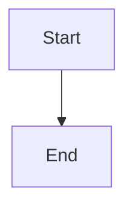

# What you can use in a post

Everything below works in `.mdx`. Almost all of it is plain markdown that Obsidian renders natively, so what you see while writing is close to what ships.

Snippets for the component-shaped ones are in `internal/templates/snippets/`. Run them from the command palette (Templater: Insert template) or bind the ones you use to a hotkey.

## Frontmatter

```yaml
---
title: "The title"          # required
pubDate: 2026-08-12         # required. A FUTURE date means scheduled
description: "One or two sentences."   # required, used for SEO and link previews
category: typescript        # required, exactly one
tags: [nodejs, testing]
draft: true                 # defaults to true, so you cannot publish by accident
---
```

Sections in use: `javascript`, `infra`, `typescript`, `career`, `opinion`, `meta`, `security`. A new value creates a new section page.

Optional: `updatedDate`, `heroImage`, `heroImageAlt`, `epigraph`, `epigraphCite`, `seoTitle`, `seoDescription`, `noindex`, `canonicalUrl`, `lang`.

For a series: `series` is a short slug that becomes the URL (`grpc`), `seriesOrder` is the position, and `seriesName` goes on the first part only. The table of contents generates itself, including parts you have not written yet.

## Images

Drop the file in the post's own folder. Paste a screenshot in Obsidian and it lands there.

```markdown


```

An image alone in a paragraph becomes a `<figure>`, and the title becomes the `<figcaption>`. Local images get resized and served as webp automatically.

Alt text describes the image for someone who cannot see it. When there is already a caption saying the same thing, leave alt empty rather than repeating it: a screen reader reads the caption anyway.

## Video and embeds

A YouTube or Vimeo URL alone on a line. Obsidian shows the player while you write:

```markdown


```

A tweet is a blockquote with the status link as its last line, so the quote survives if the embed does not:

```markdown
> The tweet text, pasted.
>
> — 
```

Any other URL alone on a line becomes a bookmark card if `bookmarks.json` has metadata for it, otherwise it stays a plain link.

An `.mp4` you host yourself needs the component, because it takes a poster frame:

```mdx
<Video src="/videos/my-post/clip.mp4" caption="Optional caption" />
```

## Callouts

Obsidian's own syntax:

```markdown
> [!NOTE]
> Something worth knowing.

> [!WARNING]
> Something that will bite you.
```

`NOTE`, `TIP`, `WARNING`, `CAUTION`, `IMPORTANT`.

## Code

Fenced blocks with a language. The title and highlight options come from expressive-code:

````markdown
```ts title="src/index.ts" {2-3}
const x = 1
const y = 2
const z = 3
```
````

Use a language the highlighter knows. `Dockerfile`, `output` and `ssh` are not in the bundle and render unhighlighted; use `dockerfile`, `text` and `bash`.

## Diagrams and maths

````markdown

````

Inline maths with `$E = mc^2$`, a block with `$$ ... $$`. Both render in Obsidian too.

## Notes in the margin

```mdx
Some claim in the text.<Sidenote>A numbered note that sits in the margin.</Sidenote>

Another sentence.<MarginNote>Same, but with no number.</MarginNote>
```

Inline content only: text, `**bold**`, `_italic_`, links, `code`. No headings, no lists, no blockquotes, they render inside a `<span>`.

On a narrow screen both collapse to a tap-to-reveal popover. No JavaScript either way.

## An epigraph

Either in frontmatter, which renders above the title:

```yaml
epigraph: "The quote."
epigraphCite: "Who said it"
```

Or inline anywhere in the body:

```mdx
<Epigraph cite="Who said it">The quote.</Epigraph>
```

## Footnotes

```markdown
A claim that needs a source.[^1]

[^1]: The source.
```

## Things to know

- **Every heading level counts.** Do not jump from `##` to `####`. The post title is already the page's `h1`, so start at `##`.
- **A post is a folder.** `blog/<slug>/index.mdx` plus its images. The folder name is the URL, so never rename it after publishing.
- **`draft: true` builds nothing.** Set it to `false` and push to publish.
- **A future `pubDate` schedules the post.** It appears on its own at that minute, once the scheduler is deployed.
- **The build never fetches anything.** A bookmark card only renders if its metadata was captured. New links stay plain links until someone adds them.
