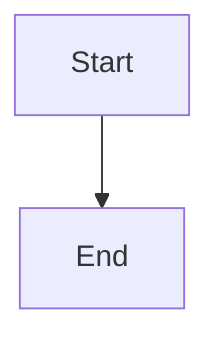

# What you can use in a post

Everything below works in `.mdx`. Almost all of it is plain markdown that Obsidian renders natively, so what you see while writing is close to what ships.

Snippets for the component-shaped ones are in `internal/templates/snippets/`. Run them from the command palette (Templater: Insert template) or bind the ones you use to a hotkey.

Every feature on this page is also demonstrated live at `/lab/` (`content/blog/lab/index.mdx`), source first and rendered result right below it. That page is `noindex`, so it never shows up in search or in the sitemap. When something here reads ambiguously, open the lab page instead.

## Frontmatter

```yaml
---
title: "The title"          # required
pubDate: 2026-08-12         # required. A FUTURE date means scheduled
description: "One or two sentences."   # required, used for SEO and link previews
category: typescript        # required, exactly one
tags: [nodejs, testing]
draft: true                 # defaults to true, so you cannot publish by accident
---
```

Sections in use: `javascript`, `infra`, `typescript`, `career`, `opinion`, `meta`, `security`. A new value creates a new section page.

A section can describe itself. `content/categories.json` maps a category to one or two sentences per language, which
show on the section page and become its meta description:

```json
{
  "javascript": {
    "pt": "A linguagem que eu mais escrevo, e a que mais me surpreende.",
    "en": "The language I write most, and the one that still surprises me."
  }
}
```

A bare string instead of the object is Portuguese, and English falls back to it. A category with no entry at all falls
back to a generated line, so adding a section still needs nothing but a post.

Optional: `updatedDate`, `heroImage`, `heroImageAlt`, `seoTitle`, `seoDescription`, `noindex`, `lang`, `slug`, `authors`.

`authors` is a list, written the way git writes an author, and the site part is optional:

```yaml
authors: ["Lucas Santos <https://lsantos.dev>", "Someone Else"]
```

Leave it out and the post is yours: the byline shows your name and links to your site. It is only worth writing for a
guest post or something co-authored.

For a series: `series` is a short slug that becomes the URL (`grpc`), `seriesOrder` is the position, and `seriesName` goes on the first part only. The table of contents generates itself, including parts you have not written yet.

## Another language

A translation is a second file in the same folder, named after its own slug.

```
blog/error-cause/
  index.mdx                                  <- source, lang defaults to pt, URL /error-cause/
  what-is-error-cause.mdx                    <- lang: en, URL /en/what-is-error-cause/
  image.png                                  <- shared by both
```

- `lang: "en"` is what makes it English. Nothing else.
- `slug: "what-is-error-cause"` sets the URL. Without it the filename is the slug.
- `machineTranslated: true` shows the banner offering the original. Set it to `false` once you have edited the text yourself and the banner goes away.
- Images stay `./image.png`, because the translation sits next to them.
- Being in the same folder is what pairs the two, so search engines get the `hreflang` links for free. There is no field to keep in sync.
- Copy `category`, `tags`, `series` and `seriesOrder` verbatim: they are URL segments, not prose.

## Images

Drop the file in the post's own folder. Paste a screenshot in Obsidian and it lands there.

```markdown


```

An image alone in a paragraph becomes a `<figure>`, and the title becomes the `<figcaption>`. Local images get resized and served as webp automatically.

Alt text describes the image for someone who cannot see it. When there is already a caption saying the same thing, leave alt empty rather than repeating it: a screen reader reads the caption anyway.

## Video and embeds

A YouTube or Vimeo URL alone on a line. Obsidian shows the player while you write:

```markdown


```

A tweet is a blockquote with the status link as its last line, so the quote survives if the embed does not:

```markdown
> The tweet text, pasted.
>
> — 
```

Slides and podcast episodes work the same way:

```markdown


```

Spotify also takes a `track`, `album`, `playlist` or `show` URL. For a Speaker Deck the URL has to be the
`/player/<id>` one, which is what the "embed" button on the deck gives you.

Any other URL alone on a line becomes a bookmark card if `bookmarks.json` has metadata for it, otherwise it stays a plain link.

**A new embed host needs one line**, in `src/lib/embed-hosts.ts`. The CSP and the build guard are both generated from
that file, so they cannot disagree. Embed something from a host that is not listed and the build fails, naming the
host and that file.

An `.mp4` you host yourself needs the component, because it takes a poster frame:

```mdx
<Video src="/videos/my-post/clip.mp4" caption="Optional caption" />
```

## Callouts

Obsidian's own syntax:

```markdown
> [!NOTE]
> Something worth knowing.

> [!WARNING]
> Something that will bite you.
```

Obsidian's whole vocabulary works, all twenty-odd types, `quote` included (see below). Each one keeps Obsidian's own
colour, except `TIP`/`HINT`, which go brand green, and `CAUTION`/`IMPORTANT`, brand red: Obsidian paints those the
same as `WARNING`, so four callouts read as two.

## Code

Fenced blocks with a language. The title and highlight options come from expressive-code:

````markdown
```ts title="src/index.ts" {2-3}
const x = 1
const y = 2
const z = 3
```
````

Use a language the highlighter knows. A handful of labels the old posts used (`Dockerfile`, `output`, `ssh`, `fortran`)
are aliased to real grammars in `astro.config.mjs`; anything else unknown renders unhighlighted, and the build says so.

You do not have to write `title`. If the first line is a comment that looks like a file path, it becomes the tab and
disappears from the code. A shebang does not, because a shebang is not a filename.

```ts
// src/index.ts
export const x = 1
```

Every block carries line numbers. Turn them off for one block with `showLineNumbers=false` on the fence.

The reader can change the syntax theme from an icon on any block, and the choice is remembered. Fourteen themes:
GitHub, Monokai, Dracula, the four Catppuccins, three Kanagawas, Ayu light and dark, and Snazzy.

## Diagrams and maths

````markdown

````

Inline maths with `$E = mc^2$`, a block with `$$ ... $$`. Both render in Obsidian too.

## Notes in the margin

```mdx
Some claim in the text.<Sidenote>A numbered note that sits in the margin.</Sidenote>

Another sentence.<MarginNote>Same, but with no number.</MarginNote>
```

Inline content only: text, `**bold**`, `_italic_`, links, `code`. No headings, no lists, no blockquotes, they render inside a `<span>`.

On a narrow screen both collapse to a tap-to-reveal popover. No JavaScript either way.

## A quote with an author

Epigraphs are gone: they were quotes under another name. A quote with an author is a `quote` callout whose title is the
author, which is what you already write in the vault, so it renders natively in Obsidian too.

```markdown
> [!quote] Phil Karlton
> There are only two hard things in computer science: cache invalidation and naming things.
```

Without an author it is an ordinary blockquote and the card comes without the author row.

```markdown
> Every abstraction leaks, sooner or later.
```

Either way the body is italic, the card carries a large quote mark behind the text, and a copy button puts the whole
thing on the clipboard as a citation ready to paste somewhere else.

## An interactive demo

A component that runs in the page lives in a `components/` folder next to the post, and takes one line:

```mdx
<LabDemo src="./components/Counter.vue" client:visible />
```

For a demo that is already a whole HTML page, script and style included:

```mdx
<HtmlLab src="./components/counter.html" title="a counter in plain HTML" />
```

No import to write and no filename repeated: the build reads the file, imports the component for you, and shows its
source under a `see the code` toggle, syntax highlighted like any other code block. A typo in `src` breaks the build
rather than rendering an empty box. The HTML one runs in a sandboxed frame, so its CSS cannot leak into the post.

A Vue component's styles go in `<style module>`, never `<style scoped>` or a bare `<style>`, and the template refers
to classes as `:class="$style.stage"`. The build renames every class to `Component__class__hash`, so a demo can call
something `.tag` or `.title` without ever colliding with the site's own CSS. Two rules follow from how CSS modules
work: every selector needs a class in it (a bare `button { }` would style every button on the page — nest it, e.g.
`.controls button`), and a static `class="x"` where `x` is defined in the style block matches nothing, because the
rule was renamed and the attribute was not. `npm run check` fails on all three mistakes and says which.

## Images from somewhere else

Paste the remote URL and forget about it. `npm run build` runs `scripts/vendor-media.ts` first, which downloads any
remote image, video or audio a post references into the post's own folder and rewrites the reference to `./thefile.png`.
It applies to `heroImage` too.

That means a post depends on nobody else's server once it has been built once. Commit the downloaded file along with
the post.

If a download fails the build carries on, the post keeps the remote URL, and the file is listed in
`.migration/unreachable-media.md` with a link to the post, so it can be chased by hand later. Nothing breaks because a
host is down.

A URL inside a code fence is left alone, so an example image reference in a snippet is never downloaded or rewritten.

## Linking to another post

Write a wikilink. Obsidian autocompletes it and the graph view picks it up, and the site turns it into an
ordinary link.

```markdown
[[error-cause]]
[[error-cause|read the one about error.cause]]
[[error-cause#Conclusão]]
```

The target is the post's folder name. Without a label the link takes the target post's own title. An anchor
matches the heading text, accents included.

- **A wikilink to a post that does not exist fails the build**, naming the file and the missing folder. That is
  deliberate: a typo cannot reach the site.
- **A wikilink to a draft still links**, in Wikipedia's red, with the words in a tooltip rather than in the sentence.
  The series table of contents marks an unwritten part the same way, and hovering the link says so instead of showing
  a preview.
- **Code is never touched.** `[['a', 'b']]` in a snippet or inline code stays exactly that.
- **Wikilinks work between posts only.** They cannot point at a note elsewhere in a vault, because that note has
  no URL here.

## Footnotes

```markdown
A claim that needs a source.[^1]

[^1]: The source.
```

On a wide screen the note is read in the margin, beside the paragraph that cites it, and the usual list at the foot of
the post is hidden. On a narrow screen, and on paper, that list is what the reader gets instead. Nothing to write
either way.

## Things to know

- **Every heading level counts.** Do not jump from `##` to `####`. The post title is already the page's `h1`, so start at `##`.
- **A post is a folder.** `blog/<slug>/index.mdx` plus its images. The folder name is the URL, so never rename it after publishing.
- **`draft: true` builds nothing.** Set it to `false` and push to publish.
- **A future `pubDate` schedules the post.** It appears on its own at that minute, once the scheduler is deployed.
- **The build never fetches anything.** A bookmark card only renders if its metadata was captured. New links stay plain links until someone adds them.
