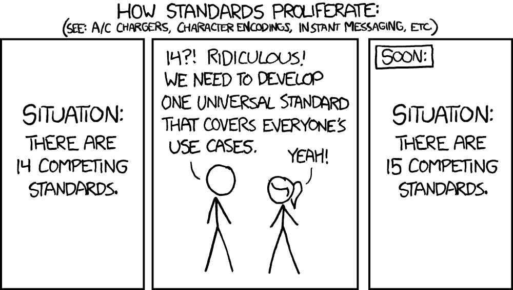
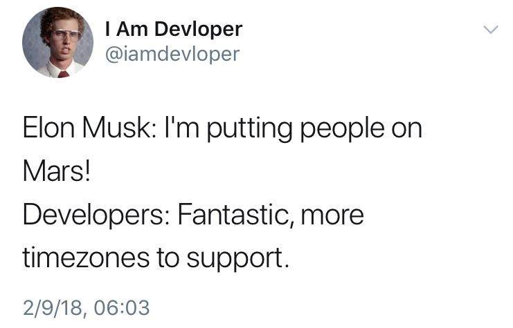

There's a famous phrase in the world of computing that goes like this:

> There are only two hard things in computer science: cache invalidation and naming things.

That phrase was said by Phil Karlton a long time ago, and it's still just as true today.

After reading [this fantastic article](https://blog.frankel.ch/hard-things-computer-science/) by Nicolas Fränkel, an experienced software engineer, I decided to throw in my two cents on some of these topics and share my own take on why I think they're hard in our field.

This is going to be an article full of _personal opinions_, so that doesn't mean I'm completely right or completely wrong about anything, much less that you should blindly follow my words here (please don't), but I'm simply putting down my experience in the field and everything I've been through so I can do something I really enjoy: writing about technology.

## Computing, in general, is hard

Before I get into the actual techniques and things I find most complex about computing, I want to give you an introduction to computing itself.

First of all, there are countless people out there selling the idea that everything in computing is easy, that you can learn everything you need and be fully market-ready in under a year. While that might be true for _some people_, the vast majority of us don't have that gift, and it's not because we have some kind of intelligence problem, it's because **computing really is hard**.

Concepts that devs consider basic and simple, like manipulating lists, memory allocation, loops, messaging, asynchronicity, and so on, are actually extremely complicated by nature. That's why, if you're learning, you should never give up just because "everyone already knows this and I don't." There will always be something you don't know, and computing demands constant study.

On top of that, I personally believe most of the technical concepts everyone claims are hard end up being a temporary thing, meaning you learn how the concept works and you'll never forget it again. The points I'm going to bring up here, both the technical and the non-technical ones, are problems you simply can't fully learn because they're not "teachable."

I say that because you can know a lot about them, but precisely because these concepts are so broad and so fundamental, there's no way to simply know everything there is to know, because they'll always change depending on what we're doing at the time, the era we're living in, and the applications we're building. So there's no single answer or silver bullet, just like anything in computing, everything **depends**.

### Naming things

Since I started programming, I haven't met a _single person_ who says naming something in development is easy. That's mainly because everyone has a different notion of what's "right" when it comes to naming a variable or a concept.

If you haven't been through this yet, let me share two incredible quotes I've read over the years that, coincidentally (or not), also showed up in the article I mentioned. The first one was said by **Donald Knuth**, one of the creators of UML and a prominent software engineer who dedicated his entire life to, basically, naming things:

> Programs must be written for people to read, and only incidentally for machines to execute. – Donald Knuth

That's one of the truest phrases I've ever seen, and I disagreed with it a lot in my first 2 years as a dev because I thought my code should be as close as possible to what the machine would read, since that would make me _A BeTtEr DeV_, and, clearly, that's not how the world works.

For example, I could show you this here:

```js
function f (t) {
  if (t <= 1) return 1
  return f(t-1) + f(t-2)
}
```

Very pretty, very techy, but completely unreadable. Most people who have been coding for a while will figure out this is a function to calculate the Nth Fibonacci term, but only because, at some point in their dev life, they had to write this function themselves. Someone who's never seen it will be completely lost about what's happening, especially since it's a recursive function, which is another one of those concepts every dev takes for granted but that isn't actually that simple.

What if it were written like this instead:

```js
function fibonacci (term) {
  if (term <= 1) return 1
  return fibonacci(term - 1) + fibonacci(term - 2)
}
```

Much easier, but less _HaCkEr_. When you work in software development, infrastructure, or **absolutely any kind of team work**, you need to understand that your code isn't only going to be read by the machine, but also by the people who are part of your team. And the easier it is for those people to understand what you did, the easier it'll be for them to maintain it and suggest new ideas. Another really interesting quote I've heard and read in various forms is this one from our ever-present Martin Fowler:

> Any fool can write code that a computer can understand. Good programmers write code that humans can understand. – Martin Fowler

Another point, one I fully agree with in the article I cited in the first paragraph, mainly because I've been through the same situation countless times (and still go through it today), is that naming failures generally happen in one of two ways:

1.  Using different expressions to describe the same concept
2.  Using the same expression to describe different concepts

Both are equally awful to work with. The first one is bad because the concept you're trying to convey ends up getting lost and nobody knows what the other person is talking about anymore, which is particularly common in larger companies where different teams have to deal with the same idea, each within their own space.

An example I run into daily while working at a fintech is the concept of "Authorization" on credit cards. That's because, for end customers, the idea of authorizing a charge isn't widely known, only the charge itself. So when we have to talk to customer support teams, we run into problems because we say "authorization" and they say "hold" without realizing they're the same thing. Beyond making communication harder, this makes any situation take at least twice as long to resolve, because you first need to settle on a shared understanding between both sides before you can even start working on the actual problem.

The second case is much more serious, because the shared understanding is already there, except each side imagines they're talking about something different, and when it's time to put it into practice, nothing comes out as planned.



That's one of the most interesting things [gRPC](/guia-grpc-1/) tries to solve, at least in part, mainly through the use of indices to describe a field's position instead of using the field name to identify the data (on top of the significant space savings).

Finally, there's the eternal problem of _variable casing_, which will never be solved because some people prefer `camelCase` while others prefer `snake_case`. In some cases, the problem runs deeper, with legacy systems that don't accept different casings, in other cases we have an internal communication problem. Either way, it's the same situation as tabs vs spaces (except that one at least has some kind of benefit).

The bottom line is that you need to get your message across clearly and concisely, while still being descriptive enough.

### Dates, times, and time zones

I'm a huge fan of the topic "how humans measure time," both in computing and physically. That's because the concept of time is the same as the concept of money, it doesn't exist precisely, it's an agreement that (almost) all of humanity made to say that a day is one rotation, a year is one orbit, and a month is a set of 28, 29, 30, or 31 days.

Especially when we're talking about time, we have to understand that the "time" dimension itself is precise and immutable, but the measurement we make of that dimension is completely chaotic and confusing.

For us to have a meaningful measurement, meaning one that actually means something to someone, we need:

-   A date with day, month, and year
-   A time with hours, minutes, and the time zone

Without any of the pieces that make up these measurements, the information is incomplete. For example, a day without a month raises the question "which month?", and an hour without a time zone, when we're dealing with multiple countries, raises the question "but what time zone is this hour in?"

This is such a big problem, at least for me, that I'm going to split it into two parts.

#### Calendars

The biggest problem with measuring time is that it's so fundamental that a ton of important systems depend on it, but at the same time it's so confusing that there's no way to create an exact rule, because there are always exceptions to whatever you're doing. The biggest example of this, without a doubt, is the calendar.

Some months have 30 days, others have 31, and only one of them has 28 days, but it can have 29 every 4 years. The logic behind the count is solid and makes sense, but we could have been more efficient and split the months into 28 days each, adding an extra month ([this has already been proposed and discussed](https://pt.wikipedia.org/wiki/Calend%C3%A1rio_Fixo_Internacional)).

Calendars can also differ depending on the country you're in. For example, we use the Gregorian calendar, implemented by Pope Gregory, but this implementation happened at different points in history in different countries. Others, like China, use their own calendar that's based on neither the Julian nor the Gregorian model.

Other countries use the Hebrew calendar, which is more or less similar but with a very different way of counting time, and that's where the hardest question of all comes up:

> How do you build a global system that works across different parts of the world and accommodates and/or converts different ways of counting time?

This has a huge influence on every kind of system we build, especially on the time estimates for finishing those systems.

#### Time zones

Time zones are probably the most complicated thing any human being takes for granted in their life.

Whenever I think about time zones, this amazing image comes to mind:



Time zones are even more complicated than calendars because measuring days, months, and years is more precise, the Earth spins and that defines a day, full stop. Now, dividing that day into hours is much more complicated, because **time of day isn't as constant as dates are**.

The same point in time can have a different hour depending on where you are on the globe. 10 AM in Brazil is not 10 AM here in Sweden, quite the opposite, here the morning is long gone by then.

But we also can't define the day just as "from sunrise to sunset," because at higher latitudes, like Sweden itself, days (periods with daylight) are actually much longer in the summer and much shorter in the winter, with stretches where [the Sun never sets](https://en.wikipedia.org/wiki/Midnight_sun).

So how do we keep everyone happy? By creating a division of time zones. The math is simple: the Earth is a globe, it has 360º of circumference, if we divide 360 by the 24 hours in a day, we get 15º. Simple enough, right? Just add one hour for every 15º we cross on the globe.

Well, it doesn't quite work like that. We figured out it would be a much bigger problem for certain places if the time zone lines were exactly straight, as they should be. Some countries would end up with dozens of time zones, others would have half the country on one day and the other half on the next, and all sorts of chaos, so we **bent the lines**.

This means most countries aren't in a geographic position that matches their time zone. Some implement daylight saving time, others don't, so countries in the same time zone can end up an hour apart because of it. In the worst case, like Brazil, the country used to have daylight saving time and now it doesn't.


On top of that, something rarer but that still happens with some regularity is countries changing their own time zones (since it's all made up anyway, why not complicate it further), and the cherry on top is time zones that don't follow the rule at all. India, for instance, has a UTC+5:30 offset, even though every time zone is supposed to be a whole hour wide.

What I'm trying to say here is that the way we count time is chaotic as it is, and we keep adding exceptions on top of that count.

### Estimates

Estimates are a complex and controversial subject in the software development world, mainly because everyone's always trying to nail down the best date with 100% precision, meaning saying something will be ready by a certain date and it actually being ready by that date.

Reality isn't that simple. Estimating something is trying to guess when things are going to happen. Every estimate is a guess, no matter how much data you have, it's still a guess unless you can predict the future and every problem a project not only **can** have but **will** have.


One of the coolest things about the article I cited is that it compares estimates to things that aren't software. Most people are tempted to compare building a complex system to building a house or a building. We have a pretty good idea of how and when things will be ready in the construction industry, but even so there's a huge number of buildings that get delivered late, even though humans have been building buildings for thousands of years. So why is it different?

The big problem with development is that it's very easy to customize something. The cost of customizing an entire system for a single purpose is very low compared to the cost of building something physical that serves a single purpose.

> Interestingly, I think the comparison to civil construction is actually much closer to hardware infrastructure than to software, because in both cases you have something physical that can't be easily changed.

Something every estimate fails spectacularly to predict is the problems we run into throughout a project's development. We know about things that could happen, but we don't know if they will actually happen, and yet we can still prepare for them. Now, what about the things we don't even know could happen? There's no way to prepare for something we don't know about.

And that's why estimates fail. Estimates would be a fantastic tool if we could tell a client that an estimate isn't a final deadline, but unfortunately we're so conditioned to hear a _deadline_ that we treat every estimate as one, even knowing that it isn't.

### Testing and guarantees

Following on from estimates come testing and the famous "it works" guarantees. Nobody (or, at least, very few people) is deliberately trying to introduce bugs into their code, everyone wants to see their code work, wants to see the system running without errors and without headaches.

That's exactly why, in the same way we can't estimate a delivery date, there's no way to guarantee that any piece of software will work exactly the way it was meant to work, because we don't know what bugs are going to show up in it.

Unless the system is really simple, it's impossible to say with 100% certainty that nothing will go wrong during that product's entire lifetime.

> "But I write automated tests: integration, unit, end-to-end, and mutation tests"

Congratulations! You're one step closer to being able to guarantee with more confidence that your system works, but still, even at big companies, the number of bugs per line of code written is still absurdly high, **even with automated tests**, and we forget that the ones who introduce bugs into the code are us, the very same people who write the tests.

### Distributed computing

This is such a complex subject that there are [entire courses](https://youtube.com/playlist?list=PLeKd45zvjcDFUEv_ohr_HdUFe97RItdiB) just about how to distribute computing tasks across multiple processors.

Distributed computing, to level everyone's understanding, is what happens when we hit the limit of what we can do with a single computer, and we can do a lot. Once we hit that point, the only solution is to spread the load across multiple computers, we call this _load balancing_, and it's one of the many concepts in **distributed computing**.

Quoting the article itself (which cites [a source from Wikipedia](https://en.wikipedia.org/wiki/Fallacies_of_distributed_computing)), we get distributed computing wrong a lot because there's a set of things we assume when we work with it:

1.  The network is reliable
2.  Latency is zero
3.  Bandwidth is infinite
4.  The network is always secure
5.  Networks never change
6.  There's only one administrator
7.  Transport cost is zero
8.  The network is homogeneous

While some of these fallacies are less relevant for smaller systems, all of them make a lot of sense once we're talking about any system that needs to communicate across a somewhat longer distance.

In the article I cited, the author shows two big problems: **dual writes** and **leader election**. I'm going to add one more: **event-driven communication**.

#### Dual writes

The dual write problem is getting more and more common these days because of how distributed most systems have become. It's the problem that comes up when you have two separate data stores and you need to keep the same state between both of them.

This is very common in queueing systems and distributed databases like Elasticsearch, which depend on multiple parties staying in agreement to produce a satisfactory result. Many of these systems implement models like [two-phase commit](https://en.m.wikipedia.org/wiki/Two-phase_commit_protocol) to guarantee overall consistency across the parts.

Under the [CAP theorem](https://en.wikipedia.org/wiki/CAP_theorem), we can only have two out of three properties in a distributed system: consistency, availability, or partition tolerance.

As the article I cited points out well, this isn't really much of a choice once you move into the world of distributed computing, since the entire system is distributed, we have to pick partition tolerance, because we can't have a system that's distributed without tolerating working across partitions.

That leaves us with two more choices: our system ends up either _available_ or _consistent_. And it's fine to choose consistency in cases where availability isn't the biggest concern, but in 99% of cases that's not what happens, because other systems depend on a given system always being available, so we have to sacrifice consistency instead.

The way we typically deal with a lack of availability is by implementing a queue system that receives requests and stores the data that couldn't be processed by the main system.

In the consistency case, the idea is to accept that we won't have a consistent state **all the time**, but rather **at some point in the future**, the term used for this is **eventual consistency**. There are countless ways to implement it, and none of them are trivial or risk-free.

#### Leader election

I'm not going to go too deep into this topic since I don't have in-depth knowledge of it right now, but let's just say this is a complex problem both in computing and outside of it.

Distributed systems generally work based on a leader, someone who calls the shots and decides who does what. But since the leader is also just another instance of the system, it's subject to failures. And when a leader goes down, another one needs to be picked, and at that point every partition of the system needs to reach **consensus**.

Both in computing and in public policy, reaching consensus is really hard, just look at elections in any country. In software it's a bit easier, but we still have super complex algorithms like [Paxos](https://en.wikipedia.org/wiki/Paxos_\(computer_science\)) and [Raft](https://en.wikipedia.org/wiki/Raft_\(algorithm\)) that try to solve the problem.

Another kind of network that solves this problem well is blockchain, so much so that there are completely different consensus systems in networks like Bitcoin and Ethereum, for example.

#### Event-driven communication

The cherry on top of distributed computing is emitting and receiving events. While the concept itself is fairly straightforward, the idea of asynchronicity isn't something our brains are naturally good at.

This is so true that I [have a whole series of articles just about Promises](https://dev.to/_staticvoid/series/199311). For some reason, our brains seem to have a huge amount of trouble grasping the concept of asynchronicity, and distributed computing is basically entirely event-driven.

Events can happen at the same time, at different times, they may or may not have an order, meaning they're complex systems mainly because one shouldn't depend on another, and each event should be indifferent to whatever happened before or after it. Up to here it all sounds easy enough, but the big problem is building an **orchestrator** for these events. That's the system that needs to understand which event should produce what, and in what order they should run. On top of that, the orchestrator needs to be responsible for implementing a dead letter queue (DLQ) for events that didn't succeed, and also a retry system for re-queueing messages that, for whatever reason, can't be processed right now.

We understand events pretty well, the problem is that understanding that all of this I just described happens _at the same time_ seems to escape our reality and turns into a paradox in our brains. This is the main reason distributed systems in general aren't well implemented, and why [microservices](https://medium.com/@khaosdoctor/microservi%C3%A7os-dos-grandes-mon%C3%B3litos-%C3%A0s-pequenas-rotas-fbfd4ee99f36) fail so spectacularly in some implementations.

What makes this topic even harder is that, since everything is asynchronous, we only notice something went wrong much later, mostly because of the buildup of messages or even the number of errors piling up in the system's states.

This topic also brings up another pretty complex subject in computing: **race conditions**. This happens when an action depends on a certain sequence of events to happen a certain way, such that if that sequence gets broken, the result changes. For example, if we have a counter that receives a call to read and another to increment, if the increment call runs before the read, we'll get a different output than if the read had happened before the increment.

### Conclusion

These topics are some of what I consider complex subjects in computing, some have solutions, others don't. And, for sure, some are more complex than others, but all of them are hard in their own way, what matters is that we keep digging deeper and studying each one of these topics.
