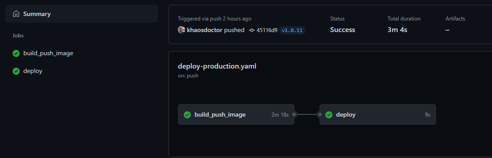
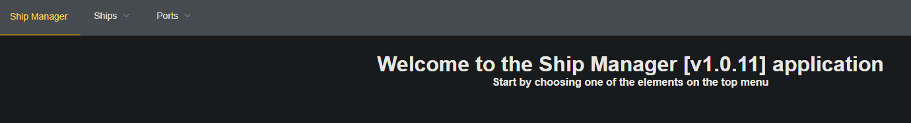

How to optimize a test pipeline so teams don't run into concurrency problems when testing their features and modules is a subject that keeps coming up, both in stuff I've covered in the past and more recently.

I've actually given a few talks on the subject already, and I even have [a sample repository](https://github.com/khaosdoctor/helm-dynamic-envs/) using [Azure DevOps](https://dev.azure.com/?WT.mc_id=containers-12314-ludossan) as the CI tool. You can check out the slides and the video below!


So here's the question: how do we let multiple dev teams test their features in a completely separate environment, quickly and easily?

The answer, of course, is **containers**. When you combine Kubernetes with Helm and a CI tool, you can do a lot of things dynamically. In this article, I'm going to update my previous talk and show the same application, but this time running on a GitHub Actions pipeline. To make the scenario more realistic, we'll use [Azure](https://azure.microsoft.com?WT.mc_id=containers-12314-ludossan) with [Azure Kubernetes Service](https://azure.microsoft.com/services/kubernetes-service/?WT.mc_id=containers-12314-ludossan), pulling images from a [private Azure Container Registry](https://azure.microsoft.com/services/container-registry/?WT.mc_id=containers-12314-ludossan) already privately integrated with the cluster. All the data will be stored in a Mongo-flavored [CosmosDB](https://azure.microsoft.com/services/cosmos-db/?WT.mc_id=containers-12314-ludossan).

Let's go!

## Before we start

We'll have to set up the environment before I can show you how the dynamic part works. Since that's not really the point of this post, I'll just leave the command references for what we're doing here, but you can find all the documentation you need directly in each service's docs.

First, you need an [Azure](https://azure.microsoft.com?WT.mc_id=containers-12314-ludossan) account. Once you have one, install the [Azure CLI](https://docs.microsoft.com/cli/azure/install-azure-cli?WT.mc_id=containers-12314-ludossan), since we're only going to use the command line.

The first command is `az login`, to log in to your account and pick which subscription you'll use to create the resources. Once you're logged in, let's start by creating the first resource: the resource group.

```bash
az group create -l eastus -n ship-manager-pipeline
```

Now let's create our ACR so we have somewhere to store our images:

```bash
az acr create -n shipmanager --sku Basic -g ship-manager-pipeline
```

Wait until the CR is created, then run the following command to enable login via username and password. That's the only way our CI will be able to log in and build the images:

```bash
az acr update -n shipmanager --admin-enabled true
```

Now let's move on to CosmosDB. A single command creates the whole structure:

```bash
az cosmosdb create --kind MongoDB -n ship-manager-db -g ship-manager-pipeline
```

This command takes a bit longer to run, so be patient. It's worth saying that, as amazing as CosmosDB is, it's not really recommended for this specific case of spinning up databases for ephemeral environments like these, since it's more complex to tear down later. But to keep things simple, we'll use it anyway, and we'll look at alternatives to this approach later in the article.

Finally, let's create our AKS, which ties everything together:

```bash
az aks create -n ship-manager -g ship-manager-pipeline \
--enable-addons http_application_routing \
--attach-acr shipmanager \
--vm-size Standard_B2s \
--generate-ssh-keys \
--node-count 2
```

This creates our AKS already attached to the ACR, so we don't need to create a secret in every namespace with our Docker login file to pull images, and we don't need to bind a service account either.

Grab the AKS credentials with the following command:

```bash
az aks get-credentials -n ship-manager -g ship-manager-pipeline --admin
```

Keep in mind you need `kubectl` installed on your machine for this command to work. If you don't have it, run `az aks install-cli` to install it.

## Creating the chart

The first step in building the pipeline is figuring out how it's going to work. To start, we'll only deal with two environments: the first is production, the second is test.

The production environment gets published whenever a push with a `v*` tag happens. The test environment gets published on a push to any other branch that isn't `master` or `main` (depending on the case).

So you can follow along, I've put together [this sample repository](https://github.com/khaosdoctor/helm-actions-dynamic-env-example), which has both the application code and the actions code.

> [!TIP]
> If you want to follow along step by step, fork the repository, but don't forget to remove the `.github` folder so the actions get removed too.

Before creating the pipeline files, let's create the Helm files so we can build our chart! Create a folder called `kubernetes` at the root of the repository, then create a second folder called `ship-manager`.[^n1]

Inside the `ship-manager` folder, create two more folders: `templates` and `charts`. Now create two files at the same level as the `templates` folder: one called `Chart.yaml` and the other `values.yaml`.

Now, go into the `charts` folder, create a `backend` folder inside it, and inside that one add a `Chart.yaml` file plus a `templates` folder.

The final structure should look like this:

```
kubernetes
└── ship-manager
    ├── Chart.yaml
    ├── charts
    │   └── backend
    │       ├── Chart.yaml
    │       └── templates
    │
    ├── templates
    └── values.yaml
```

In the `Chart.yaml` file inside the `ship-manager` folder, let's write the following:

```yml
apiVersion: v2
name: ship-manager
description: Chart for the ship manager app
version: 0.1.0
```

And the one in the `backend` folder will look like this:

```yml
apiVersion: v2
name: backend
description: Chart for the backend part of the ship manager app
version: 0.1.0
```

What we just did was create Helm's equivalent of a `package.json`: the file that defines the package we're going to install on our cluster.

Helm works based on a hierarchy, and what we just created here is a dependency order. In other words, we just said that the frontend of the application, which lives in `ship-manager`, depends on a backend located in the `charts` folder. If we created another `charts` folder inside `backend`, we'd be saying the backend depends on that one, and so on. This way, with a single command, Helm installs all the dependencies in order for us.

Let's create our first template. Create a `frontend.yaml` file inside the `templates` folder that's inside `ship-manager`. This template is what actually gets created inside the cluster. In it, we'll have all the Kubernetes resources, starting with the Deployment:

```yml
apiVersion: apps/v1
kind: Deployment
metadata:
  name: ship-manager-frontend
spec:
  replicas: 1
  selector:
    matchLabels:
      app: ship-manager-frontend
  template:
    metadata:
      labels:
        app: ship-manager-frontend
    spec:
      containers:
        - image: {{ required "Registry is required" .Values.global.registryName }}/{{ required "Image name is required" .Values.frontend.imageName }}:{{ required "Image tag is required" .Values.global.imageTag }}
          name: ship-manager-frontend
          resources:
            requests:
              cpu: 100m
              memory: 128Mi
            limits:
              cpu: 250m
              memory: 256Mi
          ports:
            - containerPort: 8080
              name: http
          volumeMounts:
            - name: config
              mountPath: /usr/src/app/dist/config.js
              subPath: config.js
      volumes:
        - name: config
          configMap:
            name: frontend-config
```

Notice we're using Helm placeholders to mark the parts that can change, and that's exactly what makes all of this possible. Creating environments and changing variables at CLI time, instead of after compiling, means we can pass whatever values we want to those variables when we create the environment.

Next, we have the rest of the configuration:

```yml
apiVersion: v1
kind: Service
metadata:
  name: ship-manager-frontend
spec:
  selector:
    app: ship-manager-frontend
  ports:
    - name: http
      port: 80
      targetPort: 8080
---
apiVersion: networking.k8s.io/v1beta1
kind: Ingress
metadata:
  name: ship-manager-frontend
  annotations:
    kubernetes.io/ingress.class: addon-http-application-routing
spec:
  rules:
    - host: {{ default "ship-manager-frontend" .Values.frontend.ingress.hostname }}.{{ .Values.global.dnsZone }}
      http:
        paths:
          - path: /
            backend:
              serviceName: ship-manager-frontend
              servicePort: http
---
apiVersion: v1
kind: ConfigMap
metadata:
  name: frontend-config
data:
  config.js: |
    const config = (() => {
      return {
        'VUE_APP_BACKEND_BASE_URL': 'http://{{ default "ship-manager-backend" .Values.backend.ingress.hostname }}.{{ .Values.global.dnsZone }}',
        'VUE_APP_PROJECT_VERSION': '{{ .Values.global.imageTag }}'
      }
    })()
```

Notice I'm pulling everything from `.Values`. That's the `values.yaml` file we'll get to shortly. Also notice that most of the things that can and should change, like the image name, the tag, the hostname, and the database, are variables too.

In these cases, using configmaps and secrets goes a long way toward keeping the pipeline simple.

The final file looks like this:

```yml
apiVersion: apps/v1
kind: Deployment
metadata:
  name: ship-manager-frontend
spec:
  replicas: 1
  selector:
    matchLabels:
      app: ship-manager-frontend
  template:
    metadata:
      labels:
        app: ship-manager-frontend
    spec:
      containers:
        - image: {{ required "Registry is required" .Values.global.registryName }}/{{ required "Image name is required" .Values.frontend.imageName }}:{{ required "Image tag is required" .Values.global.imageTag }}
          name: ship-manager-frontend
          resources:
            requests:
              cpu: 100m
              memory: 128Mi
            limits:
              cpu: 250m
              memory: 256Mi
          ports:
            - containerPort: 8080
              name: http
          volumeMounts:
            - name: config
              mountPath: /usr/src/app/dist/config.js
              subPath: config.js
      volumes:
        - name: config
          configMap:
            name: frontend-config
---
apiVersion: v1
kind: Service
metadata:
  name: ship-manager-frontend
spec:
  selector:
    app: ship-manager-frontend
  ports:
    - name: http
      port: 80
      targetPort: 8080
---
apiVersion: networking.k8s.io/v1beta1
kind: Ingress
metadata:
  name: ship-manager-frontend
  annotations:
    kubernetes.io/ingress.class: addon-http-application-routing
spec:
  rules:
    - host: {{ default "ship-manager-frontend" .Values.frontend.ingress.hostname }}.{{ .Values.global.dnsZone }}
      http:
        paths:
          - path: /
            backend:
              serviceName: ship-manager-frontend
              servicePort: http
---
apiVersion: v1
kind: ConfigMap
metadata:
  name: frontend-config
data:
  config.js: |
    const config = (() => {
      return {
        'VUE_APP_BACKEND_BASE_URL': 'http://{{ default "ship-manager-backend" .Values.backend.ingress.hostname }}.{{ .Values.global.dnsZone }}',
        'VUE_APP_PROJECT_VERSION': '{{ .Values.global.imageTag }}'
      }
    })()
```

Let's do the same thing with the backend, creating a `backend.yaml` file in the `charts/backend/templates` folder:

```yml
# backend.yaml
apiVersion: apps/v1
kind: Deployment
metadata:
  name: ship-manager-backend
spec:
  replicas: 1
  selector:
    matchLabels:
      app: ship-manager-backend
  template:
    metadata:
      labels:
        app: ship-manager-backend
    spec:
      containers:
        - image: {{ required "Registry is required" .Values.global.registryName }}/{{ required "Image name is required" .Values.imageName }}:{{ required "Image tag is required" .Values.global.imageTag }}
          name: ship-manager-backend
          resources:
            requests:
              cpu: 100m
              memory: 128Mi
            limits:
              cpu: 250m
              memory: 256Mi
          ports:
            - containerPort: 3000
              name: http
          env:
            - name: DATABASE_MONGODB_URI
              valueFrom:
                secretKeyRef:
                  key: database_mongodb_uri
                  name: backend-db
            - name: DATABASE_MONGODB_DBNAME
              value: {{ default "ship-manager" .Values.global.dbName }}
---
apiVersion: v1
kind: Service
metadata:
  name: ship-manager-backend
spec:
  selector:
    app: ship-manager-backend
  ports:
    - name: http
      port: 80
      targetPort: 3000
---
apiVersion: networking.k8s.io/v1beta1
kind: Ingress
metadata:
  name: ship-manager-backend
  annotations:
    kubernetes.io/ingress.class: addon-http-application-routing
spec:
  rules:
    - host: {{ default "ship-manager-backend" .Values.ingress.hostname }}.{{ .Values.global.dnsZone }}
      http:
        paths:
          - path: /
            backend:
              serviceName: ship-manager-backend
              servicePort: http
---
apiVersion: v1
kind: Secret
metadata:
  name: backend-db
type: Opaque
stringData:
  database_mongodb_uri: {{ required "DB Connection is required" .Values.global.dbConn | quote }}
```

Notice I'm also using a few functions, like `required`, `default`, and `quote`. These are [native Helm functions](https://helm.sh/docs/chart_template_guide/function_list/) and they really save the day when you need more complex functionality.

### The values file

Just like the charts, the `values.yaml` file is based on a hierarchy of scopes. Take our structure as an example:

```yml
# values.yaml
global:
  chave: # Accessible to all charts, both frontend and backend, as `.Values.global.chave`

backend:
  chave: # Accessible only to frontend and backend, but for frontend it's `.Values.backend.chave` and backend uses it as `.Values.chave`

frontend:
  chave: # Accessible by frontend as `.Values.frontend.chave`, but not by backend

chave: # Accessible only to frontend as `.Values.chave`
```

Notice there's a scope break inside the values file. Keys that share a name with their dependent charts are only accessible to those charts and to higher-order charts. Since our frontend is the highest-order chart, it has access to all the values, while the backend only has access to the keys defined under `backend:`.

Also notice that inside `backend` the scope gets "leveled", meaning the scope gets stripped from inside `backend`. So you don't need to access the value as `.Values.backend.chave` if you're inside the `backend` chart, just as `.Values.chave`.[^n2]

Our values file needs the same keys we defined inside our templates, so they'll look like this:

```yml
global:
  registryName:
  imageTag:
  dbName: ship-manager
  dbConn:
  dnsZone:

backend:
  imageName: ship-manager-backend
  ingress:
    hostname:

frontend:
  imageName: ship-manager-frontend
  ingress:
    hostname:
```

The keys I'm leaving blank are the ones that will get filled in either by the CLI or by the `default` functions.

## Creating the pipeline

To create the pipeline, we'll go the manual route: create a `.github` folder, and inside it a `workflows` folder. The first workflow will be the simplest one, production.

Inside the `workflows` folder, let's create a `deploy-production.yml` file (it can honestly be any name) and start by writing the name of our pipeline and the triggers that will make it run.

```yml
name: Build and push the tagged build to production

on:
  push:
    tags:
      - 'v*'
```

Here we're saying our action runs on every push with a `v*` tag, meaning `v1.0.0` and even `vabc`. If you want to narrow the possibilities down, you can use a regex like `v[0-9]\.[0-9]\.[0-9]`.

Next, let's create our first job and define a shared variable:

```yml
name: Build and push the tagged build to production

on:
  push:
    tags:
      - 'v*'

env:
  IMAGE_NAME: ship-manager

jobs:
  build_push_image:
    runs-on: ubuntu-20.04
```

We created a job called `build_push_image` that runs on Ubuntu 20, plus a shared variable that will be the image's base name. Now let's get to the actual action: let's start creating our job's steps, beginning with two super important ones:

```yml
name: Build and push the tagged build to production

on:
  push:
    tags:
      - 'v*'

env:
  IMAGE_NAME: ship-manager

jobs:
  build_push_image:
    runs-on: ubuntu-20.04

    steps:
      - uses: actions/checkout@v2

      - name: Set env
        id: tags
        run: echo tag=${GITHUB_REF#refs/tags/} >> $GITHUB_ENV
```

The first step is a checkout of our repository. It's present in practically every action and it's always the first step. The second one defines a second variable: the tag name.

By default, `$GITHUB_REF` is either the branch name or the tag name, like `/refs/heads/main` or `/refs/tags/v1.0.0`. We need to strip out the `/refs/*` part and keep only what's left, so we're using a shell substitution to add it to the global variables. Note that this variable only works **inside this job**.[^n3]

Now let's build the Docker part of the pipeline: building and pushing the backend and frontend images.

```yml
name: Build and push the tagged build to production

on:
  push:
    tags:
      - 'v*'

env:
  IMAGE_NAME: ship-manager

jobs:
  build_push_image:
    runs-on: ubuntu-20.04

    steps:
      - uses: actions/checkout@v2

      - name: Set env
        id: tags
        run: echo tag=${GITHUB_REF#refs/tags/} >> $GITHUB_ENV

      - name: Set up Buildx
        uses: docker/setup-buildx-action@v1

      - name: Login to ACR
        uses: docker/login-action@v1
        with:
          # Username used to log in to a Docker registry. If not set then no login will occur
          username: ${{secrets.ACR_LOGIN }}
          # Password or personal access token used to log in to a Docker registry. If not set then no login will occur
          password: ${{secrets.ACR_PASSWORD }}
          # Server address of Docker registry. If not set then will default to Docker Hub
          registry: ${{ secrets.ACR_NAME }}

      - name: Build and push frontend image
        uses: docker/build-push-action@v2
        with:
          # Docker repository to tag the image with
          tags: ${{secrets.ACR_NAME}}/${{ env.IMAGE_NAME }}-frontend:latest,${{secrets.ACR_NAME}}/${{ env.IMAGE_NAME }}-frontend:${{env.tag}}
          labels: |
            image.revision=${{github.sha}}
            image.release=${{github.ref}}
          file: frontend/Dockerfile
          context: frontend
          push: true

      - name: Build and push backend image
        uses: docker/build-push-action@v2
        with:
          # Docker repository to tag the image with
          tags: ${{secrets.ACR_NAME}}/${{ env.IMAGE_NAME }}-backend:latest,${{secrets.ACR_NAME}}/${{ env.IMAGE_NAME }}-backend:${{env.tag}}
          labels: |
            image.revision=${{github.sha}}
            image.release=${{github.ref}}
          file: backend/Dockerfile
          context: backend
          push: true
```

There are 3 Docker actions in play here. The first sets up `buildx`, Docker's image build utility. The second logs in to a registry, in our case our ACR, and here we hit our first `secret`, which we'll create inside our repository: the ACR login data.

Finally, we're building the image and pushing it, tagging it as `latest` plus the GitHub `tag` name. That way we know which images are the "production" ones and which are the test ones. We're also adding two labels to each image: one has the revision, our commit's sha, and the other has the tag name.

That wraps up our first job. The second one is the part where we deploy to the cluster. The beginning is the same, so I'll omit the content up to this point so we can focus just on this part:

```yml
# start of the file
jobs:
  build_push_image:
    # image push job

  deploy:
      runs-on: ubuntu-20.04
      needs: build_push_image
  
      steps:
        - uses: actions/checkout@v2
  
        - name: Set env
          id: tags
          run: echo tag=${GITHUB_REF#refs/tags/} >> $GITHUB_ENV
  
        - name: Install Helm
          uses: Azure/setup-helm@v1
          with:
            version: v3.3.1
```

Notice we're creating a relationship between the two jobs with the `needs` key. That means the second job only runs if the first one passes. We do the checkout, copy over the variable creation, then run a simple step to install Helm on the machine.

```yml
# start of the file
jobs:
  build_push_image:
    # image push job

  deploy:
      runs-on: ubuntu-20.04
      needs: build_push_image
  
      steps:
        - uses: actions/checkout@v2
  
        - name: Set env
          id: tags
          run: echo tag=${GITHUB_REF#refs/tags/} >> $GITHUB_ENV
  
        - name: Install Helm
          uses: Azure/setup-helm@v1
          with:
            version: v3.3.1

      - name: Get AKS Credentials
        uses: Azure/aks-set-context@v1
        with:
          creds: ${{ secrets.AZURE_CREDENTIALS }}
          # Resource group name
          resource-group: ship-manager-pipeline
          # AKS cluster name
          cluster-name: ship-manager

      - name: Run Helm Deploy
        run: |
          helm upgrade \
            ship-manager-prd \
            ./kubernetes/ship-manager \
            --install \
            --create-namespace \
            --namespace production \
            --set global.registryName=${{ secrets.ACR_NAME }} \
            --set global.dbConn="${{ secrets.DB_CONNECTION }}" \
            --set global.dnsZone=${{ secrets.DNS_NAME }} \
            --set global.imageTag=${{env.tag}}
```

Finally, we have the command to grab the Kubernetes credentials and deploy with Helm. Notice we're deploying to a `production` namespace and setting the `values.yaml` values through `--set` flags. This makes everything easier when we need to tear things down, since we only need to delete the namespace and everything gets deleted with it.

The test pipeline is almost identical. The difference is we're setting more variables, and we change the publish namespace and the trigger too. The other file, which I called `deploy-test`, looks like this:

```yml
# deploy-test.yml
name: Build and push the tagged build to test

on:
  push:
    branches-ignore:
      - 'main'
      - 'master'

env:
  IMAGE_NAME: ship-manager

jobs:
  build_push_image:
    runs-on: ubuntu-20.04

    steps:
      - uses: actions/checkout@v2

      - name: Set env
        id: tags
        run: echo tag=${GITHUB_REF#refs/heads/} >> $GITHUB_ENV

      - name: Set up Buildx
        uses: docker/setup-buildx-action@v1

      - name: Login to ACR
        uses: docker/login-action@v1
        with:
          # Username used to log in to a Docker registry. If not set then no login will occur
          username: ${{secrets.ACR_LOGIN }}
          # Password or personal access token used to log in to a Docker registry. If not set then no login will occur
          password: ${{secrets.ACR_PASSWORD }}
          # Server address of Docker registry. If not set then will default to Docker Hub
          registry: ${{ secrets.ACR_NAME }}

      - name: Build and push frontend image
        uses: docker/build-push-action@v2
        with:
          # Docker repository to tag the image with
          tags: ${{ secrets.ACR_NAME }}/${{ env.IMAGE_NAME }}-frontend:${{env.tag}}
          labels: |
            image.revision=${{github.sha}}
          file: frontend/Dockerfile
          context: frontend
          push: true

      - name: Build and push backend image
        uses: docker/build-push-action@v2
        with:
          # Docker repository to tag the image with
          tags: ${{ secrets.ACR_NAME }}/${{ env.IMAGE_NAME }}-backend:${{env.tag}}
          labels: |
            image.revision=${{github.sha}}
          file: backend/Dockerfile
          context: backend
          push: true

  deploy:
    runs-on: ubuntu-20.04
    needs: build_push_image

    steps:
      - uses: actions/checkout@v2

      - name: Set env
        id: tags
        run: echo tag=${GITHUB_REF#refs/tags/} >> $GITHUB_ENV

      - name: Install Helm
        uses: Azure/setup-helm@v1
        with:
          version: v3.3.1

      - name: Get AKS Credentials
        uses: Azure/aks-set-context@v1
        with:
          creds: ${{ secrets.AZURE_CREDENTIALS }}
          # Resource group name
          resource-group: ship-manager-pipeline
          # AKS cluster name
          cluster-name: ship-manager

      - name: Run Helm Deploy
        run: |
          helm upgrade \
            ship-manager-${{env.tag}} \
            ./kubernetes/ship-manager \
            --install \
            --create-namespace \
            --namespace test-${{env.tag}} \
            --set global.registryName=${{ secrets.ACR_NAME }} \
            --set global.dbConn="${{ secrets.DB_CONNECTION }}" \
            --set global.dbName=ship-manager-test-${{env.tag}} \
            --set global.dnsZone=${{ secrets.DNS_NAME }} \
            --set backend.ingress.hostname=ship-manager-backend-${{env.tag}} \
            --set frontend.ingress.hostname=ship-manager-frontend-${{env.tag}} \
            --set global.imageTag=${{env.tag}}
```

### Secrets

Now that we've got the pipelines created, let's go to GitHub and create our secrets! Open the repository in your browser, navigate to the `Settings` tab and then `secrets`, then click `New repository secret` to create a new local secret.

Let's create a secret called `ACR_LOGIN`, which is the name of our ACR: `shipmanager`. Another one called `ACR_NAME`, which isn't really a secret since it's just our CR's DNS, but this way we avoid a hardcoded value in our action. This value is `shipmanager.azurecr.io`.[^n4]

The ACR password can be grabbed with an AZ CLI command: `az acr credential show -n shipmanager --query "passwords[0].value" -o tsv`, and it should go into another secret called `ACR_PASSWORD`.

To get our AKS key, we'll need service principal access on Azure, which you can get with the `az ad sp create-for-rbac --sdk-auth` command. This command returns a JSON: copy **the entire JSON** and paste it into the secret called `AZURE_CREDENTIALS`.

The database connection for the secret called `DB_CONNECTION` can also be grabbed with the command `az cosmosdb keys list -n ship-manager-db -g ship-manager-pipeline --type connection-strings --query "connectionStrings[0].connectionString"`.

And the final secret can be obtained through a query on the list of enabled AKS add-ons. Since we turned on HTTP Application Routing, we get a DNS zone freed up for us, which we can grab with the command `az aks show -n ship-manager -g ship-manager-pipeline --query "addonProfiles.httpApplicationRouting.config.HTTPApplicationRoutingZoneName` and put in the secret called `DNS_NAME`.

## Testing it out

We commit our changes and now let's create a tag with `git tag -a v<version> -m'new version` and then `git push --tags` to trigger our build. There'll be a small delay, and then an output like this:



If we check out our application after a few minutes (DNS takes a while to propagate), we'll see we have an address matching our ingress (you can get the frontend's address with `kubectl get ing -n production`). Accessing it, we'll have our application up and running:



Our application is on a production branch and will be accessible and updated to the latest version whenever we push with a specific tag. The same thing happens when we create a new branch and push. Go ahead and try creating any branch and pushing some code!

## Conclusion and improvements

Setting up a dynamic environment isn't simple, but it can be the difference between a team that's slow to test its features and a team that can be a lot more efficient. In this example we got to about 50% of what's needed. The other important part of the pipeline is **removing** its resources whenever they're no longer being used.

That's why using a separate database instead of the same instance is a lot more preferable. The ideal setup would be creating a dependency in the backend chart for a completely empty MongoDB chart. That way we can be sure this environment is fully isolated, and we can tear down the whole environment with no problems.

Leave your comments and who knows, maybe we can continue this series!

[^n1]: We could create the Helm chart automatically via the CLI, but it generates a bunch of files we don't need, so let's create it by hand to keep things simple.

[^n2]: You can have more values files inside dependent charts and the rule stays the same, the difference is that the higher-order chart changes. That said, this pattern makes maintenance pretty complex.

[^n3]: We can't define the variable inside `env` because that key doesn't run any kind of shell, so we can't use value substitution or expansions there.

[^n4]: Both pieces of information can be found in the Azure portal. Once you know the ACR name, the login is the same and the DNS is always `<name>.azurecr.io`
