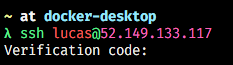

Já estamos muito acostumados com SSH para logarmos em máquinas virtuais, como fizemos no nosso [post onde criamos uma VPN](/criando-uma-vpn/). Porém, sabemos que o SSH aceita diversos níveis de segurança quando se trata de acesso local.

O primeiro nível de segurança – e o mais fraco – é uma senha alfanumérica, este é o meio mais fraco porque a comunicação entre o seu computador e o servidor, mesmo sendo pelo protocolo do SSH, ainda transmite sua senha em texto plano, um ataque bem direcionado poderia capturar a sua senha e utilizá-la, se você não estiver utilizando nenhum túnel.

O segundo nível de segurança, e também o que mais utilizamos, é a combinação de chaves RSA, este tipo de segurança permite que você tenha mais facilidade para gerenciar acessos, por exemplo:

-   Podemos permitir o acesso de várias pessoas à mesma máquina sem ter uma senha trafegada por elas.
-   Podemos revogar as credenciais de uma única pessoa sem precisar alterar as demais.
-   Sendo sincero, é muito melhor _não_ ter que lembrar uma senha do que ter que lembrar uma, não é?

A grande vantagem das chaves assimétricas é que você pode provar que você é o dono de uma chave privada sem precisar, de fato, mostrar a chave para ninguém, ou seja, você pode dar uma chave pública ao servidor e, quando você for logar, o servidor irá perguntar se você possui a chave privada que faz a contraparte daquela chave pública, se você possuir, então você está dentro.

Apesar disso, muitas pessoas ainda tem um grande problema porque precisam gerenciar estas chaves em algum lugar, manter a sua chave privada em segredo e segura é uma tarefa muito complicada. Então podemos adicionar uma nova camada de segurança para aumentar ainda mais a resiliência de um servidor importante. O **2FA**, ou, **Two-Factor Authentication**.

## Two Factor Authentication

O TFA (ou 2FA) é uma técnica de segurança que exige que você utilize um outro dispositivo (geralmente um celular) para confirmar um código de uso único, chamado de OTP, o _One-Time Password._

Este código é gerado seguindo algumas implementações matemáticas que não vamos discutir aqui, mas ele está baseado em tempo, ou seja, desde que o seu relógio e o relógio do servidor estejam sincronizados, vocês dois irão gerar o mesmo código que valerá por um determinado tempo. Se você digitar o mesmo código que o servidor gerar, então você é o dono do OTP.

### Por que usar TFA?

O uso de senhas se tornou algo comum e a principal forma de autenticação. Utilizar algo que só você sabe de forma que só você tenha acesso a um determinado tipo de dado é um conceito muito simples e todos podem entender. Porém, com o tempo, o uso de senhas se tornou muito comum com a Internet, tudo que temos pede uma conta com uma senha ou então algum tipo de autenticação.

O ideal seria que você gerasse senhas diferentes para serviços diferentes, porém é impossível lembrar todas essas senhas,  por isso temos serviços como o 1Password, Dashlane ou LastPass, para que possamos gerar senhas aleatórias que não precisamos lembrar, pois eles se encarregarão de logar para a gente no momento correto e também de manter os dados seguros.

O que acontece é que muitas pessoas não sabem ou não tem como utilizar estes serviços pelos mais variados motivos e acabam utilizando a mesma senha para diversos serviços. Desta forma, se você usa a sua senha em um serviço que tem uma boa segurança, digamos a Azure, mas também usa a mesma senha para serviços de qualidade duvidosa, quando o elo mais fraco se romper, os hackers só precisarão de uma senha para acessar todas as suas contas.

E é por isso que o TFA é tão importante. No geral, o TFA tenta melhorar a segurança adicionando uma camada extra de autenticação, que pode ser uma entre três fatores:

-   Algo que você sabe
-   Algo que você tem
-   Algo que você é

Algo que você sabe seria a sua senha, o que não é interessante. Algo que você tem seria um celular ou um outro dispositivo, portanto utilizar a combinação "Algo que eu sei + Algo que eu tenho" se tornou muito popular. Ultimamente estamos vendo também a combinação "Algo que eu sei + Algo que eu sou" com autenticações biométricas ou por identificação de face.

### Por que usar TFA em um servidor

Pelo mesmo motivo que você utiliza TFA para proteger suas contas de e-mail: aumentar a segurança.

Imagine que você tenha uma empresa e esta empresa tenha uma tecnologia que valha milhões, ou então possua dados muito sensíveis armazenados em um servidor. Automaticamente este se torna um alvo muito cobiçado por hackers, então é importante adicionar camadas extras de proteção.

## Aplicando TFA em um servidor

Chega de conceitos, vamos colocar a mão na massa! Para começar, vou assumir que você já tem um servidor rodando, pode ser uma [VM da Azure](https://azure.microsoft.com/free/virtual-machines?WT.mc_id=containers-10757-ludossan), uma VM local, um Raspberry Pi, você que escolhe.

Além disso é importante que este servidor já esteja configurado para utilizar **chaves SSH como meio de entrada**. Desta forma não temos como logar através de uma senha, a maioria dos provedores cloud hoje permitem que você coloque sua chave pública como meio de autenticação na VM.

### Configurando o SSH

Antes de começarmos, preciso dizer que **não podemos executar os comandos como** `sudo su` , sempre utilize `sudo` quando for necessário **dentro do usuário que você irá logar**.

Primeiramente, vamos abrir o arquivo `/etc/ssh/sshd_config` com o nosso editor de texto preferido. Você vai ver um arquivo com várias configurações. A primeira delas é a configuração da porta, que deve estar como `#Port 22`, você pode mudar a configuração para aumentar ainda mais a segurança, uma vez que a porta padrão do SSH é bem conhecida, basta remover o `#`. Esta porta pode ser qualquer uma que você escolher, você so precisa lembrar de abri-la no seu provedor e no seu firewall.

Procure a linha `PermitRootLogin`, ela deve estar com o valor padrão `#PermitRootLogin prohibit-password`. Altere este linha para `PermitRootLogin no`.

Agora, vamos alterar a linha `#PubkeyAuthentication yes`, removendo o `#` para ativar a configuração.

Não vamos reiniciar o servidor ainda, vamos primeiro garantir que conseguimos instalar o nosso sistema de TFA corretamente.

### Instalando o TFA

Se você estiver utilizando qualquer tipo de sistema baseado em Debian, no meu caso estou usando o Ubuntu Server 18.4, basta instalar o pacote **libpam-google-authenticator** com o comando:

```bash
sudo apt install -y libpam-google-authenticator
```

> Se você não está usando uma distro baseada no Debian, ou não está conseguindo instalar a biblioteca, procure por "libpam-google-authenticator \<suadistro>" para obter instruções corretas de instalação.

Execute o script digitando `google-authenticator` na linha de comando, ele vai te fazer várias perguntas, as quais você pode só responder `yes` para todas, com exceção de duas.

Para a pergunta:

> Do you want to disallow multiple uses of the same authentication  
> token? This restricts you to one login about every 30s, but it increases  
> your chances to notice or even prevent man-in-the-middle attacks (y/n)

Responda `n`. Esta pergunta está perguntando se queremos desativar o login com tokens iguais ao mesmo tempo, se sim, você só poderá logar uma vez que um novo token for gerado a cada 30s, se não, poderá logar a qualquer momento. Se este é um servidor muito importante, recomendo que você digite `y`, no nosso caso estamos ignorando esta opção.

Para a pergunta:

> By default, a new token is generated every 30 seconds by the mobile app.  
> In order to compensate for possible time-skew between the client and the server,  
> we allow an extra token before and after the current time. This allows for a  
> time skew of up to 30 seconds between authentication server and client. If you  
> experience problems with poor time synchronization, you can increase the window  
> from its default size of 3 permitted codes (one previous code, the current  
> code, the next code) to 17 permitted codes (the 8 previous codes, the current  
> code, and the 8 next codes). This will permit for a time skew of up to 4 minutes  
> between client and server.  
> Do you want to do so? (y/n)

Vamos digitar `n`, ela permite que  utilizemos o mesmo token anterior até alguns segundos depois que ele perdeu a validade para compensar a diferença de tempo entre o servidor e o cliente, enquanto isso ajuda a manter as coisas simples, ele também reduz a segurança.

No final, você terá uma imagem parecida com esta:

<Figure src="./aplicando-two-factor-authentication-no-ssh/Screen-Shot-2020-11-05-at-18.26.59.png" alt="" caption="Resultado da criação de um autenticador" />

Basta apontar um aplicativo de TFA como o Authy, 1Password ou até mesmo o Google Authenticator para o QR Code para poder cadastrar a nova senha, ou então utilizar a Secret Key para poder gerar a mesma em aplicativos que não possuem leitura de QR Codes.

> Lembre-se de anotar os códigos de emergência e o código de verificação e mantê-los em locais seguros!

Vamos agora editar o arquivo de configuração do pacote para podermos habilitar o uso de TFA no login, vamos abrir o arquivo `/etc/pam.d/sshd`. Este arquivo vai ter um código já pronto, vamos fazer as seguintes alterações:

1.  Comente a linha que diz `@include common-auth`, isto significa que o TFA não vai perguntar uma senha além do OTP.
2.  No final do arquivo, adicione a seguinte linha: `auth required pam_google_authenticator.so`
3.  Salve e feche o arquivo

Agora volte no arquivo de configuração do SSH em `/etc/ssh/sshd_config`, vamos deixar o SSH a par do novo método de autenticação.

Procure a linha `ChallengeResponseAuthentication no` e mude-a para `ChallengeResponseAuthentication yes`. Depois procure a linha `UsePAM no` e mude para `UsePAM yes`.

Agora vamos setar os métodos de entrada para o SSH, para isso procure a linha `AuthenticationMethods`, se ela não existir, adicione-a logo após a linha `UsePAM`. Nesta linha escreva:

```ssh
AuthenticationMethods publickey,keyboard-interactive
```

Vamos reiniciar o serviço do SSH para poder ativar as alterações com o comando a seguir:

```bash
sudo systemctl restart sshd
```

Agora, **em um outro terminal**, tente fazer login no seu servidor, você deverá ver algo assim:



Agora basta digitar o seu código de autenticação e então você estará logado!

## Conclusão

Aplicar TFA nos seus servidores pode parecer uma medida drástica, porém ela ajuda a manter toda a sua infraestrutura mais segura de forma que você poderá ter certeza de que seus dados estarão mais seguros do que somente com uma autenticação simples com chaves ou senhas!
