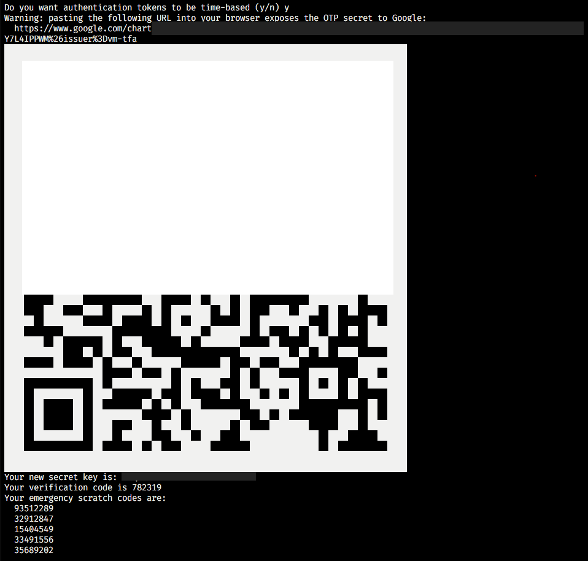

We're all pretty used to SSH by now to log into virtual machines, like we did in our [post where we set up a VPN](/criando-uma-vpn/). But we know SSH accepts several levels of security when it comes to local access.

The first level of security, and the weakest one, is an alphanumeric password. It's the weakest because the communication between your computer and the server, even over the SSH protocol, still transmits your password in plain text. A well-targeted attack could capture your password and use it, if you're not running through some kind of tunnel.

The second level of security, and also the one we use the most, is a combination of RSA keys. This kind of security makes it much easier to manage access, for example:

-   We can let several people access the same machine without any of them having a password that travels over the wire.
-   We can revoke one person's credentials without touching anyone else's.
-   Honestly, it's a lot better to _not_ have to remember a password than to have to remember one, right?

The big advantage of asymmetric keys is that you can prove you own a private key without ever actually showing that key to anyone. You give the server a public key, and when you go to log in, the server asks whether you hold the private key that pairs with that public key. If you do, you're in.

Even so, a lot of people still run into a real problem here, because they need to manage these keys somewhere. Keeping your private key secret and safe is a genuinely tricky task. So we can add one more layer of security to make an important server even more resilient. That's **2FA**, or **Two-Factor Authentication**.

## Two Factor Authentication

TFA (or 2FA) is a security technique that requires you to use another device, usually a phone, to confirm a single-use code called an OTP, the _One-Time Password._

This code is generated following some math I won't get into here, but it's time-based. As long as your clock and the server's clock are in sync, both of you generate the same code, and that code is valid for a set window of time. If you type in the same code the server generates, you've proven you own the OTP.

### Why use TFA?

Passwords have become the standard, the main way we authenticate. Using something only you know, so that only you can access a certain piece of data, is a simple concept and everyone gets it. But over time, passwords became so common with the Internet that literally everything we use asks for an account with a password or some other kind of authentication.

Ideally you'd generate a different password for every service, but it's impossible to remember all of them. That's why we have services like 1Password, Dashlane or LastPass, so we can generate random passwords we don't need to remember, since they take care of logging us in at the right moment and keeping the data safe.

The problem is that a lot of people don't know about these services, or can't use them for one reason or another, and end up reusing the same password across several services. So if you use your password on a service with solid security, say Azure, but also use that same password on services of questionable quality, the moment the weakest link breaks, hackers only need one password to get into all your accounts.

And that's exactly why TFA matters so much. In general, TFA tries to improve security by adding an extra layer of authentication, which can be one of three factors:

-   Something you know
-   Something you have
-   Something you are

Something you know would be your password, which isn't all that interesting on its own. Something you have would be a phone or another device, so the combination "something I know + something I have" became very popular. Lately we're also seeing "something I know + something I am", with biometric or face-recognition authentication.

### Why use TFA on a server

For the same reason you use TFA to protect your email accounts: it increases security.

Imagine you have a company, and that company owns technology worth millions, or holds very sensitive data on a server. That server automatically becomes a very tempting target for hackers, so it's important to add extra layers of protection.

## Applying TFA to a server

Enough theory, let's get our hands dirty! To start, I'll assume you already have a server running, it could be an [Azure VM](https://azure.microsoft.com/free/virtual-machines?WT.mc_id=containers-10757-ludossan), a local VM, a Raspberry Pi, whatever you've got.

It's also important that this server is already set up to use **SSH keys as the login method**. That way there's no way to log in with a password at all. Most cloud providers today let you drop your public key in as the VM's authentication method.

### Configuring SSH

Before we start, I need to say this: **don't run commands as** `sudo su`. Always use `sudo` when you need to, **while staying inside the user you'll actually log in as**.

First, let's open the file `/etc/ssh/sshd_config` with our favorite text editor. You'll see a file full of settings. The first one is the port setting, which should read `#Port 22`. You can change this to boost security even further, since the default SSH port is well known, just remove the `#`. This port can be whatever you choose, you just need to remember to open it on your provider and on your firewall.

Look for the line `PermitRootLogin`, it should have the default value `#PermitRootLogin prohibit-password`. Change this line to `PermitRootLogin no`.

Now let's change the line `#PubkeyAuthentication yes`, removing the `#` to enable the setting.

We're not restarting the server yet, let's first make sure we can install our TFA system correctly.

### Installing TFA

If you're on any Debian-based system, in my case Ubuntu Server 18.4, just install the **libpam-google-authenticator** package with:

```bash
sudo apt install -y libpam-google-authenticator
```

> If you're not on a Debian-based distro, or can't get the library installed, search for "libpam-google-authenticator \<your distro>" for the right install instructions.

Run the script by typing `google-authenticator` on the command line, it'll ask you a bunch of questions, and you can just answer `yes` to all of them, except two.

For the question:

> Do you want to disallow multiple uses of the same authentication  
> token? This restricts you to one login about every 30s, but it increases  
> your chances to notice or even prevent man-in-the-middle attacks (y/n)

Answer `n`. This one is asking whether we want to disable logging in with the same token more than once at a time. If you say yes, you can only log in once a new token is generated every 30s, if you say no, you can log in whenever. If this is a really important server, I'd recommend typing `y`, but in our case we're skipping that option.

For the question:

> By default, a new token is generated every 30 seconds by the mobile app.  
> In order to compensate for possible time-skew between the client and the server,  
> we allow an extra token before and after the current time. This allows for a  
> time skew of up to 30 seconds between authentication server and client. If you  
> experience problems with poor time synchronization, you can increase the window  
> from its default size of 3 permitted codes (one previous code, the current  
> code, the next code) to 17 permitted codes (the 8 previous codes, the current  
> code, and the 8 next codes). This will permit for a time skew of up to 4 minutes  
> between client and server.  
> Do you want to do so? (y/n)

Let's type `n`. Saying yes would let us use the previous token for a few extra seconds after it expires, to make up for the time difference between server and client. It keeps things simple, but it also cuts down on security.

At the end, you'll see something that looks like this:



Just point a TFA app like Authy, 1Password, or even Google Authenticator at the QR Code to register the new credential, or use the Secret Key to generate the same thing on apps that can't read QR Codes.

> Remember to write down the emergency codes and the verification code, and keep them somewhere safe!

Now let's edit the package's config file so we can enable TFA on login, let's open `/etc/pam.d/sshd`. This file already has some code in it, and we're going to make the following changes:

1.  Comment out the line that says `@include common-auth`, this means TFA won't ask for a password on top of the OTP.
2.  At the end of the file, add this line: `auth required pam_google_authenticator.so`
3.  Save and close the file

Now go back to the SSH config file at `/etc/ssh/sshd_config`, let's bring SSH up to speed on the new authentication method.

Look for the line `ChallengeResponseAuthentication no` and change it to `ChallengeResponseAuthentication yes`. Then look for the line `UsePAM no` and change it to `UsePAM yes`.

Now let's set the login methods for SSH. Look for the line `AuthenticationMethods`, if it doesn't exist, add it right after the `UsePAM` line. On this line, write:

```ssh
AuthenticationMethods publickey,keyboard-interactive
```

Let's restart the SSH service to activate these changes with the following command:

```bash
sudo systemctl restart sshd
```

Now, **in a different terminal**, try logging into your server, you should see something like this:


Now just type in your authentication code and you're logged in!

## Conclusion

Adding TFA to your servers might sound like a drastic move, but it helps keep your whole infrastructure more secure, so you can be sure your data is better protected than with a simple key or password authentication alone!
