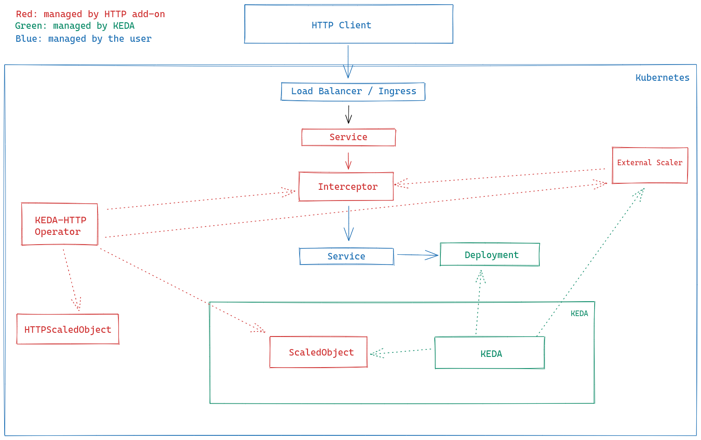

One of the things that makes me even happier about working with open source is when we manage to turn projects into reality and help a lot of people with what we set out to do.

A while back, I started a journey helping the [KEDA](https://keda.sh) maintainers build a new add-on for the ecosystem, and this add-on has finally been published and is in beta.

## What is KEDA

Right now, we have a bunch of ways to scale workloads in Kubernetes, and all of them use the native Autoscaling API to create what we call _HorizontalPodAutoscalers_.

These scalers let us scale based on machine resources like CPU and memory, and also (with quite a bit of effort) on custom metrics coming from other services, like the request count or requests per second from a standard ingress controller.

But precisely because doing this kind of scaling natively is so hard, other projects popped up to make scaling easier, not just from local metrics but from external services too. And, most importantly, to let us scale applications down to **zero**.

The most common case is when you have an application that's a _worker_, meaning it listens to a message queue and processes one message at a time. It doesn't make sense for this application to run all the time, since it won't be doing work every second, just consuming machine resources. It would be a lot more efficient if there were no active workers until a message actually shows up in the queue.

And that's where **KEDA** (which stands for _Kubernetes Event Driven Autoscaling_) comes in. KEDA works with a set of _scalers_, and each scaler is itself a small application that connects to a metrics source and passes that data to the main controller, which decides whether to scale a target application or not.

That way we can scale based on all sorts of services. In fact, KEDA has [an extensive list of already supported scalers](https://keda.sh/docs/2.3/scalers/), but none of them let you do something very simple yet very useful: scale based on the number of HTTP requests.

## HTTP Add-on

Scaling applications based on their incoming traffic isn't something we think about much, because we almost always have a site that keeps receiving thousands of requests per minute or per second, meaning we always have to keep that site up.

But that might not be your reality, and that's why, with KEDA, we could plug in a scaler using Prometheus to pull request metrics, but that would require instrumentation and also installing Prometheus in your cluster, even if you weren't using it as your main monitoring tool. With that in mind, we started developing the idea of what would become an add-on for KEDA itself, not a scaler, but part of the product.

[The official launch post](https://keda.sh/blog/2021-06-24-announcing-http-add-on/) for the project explains a bit about the configuration and gives a short tutorial on getting started with the KEDA Add-on, but I'll still walk through a small tutorial here and explain some of the core concepts we had in mind.

### How does it work?

The add-on is built on three main components that follow the same idea as Kubernetes's _operator_ pattern:

-   **Interceptor:** This is the main component. It intercepts every HTTP request coming into your application's service and checks whether the service already has at least one application ready to serve the request, then does a count and simply forwards the request to the target application. Otherwise, it "holds" the request until the application gets scaled up.
-   **External Scaler**: This is a component that already exists in KEDA, the ability to build your own scaler and implement a defined gRPC interface makes it highly extensible. This is a [push-type scaler](https://keda.sh/docs/2.1/scalers/external-push/) that pings the interceptor to find out the pending request queue count, then converts that data into something KEDA can understand.
-   **Operator:** The operator is the control brain, and it's there for the convenience of not having to create all these applications manually. Since the add-on is built on [CRDs](https://kubernetes.io/docs/concepts/extend-kubernetes/api-extension/custom-resources/), creating a new `HTTPScaledObject` CRD makes it so both the service and the interceptor and scaler for your application get created for you.

The architecture works like this:



Notice that the add-on doesn't interfere with the user's application, which keeps full control over the load balancer and the ingress, as well as the services and the application deployment.

## How to use it

Since this project is a KEDA add-on, we first need to install KEDA on a Kubernetes cluster. To make things easier, let's install everything using Helm:

```sh
helm repo add kedacore https://kedacore.github.io/charts
helm repo update
helm install --create-namespace -n <namespace> keda kedacore/keda
```

Then, we can install the add-on operator from the same chart repo:

```sh
helm install \
  --create-namespace <namespace> \
  http-add-on \
  kedacore/keda-add-ons-http
```

Then, we can create an `HTTPScaledObject` object:

```yaml
apiVersion: http.keda.sh/v1alpha1
kind: HTTPScaledObject
metadata:
  name: meuApp
spec:
  scaleTargetRef:
    deployment: meuDeployment
    service: meuService
    port: 8080
```

That's enough for the add-on to create everything for you and start scaling your app.

## Conclusion and next steps

Right now the **application is still in beta**, so we don't recommend using it in production, since the API might change drastically down the line. There are several new proposals we're considering, like north-south traffic through Ingresses and the [Gateway API](https://github.com/kedacore/http-add-on/issues/33), as well as east-west traffic (service-to-service communication) using [service meshes](https://github.com/kedacore/http-add-on/issues/6).

On top of that, we're [constantly updating the project](https://github.com/kedacore/http-add-on/) and creating new issues and helping shape its future development.

This project is a joint effort from a lot of people, including myself, and the thanks go to:

-   [Aaron Schlesinger](https://github.com/arschles)
-   [Aaron Wislang](https://github.com/asw101)
-   [Tom Kerkhove](https://github.com/tomkerkhove/) and the whole group of [KEDA maintainers](https://github.com/orgs/kedacore/teams/keda-maintainers)
