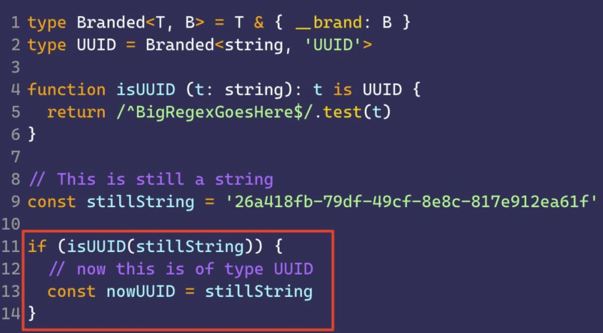

I recently saw people posting about a "novelty":


On his channel, Primeagen showed what he called "negative space programming". I'm happy this topic reached bigger channels, but the technique isn't new, it's been around for many, many years. TypeScript itself has a function that does exactly this, only with types.[^n1]

Assertion functions are part of a set called **Type Guards**. Along with [enums](/enums-no-typescript/), these two are among the few things that pull TypeScript out of the compilation world and into the runtime world, meaning the code you write there actually runs at runtime.

## Type Guards and branded types

There are two categories of functions. We split them to make things easier to understand, but they're essentially the same thing with different uses.

First, we have _type guards_.

```ts
function isNumber (n: unknown): n is number {
  return typeof n === 'number'
}
```

These functions always return a boolean saying whether the condition passed or not. In the example above, we're checking if a value `n` is a number. But what's the difference between this and a normal function?

That's where type inference comes in. Both assertion functions and type guards can change the types TS infers from that point on, and they work great with **branded types**. But what are branded types?

### Branded types (real quick)

Let's take a small detour here. Branded types are types that represent specific variations of a wider type. Got it? Confusing, right, let's go with examples.

> [!NOTE] 🤚
> I'll write other articles just to explain what branded types are, but let's go with the simple explanation for now.

Imagine we have variables that are currencies in cents, we can have euros, dollars and reais. But even though they're all strings, they can't represent the same thing, because they're different currencies.

```ts
const eur: string = '1299'
const usd: string = '1099'
const brl: string = '90000'
```

If we create a conversion function from euro to dollar, we expect the result to be in dollars, but the input needs to be in euros, how do we do that? Let's create a type that's a variation of a string, but with a hidden property:

```ts
type EUR = string & { _brand: 'EUR' }
type USD = string & { _brand: 'USD' }
type BRL = string & { _brand: 'BRL' }

const eur: EUR = '1299'
const usd: USD = '1099'
const brl: BRL = '90000'
```

Now in a conversion function, we can expect just one type:

```ts
function eurToUsd (in: EUR): USD {
   return conversao(in) as USD
 }
```

See what I did there? Using `as` as an explicit conversion is one of the only ways you can create a branded type. Besides instantiating the variable directly, the other way is through creation functions like this one:

```ts
function makeEUR (v: string): EUR {
  return v as EUR
}
```

The other way to validate and guarantee a type is through type guards, like I show in the talk I linked earlier:



Sure, using money operations is a simple case, but with UUIDs for example, this can save you a lot of bugs, since you can type your parameters to only accept UUIDs, and that guarantees no plain string ever sneaks back in on you.

### Type Guards

That said, type guards are a way to guarantee that an entire scope will have the type defined by the type guard. For example:

```ts
function isStringArray (a: unknown): a is string[] {
  return Array.isArray(a) && typeof a[0] === 'string'
}

function foo (x: string[] | string) {
  const v = x // v is string[] | string
  if (isStringArray(v)) {
    // v is string[] in here
  }
  
  // v is now string since we tested if it's an array and it failed
}
```

If you got the idea behind branded types, you know where I'm going with this: having type guards means you can swap the type of a variable for an entire scope, in a technique called **type narrowing**. In other words, we're turning a wider type into a narrower one. Just like we did with `string[] | string`, turning it into just `string[]` or `string`.

And that means we can also turn regular types into branded types, or any other type we want, using a validation **that exists at runtime**, and that's the biggest difference here. Every type guard validation runs during the application's runtime. So you get validation not only at compile time but also at execution time.

Besides type guards, we have another variation that's just as important. Assertion functions.

## Assertion functions

Assertion functions are exactly the technique he's using in the clip I posted at the start of this article. In plain JavaScript, this translates to using `assert` (which, in his case, he imported from the `node:console` module, but it also exists as a standalone module, `node:assert`, which I talked about in the [article about the Node Test Runner](/comecando-com-o-node-js-test-runner/)).

The idea is that, instead of returning a boolean, we don't return anything, we stop the program's execution and throw an exception because that's an unexpected value. It's a variation of type guards, only stricter.

```ts
function assertIsNumber (x: unknown): asserts x is number {
  if (!typeof x === 'number') throw new Error('NaN')
}
```

On top of that, assertion functions also have a different syntax, which is why we end up separating the two, so we don't mix one with the other. But the uses are the same, for example, let's replace our earlier function with an assertion function.

```ts
function assertStringArray (a: unknown): asserts a is string[] {
  if (!Array.isArray(a) && typeof a[0] !== 'string') {
    throw new Error ('Not a string array')
  }
}

function foo (x: string[] | string) {
  const v = x // v is string[] | string
  assertStringArray(v)
  // v is string[] from here on
}
```

As you can see, one of the problems with assertion functions is that they aren't inclusive. If you have a union type between two types, the moment you use an assertion function, it will only assert one of them, the other gets ignored, and anything below the assertion function gets inferred as the type you set.

Assertion functions get used a lot in places where we have optional parameters, or optional values used in specific flows. Especially when we're dealing with objects.

## Conclusion

Assertion functions are a great way to guarantee not just your code's typing at compile time, but also to guarantee that, during execution, the code will behave the way you predicted. After all, **computing is deterministic**, and we need to know what we're getting and sending from our programs.

To wrap up this series I'll talk more about branded types in another article, so stay tuned!

[^n1]: I [even talked about them a few years ago](https://speakerdeck.com/khaosdoctor/typescript-tips-that-could-save-your-life?slide=30).
