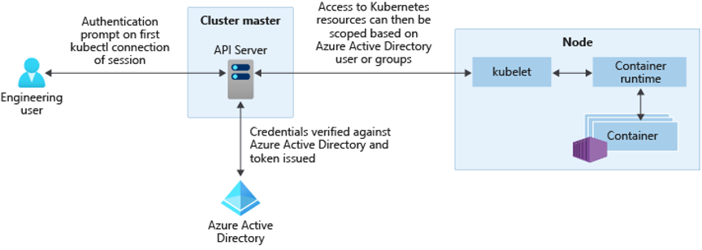
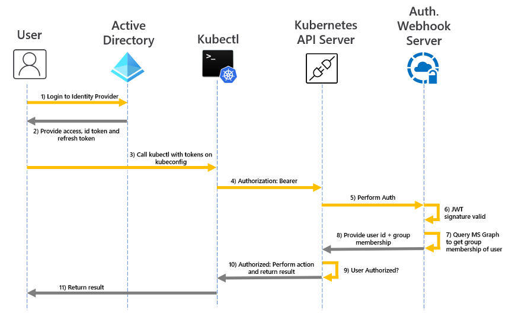

Já passamos por artigos sobre [como criar usuários](/criando-e-gerenciando-usuarios-no-kubernetes/) e também como atribuir [permissões a estes usuários usando RBAC](/dando-permissoes-a-usuarios-com-kubernetes/). Porém, utilizar o Kubernetes para poder realizar gerenciamentos de usuários, apesar de simples, não é muito prático justamente por conta da natureza distribuída dos clusters.

Quando criamos um cluster, temos duas boas práticas de segurança que devemos considerar. A primeira é o controle que você tem sobre os recursos da própria Azure, como o próprio cluster e todos os objetos que estão dentro do resource group dele, a outra boa prática é o controle sobre o que seus usuários podem fazer e ver dentro desse cluster.

## Azure AD

Uma opção sensacional, provavelmente a melhor para o AKS, para centralizar o gerenciamento de usuários é o chamado Azure Active Directory (AAD). Essencialmente esta é uma integração com o Active Directory nativo da Azure de forma, centralizando o controle.

Utilizar esta opção pode ser uma das melhores práticas porque temos todo o controle sobre tanto os usuários quanto os seus roles e bindings dentro do mesmo local, o portal da Azure.

O AAD funciona sempre que o usuário requisita o arquivo de configuração através do comando `az aks get-credentials`. Quando isso acontece, existem dois principais roles que são enviados de volta:

-   Role administrativo: Acesso completo a todos os recursos
-   Role de usuário: Acesso restrito à recursos

Quando temos a integração com o AAD habilitada, durante o primeiro download de configurações, o usuário vai ter que logar no portal, a partir daí o perfil correspondente será baixado.

## Como funciona

Para entendermos melhor como o AAD funciona, o ideal é entendermos o fluxo completo de como uma integração com active directory funciona em si.

De acordo com a própria documentação da Microsoft, a integração com o AAD provê a usuários e grupos o acesso aos recursos do cluster independentemente se os mesmos estiverem em um namespace ou não.

Quando um usuário faz o login e baixa o arquivo kubeconfig com o comando que vimos anteriormente, o primeiro passo do fluxo é pedir que o usuário se autentique no portal.



Após a autenticação no portal, o cluster verifica no servidor de AD da azure se o usuário existe e pede um token de acesso para o mesmo, este token é utilizado para preencher o arquivo kubeconfig.

Depois do download do arquivo config, o usuário não vai ter as permissões direto no token, mas vai estar integrado no webook do AAD e no servidor de API. Sempre que o usuário executar qualquer comando no Kubectl, um interceptador de chamadas vai usar este token para validar o usuário contra os servidores da Azure e verificar se ele tem permissão para executar o comando.

Se tanto o token JWT quanto o resultado da query na API do MS Graph mostrarem que o usuário tem existe e tem permissão, então a chamada procede para a API do kubernetes que utiliza os próprios Roles e Bindings para verificar se o usuário tem acesso.

O fluxo completo seria mais ou menos assim:



## Integrando seu cluster com o AAD

Antes de junho de 2020, precisávamos criar todas as etapas de um servidor AD padrão, isso incluia a criação de uma aplicação de servidor e um client dentro do portal para integrar com a aplicação do AAD.

Agora tudo ficou muito mais simples com a chegada do **Azure Managed AAD Integration (Managed AAD)**. Que, basicamente, abstrai todos os comandos que você teria que executar.

> Por mais que seja mais simples, essa facilidade inclui [algumas limitações](https://docs.microsoft.com/en-us/azure/aks/managed-aad?WT.mc_id=containers-12319-ludossan)

O primeiro passo para habilitar o Managed AAD no seu cluster é instalar as duas ferramentas mais famosas, o `kubectl` e o `kubelogin`, por sorte ambas podem ser instaladas usando o comando `az aks install-cli`.

Vamos precisar ter um grupo e um usuário iniciais para podermos ter privilégios administrativos para o primeiro usuário do cluster, então podemos usar um grupo existente ou então criar um novo com o seguinte comando:

```bash
az ad group create --display-name AKSAdminGroup --mail-nickname AKSAdminGroup
```

Isso vai te retornar uma série de informações, porém a mais importante delas é o **ObjectID**. Copie essa informação e guarde, porque vamos precisar dela para nos adicionar ao grupo. Mas para isso vamos precisar descobrir o nosso próprio ID:

```bash
az ad user show --id email@delogin.com --query objectId -o tsv
```

A informação que voltar é o seu ID de usuário. Guarde-o para podermos nos adicionar ao grupo. Mas temos um problema, o email de login não é o mesmo email que o AD pode estar usando, então precisamos achar esse email. Para isso vamos usar o comando de listagem de usuários:

```bash
az ad user list --query "[*].{name: displayName, id: userPrincipalName, objectId: objectId}" -o json
```

Isso te retorna uma lista de todos os usuários e seus IDs de login, você poe então filtrá-los através da chave `--id` ou então só copiar o ObjectID, porque é só o que é preciso para poder se adicionar no grupo. Então vamos fazer isso:

```bash
az ad group member add --group AKSAdminGroup --member-id seuobjectid
```

Agora já temos nosso usuário dentro do grupo de permissão geral, vamos criar o nosso cluster habilitado:

```bash
az aks create \
  -g aks-aad \
  -n aad-cluster \
  --enable-aad \
  --aad-admin-group-object-ids objectIdDoGrupoAdmin
```

Pegamos as credenciais com `az aks get-credentials -g aks-aad -n aad-cluster`. Agora que temos o arquivo de configuração, tente executar qualquer comando no `kubectl`, como `kubectl get nodes`, veja que você vai receber uma mensagem pedindo para logar no portal.

O AAD já está funcionando, partindo sempre do princípio de _Zero Trust_, você nunca vai ter nenhuma permissão, somente as que você adicionar.

## Adicionando novos usuários e grupos

Agora que temos todas as permissões, vamos adicionar novos usuários e grupos assim como fizemos nos outros artigos. Primeiro precisamos do ID do nosso cluster AKS:

```bash
AKSID=$(az aks show -g aks-aad -n aad-cluster --query id -o tsv)
```

Agora vamos criar um grupo somente leitura chamado `AKSReadOnlyGroup` e vamos salvar o ObjectID:

```bash
GROUPID=$(az ad group create \
  --display-name AKSReadOnlyGroup \
  --mail-nickname \
  --query objectId -o tsv)
 
```

Esses usuários precisam se logar como usuários e não como administradores. Isso pode ser feito adicionando este grupo a um role existente no AD chamado "Azure Kubernetes Service Cluster User Role". Como vimos antes, isso vai fazer com que os usuários sejam logados como usuários e não como administradores.

O objeto que liga um grupo a um role na Azure é chamado de **Role Assignment**. Vamos criar um para podermos linkar os dois:

```bash
az role assignment create \
  --assignee $GROUPID \
  --role "Azure Kubernetes Service Cluster User Role" \
  --scope $AKSID
```

Vamos adicionar um novo usuário chamado Alice a este grupo que acabamos de criar, vamos então copiar o ObjectID quando criarmos:

```bash
ALICE=$(az ad user create \
  --display-name "Alice Doe" \
  --user-principal-name alice@dominio.com \
  --password S3gr3d0 \
  --query objectid -o tsv)
```

> Lembre-se: Quando criarmos um usuário precisamos de um domínio **válido**. Para obter este domínio podemos executar o seguinte comando e copiar tudo o que vier depois do "@": `az ad user list --query "[*].userPrincipalName" -o json`

Adicionamos o usuário ao grupo:

```bash
az ad group member add --group AKSReadOnlyGroup --member-id $ALICE
```

Agora que temos o usuário já criado no AD, vamos criar o role e o binding dele no kubernetes. Como vimos antes, o AAD e o RBAC do kubernetes trabalham juntos para poder prover a solução completa de autenticação.

## Dentro do Kubernetes

Primeiro vamos criar o role chamado `ReadOnlyRole`:

```bash
kubectl create clusterrole ReadOnlyRole --verb=get,list,watch --resource="*"
```

Vamos criar agora o binding deste role ao nosso ID do grupo no AD:

```bash
kubectl create clusterrolebinding ReadOnlyBinding \
  --clusterrole=ReadOnlyRole \
  --group=$GROUPID
```

> Podemos também vincular o role a um usuário utilizando o ObjectID do usuário ao invés do ObjectID do grupo no comando acima.

Agora podemos testar essas roles baixando o arquivo de configuração novamente e sobrescrevendo o atual:

```bash
az aks get-credentials -g aks-aad -n aad-cluster --overwrite-existing
```

Na primeira chamada, você precisará fazer o login novamente com email e senha. Vamos usar o email da Alice para fazer isso (o email que você usou quando criou o usuário da Alice), assim como a senha definida.

Depois de um login bem sucedido, tente executar uma lista de pods do namespace `kube-system`. Você vai conseguir porque o usuário da Alice tem permissão para listar todos os pods em todos os namespaces, porém se você tentar criar qualquer coisa, como:

```bash
kubectl run nginx-dev --image nginx --namespace default
```

Você vai receber uma mensagem de "proibido".

## Conclusão

Aprendemos como podemos utilizar ainda mais do poder da Azure para integrar autenticações e mais facilidades no nosso cluster AKS. Com esse tipo de integração podemos deixar nosso cluster ainda mais seguro.

Até mais!
