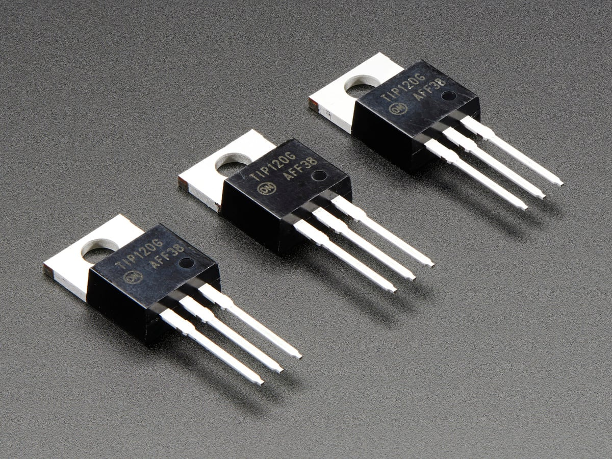
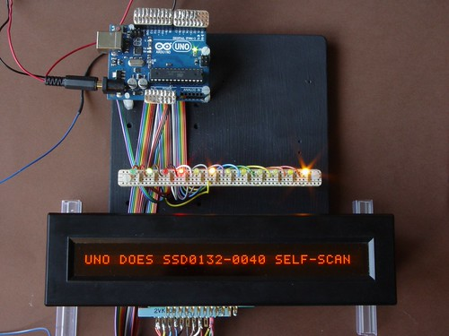

Hello and welcome to another edition of **Backlog!** The newsletter where I distill everything I want to say about topics I find really interesting!

Today we're going to talk about one of my favorite subjects: _history!_ **Do you know which PC probably gave rise to every personal computer in history?**

## **Computers and people**

Right now you're reading this newsletter on your computer, your phone, maybe even your game console (who knows?). We often don't even stop to think about how we got here. For most of us (me included), the computer already existed when we were born, people already knew the concept of a **personal computer**, but it wasn't always like that.

The world's first computers were created in the 1940s with a single purpose: breaking German ciphers during World War II. The world's first programmable computer was the Colossus, built in 1944. It filled an entire room and was made up of more than 2,500 vacuum tubes, plus thousands of electromechanical relays.<Sidenote>I'll talk about the Colossus in upcoming editions. I recently went to Bletchley Park myself (check out my highlights on [Instagram](https://instagram.lsantos.dev)) and I saw this computer with my own eyes, in that very same room in the photo.</Sidenote>

")

Over the years they kept getting smaller, though not small enough to call anything portable. The next iteration of a useful computer, the ENIAC, took up 3 floors of a building and weighed 30 tons. That's not necessarily interesting to the general public, but that's fine! Because...

Nobody needed a computer!

Why would anyone need a computer? Back then, they were too complex and served very specific tasks. In fact, every computer up to that point had no kind of data input like a keyboard or a mouse, that came MUCH later. They were operated with levers and patch boards

")

### Personal computers

In the late 50s computers shrank a bit. These were the ones considered "personal computers," because they only needed one person to operate, while earlier ones needed several people and, usually, a special cooled room to sit in. Around 1960, the Librascope LGP-30 was the first "personal" computer to have human input, an HID (Human Interface Device), which was a typewriter. It needed fewer operators and a simpler setup.

")

Many years later, in 1965, IBM launched a line of computers called the IBM System/360. Still aimed at businesses, it was one of the first to have unified software across all the machines, plus several peripherals, proving that any employee could use the computer with less training than before.

")

The IBM System/360 Model 40 was one of the smallest mainframes of its time, it "only" took up a classroom and could cost more than $300,000 (in 1965 dollars)

### SCAMP and miniaturization

Computers were only that big because they used relays, vacuum tubes, transistors, and other electromechanical parts. With the invention of miniaturization techniques like the integrated circuit, it started to become possible to shrink computers down.

")

The SCAMP (Special Computer APL Machine Portable) was a computer developed at IBM in 1973 as a prototype for a portable machine you could carry anywhere along with all its peripherals, and it's what gave rise to what we call the IBM PC today. Still, it was expensive and aimed at business use, it was still quite pricey.

Small computers were a lot more expensive, the "cheaper" computers were huge, there was no such thing as a computer that was both small and cheap. On top of that, no computer was exactly easy to program, you needed almost arcane knowledge to understand what was going on and how to operate the thing.

These computers usually came with instruction manuals that were true compendiums. Books with more than 800 pages describing in detail not just every operation, but the logic path of every circuit in the mainframe. Just like we do with documentation these days...

### Revolution in 1975

But that changed a lot in 1975 when a company called MITS created a visionary computer called the **Altair 8800**.

")

The Altair is considered by many to be the first personal computer in history, because it wasn't aimed at businesses or commercial applications. It was essentially a programmable processor with a high-level language (BASIC) and an interpreter for that language (written by Bill Gates and Paul Allen).

This computer cost $297, orders of magnitude cheaper than a business computer. It had 255 bytes of memory (expandable up to 64kb), but didn't display anything on a screen, the only output on an Altair was a row of red lights.<Sidenote>If you're curious, the movie "Pirates of Silicon Valley" shows the whole saga of Bill Gates and Paul Allen with the Altair 8800 in detail, it's well worth watching</Sidenote>

The Altair became what we all know as the first successful personal computer of all. It was small, cheap, easy to carry around and it wasn't aimed at a commercial audience, but at computing hobbyists who wanted to play with this technology at home. But there's a missing piece, before the Altair, the story of the MCM/70, the **real** personal computer, or at least the first attempt at one...

## The real personal computer

Very few people know the story of a company called MCM (Micro Computer Machines), founded around 1971 by Canadian [Mers Kutt](https://en.wikipedia.org/wiki/Mers_Kutt). Mers was a math professor at Queen's University in Ontario who had a serious problem with the fact that students and professors had to wait days to run programs under the [time-sharing](https://pt.wikipedia.org/wiki/Tempo_compartilhado) model, which worked like this:

1.  Write your program on punch cards
2.  Physically send the punch cards to a mainframe (like the IBM360)
3.  The people operating the mainframe would run your program and give you the result

There were several problems here. The first was that if you got your program wrong and it didn't run, you had to go through the whole thing again. The other was that the people running the programs had to prioritize what got executed, and if you'd had any beef with one of them, your program would probably end up at the bottom of the pile.

")

The whole process was really slow, and he wanted to transform how computers were used because he believed anyone who used a computer could create amazing things, but was being held back by technical limitations. With that idea in mind, he set out to propose a computer that was:

-   Small enough to carry around
-   Cheap enough for people to own
-   Easy enough for anyone to build something with

Those were the three main problems of the time, and he wanted to solve all three at once. Luckily, he knew [Robert Noyce](https://en.wikipedia.org/wiki/Robert_Noyce), Intel's first CEO (and a founder), who said the idea could work on a processor Intel was working on, the [Intel 8008](https://en.wikipedia.org/wiki/Intel_8008).<Sidenote>While we know and understand the concept of a personal computer today, it didn't exist back then, nobody knew what a PC was.</Sidenote>

It's important to point out that Intel wasn't the corporation it is today, it was basically a small startup. The Intel 8008 was small, relatively cheap ($120), and had a clock speed of 0.8Mhz, which was enough for **one** person to run **one** program.

")

To put that in perspective, one Hertz is 1 cycle per second, 0.8Mhz is the equivalent of 800,000 Hertz, meaning the processor ran 800,000 times per second. Today, a bad processor runs at 2GHz, that's 2,000,000,000 times per second. Your processor probably runs at 4.7 or 5Ghz, that's 5,800x faster than the Intel 8008

That solved part of the problem: relatively cheap and small computing was possible now, but what about the rest? For physical storage you could use cassette tapes, but they were mostly used for audio. For digital data, most readers were about the size of a microwave. On top of that, RAM was extremely expensive, an Intel 2102 with 1kb of memory cost $20 per chip, and you'd need at least 8kb to do anything useful.

And there was still the usability problem... How do you make a computer easy to use? Well, let's take it step by step. Kutt named this project M/C, which eventually became the [**MCM/70**](https://en.wikipedia.org/wiki/MCM/70)**, the world's first truly personal computer.**

")

## Hardware

With the processor sorted, RAM was a simple matter, because there weren't many options anyway. So the MCM/70 had 8kb of RAM (8 chips of 2102, $160) and a ROM that would hold the computer's language.

To store data externally they used a sequential cassette tape reader, basically like a regular audio tape, compact but slow... To make things easier, the MCM/70 had a 32-character SELF-SCAN display (which was quite innovative at the time), like the one below:

SELF-SCAN is the name given to a family of plasma displays that could show characters in more detail than traditional 7-segment displays, but used a lot more resources. Still, that was necessary, because to make the computer easier to use, they had to go with something people could actually understand.

### Software

With the hardware problems nearly solved, the last problem was how to make the computer easy to use. For that, Kutt, who had already been following [Ken Iverson](https://en.wikipedia.org/wiki/Kenneth_E._Iverson)'s work creating the [APL](https://en.wikipedia.org/wiki/APL_\(programming_language\)) language, a mathematical language that used special symbols but was powerful enough and could run in little memory.

The problem was that the cost of building a custom keyboard for APL was higher, but that, in theory, would pay for the project.

")

But Kutt wasn't a programmer, so he hired Gord Ramer, who had already built a low-resource APL interpreter before, to create the interpreter and put it directly into the computer's ROM. And this part is one of the most interesting in this whole story.

**Coding for an 8008 without an 8008**

They didn't have an actual Intel 8008 available, because they started building the prototype before the chip was ready. But Kingston University had an IBM360 with an Intel 8008 emulator. You'd feed 8008 code into it and it would hand you back hex code to run on the hardware, simple as that. The problem was that the IBM360 ran on punch cards, so the entire APL interpreter was written on IBM360 punch cards, carried over to the university to be read, and the resulting code was also written back onto punch cards and then typed in by hand by the devs into the MCM/70 (the prototype).

And since the trip between the office and the university was about 10 minutes, it wasn't something you'd do routinely. As a dev, you'd use a _debugger_ that let you edit your code directly on the processor, note down the changes, and then recompile the correct code back at the university.

## What happened?

The MCM/70 launched in 1974, a year before the Altair 8800. It cost \$4,950 Canadian dollars for the version with 2Kb of RAM and no cassette drives, and \$9,800 for the one with 8Kb and two cassette drives. For the first time, a computer was called a personal computer, having customers beyond governments and big institutions and starting to show up in smaller places like hospitals and stores.

Over the next two years the MCM/70 was renamed the MCM/700 and, in 1976, its successor, the MCM/800, launched with a faster processor, 16Kb of RAM, and support for an external monitor. By 1978 MCM had launched the 900 and the 1000. But even after selling plenty of units, being the first commercially sold computer to already bundle a monitor, keyboard, and memory, and at a relatively cheap price, it never really caught on outside academic or business circles. By the late 70s MCM already had several competitors with cheaper, simpler computers (like MITS and the Altair) that won over the general public.

A big part of MCM's problem was the APL language, which was extremely complex and complicated because it was made entirely of mathematical symbols, unlike the Altair's BASIC, which was much simpler and more straightforward.

In 1983, after trying and failing to secure funding for a more advanced model, the company shut its doors and sold its patents and designs to other companies, including Alcatel.

### More details

If you want to know more about this story, Cam Farnell, one of MCM's employees at the time, gave a talk about the MCM/70.<Sidenote>There's also a book called _"Inventing the MCM/70"_ published by professor Zbigniew Stachniak, but I couldn't find it anywhere...</Sidenote>

And that was the story behind the story of the world's first personal computer. The MCM/70 paved the way for what we know as personal computers today.

It solved crucial questions of size, accessibility, and usability, even though it got overshadowed by simpler competitors. By fixing those mistakes, future generations of PCs followed paths that shaped everything we know today as a **computer**.
