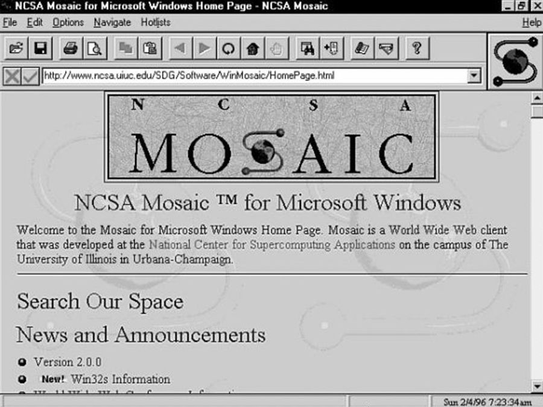
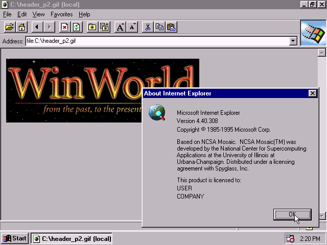
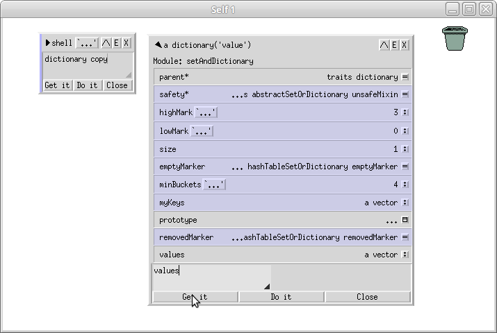
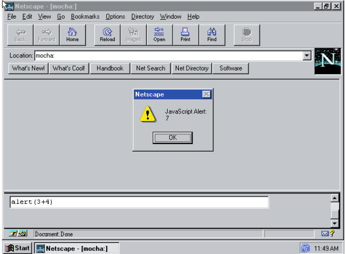

December 4th, 1995 is a very special day. Not just because it's the year I was born, but also because it was the launch of the language that, today, everyone loves to hate! **JavaScript**.

As everyone who follows me knows, I'm a huge fan of JavaScript and TypeScript, and I love showing off the history of this language even more, not just because it evolved so much and has one of the most impressive comeback arcs in computing, but also because its history is genuinely interesting. So for this edition of the backlog, to celebrate 29 years of JavaScript, I want to bring you:

> The story of the language that took over the world.

> This edition is based on [this 189-page paper](https://doi.org/10.1145/3386327), written by Brendan Eich himself about the first 20 years of JavaScript.

## From a "hack" to a global ecosystem

The short version of JavaScript's story is what most people see around. In 1995, around May 10th, Brendan Eich, a young programmer at Netscape Corporation, was past the halfway point of his 10 day sprint to create a language that would support the Netscape Navigator, adding more interaction to the page and making the (still very young) Web more lively.

> IIRC, 25 years ago, Wednesday, 10-May-1995, I'd just passed the midpoint of the "ten days in May" sprint to create JavaScript (codenamed "Mocha"). I was on the hook for a demo the following Monday, in order to show JS deep browser integration upside to Netscape (vs Java applets). — BrendanEich (@BrendanEich) [May 10, 2020](https://twitter.com/BrendanEich/status/1259403604626038784?ref_src=twsrc%5Etfw)
>
> — 

In the tweet above, Brendan Eich says that at that point (in 2020, that is) he'd already passed the midpoint of his "ten day sprint" to create JavaScript, which back then was called _Mocha_. He'd have a demo the following Monday to show off the browser integration against the dominant technology at the time, Java Applets.

And today, 29 years later, JavaScript is the language that laid the foundation for modern Web development, a language that's present in 98% of the Internet today. Today, we're not just celebrating JavaScript as a language, but also as a movement that shaped the Internet as we know it.

## A mosaic of possibilities

JS's story begins with the story of the Web. Developed between 1989-1991 by Tim Berners-Lee at CERN, the World Wide Web was first embraced by the physics and science community, since it was built to share papers. But it wasn't seen much outside that community.

One of the main reasons the Web stayed so confined to this community was that using it was pretty complicated, based on text protocols, and not very intuitive. That changed when **Marc Andreessen** and **Eric Bina** created **Mosaic** in 1992 while working at **NCSA**.

Mosaic was the world's first Web Browser, essentially what created the "Browser" category we have today. It's what popularized the concept of the Web outside the CERN scientist community. Naturally, once Mosaic gained fame and notoriety, plenty of people started wondering if it could become something commercial, mostly by trying to license Mosaic itself or creating variations of it. Until a guy named Jim Clark, who founded Silicon Graphics (an extremely important hardware company), landed an investment and recruited the two students, Marc and Eric, to found a company called **Netscape Communications Corporation (NCC)** in 1994.

")

NCC's idea was to replace Mosaic with Netscape, a more robust and easier to use version. By late 1994 and early 1995, the _Netscape Navigator_ was already the most used browser out there. And what does that have to do with JavaScript? Everything!

## A dead Web

Originally, the Web was centered on plain text through a markup language, HTML, which was declarative and static and represented the structure and content of a Web page. The problem was that these pages were static: to create dynamic content you had to request a whole other page, so what use would that be for, say, serving databases? Searches? Reports?

There was considerable interest across the industry in creating a scripting language to pair with HTML, giving it more "life" and letting pages be more dynamic. The same way Excel's VBA and AppleScript did for Windows and Mac. These languages weren't focused on building complex systems, but on "gluing" parts of different systems together to create better integration and new opportunities.

In 1995, Brendan Eich was recruited to be one of NCC's programmers. Having already worked at big companies like Silicon Graphics itself and MicroUnity, implementing specific languages to support defined functions at both, he already had the knowledge needed to create yet another language that would be the "glue" between HTML and the rest of the systems.

Originally, he was hired to "implement Scheme in the browser." (Scheme was a functional language, a LISP dialect, used mostly in academic circles.) But when he got there, he ran into a product way more complicated than he expected, and on top of that there was another danger in the air, and its name was **Microsoft.**

## **The browser wars**

When _Netscape_ launched, Microsoft, still pretty young itself, had a project called "Project Blackbird", a set of information management and data exchange programs for businesses, Microsoft's own version of the Web, called **Microsoft Network** (MSN, sound familiar?).

The idea was to have an application that would serve dynamic content, audio, and video without needing other plugins. It would be built using technologies like Object Linking and Embedding (OLE) and others being developed at the time.

But with the Web's fast popularization, Microsoft saw this project get shelved and shifted focus to technologies aimed at this new "Web" everyone was talking about. In 1994, it tried to buy NCC, but got turned down because the offer was too low. Because of that, NCC's founders were already expecting retaliation in the form of the famous [Embrace, Extend, Extinguish](https://en.wikipedia.org/wiki/Embrace,_extend,_and_extinguish), where Microsoft would adopt the standard, extend it with its own technologies, and then kill the standard in favor of its own. With that, Microsoft started developing what would be called **Internet Explorer**.

Because of that, Netscape needed to rush the implementation of a scripting language, since Microsoft would come in swinging. The candidates on the table were Perl, Python, TCL, and even Microsoft's own Visual Basic, plus Scheme. But everything changed when Java showed up.

## Java (without script)

In early 1995, Sun Microsystems kicked off a heavy marketing campaign to promote its still unreleased language called Java. Netscape quickly saw a business opportunity, since Java also wanted to take down Microsoft's monopoly over Windows, already the most used OS on every machine, with the JVM and its promise to run _anywhere._<Sidenote>To give you an idea of how important Microsoft was at the time, it wasn't just the owner of the biggest (and almost only) OS used on over 90% of computers, it also owned nearly every language used to write programs for those computers.</Sidenote>

Soon Netscape and Sun struck a deal where the chosen language wouldn't be any of the previous ones, but Java! And that became public on May 23rd, 1995 (I was 1 month old 👶).

With everything decided, all the other languages were dropped, either for commercial reasons or because of how hard it would be to integrate a full language into the browser. There wouldn't be enough time to finish the implementation and ship it before Microsoft released its own browser. And whatever language Microsoft chose to pair with Internet Explorer would end up defining the whole standard going forward.

Microsoft held all the cards: they had VBA, already a scripting language used in Excel, they knew how to build a browser and how to build a language, they already had the market, all that was missing was the product. So Bill Joy (there he is again), Sun's founder, suggested the way out would be to implement a "small language" that would pair with Java and complement its functionality.

The main question floating around Netscape was whether Java itself could just be the integrated language, something that clearly wasn't possible since, to write a Java program, you had to

1.  Put the program's body in a static method called `main`
2.  Inside a class declaration
3.  Inside a package
4.  Declare types for every variable and return

That wasn't the experience Netscape wanted for the crowd who'd be doing the "scripting". The language had to be way simpler, couldn't be class based, and couldn't have types. That's how Marc Andreessen came up with the codename **Mocha** for the future language, hoping it would end up called "_JavaScript_" down the line. It would have to "look like Java", be easy to use, and be "object based" rather than class based.

## Mocha

Java was about to launch, so time mattered a lot in this context. That's why **Mocha was implemented in 10 straight days in May 1995.** JavaScript's most famous fact, which is actually a bit distorted, because Mocha was a pretty different language from what JavaScript became. The 10 day implementation was the starting point of what would be JS, but what came out at the end of those days was a raw, basic, bare bones version of what that integration could be.

Technically, Mocha had a hand written lexer and a recursive parser. That parser emitted [bytecodes](https://dev.to/_staticvoid/node-js-por-baixo-dos-panos-8-entendendo-bytecodes-jib), something needed so Netscape's server (called LiveWire) could understand the instructions. The end result was a simple, very slow, but workable language.

This is where most of the choices [everyone loves to hate](https://x.com/_StaticVoid/status/1510709606569414663) got made. Since the language had to look like Java, everything closer to VB got stripped out, but at the same time "looking like Java" made it "seem like it worked like Java", which wasn't true.

The other explicit requirement was that the language had to be so easy to use that it could be written directly inside HTML. From there, Eich started working on the other pieces that would turn JS into what it is today, like:

-   [Prototypal inheritance](https://medium.com/trainingcenter/heran%C3%A7a-e-prot%C3%B3tipos-no-javascript-2c1e60e005a2) came from a language called Self
-   The idea of Higher Order Functions and functions as first class types came from Lisp
-   `this` came straight from Java (which took it from C++)
-   The idea of dynamic property creation
-   The global `Object` that every other type inherits from
-   `eval`
-   `var`
-   Flow control borrowed from C

Mocha's demo was a success and everyone was optimistic about shipping a more complete, integrated version of Mocha in Netscape 2, scheduled for release that September.

> Mocha's source code is available on [GitHub](https://github.com/m1t0s1s/netscape-communicator-3-0-2-source/tree/main/mocha/src), with a special mention of the ["JavaScript" naming](https://github.com/m1t0s1s/netscape-communicator-3-0-2-source/blob/ec144cc852e4cec98ba0114663b5f270c13c4ad7/mocha/src/mo_java.c#L59-L61) that Netscape hoped would be adopted

## Java (with script)

JavaScript launched on December 4th (after roughly 7 months of development) at a press conference, billed as an "object scripting language" meant to be used to write scripts that would "dynamically modify Java properties and objects", and would serve as a complement to Java on the Web.

Before JavaScript was called JavaScript, it was opened to the public in a Netscape 2 open beta under the name LiveScript (after LiveWire) in September '95, and turned into JavaScript a month later to build a strong brand tie between Java and Netscape.

JavaScript wasn't meant to be any kind of big language, nor ship with a ton of features, so much so that its feature set got severely cut down and JavaScript 1.0 shipped with everything that was "basically ready", bugs and all, most of which got fixed during development.

When interviewed in 1996, Brendan Eich said he wanted the language to stay small and stay ubiquitous on the Web as the best way to "stick" HTML elements and actions to each other, and also to connect those components to Java Applets, which would be the rest of the ecosystem. He'd even say one of the use cases for JS was "creating a link that changed depending on the time of day".

JavaScript had a rival called JScript, Microsoft's own version of JavaScript, started by Robert Welland on the IE team, who had previously worked at Apple supporting the Apple Newton (a kind of PalmTop) with NewtonScript, which was also an object based language, also influenced by Self. Microsoft had one clever move: building a _debugger_ for JavaScript straight into IE, something Netscape itself didn't have. On top of that, they realized IE would be nothing if it didn't have full compatibility with the sites Netscape was shipping. That pushed JScript and IE to reverse engineer Netscape to try and keep both roughly in line with each other.

## ECMAScript and today

JavaScript was clearly winning the browser race, and having two different languages wasn't a good look. The lack of a spec, of a standard, was a big problem. On top of that, back when the Mocha project started in 1995, it was already clear a spec would need to happen for interoperability across the whole Web to be possible.

So both Sun and Netscape planned to propose a spec to the W3C and the IETF. But neither of them was a great fit for a vendor-independent spec: the IETF focused on protocols, and the W3C didn't want to own a language of its own since that went against the organization's purpose. But the need wasn't just about having a standard, it was also because Microsoft was pushing to make VB the standard language, so having a formal spec would help JavaScript establish itself as a serious language.

That's when Carl Cargill, a specs expert working for Netscape, put the company in touch with ECMA International and proposed that ECMA take over the specification. So, on November 4th, 1996, ECMA held a meeting to set up Technical Committee number 39, TC39. If there was enough interest, the committee would become official. It did, and TC39's first meeting happened on November 21st that same year.

I have a video explaining how TC39 works if you're interested!

The rest of this story is pretty well known, but there are a lot of interesting details that, unfortunately, will stay out of this text. But from there, JavaScript went through several evolutions since its first spec, and what turned JS into the most well known language was Node arriving in 2009, which transformed the Web ecosystem and drove JavaScript's adoption through the roof, including new specs and language evolutions that turned JavaScript into what we know today.

But that's a story for another Backlog!

Thanks a lot for making it this far, and see you in the next edition!
