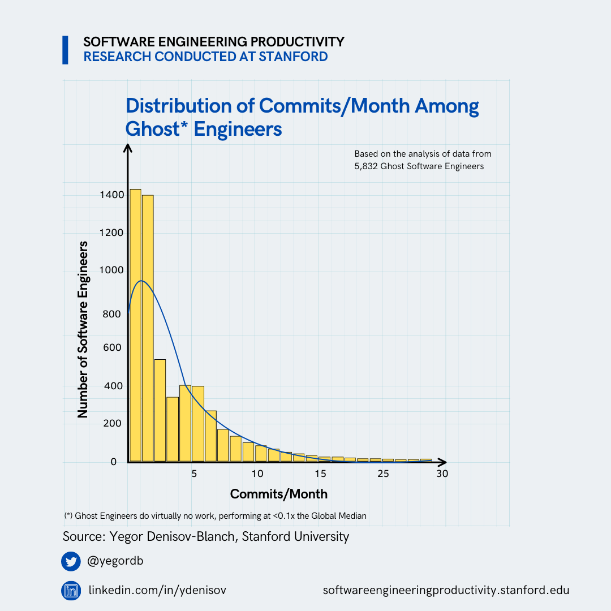
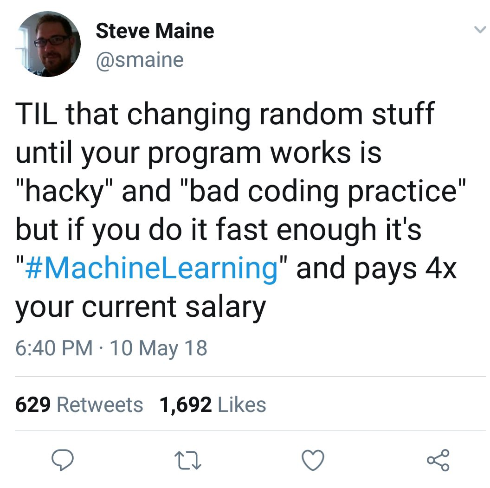

Mais um dia e mais um backlog no ar! Hoje quero trazer algo diferente: não é sobre história, nem diretamente sobre desenvolvimento, mas sobre devs no geral. Vamos falar sobre o **ato de fazer engenharia** e a _profissão de engenheiro de software como um todo_.

Recentemente, recebi um [post interessante](https://www.seangoedecke.com/what-makes-strong-engineers-strong/?=&aid=recomink1dKTOjct0) do Sean Goedecke intitulado: _"What makes strong engineers strong"_, ou, em português, _"O que torna os engenheiros fortes, de fato, fortes."_ (a tradução não ajudou muito). Aqui, força não tem a ver com vigor físico, mas sim com execução, responsabilidade e a habilidade de entregar qualquer tipo de trabalho.

Inicialmente, a ideia era apenas comentar sobre esse artigo, mas descobri um [artigo anterior](https://www.seangoedecke.com/weak-engineers/) onde o autor também discute o conceito de "engenheiros fortes" e "engenheiros fracos". Isso me deixou um tanto consternado...

Então, vamos começar pelo começo.

## Como chegamos aqui?

Antes de definir o que é um engenheiro forte ou fraco, eu tenho que explicar como a gente chegou aqui.

O [primeiro artigo](https://www.seangoedecke.com/weak-engineers/?__readwiseLocation=) menciona um [famoso estudo da universidade de Stanford](https://arxiv.org/pdf/2409.15152) que mediu a produtividade de vários devs em mais de 100 empresas e descobriu que aproximadamente [9.5% de qualquer engenheiro de software](https://x.com/yegordb/status/1859290734257635439) em uma empresa está, essencialmente, fazendo nada. O chamado _0.1x engineer_, uma alusão ao termo fantástico _"10x engineer"_, criado por um investidor chamado Shekhar Kirani em uma [thread do Twitter em 2019](https://x.com/skirani/status/1149302828420067328). Em teoria, os 10x engineers são seres míticos que entregam todo o tipo de coisa, enquanto 0.1x engineers são o oposto.

Eu cheguei a ler o estudo, mas achei estranho que ele não menciona em nenhum momento uma divisão de trabalhadores remotos ou no escritório, então eu não sei de onde vieram os dados relacionados às porcentagens de eficiência. Da mesma forma, o estudo não menciona nenhum tipo de resultado financeiro, então também não sei de onde vieram os dados para calcular que _esses engenheiros geram um prejuízo de $500B_:

> Pode ser que esse seja outro estudo com base na mesma fonte. Contudo, não consegui confirmar de onde vieram esses números além do que está nas imagens. Se alguém souber, me avise.

De acordo com o estudo, 108 empresas enviaram 1,73 milhão de commits de 50.935 engenheiros. Esses commits foram combinados com repositórios públicos numa proporção de 1 commit público para cada 5 privados. Após normalizações, 70 commits foram selecionados como amostra, e todas as alegações foram baseadas neles.

Uma das métricas usadas foi a quantidade de commits em um mês, algo que até [o próprio autor](https://x.com/yegordb/status/1859291435339743361/photo/1) considera pouco confiável. E já foi provado que não é uma boa métrica:

Mas, ao que parece, o objetivo do estudo não era medir a eficiência dos participantes, mas criar um modelo para avaliar a eficiência de programadores — algo que praticamente _todo mundo_ na indústria tenta fazer desde sempre.

Enfim, esse foi o estudo que deu início a tudo isso. Mas como, afinal, definimos o que é um engenheiro "forte" ou "fraco"?

---

# Pausa para um aviso!

Essa newsletter só existe graças à comunidade e aos patrocinadores! E hoje o apoio vem da **Remessa Online**, que está ajudando demais a manter este projeto vivo 💙.

Muitas pessoas me procuram para perguntar como é trabalhar para fora do Brasil e uma das principais dúvidas é sobre como receber o salário vindo de outro país.

Eu recomendo (inclusive já usava) a **Remessa Online**, não só porque ela me ajudou a facilitar esse processo, mas também porque as taxas são muito mais baratas (inclusive na conversão) do que se eu recebesse por um banco tradicional.

E tem mais vantagens: o dinheiro entra super rápido na sua conta, a plataforma é super segura, o app intuitivo e todo suporte é em português.

Pra economizar ainda mais, é só usar o cupom **LSANTOSDEV** para ter 15% nas suas operações.

👉 [Clica aqui pra transferir com a menor taxa do mercado!](http://go2.remessaonline.com.br/aff_c?offer_id=1248&aff_id=610)

🥺 **Quer ajudar a newsletter a crescer?** Se tem uma marca ou produto que se conecta com essa comunidade, manda um e-mail para **hello@lsantos.dev**. 

---

## A lenda da eficiência em tecnologia

O primeiro artigo define engenheiros fortes e fracos como:

> Engenheiros fortes conseguem fazer tarefas que engenheiros fracos simplesmente não conseguem. Nem se lhes fosse dado todo o tempo do mundo.

Porém, o que são essas tarefas? Segundo o artigo:

-   Bugs muito complicados como _race conditions_;
-   Entregar melhorias significativas em código legado, seja lá o que signifique "significativas";
-   Fazer mudanças que exigem uma grande refatoração arquitetural.

São pontos válidos, mas, na minha opinião, insuficientes. Por exemplo, essas tarefas são algo que tanto engenheiros fortes quanto fracos já tiveram experiência? Ou ambos estão lidando com elas pela primeira vez?

Se alguém é considerado fraco por tentar e falhar ao resolver um problema completamente novo, isso nos tornaria péssimos devs quando o assunto é algo tão complexo quanto encher de combustível um foguete espacial.

O ponto é que isso não é algo preto no branco, e o próprio autor reconhece isso. No entanto, discordo da categorização que ele faz das pessoas. Ele classifica engenheiros como fortes, regulares e fracos. Segundo ele, você pode ser um "engenheiro regular" excelente em resolver bugs complexos ou um "engenheiro fraco" muito bom em manter as coisas funcionando.

Na minha visão, as coisas não são tão simples assim.

As coisas são em tons de cinza (muito mais de 50). Eu já não sou um grande fã da separação entre junior, pleno e sênior, mas entendo o propósito quando temos que contratar. Mas não concordo de forma alguma em dividir ainda mais através de quem "consegue resolver problemas complicados". Todos nós somos ótimos em algo, péssimos em outro algo.

Eu quero acreditar que sou um excelente programador, provavelmente é a melhor coisa que eu faço, mas eu sou um péssimo jogador de futebol.

Você não pode – e nem vai – ser bom em tudo, isso se chama: _ser uma pessoa normal_.

## O que faz um bom dev

No primeiro artigo ele diz enfaticamente:

> ... A real medida do talento não é a velocidade ou o volume de entrega, mas a habilidade de fazer tarefas que outros não conseguem.

Porém, no segundo artigo, o autor apresenta os 4 pilares dos engenheiros fortes:

-   _Velocidade_;
-   _Pragmatismo_;
-   _Confiança em si mesmo_;
-   _Habilidade técnica_.

Isso me parece um pouco contraditório. Logo de cara, a _velocidade_ aparece como um dos elementos, e, embora o volume de entrega não seja listado diretamente, é uma métrica que está claramente associada à velocidade. Afinal, quanto mais rápido você trabalha, mais coisas são entregues.

Concordo com três dos pilares, mas a _velocidade_ merece uma discussão à parte. Já a _habilidade técnica_, acho que é algo implícito — você precisa de um certo nível de habilidade para ser um bom dev, então não vou focar nisso agora.

### Velocidade

A velocidade jamais deve ser considerada a principal métrica para avaliar bons ou maus engenheiros. Embora seja importante cumprir prazos, entregar algo rápido e sem qualidade é praticamente o mesmo que não entregar nada.

Recentemente, comentei sobre isso nesta thread:

https://bsky.app/profile/lsantos.dev/post/3lfpr5zw6cc2h

Entregar código rápido e "pra agora" é uma das coisas mais fáceis da engenharia de software. Se você acredita que criar um template no Bolt usando prompts do ChatGPT para automatizar tudo e entregar "valor rápido" é uma prática ideal, então temos opiniões muito diferentes.

O problema é que, nesse cenário, você provavelmente não viu nada do código produzido. Isso significa que, na maioria das vezes, será extremamente difícil mantê-lo a longo prazo — se é que será possível. E essa é a parte mais desafiadora do desenvolvimento de software: entregar algo agora que ainda seja funcional e sustentável daqui a 10 anos.

Uma história engraçada foi meu primeiro projeto grande como freelancer, uns 8 ou 9 anos atrás. Era um sistema bem simples, e eu fiz o código o mais rápido que consegui pra entregar o MVP. O cliente adorou, o produto funcionou por 2 anos e ninguém nunca precisou mexer. Arrasei, né? Não.

Dois anos depois, eles precisaram fazer uma coisa super simples: adicionar mais opções na página. E aí veio o problema... Eu não conseguia dar manutenção no código. Tava tudo tão acoplado que era mais fácil refazer do zero do que tentar mudar o que já estava feito.

Tudo isso porque eu pensei no agora e nem sequer dei valor para o que eu precisaria fazer para manter isso no futuro, eu fui muito rápido, mas a que custo?

Claro que temos que pesar o que precisamos no momento, não podemos ser sempre perfeitos e entregar o melhor possível, muitas vezes o _feito é melhor do que perfeito_, e está tudo bem.

### Qualidade vs Eficiência

Eu sempre gosto de lembrar que ser um _"bom engenheiro"_ é bem diferente de ser um _"engenheiro eficiente"_. Geralmente, bons engenheiros acabam sendo eficientes, mas nem todo engenheiro eficiente é necessariamente bom.

A linha entre eficiência e pura tentativa e erro é bem fina. Engenheiros puramente eficientes tendem a errar muito e rápido, iterando sobre cada falha até chegar a algo mais sólido e confiável. Sabe quem também faz isso? Machine learning.

Isso não quer dizer que bons devs não iterem, muito pelo contrário. Bons devs iteram sim para melhorar as soluções, mas a diferença está no como. A iteração não é feita em cima de um monte de "meias aplicações", mas em uma ideia implementada da melhor forma possível para aquele momento. Cada nova iteração é uma melhoria da anterior, não uma mudança completa.

E o próprio autor manda uma frase bem interessante:

> Genialidade, geralmente, vai ao oposto à eficiência

Isso vai exatamente de encontro com o que acabei de falar. Errar rápido e consertar ainda mais rápido, pra mim, não é sinônimo de qualidade. É só um sinal de que você esgotou todas as opções que não funcionam e ficou com a primeira que dá certo, sem se preocupar se é a melhor solução ou não.

### Pragmatismo e Confiança

Essas duas qualidades merecem destaque juntas, porque, na minha opinião, são as mais importantes para qualquer dev (ou pessoa técnica, no geral).

Ser pragmático é essencial, principalmente quando você precisa entregar algo. É aquela habilidade de avaliar o momento e focar no que realmente importa. Inclusive, já falei sobre isso em um vídeo:

Pensar de forma pragmática é saber a hora de largar o osso. É reconhecer quando sua solução não é a melhor, quando o que você fez precisa ser refeito ou quando ceder é a melhor escolha.

Eu costumava ficar **muito** bravo quando alguém dizia que eu estava errado e precisava mudar minha implementação. Mas, depois de muito bater cabeça, percebi que o código que estou escrevendo não é "meu". Eu não faço ele pra mim, faço pra quem vai chegar depois e ter que dar manutenção nisso tudo.

> Codar é um trabalho de equipe, você raramente vai conseguir fazer algo sozinho para sempre.

Por outro lado, é importante saber bater o pé e confiar nas suas habilidades quando precisa defender um ponto de vista. Ser pragmático(a) e confiar no que você sabe são, pra mim, duas das principais qualidades de um bom dev.

Claro, tudo em excesso é ruim. Ser pragmático demais e abandonar tudo em favor de dados pode ser tão prejudicial quanto ser confiante demais e achar que sempre está certo.

## O paradoxo do aprendizado

Existe um paradoxo interessante que explica muito sobre a dinâmica do mercado à medida que você ganha mais experiência. Sean fala algo nesse ponto com o qual concordo totalmente: por que é mais fácil encontrar "engenheiros fracos" em posições sêniores do que juniores?

A resposta é simples. Ao contratar um sênior, avaliamos mais do que apenas a capacidade técnica. Consideramos também:

-   Capacidade técnica;
-   Capacidade de liderança;
-   Capacidade de comunicação;
-   Capacidade de resolver problemas.

Já para juniores, a métrica principal é, quase sempre, a habilidade técnica. Isso facilita para que pessoas não tão boas tecnicamente consigam passar com base na lábia. Já vi isso acontecer várias vezes nos lugares onde trabalhei, e, se você ainda não viu, cedo ou tarde vai presenciar, especialmente em grandes empresas.

Outro motivo é que está tudo bem para um júnior errar — isso é esperado. Mas, socialmente, um erro vindo de um sênior não é tão bem aceito. Espera-se que alguém com 30 anos de carreira e um currículo invejável seja uma espécie de figura mitológica que nunca falha. Isso faz com que muitos sêniores precisem aprender discretamente e sozinhos, o que é bem mais complicado.

Eu, pessoalmente, não tenho nenhum medo ou receio de falar que não sei algo. Inclusive é algo que prego muito para todas as pessoas que conheço e/ou mentoro:

> Não saber não é um problema. Não querer aprender é.

Então enquanto uma pessoa errar e quiser aprender, se mostrando aberta, para mim está tudo bem. O problema acontece quando uma pessoa erra e se recusa a continuar aprendendo, talvez como uma forma de esconder uma possível vergonha.

Jamais tenha medo de errar, todo mundo está aqui aprendendo.

## O que eu penso disso tudo

No geral, ambos os artigos são bem interessantes e muito bem escritos. São pontos bastante interessantes para se manter na cabeça e discutir.

Pra você, o que é ser um dev bom/forte ou um dev ruim/fraco? Manda pra mim lá nas minhas redes:

-   [Twitter](https://twitter.lsantos.dev)
-   [Bluesky](https://bsky.lsantos.dev)
-   [Linkedin](https://linkedin.lsantos.dev)

Ou me manda [um email](mailto:hello@lsantos.dev) se você quiser que eu comente sobre ele na próxima edição do backlog!

Até mais! E não esquece de [me dar seu feedback](https://forms.gle/2kVANfh5SJUnBerg8)!
