> Essa edição do _Backlog_ é especial porque é a primeira (e provavelmente única em anos) a ser publicada no Natal. Considere este e-mail meu presente para você, que acompanha este projeto tão importante para mim. Muito obrigado pelo apoio 💙

Para começar, não haveriam devs sem algo que a gente pudesse escrever para transformar nossos pensamentos em algo útil que um computador possa executar. A gente precisa de uma forma, uma linguagem, para dizer ao computador o que a gente quer fazer, e assim tivemos a ideia de criar as **linguagens de programação**.

Mas como essas linguagens surgiram? Qual é a história por trás delas? E, mais importante, quem criou a primeira linguagem de programação realmente útil?

Antes de responder, a gente precisa explorar o contexto da evolução das linguagens de programação. Esse processo não aconteceu do dia para a noite – levou mais de 200 anos para chegarmos onde estamos hoje.

## Onde tudo começou

Antes de qualquer computador ou máquina de calcular, e mais de 100 anos antes de Alan Turing, um tecelão francês chamado Joseph Marie Jacquard revolucionou a forma como os teares funcionavam. Em 1804, ele criou e patenteou o famoso [tear de Jacquard](https://en.wikipedia.org/wiki/Jacquard_machine), projetado para criar padrões complexos automaticamente.

> Você achou que eu ia falar da Ada Lovelace né? Achou errado.

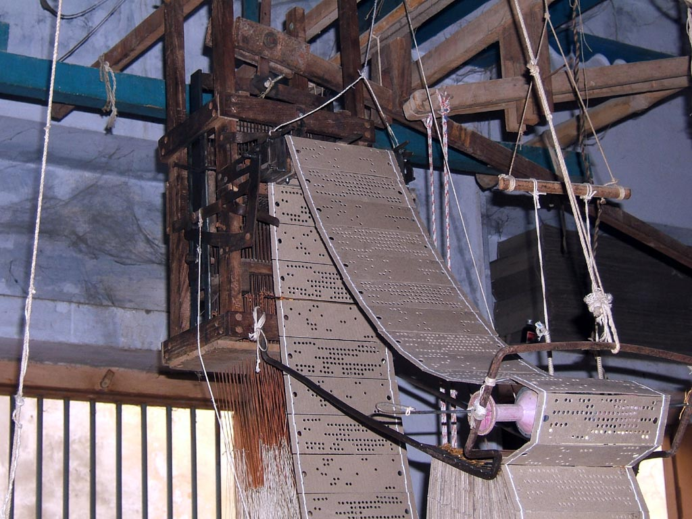

O tear de Jacquard era completamente programável por meio de cartões perfurados de papel. Cada cartão representava uma linha do desenho, e a máquina podia ser acoplada a qualquer tear existente. Isso simplificou e barateou a produção de tecidos com padrões mais complexos, revolucionando a indústria têxtil da época.


Embora o tear de Jacquard fosse uma aplicação simples de uma DSL (_Domain Specific Language_, ou uma linguagem projetada para um propósito específico), seu trabalho inspirou o desenvolvimento de linguagens mais complexas, capazes de serem interpretadas por diferentes tipos de máquinas.

## Ada Lovelace e a nota G

> Finalmente ela aparece!

Trinta e seis anos após Jacquard patentear seu tear, em 1840, o professor [Charles Babbage](https://en.wikipedia.org/wiki/Charles_Babbage) foi convidado a dar um seminário em Torino, na Itália, sobre os avanços de seu projeto mais ambicioso: o motor analítico (um tema para um futuro _Backlog_). Esse seminário foi a única apresentação pública que Babbage fez sobre a máquina revolucionária que estava desenvolvendo.

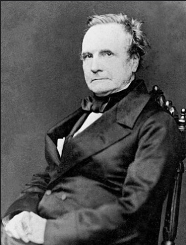

Durante a palestra, um engenheiro chamado [Luigi Menabrea](https://en.wikipedia.org/wiki/Luigi_Menabrea) – que mais tarde se tornaria primeiro-ministro da Itália – tomou notas detalhadas para entender o funcionamento do complexo modelo que, no futuro, seria conhecido como o primeiro computador mecânico do mundo (mesmo que nunca tenha sido construído).

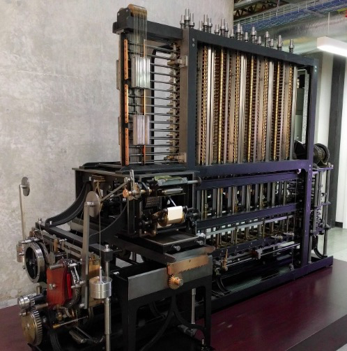

Babbage tinha uma amiga e mentorada importante: [Ada Lovelace](https://en.wikipedia.org/wiki/Ada_Lovelace). Desde 1833, ele e Ada, uma brilhante matemática e filha do poeta Lord Byron, trocavam cartas e notas sobre suas pesquisas e avanços matemáticos. Após uma conversa com Charles Wheatstone, Ada recebeu a sugestão de traduzir as notas de Luigi Menabrea para o inglês como uma forma de contribuir com o trabalho. Ao concluir a tradução, Babbage sugeriu que ela adicionasse seus próprios pensamentos em forma de apêndices, que Ada chamou simplesmente de "notas".


Ada compilou sete notas, nomeadas de A a G, detalhando o funcionamento do motor analítico. Na última delas, a nota G, ela descreveu um algoritmo para calcular os [números de Bernoulli](https://en.wikipedia.org/wiki/Bernoulli_numbers), projetado para ser executado exclusivamente na máquina de Babbage. Esse algoritmo – e essa nota – é amplamente reconhecido como **o primeiro programa de computador já escrito**, tornando Ada Lovelace como **a primeira programadora da história**.


As [notas](https://en.wikipedia.org/wiki/Note_G) de Ada eram três vezes mais extensas do que o artigo original de Luigi Menabrea. Além de descrever o algoritmo (apenas na última nota, a G), Ada detalhou todo o funcionamento do motor analítico, explicando como ele diferia da máquina anterior, o motor de diferenças. Na nota C, ela apresentou conceitos revolucionários, como loops, fluxos de controle (_if_, _else_) e funções – a primeira vez que essas ideias apareceram na história.

> Um fato engraçado é que nem o próprio Babbage tinha pensado nisso para a máquina. As ideias de Ada eram muito maiores que as ambições do seu próprio criador.

E ela fez isso sem nunca ter nem visto a máquina em si (que nunca foi completamente construída) ou ter usado qualquer parte dela. E hoje a gente reclama quando não consegue usar uma API sem documentação...

## Plankalkül, quase lá...

O mundo da computação permaneceu praticamente o mesmo por cerca de 100 anos. Mas, entre 1943 e 1948, um cientista alemão chamado [Konrad Zuse](https://en.wikipedia.org/wiki/Konrad_Zuse) (se pronuncia “Zuza”) começou a perceber um grande problema: nenhuma linguagem de computação existente era [Turing-completa](https://en.wikipedia.org/wiki/Turing-complete), o que as tornava inadequadas para seus computadores Z1 a Z3.

> Spoiler: Konrad Zuse vai ganhar uma edição inteira do _Backlog_. Ele é amplamente reconhecido como o inventor do primeiro computador digital programável do mundo, o Z3.

Os computadores de Zuse começaram como máquinas de calcular mecânicas, parecidas com as ideias de Babbage. Mas, ao chegar à terceira versão (o Z3), ele criou algo revolucionário: um computador totalmente digital e programável. Agora, tudo o que faltava era uma linguagem que seu computador pudesse entender...

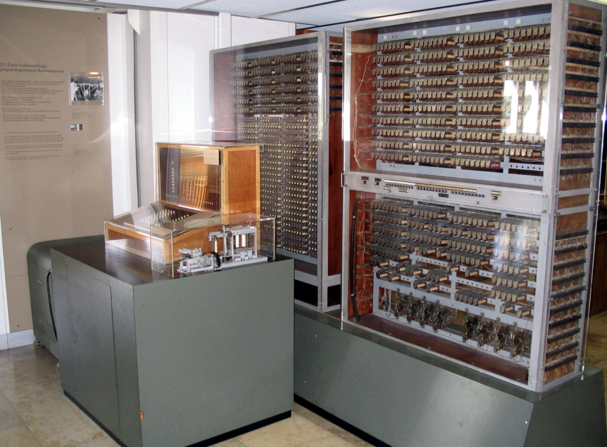

Por que não criar a sua própria linguagem? Foi exatamente o que Zuse fez. Ele se baseou em conceitos matemáticos, incluindo o cálculo proposicional – um campo complexo da matemática – para desenvolver um modelo de programação.

No entanto, como implementar diretamente o cálculo proposicional em um computador seria extremamente difícil (e não era Turing-completo), Zuse decidiu elaborar sua própria linguagem, chamada Plankalkül.

O [Plankalkül](https://en.wikipedia.org/wiki/Plankalk%C3%BCl) é amplamente reconhecido como **a primeira linguagem de programação de alto nível**, pois abstraía grande parte do funcionamento interno do computador. Com ela, os engenheiros não precisavam lidar diretamente com tarefas repetitivas, como a criação manual de loops.

Embora fosse uma linguagem completamente estabelecida teoricamente, o Plankalkül nunca foi implementado nos computadores de Zuse, como o Z3, mesmo tendo sido desenvolvida depois. O Z3 em si era programado usando fitas perfuradas em um filme cinematográfico, que eram lidas por relés eletromecânicos para uma memória de 1408 bits (64 palavras de 22 bits cada).

> Estou deixando um vídeo sobre como o Z3 funcionava, ele está em alemão mas existem legendas auto traduzidas do YouTube.


Em vez disso, sua principal motivação era oferecer uma maneira mais eficiente e estruturada de programar, permitindo o desenvolvimento de programas mais sofisticados e de "fácil compreensão".

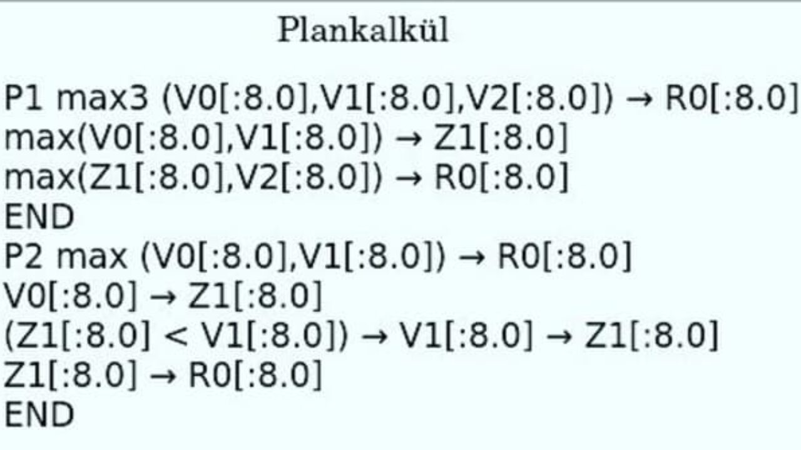

> Zuse achava que isso era algo de "fácil compreensão", tenho pena de quem precisava usar.

Eu gostaria de explicar como essa linguagem “mais simples” funciona, mas, sinceramente, não consegui entender nada (Zuse era muito mais inteligente do que eu). Então, vou deixar você com o básico:

-   A linguagem possui apenas um tipo primitivo, chamado `S0`, que representa um bit, ou seja, um valor booleano. Um bit pode ser `0` ou… `L` (sim, isso mesmo, pra que usar o `1` né?). Então, o número 2 (10 em binário) seria escrito como `L0`.
-   Todos os outros tipos são compostos, formados por arrays ou tuplas de bits. Por exemplo, uma sequência de 8 bits seria escrita como `8 x S0`.
-   As variáveis são sempre locais, sem escopo global.
-   Não há suporte para recursão, instruções goto ou referências – apenas valores diretos.
-   Suporta estruturas de controle como if, else, for e while.
-   Tipos compostos são sempre arrays ou tuplas, sem variações mais complexas.
-   Letras maiúsculas, como V, Z, C e R, identificam variáveis, saídas, registradores e constantes.

Eu imagino que isso fazia todo o sentido na cabeça de Zuse (porque na minha não faz), mas, infelizmente, a guerra e a dissolução da Alemanha nazista interromperam seu trabalho.

Com a ocupação dos aliados, ele foi proibido de continuar desenvolvendo computadores, e focou seus esforços na criação de linguagens, mas a linguagem nunca chegou a ser implementada na época. A primeira implementação funcional do Plankalkül só aconteceu em 1975, quando Joachin Hohmann a utilizou em sua dissertação acadêmica.

> Apesar de não ter sido implementada originalmente, a publicação de Zuse teve impacto significativo no desenvolvimento de linguagens posteriores, como o ALGOL e o APL, que já discutimos na edição #2.

## Agora sim, a mãe de TODAS as linguagens

Até aqui, a maioria das linguagens foi criada de forma um tanto artesanal: seus criadores basicamente estruturavam tudo o que sabiam sobre computação em um sistema funcional. Algumas dessas linguagens, como a APT usada no M70 que vimos na outra edição, eram tão específicas que exigiam até mesmo teclados especiais, cheios de símbolos exclusivos – bem diferente do que usamos hoje.

Mas isso começou a mudar em 1954 com o surgimento do [FORTRAN](https://en.wikipedia.org/wiki/Fortran) (abreviação de _**FOR**mula **TRAN**slation_), a primeira linguagem de programação comercial bem-sucedida. Desenvolvido por uma equipe liderada por John Backus na IBM, o FORTRAN trouxe uma abordagem prática e eficiente, que revolucionou o jeito de programar.

")

Por trás dessas linguagens revolucionárias, havia um desafio técnico gigantesco: fazer os computadores entendê-las.

### Compiladores

Entre a invenção de Zuse em 1943 e 1954, qualquer código escrito para um computador precisava ser traduzido diretamente em instruções de máquina específicas para aquele hardware. Era como escrever um programa exclusivo para cada processador, usando uma linguagem que só aquele processador entendia – muitas vezes composta por símbolos matemáticos.

Em 1950, surgiu uma invenção revolucionária: o **compilador**. Ele permitiu a criação de um grupo de linguagens chamado [_Autocode_](https://en.wikipedia.org/wiki/Autocode), que na época eram descritas como “sistemas de código”. O termo _autocoders_ se referia a uma família de linguagens compiladas, onde um mesmo conjunto de instruções podia ser traduzido para códigos de máquina de diferentes computadores. Em outras palavras, você podia escrever o código uma vez e compilar para várias máquinas, algo inédito até então.

A primeira dessas linguagens, pasmem, também se chamava _Autocode_. Ela foi criada em 1952 por Alick Glennie, junto com seu próprio compilador. Essa linguagem é considerada **a primeira linguagem compilada da história**, embora fosse pouco usada fora dos computadores [Manchester Mark I](https://en.wikipedia.org/wiki/Harvard_Mark_I).

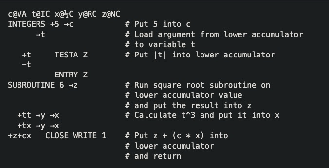

Essa evolução trouxe uma mudança radical: agora era possível criar códigos usando um sistema único, onde apenas o compilador precisava ser ajustado para cada máquina. Isso simplificou enormemente o desenvolvimento de novas linguagens de programação e abriu caminho para avanços ainda maiores na área.

### A história do FORTRAN

No final de 1953, John Backus apresentou uma proposta ousada para seus superiores na IBM: criar uma alternativa mais prática e eficiente ao [Assembly](https://en.wikipedia.org/wiki/Assembly_language) para programar o mainframe IBM 704. A ideia era simplificar a vida da galera, permitindo que eles se concentrassem mais no problema e menos nas instruções de máquina.


A principal solução que a nova linguagem deveria oferecer era simplificar a inclusão de equações matemáticas em computadores, aproveitando estudos de 1952 que provaram ser possível converter equações diretamente em código.

O FORTRAN tinha um objetivo claro: traduzir matemática para código. Daí seu nome, uma abreviação de _FORmula TRANslator_ (Tradutor de Fórmulas).

A primeira especificação da linguagem foi concluída em 1954, sob o título “_The IBM Mathematical Formula Translating System_”. Em 1957, o primeiro compilador de FORTRAN foi criado, e ele produzia um código de máquina rápido o suficiente para convencer a maioria dos programadores de que uma linguagem de alto nível podia ser uma alternativa viável – mesmo com os vários bugs iniciais.

> Curiosamente, John Backus criou o FORTRAN porque detestava programar. Enquanto escrevia programas para calcular trajetórias de mísseis no IBM 701, ele pensou: “Deve ter um jeito mais fácil de fazer isso.”

Depois de 1958, o FORTRAN ganhou um compilador confiável e rapidamente se tornou amplamente utilizado na maioria dos mainframes da IBM, estabelecendo-se como a principal linguagem de programação da época. Seu sucesso foi tão grande que, em 1963, já existiam mais de 40 compiladores de FORTRAN.

O FORTRAN era especialmente popular entre cientistas que precisavam realizar cálculos intensivos e precisos com números longos. Por isso, a linguagem foi continuamente aprimorada e, até hoje, é reconhecida como uma das linguagens mais rápidas do mundo para processamento numérico.

A versão inicial do FORTRAN tinha 32 palavras-chave (Golang, por exemplo, tem 25) e suportava:

-   Switch
-   Go to
-   I/O em fita ou bloco
-   Aritimética

Quando ele foi criado, não existiam discos ou telas, a maioria dos programas era ainda feita em cartões perfurados, então os desenvolvedores tinham um "formulário" para poder criar, apagar e testar o código antes de transferir para um cartão final.

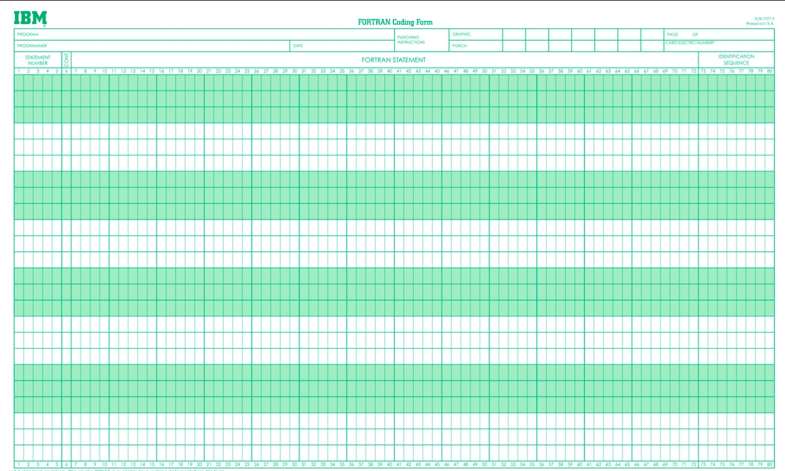

E, nesses cartões perfurados, existiam algumas colunas específicas que eram destinadas a uso de controle, por exemplo:

-   Um C na primeira coluna transformava o cartão todo em um comentário
-   As colunas 1 a 5 eram labels, usadas para retornar em funções como `GO` e `IF`
-   A coluna 6 era pra dizer se o cartão era uma continuação do anterior
-   De 7 a 72 era onde escrevíamos os programas
-   De 73 até 80 eram ignoradas porque o IBM 704 só lia 72 colunas, então eram muito usadas para anotações ou identificação, como a ordem dos cartões e etc.

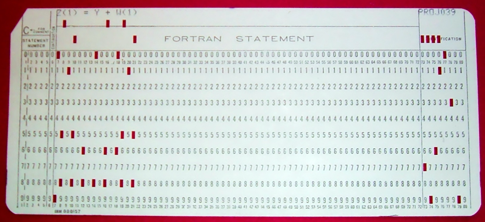

Lembrando que cada cartão perfurado representava somente UM statement, ou seja, cada cartão era uma keyword ou uma linha, o cartão acima poderia ter sido um `IF`.

### Evoluções

Após a versão inicial, o FORTRAN continuou evoluindo – e ainda evolui. É a linguagem de programação mais antiga ainda em uso ativo, com sua versão mais recente lançada em 2023. A primeira grande atualização, o **FORTRAN II**, trouxe um avanço significativo: o suporte à programação procedural, permitindo a criação de sub-rotinas e modularizando o código de forma mais eficiente.

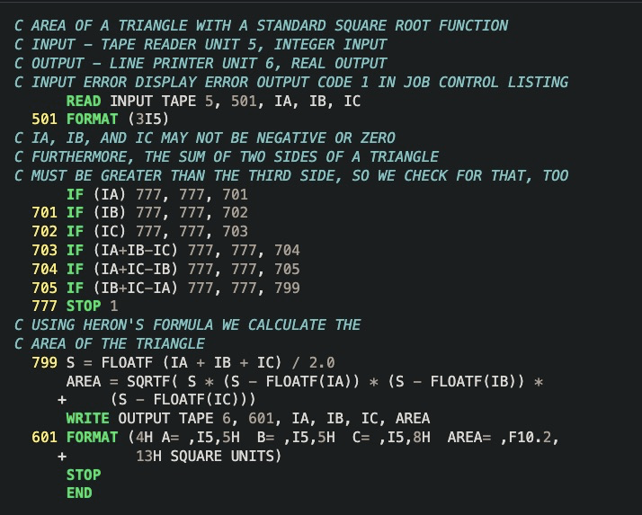

A versão inicial do FORTRAN não tinha funções ou rotinas, todo o código tinha que ser replicado e copiado, mas na versão II era possível usar as keywords `SUBROUTINE`, `FUNCTION` e `END` para criar uma rotina, além de `CALL` e `RETURN`. Mas as versões iniciais ainda não suportavam recursão.

Depois veio o **FORTRAN III**, que introduziu a possibilidade de escrever _assembly_ diretamente junto com o código FORTRAN. No entanto, essa versão nunca foi lançada como um produto comercial. Em vez disso, a IBM lançou o **FORTRAN IV** em 1961, trazendo mudanças significativas. A principal foi a remoção de dependências específicas das máquinas IBM, como a instrução `READ INPUT TAPE`, permitindo que o FORTRAN fosse usado em diferentes computadores além dos da IBM.

Mas talvez a evolução mais importante tenha sido o **FORTRAN 66**. Essa versão foi a primeira a passar por um processo de padronização oficial, muito parecido com o que aconteceu mais tarde com o JavaScript. A especificação foi elaborada pela _American National Standards Institute (ANSI)_ e por um comitê chamado _BEMA_. Baseada largamente no FORTRAN IV, ela trouxe várias funcionalidades importantes:

-   Subrotinas e funções
-   Novos tipos primitivos `INTEGER`, `REAL`, `DOUBLE PRECISION`, `COMPLEX` e `LOGICAL`
-   A keyword `DATA` para especificar valores iniciais
-   `GO TO` , `IF`, `DO` e muitos outros

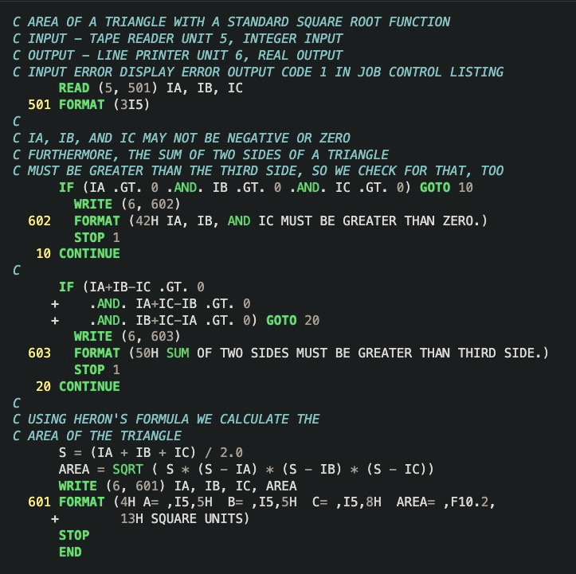

11 anos depois, o FORTRAN 77 é o que temos como início do que usamos hoje como linguagem de programação, incluindo mudanças como:

-   O uso de `IF` estruturado com `END IF` ao invés de `GO TO` e `CONTINUE`
-   O primeiro uso de aspas para textos, já que agora era possível escrever em terminais
-   Inclusão de `PROGRAM` para nomear programas

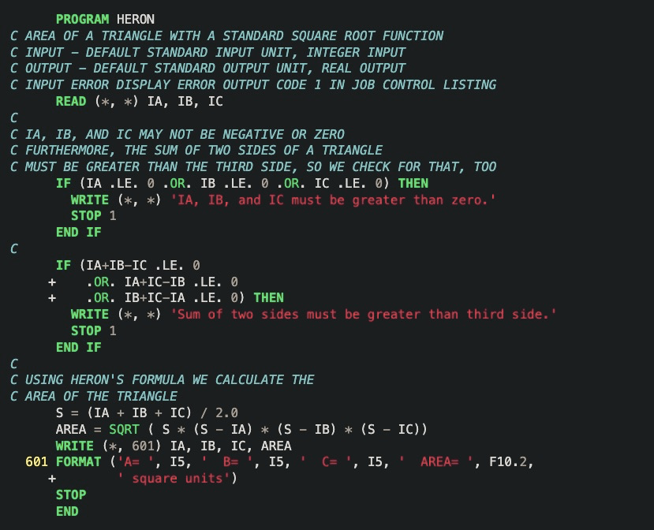

Uma curiosidade interessante sobre o FORTRAN é como ele lidava com comentários e linhas vazias. Qualquer linha que começasse com a letra C era interpretada como um comentário. No entanto, o compilador do FORTRAN lia todas as linhas do programa em sequência – incluindo as linhas vazias, que frequentemente geravam erros. Para evitar problemas, era comum usar um comentário vazio para separar uma linha da outra.

O FORTRAN continuou evoluindo, mas foi apenas 13 anos depois que surgiu uma grande revisão: o **FORTRAN 90**. Essa versão é uma das mais comumente utilizadas até hoje, pois trouxe mudanças significativas que provavelmente você nem percebeu de imediato, mas que facilitaram muito a vida dos programadores:

-   O texto não precisava ser identado 6 caracteres pra frente antes de qualquer statement (lembra das 6 colunas dos cartões perfurados? Agora olha a identação dos códigos de antes, veja a identação)
-   As palavras-chave poderiam ser minúsculas
-   Nomes de variáveis com até 31 letras (antes eram só 6)
-   Comentários inline ao invés de ocupar a linha toda
-   Agora era possível operar em arrays como um todo
-   Recursão
-   Módulos para agrupar procedures e dados juntos e torná-los disponíveis para importação em outros programas, o primeiro conceito de "pacote"
    -   Aqui também temos a inclusão de encapsulamento, tendo funções e partes privadas de um módulo
-   Overloads
-   `SELECT CASE`, que é a primeira versão de um `switch`
-   ....

Agora os programas de FORTRAN são muito parecidos ao que escrevemos hoje, veja um hello world:

```f90
program helloworld
     print *, "Hello, World!"
end program helloworld
```

Depois dessas versões, ainda temos o FORTRAN 95 até 2023, que implementou muitas mudanças até hoje, tornando o FORTRAN extremamente útil ainda hoje em dia.

## O FORTRAN atualmente

O FORTRAN ainda é amplamente utilizado em sistemas críticos e antigos, como na aviação, em mainframes e em aplicações que demandam computação extremamente rápida. Sua relevância está especialmente em cenários que exigem alta performance no processamento de grandes volumes de dados.

A linguagem é uma escolha comum em áreas como simulações de mecânica de fluidos, modelagem espacial e terrestre, e no cálculo de temperaturas em oceanos. Graças à sua eficiência em cálculos numéricos intensivos, o FORTRAN continua muito usado em campos que dependem de simulações científicas e engenharia de alta precisão.

")

O código FORTRAN em si sofreu várias modificações até ficar muito parecido com o que a gente entende como um código de programação, por exemplo, abaixo temos um programa para calcular a média dos números lidos:

```fortran
program average

    ! Read in some numbers and take the average
    ! As written, if there are no data points, an average of zero is returned
    ! While this may not be desired behavior, it keeps this example simple

    implicit none

    real, allocatable :: points(:)
    integer           :: number_of_points
    real              :: average_points, positive_average, negative_average
    average_points   = 0.
    positive_average = 0.
    negative_average = 0.
    write (*,*) "Input number of points to average:"
    read  (*,*) number_of_points

    allocate (points(number_of_points))

    write (*,*) "Enter the points to average:"
    read  (*,*) points

    ! Take the average by summing points and dividing by number_of_points
    if (number_of_points > 0) average_points = sum(points) / number_of_points

    ! Now form average over positive and negative points only
    if (count(points > 0.) > 0) positive_average = sum(points, points > 0.) / count(points > 0.)
    if (count(points < 0.) > 0) negative_average = sum(points, points < 0.) / count(points < 0.)

    ! Print result to terminal stdout unit 6
    write (*,'(a,g12.4)') 'Average = ', average_points
    write (*,'(a,g12.4)') 'Average of positive points = ', positive_average
    write (*,'(a,g12.4)') 'Average of negative points = ', negative_average
    deallocate (points) ! free memory

end program average
```

Atualmente ainda existem repositórios que contém códigos FORTRAN como em jogos e a linguagem ainda é amplamente utilizada.

https://github.com/fortran-gaming?utm_source=chatgpt.com

## Legado

O FORTRAN foi a primeira linguagem de alto nível a ser largamente distribuída e tudo que usamos atualmente é idêntico ou foi baseado em algum tipo de implementação trazida pelo FORTRAN. Linguagens de base como COBOL, BASIC e ALGOL foram fortemente influenciadas pelo FORTRAN e, em troca, influenciaram outras linguagens como o B, C e todas as que se sucederam.

Recentemente eu estive no [**Museu Da História da Computação**](https://www.tnmoc.org/software) em Bletchley Park (veja no meu [instagram](https://instagram.lsantos.dev)) e lá a gente tem um mural muito legal de todas as linguagens de programação que já existiram em um mapa interativo. Você pode acessar esse mapa aqui e, quem sabe, imprimir para decorar sua casa:

https://www.levenez.com/lang/

Esse marca o fim dessa edição do Backlog! Espero que você tenha curtido assim como eu saber mais sobre o que foi a primeira linguagem de todas e como ela funcionava!

Um abraço e um feliz natal!

Nos vemos na próxima edição!
