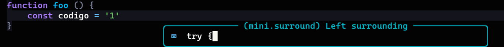

import figureImage1 from './backlog-vim/gloom-contrast-9021c959.png'
import figureImage2 from './backlog-vim/image.png'
import figureImage3 from './backlog-vim/image-1.png'
import figureImage4 from './backlog-vim/image-2.png'
import figureImage5 from './backlog-vim/image-3.png'
import figureImage6 from './backlog-vim/image-6.png'
import figureImage7 from './backlog-vim/image-7.png'
import figureImage8 from './backlog-vim/image-4.png'
import figureImage9 from './backlog-vim/image-5.png'
import figureImage10 from './backlog-vim/image-9.png'
import figureImage11 from './backlog-vim/image-11.png'
import figureImage12 from './backlog-vim/image-12.png'

Há mais ou menos 6 meses eu resolvi que era hora de deixar de lado o preciosismo e largar meu editor de longa data (VSCode) e começar a usar esse tão famoso **Vim**. Quando terminei de configurar e estava satisfeito com meu progresso inicial, escrevi [esse artigo](/instalando-e-configurando-o-neovim/). Nele, eu documentei grande parte da minha jornada através da instalação e das primeiras impressões com o Vim, mas eu não quis me estender muito sobre o uso porque eu não tinha usado o editor por tempo o suficiente para ter opiniões (e nem estatísticas) sobre o uso dele.

Agora é diferente. Depois de 6 meses usando **somente** o Neovim como meu editor principal (na real, como o único editor) eu quero destrinchar tudo que eu aprendi, o que eu ganhei, o que eu perdi, o que eu mais gostei e o que eu achei estranho nessa nova experiência.

Vamos lá!

---

## Pausa para o aviso!


🔥 Quer dominar TypeScript de verdade? 🔥

Se você quer escrever código mais seguro, escalável e sem surpresas, **A Formação TS Essencial** é o curso que vai te levar do básico ao avançado com prática real! São mais de **16 horas de conteúdo**, **3 projetos práticos** com cenários reais, exercícios, um minicurso de validação com Zod e **acesso à comunidade no Discord**, onde você pode trocar ideias e tirar dúvidas direto comigo.

💡 Já somos **mais de 300 alunos** e, só aqui na newsletter, você ganha **15% de desconto** com o cupom exclusivo **FTSBKLG8**! Mas corre, porque é por tempo limitado.

🎯 Garanta sua vaga agora: [https://formacaots.com.br](https://pay.hotmart.com/L84853211Y?checkoutMode=10&off=e01ju3cm&offDiscount=FTSBKLG8&utm_source=blog&utm_medium=backlog-8&utm_campaign=sponsor)

---

💌 **Me ajude a manter a newsletter no ar!** Se você quer patrocinar e alcançar milhares de devs toda edição, entre em contato: [**hello@lsantos.dev**](mailto:hello@lsantos.dev).

## Por que comecei a usar o Vim?

Eu uso o VSCode desde muito provavelmente o lançamento, lembro de ter usado a versão beta e pensado "meu Deus isso é horrível" e voltado diretamente para o meu Sublime Text. Mas, alguns anos depois o VSCode se tornou provavelmente o melhor e mais poderoso editor de código de todos, hoje eu vejo poucos motivos para você começar usando outro editor que não seja ele.

> Mas então... Por que eu comecei a usar o Vim?

Desde que eu comecei em desenvolvimento eu já conhecia o `vi` e outros editores como o `nano` para quando eu precisava fazer um SSH em alguma máquina, ou então configurar algum servidor, mas eu nunca me importei em aprender **de verdade** como o Vi/Vim funcionava até meados de 2016 em um PHPExperience em São Paulo.

<Figure src={figureImage1} priority alt="GitHub - rainglow/atom: 320+ color themes for Atom." caption="<span style=&quot;white-space: pre-wrap;&quot;>Screenshot do falecido Atom, o precursor do VSCode</span>" />

Nesse dia o [Augusto Pascutti](https://github.com/augustohp) fez uma palestra chamada _"Por que Vim?"_, mostrando os vários pontos interessantes de usar o editor. Macros, movimentações, configuração aberta e muito mais. Desde esse dia eu mantive o Vim no radar (com uma curiosidade absurda) mas, sempre que eu tentava começar, a curva de aprendizado era muito alta e eu desistia porque demorava muito tempo.

Os anos foram passando, eu fiquei cada vez mais preso no VSCode, eu adorava estar por lá, meu ambiente era inteiro modificado, eu consegui deixar o editor realmente como a minha casa. Mas infelizmente eu ainda precisava ter o editor instalado no computador... E o VSCode não é necessariamente muito leve para rodar em todos os lugares, mesmo com avanços como a separação do servidor da interface e etc...

Mas, o ponto final que me fez mudar para o Vim, foi **perceber quanto tempo eu perdia parando de escrever ou tirando a mão do teclado para pegar no mouse e mover as coisas**... Se você nunca pensou nisso, pare um pouco, grave você mesmo(a) usando o computador em timelapse e veja a quantidade de vezes que a sua mão faz o movimento lateral de pegar no mouse e depois voltar... Isso estava me incomodando muito - A ponto de eu estar trabalhando em um teclado especial com um mouse embutido.

> Eu ODEIO mouses no geral, se eu tenho a opção de fazer tudo em um terminal eu farei... Talvez isso seja o resquício da minha época de sysadmin com AKS. Mas eu adoro TUIs e tudo que não tenha interface gráfica simplesmente porque é muito mais responsivo.

Então, quando eu instalei meu dual boot com o Arch Linux, eu resolvi instalar um Window manager chamado Sway, que dispensa o uso do mouse para a maioria das coisas, então eu pensei: "Por que não começar a abandonar o mouse de vez?" e foi ai que eu resolvi sair completamente do VSCode e usar apenas o Vim.

Infelizmente o uso de GUIs ainda é muito grande e a maioria delas não tem um suporte muito bom para teclado, com atalhos ou movimentações, então infelizmente não vamos ter como abandonar o mouse de uma vez por todas...

> Eu também tentei usar a extensão do Vim para o VSCode, mas ele é um editor feito para ser usado com um mouse, então a movimentação não era tão fluida na interface, o que era um problema.

## Adaptação inicial

> Vou pular a parte da configuração e tudo mais porque já comentei sobre no primeiro artigo

O principal no início foi me forçar a criar o hábito de usar o Vim. Porque eu estava tão acostumado com o VSCode que, por padrão, eu já abria o editor direto.

Para me forçar a usar o Vim, eu removi o VSCode da minha área de trabalho, removi os bindings de arquivos que abririam no VSCode e me forcei a apenas abrir o terminal quando eu iniciasse a máquina. Alguns dias fazendo isso foram suficiente para pegar o hábito. Outra coisa que ajudou bastante foi que eu gostava do look and feel do Nvim, então era legal estar com ele aberto, e ele é muito responsivo então as coisas acontecem muito rápido e você fica se sentindo um hacker.

Quando o primeiro empecilho acabou, o segundo era o pior de todos: **lembrar das teclas**...

### O primeiro problema

Essa é, sem duvida, a parte mais complicada de tudo que eu tive que fazer para usar o Vim. As principais teclas que todo mundo conhece (`hjkl`) são bem simples, a maioria dos comandos básicos como trocar de modo (com `i`, `v`), substituir (`c`, `C`, `r` e `R`) e as modificações de linhas com `O`, `dd`, `D`, etc também são bem intuitivos.

<Figure src={figureImage2} alt="" caption="<span style=&quot;white-space: pre-wrap;&quot;>Nvim rodando um projeto com Deno</span>" />

O problema é quando você tem que interagir com o resto que não é texto, por exemplo, a lista de arquivos, abrir o gerenciador do Git (com o LazyGit) e interagir com popups que aparecem na tela, como as completions do intellisense e os quick peaks que mostram as hints de tipo no TypeScript. Não porque elas são ruins, mas porque em cada novo painel, as teclas mudam.

Por exemplo, o Telescope (equivalente ao `ctrl+p` do VSCode) tem um campo de busca, então as teclas padrão de movimentação não funcionam (porque elas estão digitando no input de texto), ao invés disso a combinação é `ctrl-p` para subir e `ctrl+n` para descer (para `previous` e `next`). Além disso ele tem uma pequena preview do lado direito que você pode movimentar não com `ctrl+hjkl`, mas com `ctrl+dfku`...

<Figure src={figureImage3} alt="" caption="<span style=&quot;white-space: pre-wrap;&quot;>Telescope.nvim no modo de inserção</span>" />

Mas isso é apenas no modo de inserção, quando trocamos para o modo normal, as teclas de movimentação voltam ao padrão, mas as da preview não...

<Figure src={figureImage4} alt="" caption="<span style=&quot;white-space: pre-wrap;&quot;>Telescope.nvim no modo normal</span>" />

Além disso, o equivalente ao "Find All" do VSCode, é uma mistura de `ripgrep` com `fzf` que busca em todos os arquivos via regex e é uma das ferramentas mais poderosas do Nvim, mas não tem uma seleção de modos... Então para mover os resultados sem usar as setas (que estão mais longe no teclado), temos que usar o que? O que seria intuitivo: `ctrl+hjkl`...

<Figure src={figureImage5} alt="" caption="<span style=&quot;white-space: pre-wrap;&quot;>Captura de tela do ripgrep</span>" />

Porém, por incrível que pareça, você usa tanto essas ferramentas (especialmente o telescope) que essas combinações meio que ficam gravadas na sua cabeça. No final do primeiro mês eu já estava 100% confortável com a UI do Vim, inclusive movendo o cursor pelas janelas e tudo mais.

No final, as teclas não são tanto um problema porque o próprio LazyVim tem um comando para buscar todas as teclas, o `<leader>sk`:

<Figure src={figureImage6} alt="" caption="<span style=&quot;white-space: pre-wrap;&quot;>Se você perdeu alguma tecla, pode buscar aqui</span>" />

Além disso o pacote `whichkey` mostra todas as combinações possíveis de uma tecla pressionada:

<Figure src={figureImage7} alt="" caption="<span style=&quot;white-space: pre-wrap;&quot;>Exemplo de teclas possíveis com &lt;leader&gt; pressionado</span>" />

Isso torna toda a experiência muito boa e aquém de um VSCode, se você quer explorar o editor, basta passar pelas teclas.

### O melhor e pior ao mesmo tempo

Outra coisa que vale a pena pontuar é que, durante o primeiro mês (e até hoje, na verdade) eu estou sempre fazendo pequenos tweaks aqui e ali na minha configuração do LazyVim, especialmente quando ele atualiza e muda padrões. Isso é relativamente chato, provavelmente é a coisa que eu mais odeio no Nvim até o momento, mas também é uma das que eu mais gosto: **a configuração**.

Enquanto a configuração é extremamente permissiva e você pode virtualmente fazer qualquer coisa, ela também é extremamente complexa de entender. A documentação é basicamente inexistente, o LSP de Lua tenta fazer o melhor para extrair as funções e mostrar o que você pode usar, mas a maioria das funções do Vim não são conhecidas, o autocompletion é bem ruim e no geral você se vê procurando coisas na Internet mais do que qualquer coisa.

<Figure src={figureImage8} alt="" caption="<span style=&quot;white-space: pre-wrap;&quot;>Overrides para o Neotree</span>" />

A configuração do hierárquica é hieráquica, então as configurações iniciais vão ser sobrescritas por uma configuração posterior, portanto a ordem como os plugins e configurações são carregados importa. E isso é uma droga porque não existe um autocompletion bonitinho para o que você pode colocar ali, é sempre um jogo de testes.

Alguma programação em Lua quase sempre é necessário, e muitas vezes obrigatório. Em outros casos a configuração base é suficiente, no geral, a documentação do LazyVim em si é muito boa e ajuda MUITO, ela é bem definida e explicada, mas você eventualmente vai cair em problemas.

### LSPs

O maior problema que eu tive foi configurar os LSPs. As configurações padrão para a maioria das linguagens que eu uso é ok, porém eu tive um conflito com Node e Deno. Como ambos usam a mesma linguagem porém tem arquivos-chave diferentes, eu tive que escrever uma função para verificar se o repositório era um repositório Deno ou Node e evitar que eu tenha tanto o LSP de Node quando o de Deno no mesmo arquivo.

> LSPs são [Language Server Protocols](https://en.wikipedia.org/wiki/Language_Server_Protocol), um protocolo criado pela Microsoft para introduzir a capacidade de um editor se conectar a um serviço que tem a inteligência da linguagem de forma separada, independente do editor, para dar coisas como completions, intellisense e etc de forma distribuída.

<Figure src={figureImage9} alt="" caption="<span style=&quot;white-space: pre-wrap;&quot;>Função para distinguir Deno de Node</span>" />

Até agora eu só falei coisas ruins, ou coisas que gostei menos do que os demais, será que o Vim é bom assim mesmo?

## O ponto de virada

Depois de mais ou menos 2 meses usando o Vim diariamente eu estava pensando que não iria ter nenhuma mudança, eu não estava me sentindo mais "rápido" ou com "super poderes", até o dia que eu precisei modificar um arquivo realmente grande.

Como eu estava com um pouco de pressa e teria que alterar uma série de coisas no arquivo com Regex, eu tentei usar o VSCode logo de cara, mas ele não abriu o arquivo... Então tentei abrir com o Vim e ele nem sofreu, enquanto o VSCode estava usando mais de 2gb de memória só para abrir o arquivo, meu Nvim estava com o arquivo aberto, funcional usando meros 120mb. Aí foi quando eu percebi o ganho além do desenvolvimento.

Eu estava tão focado em usar o editor que eu não cheguei a perceber os verdadeiros super poderes que eu estava ganhando. Primeiro de tudo, eu estava usando cerca de 45% a menos de recursos do meu computador, uma economia absurda para um editor de código. Além disso o editor é **muito responsivo**, quase tudo que você faz acontece praticamente instantâneamente, tudo isso sem tirar a mão do teclado. Eu considero isso um super poder.

Dentro do código, eu comecei a perceber que eu ganhei uma memória muscular para algumas coisas, por exemplo:

-   Apertar `:wq` ou `:w` quase sempre em todo lugar
-   Apertar `esc` depois de digitar uma linha (inclusive durante esse artigo)
-   Tentar mover qualquer coisa com `jhkl`
-   Tentar navegar com `w` e `b` entre linhas e `{` no código
-   Pesquisar qualquer coisa apertando `/`
-   Tentar usar o `<leader>` (que no meu caso é o espaço) para iniciar comandos
-   Copiar coisas com `y` e colar com `p`

Isso está tão automático para mim que virou algo natural, quando eu não consigo fazer algum desses comandos eu me sinto estranho. Além disso eu comecei a perceber que eu estava cada vez mais usando outros comandos do Vim que eu não usava antes, _eu estava aprendendo!_

### Melhorias progressivas

Um dos meus checkpoints foi ter começado a fazer o uso extensivo de **vim words**, que são conjuntos de teclas que permitem que você faça várias ações ao mesmo tempo, por exemplo, se eu quiser deletar um único caractere eu posso apertar `x`, então se eu quiser deletar uma palavra inteira eu posso só ficar apertando `x` até o fim. Mas eu também posso falar para o Vim deletar tudo dentro daquela palavra com `diw`, ou _**d**elete **i**n **w**ord_ sem deletar os espaços, ou deletar tudo em volta com `daw`, onde o "a" é _**a**round_.

Essas são as conhecidas Vim words, que eu já sabia que existiam mas nunca tinha usado extensivamente. E você pode combinar `aw` e `iw` com basicamente qualquer coisa, por exemplo, o LazyVim tem um plugin chamado `surround` que permite que você envolva qualquer coisa com qualquer outra coisa, por exemplo:

```js
function foo () {
    const codigo = '1'
}
```

Se eu quiser adicionar um `try/catch` ao redor desse código, eu posso entrar no modo de seleção de linha com `V`, digitar `gsa?` e incluir `try {` no primeiro prompt e `} catch {}` no segundo:



E o resultado vai ser o esperado:

```js
function foo () {
    try {const codigo = '1'} catch {}
}
```

Outros comandos mais avançados como edição em bloco `ctrl+V` também são super úteis, e muito mais poderosos do que a edição de multi cursor do VSCode, porque você pode editar múltiplas colunas ao mesmo tempo.

Quando isso não é suficiente, você pode usar o famoso replace no estilo `sed` , que foi uma ferramenta essencial para eu poder ter uma melhoria drástica na minha eficiência, por exemplo, se eu quisesse substituir uma sequencia grande de chamadas:

```ts
controller.run(new URN<'application'>(args.params.applicationId))
controller.run(new URN<'application'>(args.params.applicationId))
controller.run(new URN<'application'>(args.params.applicationId))
controller.run(new URN<'application'>(args.params.applicationId))
controller.run(new URN<'application'>(args.params.applicationId))
controller.run(new URN<'application'>(args.params.applicationId))
controller.run(new URN<'application'>(args.params.applicationId))
controller.run(new URN<'application'>(args.params.applicationId))
controller.run(new URN<'application'>(args.params.applicationId))
controller.run(new URN<'application'>(args.params.applicationId))
controller.run(new URN<'application'>(args.params.applicationId))
controller.run(new URN<'application'>(args.params.applicationId))
controller.run(new URN<'application'>(args.params.applicationId))
controller.run(new URN<'application'>(args.params.applicationId))
controller.run(new URN<'application'>(args.params.applicationId))
controller.run(new URN<'application'>(args.params.applicationId))
controller.run(new URN<'application'>(args.params.applicationId))
controller.run(new URN<'application'>(args.params.applicationId))
controller.run(new URN<'application'>(args.params.applicationId))
controller.run(new URN<'application'>(args.params.applicationId))
controller.run(new URN<'application'>(args.params.applicationId))
controller.run(new URN<'application'>(args.params.applicationId))
controller.run(new URN<'application'>(args.params.applicationId))
controller.run(new URN<'application'>(args.params.applicationId))
controller.run(new URN<'application'>(args.params.applicationId))
controller.run(new URN<'application'>(args.params.applicationId))
controller.run(new URN<'application'>(args.params.applicationId))
controller.run(new URN<'application'>(args.params.applicationId))
controller.run(new URN<'application'>(args.params.applicationId))
controller.run(new URN<'application'>(args.params.applicationId))
controller.run(new URN<'application'>(args.params.applicationId))
controller.run(new URN<'application'>(args.params.applicationId))
controller.run(new URN<'application'>(args.params.applicationId))
```

Eu quero remover todas as `new URN...` e deixar apenas a chamada para o `args.params.application`, eu posso usar a substituição `%s/(new URN<'application'>\(([a-zA-Z\.]*)\))/\1` para poder trocar tudo de uma vez:

<Figure src={figureImage10} alt="" caption="<span style=&quot;white-space: pre-wrap;&quot;>Replace inline com regex</span>" />

O comando em si parece bem complexo, mas vamos quebrar pra ficar mais fácil. Aqui eu estou:

1.  Pegando tudo que é `(new URN<'application'>(`
2.  Criando um grupo contendo `[a-zA-Z\.]*`, ou seja, todas as letras e o ponto
3.  Pegando os `))` finais
4.  Substituindo tudo por `\1` que denota o primeiro grupo que criamos no 2

Isso é algo que jamais eu iria fazer tão "simples" em outro lugar.

## Outras coisas que eu notei

Além dessas pequenas demonstrações, eu também notei algumas coisas sobre Vim que valem a pena serem comentadas:

-   Macros são **muito bons**, mas não são para todas as situações
-   Aprender a lidar com buffers e janelas é essencial, saber o que é um buffer, o que é uma janela, o que é um painel e essas coisas
-   O Vim possui um conjunto de registradores que você pode acessar com `"` no Lazy ou com `:reg` , esses registradores são poderosos porque permitem que você, por exemplo, copie multiplos textos de uma vez com `"<numero do reg>y` e cole de vários também com `"<numero>p`, o lazy tem uma lista bem legal de registradores

<Figure src={figureImage11} alt="" caption="<span style=&quot;white-space: pre-wrap;&quot;>Registradores no LazyVim</span>" />

-   Além de registradores o Lazy mantém uma lista de bookmarks (ou só `marks`) que permitem que você salve um local no código e volte para lá instantâneamente, em qualquer buffer, isso é muito útil para se mover entre duas localizações rápidamente com `''`, mas você pode criar uma marca com `m<letra>` e depois ir até ela com `'<letra>`

<Figure src={figureImage12} alt="" caption="<span style=&quot;white-space: pre-wrap;&quot;>Lista de marcas automáticas</span>" />

-   O Vim tem um terminal integrado com `:term` mas o Lazy tem um terminal em uma aba embaixo assim como o VSCode que permite você usar os comandos do Vim normalmente, mas eu achei um pouco mais fácil usar uma outra aba do mesmo terminal principalmente porque isso pode causar lag no editor.

## Veredito, valeu a pena?

Depois de 6 meses usando sem parar, eu posso dizer que **essa foi a melhor escolha que eu já fiz**. A forma como o Vim é rápido e instantâneo é incrível, usar o teclado ao invés do mouse para movimentação e para ações dentro do editor é ordens de grandeza mais rápido e mais eficiente do que usar um mouse tradicional (mesmo que o neovim suporte mouse).

A integração do editor com o que você está fazendo e o estado de "flow" que você entra estando em uma tela preta sem nenhuma distração é simplesmente incrível. Além de que tudo fica muito mais rápido e muito mais eficiente conforme você vai pegando mais dicas e aprendendo mais coisas sobre o Vim.

Acredito que o principal para mim é que eu posso ver que estou melhorando, é fácil ver uma melhoria, é fácil entender o que está acontecendo, o editor é intuitivo depois que você aprende os conceitos básicos sob o qual ele opera. E você perceber que existe uma melhoria constante e estar constantemente descobrindo novas coisas, novas teclas, novas combinações, novos workflows é simplesmente incrível, até para um editor que tem mais de 40 anos.

Se você já tentou usar o Vim, deixa seu comentário nas [minhas redes](https://lsantos.dev)! Eu quero muito saber como foi a **sua** experiência com o Vim!

Até mais!
