About 6 months ago I decided it was time to drop the pickiness and leave my longtime editor (VSCode) behind to start using the famous **Vim**. When I finished setting it up and was happy with my initial progress, I wrote [this article](/instalando-e-configurando-o-neovim/). In it, I documented most of my journey through the install and my first impressions with Vim, but I didn't want to go too deep into actual usage because I hadn't used the editor long enough to have opinions (or even stats) about it.

Now it's different. After 6 months using **only** Neovim as my main editor (really, as my only editor) I want to break down everything I learned, what I gained, what I lost, what I liked most, and what felt strange about this new experience.

Let's get into it!

## Why did I start using Vim?

I've used VSCode since probably its launch. I remember trying the beta version and thinking "my God this is horrible" and going straight back to my Sublime Text. But a few years later VSCode became probably the best and most powerful code editor out there, and today I see few reasons to start out with anything else.

> So then... why did I start using Vim?

Since I started in development I already knew `vi` and other editors like `nano` for when I needed to SSH into some machine, or set up a server, but I never bothered to **really** learn how Vi/Vim worked until mid 2016 at a PHPExperience event in São Paulo.

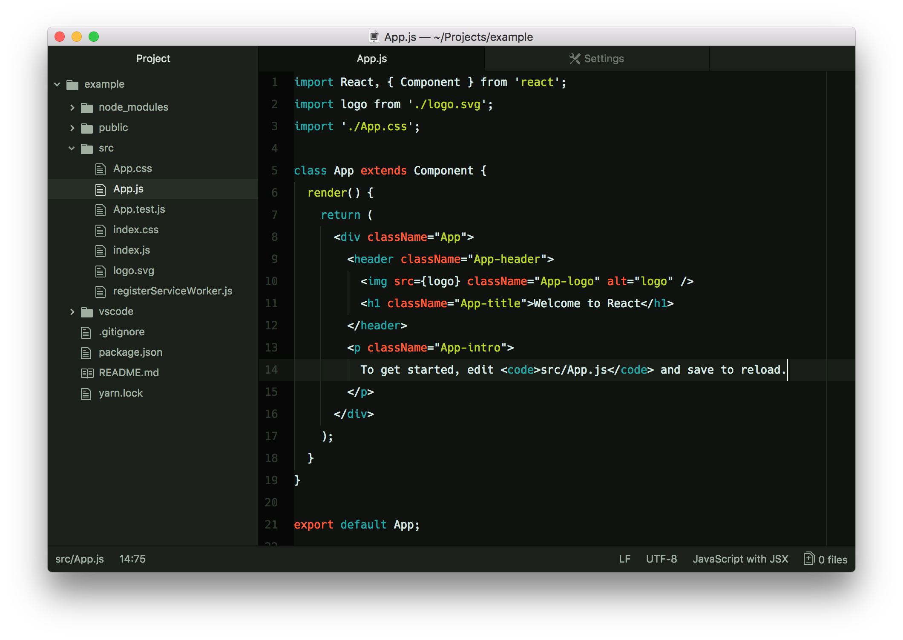

That day [Augusto Pascutti](https://github.com/augustohp) gave a talk called _"Why Vim?"_, showing several interesting points about using the editor. Macros, movement, open configuration, and much more. Since that day I kept Vim on my radar (with an absurd amount of curiosity), but every time I tried to get started, the learning curve was so steep that I gave up because it took too long.

The years went by, and I got more and more stuck on VSCode. I loved being there, my whole setup was customized, I managed to make the editor feel like home. But unfortunately I still needed to have the editor installed on the machine... And VSCode isn't necessarily lightweight enough to run everywhere, even with advances like splitting the server from the interface and so on...

But, the final straw that made me switch to Vim was **realizing how much time I lost stopping my typing or taking my hand off the keyboard to grab the mouse and move things around**... If you've never thought about this, stop for a second, record yourself using the computer in a timelapse and watch how many times your hand does that sideways move to grab the mouse and come back... That was bugging me a lot, to the point where I was working on a special keyboard with a built-in mouse.

I HATE mice in general, if I have the option to do everything in a terminal I will... Maybe that's a leftover from my days as a sysadmin with AKS. But I love TUIs and anything without a graphical interface simply because it's much more responsive.

So, when I installed my dual boot with Arch Linux, I decided to install a window manager called Sway, which does away with the mouse for most things, so I thought: "why not just start ditching the mouse for good?" and that's when I decided to leave VSCode entirely and use only Vim.

Unfortunately GUI usage is still huge and most of them don't have great keyboard support, with shortcuts or navigation, so unfortunately there's no way to ditch the mouse once and for all...

> I also tried using the Vim extension for VSCode, but it's an editor built to be used with a mouse, so the movement wasn't as smooth in the interface, which was a problem.

## Initial adaptation

I'll skip the configuration part and all that because I already covered it in the first article

The main thing at the start was forcing myself to build the habit of using Vim. Because I was so used to VSCode that, by default, I'd just open it straight away.

To force myself to use Vim, I removed VSCode from my desktop, removed the file bindings that would open in VSCode, and forced myself to only open the terminal when I started the machine. A few days of doing that were enough to build the habit. Another thing that helped a lot was that I liked the look and feel of Nvim, so it was nice to have it open, and it's very responsive so things happen really fast and you end up feeling like a hacker.

Once the first obstacle was out of the way, the second one was the worst of all: **remembering the keys**...

### The first problem

This is, without a doubt, the trickiest part of everything I had to do to use Vim. The main keys everyone knows (`hjkl`) are quite simple, most of the basic commands like switching modes (with `i`, `v`), replacing (`c`, `C`, `r` and `R`) and line changes with `O`, `dd`, `D`, etc are also pretty intuitive.

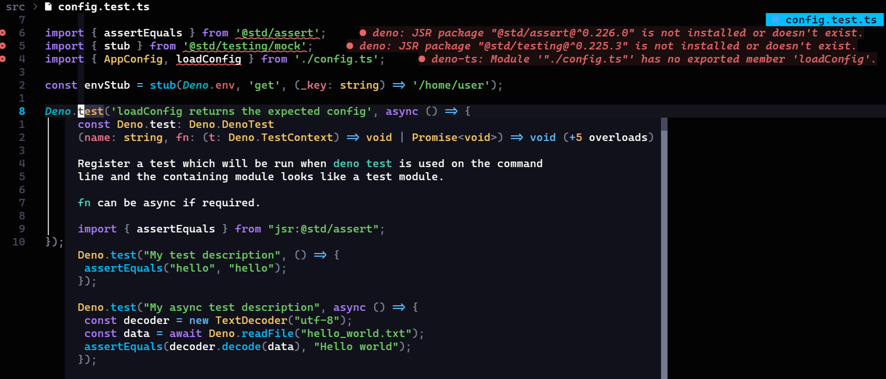

The problem is when you have to interact with everything that isn't text, like the file list, opening the Git manager (with LazyGit), and interacting with popups that show up on screen, like intellisense completions and the quick peeks that show type hints in TypeScript. Not because they're bad, but because the keys change in every new panel.

For example, Telescope (the equivalent of VSCode's `ctrl+p`) has a search field, so the standard movement keys don't work (because they're being typed into the text input), instead the combination is `ctrl-p` to go up and `ctrl+n` to go down (for `previous` and `next`). It also has a small preview on the right side that you move not with `ctrl+hjkl`, but with `ctrl+dfku`...

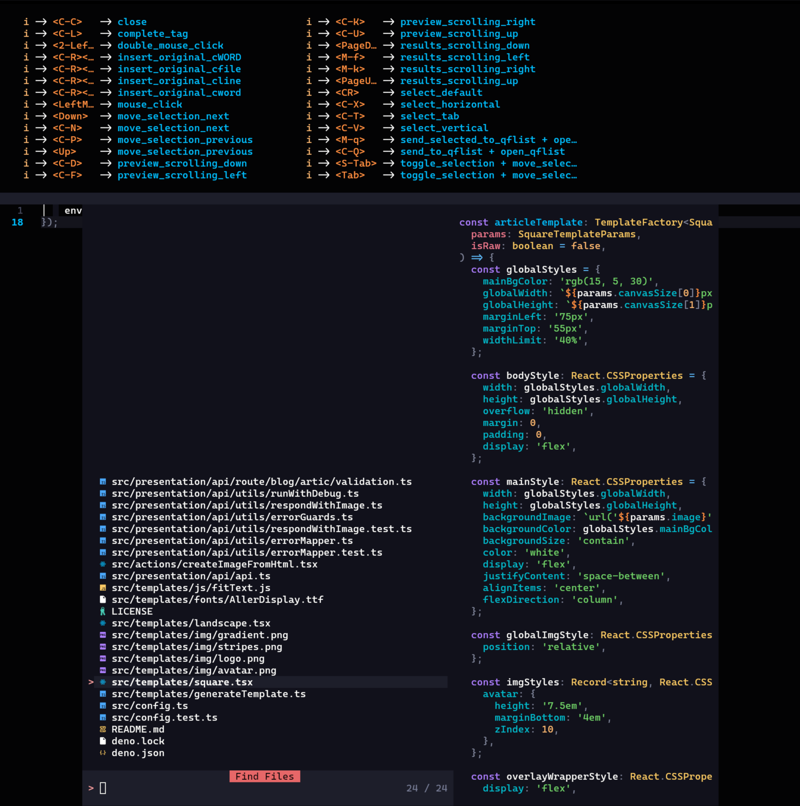

But that's only in insert mode, when we switch to normal mode, the movement keys go back to the default, but the preview ones don't...

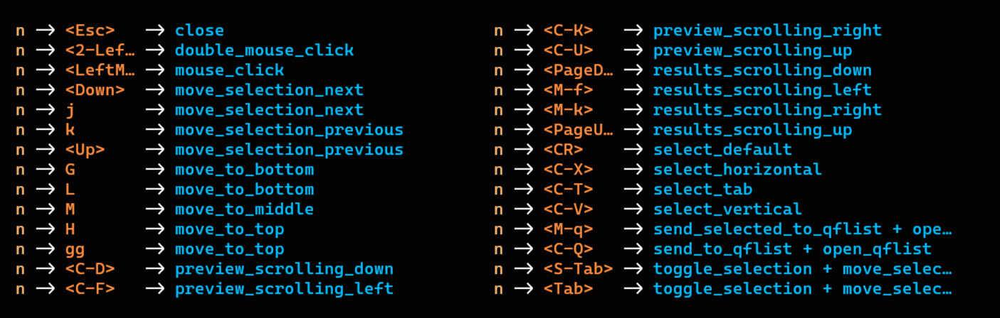

On top of that, the equivalent to VSCode's "Find All" is a mix of `ripgrep` and `fzf` that searches through every file via regex and is one of the most powerful tools in Nvim, but it doesn't have mode selection... So to move through the results without using the arrows (which are further away on the keyboard), what do we have to use? The intuitive thing: `ctrl+hjkl`...

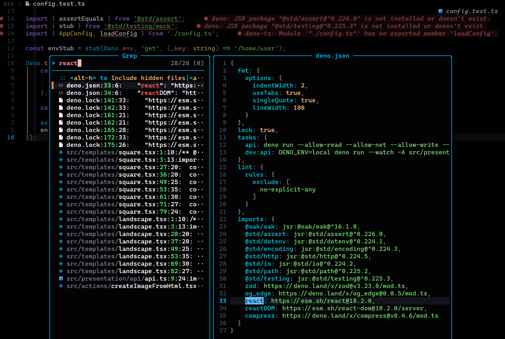

But, as crazy as it sounds, you use these tools so much (especially Telescope) that these combinations kind of get burned into your head. By the end of the first month I was already 100% comfortable with Vim's UI, including moving the cursor between windows and everything else.

In the end, the keys aren't that much of a problem because LazyVim itself has a command to search all the keybindings, `<leader>sk`:

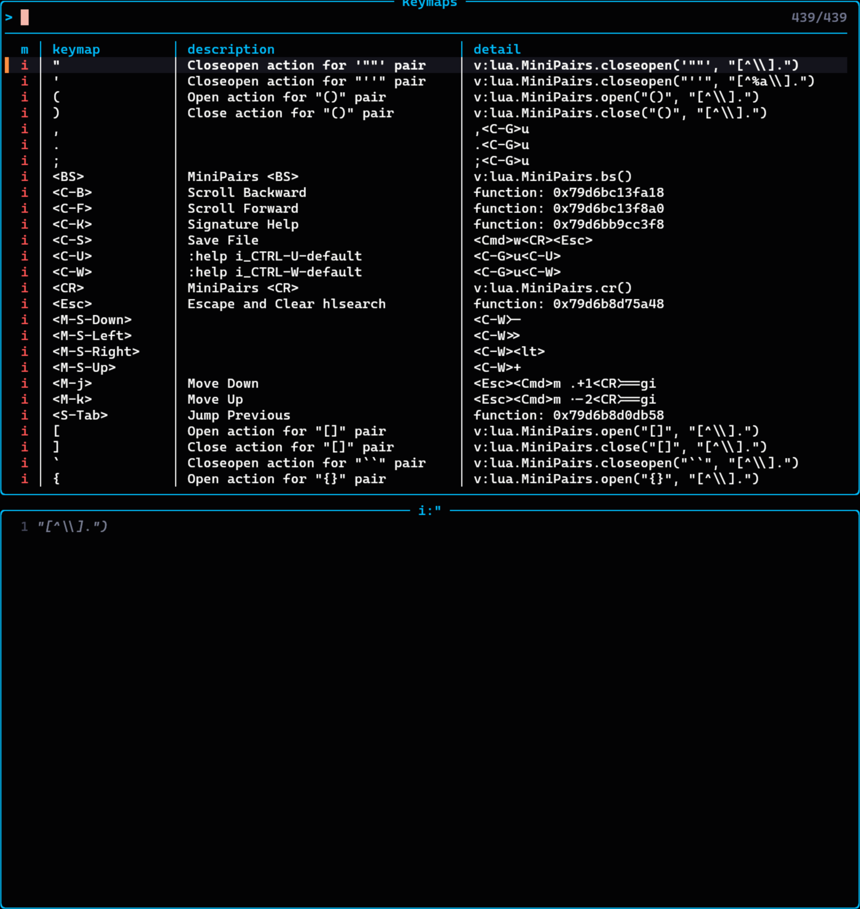

On top of that, the `whichkey` package shows every possible combination for a key you've pressed:

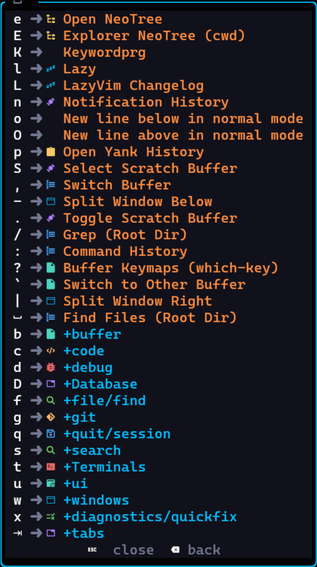

This makes the whole experience really good, though still not quite up to VSCode's level, if you want to explore the editor, you just go through the keys.

### The best and worst thing at the same time

Another thing worth mentioning is that, during the first month (and to this day, really) I'm always making small tweaks here and there to my LazyVim config, especially when it updates and changes defaults. That's fairly annoying, probably the thing I hate most about Nvim so far, but it's also one of the things I like most: **the configuration**.

While the configuration is extremely permissive and you can virtually do anything, it's also extremely complex to understand. The documentation is basically nonexistent, the Lua LSP tries its best to extract the functions and show you what you can use, but most of Vim's functions aren't recognized, autocompletion is pretty bad, and overall you find yourself searching the internet more than anything else.

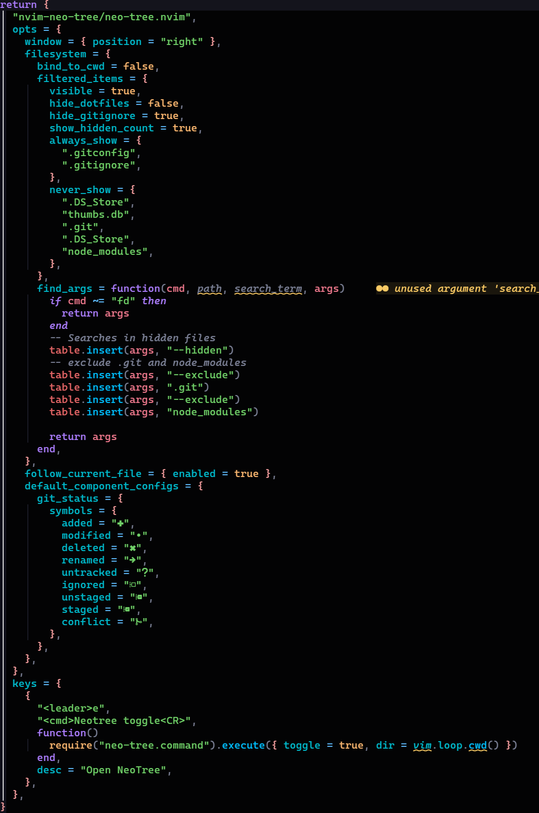

The configuration is hierarchical, so earlier settings get overridden by later configuration, so the order in which plugins and configs load matters. And that sucks because there's no nice autocompletion for what you can put in there, it's always trial and error.

Some Lua programming is almost always necessary, and often required. In other cases the base configuration is enough, overall LazyVim's own documentation is very good and helps A LOT, it's well defined and explained, but eventually you'll run into trouble.

### LSPs

The biggest problem I had was setting up the LSPs. The default configs for most languages I use are fine, but I ran into a conflict between Node and Deno. Since both use the same language but have different key files, I had to write a function to check whether the repo was a Deno or Node repo and avoid having both the Node and Deno LSP running on the same file.

> LSPs are [Language Server Protocols](https://en.wikipedia.org/wiki/Language_Server_Protocol), a protocol created by Microsoft to let an editor connect to a service that holds the language's intelligence separately, independent of the editor, to provide things like completions, intellisense, and so on in a distributed way.

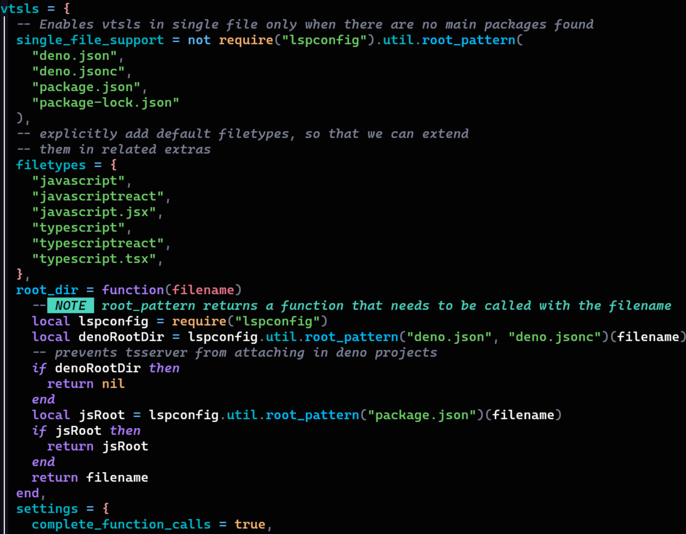

So far I've only talked about bad things, or things I liked less than the rest, is Vim really that good?

## The turning point

After about 2 months of using Vim daily I was starting to think nothing would change, I wasn't feeling any "faster" or with "superpowers", until the day I had to edit a really big file.

Since I was in a bit of a hurry and had to change a bunch of things in the file with regex, I tried opening it in VSCode first, but it wouldn't even open the file... So I tried opening it with Vim and it didn't even flinch, while VSCode was eating over 2gb of memory just to open the file, my Nvim had the file open and working using a mere 120mb. That's when I noticed the gain went beyond development.

I was so focused on using the editor that I hadn't noticed the real superpowers I was gaining. First of all, I was using about 45% fewer resources on my machine, an absurd amount of savings for a code editor. On top of that the editor is **extremely responsive**, almost everything you do happens practically instantly, all without taking your hand off the keyboard. I consider that a superpower.

Within the code, I started noticing I'd built muscle memory for some things, for example:

-   Typing `:wq` or `:w` almost everywhere
-   Hitting `esc` after typing a line (including while writing this article)
-   Trying to move anything with `jhkl`
-   Trying to navigate with `w` and `b` between lines and `{` in code
-   Searching for anything by hitting `/`
-   Trying to use `<leader>` (which in my case is spacebar) to start commands
-   Copying things with `y` and pasting with `p`

This is so automatic for me now that it's become second nature, when I can't do one of these commands I feel weird. On top of that I started noticing I was using more and more other Vim commands that I hadn't used before, _I was learning!_

### Progressive improvements

One of my checkpoints was starting to make extensive use of **vim words**, which are key combos that let you do several actions at once, for example, if I want to delete a single character I can hit `x`, so if I want to delete a whole word I could just keep hitting `x` until the end. But I can also tell Vim to delete everything inside that word with `diw`, or _**d**elete **i**n **w**ord_, without deleting the surrounding spaces, or delete everything around it with `daw`, where the "a" stands for _**a**round_.

These are the well-known Vim words, which I already knew existed but had never used extensively. And you can combine `aw` and `iw` with basically anything, for example, LazyVim has a plugin called `surround` that lets you wrap anything with anything else, for example:

```js
function foo () {
    const codigo = '1'
}
```

If I want to wrap that code in a `try/catch`, I can enter line-selection mode with `V`, type `gsa?` and enter `try {` in the first prompt and `} catch {}` in the second:


And the result is exactly what you'd expect:

```js
function foo () {
    try {const codigo = '1'} catch {}
}
```

Other more advanced commands like block editing with `ctrl+V` are also super useful, and much more powerful than VSCode's multi-cursor editing, because you can edit multiple columns at the same time.

When that's not enough, you can use the famous `sed`-style replace, which was an essential tool for a drastic improvement in my efficiency, for example, if I wanted to replace a long sequence of calls:

```ts
controller.run(new URN<'application'>(args.params.applicationId))
controller.run(new URN<'application'>(args.params.applicationId))
controller.run(new URN<'application'>(args.params.applicationId))
controller.run(new URN<'application'>(args.params.applicationId))
controller.run(new URN<'application'>(args.params.applicationId))
controller.run(new URN<'application'>(args.params.applicationId))
controller.run(new URN<'application'>(args.params.applicationId))
controller.run(new URN<'application'>(args.params.applicationId))
controller.run(new URN<'application'>(args.params.applicationId))
controller.run(new URN<'application'>(args.params.applicationId))
controller.run(new URN<'application'>(args.params.applicationId))
controller.run(new URN<'application'>(args.params.applicationId))
controller.run(new URN<'application'>(args.params.applicationId))
controller.run(new URN<'application'>(args.params.applicationId))
controller.run(new URN<'application'>(args.params.applicationId))
controller.run(new URN<'application'>(args.params.applicationId))
controller.run(new URN<'application'>(args.params.applicationId))
controller.run(new URN<'application'>(args.params.applicationId))
controller.run(new URN<'application'>(args.params.applicationId))
controller.run(new URN<'application'>(args.params.applicationId))
controller.run(new URN<'application'>(args.params.applicationId))
controller.run(new URN<'application'>(args.params.applicationId))
controller.run(new URN<'application'>(args.params.applicationId))
controller.run(new URN<'application'>(args.params.applicationId))
controller.run(new URN<'application'>(args.params.applicationId))
controller.run(new URN<'application'>(args.params.applicationId))
controller.run(new URN<'application'>(args.params.applicationId))
controller.run(new URN<'application'>(args.params.applicationId))
controller.run(new URN<'application'>(args.params.applicationId))
controller.run(new URN<'application'>(args.params.applicationId))
controller.run(new URN<'application'>(args.params.applicationId))
controller.run(new URN<'application'>(args.params.applicationId))
controller.run(new URN<'application'>(args.params.applicationId))
```

I want to remove all the `new URN...` and leave only the call to `args.params.application`, I can use the substitution `%s/(new URN<'application'>\(([a-zA-Z\.]*)\))/\1` to swap everything at once:

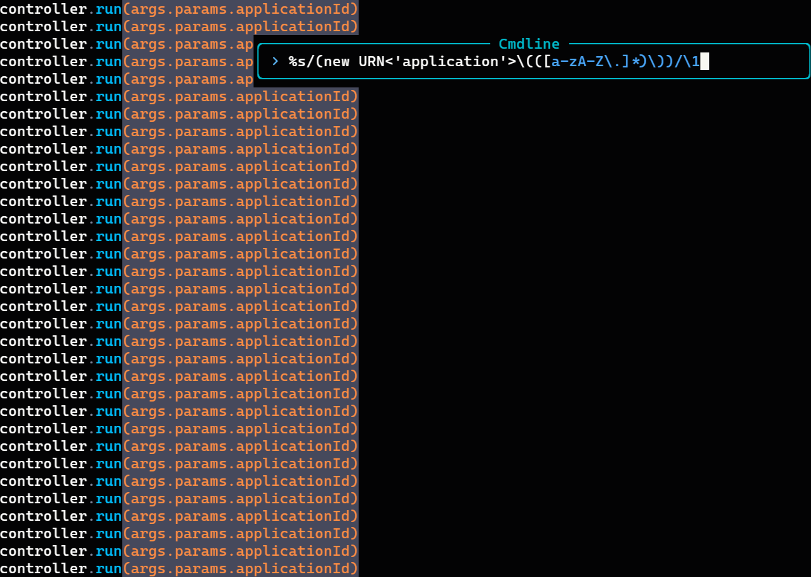

The command itself looks pretty complex, but let's break it down to make it easier. Here I'm:

1.  Grabbing everything that's `(new URN<'application'>(`
2.  Creating a group containing `[a-zA-Z\.]*`, meaning every letter and the dot
3.  Grabbing the trailing `))`
4.  Replacing everything with `\1`, which denotes the first group we created in step 2

That's something I'd never manage to do this "simply" anywhere else.

## Other things I noticed

Beyond these small demos, I also noticed a few other things about Vim worth mentioning:

-   Macros are **really good**, but they're not for every situation
-   Learning to handle buffers and windows is essential, knowing what a buffer is, what a window is, what a pane is, and things like that
-   Vim has a set of registers that you can access with `"` in Lazy or with `:reg`, these registers are powerful because they let you, for example, copy multiple pieces of text at once with `"<register number>y` and paste from several too with `"<number>p`, Lazy has a pretty nice list of registers

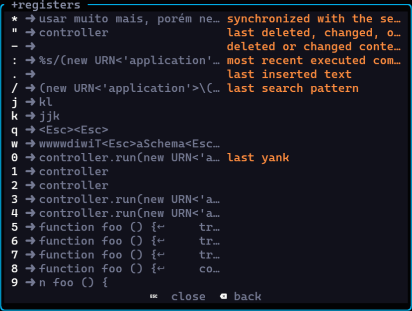

-   On top of registers, Lazy keeps a list of bookmarks (or just `marks`) that let you save a spot in the code and jump back to it instantly, in any buffer, this is really useful for moving quickly between two locations with `''`, but you can create a mark with `m<letter>` and then go to it with `'<letter>`

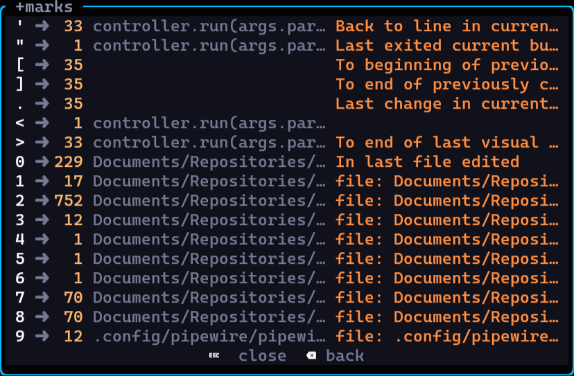

-   Vim has a built-in terminal with `:term`, but Lazy has a terminal in a tab at the bottom just like VSCode that lets you use Vim commands normally, but I found it a bit easier to use another tab of the same terminal, mainly because this can cause lag in the editor.

## Verdict, was it worth it?

After 6 months of nonstop use, I can say that **this was the best choice I've ever made**. The way Vim is fast and instant is incredible, using the keyboard instead of the mouse for movement and actions inside the editor is orders of magnitude faster and more efficient than using a traditional mouse (even though Neovim does support the mouse).

The way the editor integrates with what you're doing, and the "flow" state you get into being on a black screen with zero distractions, is simply incredible. On top of that, everything gets much faster and much more efficient as you pick up more tips and learn more things about Vim.

I think the main thing for me is that I can see myself improving, it's easy to see progress, it's easy to understand what's going on, the editor is intuitive once you learn the basic concepts it operates on. And noticing that there's constant improvement, and constantly discovering new things, new keys, new combos, new workflows is simply incredible, even for an editor that's over 40 years old.

If you've already tried using Vim, leave a comment on [my socials](https://lsantos.dev)! I really want to know how **your** experience with Vim went!

See you around!
