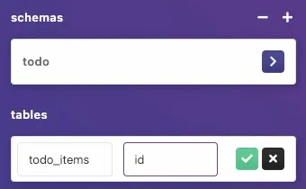
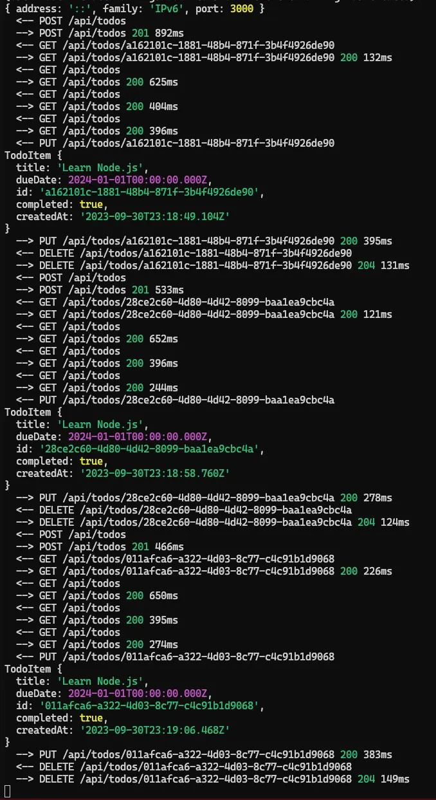
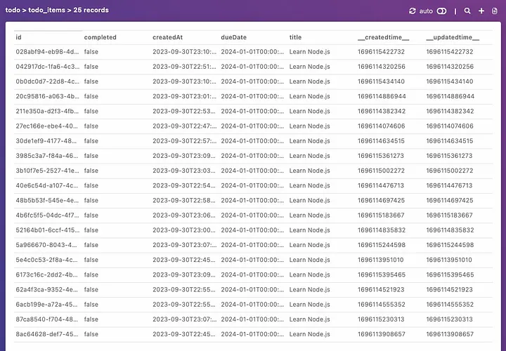

Quando você está trabalhando com HarperDB, dá pra usar TypeScript pra melhorar bastante a sua experiência de desenvolvimento. Nesse artigo vou mostrar algumas boas práticas de como usar TypeScript com HarperDB. Vamos falar de estrutura de pastas, boas práticas de código e como configurar melhor o seu projeto pra aproveitar tudo que o HarperDB oferece.

## Antes de começar

Dá uma passada na [documentação do HarperDB](https://docs.harperdb.io/docs/install-harperdb) pra saber como instalar localmente e começar. Você também pode usar o [HarperDB Cloud](https://harperdb.io/) pra começar rapidinho. Mas vou assumir que você já tem sua instância rodando.

> [!TIP]
> Você pode conferir alguns outros tutoriais meus [aqui](https://www.harperdb.io/author/lucas-santos) ou [nesse artigo da comunidade](https://www.harperdb.io/development/tutorials/harperdb-authentication-with-oauth) pra saber como configurar sua infraestrutura localmente, com Kubernetes, ou na nuvem.

Esse repositório está no [GitHub da comunidade HarperDB](https://github.com/HarperDB-Add-Ons/hdb-typescript-best-practices). Você pode clonar e acompanhar junto com o artigo. Vamos usar a versão cloud do banco, mas no repositório você vai encontrar um arquivo `docker-compose.yml` que pode ser usado pra rodar localmente com `docker compose up`.

### Configurando Node e TypeScript

Pra usar TypeScript você precisa ter o Node.js instalado, de preferência a última versão LTS. Você confere rodando `node -v` no terminal. Se ainda não tiver instalado, pode baixar [aqui](https://nodejs.org/en/download/), ou usar um gerenciador de versões como [asdf](https://asdf-vm.com/#/core-manage-asdf-vm), [nvm](https://github.com/nvm-sh/nvm), ou até o [volta](https://volta.sh/).<Sidenote>Estou usando a versão 20.7.0 do Node.js, mas você pode usar qualquer versão acima da 18 no momento em que esse artigo foi escrito.</Sidenote>

Vamos criar um novo diretório (pode dar o nome que quiser) e, dentro dele, rodar o comando `npm init -y`. Isso vai gerar um novo arquivo `package.json` com os valores padrão. Agora vamos instalar o TypeScript como dependência de desenvolvimento rodando `npm install --save-dev typescript`. Isso instala a última versão do TypeScript no seu projeto.

> [!TIP]
> Você pode conferir a última versão do TypeScript [aqui](https://www.npmjs.com/package/typescript). Estou usando a versão 5.2.2

Vamos também instalar os tipos externos do Node.js rodando `npm install --save-dev @types/node`. Isso vai permitir usar os tipos do Node.js no nosso projeto.

Por último, vamos adicionar um pacote de suporte chamado [tsx](https://npm.im/tsx), que vai permitir desenvolver a aplicação sem precisar compilar toda vez que mudarmos alguma coisa. Vamos instalar rodando `npm install --save-dev tsx`.

Agora vamos inicializar o TypeScript com `npx tsc --init`, isso vai gerar um arquivo `tsconfig.json` com todas as definições que o TS precisa. Mas vamos precisar mudar alguns valores. Então abre ele, remove tudo e deixa assim:

```json
{
  "compilerOptions": {
    "target": "ESNext",
    "module": "NodeNext",
    "outDir": "./dist",
    "esModuleInterop": true,
    "forceConsistentCasingInFileNames": true,
    "strict": true,
    "skipLibCheck": true
  }
}
```

Também vamos usar ESModules, então precisamos mudar a chave `type` no nosso `package.json` pra `module`. Isso vai permitir usar a sintaxe de `import` no nosso código. Vamos aproveitar e adicionar um script de execução que vai rodar o código compilado. Nosso `package.json` vai ficar assim:

```json
{
  "name": "hdb-typescript-best-practices",
  "version": "0.0.1",
  "description": "",
  "main": "index.js",
  "type": "module",
  "scripts": {
    "start": "node --env-file=.env dist/index.js",
    "start:dev": "NODE_OPTIONS='--loader=tsx' node --env-file=.env src/index.ts"
  },
  "keywords": [],
  "author": "Lucas Santos <hello@lsantos.dev> (https://lsantos.dev/)",
  "license": "GPL-3.0",
  "devDependencies": {
    "@types/node": "^20.7.1",
    "tsx": "^3.13.0",
    "typescript": "^5.2.2"
  }
}
```

### Testando a configuração

Agora vamos criar uma pasta `src` e um arquivo `index.ts` dentro dela. Esse vai ser o ponto de entrada da nossa aplicação. Também vamos adicionar as pastas `dist` e `node_modules` no nosso `.gitignore` (se ainda não tiver feito isso), pra não commitar o código compilado.

O Node.js a partir da versão 20.6 [já vem com suporte nativo a arquivos de env](https://nodejs.org/en/blog/release/v20.6.0), então vamos aproveitar isso pra guardar nossos segredos num arquivo `.env`, e essa já é a primeira boa prática:

> [!CAUTION]
> Nunca commite segredos no seu repositório. Use um arquivo `.env` pra guardá-los e adicione ele no `.gitignore`.

Vamos criar um arquivo `.env` e adicionar o seguinte conteúdo:

```ini
EXAMPLE=Ambiente de teste
```

Agora vamos adicionar o seguinte código no nosso arquivo `index.ts`:

```ts
export async function main() {
  console.log('Olá mundo!')
  console.log(process.env.EXAMPLE)
}

await main()
```

Agora roda a configuração com `npm run start:dev`, você deve ver a seguinte saída:

```bash
$ npm run start:dev
Olá mundo!
Ambiente de teste
```

Isso significa que está tudo configurado corretamente!

> [!TIP]
> Você também pode rodar o arquivo manualmente compilando ele, pra isso, rode `npx tsc` no diretório raiz, depois rode `node --env-file=.env dist/index.js`. Vai dar o mesmo resultado. Você pode até adicionar um script `build` que roda o `tsc` como comando, aí você roda `npm run build` e depois `npm run start` pra rodar o código.

## Configurando os ambientes e o banco de dados

Agora que sabemos que tudo está funcionando, vamos pro [HarperDB Studio](https://studio.harperdb.io) criar nosso schema. Vamos criar um novo schema chamado `todo` e uma tabela chamada `todo_items`. Essa vai ser a tabela que vai guardar os itens da lista de tarefas.

O `hash` da tabela vai ser a coluna `id`:



O Harper tem um schema maleável, então a gente não precisa definir todas as propriedades, só a propriedade de hash inicial, todas as outras vão sendo adicionadas conforme criamos os objetos.

Vamos configurar nossas variáveis de ambiente no arquivo `.env`:

```ini
HDB_HOST=https://sua-instancia.harperdbcloud.com
HDB_USERNAME=seu usuario
HDB_PASSWORD=sua senha
HDB_SCHEMA=todo
HDB_TABLE=todo_items
```

# Separando as camadas

Pra nossa aplicação, vamos criar a gloriosa e simples lista de tarefas. Essa aplicação vai ter as seguintes funcionalidades:

- Criar um novo item de tarefa
- Listar todos os itens de tarefa
- Marcar um item de tarefa como concluído
- Apagar um item de tarefa

É uma aplicação simples, mas vai nos permitir explorar algumas das boas práticas de usar TypeScript com HarperDB.

Vamos também usar uma arquitetura em camadas pra separar nosso código. Isso vai permitir uma melhor separação de responsabilidades e deixar nosso código mais fácil de manter. Arquiteturas em camadas fazem o TypeScript brilhar porque a gente pode usar interfaces pra definir nossos contratos e garantir que o código está seguindo a estrutura correta.

Vamos ter pelo menos três camadas:

- **Camada de apresentação**: é a camada que fala diretamente com o usuário. Pode ser uma CLI, uma aplicação web, ou até uma aplicação mobile. Essa camada é responsável por receber a entrada do usuário e mandar pra próxima camada. No nosso caso, vamos ter a API, que vai ser uma REST API que recebe a entrada do usuário e manda pra próxima camada. Isso permite separar a lógica real da aplicação da camada de apresentação, o que nos deixa livres pra trocar a camada de apresentação por outra tecnologia sem precisar mudar a lógica da aplicação. Então poderíamos adicionar uma CLI, um endpoint GraphQL, gRPC, ou qualquer outra coisa sem precisar mexer na estrutura de baixo.
- **Camada de domínio ou serviço**: é a camada que vai ter a lógica de negócio da nossa aplicação. Ela é responsável por receber a entrada do usuário já validada e agir sobre ela. Também é responsável por receber os dados da camada de dados e transformá-los no formato correto pra camada de apresentação. Essa camada é a que vai ter mais lógica, e pode ser separada em várias partes. A camada de domínio pode ser acessada por qualquer outra camada, já que é uma parte central do sistema.
- **Camada de dados**: como o nome já diz, é a camada responsável pelos dados, que podem vir de qualquer fonte, um banco de dados, um cliente externo, etc. Ela é responsável por receber os dados da camada de domínio e transformá-los no formato correto pro banco de dados. Também é responsável por receber os dados do banco e transformá-los no formato correto pra camada de domínio. Essa camada é a que vai ter menos lógica, mas é a mais importante, porque é onde vamos colocar a lógica do banco de dados e a comunicação com ele.

Isso é bem parecido com a famosa [arquitetura MVC](https://en.wikipedia.org/wiki/Model%E2%80%93view%E2%80%93controller), mas pega um pouco das definições de [Domain Driven Design](https://en.wikipedia.org/wiki/Domain-driven_design) e de [Clean Architecture](https://blog.cleancoder.com/uncle-bob/2012/08/13/the-clean-architecture.html).

## A camada de domínio

Antes de criar qualquer camada, a gente precisa modelar nosso objeto de domínio, que é o item de tarefa. Isso vai nos dar um entendimento melhor do que precisamos fazer e como fazer. Vai nos ajudar a entender o formato do nosso objeto e como vamos manipulá-lo.

Vamos começar com uma pasta `domain` dentro de `src`, onde vamos criar um arquivo chamado `TodoItem.ts`. Esse vai ser nosso objeto de domínio, então vamos adicionar o seguinte código nele:

```ts
import { randomUUID } from 'node:crypto'

export class TodoItem {
  constructor(
    public title: string,
    public dueDate: Date,
    readonly id: string = randomUUID(),
    public completed: boolean = false,
    readonly createdAt: Date = new Date()
  ) {}
}
```

Essa é uma classe simples que representa nosso item de tarefa. Ela tem um construtor que recebe o título e a data de vencimento, e define as outras propriedades. O `id` é um UUID aleatório, o `completed` é falso por padrão, e o `createdAt` é a data atual.

Agora podemos criar um novo item de tarefa rodando `new TodoItem('Meu primeiro item de tarefa', new Date())`. Isso cria um novo item de tarefa com o título `Meu primeiro item de tarefa` e a data de vencimento como a data atual.

> [!TIP]
> Você pode conferir a [documentação do Node.js](https://nodejs.org/api/crypto.html#crypto_crypto_randomuuid_options) pra saber mais sobre a função `randomUUID`.

Vamos adicionar algumas funcionalidades no nosso objeto de domínio pra deixá-lo mais útil. Vamos adicionar um método `toJSON` que retorna o objeto como uma string JSON, e um método estático `fromObject` que recebe um objeto que bate com o nosso objeto de dados e retorna uma nova instância da classe.

Pra isso vamos precisar criar um schema pra comparar e validar nosso objeto, e esse é o caso de uso perfeito pro [Zod](https://zod.dev)! O Zod é uma biblioteca de validação de schema TypeScript-first que permite criar schemas e validar nossos objetos contra eles. Vamos instalá-lo rodando `npm install --save zod`.

Pra definir o schema temos duas opções:

1. Definir em um arquivo novo e importar no nosso objeto de domínio
2. Definir dentro do próprio objeto de domínio

Eu pessoalmente prefiro a segunda opção, já que tanto o schema quanto o objeto de domínio estão fortemente acoplados e fazem parte do mesmo objeto, então faz sentido deixar tudo no mesmo arquivo. Mas você pode escolher a que fizer mais sentido pra você.

Vamos adicionar o seguinte código no topo do nosso objeto de domínio:

```ts
import { z } from 'zod'

const todoItemSchema = z.object({
  title: z.string(),
  dueDate: z.date(),
  id: z.string().uuid(),
  completed: z.boolean().default(false),
  createdAt: z.date().default(new Date())
})

export type TodoObjectType = z.infer<typeof TodoObjectSchema>
```

> [!NOTE]
> Também é possível imitar mais ou menos o que estamos fazendo em `z.infer<typeof TodoObjectSchema>` usando o utility type `InstanceType`, mas aí a gente precisaria remover os métodos do tipo, então prefiro usar o método `infer` pra também deixar clara a separação entre o que é nosso objeto de domínio (a classe) e o que é o objeto de transferência de dados (o JSON).

Depois vamos usar esse schema pra garantir que nosso objeto é um item de tarefa válido. Vamos mudar a função `fromJSON` do nosso objeto de domínio:

```ts
static fromObject(todoObject: TodoObjectType): InstanceType<typeof TodoItem> {
  TodoObjectSchema.parse(todoObject) // Isso lança um erro se o objeto não for válido
  return new TodoItem(todoObject.title, todoObject.dueDate, todoObject.id, todoObject.completed, todoObject.createdAt)
}
```

Isso vai analisar a string JSON e retornar uma nova instância da classe. Também podemos adicionar um `toObject` pra transformar a classe em um objeto serializável, e um método `toJSON` que retorna a string JSON, o que vai ser útil quando precisarmos mandar o objeto pro banco de dados. Vamos adicionar o seguinte código no nosso objeto de domínio:

```ts
toObject() {
  return JSON.stringify({
    title: this.title,
    dueDate: this.dueDate,
    id: this.id,
    completed: this.completed,
    createdAt: this.createdAt
  })
}

toJSON() {
  return JSON.stringify(this.toObject())
}
```

> [!TIP]
> Outra coisa que podemos fazer aqui é não usar o método `toObject` e usar o atalho `{ ...item }` em vez disso, que já converte automaticamente pra um objeto. Mas prefiro ter um método que eu possa chamar pra deixar mais explícito. Você também pode retornar `{ ...this }`

Nosso objeto de domínio final vai ficar assim:

```ts
import { randomUUID } from 'node:crypto'
import { z } from 'zod'

const TodoObjectSchema = z
  .object({
    title: z.string(),
    dueDate: z.date({ coerce: true }),
    id: z.string().uuid().readonly(),
    completed: z.boolean().default(false),
    createdAt: z.date({ coerce: true }).default(new Date()).readonly()
  })
  .strip()
export type TodoObjectType = z.infer<typeof TodoObjectSchema>

export class TodoItem {
  constructor(
    public title: string,
    public dueDate: Date,
    readonly id: string = randomUUID(),
    public completed: boolean = false,
    readonly createdAt: Date = new Date()
  ) {}

  toObject() {
    return JSON.stringify({
      title: this.title,
      dueDate: this.dueDate,
      id: this.id,
      completed: this.completed,
      createdAt: this.createdAt
    })
  }

  toJSON() {
    return JSON.stringify(this.toObject())
  }

  static fromObject(todoObject: TodoObjectType): InstanceType<typeof TodoItem> {
    TodoObjectSchema.parse(todoObject)
    return new TodoItem(todoObject.title, todoObject.dueDate, todoObject.id, todoObject.completed, todoObject.createdAt)
  }
}
```

## A camada de dados

Agora que temos nosso objeto de domínio, podemos começar a criar nossa camada de dados. Essa camada é responsável por se comunicar com o banco de dados e transformar os dados do banco no formato correto pra camada de domínio. Também é responsável por transformar os dados da camada de domínio no formato correto pro banco.

Como estamos usando o Harper, toda nossa comunicação com o banco é feita através de uma API! O que é extremamente útil porque a gente não precisa configurar drivers complicados nem nada do tipo. Então vamos criar um arquivo novo numa pasta `data` chamado `TodoItemClient.ts`. Esse vai ser nosso cliente HarperDB.

> [!TIP]
> É uma boa prática nomear APIs externas como "clients". Se tivéssemos qualquer outra camada de dados, digamos um sistema de filas que não é conectado via API, poderíamos simplesmente chamar de `queueAdapter` ou `queue`. Isso não é uma regra, mas na minha opinião fica mais fácil entender o que o arquivo está fazendo, se é um agente externo ou um driver interno.

Nosso cliente é uma API HTTP, então vamos usar o `fetch` nativo do node pra nos comunicarmos com ele.<Sidenote>A fetch api só está disponível a partir do node 18.</Sidenote> Vamos adicionar o seguinte código no nosso arquivo `TodoItemClient.ts`:

```ts
import { TodoItem, TodoObjectType } from '../domain/TodoItem.js'

export class TodoItemClient {
  #defaultHeaders: Record<string, string> = {
    'Content-Type': 'application/json'
  }
  credentialsBuffer: Buffer

  constructor(
    private readonly url: string,
    private readonly schema: string,
    private readonly table: string,
    credentials: { username: string; password: string }
  ) {
    this.credentialsBuffer = Buffer.from(`${credentials.username}:${credentials.password}`)
    this.#defaultHeaders['Authorization'] = `Basic ${this.credentialsBuffer.toString('base64url')}`
  }

  async upsert(data: TodoItem) {
    const payload = {
      operation: 'upsert',
      schema: this.schema,
      table: this.table,
      records: [data.toObject()]
    }

    const response = await fetch(this.url, {
      method: 'POST',
      headers: this.#defaultHeaders,
      body: JSON.stringify(payload)
    })

    if (!response.ok) {
      throw new Error(response.statusText)
    }

    return data
  }

  async delete(id: string) {
    const payload = {
      operation: 'delete',
      schema: this.schema,
      table: this.table,
      hash_values: [id]
    }

    const response = await fetch(this.url, {
      method: 'POST',
      headers: this.#defaultHeaders,
      body: JSON.stringify(payload)
    })

    if (!response.ok) {
      throw new Error(response.statusText)
    }
  }

  async findOne(id: string) {
    const payload = {
      operation: 'search_by_hash',
      schema: this.schema,
      table: this.table,
      hash_values: [id],
      get_attributes: ['*']
    }

    const response = await fetch(this.url, {
      method: 'POST',
      headers: this.#defaultHeaders,
      body: JSON.stringify(payload)
    })

    if (!response.ok) {
      throw new Error(response.statusText)
    }

    const data = (await response.json()) as TodoObjectType[]
    if (data[0] && Object.keys(data[0]).length > 0) {
      return TodoItem.fromObject(data[0])
    }

    return null
  }

  async listByStatus(completed = true) {
    const payload = {
      operation: 'search_by_value',
      schema: this.schema,
      table: this.table,
      search_attribute: 'completed',
      search_value: completed,
      get_attributes: ['*']
    }

    const response = await fetch(this.url, {
      method: 'POST',
      headers: this.#defaultHeaders,
      body: JSON.stringify(payload)
    })

    if (!response.ok) {
      throw new Error(response.statusText)
    }

    const data = (await response.json()) as TodoObjectType[]
    return data.map((todoObject) => TodoItem.fromObject(todoObject))
  }
}
```

Como você pode ver, temos todos os métodos que precisamos pra nos comunicar com o banco. Temos o método `upsert` que cria ou atualiza um registro, o método `delete` que apaga um registro, o método `findOne` que busca um registro pelo hash, e o método `listByStatus` que lista todos os registros que batem com um determinado valor.

> [!TIP]
> Você pode conferir a [documentação do HarperDB](https://api.harperdb.io/#25977fef-53e8-40bf-a26a-43369bc3721c) pra saber mais sobre as operações.

## A camada de serviço

A camada de serviço vai ser a cola entre todas as outras camadas. Numa aplicação tão simples quanto essa, ela geralmente não é muito útil, mas é uma boa prática ter ela, assim dá pra adicionar mais lógica depois. Vamos criar uma pasta nova chamada `services` e um arquivo novo chamado `TodoItemService.ts`. Essa vai ser nossa camada de serviço.

A camada de serviço vai receber a entrada do usuário já higienizada, executar qualquer lógica de negócio e então mandar pra camada de dados. Também vai receber dados da camada de dados e transformá-los no formato correto pra camada de apresentação.

Vamos adicionar o seguinte código no nosso arquivo `TodoItemService.ts`:

```ts
import { TodoItemClient } from '../data/TodoItemClient.js'
import { TodoItem, TodoObjectType } from '../domain/TodoItem.js'

export class TodoItemService {
  #client: TodoItemClient
  constructor(client: TodoItemClient) {
    this.#client = client
  }

  async findOne(id: string) {
    return this.#client.findOne(id)
  }

  async findAll() {
    return [...(await this.findPending()), ...(await this.findCompleted())]
  }

  async findCompleted() {
    return this.#client.listByStatus(true)
  }

  async findPending() {
    return this.#client.listByStatus(false)
  }

  async create(todoItem: TodoObjectType) {
    const todo = new TodoItem(todoItem.title, todoItem.dueDate)
    return this.#client.upsert(todo)
  }

  async update(todoItem: TodoObjectUpdateType) {
    const todo = await this.#client.findOne(todoItem.id ?? '')

    if (!todo) {
      throw new Error('Todo not found')
    }

    todo.completed = todoItem.completed ?? todo.completed
    todo.dueDate = todoItem.dueDate ?? todo.dueDate
    todo.title = todoItem.title ?? todo.title

    return this.#client.upsert(todo)
  }

  async delete(id: string) {
    return this.#client.delete(id)
  }
}
```

Repare que, enquanto na implementação do cliente, numa camada mais baixa, temos uma lógica mais genérica que busca por status, no serviço já separamos os comandos em buscar pendentes e concluídos.

Também implementamos um método `findAll` que chama o método `listByStatus` duas vezes e depois junta os resultados. Esse é um bom exemplo de como podemos usar a camada de serviço pra adicionar mais lógica na nossa aplicação sem precisar adicionar mais lógica na camada de dados.

Outro aspecto importante de notar é como a camada de serviço já assume que todos os dados vão estar higienizados. Isso é uma boa prática porque permite uma melhor separação de responsabilidades. A camada de apresentação deve ser a responsável por validar os dados na rota, e então mandá-los pra camada de serviço. A camada de serviço deve assumir que os dados já estão validados e higienizados.

> [!NOTE]
> De qualquer forma, já implementamos outro nível de validação no nosso objeto de domínio quando recebemos objetos, porque o TypeScript só vai forçar isso em tempo de compilação, então podemos ter certeza de que os dados são válidos.

A última coisa a notar é que, agora que subimos um nível, a camada de serviço recebe como parâmetro a camada abaixo dela, o que significa que precisamos passar uma instância do cliente da camada de dados pra camada de serviço. Isso se chama **inversão de controle** e faz parte do [Princípio da Inversão de Dependência](https://en.wikipedia.org/wiki/Dependency_inversion_principle).

Esse princípio diz que as camadas de nível mais alto não devem depender das camadas de nível mais baixo, mas sim de abstrações. No nosso caso, a camada de serviço depende da camada de dados, mas não depende da implementação da camada de dados, ela depende da abstração da camada de dados, que é o cliente.

Vamos fazer a mesma coisa com a camada de apresentação.

## A camada de apresentação

Agora que temos nossa camada de dados, podemos começar a criar nossa camada de apresentação. Essa camada é responsável por receber a entrada do usuário e mandar pra próxima camada. No nosso caso, vamos ter a API, que vai ser uma REST API que recebe a entrada do usuário e manda pra próxima camada.

Vamos criar uma pasta nova chamada `presentation` e um arquivo novo chamado `restAPI.ts`. Essa vai ser nossa interface REST.

Normalmente a gente usa um framework web pra não ter que recriar tudo do zero. Nesse exemplo vamos usar um framework bem rápido chamado [Hono](https://hono.dev), só pra dar um tempo do [Express](https://expressjs.com).

Instale ele e o adaptador dele pro Node.js rodando `npm install --save hono @hono/node-server`.

A implementação da camada de serviço geralmente cai no [Factory Pattern](https://en.wikipedia.org/wiki/Factory_method_pattern), que é um padrão de criação que permite criar objetos sem precisar saber os detalhes de implementação. No nosso caso, vamos usar uma factory pra criar o cliente da Rest API, assim conseguimos receber a camada de serviço via injeção de dependência.

Isso se traduz em algo assim:

```ts
import { Hono } from 'hono'
import { TodoItemService } from '../services/TodoItemService.js'

export async function restAPIFactory(service: TodoItemService) {
  const app = new Hono()

  app.get('/api/todos/:id', async (c) => {})
  app.get('/api/todos', async (c) => {})
  app.post('/api/todos', async (c) => {})
  app.put('/api/todos/:id', async (c) => {})
  app.delete('/api/todos/:id', async (c) => {})

  return app
}
```

Essa é uma factory bem simples que recebe a camada de serviço e retorna uma nova instância do cliente da Rest API. Vamos implementar as rotas daqui a pouco, mas primeiro vamos voltar pro nosso arquivo `index.ts` no diretório `src`. Esse vai ser o ponto de entrada da aplicação.

Lá vamos iniciar as variáveis de ambiente, assim como o cliente do banco e a camada de serviço. Vamos adicionar o seguinte código no nosso arquivo `index.ts`:

```ts
import { z } from 'zod'
import { TodoItemClient } from './data/TodoItemClient.js'
import { TodoItemService } from './services/TodoItemService.js'
import { restAPIFactory } from './presentation/api.js'
import { serve } from '@hono/node-server'
const conf = {
  host: process.env.HDB_HOST,
  credentials: {
    username: process.env.HDB_USERNAME,
    password: process.env.HDB_PASSWORD
  },
  schema: process.env.HDB_SCHEMA,
  table: process.env.HDB_TABLE
}

const EnvironmentSchema = z.object({
  host: z.string(),
  credentials: z.object({
    username: z.string(),
    password: z.string()
  }),
  schema: z.string(),
  table: z.string()
})
export type EnvironmentType = z.infer<typeof EnvironmentSchema>

export default async function main() {
  const parsedSchema = EnvironmentSchema.parse(conf)
  const DataLayer = new TodoItemClient(
    parsedSchema.host,
    parsedSchema.schema,
    parsedSchema.table,
    parsedSchema.credentials
  )
  const ServiceLayer = new TodoItemService(DataLayer)
  const app = await restAPIFactory(ServiceLayer)

  serve({ port: 3000, fetch: app.fetch }, console.log)
}

await main()
```

> [!NOTE]
> Poderíamos ter criado outro arquivo chamado `config.ts` e movido tanto o `EnvironmentSchema` quanto o objeto `conf` pra lá, mas como só estamos usando isso no `index.ts`, prefiro deixar por aqui mesmo. Porém, se você recebe essa configuração de outro lugar, vale criar um arquivo `config.ts` e mover pra lá.

Voltando pro nosso arquivo `restAPI.ts`, vamos implementar as rotas. A maioria delas só vai ter parâmetros de rota, então vou só colocar aqui e explicar a lógica:

```ts
import { Hono } from 'hono'
import { TodoItemService } from '../services/TodoItemService.js'

export async function restAPIFactory(service: TodoItemService) {
  const app = new Hono()

  app.get('/api/todos/:id', async (c) => {
    try {
      const todo = await service.findOne(c.req.param('id'))
      if (!todo) {
        c.status(404)
        return c.json({ error: 'Todo not found' })
      }
      c.json(todo.toObject())
    } catch (err) {
      c.status(500)
      c.json({ error: err })
    }
  })

  app.get('/api/todos', async (c) => {
    try {
      let data

      if (c.req.query('completed')) {
        data = await service.findCompleted()
      } else if (c.req.query('pending')) {
        data = await service.findPending()
      } else {
        data = await service.findAll()
      }

      c.json(data.map((todo) => todo.toObject()))
    } catch (err) {
      c.status(500)
      c.json({ error: err })
    }
  })

  app.post('/api/todos', async (c) => {})
  app.put('/api/todos/:id', async (c) => {})

  app.delete('/api/todos/:id', async (c) => {
    try {
      await service.delete(c.req.param('id'))
      c.status(204)
      return c.body(null)
    } catch (err) {
      c.status(500)
      c.json({ error: err })
    }
  })

  return app
}
```

Pras rotas de post e put, também vamos precisar validar os dados que chegam. O Hono tem um validador pro Zod que podemos usar como middleware, vamos instalar com `npm i @hono/zod-validator`.

Podemos importar o `zValidator` dele e adicionar depois do nome da rota, mas antes do handler, assim:

```ts
app.post('/api/todos', zValidator('json', ourSchema) async (c) => {})
```

Mas vamos precisar de algumas coisas aqui: primeiro, vamos precisar de um novo tipo pra representar o tipo de criação, e outro pra representar o tipo de atualização. Vamos adicionar o seguinte código no nosso arquivo `TodoItem.ts`:

```ts
export const TodoObjectCreationSchema = TodoObjectSchema.omit({ id: true, createdAt: true, completed: true }).extend({
  dueDate: z.string().datetime()
})
export const TodoObjectUpdateSchema = TodoObjectSchema.omit({ createdAt: true }).partial().extend({
  dueDate: z.string().datetime().optional()
})

export type TodoObjectType = z.infer<typeof TodoObjectSchema>
export type TodoObjectCreationType = z.infer<typeof TodoObjectCreationSchema>
export type TodoObjectUpdateType = z.infer<typeof TodoObjectUpdateSchema>
```

Estamos criando tipos mais restritos a partir de um tipo mais amplo gerado pelo Zod. Precisamos atualizar esse tipo no arquivo de serviço:

```ts
async create(todoItem: TodoObjectCreationType) {
  const todo = new TodoItem(todoItem.title, new Date(todoItem.dueDate))
  return this.#client.upsert(todo)
}

async update(todoItem: TodoObjectUpdateType) {
  const todo = await this.#client.findOne(todoItem.id ?? '')

  if (!todo) {
    throw new Error('Todo not found')
  }

  todo.completed = todoItem.completed ?? todo.completed
  todo.dueDate = new Date(todoItem.dueDate ?? todo.dueDate)
  todo.title = todoItem.title ?? todo.title

  return this.#client.upsert(todo)
}
```

Agora podemos usar esses tipos na camada de apresentação. Vamos adicionar o seguinte código no nosso arquivo `restAPI.ts`:

```ts
app.post('/api/todos', zValidator('json', TodoObjectCreationSchema), async (c) => {
  try {
    const todoItemObject = await c.req.json<TodoObjectCreationType>()
    const todo = await service.create(todoItemObject)
    c.status(201)
    c.json(todo.toObject())
  } catch (err) {
    c.status(500)
    c.json({ error: err })
  }
})
```

Agora pra rota de atualização:

```ts
app.put('/todos/:id', zValidator('json', TodoObjectUpdateSchema), async (c) => {
  try {
    const todoItemObject = await c.req.json<TodoObjectUpdateType>()
    const todo = await service.update({ ...todoItemObject, id: c.req.param('id') })
    c.status(200)
    return c.json(todo.toObject())
  } catch (err) {
    c.status(500)
    return c.json({ error: err })
  }
})
```

E é isso! Temos nossa camada de apresentação pronta!

# Testando

Testar nossa aplicação é só rodar `npm run start:dev` e fazer requisições pra ela. Pra testar melhor vou deixar um arquivo do [Hurl](https://hurl.dev) no repositório que você pode usar pra testar a API. Você roda com `hurl --test ./collection.hurl`. Isso vai rodar todos os testes e garantir que está tudo funcionando como esperado.



Você também pode fazer requisições você mesmo pra API usando `curl` ou qualquer outra ferramenta que preferir. Depois é só conferir no seu HarperDB Studio se os dados foram inseridos corretamente.



# Conclusão

Nesse artigo aprendemos como configurar um projeto TypeScript com HarperDB, aprendemos a separar nosso código em camadas, e aprendemos a testar nossa aplicação. Também aprendemos algumas boas práticas pelo caminho.

A ideia é que essas camadas não estão gravadas em pedra, você pode adicionar mais camadas se precisar, ou remover algumas se não precisar delas. O importante é ter uma separação clara de responsabilidades e garantir que seu código seja fácil de manter.
