---

Para o dia de hoje eu pensei em trazer um pouco do que sempre me perguntam várias vezes quando estou falando de TypeScript: **Quais são as boas práticas? Quais são os principais problemas que a gente enfrenta quando estamos lidando com TypeScript?**

Então hoje a gente vai discutir mais sobre as boas práticas de código, as melhores práticas de tipos e vamos também tocar nas melhores práticas de configurações, além de também explicar mais sobre **interfaces, tipos e enums**.

## Melhores práticas de tipagem

Para começar, vamos falar das melhores práticas na hora de tipar os seus códigos usando TypeScript. Tenha em mente que essas práticas não são escritas em pedra e são as principais que tanto eu, pessoalmente, prefiro usar, quanto a comunidade também adota como sendo uma boa prática de código.

Portanto, não é algo que você precise ser completamente inflexível quando alguém chegar e te perguntar, tudo depende do contexto e de onde você vai aplicar essas práticas.

### Nomenclaturas

A primeira boa prática é relacionada não a um tipo, mas ao seu bem estar mental quando está escrevendo tipos. **Sempre tente dar o nome mais descritivo possível para seus generics**, por exemplo, vamos usar esse código:

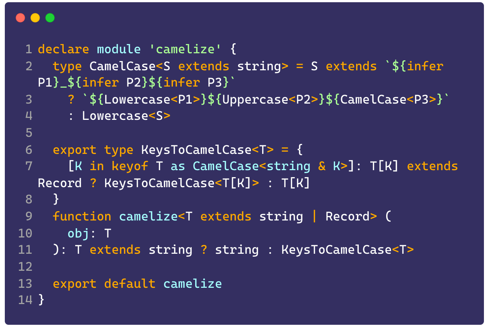

Esse é um código de um arquivo de declaração `.d.ts` para um módulo chamado Camelize. A ideia é que ele transforme qualquer chave de um objeto em CamelCase, mas perceba que é bem difícil de ler quando todos os nossos tipos são `T` ou `K`, e fica até difícil de entender qual é o objetivo do tipo.

Isso pode ser remediado facilmente renomeando os seus **generics**, que são as anotações de tipos que aparecem entre `<>` , não falamos de generics aqui ainda, mas pense neles como uma espécie de parâmetro para os tipos assim como funções levam parâmetros.

Podemos deixar esse tipo bem mais legível da seguinte maneira:

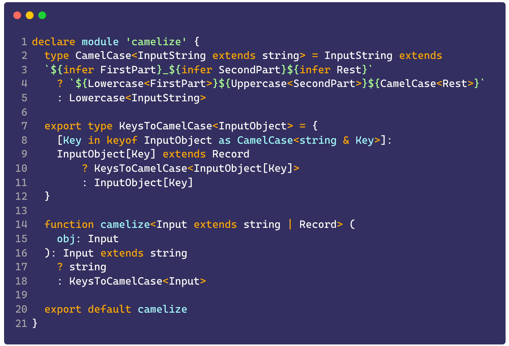

O tamanho do texto aumentou consideravelmente, porém o código fica muito mais simples de ler e muito mais simples de entender.

## O uso de generics

Usar generics como um todo pode ser considerada uma boa prática porque pode simplificar muito a forma como lemos e entendemos tipos, além de reduzir bastante a repetição. Por exemplo, imagine essa interface:

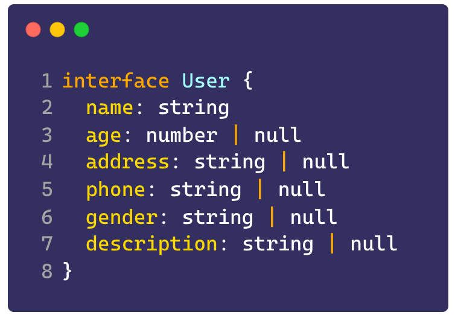

Veja a quantidade de vezes que usamos `string | null` , esse tipo poderia ser substituído por algo como:

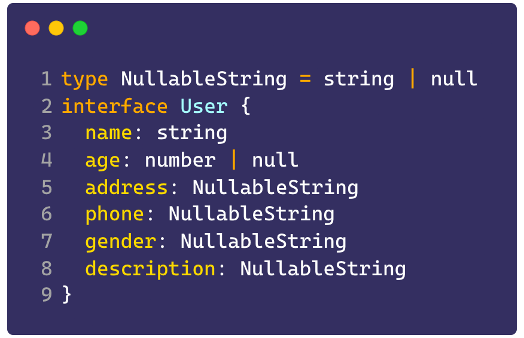

Que é outra boa prática mas não é o que estamos procurando agora, porque temos um tipo `number | null` que ficou sobrando, e teríamos que criar outro tipo só para ele. Neste caso é muito melhor criar um tipo genérico `Nullable<Tipo>` e substituir da seguinte forma:

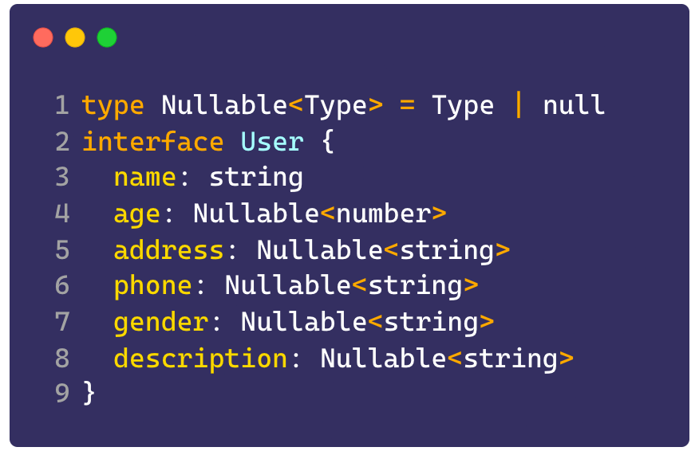

## Type aliases

Dando continuidade ao que acabei de falar. O uso de aliases de tipo é algo super recomendado, especialmente quando temos que usar os tipos em múltiplos lugares, por exemplo:

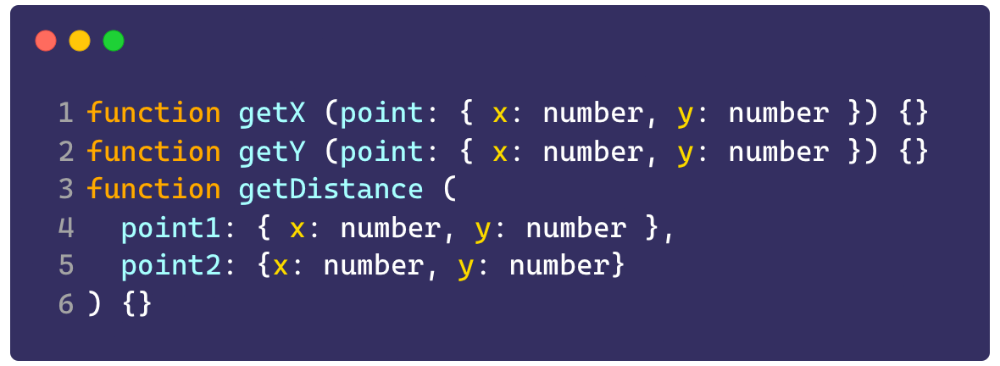

Neste caso podemos converter tudo para um tipo `Point`:

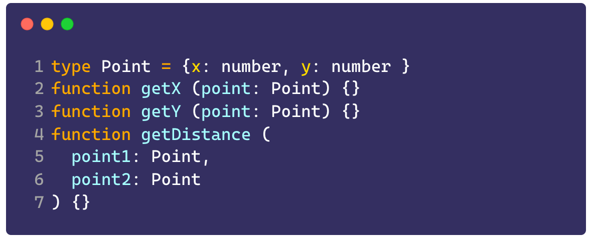

O que permite que a gente também faça uma extensão desse tipo, por exemplo, se a gente quiser uma coordenada Z agora:

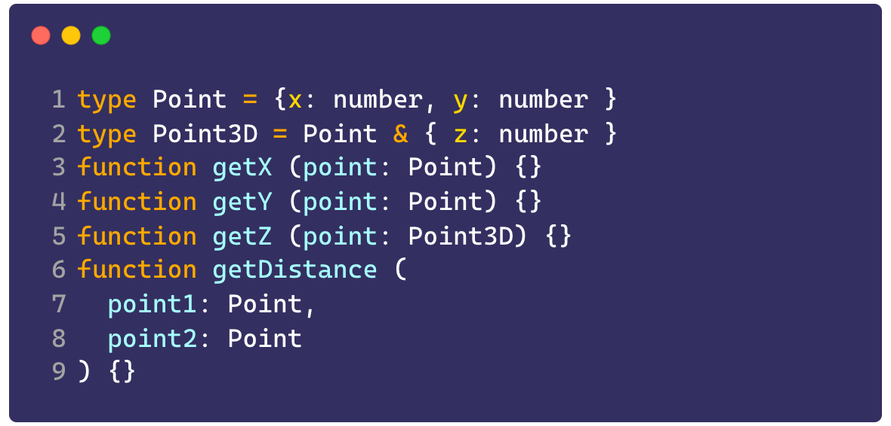

Type aliases também são ótimos para fazermos nossos próprios **utility types** (que vou falar mais pra frente) e para poder criar enumeradores com **union types**:

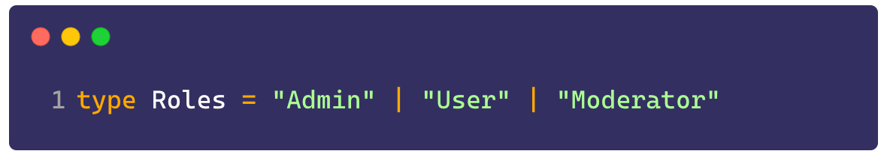

O que leva a gente para o próximo tópico.

## Interfaces

Interfaces são as principais amigas de cada dev quando temos que codar algum tipo mais complexo, principalmente quando se trata de respostas de APIs. Existe uma miríade de elementos por trás do uso de interfaces e eles poderiam ter seu próprio post (se liga que pode aparecer no meu [blog](/) 👀), mas vamos ficar no básico por hoje.

Uma interface só pode ser usada para tipar objetos completos, então o principal uso é para tipagem de retornos de APIs externas. Elas não só aceitam generics, como também podem ser estendidas. Então vamos imaginar que temos uma API que retorna uma dentre duas opções de requisições:

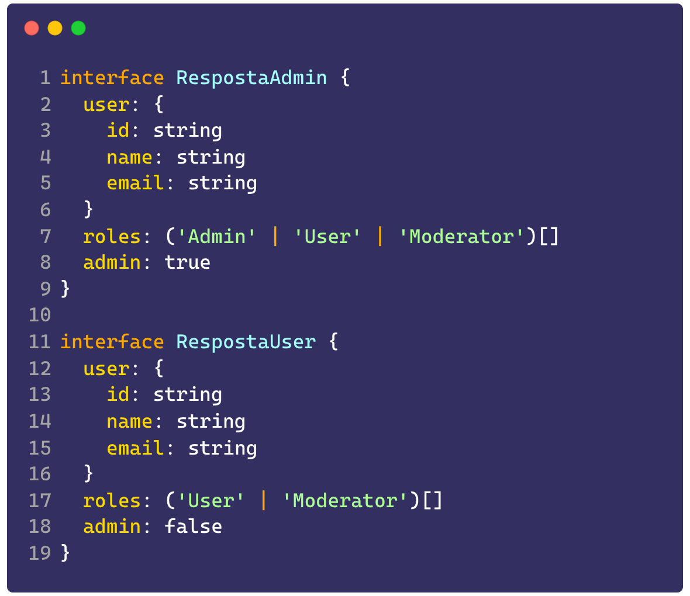

Essa interface poderia ser escrita como uma extensão de outra interface:

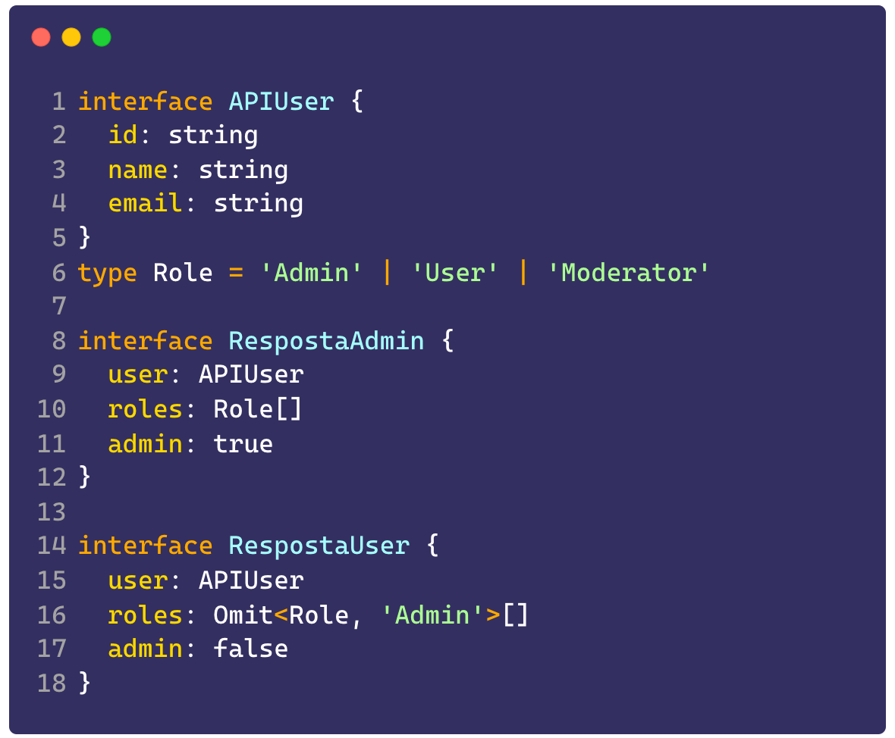

Repare que estamos usando um **utility type** chamado `Omit` que remove uma das chaves do nosso union.

Poderíamos deixar ela ainda mais útil se fizéssemos uma **discriminated union**, que vai realizar o que chamamos de **type narrowing** reduzindo o tipo somente ao que passarmos, por exemplo, para a chave `admin`:

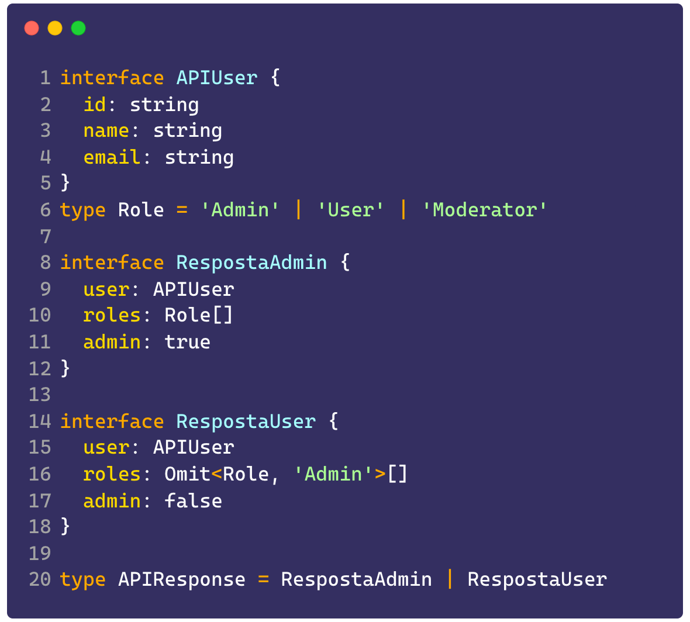

E poderíamos deixar ela ainda mais genérica usando generics:

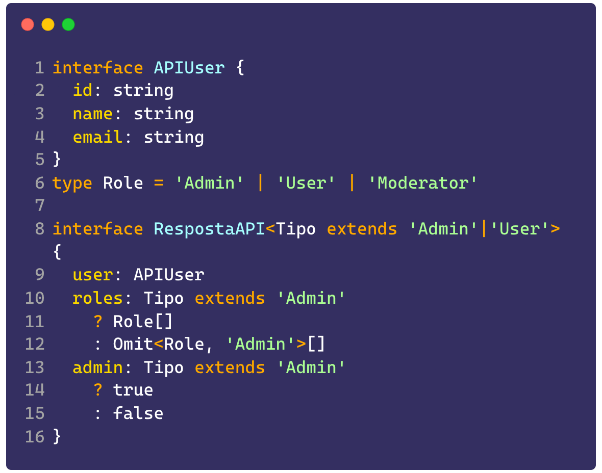

### Types vs Interfaces

Outra pergunta que eu recebi mais de uma vez em diversos locais é: "Qual é a diferença de tipos e interfaces?". Vou dar vários exemplos aqui e você pode ver todos eles [nesse link do TS Playground](https://www.typescriptlang.org/play?ssl=44&ssc=81&pln=28&pc=1#code/PTAEBUEsAcHsGdRwCYFMC2p6oE6gK7wCGyCoaoAZrDukaAMawB2AVvswC71OaRe5KRBqngAofp0HDUoAMJEcOWAEkBOISNABvMaFDLkReAC5QAJjEBfMWM4BPaLIVLY4R7IC8OvQdhHTC2tbJmZ4TkYARjMXZXcnUG9tPwCzcxtQ8MZzGMVlNSkNGUSdFOM0jJYshgBmXNd4r2zQEAJMThhYUABL0GN4WAZIAEOAN1QAGz62+klpEVtWgFEADykwgGOu0ch6NAYJxSIOllB0XABzfgusAGeepAR4AFvxqYxQOaKRcS-NZ0gOAY+AmXV0+hwREgsDMzHw6AARrhgn9inJAcDQT59MhdudOMpYfCkThgmJMhEhkCQTD5BiaSVkpDoWZIgAach41AE2nmUA2MStADyZ1E6C6zC2Dzg8Beb0YsHanXEDgS6OpoKgcEZBihtLhiNw-LsHjpGrcnR1uKI+MJoANJONgrAAEFEWQUB9sHhROtcaREHAcN0lTKCMQ+OpsAwAOdS3igABkoGdoFkqJ+4Zt02gREOo0hjAAFkRxmm1qhmMhfup-qAAAqiAb0cH2xWoMzhHDXXyQIxoImG0kCjOyF0TDhdVAVquIRuy2At3x5ydmAn4VC+aDKShNmhmIQTbC95Cdgk9yphCKN5B28eTnXMdtmADkN+UL45fZIHYs5g5K5PmuOAbhy26wLuC44AeebYF+p6gC+kTmDUyE1C+TrLKAHRhp6mC+pWaB4BQo4qqa9Y7nueDePOzZJqUgG0oecFIJRUHARuxoUqALrMEQZgURBVGPs+iG8UQn6fP2v7mAAbABE5AVQsGoGBbEDNB2EgbIArCgYqC8IRJBdL0hCKJ8tYyIGRzYcq5CyLACKsNyHo0AAjhuqZCoguDKIgJGWZm8BSnQkCIEimBoJQ-B9ggEiBbIACywjCGCvijIuMFHpu+jGOUoAAAxkqqzg0PgrD0Ek6WZVpnn6E+nD4DgSnrjlfTEIElgChM3JnClTBmMlDCpTqGX8cp2UAR1ZgFcaPWUmVFUxItlWlGNHGqW2jXNbSrVTfl6TkitJR0MNTBiKdI3eEwIEVYsYAFPMohprZuH+F6RqQOg0A9ecXDGYGNCgLA+AEsYjCHLKojxYUdbgN2RDMBcNKPd8sitgixi-g6yK5RM23jTjpK5TgqDjQAFAAlIkAB89rEsiAoHP0EAI0jDJfT9GCVpwiDw7s7OgqjdathSIEMJwQPk6TxnMBM9igJj2CDiSHIy6QcsK3mBMq7g1PaDYJNk6AVPYvo+nbcwJucEWYUAHRK7IABU2G2-Adva01RCU8Alj6DYAolaAACK+AkJCpBal0VX6IcpC68TfQy2YpueHTRNkszsoh2Ht7GZ832-TziCh+HxlR2bYv4BLUvqyw8ugHH+oMzg+uG0nxum62ELck1Vs2-bTegC7fvGrpYD1jQIZYO2AgWbDVmPGg+HhIRRpZ9g4hEAiXbCJSkOIAAYjQdBm9vu8Sx3RBUwnADcZKjmamKwC6O9g5f05+kfJ9LjiXI8gnXwzJm5DkzlUSkMR6SglfhfCIMcr5d18D3S2iFJQmTaPaAAX+cD8vgrBsl8NaW0vICEQj1KyawQA).

Vamos começar pelo mais óbvio: **Interfaces só representam objetos**. Tipos também podem ter a mesma função mas tipos simples também podem representar primitivos, o que não é possível com interfaces, então podemos representar um objeto dessa forma:

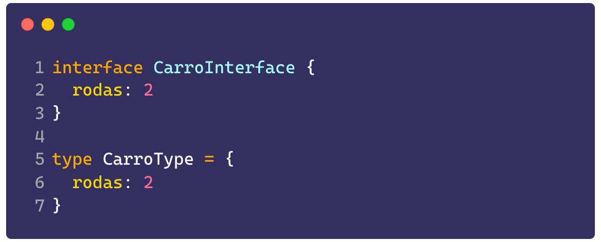

Mas interfaces não podem ter tipos primitivos ou tuplas, esse é um trabalho para os tipos:

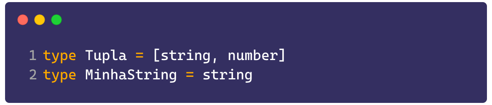

E os tipos são intercambiáveis, ou seja, podemos associar uma variável a uma interface e depois associar essa interface a um tipo:

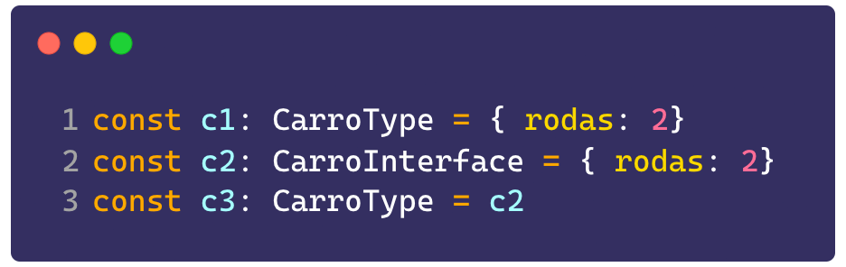

**Declaration merging** só é possível dentro de interfaces. A extensão por merging, ou _interface augmentation_, só é possível quando estamos trabalhando com interfaces, porque o compilador do TS vai juntar todos os identificadores com o mesmo nome sob o mesmo objeto. Já o mesmo não é possível com tipos porque eles são estáticos e só podem ser declarados uma vez:

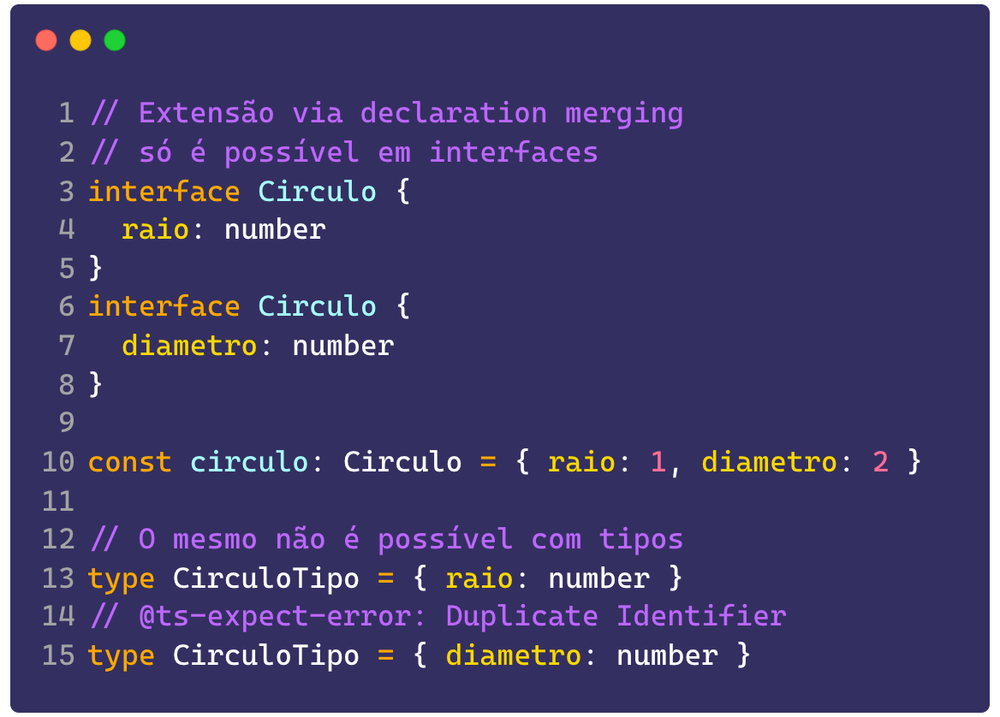

Mas isso não significa que não podemos estender tipos também, e o declaration merging não é uma boa prática para interfaces porque você perde o controle de onde estão as declarações. Então podemos estender os tipos usando o operador de intersecção `&` enquanto as interfaces podem ser estendidas com a palavra chave `extends`:

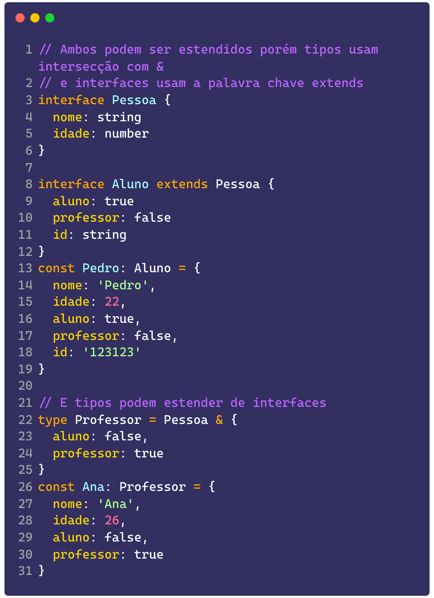

Apesar de tipos serem muito bons, eles tem mensagens de erros que são mais crípticas do que interfaces, que são feitas para serem trabalhadas como objetos. Nesse caso é muito mais recomendado, se você tiver um objeto, usar a interface diretamente do que usar um tipo. Por exemplo neste caso:

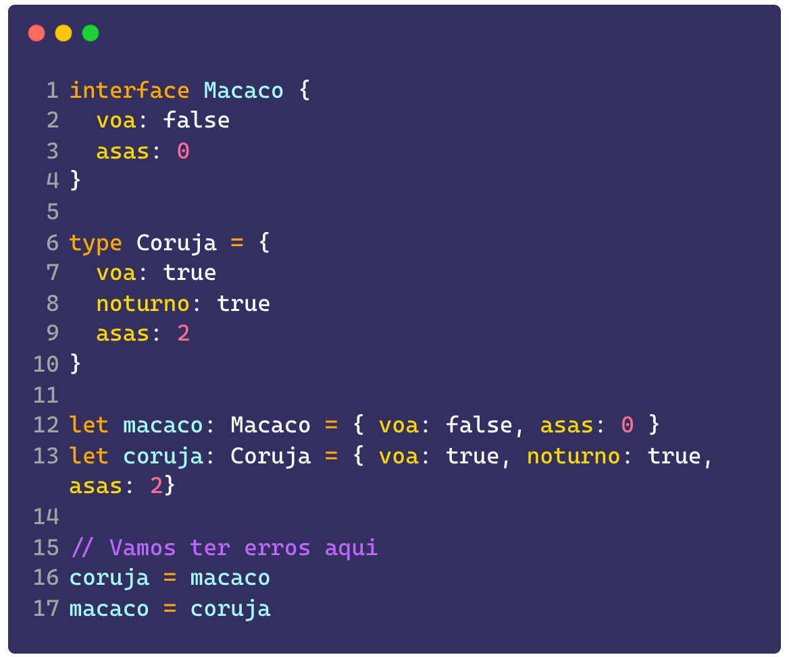

Enquanto o erro que temos no tipo será um pouco mais complicado de identificar, porque ele vai ser algo como:

```bash
Type 'Coruja' is not assignable to type 'Macaco'.
  Types of property 'voa' are incompatible.
    Type 'true' is not assignable to type 'false'.
```

No outro tipo que representa a interface (o `macaco`) vamos ter um erro mais direto:

```bash
Property 'noturno' is missing in type 'Macaco' but required in type 'Coruja'.
```

Outra coisa que ambos podem fazer é serem usados como partes de uma implementação por uma classe, ou seja, podemos dizer que uma classe implementa tanto um tipo quando uma interface e essa classe poderá ser utilizada de forma intercambiável com essa interface ou tipo, o que é ótimo para criar polimorfismo dentro do seu código:

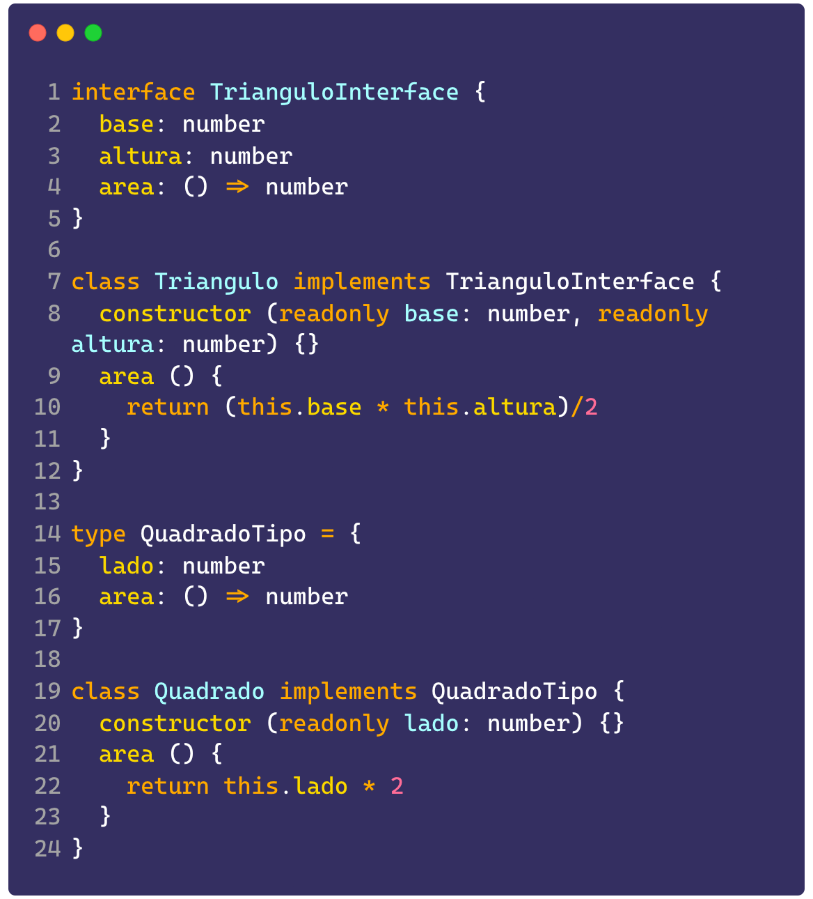

Porém, somente interfaces podem **estender de classes**, o que é super legal quando você quer criar um novo objeto a partir de um objeto existente, mas esse objeto novo não vai ser uma classe em si:

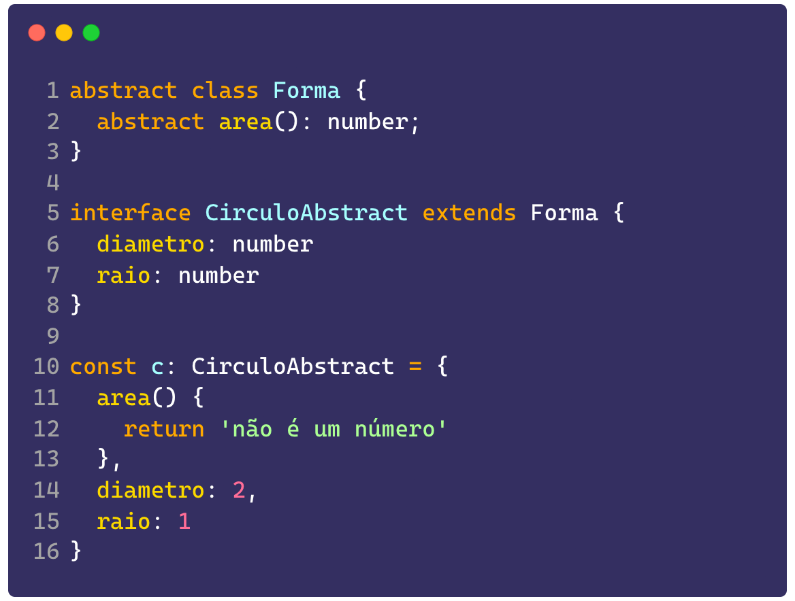

## Unknown, Any e Never

Vamos falar das últimas práticas sobre tipos, os três cavaleiros do apocalipse: `any`, `never` e `unknown`.

### O uso de Any

Essencialmente desliga a inferência de tipos. É o equivalente de dizer que aquele tipo pode ser qualquer coisa. Qualquer tipo que tiver uma union ou intersection com `any` vai ser inferido como `any`. Usar `any` é considerada uma das piores práticas do TS.

Porém, existem casos onde é necessário que o any esteja presente. Geralmente esses casos acontecem quando um tipo é completamente desconhecido, de tal forma que você nem sabe qual é a estrutura desse tipo.

Portanto, sem saber a estrutura, não podemo usar `unknown`, porque ele nos forçaria a um type cast. Então a saída é o uso do any para tipar algum argumento que possa ser completamente desconhecido. Mas isso é **FORTEMENTE** desencorajado.

> [!CAUTION]
> JAMAIS use `any` em retornos de funções ou em interfaces que possam ser mescladas com outros objetos. Isto porque, assim que o TS pegar o retorno da sua função, ele vai tipar qualquer variável que receber essa função como `any` e você vai perder outras inferências de tipos.

Mas é super importante dizer que, em 99% dos casos, é possível substituir `any` por qualquer outro tipo, inclusive a [própria documentação oficial](https://www.typescriptlang.org/docs/handbook/declaration-files/do-s-and-don-ts.html#any) diz para não usar `any` a não ser que você esteja migrando a sua base de JavaScript para TypeScript.

### O uso de Unknown

O `unknown` é a saída para os casos acima. O irmão mais correto do `any`, usar `unknown` diz que você não sabe qual é o tipo daquele dado, dessa forma o TS vai te obrigar a fazer um **type casting** (usando `dado as <novo tipo>`) antes de poder fazer qualquer coisa com ele.

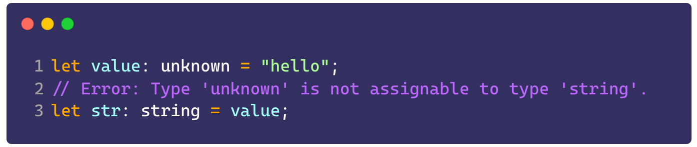

É o exato oposto do `any`, usando `unknown` você vai forçar o TypeScript a checar o seu tipo antes de fazer qualquer operação

O `unknown` não está incluso em nenhum tipo, mas diferente do `any`, um tipo `x = unknown & string` vai ser inferido como `string`, porque a junção de um conjunto que não está em nenhum outro com outro conjunto vai ser sempre o outro conjunto. Na prática, isso quer dizer que se você misturar `unknown` com qualquer outro tipo usando intersecção, ele vai inferir o outro tipo, mas no caso de uma união (com `|`) o `unknown` vai vencer.

Quando você não sabe o resultado de uma chamada de API ou quando você quer obrigar seu usuário a tipar o retorno de alguma coisa, você pode usar `unknown` porque é um tipo extremamente restritivo. Por exemplo:

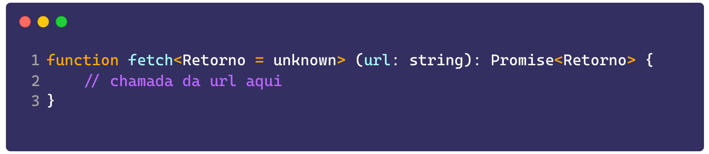

A não ser que a pessoa que esteja usando essa função passe o argumento de retorno, a saída não pode ser manipulada.<Sidenote>Na verdade, essa é a forma que o `fetch` nativo do browser é implementado.</Sidenote>

### Never say never

O não-tipo. O tipo `never` é o tipo que não representa nenhum tipo, ele não pode ser intersectado ou unido com ninguém, ele é ele mesmo e representa o resultado de uma operação que nunca pode acontecer, ou seja, se você chegou no fim de um caso, recursão ou qualquer outra coisa, o `never` é seu amigo porque ele impede que este retorno seja misturado com qualquer outra coisa.

Os usos mais comuns do `never` são para indicar caminhos que uma função não pode percorrer, ou seja, formas que ela não pode ser usada.<MarginNote>O `never` é bem mais comum em bibliotecas e outras tipagens que são estendidas por outras pessoas, raramente você vai ter que usar manualmente em um código de produção.</MarginNote>

Um exemplo, é o uso de `never` para fazer uma divisão onde o denominador é zero e não queremos que isso aconteça. Então se tivermos uma função desse tipo:

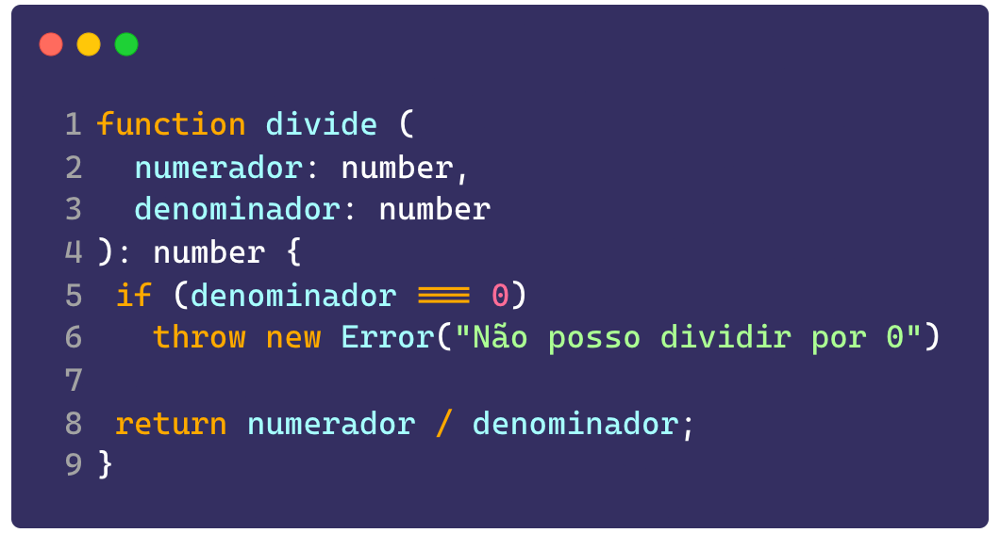

No nosso retorno estamos especificamente dizendo que a função vai sempre retornar um número, mas podemos também ter um erro. Neste caso, podemos dizer a quem está usando que precisamos checar o valor de retorno antes de fazer uma operação usando `never`:

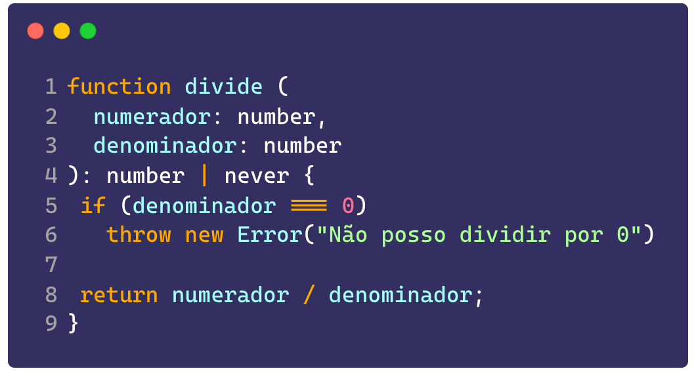

Podemos usar várias outras técnicas pra deixar a função completamente TypeSafe. Dentre elas o uso do `infer` (que eu já expliquei [aqui](/infer-typescript/)), faz um type narrowing no nosso generic para garantir que só vamos usar números maiores que zero:

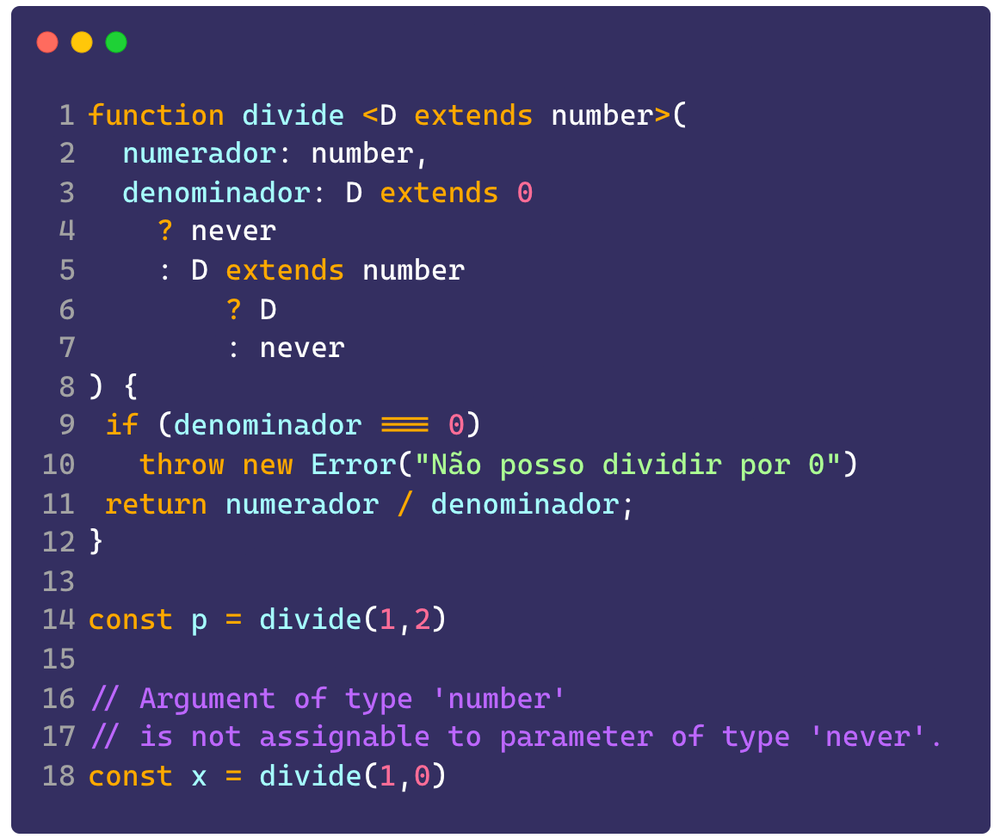

## Configuração

Além das boas práticas de código, existem também as boas práticas de configuração, ou seja, configurar o compilador do TS de forma que ele consiga dar pra você o melhor da inferência de tipos sem deixar que você caia em ciladas.<Sidenote>Todas as opções que eu vou falar aqui são colocadas dentro da chave `compilerOptions` no seu `tsconfig.json`.</Sidenote>

### Sempre use `strict: true`

Como primeira recomendação, mantenha a opção `strict: true` ativa, isso vai garantir uma série de checagens de código explícitas que o compilador vai fazer por padrão, além de ser o modelo mais seguro e recomendado até mesmo pelos devs do TS.<Sidenote>Ativar essa opção vai automaticamente ativar as opções seguintes e mais [várias outras](https://www.typescriptlang.org/tsconfig#strict).</Sidenote>

### Checagem estrita de nulls

Outra recomendação é ativar a chave `strictNullChecks`, o que ela faz é que todos os tipos que possam retornar `undefined` ou `null` vão te dar um erro se você não checá-los, dessa forma:

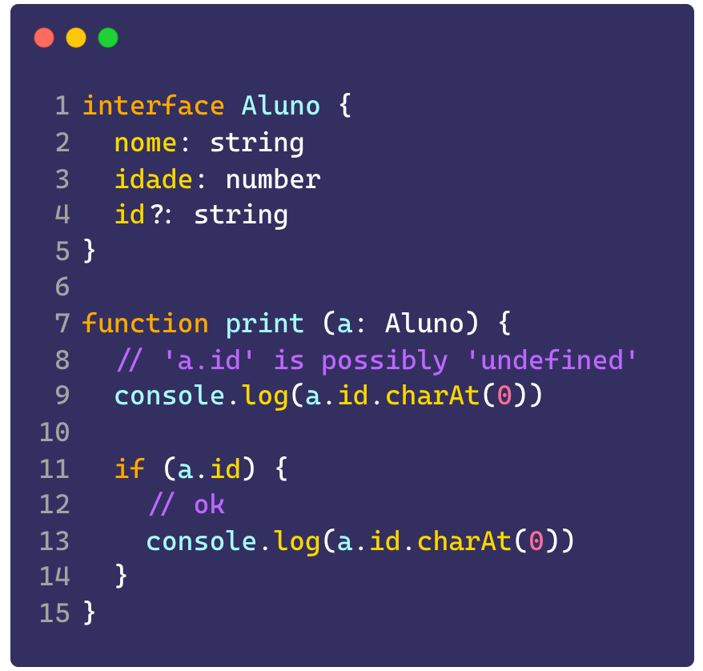

### Indo um passo além com `noImplicityAny`

Outra configuração super importante que deixa seu projeto muito mais seguro é remover a possibilidade do TS inferir qualquer variável para `any` sem dar nenhum erro. Como vimos antes, o `any` é o pior tipo de prática para se ter com TS, e remover a maior quantidade possível deles vai fazer o seu código muito mais seguro.

A configuração `noImplicityAny` faz com que o TS deixe de ser uma ferramenta opcionalmente tipada para algo que é **obrigatoriamente** tipado. Ou seja, você vai precisar especificar o tipo de tudo que for identificado como any.

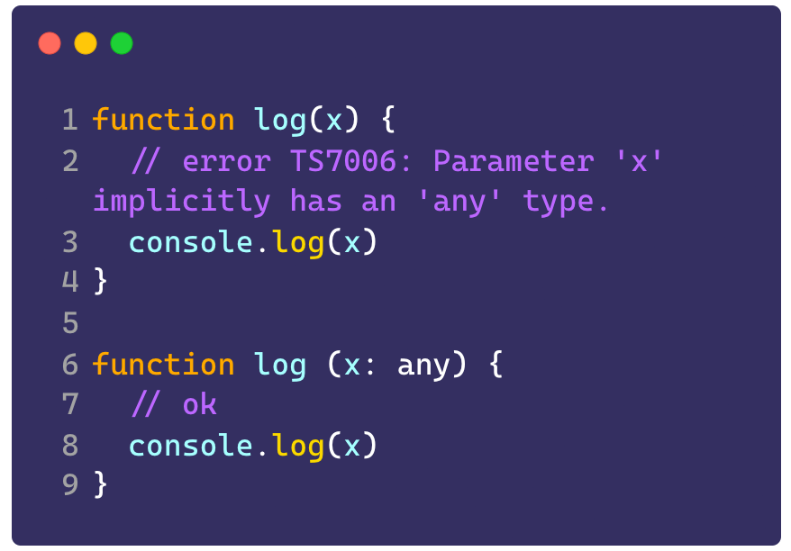

Tenha em mente que essa é uma opção bastante severa, especialmente se você está migrando uma plataforma de JS para TS, dessa forma, a migração não vai ser só trocar os nomes dos arquivos, mas vai precisar de algumas mudanças manuais.<Sidenote>Se você estiver a fim de usar o TS da forma como ele foi feito para ser usado, você pode ativar uma configuração [do ESLint chamada](https://github.com/typescript-eslint/typescript-eslint/blob/main/packages/eslint-plugin/docs/rules/no-explicit-any.md) `noExplicitAny`, que vai impedir que você use `any` em **qualquer lugar.**</Sidenote>

### Outras boas configurações

-   `noUnusedLocals`: Dá um erro se existirem variáveis não usadas
-   `noUnusedParameters`: Erros quando existem parâmetros não usados
-   `noFallthroughCasesInSwitch`: Força o uso de `break` em `switch / case` para evitar que um `case` passe para o próximo
-   `noUncheckedIndexedAccess`: Qualquer objeto que for acessado pelo índice (exemplo: `obj['indice']`) vai ter seu valor inferido como `<valor> | undefined` porque ele pode ser vazio e precisará ser checado.

## Pra você treinar

Antes de mandar o próximo desafio, vamos corrigir o desafio anterior! Onde tínhamos que tipar [esse arquivo](https://gist.github.com/khaosdoctor/9e9a30d5053974f7221be7e06ec19ffc). Você pode encontrar a resposta [aqui](https://gist.github.com/khaosdoctor/c38e01c1da0aaee69ce1c7bb5ed66b47)!

Agora vamos ver se você pegou bem as boas práticas de código com dois exercícios:

-   Crie um tipo chamado Flatten, que aceita um parâmetro genérico que só pode ser um array de um único tipo (um `string[]` por exemplo) e ele deve retornar o tipo do array (por exemplo `string`).
-   **Desafio:** Implemente a função `FlattenDeep` que aceita arrays de qualquer dimensão (por exemplo um `string[][]`) e extraia o valor existente no array (uma `string[][]` seria `string`).
-   Faça a implementação de uma interface genérica para uma forma geométrica contendo `area` e `volume` como funções, e implemente essa interface para criar as classes concretas `Quadrado`, `Circulo` e `Triangulo`

> [!IMPORTANT]
> Não esquece de deixar o seu feedback sobre a #SemanaTS aqui [nesse formulário](https://forms.gle/6hAqjVmah9uyR4by8)!
