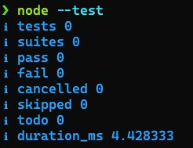

Eu ando falando bastante do Test Runner em vários lugares (inclusive [aqui no blog](/node-test-runner/)), recentemente participei de um podcast super legal com o Ryan falando mais sobre essa ferramenta que chegou faz pouco tempo e já ganhou o coração de todo mundo.

Você pode assistir o vídeo aqui embaixo:


Mas e ai? Como a gente começa a fazer um teste usando o Node.js Test Runner (NTR) e o TypeScript? Esse aqui vai ser um artigo bem rápido e bem simples de como deixar tudo arrumado para seu primeiro teste!

## Preparando o ambiente

Diferente da maioria dos test runners como o [Jest](/jest-com-typescript/), você não precisa baixar nenhum tipo de dependência pra usar o NTR, é só ter a o Node.js na versão 20 ou superior instalada na sua máquina e está tudo certo.

Para saber se você tem tudo certo, é só rodar o comando `node --test` em uma pasta vazia.[^n1] Como o node não vai encontrar nenhum arquivo, a sua saída deve ser essa:



Se você tem esse texto no seu terminal, parabéns você tem o Node.js Test Runner pronto pra uso! Agora, se você não tem esse comando, instale a versão mais recente do [Node](https://nodejs.org), existem várias formas de se fazer isso:

1.  Através do site oficial do Node
2.  Usando um gerenciador como [asdf](https://asdf-vm.com/) ou [NVM](https://github.com/nvm-sh/nvm)
3.  Usando um package manager como o Homebrew, apt, ou qualquer outro

> [!NOTE]
> Para esse artigo estou usando a versão 22.2.0 do Node.

Crie uma pasta onde vamos colocar o nosso teste, use `npm init -y` para poder inicializar um `package.json`, dentro de `scripts` crie um comando `test` se já não houver, ficando dessa forma:

```json
{
  "name": "test",
  "version": "0.0.1",
  "main": "index.js",
  "scripts": {
    "test": "node --test ./tests/**/*.test.*"
  },
  "keywords": [],
  "author": "Lucas Santos <hello@lsantos.dev> (https://lsantos.dev/)",
  "license": "GPL-3.0",
  "description": ""
}
```

Se você rodar no seu terminal o comando `npm t`, verá a mesma saída de antes. Agora já podemos criar o nosso primeiro arquivo

## **O primeiro teste**

Para criar o nosso primeiro teste vamos começar com uma função simples. Crie um arquivo chamado `sum.mjs` na raiz do projeto, vamos usar essa função:

```js
export function sum (...n) {
  return n.reduce((acc, cur) => acc+cur)
}
```

É uma função simples de soma que leva um parâmetro variádico `N`, então `sum(1,2)` deve sempre retornar `3`. Vamos testar isso.

Em um novo arquivo `sum.test.mjs` na pasta `tests` podemos começar importando o principal: nosso tester e a nossa ferramenta de asserção nativa.

```js
import { test } from 'node:test'
import assert from 'node:assert'
```

Diferente da maioria dos testers, o Node.js Test Runner não vem com uma ferramenta nativa de asserção de testes, mas ele aceita qualquer ferramenta que tenha o que chamamos de _throwing assertions_, ou seja, se der tudo certo, nada acontece, se não, temos um _throw_ em um erro.

Coincidentemente (ou não) o Node já tem uma biblioteca de asserção, o [`node:assert`](https://nodejs.org/api/assert.html), ela não é a melhor de todas, mas é utilizável e bem estável há anos.

> [!NOTE] 💡
> Se você preferir outra sintaxe, como a do [Chai](https://www.chaijs.com) por exemplo, você pode usar essa biblioteca sem problemas

Agora vamos importar a nossa função do módulo `sum.mjs` e criar o nosso primeiro teste:

```js
import { test } from 'node:test'
import assert from 'node:assert'
import { sum } from '../sum.mjs'

test('sum', () => {
  assert.deepStrictEqual(sum(1,2), 3)
})
```

É simples assim... Agora podemos rodar o comando `npm t` e você verá uma saída como essa:

```
❯ npm t

> test@0.0.1 test
> node --test ./tests/**/*.test.*

✔ sum (0.759667ms)
ℹ tests 1
ℹ suites 0
ℹ pass 1
ℹ fail 0
ℹ cancelled 0
ℹ skipped 0
ℹ todo 0
ℹ duration_ms 45.971875
```

Porém a gente quer testar outras coisas, mas não quer criar outros testes de primeiro nível... Por exemplo, eu quero ter uma categoria `sum` mas dentro dela eu quero vários testes sendo executados, como temos com o `describe` e o `it` no Jest.

Bom, é nosso dia de sorte.

## Describe e it

O Node.js test runner tem os mesmos métodos `describe` e `it`, então podemos fazer assim:

```js
import { describe, it } from 'node:test'
import assert from 'node:assert'
import { sum } from '../sum.mjs'

describe('sum', () => {
  it('deve somar dois números', () => {
      assert.deepStrictEqual(sum(1,2), 3)
  })
})
```

E agora a saída do nosso teste vai ser:

```js
▶ sum
  ✔ deve somar dois números (0.495625ms)
▶ sum (0.994416ms)
ℹ tests 1
ℹ suites 1
ℹ pass 1
ℹ fail 0
ℹ cancelled 0
ℹ skipped 0
ℹ todo 0
ℹ duration_ms 45.708083
```

E podemos adicionar um novo teste, digamos que queremos um erro se algum dos elementos de N não for um número:

```js
export function sum (...n) {
  if (!n.every((num) => typeof num === 'number')) throw new Error('Não é um número')
  return n.reduce((acc, cur) => acc + cur)
}
```

Para testar é tão simples quanto adicionar um novo `it`:

```js
import { describe, it } from 'node:test'
import assert from 'node:assert'
import { sum } from '../sum.mjs'

describe('sum', () => {
  it('deve somar dois números', () => {
      assert.deepStrictEqual(sum(1,2), 3)
  })

  it('deve dar um erro se não tiver um número', () => {
    assert.throws(() => sum(1, 'b'), Error)
  })
})
```

E agora nosso resultado do teste vai ser:

```js
▶ sum
  ✔ deve somar dois números (0.521541ms)
  ✔ deve dar um erro se não tiver um número (0.174958ms)
▶ sum (1.283333ms)
ℹ tests 2
ℹ suites 1
ℹ pass 2
ℹ fail 0
ℹ cancelled 0
ℹ skipped 0
ℹ todo 0
ℹ duration_ms 46.597292
```

## Coverage

Além de termos os testes, também temos uma ferramenta experimental que coleta code coverage dos nossos testes, para isso podemos simplesmente habilitar uma opção chamada `--experimental-test-coverage` (no futuro essa opção não vai ser mais um `--experimental`), nosso comando no `package.json` vai ficar assim:

```json
{
  "name": "test",
  "version": "0.0.1",
  "main": "index.js",
  "scripts": {
    "test": "node --test --experimental-test-coverage ./tests/**/*.test.*"
  },
  "keywords": [],
  "author": "Lucas Santos <hello@lsantos.dev> (https://lsantos.dev/)",
  "license": "GPL-3.0",
  "description": ""
}
```

Agora podemos rodar o mesmo comando `npm t` de antes e o resultado vai ser um pouco diferente:

```js
▶ sum
  ✔ deve somar dois números (0.673708ms)
  ✔ deve dar um erro se não tiver um número (0.211542ms)
▶ sum (1.552791ms)
ℹ tests 2
ℹ suites 1
ℹ pass 2
ℹ fail 0
ℹ cancelled 0
ℹ skipped 0
ℹ todo 0
ℹ duration_ms 58.830042
ℹ start of coverage report
ℹ -------------------------------------------------------------------
ℹ file               | line % | branch % | funcs % | uncovered lines
ℹ -------------------------------------------------------------------
ℹ sum.mjs            | 100.00 |   100.00 |  100.00 |
ℹ tests/sum.test.mjs | 100.00 |   100.00 |  100.00 |
ℹ -------------------------------------------------------------------
ℹ all files          | 100.00 |   100.00 |  100.00 |
ℹ -------------------------------------------------------------------
ℹ end of coverage report
```

O Node.js Test Runner suporta várias ferramentas de report de coverage, a principal é o [TAP](https://testanything.org/), um protocolo que deixa bem simples a integração com outros sistemas. Mas além disso temos lcov, dot, etc... Para alternar entre eles é só passar a propriedade `--test-reporter`, experimenta fazer um teste com `--test-reporter=dot`.

## TypeScript

Uma das coisas mais legais do Node.js Test Runner é a integração direta com o TypeScript através dos _loaders_ (agora chamados de _importers_), como o [TSX](/tsx-loader/) (que eu também já escrevi [aqui](/tsx-loader/)).

Para podermos iniciar a integração com o TS, vamos fazer o setup do mesmo no projeto, primeiro instalamos as duas dependências:

```sh
npm i -D tsx typescript @types/node
```

Agora rodamos `npx tsc --init` e devemos ter um arquivo `tsconfig.json` no nosso projeto. Não vamos mexer em nada nele agora.

Vamos alterar o nosso comando no `package.json` para isso aqui:

```json
{
  "name": "test",
  "version": "0.0.1",
  "main": "index.js",
  "scripts": {
    "test": "node --import=tsx --test --experimental-test-coverage ./tests/**/*.test.*"
  },
  "keywords": [],
  "author": "Lucas Santos <hello@lsantos.dev> (https://lsantos.dev/)",
  "license": "GPL-3.0",
  "description": "",
  "devDependencies": {
    "@types/node": "^20.12.13",
    "tsx": "^4.11.0",
    "typescript": "^5.4.5"
  }
}
```

Se você rodar o comando agora, nada vai mudar, porque nosso arquivo mjs ainda é o mesmo e o TSX consegue rodar esse arquivo tranquilamente. Agora vamos alterar as extensões para `.mts` e rodar o teste de novo com `npm t`. A sua saída vai ser algo assim:[^n2]

```js
▶ sum
  ✔ deve somar dois números (0.57075ms)
  ✔ deve dar um erro se não tiver um número (0.209459ms)
▶ sum (1.26725ms)
ℹ Warning: Could not report code coverage. TypeError: Cannot read properties of undefined (reading 'line')
ℹ tests 2
ℹ suites 1
ℹ pass 2
ℹ fail 0
ℹ cancelled 0
ℹ skipped 0
ℹ todo 0
ℹ duration_ms 133.706375
```

## Conclusão

O Node.js Test Runner é atualmente o mais rápido e mais simples runner de testes no ecossistema JavaScript/TypeScript, e também um dos mais simples de configurar.

Nesse artigo cobrimos apenas o básico do básico, mas vou voltar com mais coisas sobre como criar mocks, como mockar timers e como eu implementei funcionalidades no core do Node.js, especificamente neste módulo!

[^n1]: O comando é recursivo, então ele vai tentar entrar em todas as suas pastas.

[^n2]: O erro que estamos vendo no code coverage é o motivo pelo qual ele ainda está como `--experimental`. Ele já foi reportado [aqui](https://github.com/nodejs/node/issues/52775) e parece ter uma correção [aqui](https://github.com/nodejs/node/pull/53153).
