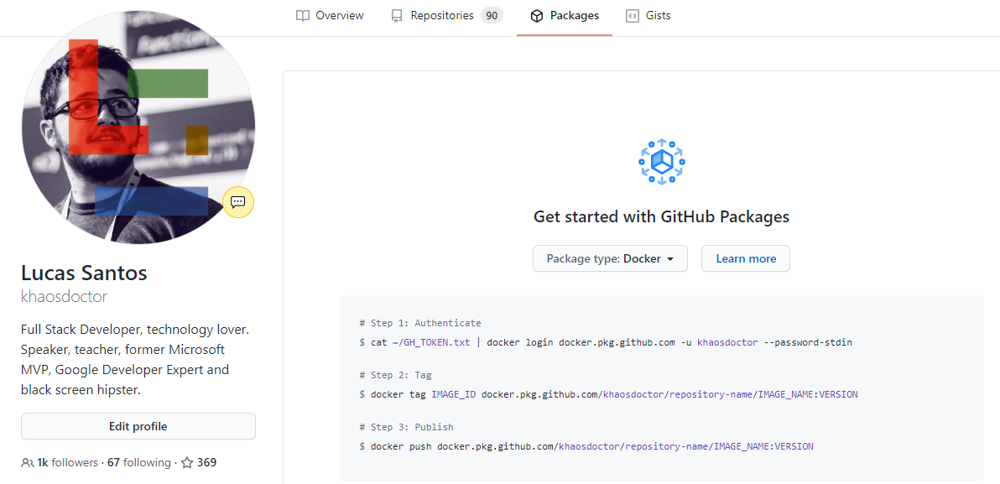
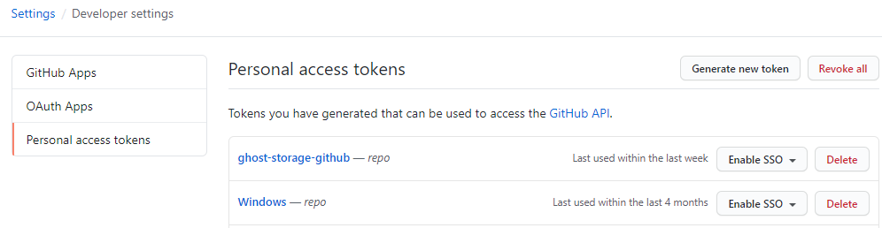
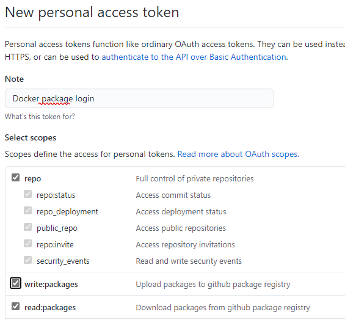
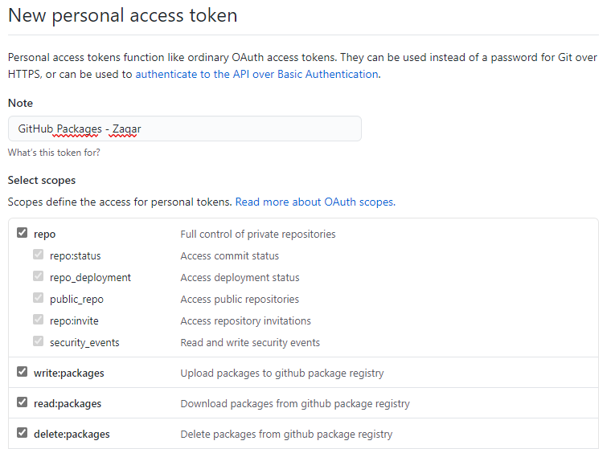
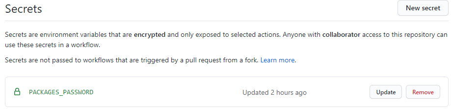
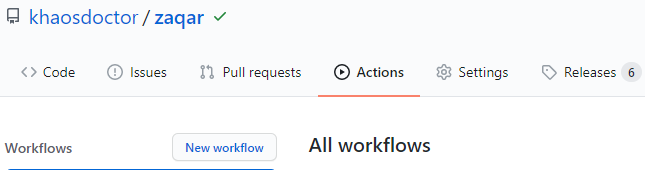
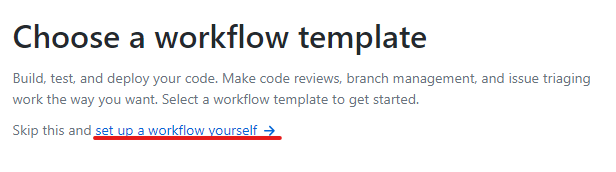
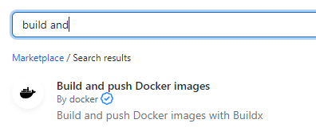
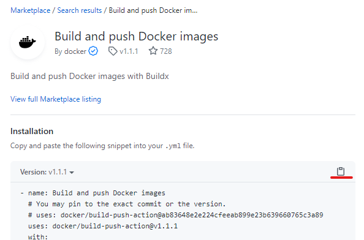
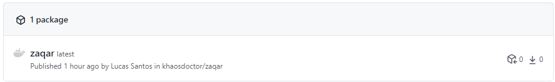

Há algum tempo atrás, o GitHub anunciou que estavam criando os **GitHub Packages**. Esta era mais uma ferramenta desta incrível rede para que a vida dos desenvolvedores e desenvolvedoras ficasse ainda mais fácil.

Você pode acessar os packages através do seu próprio perfil, e lá você vai ver uma série de opções, desde pacotes do NPM até, mais recentemente, imagens do **Docker**!.



Isso mesmo! Agora, além do Docker Hub, você também pode armazenar suas imagens diretamente no GitHub, mas o que isso muda?

## GitHub Container Registry

O GH Container Registry é uma forma de você conseguir unir o seu código com a imagem que ele representa, ou seja, deixar a infraestrutura e o código em si no mesmo ambiente.

Isso facilita muito quando você precisa direcionar algum usuário para uma página de downloads, ou então informar que você pode também baixar a imagem de um determinado container diretamente do seu próprio perfil!

Inicialmente, essa ferramenta estava em um beta fechado, porém, no dia 1 de setembro, a equipe liberou um beta aberto para todos os usuários testarem o novo modelo de pacotes.

### Quanto custa

Comparando com o Docker Hub, que não cobra para repositórios públicos, mas sim para repositórios privados, o GH Container Registry é a mesma coisa. Quando essa funcionalidade for para a sua versão pública - a famosa _GA (General Availability)_ - o custo para imagens públicas será zero, enquanto imagens privadas terão um custo a parte.

Por enquanto, no entanto, durante todo o beta, tanto os pacotes públicos quanto privados serão **gratuitos**. Então aproveita para fazer aquele teste e colocar suas imagens lá!

Mas, espera um pouco... Como a gente faz isso?

## Criando uma imagem

Para criarmos e armazenarmos uma imagem no registro do GitHub é super simples. Podemos fazer de duas maneiras.

### Através do Docker

Podemos logar no GitHub com nosso Docker local e enviar a imagem para o registro, da mesma forma que logamos em outros registros privados, como o [ACR](https://azure.microsoft.com/services/container-registry/?WT.mc_id=personal-blog-ludossan).

Para isso vamos seguir os seguintes comandos:

1.  Execute o login em seu terminal de preferência:

```bash
docker login docker.pkg.github.com -u <usuario do github>
```

2\. O prompt vai pedir sua senha, é gerar um novo _access token_ [nesta página](https://github.com/settings/tokens)



É importante que o token tenha as permissões de escrita e leitura de packages



3\. Utilize este token gerado como senha para logar

4\. Faça um push de qualquer imagem utilizando `docker push docker.pkg.github.com/username/repositório/nome-da-imagem:tag`

### Através de GitHub Actions

Já falamos [em outro artigo](https://dev.to/azure/do-zero-a-automacao-em-7-minutos-com-github-actions-1386) sobre como podemos automatizar uma série de coisas utilizando GH Actions (e mais artigos vão vir por ai 😎), então como podemos utilizar as actions para enviar nossas imagens para o CR do GitHub?

Para este exemplo eu vou usar um repositório que mantenho, chamado [Zaqar](https://github.com/khaosdoctor/zaqar). Isto porque este projeto já é em sua natureza um microsserviço e **precisa** do Docker para funcionar, então podemos utiliza-lo de forma mais real.

Primeiramente vou criar um novo _access token_ para que eu possa usar como minha senha na nossa action



Dentro do nosso repositório, vamos na aba `settings` e depois na guia `secrets`. Lá, vamos criar um novo secret chamado `PACKAGES_PASSWORD` e vamos colocar o conteúdo do nosso _access token_ dentro dele:



Depois, vamos na aba `actions` dentro do repositório:



Clicaremos em new workflow (no meu caso, porque eu já tinha um workflow existente), quando formos direcionados para a tela onde seremos apresentados com os mais diversos workflows, vamos clicar no link abaixo do título que diz _"Set up a workflow yourself"_.



Lá vamos ter um pequeno documento padrão com algumas linhas, vamos fazer uma alteração para que tenhamos a nossa action sendo executada somente em pushes para a branch master e também em tags que comecem com `v`, assim podemos ter `v1.0.0` e assim por diante.

Veja como nosso arquivo base vai ficar

```yaml
# This is a basic workflow to help you get started with Actions

name: Publish to GitHub Container Registry

on:
  push:
    branches: [ master ]
    tags: v*

# A workflow run is made up of one or more jobs that can run sequentially or in parallel
jobs:
  # This workflow contains a single job called "build"
  build:
    # The type of runner that the job will run on
    runs-on: ubuntu-latest

    # Steps represent a sequence of tasks that will be executed as part of the job
    steps:
      # Checks-out your repository under $GITHUB_WORKSPACE, so your job can access it
      - uses: actions/checkout@v2
```

Agora, vamos no menu do lado direito e iremos procurar a action da própria Docker chamada "Build and push Docker images"



Iremos copiar o código clicando no botão de cópia do lado direito:



E vamos colar logo abaixo da nossa action anterior, dentro de `steps`, depois vamos apagar algumas das linhas que estão colocadas como parâmetros, porque não vamos utilizar todos eles.

```yaml
# This is a basic workflow to help you get started with Actions

name: Publish to GitHub Container Registry

on:
  push:
    branches: [ master ]
    tags: v*

# A workflow run is made up of one or more jobs that can run sequentially or in parallel
jobs:
  # This workflow contains a single job called "build"
  build:
    # The type of runner that the job will run on
    runs-on: ubuntu-latest

    # Steps represent a sequence of tasks that will be executed as part of the job
    steps:
      # Checks-out your repository under $GITHUB_WORKSPACE, so your job can access it
      - uses: actions/checkout@v2

      - name: Build and push image
        uses: docker/build-push-action@v1.1.1
        with:
          # Username used to log in to a Docker registry. If not set then no login will occur
          username: khaosdoctor
          # Password or personal access token used to log in to a Docker registry. If not set then no login will occur
          password: ${{ secrets.PACKAGES_PASSWORD }}
          # Server address of Docker registry. If not set then will default to Docker Hub
          registry: docker.pkg.github.com
          # Docker repository to tag the image with
          repository: khaosdoctor/zaqar/zaqar
          # Automatically tags the built image with the git reference as per the readme
          tag_with_ref: true
```

Vamos passar parte por parte deste arquivo para que possamos entender o que está acontecendo. Primeiramente, estamos dizendo para o workflow na chave `name` que vamos nomear esse passo do nosso processo com um novo nome além do nome da action, isto é apenas para organização.

Depois, estamos dizendo que vamos utilizar a action da Docker como uma base, estamos passando o nome do repositório e o nome da action, bem como sua versão.

Depois estamos passando pelos parâmetros que queremos setar:

-   `username` é o nome do nosso usuário do github
-   `password` é o nosso secret que acabamos de criar, contendo o nosso _access token_ para podermos fazer o login no registry
-   Depois temos a chave `registry` que é onde vamos definir para que registro vamos mandar o nosso container. Neste caso, como estamos usando o próprio GitHub, vamos fixar esse valor em `docker.pkg.github.com`
-   Na chave `repository` vamos colocar o nome da nossa imagem, ela deve ser **sempre** neste formato que comentamos acima, onde temos `nomedeusuario/repositorio/imagem:tag`
-   E então temos a última configuração, que é a mais interessante e é a que mais poupa trabalho para quem está desenvolvendo. A chave `tag_with_ref` faz algumas coisas interessantes, a principal delas é que ela faz o taggeamento automático da imagem para nós, quando estamos enviando um push para a branch `master` diretamente, nossa imagem vai receber a tag `latest` quando enviamos para uma tag do git, a tag da imagem vai ser o nome da nossa tag do git. Você pode checar mais sobre as peculiaridades e como cada uma das configurações funciona na [página da action](https://github.com/docker/build-push-action/tree/releases/v1)

Depois de terminarmos, vamos dar um nome ao nosso arquivo e então salvá-lo. A partir daí uma nova build irá rodar e vamos ter uma nova imagem no nosso repositório:



Você pode checar a página deste pacote individual [nesta URL](https://github.com/khaosdoctor/zaqar/packages/404513)

## Conclusão

Juntando o GitHub com os container registries, temos uma capacidade muito maior de poder unir o nosso código e nossa infraestrutura em um único lugar. Essa unificação faz com que nossa complexidade diminua, pois vamos ter que lidar com menos ambientes, portanto podemos pensar em outras funcionalidades que tirem proveito destas facilidades no futuro!

Espero que tenham gostado do artigo, deixe seu comentário, curta e compartilhe! Não se esqueça de se inscrever na newsletter para mais conteúdo exclusivo!

Até mais!
