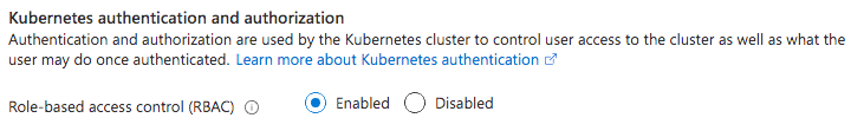

O Kubernetes ficou bastante famoso pela sua capacidade de gerenciar aplicações distribuídas e fazer com que a orquestração de containers se tornasse fácil. Porém, com o uso mais amplo do sistema, esquecemos de coisas primordiais como a segurança do nosso cluster.

## O problema do acesso comum

Uma das facilidades que o Kubernetes nos proporciona é o `kubectl`, sua padronização da linha de comando e a capacidade de conseguir gerenciar múltiplos clusters de uma única vez faz com que ele seja tentador para ser utilizado em uma equipe de desenvolvimento como a única ferramenta disponível.

Para dar um pequeno contexto e nivelar o conhecimento de todos os leitores, o `kubectl` funciona com um arquivo chamado `config` que, geralmente, fica na pasta `~/.kube` e chamamos ele de `kubeconfig`. Este arquivo contém as credenciais e instruções de como o `kubectl` deve se comportar para conectar aos clusters que estão listados por lá. Em suma, ele é a chave para todos os clusters que você tem acesso.

Durante os meus anos usando o Kubernetes e também prestando consultoria a empresas, por mais de uma vez observei situações onde o acesso do cluster é compartilhado entre toda a equipe de desenvolvimento, ou seja, o mesmo `kubeconfig` sendo repassado entre todo mundo e até mesmo sendo usado em ferramentas automatizadas de CI.

### Mas qual é o problema disso?

Assim como é péssimo você dar a chave da sua casa para qualquer pessoa que passa na rua, é péssimo que todas as pessoas do time tenham o mesmo acesso, porque por mais que o Kubernetes possua uma ferramenta de auditoria que permite saber o que foi feito e quem fez as alterações, se todos os usuários forem `admin`, fica um pouco difícil entender o que aconteceu.

Além disso, dar permissão total como administrador para qualquer pessoa poder manipular o cluster é uma receita para um desastre em pouquíssimo tempo. Muitas pessoas gerenciando todas as ferramentas e todos os namespaces cria a tendência da falta de controle pelo administrador do cluster.

## Autorização e autenticação no Kubernetes

Felizmente, o Kubernetes permite que tenhamos um sistema de autenticação e autorização através de usuários, que permite que criemos acessos específicos para cada pessoa.

O sistema de autenticação e autorização são diferentes, o Kubernetes não gerencia os usuários propriamente ditos, mas possui ferramentas nativas para gerenciar suas permissões – chamadas de `Role`, `ClusterRole`, `RoleBinding` e `ClusterRoleBinding` que vamos ver em um artigo futuro. Ou seja, a autenticação de usuários (saber quem é quem) e a autorização (saber quem pode fazer o que) são ferramentas separadas que podem ser gerenciadas de forma separada.

### Mas por que fazer isso?

Imagine que você trabalha em uma grande empresa, como a Microsoft, por exemplo. Dentro de empresas deste porte (ou até mesmo em empresas que são bem menores), temos uma divisão muito clara de áreas e times. Cada área é responsável por uma tarefa ou então cuida de uma ou uma série de aplicações específicas.

Por exemplo, a equipe que cuida do Microsoft Teams não é a mesma que cuida do Windows, apesar de elas precisarem compartilhar recursos, uma não deveria ter permissão de acessar ou manipular os recursos da outra.

Trazendo esta analogia para empresas menores, que possuem menos produtos, se tivermos dois times distintos usando o mesmo cluster, cada time só pode ter permissões dentro de seu próprio namespace, além disso, nem todas as pessoas do time devem ter permissões para alterar determinados recursos. Por exemplo, a equipe de gerencia pode modificar todos os recursos em um namespace, mas uma equipe de BI não deveria poder escrever ou deletar recursos, apenas lê-los.

Tudo isso é chamado de **RBAC** ou (**R**ole **B**ased **A**ccess **C**ontrol), e essa é apenas uma das possibilidades que temos dentro do AKS para poder gerenciar usuários, vamos explorar outras possibilidades no futuro.

## Como funciona a autorização no Kubernetes

O Kubernetes expõe uma API ReST. E é ela que temos que controlar para evitar que pessoas não autorizadas acessem o cluster, ou seja, da mesma forma que protegemos nossas APIs de acessos externos, temos que proteger nosso cluster.

Para isso, o Kubernetes usa esse servidor para autorizar as requests, avaliando os atributos daquela requisição contra uma série de políticas criadas pelo administrador e dá uma resposta booleana _sim_ ou _não_ caso o usuário possa ou não executar a ação. Por padrão, o Kubernetes adota uma prática _deny all_, ou seja, ninguém tem permissão para nada, elas precisam ser adicionadas.

O `kubectl` possui um comando chamado `auth can-i` para verificar se um determinado usuário pode ou não executar alguma ação dentro da API, por exemplo:

```bash
$ kubectl auth can-i create pods --namespace production
```

E, se você for um administrador, pode combinar esse comando com a flag `--as` para poder personificar um usuário e testar permissões para ele.

```bash
$ kubectl auth can-i create pods -n production --as lucas
```

### RBAC com AKS

Por padrão, quando criamos um cluster AKS, o RBAC está habilitado, ou seja, não precisamos fazer nada de diferente para podermos criar um cluster já com essa capacidade. No painel da Azure, temos uma opção que nos diz se podemos ou não utilizar o RBAC para autorização:



Neste artigo, vamos apenas criar os usuários, não vamos trabalhar com a parte de autorização ainda. Isto vai ficar para um próximo artigo

Para criarmos um cluster usando a linha de comando podemos fazer assim:

```bash
az aks create \
  -n nome \
  -g rg \
  --enable-rbac \
  --generate-ssh-keys \
  --node-count 1
```

## Criando usuários no Kubernetes

No Kubernetes, temos dois conceitos de usuários, pois eles podem ser pessoas como eu e você, mas também podem ser outros serviços não humanos – como um CI, por exemplo – por isso, temos a diferenciação entre um `User` e uma `ServiceAccount`.

Essencialmente, um `User` é um conceito que **não existe** dentro do K8S como um recurso válido, ou seja, não temos um arquivo manifesto que tenha um `Kind: User`, porque `User` não é uma _resource definition_ válida. Usuários são processos ou humanos que existem **fora** do cluster, por isso não são gerenciados.

No caso de `ServiceAccounts` estamos falando de processos que são dependentes do seus namespaces e não são humanos em essência – embora podemos criar SAs para humanos também – e estes recursos existem como uma _RD_ válida, ou seja, temos um `Kind: ServiceAccount` e podemos criar uma a partir de um arquivo manifesto do Kubernetes. Estes são processos **internos** ao cluster e geralmente são mais comum atrelados a pods.

Em suma, ambos usam a API de autorização, mas podemos fazer isso:

```bash
kubectl create serviceaccount minhaconta
```

Mas não podemos fazer isso:

```bash
kubectl create user lucas
```

Isso significa que o **Kubernetes não armazena nem gerencia informações de usuários**. Todo esse gerenciamento de identidade é feito através dos meios comuns fora do cluster, a forma mais comum é através de certificados digitais no formato X509.

### Usando certificados

O modo mais comum e mais seguro, como falamos antes, é usar um certificado X509 para criar um usuário. Este certificado é assinado pela CA do cluster e permite que o usuário se autentique na API usando essa validação, ou seja, o Kubernetes verifica se a request está autenticada com a chave do certificado, se sim, é um usuário confiável, pois ninguém além do próprio cluster pode emitir tal certificado.

Porém, além de toda a segurança criptográfica do certificado, o processo é bastante seguro porque exige que tanto a pessoa que está pedindo a autorização quanto o autorizador precisem participar do processo de criação do usuário, que é mais ou menos assim:

1.  Usuário gera uma chave privada (ou usa a sua própria)
2.  O usuário gera uma nova CSR (Certificate Signing Request) com esta chave e manda para o administrador
3.  O administrador assina a CSR com a CA do cluster, tornando ela um certificado X509 válido no formato `CRT`, e devolve o arquivo CRT para o usuário
4.  O usuário pode usar os comandos do próprio `kubectl` para criar seu usuário na sua máquina

### Criando um usuário

Vamos fazer o processo completo, simulando um cluster criado para podermos autenticar nosso usuário.

Primeiramente, vamos gerar uma nova chave privada usando o OpenSSL:

```bash
openssl genrsa -out ./lucas-k8s.key 4096
```

Agora podemos gerar o arquivo CSR:

```bash
openssl req \
  -new 
  -key ./lucas-k8s.key \
  -out ./lucas-k8s-csr \
  -subj "/CN=lucas/O=devs"
```

Aqui temos que notar algumas coisas importantes. Primeiramente estamos gerando a chave para um usuário chamado `lucas`, isso fica claro quando setamos o **Common Name (CN)** na CSR, será esse campo que vai nomear o nosso usuário. Além disso, temos os campos de **Organization (O)**, neste caso estamos criando um usuário chamado `lucas` que faz parte da organização `devs`.

Para o Kubernetes, a **CN** é o nome do usuário e o **O** são os grupos nos quais este usuário está inserido. Vamos usar essas informações quando criarmos os **Roles** e **RoleBindings** nos próximos artigos.

Agora, nosso usuário já tem tanto a chave quando o CSR necessário, vamos enviar estes arquivos para o administrador do nosso cluster, que vai assinar este certificado.

O administrador pode realizar um login via SSH no _control plane_ do Kubernetes e assinar o certificado manualmente, o que é mais difícil, porém mais seguro, ou então criar um objeto chamado **CertificateSigningRequest** dentro do Kubernetes, que diz ao cluster que ele possui um CSR para assinar com sua CA.

Todo o objeto CSR precisa de um arquivo CSR válido em formato base64, então vamos transformar nosso `lucas-k8s.csr` em um novo encoding:

```bash
$ cat ./lucas-k8s.csr | base64 | tr -d '\n'
```

Copie a saída do terminal e vamos criar um arquivo manifesto chamado `csr.yaml`:

```yaml
apiVersion: certificates.k8s.io/v1beta1
kind: CertificateSigningRequest
metadate:
  name: lucas-csr
spec:
  request: <cole o base64 aqui>
  usages:
    - digital signature
    - key encipherment
    - client auth
```

Agora criamos este objeto no cluster chamando `kubectl apply -f csr.yaml` e vamos poder ver o que criamos através do comando `kubectl get csr`:

```output
NAME        AGE    REQUESTOR      CONDITION
lucas-csr    34s   masterclient   Pending
```

Veja que o certificado está como _Pending_, isto porque toda CSR precisa da aprovação do operador para poder ser criada. Vamos aprovar essa criação com o comando `kubectl certificate lucas-csr approve`. Isso vai gerar uma mensagem de confirmação e ai podemos rodar novamente o comando `kubectl get csr`, que vai ter uma saída um pouco diferente:

```output
NAME        AGE    REQUESTOR      CONDITION
lucas-csr   5m3s   masterclient   Approved,Issued
```

Veja que além de _Approved_ ele também já foi emitido (_Issued_) então estamos prontos para mandar este certificado de volta para nosso usuário. Para obter o certificado, vamos executar um elegante _oneliner_:

```bash
kubectl get csr lucas-csr \
  -o jsonpath='{.status.certificate}' \
  | base64 -d > lucas-k8s.pem
```

Teremos um novo arquivo chamado `lucas-k8s.pem`, vamos nos certificar de que ele é válido com o comando `openssl x509 -in ./lucas-k8s.pem -text -noout`. Isso vai nos dar, além de outras informações, o nome e as datas de validade do certificado.

### Cadastrando o usuário no kubeconfig

Agora vamos mandar novamente o certificado de volta para o usuário para que ele possa criar o seu usuário. Para isso, vamos precisar mexer com nosso `kubeconfig`, já que não temos duas máquinas, então faça uma cópia do seu arquivo atual para não perder seus dados com `mv ~/.kube/config ~/.kube/config.bkp`.

Vamos buscar os dados base do AKS novamente usando `az aks get-credentials -n cluster -g rg` e vamos usar o kubectl para criar novas credenciais:

```bash
kubectl config set-credentials lucas \
  --client-key /caminho/para/lucas-k8s.key \
  --client-certificate /caminho/para/lucas-k8s.pem \
  --embed-certs=true
```

Agora vamos juntar a nossa configuração de usuário que acabamos de criar com a configuração do cluster:

```bash
kubectl config set-context lucas \
  --cluster=nome_do_cluster \
  --user=lucas
```

Como clonamos a imagem base do AKS, ela está com o acesso administrativo por padrão, vamos remover o acesso de administrador antes de enviar para o nosso usuário:<Sidenote>Para saber os nomes corretos, dê uma lida no seu arquivo `kubeconfig` para poder achar estas chaves.</Sidenote>

```bash
kubectl config delete-context <nome-do-contexto> 
kubectl config unset users.nome_do_resource-group_nome-do-cluster
```

Agora você pode testar com `kubectl config use-context lucas`, tente executar qualquer comando, como não criamos nenhum esquema de permissão ele sempre te devolverá uma mensagem:

```output
Error from server (Forbidden): pods is forbidden: User "lucas" cannot ...
```

## Usando Tokens

Outra forma de criarmos usuários é dando a eles tokens JWT para autenticação. Um uso comum desta forma de autenticação é para serviços externos ou então usuários que são temporários, visto que é mais fácil remover um token do que um certificado.

Isto porque criamos tokens usando ServiceAccounts, da mesma forma que criamos para serviços não humanos. Cada SA vai criar um novo Secret com um token JWT que é válido mesmo fora do cluster.

A criação é bem simples:

```bash
kubectl create serviceaccount lucas-sa
```

Agora, vamos buscar a SA e ver qual é o nome do Secret que ela criou usando `kubectl get sa lucas-sa -o yaml`. Veja que temos uma chave chamada `secrets`, esta chame vai ser um array de objetos cuja propriedade `name` é o nome do secret que estamos procurando, no meu caso estava assim:

```bash
secrets:
  - name: lucas-sa-token-6dfl4
```

Vamos agora buscar o token com este simples comando:

```bash
TOKEN=$(kubectl get secret lucas-sa-token-6dfl4 -o jsonpath='{.data.token}')
```

Para criarmos um novo usuário no `kubectl` com um token, podemos usar a seguinte linha de comando:

```bash
kubectl config set-credentials lucas-token \
  --token=$TOKEN && \
kubectl config set-context lucas-token-context \
  --cluster=nome-do-cluster \
  --user=lucas-sa
```

## Conclusão

Vimos como podemos criar usuários no Kubernetes através de certificados digitais e de tokens, nos próximos artigos vamos explorar como podemos completar o conjunto dando a eles níveis de permissionamentos diferentes com roles. Não deixe de acompanhar [a continuação dessa série](/dando-permissoes-a-usuarios-com-kubernetes/)

Com isso, a segurança do seu cluster irá aumentar muito e você se tornará capaz de entender e gerenciar os usuários para que ninguém possa fazer algo diferente do que você está permitindo. Melhorando a auditoria no processo.

Até mais!
