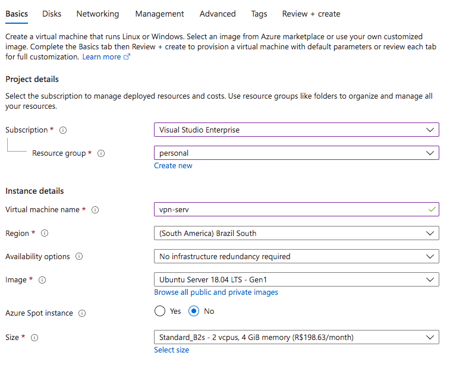
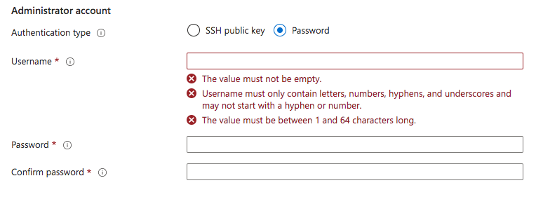
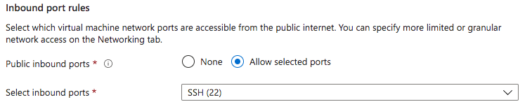
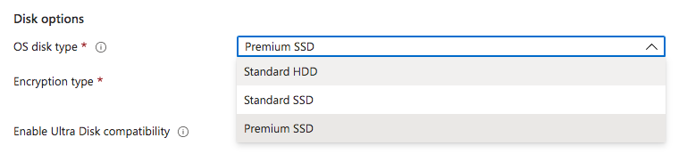
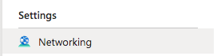
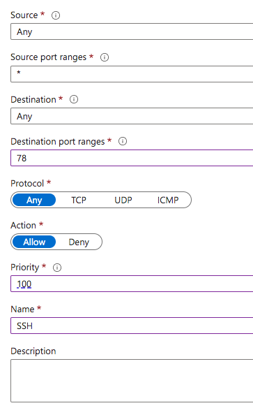
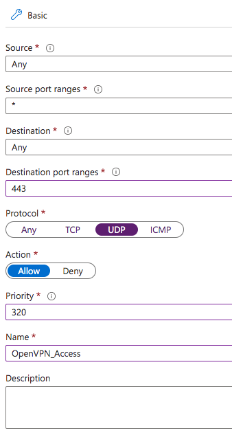
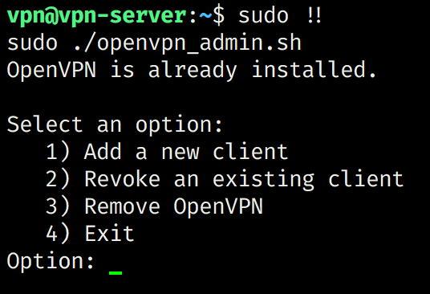

import figureImage1 from './criando-uma-vpn/image.png'
import figureImage2 from './criando-uma-vpn/image-1.png'
import figureImage3 from './criando-uma-vpn/image-3.png'
import figureImage4 from './criando-uma-vpn/image-7.png'
import figureImage5 from './criando-uma-vpn/image-8.png'
import figureImage6 from './criando-uma-vpn/image-12.png'

## Atualização - 2022!

Opa pessoal! Por conta da grande demanda por esse artigo eu acabei fazendo um vídeo no meu canal do youtube! Assim fica muito mais fácil para poder explicar os conceitos.

Mas ainda sim, esse artigo é muito mais aprofundado no geral! Então recomendo ver os dois para ter mais detalhes!

<YouTube id="ytJUHTFtcyY" />

Não se esqueça de se inscrever no canal e dar seu like para ajudar esse conhecimento a chegar em mais pessoas!

---

Quer estejamos trabalhando ou simplesmente navegando na Internet, um dos principais questionamentos que temos é se o nosso tráfego de rede está realmente seguro ou se estamos sendo espionados pelos nossos próprios provedores de Internet.

Com base nisso, decidi utilizar uma VPN paga há alguns anos, a PIA VPN, porém eu acabei cancelando o uso desta VPN por dois fatores simples:

-   Depois de um tempo eles pararam de ter servidores brasileiros por conta de políticas internas do país com relação a retenção de logs, então o servidor mais próximo era o dos EUA, o que adicionava um ping de 120ms para cada requisição
-   A PIA foi recentemente adquirida por uma companhia israelense que tem um histórico que é, digamos... Um pouco duvidoso em relação a espionagem

Obviamente estes motivos foram totalmente pessoais, a PIA é uma ótima VPN porém, para mim, não estava mais funcionando. Então por um tempo fiquei sem nenhuma VPN até ter uma ideia de tentar construir a minha própria, já que não haviam outros servidores que não guardavam logs aqui no Brasil.

## Iniciando o processo

Para começar o processo, eu comecei a pesquisar alguns tipos de tutoriais e ideias de de como começar a criar minha própria VPN, juntando alguns deles consegui um processo bastante rápido e bastante conciso para poder criar a minha própria VPN e ter total certeza que não há alguém espionando os logs por trás.

Aqui estão alguns dos artigos que utilizei para poder criar a VPN, alguns deles explicam muito bem as razões por trás de tudo, outros simplesmente são tutoriais passo a passo:

-   [How to set up your own VPN server](https://www.howtogeek.com/221001/how-to-set-up-your-own-home-vpn-server/)
-   [Should you set up your own VPN?](https://www.techradar.com/news/should-you-set-up-your-own-vpn-server)
-   [How to Make Your Own VPN](https://www.youtube.com/watch?v=gxpX_mubz2A&t=5s)
-   [Setup a personal OpenVPN server](https://www.servermania.com/kb/articles/setup-personal-vpn-server/)

<CourseCTA />

### Por que eu deveria construir minha própria VPN

Assim como já falamos no parágrafo anterior, a principal razão para você querer setar a sua VPN própria é justamente a questão de que você está no controle de todos os logs e todas as ações dentro do servidor. Então não há como ter alguém espionando suas ações no meio do caminho.

Além disso, ter uma VPN própria – principalmente para os brasileiros – implica que, se você estiver utilizando uma VPN por pura segurança, você vai conseguir acesso a redes públicas e até mesmo sem senha sem precisar se preocupar com segurança no geral, porque você vai ter um servidor local que adiciona pouquíssimo de latência a sua conexão, ou seja, essencialmente, o túnel criptografado que você irá criar entre seu computador e a sua VPN vai atuar somente como uma camada de criptografia extra.

Menos importante do que isso também, é a capacidade que você terá de permitir que outras pessoas tenham acesso a sua rede através do mesmo túnel, então você poderá compartilhar arquivos locais ou até mesmo jogar jogos desenhados para a LAN através da Internet.

### Problemas de criar sua própria VPN

O maior uso de VPNs atualmente infelizmente não é para se proteger de olhos alheios, mas sim para poder trocar a sua localização geográfica de forma que você aparentará estar em outros países, quebrando assim algumas travas de Geo-IP que alguns sites possuem, que impedem você de consumir algum conteúdo que será destinado a um país específico, por exemplo.

Enquanto é possível criar um servidor utilizando provedores de cloud como a [Azure](https://azure.microsoft.com/?WT.mc_id=cxa-0000-ludossan), que providenciam várias máquinas virtuais em diversos locais do mundo, ainda sim o custo que você terá para criar um servidor de VPN em cada região é extremamente alto comparado ao custo de você contratar um serviço de VPN pronto, como a NordVPN ou a TunnelBear. Embora seja completamente possível se você estiver disposto a gastar algumas centenas de reais por mês.

> Você também pode criar diversos servidores e deixar os mesmos desalocados (parados), o que consome muito menos recursos e gasta muito menos, ligando o servidor somente quando for utilizar ou agendando um auto desligamento.

## Criando sua própria VPN

Com isso tudo dito, vamos partir para a criação da nossa própria VPN, o primeiro passo é criar um servidor onde possamos acessar a VPN a partir da Internet, existem várias maneiras de se fazer isso, uma delas (que vou postar aqui assim que terminar) é utilizar um RaspberryPI como servidor e o serviço do No-IP para poder expor o mesmo para a Internet.

Como vamos criar o nosso próprio servidor e **não vamos armazenar logs**, não há problema em criarmos em serviços de cloud como a Azure, então vamos começar criando um servidor por lá.

> Você pode utilizar outros serviços cloud também, como a DigitalOcean, Linode ou qualquer outro que você se sinta mais a vontade utilizando.

### Criando o servidor

Para criarmos o nosso servidor, você primeiro precisa ter uma conta na [Azure](https://azure.microsoft.com/?WT.mc_id=cxa-0000-ludossan), se é a sua primeira vez então você vai ganhar alguns créditos que vão te ajudar a não precisar pagar pelo servidor, pelo menos nos primeiros meses.

Ao entrar no portal da Azure, pesquise no topo por "Virtual Machines", clique no ícone e você deverá cair em uma lista de máquinas virtuais, que provavelmente estará vazia, clique no botão "Add" logo abaixo do título:

<Figure src={figureImage1} priority alt="" caption="<span style=&quot;white-space: pre-wrap;&quot;>Adicionando uma máquina virtual</span>" />

Selecione "Virtual Machine":

<Figure src={figureImage2} alt="" caption="<span style=&quot;white-space: pre-wrap;&quot;>Clique em &quot;Add&quot; e então em &quot;Virtual Machine&quot;</span>" />

Quando você selecionar a opção, vamos ter um formulário para ser preenchido, é importante que você preste atenção no que vamos colocar por aqui. Primeiro, vamos ter uma ideia de como este formulário se divide.

A primeira seção são dados gerais do projeto:



Agora atente-se ao que vamos colocar em cada campo:

-   **Subscription:** isto vai vir preenchido automaticamente se você só tiver uma conta da Azure, se não, é a conta que você deseja ser cobrado.
-   **Resource Group:** É uma boa prática criar um novo resource group para armazenar os dados da VPN, você pode clicar no link "Create New" logo abaixo para poder criar o novo RG.
-   **Virtual Machine Name:** É o nome da sua máquina, aqui você pode ser uma pessoa criativa e escrever o que achar mais conveniente, só é preciso lembrar dele depois.
-   **Region:** Aqui é a parte mais importante, onde você vai criar o seu servidor, lembrando que você precisa levar em consideração as leis locais de cada país, então se você quer acessar conteúdo disponível nos EUA, crie um servidor nos EUA, se você quer baixar algum torrent, evite países presentes na lista dos [14 eyes](https://www.vpnmentor.com/blog/understanding-five-eyes-concept), vamos de Brasil mesmo.
-   **Availability Options:** Neste campo definimos a redundância de rede, não vamos precisar disso então vamos manter como está.
-   **Image:** Vamos usar o Ubuntu por comodidade em instalar os scripts e a VPN, mas se você tiver habilidade com Linux, pode usar qualquer distro que quiser.
-   **Azure Spot Instance:** Há uma categoria de VMs na Azure que utilizam a capacidade não utilizada da cloud a um preço bem menor, as chamadas Spot Instances, porém o problema é que elas não tem garantia de disponibilidade, e seu servidor pode ser desalocado se a capacidade for necessária, queremos que o servidor seja o mais disponível possível, certo? Então vamos deixar isso aqui como "No".
-   **Size:** Essa é a parte onde teremos que decidir o tamanho da nossa máquina, a Azure te dá vários tipos e tamanhos diferentes de máquinas, a mais comum é a DS2\_V3, porém ela é um canhão para o que queremos fazer, vamos selecionar então a máquina **B1s** que possui somente 1 núcleo e 1 Gb de RAM.

<Figure src={figureImage3} alt="" caption="<span style=&quot;white-space: pre-wrap;&quot;>Escolha o tamanho apropriado de máquina</span>" wide />

Na próxima seção, vamos ter as configurações de autenticação.



Aqui temos um disclaimer importante. Vou utilizar o "password" para que todos saibam o que fazer quando para trocar para um acesso via chave SSH, uma vez que a senha é trafegada em texto puro, portanto pode ser um meio de ataque para hackers.

O que vamos fazer é setar uma senha inicial para fazer o login, porém a primeira alteração no servidor será alterar o SSH para que possamos acessar em portas diferentes e também através de uma chave SSH ao invés da senha.

> Se você já é familiarizado com os métodos de login do SSH e já sabe como fazer a alteração, então você pode marcar "SSH Public Key" para evitar um retrabalho.

Por fim temos as configurações de portas. Vamos deixar somente uma das portas habilitadas, a 22 que é a porta padrão do SSH:



Ao clicar em "Next" vamos para a seção de discos, não vamos incluir nenhum disco novo, vamos apenas trocar o disco que vem por padrão de "Premium SSD" para "Standard HDD", pois não precisamos de velocidade e o HD é muito mais barato:



Vamos dar um "Next" e passar batido pela seção de rede, pois não vamos mudar nada, na seção "Management", vamos desativar todas as opções:

<Figure src={figureImage4} alt="" caption="<span style=&quot;white-space: pre-wrap;&quot;>Desativamos todas as opções na seção de gerenciamento</span>" />

Então clicamos no botão azul do lado esquerdo inferior "Review + Create". Após uma rápida revisão de configurações, seu servidor será criado, o processo em si demora alguns minutos, mas assim que estiver finalizado você poderá navegar para a tela do recurso, e verá algo parecido com isto:

<Figure src={figureImage5} alt="" caption="<span style=&quot;white-space: pre-wrap;&quot;>Painel de controle da VM</span>" wide />

### Protegendo o servidor

Como comentamos anteriormente, acessar um servidor de segurança utilizando senha é uma hipocrisia, então vamos gerar as nossas chaves SSH para podermos acessar o servidor de forma segura.

Se você estiver usando o Windows, abra o PowerShell e instale o OpenSSH com o seguinte comando:

```powershell
PS C:\> Add-WindowsCapability -Online -Name OpenSSH.Client*
```

Se você estiver em Mac ou Linux, basta abrir o terminal que o OpenSSH _deverá_ estar instalado por padrão. Se não estiver, busque como instalar o OpenSSH para a sua distro antes de continuar.

Vamos usar o seguinte comando para gerar uma chave:

```bash
ssh-keygen -t rsa -b 4096
```

Pressione ENTER quando for perguntado aonde você quer salvar a chave para salvar no diretório padrão (que é geralmente `~/.ssh`), se não selecione um local aonde você terá acesso para deixar as suas chaves (você pode ter problemas no futuro se não colocar no diretório padrão).

> Você será questionado por uma senha na sua chave, ela é completamente opcional, mas adiciona um nível extra de segurança, se quiser adicionar, pode ficar a vontade.

Vamos logar no servidor para poder realizar as alterações, para isso é só utilizar o comando:

```bash
ssh usuario@ip
```

Lembrando que o usuário é o mesmo usuário que você colocou quando criou o servidor, e o IP é o endereço de IP público que aparece como um link no seu painel da VM na Azure.

Uma vez dentro do servidor vamos atualizar o sistema operacional e todo o sistema com os clássicos:

```bash
sudo apt-get update && sudo apt-get upgrade
```

Depois vamos instalar um editor de texto para que possamos editar os arquivos que vamos precisar, aqui a escolha é pessoal, eu gosto de utilizar o **Vim**, mas você pode instalar o que for melhor para você.

```bash
sudo apt-get install -y vim
```

Vamos criar um novo usuário não root para podermos utilizar como login:

```bash
sudo useradd -G sudo -m nomedousuario -s /bin/bash
```

Depois vamos criar uma senha para este usuário:

```bash
passwd nomedousuario
```

Agora, **não desconecte do SSH do seu servidor** e abra um novo terminal local, vamos transferir a nossa chave pública para dentro do servidor para que ele possa realizar o login.

Para isso, no Linux ou Mac vamos executar o seguinte comando:

```bash
ssh-copy-id usuario@ip
```

No Windows você precisará utilizar outro comando

```powershell
type $env:USERPROFILE\.ssh\id_rsa.pub | ssh seuip "cat >> .ssh/authorized_keys"
```

Mantenha os dois terminais abertos, vamos agora restringir o acesso a quem está usando senha, e também vamos atualizar a porta do SSH para que ele não fique exposto na porta 22, que é padrão.

A primeira coisa que vamos fazer é abrir o arquivo `/etc/ssh/sshd_config` dentro do servidor da VPN. Vamos então procurar a linha `Port 22` e vamos alterá-la, aqui estou usando a porta 78, mas você pode utilizar qualquer porta que queira e não esteja utilizada por outro serviço:

```
# Port 22
Port 78
```

No painel da Azure, vamos entrar nas configurações de rede para abrir a nova porta. Para isso, no painel da VM, vá na barra lateral e clique em "Networking":



Você verá uma lista com todas as portas que estão abertas e todas as regras de rede para o seu IP ordenadas por prioridade. Clique no botão azul "Add inbound port rule":



Preencha as informações alterando o "Destination port ranges" para o número da porta que você escolheu, defina a "priority" como 100 e dê um nome identificável para esta regra de rede. Salve.

Já vamos aproveitar também e abrir a próxima porta que vamos utilizar, que vai ser a porta 443 UDP, que é utilizada pelo OpenVPN para poder realizar a conexão e o tráfego de dados. Clique novamente no botão para adicionar outra regra:



Desta vez, vamos setar o "Destination port ranges" para 443 e selecionar o "protocol" como UDP, deixamos a prioridade do jeito que está e damos um nome identificável. Agora temos o acesso liberado para as duas portas principais, não feche esta aba ainda, nós vamos ter que voltar aqui em instantes.

Voltando ao servidor, vamos continuar alterando o nosso arquivo de configurações. Agora vamos procurar por `PasswordAuthentication` e vamos desativar o login através de senha:

```
PasswordAuthentication no
```

Vamos também desabilitar o login como root:

```
PermitRootLogin no
```

Vamos salvar o arquivo e reiniciar o serviço utilizando:

```bash
sudo systemctl restart sshd
```

**Não feche o terminal que está logado no servidor ainda**, pois se tivermos problemas, não queremos ficar trancados para fora não é mesmo? Abra um novo terminal e vamos tentar logar na máquina com o **novo usuário** através da nova porta:

```bash
ssh -i ~/.ssh/id_rsa novousuario@ip -p porta
```

Se você conseguir logar sem digitar nenhuma senha, ou então um prompt para digitar a senha da sua chave, então está tudo certo. Você pode tentar fazer um teste para saber se podemos também logar sem uma chave:

```bash
ssh novousuario@ip -p porta
```

Isto deve te dar um "Permission Denied"

Agora sim podemos fechar o terminal anterior que tínhamos logado como root, vamos voltar ao portal da Azure e remover a regra padrão de acesso à porta 22 que foi criada. Para isso, é só clicar nos três pontos no final da linha correspondente e selecionar o botão "Delete".

### (Opcional) Criando um alias

O SSH permite que você crie um alias para se conectar mais facilmente ao servidor sem precisar digitar o IP, usuário, chave e porta todas a vezes. Para isso, na sua máquina local, encontre o arquivo `config`, que está na pasta `.ssh` no seu diretório `$HOME` (ou `~/.ssh`), abra com o seu editor preferido e crie um registro novo:

```
Host minhavpn # pode ser qualquer nome
    User novousuario # usuario de login
    Port porta # a porta que você escolheu
    IdentityFile ~/.ssh/id_rsa # Se você salvou a chave em outro local, escolha coloque este local aqui
    HostName ip # endereço de IP do servidor
```

Agora você pode logar no servidor com o comando `ssh minhavpn`

Isso é totalmente opcional, você não precisa executar este passo se não quiser.

## Criando a VPN

A criação da VPN é um processo bastante complexo, que exige que você instale todos os pacotes do OpenVPN, crie IPTables, configure o firewall, crie as chaves de acesso e os certificados que serão utilizados para acessar o endereço e tudo mais.

Todo o processo é muito complexo e é fácil de errar em algo e ter que começar tudo de novo. Então, graças ao open-source, temos um usuário no GitHub chamado [Nyr](https://github.com/Nyr) que criou um script chamado [OpenVPN Road Warrior Installation](https://github.com/Nyr/openvpn-install), que será o que vamos utilizar para instalar, ele vai te fazer algumas perguntas simples e, na maioria das vezes, você vai selecionar a resposta padrão.

Vamos instalar o wget primeiro no nosso servidor com:

```bash
sudo apt-get install -y wget
```

Agora vamos baixar o script no nosso caminho atual (que provavelmente será `~`):

```bash
wget https://git.io/vpn -O openvpn-controller.sh
```

Vamos dar permissão de execução com `chmod +x openvpn-controller.sh` e então vamos executar o script com `./openvpn-controller`.

Alguns pontos importantes durante a instalação:

-   **Porta do servidor:** A porta padrão do OpenVPN é a 1194 UDP, porém como é uma porta padrão, vamos escolher outra, no nosso caso é a 443 UDP que abrimos na Azure
-   **Servidor de DNS:** O servidor de DNS pode ser qualquer um de sua preferência, eu geralmente utilizo `1.1.1.1` ou `8.8.8.8`
-   **Nome do cliente:** Este será o nome do arquivo que você vai gerar com a configuração, eu geralmente separo as configurações por dispositivo, então se você vai usar em um computador Windows, ele pode se chamar `VPN_WIN`

No final do processo de instalação, você vai obter um arquivo `.ovpn` de configuração. Este arquivo é o arquivo mais importante de todos porque ele possui as credenciais de acesso para que você possa entrar na sua VPN, bem como os certificados e chaves do cliente.

### Removendo Logs

Por fim, vamos fazer o que a maioria dos serviços de VPN não fazem, que é **desativar os logs**.

Para isso vamos acessar o arquivo de configuração do OpenVPN com:

```bash
sudo vim /etc/openvpn/server/server.conf
```

Lembrando que o `vim` pode ser qualquer editor. Mude a linha que tem escrito `verb 3` para `verb 0`, salve o arquivo e reinicie o serviço com:

```bash
sudo systemctl restart openvpn-server@server.service
```

> É possível que o nome do serviço seja um pouco diferente dependendo da máquina que você instalou o OpenVPN e a sua versão, então talvez você precise encontrar o nome do serviço para reiniciá-lo

Agora não temos nenhum log sendo mantido pela nossa VPN!

### Baixando as credenciais

Por padrão o script posiciona o arquivo no diretório do root (porque ele precisa ser executado como administrador), então vamos mover o arquivo para o nosso diretório e mudar o dono para que possamos alterá-lo:

```bash
sudo mv /root/nomedoarquivo.ovpn ~
sudo chown novousuario nomedoarquivo.ovpn
```

Vamos agora baixar o arquivo. Para isso, vá em um terminal local e abra uma conexão `sftp` com o seu servidor de VPN através do comando `sftp minhavpn` (ou qualquer que seja o nome que você colocou no seu alias), depois execute os seguintes comandos:

```sftp
get nomedoarquivo.ovpn pasta/de/destino
exit
```

Lembrando que você pode acessar por outros meios também, o sftp é só um deles, mas você pode usar o `scp` ou até mesmo clientes de SFTP como o FileZilla.

Agora o seu arquivo está localizado na sua máquina local e a VPN está instalada, chegou a hora de testar!

## Testando a VPN

Para testar a VPN, se você estiver em um Mac e quiser que todo o seu tráfego passe pela sua VPN, que é o que eu faço por aqui, você vai precisar de um software gratuito chamado [TunnelBlick](https://tunnelblick.net/).

<Figure src={figureImage6} alt="" caption="<span style=&quot;white-space: pre-wrap;&quot;>Painel do TunnelBlick</span>" />

Basta baixar o software e clicar duas vezes sobre o arquivo `.ovpn` que você baixou e ele será importado para o sistema. A partir daí você poderá usar a VPN como qualquer outra.

Se você estiver no Windows ou em qualquer outro dispositivo (até mesmo no iOS, Android e afins) você vai precisar do [OpenVPN Connect](https://openvpn.net/client-connect-vpn-for-windows/), e a partir daí a configuração é a mesma, basta um duplo clique no arquivo para importar, se isto não funcionar, ambos os programas possuem um botão de importação.

## Gerenciando a VPN

A partir da primeira instalação você já vai ter o script de conexão completo, porém, algo que notei é que utilizar o mesmo script para todos os seus dispositivos acaba sendo ruim porque a VPN parece não lidar muito bem com o tráfego vindo do mesmo cliente, então a solução é criar um cliente novo para cada dispositivo que você usa.

Para isso você pode acessar o servidor da VPN novamente e executar o mesmo comando que usou para instalar a VPN, ou seja, utilizamos o mesmo script de instalação porque ele é inteligente o suficiente para saber quando ele já foi instalado e quando você está querendo apenas gerenciar.

Basta o comando `sudo ./openvpn-controller.sh` (ou qualquer nome que você tenha dado ao arquivo) e ele vai mostrar uma lista de comandos possíveis:



Nele você pode adicionar novos clientes para poder dar a outras pessoas a capacidade de conexão à sua VPN ou então para adicionar novos dispositivos a ela. Assim como você também pode revogar um cliente existente e remover a VPN completamente.

## Conclusão

O artigo ficou um pouco longo, porém ele contém tudo que é necessário para você criar a sua própria VPN! Nos próximos artigos vou mostrar como você pode aumentar ainda mais a segurança do seu servidor com Two-Factor Authentication e também adicionar upgrades automáticos para manter o sistema sempre atualizado.

Fiquem ligados para os próximos capítulos!
