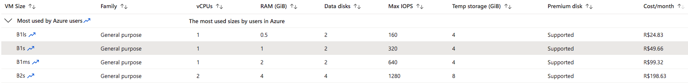
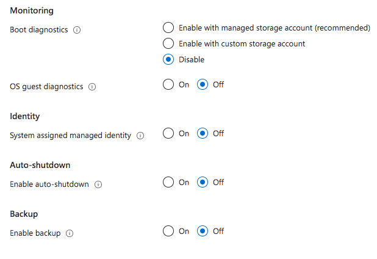
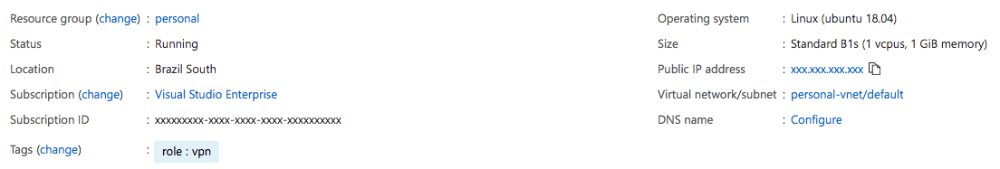
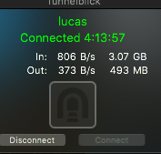

## Update - 2022!

Hey everyone! Because of the huge demand for this article I ended up making a video on my youtube channel! It makes explaining the concepts a lot easier.

But still, this article goes a lot deeper overall! So I recommend watching both to get more detail!


Don't forget to subscribe to the channel and hit like to help this knowledge reach more people!

---

Whether we're working or just browsing the Internet, one of the main questions we have is whether our network traffic is actually secure or whether we're being spied on by our own Internet providers.

Based on that, I decided to use a paid VPN a few years ago, PIA VPN, but I ended up canceling this VPN for two simple reasons:

-   After a while they stopped having Brazilian servers because of the country's internal policies regarding log retention, so the closest server was the one in the US, which added a 120ms ping to every request
-   PIA was recently acquired by an Israeli company with a track record that is, let's say... a bit shady when it comes to spying

Obviously these reasons were entirely personal, PIA is a great VPN but, for me, it stopped working. So for a while I went without any VPN until I had the idea of trying to build my own, since there weren't any other servers that didn't keep logs here in Brazil.

## Starting the process

To start the process, I began researching some tutorials and ideas on how to start building my own VPN, and putting some of them together I got a fairly quick and fairly concise process to create my own VPN and be completely sure that there's nobody spying on the logs behind it.

Here are some of the articles I used to build the VPN, some of them explain the reasoning behind everything really well, others are simply step-by-step tutorials:

-   [How to set up your own VPN server](https://www.howtogeek.com/221001/how-to-set-up-your-own-home-vpn-server/)
-   [Should you set up your own VPN?](https://www.techradar.com/news/should-you-set-up-your-own-vpn-server)
-   [How to Make Your Own VPN](https://www.youtube.com/watch?v=gxpX_mubz2A&t=5s)
-   [Setup a personal OpenVPN server](https://www.servermania.com/kb/articles/setup-personal-vpn-server/)

### Why you should build your own VPN

Like we already said in the previous paragraph, the main reason you'd want to set up your own VPN is precisely that you're in control of every log and every action inside the server. So there's no way for anyone to spy on your actions along the way.

Besides that, having your own VPN, especially for Brazilians, means that if you're using a VPN purely for security, you'll be able to access public networks, even ones without a password, without worrying about security in general, because you'll have a local server that adds very little latency to your connection. In other words, the encrypted tunnel you create between your computer and your VPN will act only as an extra layer of encryption.

Less important than that, but still worth mentioning, is the ability you'll have to let other people access your network through the same tunnel, so you can share local files or even play LAN-only games over the Internet.

### Problems with creating your own VPN

The biggest use of VPNs today is unfortunately not to protect yourself from prying eyes, but to change your geographic location so you appear to be in other countries, breaking some Geo-IP locks that some sites have, that stop you from consuming content meant for a specific country, for example.

While it's possible to create a server using cloud providers like [Azure](https://azure.microsoft.com/?WT.mc_id=cxa-0000-ludossan), which provide several virtual machines in various locations around the world, the cost of creating a VPN server in each region is still extremely high compared to the cost of hiring a ready-made VPN service, like NordVPN or TunnelBear. Although it's completely possible if you're willing to spend a few hundred reais a month.[^n1]

## Creating your own VPN

With all that said, let's move on to creating our own VPN. The first step is to create a server where we can access the VPN from the Internet. There are several ways to do this, one of them (which I'll post here as soon as I'm done) is using a RaspberryPI as a server and the No-IP service to expose it to the Internet.

Since we're going to create our own server and **we're not going to store logs**, there's no problem creating it on cloud services like Azure, so let's start by creating a server there.[^n2]

### Creating the server

To create our server, you first need to have an [Azure](https://azure.microsoft.com/?WT.mc_id=cxa-0000-ludossan) account. If it's your first time then you'll get some credits that will help you avoid paying for the server, at least for the first few months.

Once you're in the Azure portal, search at the top for "Virtual Machines", click the icon and you should land on a list of virtual machines, which will probably be empty. Click the "Add" button right below the title:


Select "Virtual Machine":


Once you select the option, we'll have a form to fill out, and it's important that you pay attention to what we're going to put in here. First, let's get an idea of how this form is divided.

The first section is general project data:


Now pay attention to what we're going to put in each field:

-   **Subscription:** this will come filled in automatically if you only have one Azure account, if not, it's the account you want to be billed to.
-   **Resource Group:** it's good practice to create a new resource group to store the VPN data, you can click the "Create New" link right below to create the new RG.
-   **Virtual Machine Name:** this is the name of your machine, here you can get creative and write whatever seems most convenient, you just need to remember it later.
-   **Region:** this is the most important part, where you're going to create your server, keep in mind that you need to consider each country's local laws, so if you want to access content available in the US, create a server in the US, if you want to download torrents, avoid countries on the [14 eyes](https://www.vpnmentor.com/blog/understanding-five-eyes-concept) list. We'll go with Brazil.
-   **Availability Options:** this field defines network redundancy, we won't need this so let's keep it as it is.
-   **Image:** we'll use Ubuntu for convenience installing the scripts and the VPN, but if you're comfortable with Linux, you can use whatever distro you want.
-   **Azure Spot Instance:** there's a category of VMs on Azure that use unused cloud capacity at a much lower price, the so-called Spot Instances, but the problem is they have no availability guarantee, and your server can be deallocated if the capacity is needed. We want the server to be as available as possible, right? So let's leave this as "No".
-   **Size:** this is where we have to decide the size of our machine. Azure gives you several different types and sizes of machines, the most common being the DS2\_V3, but that's overkill for what we want to do, so let's select the **B1s** machine instead, which has just 1 core and 1 Gb of RAM.



In the next section, we'll have the authentication settings.


Here's an important disclaimer. I'll use "password" so that everyone knows what to do when switching to SSH key access, since a password is transmitted in plain text, and can therefore be an attack vector for hackers.

What we'll do is set an initial password to log in, but the first change on the server will be to switch SSH so we can access it on a different port and also through an SSH key instead of a password.[^n3]

Lastly we have the port settings. Let's leave just one of the ports enabled, 22, which is the default SSH port:


Clicking "Next" takes us to the disks section, we won't add any new disk, we'll just switch the default disk from "Premium SSD" to "Standard HDD", since we don't need speed and the HDD is a lot cheaper:


Let's hit "Next" and skip past the network section, since we won't change anything there. In the "Management" section, let's disable all the options:



Then we click the blue "Review + Create" button at the bottom left. After a quick review of the settings, your server will be created. The process itself takes a few minutes, but once it's done you'll be able to navigate to the resource screen, and you'll see something like this:



### Securing the server

Like we mentioned earlier, accessing a security server using a password is a bit hypocritical, so let's generate our SSH keys so we can access the server securely.

If you're using Windows, open PowerShell and install OpenSSH with the following command:

```powershell
PS C:\> Add-WindowsCapability -Online -Name OpenSSH.Client*
```

If you're on Mac or Linux, just open the terminal, OpenSSH _should_ be installed by default. If it's not, look up how to install OpenSSH for your distro before continuing.

Let's use the following command to generate a key:

```bash
ssh-keygen -t rsa -b 4096
```

Press ENTER when asked where you want to save the key to save it in the default directory (which is usually `~/.ssh`), otherwise select a location where you'll have access to keep your keys (you might run into problems later if you don't put it in the default directory).[^n4]

Let's log in to the server to make the changes, for that just use the command:[^n5]

```bash
ssh usuario@ip
```

Once inside the server let's update the operating system and the whole system with the classics:

```bash
sudo apt-get update && sudo apt-get upgrade
```

Then let's install a text editor so we can edit the files we'll need, here the choice is personal, I like using **Vim**, but you can install whatever works best for you.

```bash
sudo apt-get install -y vim
```

Let's create a new non-root user so we can use it to log in:

```bash
sudo useradd -G sudo -m nomedousuario -s /bin/bash
```

Then let's set a password for this user:

```bash
passwd nomedousuario
```

Now, **don't disconnect from the SSH session on your server** and open a new local terminal, we're going to transfer our public key into the server so it can log us in.

To do that, on Linux or Mac let's run the following command:

```bash
ssh-copy-id usuario@ip
```

On Windows you'll need a different command

```powershell
type $env:USERPROFILE\.ssh\id_rsa.pub | ssh seuip "cat >> .ssh/authorized_keys"
```

Keep both terminals open, now let's restrict access for anyone using a password, and let's also change the SSH port so it's not exposed on the default port 22.

The first thing we'll do is open the file `/etc/ssh/sshd_config` on the VPN server. Let's look for the line `Port 22` and change it. I'm using port 78 here, but you can use any port you want that isn't in use by another service:

```
# Port 22
Port 78
```

In the Azure panel, let's go into the network settings to open the new port. To do that, on the VM panel, go to the sidebar and click "Networking":


You'll see a list with every open port and all the network rules for your IP, ordered by priority. Click the blue "Add inbound port rule" button:


Fill in the fields, changing "Destination port ranges" to the port number you picked, set "priority" to 100 and give this network rule a recognizable name. Save.

Let's also take the chance to open the next port we're going to use, port 443 UDP, which is used by OpenVPN to establish the connection and handle data traffic. Click the button again to add another rule:


This time, let's set "Destination port ranges" to 443 and select "protocol" as UDP, leave the priority as it is and give it a recognizable name. Now we have access open on both main ports, don't close this tab yet, we'll have to come back here in a moment.

Back on the server, let's keep editing our config file. Now let's look for `PasswordAuthentication` and disable password login:

```
PasswordAuthentication no
```

Let's also disable root login:

```
PermitRootLogin no
```

Let's save the file and restart the service with:

```bash
sudo systemctl restart sshd
```

**Don't close the terminal that's logged into the server yet**, because if we run into problems, we don't want to end up locked out, right? Open a new terminal and let's try logging into the machine with the **new user** through the new port:

```bash
ssh -i ~/.ssh/id_rsa novousuario@ip -p porta
```

If you manage to log in without typing any password, or you get a prompt to type your key's passphrase, then everything's fine. You can try a test to check whether we can also log in without a key:

```bash
ssh novousuario@ip -p porta
```

This should give you a "Permission Denied"

Now we can close the previous terminal we had logged in as root, let's go back to the Azure portal and remove the default rule allowing access to port 22 that was created. To do that, just click the three dots at the end of the corresponding row and select "Delete".

### (Optional) Creating an alias

SSH lets you create an alias to connect to the server more easily without having to type the IP, user, key and port every time. To do that, on your local machine, find the `config` file, in the `.ssh` folder inside your `$HOME` directory (or `~/.ssh`), open it with your preferred editor and create a new entry:

```
Host minhavpn # can be any name
    User novousuario # login user
    Port porta # the port you chose
    IdentityFile ~/.ssh/id_rsa # If you saved the key somewhere else, put that path here
    HostName ip # the server's IP address
```

Now you can log into the server with the command `ssh minhavpn`

This is entirely optional, you don't need to do this step if you don't want to.

## Creating the VPN

Creating the VPN is a fairly complex process, which requires you to install all the OpenVPN packages, create IPTables, configure the firewall, create the access keys and the certificates that will be used to access the address, and so on.

The whole process is very complex and it's easy to get something wrong and have to start over. So, thanks to open source, there's a GitHub user called [Nyr](https://github.com/Nyr) who created a script called [OpenVPN Road Warrior Installation](https://github.com/Nyr/openvpn-install), which is what we'll use to install it. It'll ask you a few simple questions and, most of the time, you'll just pick the default answer.

Let's install wget first on our server with:

```bash
sudo apt-get install -y wget
```

Now let's download the script into our current path (which will probably be `~`):

```bash
wget https://git.io/vpn -O openvpn-controller.sh
```

Let's give it execute permission with `chmod +x openvpn-controller.sh` and then run the script with `./openvpn-controller`.

Some important points during installation:

-   **Server port:** the default OpenVPN port is 1194 UDP, but since it's a default port, let's choose another one, in our case it's the 443 UDP we opened on Azure
-   **DNS server:** the DNS server can be whatever you prefer, I usually use `1.1.1.1` or `8.8.8.8`
-   **Client name:** this will be the name of the file you'll generate with the config, I usually separate configs per device, so if you're going to use it on a Windows computer, it could be called `VPN_WIN`

At the end of the installation process, you'll get a `.ovpn` config file. This file is the single most important one of all because it holds the access credentials for you to get into your VPN, along with the client's certificates and keys.

### Removing logs

Lastly, let's do what most VPN services don't do, which is **disable logging**.

To do that let's open the OpenVPN config file with:[^n6]

```bash
sudo vim /etc/openvpn/server/server.conf
```

Change the line that reads `verb 3` to `verb 0`, save the file and restart the service with:[^n7]

```bash
sudo systemctl restart openvpn-server@server.service
```

Now we have no logs being kept by our VPN!

### Downloading the credentials

By default the script puts the file in the root directory (because it needs to be run as an administrator), so let's move the file to our own directory and change the owner so we can edit it:

```bash
sudo mv /root/nomedoarquivo.ovpn ~
sudo chown novousuario nomedoarquivo.ovpn
```

Now let's download the file. To do that, go to a local terminal and open an `sftp` connection to your VPN server with the command `sftp minhavpn` (or whatever name you gave your alias), then run the following commands:[^n8]

```sftp
get nomedoarquivo.ovpn pasta/de/destino
exit
```

Now your file is on your local machine and the VPN is installed, it's time to test it!

## Testing the VPN

To test the VPN, if you're on a Mac and want all your traffic to go through your VPN, which is what I do, you'll need a free piece of software called [TunnelBlick](https://tunnelblick.net/).



Just download the software and double click on the `.ovpn` file you downloaded and it'll get imported into the system. From there you can use the VPN like any other.

If you're on Windows or any other device (even iOS, Android and the like) you'll need [OpenVPN Connect](https://openvpn.net/client-connect-vpn-for-windows/), and from there the setup is the same, just double click the file to import it. If that doesn't work, both programs have an import button.

## Managing the VPN

From the first installation you'll already have the full connection script, but something I noticed is that using the same script for all your devices ends up being bad because the VPN doesn't seem to handle traffic coming from the same client very well, so the solution is to create a new client for each device you use.

To do that you can access the VPN server again and run the same command you used to install the VPN, meaning we use the same install script because it's smart enough to know when it's already installed and when you're just looking to manage it.

Just run `sudo ./openvpn-controller.sh` (or whatever name you gave the file) and it'll show a list of possible commands:


In there you can add new clients to give other people the ability to connect to your VPN or to add new devices to it. Just like you can also revoke an existing client and remove the VPN entirely.

## Conclusion

This article ended up a bit long, but it has everything you need to create your own VPN! In the next articles I'll show how you can further increase your server's security with Two-Factor Authentication and also add automatic upgrades to keep the system always up to date.

Stay tuned for the next chapters!

[^n1]: You can also create several servers and leave them deallocated (stopped), which uses a lot fewer resources and costs a lot less, turning the server on only when you're going to use it or scheduling an automatic shutdown.

[^n2]: You can use other cloud services too, like DigitalOcean, Linode or whatever you feel most comfortable using.

[^n3]: If you're already familiar with SSH login methods and already know how to make the change, you can check "SSH Public Key" to avoid redoing this work.

[^n4]: You'll be asked for a passphrase for your key, it's completely optional, but it adds an extra layer of security, feel free to add one if you want.

[^n5]: Remember that the user is the same user you set when you created the server, and the IP is the public IP address that shows up as a link on your VM panel in Azure.

[^n6]: Remember `vim` can be any editor.

[^n7]: The service name might be a bit different depending on the machine you installed OpenVPN on and its version, so you might need to find the service name to restart it.

[^n8]: Keep in mind you can access it through other means too, sftp is just one of them, but you can use `scp` or even SFTP clients like FileZilla.
