In the first article of this series we talked about some basic cryptography concepts. Now that we know those, let's move into one of the most common topics for devs in general: **Asymmetric Cryptography**.

So here I'm going to try to go deep on the subject, and we're going to build our own keys and implement the algorithm from scratch! This one's going to be a long article, but a deep one.

You might have heard of _Asymmetric-Key/Public-key Cryptosystems_, which is the umbrella under which several algorithms live, like RSA, Diffie-Hellman, ElGamal, and so on. These systems offer several kinds of services, but all of them use public key systems:

-   Key pair generation
-   Data encryption/decryption
-   Digital signatures
-   Key exchange mechanisms

So today we're going to talk about what these systems are, but mainly about one specific algorithm: RSA.

## Asymmetric Keys

Asymmetric Cryptography is one of the most common cryptography models in tech. For example, to open this blog you used HTTPS, which is HTTP running on top of another security protocol called [TLS](https://en.wikipedia.org/wiki/Transport_Layer_Security) (_T_ransport _L_ayer _S_ecurity). This protocol uses asymmetric cryptography.

> [!NOTE] 💡
> We'll talk about symmetric cryptography in the next part of the series

As the name says, it's a cryptography model that isn't identical on both sides, where the two sides are **the sender and the receiver**. When we talk about symmetric cryptography, for example, both the receiver and the sender of the message have the same key. That's not true for asymmetric cryptography.

In this cryptographic system, we always have a component that's known only to the owner of the key. This component is called the **private value**, and it's the value used to build a **private key**. Another component present is the **mixed component**, which is known both by the sender (the owner of the key) and the receiver of the message. The mixed component is what gets used to _derive_ the public key from the private key.

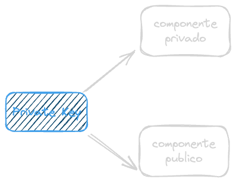

Optionally, these systems can also have a public value used to generate **public keys**, private keys, or both (Diffie-Hellman, for example, has a public value used to generate the private key).

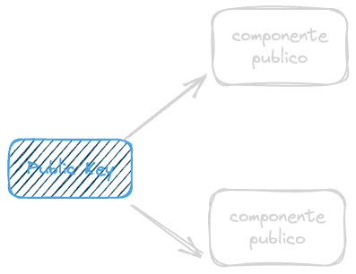

The output of an asymmetric cryptography system is a **key pair**. Does that word sound familiar? It should, because a lot of what we use on the Internet, or even off it, uses a key pair. For example, your WhatsApp messages have the famous "end-to-end encryption". Well, that encryption is probably asymmetric, and you're the owner of the private key.

But what are these keys, anyway?

### Public keys

These are the public parts of asymmetric cryptography. The public key encrypts messages that can only be decrypted by its private counterpart. You'll see it called **Pk**, for _Public Key_.

Public keys are derived from private keys through a mathematical property called inversion, so the keys aren't equal to each other, but they can produce values that can be decrypted by the private key. However, public keys can't decrypt data encrypted by other public keys, because they aren't derived from those keys, only from the private key.

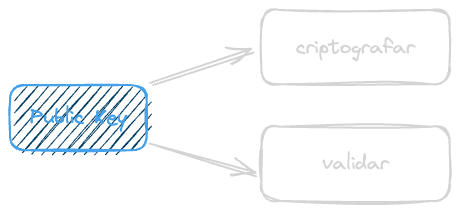

Calculating the private key from the public key is computationally infeasible by definition.

So, to sum it up, the public key is known by everyone and is used to encrypt messages. If you want to send me a message, you encrypt it using **my** public key.

### Private keys

The private key (commonly called **Sk**, for _Secret Key_) is a key generated from at least two private components (in RSA's case, very large prime numbers) that are only known by the person who owns the key. This premise guarantees that:

1.  The key belongs to a person, so the origin of the data is validated
2.  Nobody else has access to that key, so it can be used as a signing mechanism (which we'll cover in another article)

> [!CAUTION] 👀
> In this section we'll talk about the private key in general terms. Further down we'll talk about it in the context of the RSA algorithm specifically

Private keys are used to **decrypt** data encrypted by the public key, or to **sign** data that can later be validated by the public key.<Sidenote>Asymmetric cryptography is a **cryptographic system** (_cryptosystem_) that gets implemented by several algorithms. **One of them** is RSA, but it's not the only one, so there are several different implementations of private keys, but they'll all share the same properties.</Sidenote> **It's not advisable to encrypt data using the private key**, because any public key can decrypt that data. That's exactly why these keys are called **signers** (we'll get into the concept of signatures in the other articles).

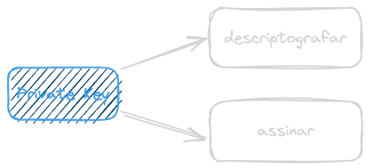

To sum it up, the private key is the opposite of the public one: it decrypts data. So that message you sent me, encrypted with my Pk, gets decrypted using my Sk.

The private key **must be known only by its owner**, hence the name. And from it, it's possible to derive several public keys. But how is that possible?

### What does encrypting mean?

When we talk about digital cryptography, we're not talking about text anymore, we're talking about numbers. So "encrypting" something with a public key, or "decrypting" something with the private key, are just mathematical operations we run using a key.

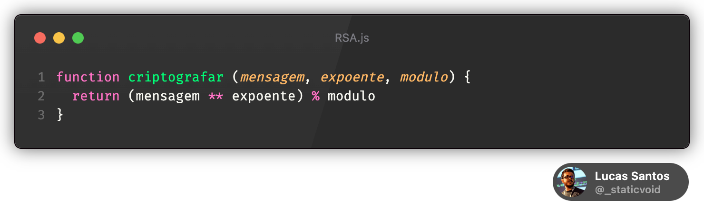

Since we haven't discussed what the keys actually are yet, I'll leave the deeper explanation for our RSA section. But that's the idea: take a number, raise it to another number, divide by yet another number, and the remainder of that division is the encrypted message (keep reading to find out what those numbers are).

## Derivation and inversion

When we say a public key can be derived from a private key (we'll see how to do that soon), we're saying that both the public key and the **Sk** are mathematically connected.

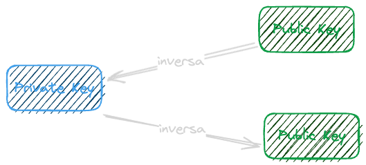

The public key is the inverse of the private key (and, therefore, the private key is also the inverse of the public one), and that means something encrypted with a public key can be decrypted by the private key.

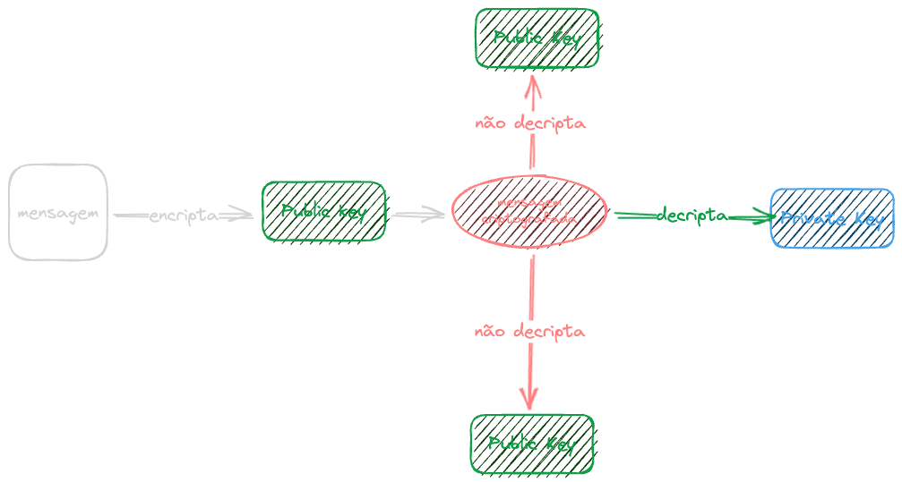

The same way, anything encrypted with the private key can be decrypted by any public key. But something encrypted with a public key **can't** be decrypted by another public key, and that's exactly what makes asymmetric cryptography so powerful.

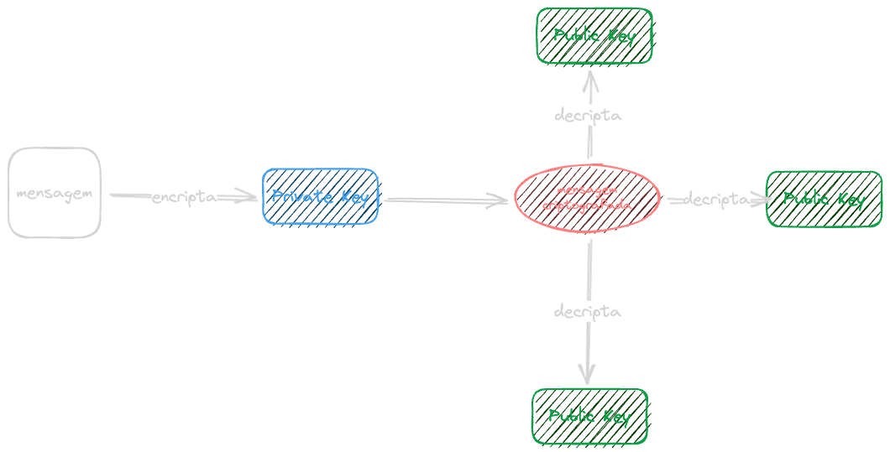

In RSA's case, we're talking about keys connected through [modular exponentiation](https://en.wikipedia.org/wiki/Modular_exponentiation), and it's exactly this criterion that makes asymmetric cryptography interesting.

### Modular exponentiation

I won't extend myself on this topic, since it's not our main theme (this paragraph is more of a curiosity than a requirement), but modular exponentiation is a power operation (exponentiation) over a modulus (yes, the remainder of dividing one number by another, like `a % b`, called [modular arithmetic](https://en.wikipedia.org/wiki/Modular_arithmetic), another topic for another time).

Modular exponentiation is when we take the remainder of some number _b_ (a base), raised to a number _x_ (exponent), divided by a positive integer _m_ (the modulus), and all of this is represented like this:

$C = b^x\mod{m}$

And C is a number that will always sit between `0` and `m`. For example, if the base is 5, the exponent is 2, and the modulus is 3:

$C = b^x\mod{m} \newline C = 5^2\mod{3} \newline C = 25\mod{3} \newline C = 1$

The result C is 1 because `25/3` is `8` with a remainder of `1`. And the great advantage of this whole system is that modular exponentiation is very efficient to compute, even for very large numbers, but computing the inverse of this operation (the [discrete logarithm](https://en.wikipedia.org/wiki/Discrete_logarithm)), meaning finding `x` when you have `b`, `C`, and `m`, is a hard operation, especially if you use prime numbers.

Using this math, it's possible to create a value that, like a clock, does a _wrap around_. That is, when it reaches a certain number, it goes back to 0 (the same way `a % b` in programming always sits between `0` and `b-1`).

## Asymmetric Encryption Schemes

Asymmetric cryptography is much more complex and can be up to 1000x slower than symmetric algorithms (like AES). That's why asymmetric algorithms (like RSA) aren't used all the time on their own, but combined with symmetric cryptography. Combining these two systems produces several techniques called _asymmetric encryption schemes_.

How do these systems get used at the same time? One of the encryption schemes is called **KEM (Key Encapsulation Mechanism)**, which basically consists of encrypting a key with another key:

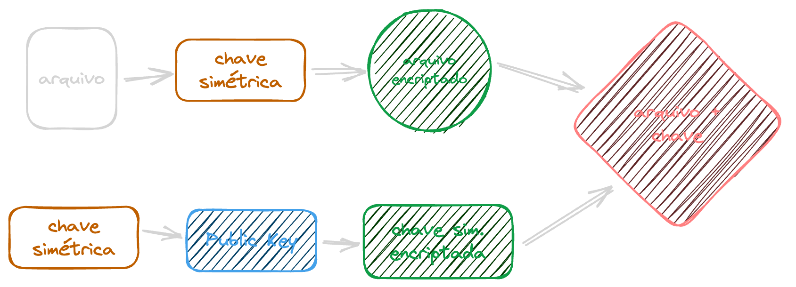

Here we're using a symmetric key (much lighter) to encrypt a document and generate a **DEM Block.** Then we're encrypting the symmetric key we used with a user's public key, creating what's called a **KEM Block**. So far, it's just one key encrypting another key.

Then we join the two together and send them to our recipient. This way, even if the document gets intercepted, the key can't be recovered, because it was encrypted with the public key. The user who receives the file can decrypt it like this:

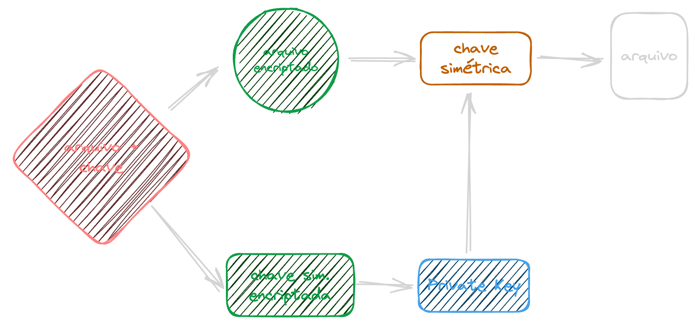

We take the DEM block, split it into key and file, decrypt the symmetric key using the private key, get back the original symmetric key, and use it to decrypt the encrypted file.<Sidenote>The HTTPS protocol works "roughly" like this.</Sidenote>

## RSA

Now that we understand a lot about asymmetric cryptography, let's finally talk about RSA!

RSA stands for **Rivest-Shamir-Adleman**, and it's an encryption algorithm used to encrypt information, one of the oldest still in use today. Created by Ron Rivest, Adi Shamir, and Leonard Adleman in 1977. As we mentioned before, RSA is a relatively slow algorithm, so it's not used to encrypt large volumes of data, but rather symmetric keys.

RSA generates key pairs with sizes between 1024 and 65536 bits, which can encrypt a message (an integer between 0 and the key size), decrypt using the private key, generate signatures, and exchange keys, although that last one isn't really its main use.

Key points:

-   A good key is generally somewhere between 1024 and 4096 bits
-   The bigger the key (more bits), the more computation time is needed
-   Very large keys (like 65536 bits) are **very secure**, but too slow for practical use, since they can take hours to generate
-   Any key above 3072 bits is considered secure<Sidenote>When we talk about keys here, we're talking about numbers, nothing more. It's like a password, except it has 1234 digits (`2^4096`).</Sidenote>

When we're "encrypting" something, we're applying an exponentiation operation between the key and the value we want to encrypt.

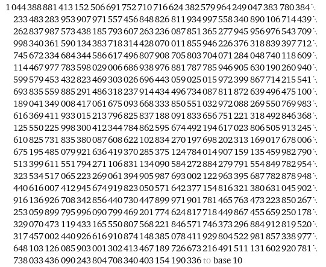

RSA's public and private keys derive from two prime numbers we call `p` and `q`. These numbers are RSA's private components. That's where the security comes from.

When we use RSA, we calculate a number `n`, called the _modulus_ (there are many moduli, so don't confuse this one with the _modulus_ operation we talked about above). The thing is, it's relatively easy to find primes, but it's **extremely hard** to factor a number into its components.

A simple example: which numbers, and how many times, do we need to multiply two prime numbers x and y to get to 216? Factoring this small number takes 7 steps:

$216 = 2\times108\newline 108 = 2\times54\newline 216 = 2\times2\times54\newline 54 = 2\times27 \therefore 216 = 2\times2\times2\times27\newline 216=2\times2\times2\times3\times9\newline 216= 2\times2\times2\times3\times3\times3\newline 216=2^3\times3^3$

And that's a simple number, 9 bits (`100000000`), and it still takes all that work. Now imagine that for a composite number made of two very large primes with more than 3000 bits.

> [!WARNING] 💡
> This is exactly why so many people are worried about quantum computers' ability to break RSA, because in theory they could factor numbers much faster

## Keys in RSA

RSA keys get calculated using a few components. We've already talked about three of them so far, but let me go over them again so we can keep them straight, and I'll throw in a few more non-trivial terms while I'm at it:

1.  `p` and `q` are the **private** components. They need to be two very large prime numbers, and the bigger and further apart they are from each other, the better.
2.  `n` is the **modulus**, the multiplication of `p` by `q`: `n = p*q`. This number is **public**.
3.  `e` is the **public exponent**, which is smaller and [coprime](https://en.wikipedia.org/wiki/Coprime) with the totient of `n`, and greater than 2. This number is usually _65537_, because it's easy to represent in hex (`0x010001`).
4.  `d` is called the **private exponent** and is built from the [modular multiplicative inverse](https://en.wikipedia.org/wiki/Modular_multiplicative_inverse) between `e` and the [Carmichael totient](https://en.wikipedia.org/wiki/Carmichael_function).

That list wasn't easy to read 🤣. But let's break these steps down by generating our own keys by hand. First, though, let's explain a concept we started talking about earlier.

### What does encrypting mean? (in RSA)

We know encrypting is a mathematical operation, but what does it actually look like?

Well, a public key isn't just one number, it's made up of two numbers, so you'll usually see a key written like this:

-   `Pk = {n, e}`
-   `Sk = {n, d}`

That means the public key is made up of our modulus `n` and the public exponent `e`. Here's an example of what a key might look like (taken from [this awesome book](https://cryptobook.nakov.com/asymmetric-key-ciphers/the-rsa-cryptosystem-concepts#rsa-public-key-example)):

```ini
n = 0xa709e2f84ac0e21eb0caa018cf7f697f774e96f8115fc2359e9cf60b1dd8d4048d974cdf8422bef6be3c162b04b916f7ea2133f0e3e4e0eee164859bd9c1e0ef0357c142f4f633b4add4aab86c8f8895cd33fbf4e024d9a3ad6be6267570b4a72d2c34354e0139e74ada665a16a2611490debb8e131a6cffc7ef25e74240803dd71a4fcd953c988111b0aa9bbc4c57024fc5e8c4462ad9049c7f1abed859c63455fa6d58b5cc34a3d3206ff74b9e96c336dbacf0cdd18ed0c66796ce00ab07f36b24cbe3342523fd8215a8e77f89e86a08db911f237459388dee642dae7cb2644a03e71ed5c6fa5077cf4090fafa556048b536b879a88f628698f0c7b420c4b7
e = 0x010001
```

While the private key is made up of our modulus and the private exponent `d`:

```ini
n = 0xa709e2f84ac0e21eb0caa018cf7f697f774e96f8115fc2359e9cf60b1dd8d4048d974cdf8422bef6be3c162b04b916f7ea2133f0e3e4e0eee164859bd9c1e0ef0357c142f4f633b4add4aab86c8f8895cd33fbf4e024d9a3ad6be6267570b4a72d2c34354e0139e74ada665a16a2611490debb8e131a6cffc7ef25e74240803dd71a4fcd953c988111b0aa9bbc4c57024fc5e8c4462ad9049c7f1abed859c63455fa6d58b5cc34a3d3206ff74b9e96c336dbacf0cdd18ed0c66796ce00ab07f36b24cbe3342523fd8215a8e77f89e86a08db911f237459388dee642dae7cb2644a03e71ed5c6fa5077cf4090fafa556048b536b879a88f628698f0c7b420c4b7
d = 0x10f22727e552e2c86ba06d7ed6de28326eef76d0128327cd64c5566368fdc1a9f740ad8dd221419a5550fc8c14b33fa9f058b9fa4044775aaf5c66a999a7da4d4fdb8141c25ee5294ea6a54331d045f25c9a5f7f47960acbae20fa27ab5669c80eaf235a1d0b1c22b8d750a191c0f0c9b3561aaa4934847101343920d84f24334d3af05fede0e355911c7db8b8de3bf435907c855c3d7eeede4f148df830b43dd360b43692239ac10e566f138fb4b30fb1af0603cfcf0cd8adf4349a0d0b93bf89804e7c2e24ca7615e51af66dccfdb71a1204e2107abbee4259f2cac917fafe3b029baf13c4dde7923c47ee3fec248390203a384b9eb773c154540c5196bce1
```

So, "encrypting" a message is nothing more than applying the following formula:

$encrypted = plain^e \mod n$

Let's say our message is `42`:

1.  We raise 42 to `e`, let's say `e` is 7
2.  `42` raised to 7 is `230 539 333 248`
3.  Now we divide by `n`, let's say `n` is 3977
4.  The result is `57 968 150,1755091778`, but we don't want the result, we want the remainder! Which is `698`, **that's our encrypted message**

You send me that message, I receive `698`, and now I need to decrypt it. To do that I can run the same operation, only with my own values, using `d` instead of `e`:

$plain = encrypted^d \mod n$

1.  Raise 698 to `d`, let's say `d` is 343
2.  That gives me a number [with 976 digits](https://www.wolframalpha.com/input?i=698%5E343)
3.  Which I now divide by `3977` and take the remainder
4.  Which gives us back [the message 42](https://www.wolframalpha.com/input?i=%28698%5E343%29+mod+3977)

Choosing these numbers wasn't arbitrary. There are a few [rules that need to be followed](https://en.wikipedia.org/wiki/RSA_\(cryptosystem\)#Key_generation) and some non-trivial math involved, but as I promised, we're going to explore that in the next chapter.

## Creating keys

To generate a real key pair, we're going to use TypeScript so we can do the math operations.

### Defining primes

First, we need to define a few numbers, starting with our two primes. They're the simplest part. The only rule is that they need to be large and far apart, but to make our math easier I'm going to use small 12-bit prime numbers.

That means we can encrypt messages up to 12 bits, meaning numbers up to 4096.

-   We take `p` as `41`
-   We take `q` as `97`

The next step is defining the modulus, which is the multiplication of `q` by `p`, so:

-   `n` is `p*q`, which is `41*97=3977`. Now we have the first value you saw back in step 3 above (try factoring 3977 to get back to its primes, how many steps did it take?)<Sidenote>Remember that `p` and `q` are private and can't be shared, while `n` is public.</Sidenote>

So far we have this:

```ts
const p = 41
const q = 97
const n = p*q
```

### Defining the exponents

Defining the exponents is more of a pain. We're going to need an intermediate step: defining the totient of `n`.

This can be done through the Carmichael function (expressed by the letter Lambda, _`λ(n)`_) or through the [Euler totient](https://en.wikipedia.org/wiki/Euler%27s_totient_function) (expressed by the letter Phi, `_φ_(n)`), which is considerably simpler, but produces bigger `e` and `d`, so the math gets more complicated.

I'm not a mathematician, so I won't overcomplicate things here. To solve `_λ(n)_` we need to find the least common multiple between `p-1` and `q-1`, which can be done using the [Euclidean algorithm](https://en.wikipedia.org/wiki/Euclidean_algorithm):

$\lambda({n}) = \frac{|(p-1)(q-1)|}{mdc((p-1),(q-1))}$

Where `mdc` is the greatest common divisor between `p-1` and `q-1`, so our math becomes:

$\lambda({3977}) = \frac{|40\times96|}{mdc(40,96)}$

JS doesn't have a built-in function to calculate the GCD, so let's code one quickly using the Euclidean algorithm. We can apply it recursively:

```ts
function mdc (a: number, b: number) {
  if (b === 0) return a
  return mdc(Math.abs(b), Math.abs(a)%Math.abs(b))
}
```

But that's slower, especially for large numbers, so let's apply it iteratively instead:

```ts
function mdc(a: number, b: number) {
  let absA = Math.abs(a)
  let absB = Math.abs(b)

  while (absB) {
    ;[absB, absA] = [absA % absB, absB]
  }

  return absA
}
```

Now we can calculate _`λ(n)`_, which is going to be:

```ts
function mdc(a: number, b: number) {
  let absA = Math.abs(a)
  let absB = Math.abs(b)

  while (absB) {
    ;[absB, absA] = [absA % absB, absB]
  }

  return absA
}

const p = 41
const q = 97
const n = p * q // 3977
const lambdaN = Math.abs((p-1)*(q-1))/mdc(p - 1, q - 1) // 480
```

With these numbers we can calculate `d` and `e`. Let's do `e` first, since `d` depends on it.

`e` needs to be a small number, but it also needs to be greater than 2 and smaller than _`λ(n)`_, so we can't use 65537, because our `_λ(n)_` is 8. Also, the GCD between `e` and _`λ(n)`_ must be 1, so let's write a function to calculate this:

```ts
function publicExponent (lambdaN: number) {
  let e = 2
  while (mdc(e, lambdaN) !== 1 || e < lambdaN) {
    e++
  }
  return e
}
```

In our case, `e` ends up being 7, a small number. So here's what we have so far:

```ts
function mdc(a: number, b: number) {
  let absA = Math.abs(a)
  let absB = Math.abs(b)

  while (absB) {
    ;[absB, absA] = [absA % absB, absB]
  }

  return absA
}

function publicExponent (lambdaN: number) {
  let e = 2
  while (mdc(e, lambdaN) !== 1 && e < lambdaN) {
    e++
  }
  return e
}

const p = 41
const q = 97
const n = p * q // 3977
const lambdaN = Math.abs((p-1)*(q-1))/mdc(p - 1, q - 1) // 480
const e = publicExponent(lambdaN) // 7
```

Now let's calculate `d`, which needs to be a modular multiplicative inverse of `e`. In other words, we need to calculate this:

$d \equiv e^{-1}(\mod(\lambda{n}))$

That means `d` is a number that, when multiplied by `e`, gives us a result that's `1 mod(λ(n))`.

To calculate this value, we can modify our GCD to use the [extended algorithm](https://en.wikipedia.org/wiki/Extended_Euclidean_algorithm), which computes not just the two divisors, but also two coefficients called `x` and `y`, satisfying an identity called [Bézout's identity](https://en.wikipedia.org/wiki/B%C3%A9zout%27s_identity).

> This identity says that, for every GCD, there are two numbers (called coefficients) that can be used as multipliers in a linear function `ax + by = mdc(a, b)`. In other words, the greatest common divisor between `a` and `b` can be expressed as a function of those same parameters. Our `d` is one of these coefficients.

Let's modify the code to reflect this, following [this implementation](https://en.wikipedia.org/wiki/Extended_Euclidean_algorithm#pseudocode):

```ts
function mdc(a: number, b: number) {
  let [absA, absB] = [Math.abs(a), Math.abs(b)]
  let [prevX, x] = [1, 0]
  let [prevY, y] = [0, 1]

  while (absB) {
    const q = Math.floor(absA / absB)
    ;[absB, absA] = [absA % absB, absB]
    ;[x, prevX] = [prevX - q * x, x]
    ;[y, prevY] = [prevY - q * y, y]
  }

  return {
    mdc: absA,
    x: prevX,
    y: prevY
  }
}
```

To make this work, we also need to update the rest of the code to handle the function's new object return, and now let's create our modular inverse function too. Here's how it all looks in the end:

```ts
function mdc(a: number, b: number) {
  let [absA, absB] = [Math.abs(a), Math.abs(b)]
  let [prevX, x] = [1, 0]
  let [prevY, y] = [0, 1]

  while (absB) {
    const q = Math.floor(absA / absB)
    ;[absB, absA] = [absA % absB, absB]
    ;[x, prevX] = [prevX - q * x, x]
    ;[y, prevY] = [prevY - q * y, y]
  }

  return {
    mdc: absA,
    x: prevX,
    y: prevY
  }
}

function modInverse(e: number, m: number) {
  const result = mdc(e, m)
  if (result.mdc !== 1) {
    throw new Error('modular inverse does not exist')
  }
  return ((result.x % m) + m) % m
}

function publicExponent(lambdaN: number) {
  let e = 2
  while (mdc(e, lambdaN).mdc !== 1 && e < lambdaN) {
    e++
  }
  return e
}

const p = 41
const q = 97
const n = p * q // 3977
const lambdaN = Math.abs((p-1)*(q-1))/mdc(p - 1, q - 1).mdc // 480
const e = publicExponent(lambdaN) // 7
const d = modInverse(e, lambdaN) // 343
```

Notice that our `d` is our `x` from the modular function. What we're doing is taking the remainder of `x` divided by `λ(n)`, then adding `λ(n)` to make sure the result is positive, and taking the remainder by `λ(n)` again to keep the value between 0 and `λ(n)-1`.

Now that we have `d`, `e`, and `n`, we don't need `p`, `q`, or `λ(n)` anymore. `d` needs to stay **private**.

Let's write a function to encrypt and decrypt our data. Since it's the same operation, we're just going to swap the values we pass in.

### Encrypting by hand

The final encryption function is pretty simple:

```ts
function encrypt(message: number, exponent: number, mod: number) {
  return (message ** exponent) % mod
}
```

And we can run a test!

```ts
const message = 42
const encrypted = encrypt(message, e, n) // 698
const decrypted = encrypt(encrypted, d, n) // NaN
```

Whoa! What happened here? Why are we getting a `NaN`? If we go back a bit in the process, we'll see that decryption is much more complex, because we're raising a message to a large `d`, so our message goes past the 52 bits JavaScript can store in memory. To fix this, we'll need to use BigInts!

Our encryption function becomes this, right?

```ts
function encrypt(message: number|bigint, exponent: number, mod: number) {
  return (message**exponent) % BigInt(mod)
}
```

Wrong! BigInts don't support the `**` operator, because it tries converting to `number` in the end. We'll have to write our own exponentiation function, which is pretty simple: we just need to iterate over the exponent and multiply repeatedly:

```ts
function bigIntPower(base: number|bigint, exponent: number) {
  let result = 1n
  const bigBase = BigInt(base)
  for (let i = 0; i < exponent; i++) {
    result *= bigBase
  }
  return result
}
```

Now we can use it inside our encryption function:

```ts
function encrypt(message: number|bigint, exponent: number, mod: number) {
  return bigIntPower(message, exponent) % BigInt(mod)
}
```

Now we're talking!

```ts
const message = 42
const encrypted = encrypt(message, e, n) // 698n
const decrypted = encrypt(encrypted, d, n) // 42n
```

To wrap up this part, we can create a nice little keyset object:

```ts
type Key = { exp: number, mod: number }
const publicKey = { exp: e, mod: n }
const privateKey = { exp: d, mod: n }
```

And then we update the encryption function to accept a key:

```ts
function encrypt(message: number|bigint, key: Key) {
  return bigIntPower(message, key.exp) % BigInt(key.mod)
}
```

And we end up with this final code (check it out in the [gist](https://gist.github.com/khaosdoctor/aa2995b56caabf13f086ef6ee44efd6e)):

```ts
/**
 * Calculates the power of a bigInt
 * JS doesn't support integers larger than 2^53-1
 * and BigInts can't be used with the ** operator, which is why
 * this function was created
 */
function bigIntPower(base: number|bigint, exponent: number) {
  let result = 1n
  const bigBase = BigInt(base)
  for (let i = 0; i < exponent; i++) {
    result *= bigBase
  }
  return result
}

/** 
 * Calculates the GCD of two numbers and the Bézout coefficients
 * using the extended Euclidean algorithm
 */
function mdc(a: number, b: number) {
  let [absA, absB] = [Math.abs(a), Math.abs(b)]
  let [prevX, x] = [1, 0]
  let [prevY, y] = [0, 1]

  while (absB) {
    const q = Math.floor(absA / absB)
    ;[absB, absA] = [absA % absB, absB]
    ;[x, prevX] = [prevX - q * x, x]
    ;[y, prevY] = [prevY - q * y, y]
  }

  return {
    mdc: absA,
    x: prevX,
    y: prevY
  }
}

/**
 * Calculates the modular inverse of a number
 */
function modInverse(e: number, m: number) {
  const result = mdc(e, m)
  if (result.mdc !== 1) {
    throw new Error('modular inverse does not exist')
  }
  return ((result.x % m) + m) % m
}

/**
 * Calculates the public exponent of an RSA key
 */
function publicExponent(lambdaN: number) {
  let e = 2
  while (mdc(e, lambdaN).mdc !== 1 && e < lambdaN) {
    e++
  }
  return e
}

/**
 * Encrypts/decrypts a message using the RSA key
 */
function encrypt(message: number|bigint, key: Key) {
  return bigIntPower(message, key.exp) % BigInt(key.mod)
}

const p = 41 // small prime number p
const q = 97 // small prime number q
const n = p * q // modulus n = 3977
const lambdaN = Math.abs((p-1)*(q-1))/mdc(p - 1, q - 1).mdc // Carmichael totient = 480
const e = publicExponent(lambdaN) // public exponent 7
const d = modInverse(e, lambdaN) // private exponent 343

// Keys
type Key = { exp: number, mod: number }
const publicKey = { exp: e, mod: n }
const privateKey = { exp: d, mod: n }

// Usage example
const message = 42
const encrypted = encrypt(message, publicKey) // 698n
const decrypted = encrypt(encrypted, privateKey) // 42n -> original message
```

### Euler variation

If you read all the way down here, congrats, that wasn't easy! But I wanted to show you just one more thing. Remember when I mentioned we could use the Euler totient instead of the Carmichael totient, and that it's a lot simpler?

Well, we're actually already using that totient. The Euler totient (`φ(n)`) is defined as the multiplication of `p-1` by `q-1`. That's our function today:

```ts
const lambdaN = Math.abs((p-1)*(q-1))/mdc(p - 1, q - 1).mdc
```

Written a bit more nicely as math:

$\lambda{n} = \frac{|(p-1)*(q-1)|}{mdc(p-1, q-1)}$

Look at the numerator there, that's φ right there. So if we remove the second part (the division), we won't see any change in the result:

```ts
const lambdaN = Math.abs((p-1)*(q-1))

// ... the rest of the code here

const message = 42
const encrypted = encrypt(message, publicKey) // 698n
const decrypted = encrypt(encrypted, privateKey) // 42n -> original message
```

So what changes then? `φ(n)` is a lot bigger than `λ(n)`. While `λ(n)` is 480, `φ(n)` is 3840. This affects performance: remember we're doing one iteration per value inside the GCD function, and the bigger the number, the more iterations we need. So keeping the numbers smaller is better!

Either way, you can check out the variation [here](https://gist.github.com/khaosdoctor/549d1a62e840974e8cd75518d1826273).

## Conclusion

This was one of the biggest posts I've ever written, but I think it was well worth it. We went deep into what RSA is and how it works, built two keys by hand, and tested manual encryption. So, what's next?

To encrypt text or any other non-numeric value, you need to convert that message into a number between 0 and the size of your key. In our case we used a small key, but if the value goes past your key's size, you'll run into an encryption problem. You can convert any string into a binary value and use the same functions!

The code for both implementations is [here](https://gist.github.com/khaosdoctor/aa2995b56caabf13f086ef6ee44efd6e) and [here](https://gist.github.com/khaosdoctor/549d1a62e840974e8cd75518d1826273), and I'll see you in the next stop, with symmetric keys!

See you around!
