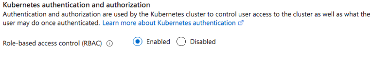

No [último artigo](/criando-e-gerenciando-usuarios-no-kubernetes/), conversamos sobre como podemos criar usuários no Kubernetes para que não tenhamos mais o problema de todo mundo ter o mesmo grau de acesso em todos os namespaces. Porém, não chegamos a elaborar sobre como podemos, de fato, dar essas permissões.

Vamos entender um pouco mais sobre como funciona o RBAC (Role Based Access Control) e como podemos tirar vantagem disso para podermos usar nosso cluster com mais segurança.

## RBAC

O Kubernetes suporta vários métodos de autorização, o mais famoso deles, de longe, é o RBAC que significa **Role Based Access Control**. Basicamente o que o RBAC faz é limitar o acesso a recursos do cluster através de quatro _resources_ do Kubernetes: **Roles**, **RoleBindings**, **ClusterRoles** e **ClusterRoleBindings**.

Ter um acesso baseado em Roles ao invés de um acesso baseado em perfis permite que você compartilhe esses Roles com vários usuários, distribuindo as permissões ao longo do cluster para que todos possam ter o acesso correto quando precisam. Um caso de uso básico desse modelo é permitir, por exemplo, que coordenadores e gerentes de áreas possam ter acesso aos seus próprios namespaces para gerenciar seus próprios funcionários, evitando assim que haja uma escalação de problemas para a equipe de operação do cluster.

Para criar esses acessos, vamos utilizar um grupo de APIs muito especial no Kubernetes, o `rbac.authorization.k8s.io`. Isso significa que você pode criar e configurar essas políticas de acesso dinamicamente através da API do Kubernetes e do `kubectl`.

A maioria dos clusters já vem com o RBAC ativado por padrão, porém é possível iniciar um novo `kube-apiserver` com a flag `--authorization-mode=RBAC` em casos de clusters manuais e, no caso da Azure, você pode habilitar o RBAC em um cluster AKS diretamente do portal:



### Nomenclaturas

No RBAC, usuários são chamados de _**subjects**_, as APIs e recursos que os usuários poderão ou não ter acesso são chamados de **_resources_**. Temos também os _**verbs**_, que são as ações e operações que podem ser executadas em um **_resource_** por um **_subject_**.

> Os verbos são basicamente as chamadas que podem ser feitas pelo usuário a um determinado recurso. Por exemplo, a criação de um Pod é um **verb** `create` sobre um **resource** `Pod` feito pelo usuário.

## Roles e ClusterRoles

A base de todas as políticas de acesso do RBAC é um objeto nativo chamado **Role**. Os **Roles** são as regras que definem o acesso a um **resource**, ou seja, eles não são as regras _aplicadas_ a um **subject** mas sim o conjunto de regras que pode ser reutilizado para vários usuários.

Além dos Roles, existem os **ClusterRoles** que, da mesma forma que os Roles, são regras de acesso para um ou mais **resources**, porém, enquanto o objeto Role é limitado ao seu próprio namespace, o ClusterRole é aplicado para todo o cluster, independente do namespace onde ele esteja. Isso permite que você defina políticas globais que são aplicadas para todo o cluster, e a definição de políticas que são aplicadas a recursos do Kubernetes que não dependem de namespaces, como os Nodes.

Existem algumas regras importantes para saber antes de começarmos a colocar a mão na massa:

-   Não existem regras para "negar" o acesso de um usuário a um recurso. Como já falamos antes, assim como os Ingresses, o Kubernetes trabalha em um modelo `deny-all`, ou seja, todas as permissões são negadas por padrão e tudo que você criar será uma exceção à lista de negação.
-   Roles **sempre** dependem de um namespace, então quando você cria um novo Role, você precisa setar qual é o namespace ao qual ele pertence.
-   De forma oposta, os ClusterRoles não precisam de um namespace porque eles estão acima dessa separação.

## Definindo nossas permissões

No [artigo anterior](/criando-e-gerenciando-usuarios-no-kubernetes/) criamos um usuário chamado Lucas, que faz parte da equipe de desenvolvimento, vamos imaginar que também criamos outros usuários no sistema para completar nosso time:

-   Ana, que é a coordenadora da área de desenvolvimento (líder do grupo `devs`, do qual Lucas faz parte)
-   Thiago, que é o gerente da área de BI (líder do grupo `bi`)
-   Fernanda, que é uma analista de BI (parte do grupo `bi`)
-   Amanda, que é uma das coordenadoras da área de DevOps e uma das operadoras do cluster responsável por manter vários projetos de desenvolvimento. (parte dos grupos `devs` e `devops`)

Para criarmos nosso cenário, vamos imaginar que Lucas trabalha em um dos muitos projetos que existem dentro do cluster da empresa, portanto, para permitir que o trabalho seja feito, ele precisa ter acesso ao seu namespace. E, pela empresa ter uma cultura de DevOps mais evoluída, todos os devs são responsáveis pelo deploy de suas aplicações, então ele precisa ter o acesso completo a criação de recursos.

Ana, sendo a líder de desenvolvimento, precisa ter acesso completo a todos os projetos da área de desenvolvimento.

Thiago, da mesma forma, precisa ter acesso de leitura completo a todos os objetos do cluster, porém Fernanda está trabalhando no mesmo projeto que Lucas, então ela só pode ter acesso de leitura neste namespace.

Amanda é a coordenadora do cluster, então ela precisa ter acesso completo a todos os objetos do cluster para poder realizar ações sobre eles.

### Criando os Roles

Agora que temos nossas histórias definidas, vamos partir para a elaboração das nossas permissões. Para isso vamos criar um objeto base chamado `developer`, que vai se aplicar a todo dev dentro do namespace `projeto1`, que é o projeto do time do Lucas e da Fernanda:

```yaml
apiVersion: rbac.authorization.k8s.io/v1
kind: Role
metadata:
  name: developer
  namespace: projeto1
```

Até aqui estamos definindo que este Role estará dentro do namespace do projeto, então todas as permissões serão restritas a este namespace. Agora vamos definir as regras:

```yaml
apiVersion: rbac.authorization.k8s.io/v1
kind: Role
metadata:
  name: developer
  namespace: projeto1
rules:
- apiGroups: ["", "autoscaling", "apps", "networking.k8s.io"]
  verbs: ["get", "list", "create", "watch", "update"]
  resources: ["*"]
```

O que estamos fazendo aqui é criando um Role que vai dar acesso a todos os recursos que estão presentes nas seguintes APIs:

-   `""`: Significa a `core` api do Kubernetes, ou seja, quando não utilizamos nenhum tipo de FQDN antes do `/` quando criamos um novo workload, por exemplo, Pods fazem parte dessa api, quando criamos um novo Pod utilizamos `apiVersion: v1`.
-   `autoscaling`: É o grupo que controla a escalabilidade de aplicações, os `HorizontalPodAutoscalers` fazem parte deste grupo
-   `apps`: É o grupo de `Deployments`, `DaemonSets` e outros
-   `networking.k8s.io`: É o grupo de `Ingresses`

> Você pode encontrar todos grupos de API [na documentação oficial](https://kubernetes.io/docs/reference/generated/kubernetes-api/v1.20/#-strong-api-groups-strong-) e também utilizando o comando `kubectl api-resources -o wide`, que irá mostrar não só os grupos, mas também os nomes e os verbos disponíveis.

Além disso, estamos dando acesso a quase todos os verbos, exceto o `delete`, a todos os _resources_ descritos por estas APIs através do wildcard `*`.

Para o Role de leitura, vamos fazer uma cópia deste Role e chamá-lo de `developer-readonly`:

```yaml
apiVersion: rbac.authorization.k8s.io/v1
kind: Role
metadata:
  name: developer-readonly
  namespace: projeto1
rules:
- apiGroups: ["*"]
  verbs: ["get", "list"]
  resources: ["*"]
```

Para o Role de gerencia da área de desenvolvimento, temos que criar uma permissão que permita o acesso completo a todos os recursos e verbos dentro dos namespaces específicos da área de desenvolvimento, vamos supor que a esta área tenha apenas dois projetos chamados `projeto1` e `projeto2`. Neste caso vamos ter que criar dois Roles idênticos, porém um para cada namespace e vamos nomeá-los como `developer-admin`:

```yaml
apiVersion: rbac.authorization.k8s.io/v1
kind: Role
metadata:
  name: developer-admin
  namespace: projeto1
rules:
- apiGroups: ["*"]
  verbs: ["*"]
  resources: ["*"]
---
apiVersion: rbac.authorization.k8s.io/v1
kind: Role
metadata:
  name: developer-admin
  namespace: projeto2
rules:
- apiGroups: ["*"]
  verbs: ["*"]
  resources: ["*"]
```

> Podemos também criar Roles de forma interativa com `kubectl create role <nome> -n <namespace> --verb=verb1,verb2,verb3 --resource=resource1,resource2`

### Criando ClusterRoles

Para o Role que será aplicado ao Thiago, temos que permitir que ele possa ler e listar qualquer recurso em qualquer namespace do cluster, isso seria complicado se fossemos criar um Role comum, então vamos criar um ClusterRole para que ele possa ser aplicado automaticamente, este ClusterRole vai ser chamado de `readonly`:

```yaml
apiVersion: rbac.authorization.k8s.io/v1
kind: ClusterRole
metadata:
  name: readonly
rules:
- apiGroups: ["*"]
  verbs: ["get", "list", "watch"]
  resources: ["*"]
```

Veja que ClusterRoles não possuem a chave `namespace`.

Para a última permissão, vamos criar o objeto que será dado à Amanda, como ela é a operadora do cluster, ela precisa ter acesso completo a todos os recusos de todos os namespaces do cluster, vamos chamar esse ClusterRole de `cluster-operator`:

```yaml
apiVersion: rbac.authorization.k8s.io/v1
kind: ClusterRole
metadata:
  name: cluster-operator
rules:
- apiGroups: ["*"]
  verbs: ["*"]
  resources: ["*"]
```

> Da mesma forma dos Roles, podemos criar ClusterRoles com o `kubectl` através do comando `kubectl create clusterrole <nome> --verb=verb1,verb2 --resource=resource1,resource2`

## Aplicando as permissões com bindings

Como falamos antes, os Roles e ClusterRoles são apenas definições de permissões, estas definições precisam ser aplicadas a usuários através de outros objetos "irmãos" chamados de **RoleBindings** e **ClusterRoleBindings**.

Bindings dão as permissões definidas em Roles e ClusterRoles para **_subjects_** _e **groups**._ No nosso caso, temos alguns grupos mas também temos alguns usuários individuais que queremos dar o acesso. Além disso, podemos também garantir o acesso a uma ServiceAccount.

As diferenças entre os dois são basicamente as mesmas do Role e ClusterRole, enquanto um RoleBinding pode ser aplicado em um Role ou a um ClusterRole – embora, quando feito dessa maneira, **vai aplicar as regras do ClusterRole somente ao namespace a qual aquele RoleBinding pertence** – enquanto um ClusterRoleBinding pode ser apenas aplicado em um ClusterRole.

Todos os bindings precisam de uma referência a um Role ou ClusterRole existente. RoleBindings só podem referenciar Roles dentro do mesmo namespace, enquanto ClusterRoleBindings podem referenciar quaisquer ClusterRoles.

Para criarmos nosso primeiro binding, vamos olhar para o usuário Lucas, que terá o Role `developer` associado a ele:

```yaml
apiVersion: rbac.authorization.k8s.io/v1
kind: RoleBinding
metadata:
  name: developer
  namespace: projeto1
subjects:
  - kind: Group
    name: devs
    apiGroup: rbac.authorization.k8s.io
roleRef:
  - kind: Role
    name: developer
    apiGroup: rbac.authorization.k8s.io
```

O que estamos fazendo aqui é criando um RoleBinding que será aplicado a todos os `subjects` no array de `subjects`, neste caso um subject pode ter vários `kinds`, como `User`, `Group` e `ServiceAccount`.

Além disso, na chave `roleRef`, temos o nome do Role que vamos aplicar a estes subjects. Aqui temos dois `kind`, ou `Role` ou `ClusterRole`. E estamos essencialmente falando que queremos que o Role chamado `developer` seja aplicado ao subject cujo `kind` é um `Group`, ou seja, um grupo de usuários, chamado `devs`.

Agora, para criarmos o da Fernanda, vamos fazer a mesma coisa, porém trocando o nome da `roleRef`:

```yaml
apiVersion: rbac.authorization.k8s.io/v1
kind: RoleBinding
metadata:
  name: business-intelligence
  namespace: projeto1
subjects:
  - kind: Group
    name: bi
    apiGroup: rbac.authorization.k8s.io
roleRef:
  - kind: Role
    name: readonly
    apiGroup: rbac.authorization.k8s.io
```

Vamos agora criar o binding para Ana, da mesma forma que criamos dois roles diferentes, vamos criar outros dois bindings para podermos garantir o acesso diretamente a ela:

```yaml
apiVersion: rbac.authorization.k8s.io/v1
kind: RoleBinding
metadata:
  name: developer-admin
  namespace: projeto1
subjects:
  - kind: User
    name: ana
    apiGroup: rbac.authorization.k8s.io
roleRef:
  - kind: Role
    name: developer-admin
    apiGroup: rbac.authorization.k8s.io
---
apiVersion: rbac.authorization.k8s.io/v1
kind: RoleBinding
metadata:
  name: developer-admin
  namespace: projeto2
subjects:
  - kind: User
    name: ana
    apiGroup: rbac.authorization.k8s.io
roleRef:
  - kind: Role
    name: developer-admin
    apiGroup: rbac.authorization.k8s.io
```

E agora temos que criar os últimos dois bindings, que são ClusterRoleBindings, porque vamos estar garantindo o acesso a todo o cluster. No caso do Thiago, temos que tomar cuidado porque não podemos aplicar o ClusterRole para o grupo `bi`, uma vez que Fernanda também é parte do grupo, então vamos aplicar somente para o usuário:

```yaml
apiVersion: rbac.authorization.k8s.io/v1
kind: ClusterRoleBinding
metadata:
  name: readonly
subjects:
  - kind: User
    name: thiago
    apiGroup: rbac.authorization.k8s.io
roleRef:
  - kind: ClusterRole
    name: readonly
    apiGroup: rbac.authorization.k8s.io
```

E da mesma forma, vamos criar o binding da Amanda:

```yaml
apiVersion: rbac.authorization.k8s.io/v1
kind: ClusterRoleBinding
metadata:
  name: cluster-operator
subjects:
  - kind: User
    name: amanda
    apiGroup: rbac.authorization.k8s.io
roleRef:
  - kind: ClusterRole
    name: cluster-operator
    apiGroup: rbac.authorization.k8s.io
```

> Podemos criar RoleBindings e ClusterRoleBindings também de forma interativa com \`kubectl create rolebinding \<nome> --\[user|group|serviceaccount\] \<subject> --\[role|clusterrole\] \<roleRef>

Agora com os bindings criados, poderemos executar os comandos como cada usuário e cada um deles vai ter as permissões necessárias para seus times.

## Conclusão

Agora já sabemos como criar usuários e como podemos atribuir as permissões a estes usuários, nos próximos artigos, vamos ver como podemos melhorar ainda mais o modelo de autenticação usando o Azure Managed AD com AKS!

Vejo vocês por lá!
