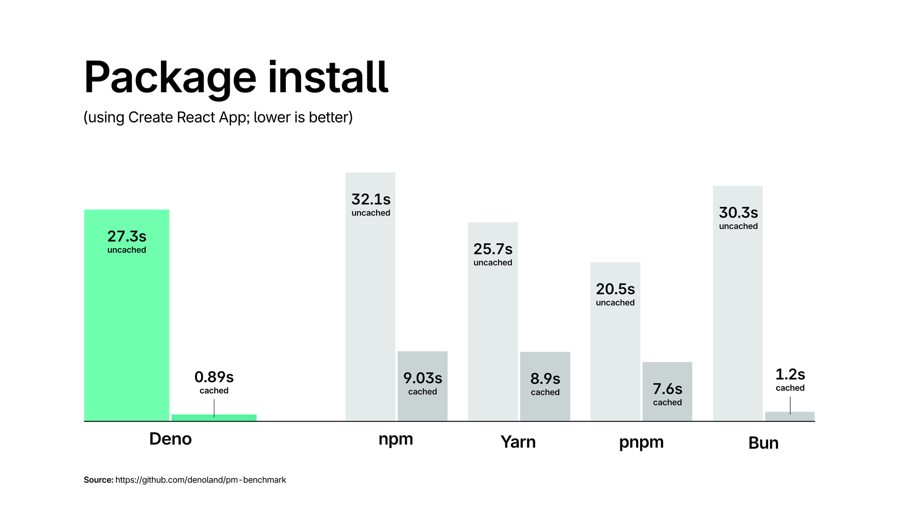

Em 2020 eu participei de um dos episódios do Hipsters.tech onde a gente falou bastante sobre o que era esse tal de Deno, a nova ferramenta que tava surgindo por aí e prometia ser um substituto do Node.

<Bookmark url="https://www.hipsters.tech/deno-o-novo-node-hipsters-203/" title="Deno, o novo Node? - Hipsters #203 - Hipsters Ponto Tech" description="…" publisher="Admin" />

Quatro anos depois, o Deno finalmente chegou na versão 2.0, e dessa vez eu acho que ele realmente tem a capacidade de ser o substituto do Node.js. Mas deixa eu te dizer por que eu acho isso.

## O que é Deno?

Antes de a gente começar, o que é o Deno? Há um ano eu e o Roz fizemos uma palestra sobre ele no Iugu Talks4Devs. Vale a pena dar uma olhada:

<YouTube id="TgW0vW7NO8I" />

Em resumo, o Deno é um outro runtime criado pelo Ryan Dahl, o mesmo criador do Node.js, a ideia é que o Deno veio para corrigir os problemas que ele achava que poderiam ser prejudiciais para o Node.js, inclusive a presença de um gerenciador de pacotes que fosse privado como o NPM.

Deno é escrito em Rust e roda TypeScript nativamente, então você não precisa de uma etapa de compilação ou algo do tipo para poder rodar seu código, é como se, automaticamente, ele entendesse tudo que você quisesse fazer com o TypeScript e já interpretasse o código como JavaScript diretamente. Mas eu não vou me estender nisso aqui, temos um artigo aqui no blog que fala só sobre Deno:

[Vamos falar sobre o Deno](/deno/)

## Deno 2.0

O Deno 2.0 ainda se mantém fiel às funcionalidades que ele veio inicialmente para prover, e os problemas que ele veio inicialmente para resolver. Embora ele tenha se perdido um pouco no meio do caminho (já vamos falar sobre isso), ele ainda se manteve bem constante no que ele promete e no que ele entrega.

> [!NOTE] 💡
> Um fato engraçado é que o Deno é o segundo projeto mais popular no GitHub escrito em Rust, estando somente atrás do próprio repositório da linguagem em si.

As principais propostas do Deno eram que:

-   Ele teria suporte **nativo** a TypeScript, o que significa que você não teria que instalar nem o TypeScript nem nenhuma outra biblioteca como o [TSX](/tsx-loader/) para executar TS no runtime
-   Construído usando Web Standards, ou seja, ele teria implementações que seguissem estritamente as propostas do TC39 e da IETF. Isso é tão verdade que o Deno foi o primeiro runtime que implementou o [Temporal](/temporal-api/), mas não só isso, [Promises](https://dev.to/_staticvoid/series/1993), Fetch, [ESM](/os-ecmascript-modules-estao-aqui/) e muitos outros já estão implementados nativamente
-   Ele teria todas as ferramentas necessárias para poder criar e manter um projeto a longo prazo como: Linter, Formatter, Type Checker, um framework de testes, habilidade de compilar para um executável e mais
-   Segurança em primeiro lugar com sistemas de permissões e etc

E isso continua sendo verdade, o que é impressionante, porque, geralmente quando runtimes como esses crescem (como é o caso do Node), concessões acabam sendo feitas de forma que as propostas originais meio que se perdem nos pedidos e nas ideias da comunidade.

As funcionalidades do Deno 2.0 são bastante interessantes, eu diria que são até bem corajosas:

-   Suporte completo ao Node e NPM, então você pode rodar qualquer aplicação Node.js no Deno sem nenhuma configuração extra
    -   Isso inclui o suporte nativo ao `package.json` e ao `node_modules`
-   A adição de um package manager que você pode chamar com `deno add`, `deno install` e remover pacotes com `deno remove`
-   A biblioteca padrão (stdlib) está oficialmente estabilizada e na versão 1.0
-   Suporte para registros privados do NPM
-   Suporte para workspaces e monorepo
-   Deno agora vai ter calendário de releases e suporte a LTS
-   A criação do JSR, que é um registro de pacotes similar ao NPM que suporte múltiplos runtimes

Além disso outras funcionalidades que já existiam agora estão melhores:

-   `deno fmt` agora também formata HTML, CSS e YAML
-   `deno lint` agora tem regras específicas do Node e pode arrumar erros automaticamente com `deno lint --fix`
-   `deno test` suporta o [Node.js Test Runner](/comecando-com-o-node-js-test-runner/)
-   `deno task` também roda scripts do `package.json`
-   A documentação gerada pelo `deno doc` agora é mais bonita com um layout melhor
-   `deno compile` suporta assinar pacotes e ícones no Windows
-   `deno serve` agora suporta rodar server usando múltiplos núcleos do processador em paralelo
-   `deno init` tem a capacidade de scaffolding, então você pode ter templates de libs e servers
-   `deno jupyter` para quem usa jupyter notebooks agora tem saída de imagens, gráficos e HTML
-   `deno bench` para rodar benchmarks tem medidas mais precisas
-   `deno coverage` tem saídas de cobertura de testes em HTML

Eu não vou passar parte a parte sobre cada mudança, esse artigo não tem esse foco, a ideia aqui é a gente discutir essas novidades e o que isso significa para o Deno e para o ecossistema de runtimes em geral, mas se você quiser que eu faça mais conteúdo sobre isso, me chama lá nas minhas [redes sociais](https://lsantos.dev) e me avisa!

<CourseCTA />

# Opniões

No geral, eu gostei bastante dessa nova versão do Deno, porém tem algumas coisas que eu achei um pouco estranhas. A primeira delas é o suporte a `package.json` e `node_modules` que foram coisas que explicitamente foram ditas que o Node tinha de ruim e que não seriam implementadas nesse novo runtime. Porém aqui estamos com suporte completo ao Node.

Enquanto eu entendo que, sem isso, não tem como o Deno competir com o Node de forma nenhuma, porque simplesmente o ambiente Node.js é muito maior do que o ambiente Deno e a comunidade também. Então era meio necessário que a galera do Deno implementasse compatibilidade para que pessoas que já usassem Node pudessem usar Deno de forma direta, sem nenhuma configuração, e isso inclui ter que suportar o ambiente do Node.

Ninguém gosta do `node_modules`, isso é claro em vários memes.


Então a solução aqui foi realmente suportar tanto o `package.json` quanto o `node_modules`, mas não forçar que eles sejam obrigatórios. Isso foi uma boa sacada. Se você quiser usar pacotes do NPM mas não quiser ter o `node_modules` instalado, você pode simplesmente substituir todas as declarações de imports tipo:

```ts
import Express from 'express' // express é uma dep no package.json
```

Para usar o prefixo `npm:`:

```ts
import Express from 'npm:express'
```

Agora não é mais necessário ter o Express no `package.json`, e nem instalar nada no `node_modules` porque o Deno vai tomar o controle desse pacote e instalar ele no cache. Em projetos que são maiores você pode utilizar os _import maps_ (que são um web standard) para poder mapear o nome do pacote para outro nome (o que é essencialmente um outro tipo de `package.json`, mas ajuda a saber o que está instalado):

```ts
// deno.json
{
  "imports": {
    "express": "npm:express"
  }
}
```

E isso me leva a outro assunto, que é o `deno.json` em si, que era uma das propostas originais de não ter um arquivo JSON que define todo o projeto. Enquanto ele não é necessário nem obrigatório (a não ser que você queira publicar algo no JSR), meio que se tornou uma boa prática ter esse arquivo ali. E isso é, basicamente, outro `package.json`.

## JSR e Deno PM

O Deno seguiu um pouco nos passos do Bun incluindo um package manager dentro do binário, o que eu acho que vai completamente contra o que eles propuseram inicialmente (inclusive tem até um [blog post do próprio Ryan Dahl sobre isso](https://deno.com/blog/package-json-support)). Eu, pessoalmente, gosto muito do modelo de importação direto por URL que tínhamos antes (e, acredito, que ainda temos no Deno) que é uma forma mais decentralizada de manter os seus pacotes e não entregar o controle dele para organizações privadas, que podem simplesmente remover, alterar, ou até tomar conta de um pacote público.

Isso é tão verdade que existem vários exemplos disso acontecendo, onde empresas tem o controle total de pacotes públicos, como é o caso mais recente do [WordPress que tomou conta (quase sequestrando) um dos plugins mais utilizados do ambiente](https://www.advancedcustomfields.com/blog/acf-plugin-no-longer-available-on-wordpress-org/). Substitua WordPress por NPM, Deno, JSR, ou qualquer outra coisa e você tem o mesmo resultado. Claro, tudo depende de como essas empresas se comportam, e o caso do WordPress é sim um caso muito separado por ter uma pessoa chave que tem o controle da maioria das coisas, mas ainda sim é uma possibilidade.

Por outro lado, centralizar pacotes dessa forma torna o ambiente mais seguro, e evita problemas como o que [aconteceu com o Faker](https://www.revenera.com/blog/software-composition-analysis/the-story-behind-colors-js-and-faker-js/) e o [Left-pad](https://en.wikipedia.org/wiki/Npm_left-pad_incident) (que mostra outro problema completamente diferente e muito mais sério, mas vamos nos ater a essa história). Nesses dois casos, o NPM conseguiu intervir e forçadamente tomar controle dos pacotes, republicando e/ou restaurando versões anteriores. Isso é um exemplo onde ter controle total é uma coisa boa, mas somente se a empresa que tem o controle tem boas intenções. Mas a pergunta que fica é:

> Qual empresa tem boas intenções?

Voltando ao Deno, a criação do JSR e o uso do Deno como package manager não é necessariamente algo ruim porque ele basicamente se conecta a muitos gerenciadores e é utilizado como um cliente de cada um para baixar pacotes em múltiplos lugares diferentes. O Deno meio que virou o `yarn`, inclusive ele se compara a eles:



A ideia é boa, por exemplo, se você rodar `deno install`:

-   Se você tiver um `package.json`, ele vai se comportar como um `npm install`, criando um `node_modules` e instalando todos os pacotes dentro dele
-   Se você não tem um `package.json` ele vai cachear todas as dependências no cache global, a mesma coisa que a gente fazia com `deno cache`

Isso significa que você pode usar literalmente qualquer tipo de pacote que você quiser de qualquer origem que você quiser, ou seja, você pode usar pacotes presentes no JSR com `import x from 'jsr:pacote@versao'` junto com `import x from 'https://url.com'` e `import x from 'npm:pacote@versao'`. Apesar de interessante, eu imagino a bagunça que isso vai ser em projetos grandes.

# Será o fim do Node.js?

Pela primeira vez eu tenho que dizer que realmente não sei. Com a adoção do Deno em maior escala a cada dia que passa, e a inabilidade do Node.js implementar as mesmas funcionalidades na mesma velocidade, eu vejo que muita gente vai acabar migrando para Deno sim, mas não acho que seja o fim do Node.js.

Apesar de ser mais devagar, o Node.js tem feito grandes feitos e está implementando coisas muito interessantes, como o suporte para rodar arquivos TypeScript com `--experimental-strip-types` e `--experimental-transform-types`. A adição do Node Test Runner, a melhoria desses pacotes e muitas coisas que estão sendo adicionadas conforme falamos.

Mas eu não acho que todas essas adições sejam suficientes para manter o projeto no ar, o Node é um projeto que tem muitas dependências, tem muitas cabeças envolvidas e muita política também, muitas empresas dependem desse projeto e estão tentando guiar para seu próprio benefício com membros nos comitês. Eventualmente, o Deno (ou o Bun, ou o próximo runtime) vai aparecer com uma funcionalidade que não temos como negar, por exemplo, no caso do Deno, para mim você poder compilar tudo para um binário é algo que é incrível, e muitas pessoas pensam o mesmo, mas isso raramente vai chegar ao Node.

# Conclusão

O Deno 2.0 vem com muitas coisas boas e realmente vale a pena testar, talvez até mesmo implementar em um projeto e deixar ele rodando por um tempo, vou fazer alguns testes com projetos Node.js que tenho e quem sabe posto os futuros resultados por aqui, ou na minha newsletter!

Se você quiser ver alguma coisa por aqui não esquece de me chamar!
