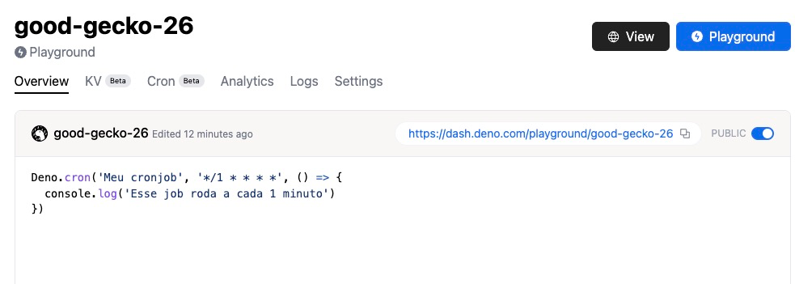
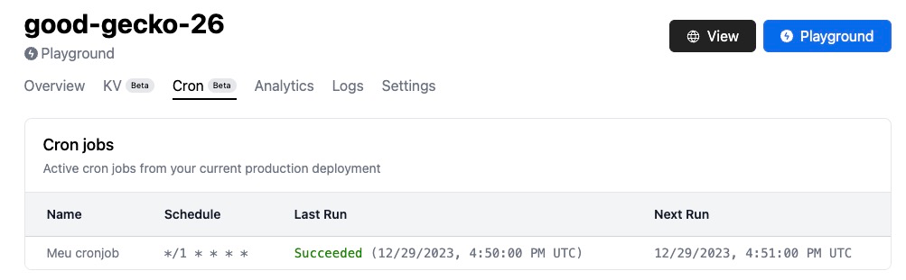
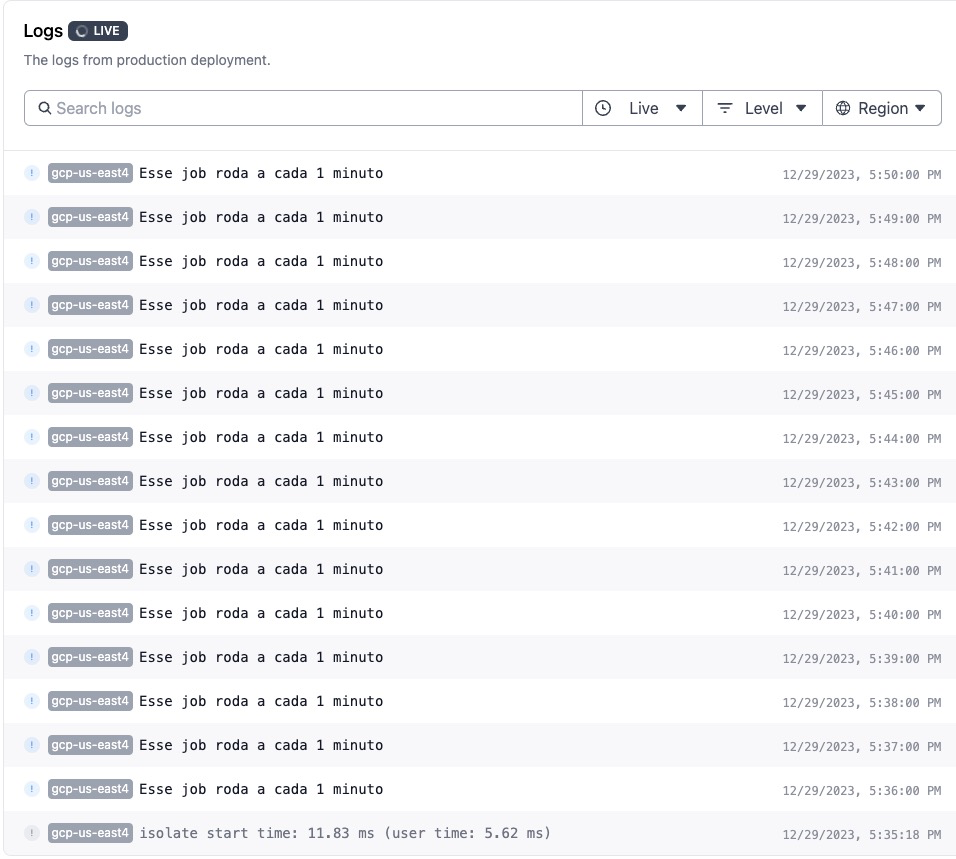

Continuando com as nossas novidades sobre Deno, dessa vez eu quero trazer algo que eu pessoalmente já precisei várias vezes mas nunca encontrei uma solução, cronjobs!

Cronjobs são processos que rodam repetitivamente em um intervalo pré-determinado. A ideia é bem simples, e eles são largamente utilizados para várias coisas, por exemplo, agendamentos de ações que devem acontecer em um determinado horário como postagens de redes sociais, ou então até mesmo processamento de cartões de crédito, eles são os famosos **batch jobs**.

## O problema

Por mais simples que a ideia seja, os cronjobs tem um problema inerente à forma que eles funcionam. Como você tem que rodar alguma coisa de tempos em tempos, a única forma de saber quando ela precisa ser executada é ter um sistema que vai observar a data e verificar se existem jobs para serem executados naquele momento.

Isso demanda uma máquina que esteja sempre ligada, checando periodicamente (geralmente a cada minuto) se existe alguma coisa que ela possa fazer. O problema com isso são dois:

### Preço

Manter uma máquina ligada o tempo todo, por menor que ela seja, custa um valor, principalmente se você escolher provedores cloud maiores.

Para reduzir isso, muita gente prefere ter uma máquina que já possuía antes, como um notebook antigo, um media server, um NAS ou, como eu já fiz, ter um Raspberry Pi conectado rodando o Cron do sistema (ou o Systemd).

Mas ai você tem outro problema: segurança e rede, como você expõe uma máquina como essa para poder ser acessada de fora, VPNs talvez? Mas e a segurança?

Todos esses problemas acabam tendo soluções, mas é um trabalho muito grande para algo que, às vezes, é muito pequeno.

### Computação desperdiçada

A grande maioria dos serviços do tipo _watchdog_ ou _daemon_ não vão executar nada durante 90% do tempo de execução. Ou seja, se a gente tiver um sistema que é um cron, as chances é que em 90% dos ciclos que essa aplicação esteja rodando, nada esteja acontecendo.

Isso é uma computação desperdiçada, mas é ainda sim computação paga que liga diretamente com o que falamos antes, para resolver isso poderíamos usar Serverless, mas ai temos outro problema porque Serverless não é executado se não tiver um evento que execute essa função, então voltamos para o problema da máquina virtual.

## A solução

Felizmente existem serviços que oferecem crontabs online, porém todos são pagos e geralmente não tem uma experiência de usuário muito boa, isso até o **Deno Cron**.

O Deno Cron é a mais nova adição à família do Deno Deploy, ele permite a inclusão de cronjobs que executam em um ambiente serverless direto no deploy da aplicação. E é tão simples quanto:

```ts
Deno.cron('Meu cronjob', '* * * * *', () => {
  console.log('Esse job roda a cada 1 minuto')
})
```

O primeiro parâmetro é o nome do seu job. Esse nome é muito importante porque ele é a chave que vai impedir outros cronjobs de serem criados como mesmo nome, e esse também é o nome que vai aparecer no painel.

No segundo parâmetro usamos uma sintaxe igual a do crontab (que você pode pegar em sites como o [crontab.guru](https://crontab.guru)) e o terceiro é a nossa função.

Localmente esse cron vai se comportar como se fosse um `setInterval`, porém no Deno Deploy ele vai ter a sua própria aba, como essa que eu criei no [playground do deno](https://dash.deno.com/playground/good-gecko-26):



Se abrirmos a aba Cron no topo, vamos ver todas as execuções do Cronjob, bem como os logs na aba de logs:



O cron mostra apenas a última execução de cada cronjob definido, já os logs mostram tudo que aconteceu:



Para remover um cronjob basta remover o código e fazer o deploy novamente.

É importante dizer que **os jobs não encavalam**, ou seja, se um job já estiver rodando quando o outro iniciar, ele vai ser pulado.

### Controle de falhas

O Deno Cron já vem com um sistema de controle de falhas exponencial, então é bem simples criar retries, é só você passar a opção `backoffSchedule` com um array de tempos em milissegundos, por exemplo:

```ts
Deno.cron(
  'Meu cronjob', 
  '* * * * *', 
  { backoffSchedule: [1000, 4000, 8000] }, 
  () => console.log('Esse job roda a cada 1 minuto')
)
```

Se este cronjob falhar, ele vai ter uma nova tentativa em 1 segundo, depois 4 depois 8. Você também pode passar um `AbortSignal` para que seja possível cancelar a execução da promise através de outro local.

## Limitações e detalhes

Por enquanto a [documentação do cron](https://docs.deno.com/kv/manual/cron) diz que só é possível criar cronjobs no top-level domain. Ou seja, **não é possível criar um cron dentro de uma função** ou dentro de algum escopo, dessa forma é necessário que você já saiba o que precisa ser executado de antemão. Para criar cronjobs dinâmicos as [filas](/deno-kv-queues/) podem ser uma boa opção!

Além disso o **fuso horário do Deno Cron é UTC, independente do local.**

Essa é uma API que realmente vai facilitar muito a vida de quem está desenvolvendo usando Deno e TypeScript! Me conta ai o que você vai fazer com ela!

Até mais!

---

## Momento FTS!

Se você curtiu esse artigo, eu também tenho um curso completo de TypeScript chamado **Formação TypeScript!**

Eu te convido a dar uma olhadinha lá se você quiser aprender mais sobre TypeScript comigo e a nossa incrível comunidade com centenas de alunos e alunas!

