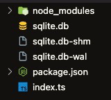
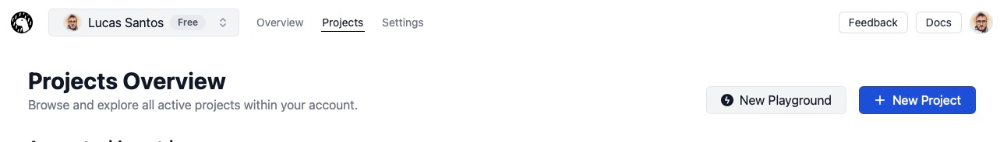
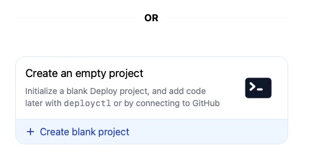
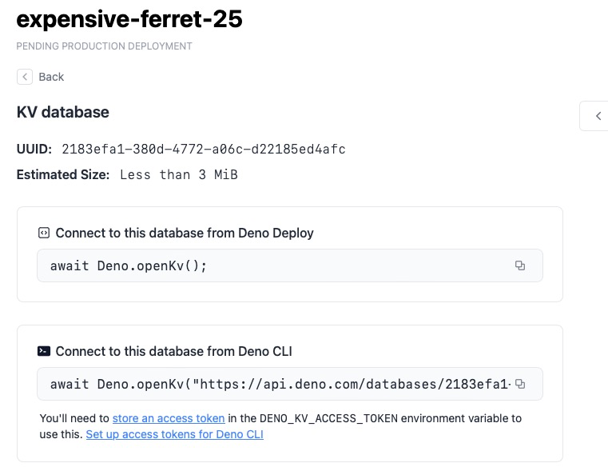

A gente já trocou uma ideia sobre o [Deno KV aqui](/deno-kv-beta/) no passado, mas a grande diferença é que esse banco de dados só funcionava no Deno, até agora!

A galera acabou de anunciar o [pacote do Deno KV para o NPM](https://www.npmjs.com/package/@deno/kv)! Permitindo que qualquer usuário do Node já possa utilizar o banco também, mesmo isso já sendo possível com o [binário](https://github.com/denoland/denokv) do KV sendo publicado de forma standalone.

## O que é o KV

Como já falamos aqui antes, eu não vou me estender muito na explicação.

O Deno KV é um banco de dados no modelo key-value (por isso KV), ou seja, ele armazena chaves em strings e valores que podem variar em formatos, mas é possível armazenar arrays, objetos, além de outros primitivos.

A grande vantagem do Deno KV é que ele é totalmente incluso no Deno, então você pode criar e acessar um banco direto com :

```ts
const kv = await Deno.openKv()
```

E mesmo se você não tiver uma URL, se o projeto estiver no Deno Deploy, então ele já vai conseguir resolver o banco de dados e vai te dar um banco completo com replicação automática.

O problema é quando você não está no Deno.

## Usando o KV no Node.js

Para usar o KV no Node, podemos fazer a forma mais simples primeiro, usando o banco em memória! É só a gente instalar o pacote usando:

```bash
npm install @deno/kv
```

E depois criar um arquivo JS ou TS com o seguinte conteúdo:

```ts
import { openKv } from '@deno/kv'

const kv = await openKv('')
await kv.set(['key'], 'value')
console.log(await kv.get(['key']))
/**
 * { key: [ 'key' ],
    value: 'value',
    versionstamp: '00000000000000010000' }
 */
```

Rodar o KV em memória é uma das coisas legais que podemos fazer com o pacote do Node.js, inclusive é uma funcionalidade que você pode utilizar ao invés de mapas e outras coisas para poder, por exemplo, criar testes automatizados, ou até mesmos caches locais.

### SQLite

Por padrão, quando estamos executando localmente, o KV vai criar uma instancia local de um SQLite, o que é muito legal para projetos onde a persistência é necessária (já que podemos também usar o KV para dados efêmeros, como caches, nonces e etc).

Para criar um banco de dados usando SQLite é só passar o nome do banco no primeiro parâmetro:

```ts
import { openKv } from '@deno/kv'

const kv = await openKv('sqlite.db')
await kv.set(['key'], 'value')
console.log(await kv.get(['key']))
/**
 * { key: [ 'key' ],
    value: 'value',
    versionstamp: '00000000000000010000' }
 */
```

A única diferença é que o KV vai criar um banco local em um arquivo:



Você pode também fazer self hosting usando [este projeto](https://github.com/denoland/denokv) para criar um banco na sua própria infraestrutura usando a mesma API e o backend do Deno KV, porém com SQLite.

<CourseCTA />

### Conectando a uma instância online

Você também pode passar uma conexão para o banco de dados hospedado na web. Primeiro de tudo você precisa de um token de acesso. Você pode criar um seguindo esse vídeo da documentação:

<Video src="./deno-kv-chega-ao-npm/creating-a-deno-access-token.mp4" poster="https://img.spacergif.org/v1/1920x1080/0a/spacer.png" />

E depois criar um banco de dados em um projeto, existem duas formas de fazer isso, a primeira é como a documentação mostra, através de um playground.

Para isso você pode fazer um projeto em branco no [Deno Deploy](https://deno.com/deploy) seguindo esse vídeo da própria documentação:

<Video src="./deno-kv-chega-ao-npm/creating-deno-kv-instance.mp4" poster="https://img.spacergif.org/v1/1710x1080/0a/spacer.png" caption="Criando um banco dados (fonte: Deno Blog)" />

A segunda é criando um projeto comum indo na aba projetos do [deno deploy](https://deno.com/deploy):



Depois crie um projeto em branco:



Vá na barra de endereços e adicione `/kv` na URL, você vai cair nessa página:



Basta copiar a linha de comando aqui e colar na sua aplicação, seguido do token de acesso!

```ts
import { openKv } from '@deno/kv'

const kv = await openKv("https://api.deno.com/databases/UUIDAQUI/connect", {accessToken: 'SEUTOKEN'});
await kv.set(['key'], 'value')
console.log(await kv.get(['key']))
/**
 * { key: [ 'key' ],
    value: 'value',
    versionstamp: '00000000000000010000' }
 */
```

> É mais seguro setar uma variável de ambiente chamada `DENO_KV_ACCESS_TOKEN` com seu token para evitar vazamentos de dados.
