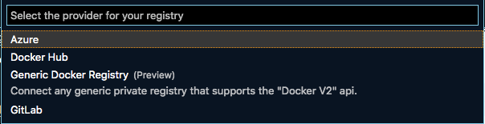
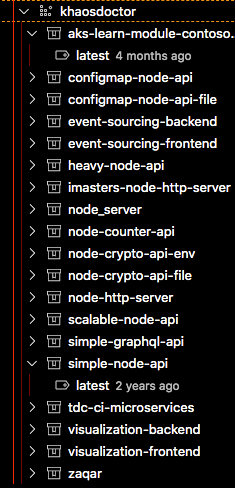
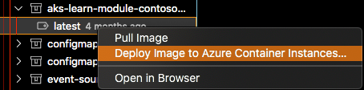

We mentioned [in this post](/executando-containers-no-azure-container-instancies-com-docker/) that Docker would be gaining a **native** integration with Azure! With this integration, deploying a Docker image directly to [Azure Container Instances (ACI)](https://docs.microsoft.com/azure/container-instances/quickstart-docker-cli?WT.mc_id=blog-personal-ludossan) would be as easy as a single Docker CLI command.

The integration was already present in Docker Edge, which is Docker's beta version. Now we have the excellent [news](https://azure.microsoft.com/blog/azure-container-instances-docker-integration-now-in-docker-desktop-stable-release/?WT.mc_id=blog-personal-ludossan) that this integration has arrived for all Docker users! And with it, we now **have the same integration right in [VSCode](https://code.visualstudio.com/?WT.mc_id=blog-personal-ludossan)**!

And how can we access this convenience?

## Enabling the integration with VSCode

First, we need to have Docker installed on the machine. If you don't have it yet, go to [the official site](https://www.docker.com/products/docker-desktop) and download the `stable` version for your operating system.

Once you've downloaded and installed Docker, log in to Azure using the following command:

```bash
docker login azure
```

And then create a new context using the `docker context create aci <name>` command, the name of the context is up to you!

Now, go to the [VSCode](https://code.visualstudio.com/?WT.mc_id=blog-personal-ludossan) marketplace, download and install the [official Docker extension for Code](https://marketplace.visualstudio.com/items?itemName=ms-azuretools.vscode-docker&WT.mc_id=blog-personal-ludossan). It should appear in the left corner of your screen, as shown in the image below.


Notice that, at the end of the sidebar, we'll have a menu called **Contexts**. Open it and right-click on the context you just created. Select _Use_:


With the context selected, we now have everything we need to make our deploy.

## Deploying to ACI

With the extension, we can log in to our DockerHub or [Azure Container Registry](https://azure.microsoft.com/services/container-registry/?WT.mc_id=blog-personal-ludossan):


From there we can select the type of registry we're using



And then we'll have a list of our images hosted in these services:



Now we can open and select one of the images, right-click, and select _"Deploy Image to Azure Container Instances"_:



See the process as a whole:


From there you'll have prompts to input the name of your ACI or if you want to use an existing one, and you'll also be able to pull the logs, open ports and much more!

## Conclusion

The native integration of Docker with ACI is one of the most interesting tools we have when it comes to the cloud. This ability to integrate directly makes it much easier to perform our deploys and also manage our containers.

If you want to know more, check out [the official documentation about the integration](https://docs.microsoft.com/azure/container-instances/quickstart-docker-cli?WT.mc_id=blog-personal-ludossan) and also read [the documentation on the Docker website](https://docs.docker.com/engine/context/aci-integration/).

See you later!
