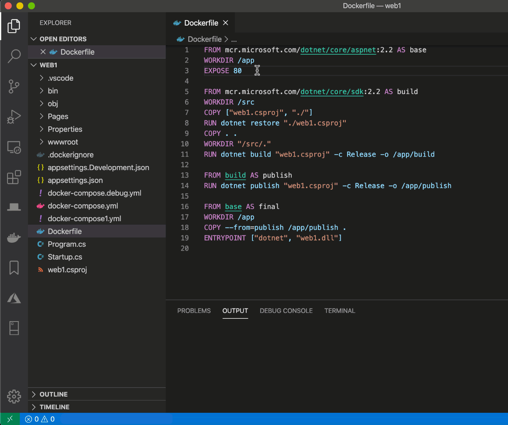

Comentamos [neste post](/executando-containers-no-azure-container-instancies-com-docker/) que o Docker estaria ganhando uma integração **nativa** com a Azure! Com essa integração o deploy de uma imagem docker direto para o [Azure Container Instances (ACI)](https://docs.microsoft.com/azure/container-instances/quickstart-docker-cli?WT.mc_id=blog-personal-ludossan) seria tão fácil quando um único  comando no Docker CLI.

A integração já estava presente no Docker Edge, que é a versão beta do Docker. Agora temos a excelente [notícia](https://azure.microsoft.com/blog/azure-container-instances-docker-integration-now-in-docker-desktop-stable-release/?WT.mc_id=blog-personal-ludossan) de que esta integração chegou para todos os usuários do Docker! E, junto com ela, agora **temos a mesma integração direto no [VSCode](https://code.visualstudio.com/?WT.mc_id=blog-personal-ludossan)**!

E como podemos ter acesso a essa facilidade?

## Habilitando a integração com VSCode

Primeiramente, precisamos ter o Docker instalado na máquina. Se você ainda não possui então vá até [o site oficial](https://www.docker.com/products/docker-desktop) e baixe a versão `stable` para o seu sistema operacional.

Assim que você baixar e instalar o Docker, faça login na Azure utilizando o seguinte comando:

```bash
docker login azure
```

E depois crie um novo contexto usando o comando `docker context create aci <nome>`, o nome do contexto fica por sua conta!

Agora, vá até o marketplace do [VSCode](https://code.visualstudio.com/?WT.mc_id=blog-personal-ludossan), baixe e instale a [extensão oficial do Docker para o Code](https://marketplace.visualstudio.com/items?itemName=ms-azuretools.vscode-docker&WT.mc_id=blog-personal-ludossan). Ela deve aparecer no seu canto esquerdo da tela, conforme a imagem a seguir.



Perceba que, no final da barra lateral, teremos um menu chamado **Contexts**. Abra-o e clique com o botão direito sobre o contexto que você acabou de criar. Selecione _Use_:


Com o contexto selecionado, já temos tudo o que precisamos para fazer nosso deploy.

## Fazendo um deploy para o ACI

Com a extensão, podemos fazer login em nosso DockerHub ou [Azure Container Registry](https://azure.microsoft.com/services/container-registry/?WT.mc_id=blog-personal-ludossan):


A partir daí podemos selecionar o tipo de registro que estamos usando


E então teremos a listagem das nossas imagens hospedadas nestes serviços:


Agora podemos abrir e selecionar uma das imagens, clicar com o botão direito, e selecionar _"Deploy Image to Azure Container Instances"_:


Veja o processo como um todo:


A partir daí você terá prompts para fazer o input do nome do seu ACI ou se quer usar um já existente, e também poderá trazer os logs, abrir portas e muito mais!

## Conclusão

A integração nativa do Docker com o ACI é uma das ferramentas mais interessantes que temos quando estamos nos referindo à cloud. Essa capacidade de integração direta faz com que fique muito mais fácil realizar nossos deploys e também gerenciar nossos containers.

Se você quiser saber mais, veja [a documentação oficial sobre a integração](https://docs.microsoft.com/azure/container-instances/quickstart-docker-cli?WT.mc_id=blog-personal-ludossan) e também leia [a documentação no site do Docker](https://docs.docker.com/engine/context/aci-integration/).

Até mais!
