In a [previous article](https://dev.to/azure/construindo-e-publicando-um-backend-graphql-completo-sem-escrever-uma-linha-de-codigo-g40), I talked about how we could build a full GraphQL backend using nothing but a Docker image and a config file, all hosted on [Azure](https://docs.microsoft.com/azure/container-instances/?WT.mc_id=blog-devto-ludossan). Now let's learn how to automate the deploys to our hosting and the automatic update of our backend!

This whole project is meant to build a backend for my future content archive, which will live on [my site](https://lsantos.dev/). But every time I update the backend or change the GraphQL schema, I'd have to deploy the whole service all over again.

So, instead of doing that by hand, I wanted every push to my master branch to generate a new version of the file and send the update to [Azure](https://portal.azure.com/?WT.mc_id=blog-devto-ludossan). But I don't want to bring in other tools to do this, I want to keep the whole stack as simple as possible. Since we're only using GitHub and [Azure](https://portal.azure.com/?WT.mc_id=blog-devto-ludossan), it only makes sense to stay on GitHub for the automation too, right?

That's why we're going to use [**GitHub Actions**](https://azure.microsoft.com/blog/github-actions-for-azure-is-now-generally-available/?WT.mc_id=blog-devto-ludossan)

Similar to other CI providers like Travis or Circle, GitHub also has its own integration and automation system for the repository. The advantage this system has over the others is that you're already inside the same repository, and already inside the same tool.

The project we're going to automate is [my public backend repository](https://github.com/khaosdoctor/site-backend):

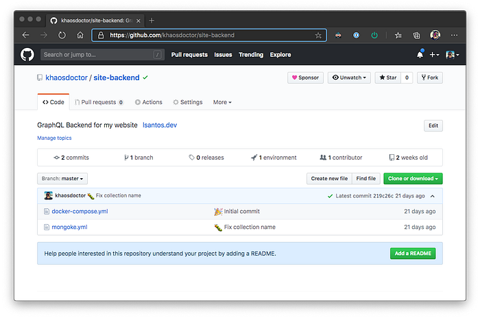

Notice how simple the repository is: it doesn't have many files, just a `docker-compose.yml` for local tests and our `mongoke` `yml` file, which will be the GraphQL schema.

At the top of the page, next to settings, we have the `Actions` button. That's where we're going to set up our automation!

GitHub already ships with a bunch of ready-made workflows, but unfortunately none of them cover what we want to do. So what do we want to do? To make it clearer, let's list every step of the process:

1.  We receive a push to the `master` branch
2.  We connect to [Azure](https://portal.azure.com/?WT.mc_id=blog-devto-ludossan) through a [service principal](https://docs.microsoft.com/azure/app-service/deploy-github-actions?WT.mc_id=blog-devto-ludossan#create-a-service-principal) and an action called [Azure/login](https://github.com/Azure/login)
3.  Then we use the [Azure/cli](https://github.com/Azure/CLI) action to run the deploy command for our container

A few details worth noting:

-   GitHub Pages' cache is a bit long, so we'll have to generate a random number or a fingerprint to put in the URL of our Mongoke YAML file
-   We have a MongoDB URI that needs to be a secret

## Creating a secret

First let's deal with our dependencies. The easiest one to sort out is creating the MongoDB URL as a secret. To do that, we go to our `Settings` tab and click `Secrets`. Just add a new secret by clicking the `Add new Secret` link and filling in a name and its content. In our case we're adding the MongoDB URI, so let's call this secret `MONGODB_URI`

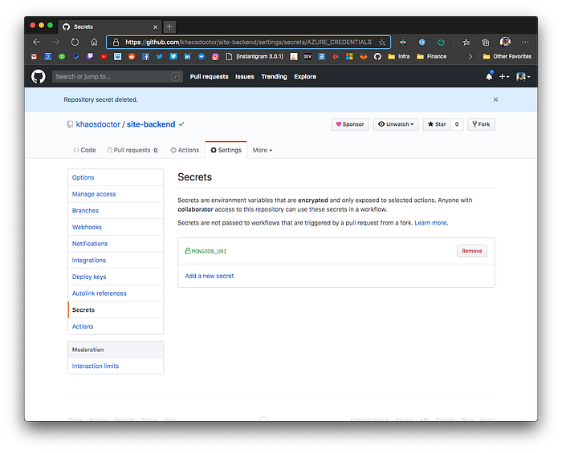

## Allowing actions on Azure

So that we can let GitHub run actions on our behalf on [Azure](https://portal.azure.com/?WT.mc_id=blog-devto-ludossan), we need to create a [Service Principal](https://docs.microsoft.com/azure/app-service/deploy-github-actions?WT.mc_id=blog-devto-ludossan#create-a-service-principal). This resource gives us an application account so we can let other people or services connect to our portal and perform actions on our behalf.

To create this resource, we're going to use the [Azure CLI](https://docs.microsoft.com/cli/azure/install-azure-cli?view=azure-cli-latest&WT.mc_id=blog-devto-ludossan). After logging in with the `az login` command, just run the following command:

<RawEmbed title="Carbon" html="<iframe src=&quot;https://cdn.embedly.com/widgets/media.html?src=https%3A%2F%2Fcarbon.now.sh%2Fembed%3Fbg%3Drgba%28171%252C184%252C195%252C0%29%26t%3Ddracula%26wt%3Dnone%26l%3Dauto%26ds%3Dfalse%26dsyoff%3D20px%26dsblur%3D68px%26wc%3Dtrue%26wa%3Dtrue%26pv%3D56px%26ph%3D56px%26ln%3Dfalse%26fl%3D1%26fm%3DFira%2520Code%26fs%3D14px%26lh%3D133%2525%26si%3Dfalse%26es%3D2x%26wm%3Dfalse%26code%3Daz%252520ad%252520sp%252520create-for-rbac%252520--name%252520%25253Cnome-do-SP%25253E%252520--role%252520contributor%252520--scopes%252520%25252Fsubscriptions%25252F%25253CID-da-subscription%25253E%25252FresourceGroups%25252F%25253Cnome-do-resourcegroup%25253E%252520--sdk-auth&amp;display_name=Carbon&amp;url=https%3A%2F%2Fcarbon.now.sh%2F%3Fbg%3Drgba%28171%25252C184%25252C195%25252C0%29%26t%3Ddracula%26wt%3Dnone%26l%3Dauto%26ds%3Dfalse%26dsyoff%3D20px%26dsblur%3D68px%26wc%3Dtrue%26wa%3Dtrue%26pv%3D56px%26ph%3D56px%26ln%3Dfalse%26fl%3D1%26fm%3DFira%252520Code%26fs%3D14px%26lh%3D133%252525%26si%3Dfalse%26es%3D2x%26wm%3Dfalse%26code%3Daz%25252520ad%25252520sp%25252520create-for-rbac%25252520--name%25252520%2525253Cnome-do-SP%2525253E%25252520--role%25252520contributor%25252520--scopes%25252520%2525252Fsubscriptions%2525252F%2525253CID-da-subscription%2525253E%2525252FresourceGroups%2525252F%2525253Cnome-do-resourcegroup%2525253E%25252520--sdk-auth&amp;image=https%3A%2F%2Fcarbon.now.sh%2Fstatic%2Fbrand%2Fbanner.png&amp;key=a19fcc184b9711e1b4764040d3dc5c07&amp;type=text%2Fhtml&amp;scroll=auto&amp;schema=carbon&quot; allowfullscreen=&quot;&quot; frameborder=&quot;0&quot; height=&quot;480&quot; width=&quot;1024&quot; title=&quot;Carbon&quot; class=&quot;eo n ff dy bg&quot; scrolling=&quot;no&quot; style=&quot;box-sizing: inherit; top: 0px; width: 680px; height: 318.75px; position: absolute; left: 0px;&quot;></iframe>" />

To get your subscription ID, just run the `az account list` command and look for the `id` key of the subscription with the `isDefault` key set to `true`. You can also give your Service Principal any name you like, just make it descriptive enough to know who you're granting permissions to.

Last but not least, another important detail is to only grant permissions to the resources you actually need. In other words, we're not going to create an SP for the **WHOLE** account, only for the _Resource Group_ we need. In my case, that RG is called `personal-website`, and that's where I'm grouping every resource related to my site.

This command should give you a JSON response like this:

<RawEmbed title="Carbon" html="<iframe src=&quot;https://cdn.embedly.com/widgets/media.html?src=https%3A%2F%2Fcarbon.now.sh%2Fembed%3Fbg%3Drgba%28171%252C184%252C195%252C0%29%26t%3Ddracula%26wt%3Dnone%26l%3Dapplication%252Fjson%26ds%3Dfalse%26dsyoff%3D20px%26dsblur%3D68px%26wc%3Dtrue%26wa%3Dtrue%26pv%3D56px%26ph%3D56px%26ln%3Dfalse%26fl%3D1%26fm%3DFira%2520Code%26fs%3D14px%26lh%3D133%2525%26si%3Dfalse%26es%3D2x%26wm%3Dfalse%26code%3D%25257B%25250A%252520%252520%252522clientId%252522%25253A%252520%252522xxxxxxx%252522%25252C%25250A%252520%252520%252522clientSecret%252522%25253A%252520%252522xxxxxxxx%252522%25252C%25250A%252520%252520%252522subscriptionId%252522%25253A%252520%252522xxxxxxxx%252522%25252C%25250A%252520%252520...%25250A%25257D&amp;display_name=Carbon&amp;url=https%3A%2F%2Fcarbon.now.sh%2F%3Fbg%3Drgba%28171%25252C184%25252C195%25252C0%29%26t%3Ddracula%26wt%3Dnone%26l%3Dapplication%25252Fjson%26ds%3Dfalse%26dsyoff%3D20px%26dsblur%3D68px%26wc%3Dtrue%26wa%3Dtrue%26pv%3D56px%26ph%3D56px%26ln%3Dfalse%26fl%3D1%26fm%3DFira%252520Code%26fs%3D14px%26lh%3D133%252525%26si%3Dfalse%26es%3D2x%26wm%3Dfalse%26code%3D%2525257B%2525250A%25252520%25252520%25252522clientId%25252522%2525253A%25252520%25252522xxxxxxx%25252522%2525252C%2525250A%25252520%25252520%25252522clientSecret%25252522%2525253A%25252520%25252522xxxxxxxx%25252522%2525252C%2525250A%25252520%25252520%25252522subscriptionId%25252522%2525253A%25252520%25252522xxxxxxxx%25252522%2525252C%2525250A%25252520%25252520...%2525250A%2525257D&amp;image=https%3A%2F%2Fcarbon.now.sh%2Fstatic%2Fbrand%2Fbanner.png&amp;key=a19fcc184b9711e1b4764040d3dc5c07&amp;type=text%2Fhtml&amp;scroll=auto&amp;schema=carbon&quot; allowfullscreen=&quot;&quot; frameborder=&quot;0&quot; height=&quot;480&quot; width=&quot;1024&quot; title=&quot;Carbon&quot; class=&quot;eo n ff dy bg&quot; scrolling=&quot;no&quot; style=&quot;box-sizing: inherit; top: 0px; width: 680px; height: 318.75px; position: absolute; left: 0px;&quot;></iframe>" />

Copy that entire response and create a new secret on GitHub called `AZURE_CREDENTIALS`:

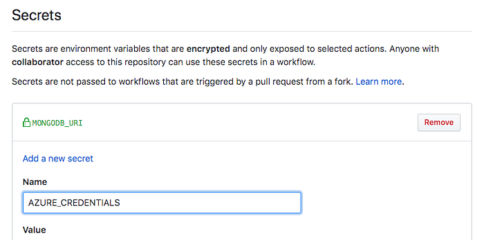

Now we should have two secrets created:

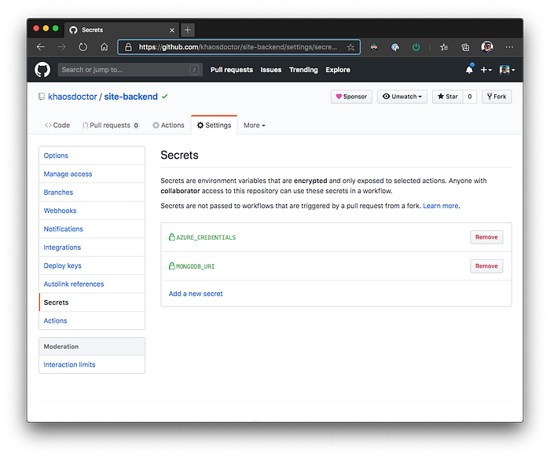

## Creating a workflow

To create our first workflow, just go back to the `Actions` panel next to `Settings` and click the `Set up this workflow` button:

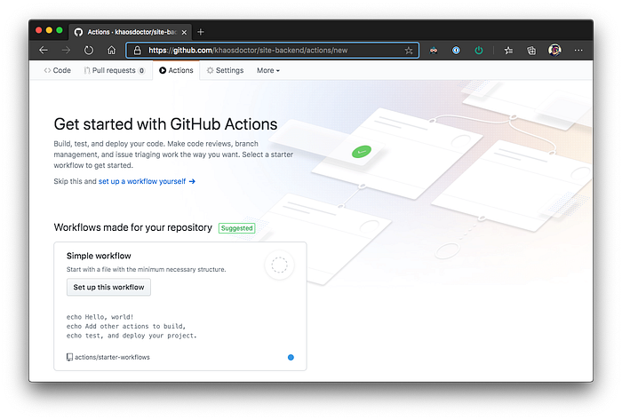

That action should take you to a new screen with a starter template for the code:

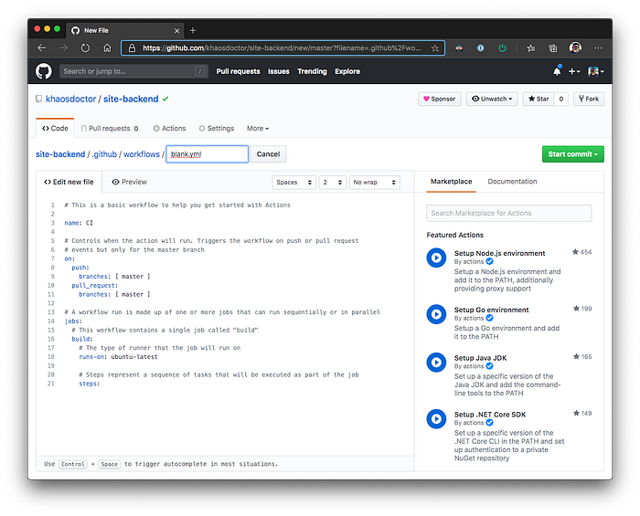

Notice that GitHub Actions are nothing more than a YAML file that lives in a `<your repo>/.github/workflows` folder, and this will be the name of the workflow, so it's important to make it descriptive. Let's name ours `publish-prod.yml`:

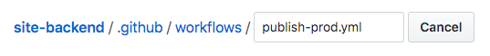

The content we get is the following:

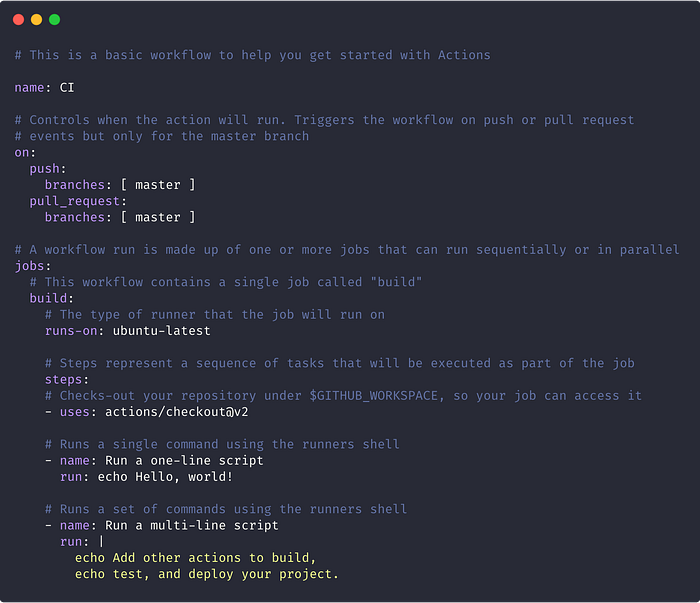

First, let's set a name for our workflow. This will be the name shown in the GitHub UI, so we can make it a bit prettier:

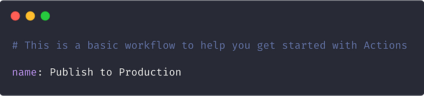

Now let's define which kind of action we want it to run on. Since we want it to run on any push or PR to the `master` branch, we don't need to change anything, but if we needed to change this trigger, we'd have to change the `on` key. To check which triggers are available, just click the editor and hit `ENTER` and an _intellisense_ will show up:[^n1]

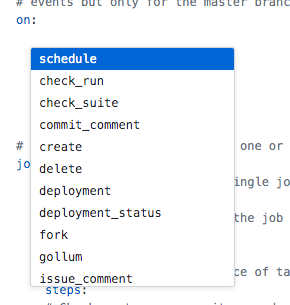

Now let's create a section to share environment variables and content we'll use further down our script, for example, the container name and the resource group name. To do that, we create an `env` block:

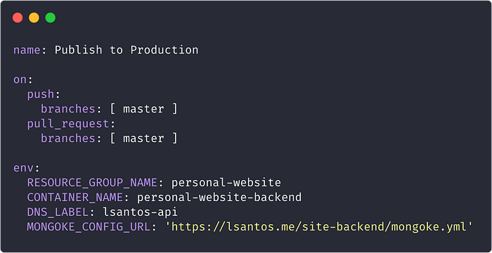

Now let's actually create the machine, what we call a `runner`, which is what's going to run our test and publish code. A whole workflow is made up of one or more jobs, which can run sequentially or in parallel. In our case there's not much to do, just connect and deploy. So let's modify the `jobs` section:

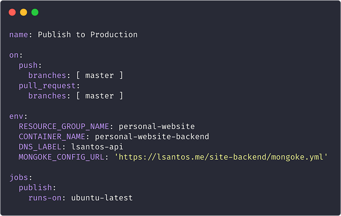

We're going to run our job on an Ubuntu image, check out the other options [in the documentation](https://help.github.com/en/actions/reference/workflow-syntax-for-github-actions#jobsjob_idruns-on). After that, let's configure our `steps`. A step is a sequence of tasks that run as part of a `job`, in other words, this is where we're going to run our login and our deploy!

To do that, let's edit the `steps` key and remove all its content, then let's use Azure's ready-made steps to handle the login! We can search the sidebar text box for `Azure/login`:

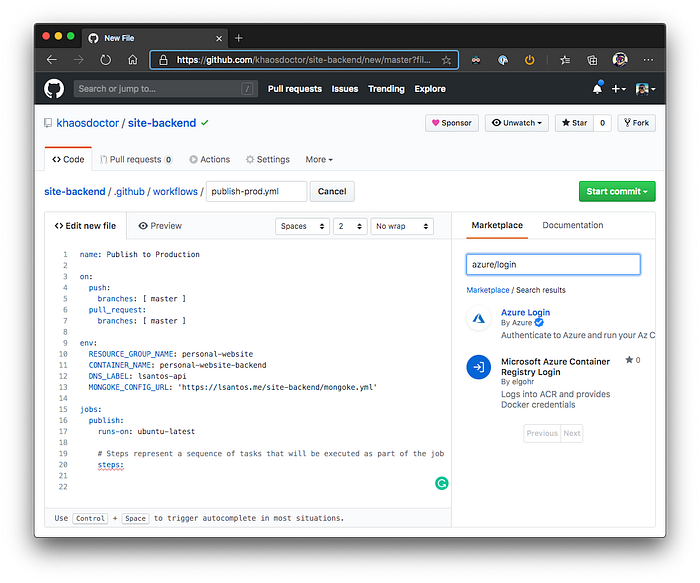

Clicking the step's name gives us a tutorial on how to use it. In this case it's pretty simple, just copy the following code into our step:

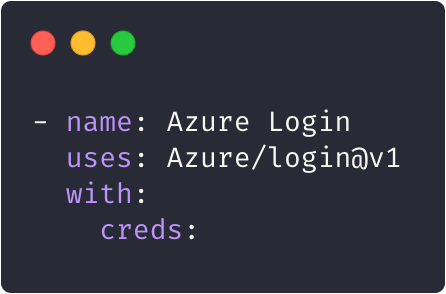

This is where we'll set our first secret. We need the `AZURE_CREDENTIALS` we created earlier to provide the access credentials for the login. To use a secret, just wrap it in double curly braces like this: `${{ secrets.AZURE_CREDENTIALS }}`.

Our file now looks like this:

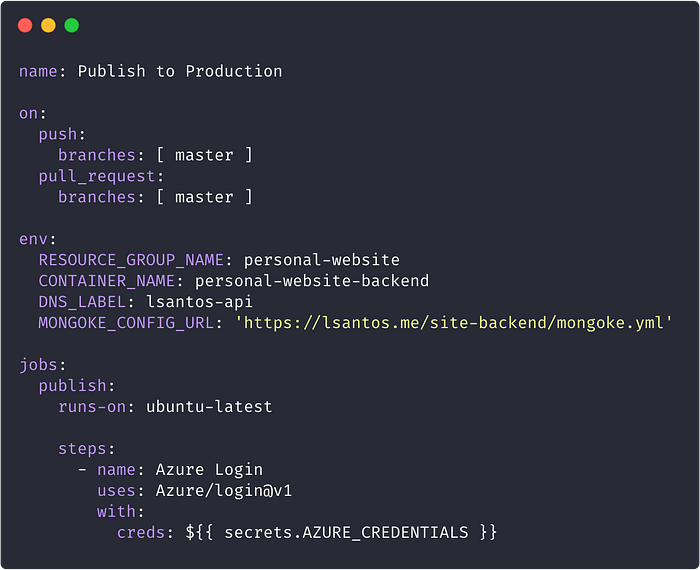

Let's create a second step, which we'll call `Deploy ACI`, and that's where we'll run our Azure CLI command. To do that, we'll use another step with the `run` command, which will hold the line we're going to run in our CLI. In our case, already with the variables substituted, it looks like this:

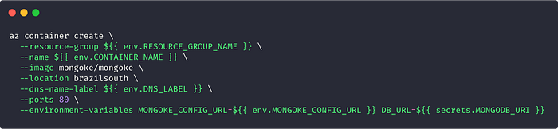

Let's take a close look at the last part, where we create the `MONGOKE_CONFIG_URL` variable. This variable alone won't be enough, we have to concatenate it with the commit's SHA value so we don't run into caching issues. To concatenate variables, we have to work only at the steps level, since expressions aren't allowed at the job level or at the workflow level as a whole. So let's create another step and call it `Create URL`.

In this step, we're going to run a [**Workflow Command**](https://help.github.com/en/actions/reference/workflow-commands-for-github-actions#using-workflow-commands-to-access-toolkit-functions), which are native GitHub Actions commands accessed with the `::command` syntax. In our case we're going to use the `set-env` command, which creates a new environment variable. The syntax is `::set-env name=<name>::<value>`, and then we'll be able to use concatenation expressions:

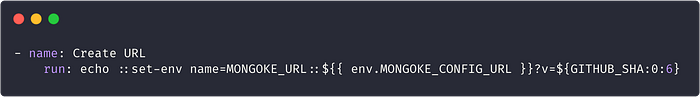

Notice we're concatenating `${{ env.MONGOKE_CONFIG_URL }}` with `?v=` and grabbing the first six digits of a [native environment variable](https://help.github.com/pt/actions/configuring-and-managing-workflows/using-environment-variables) called `GITHUB_SHA`. Let's add this step right after the login:

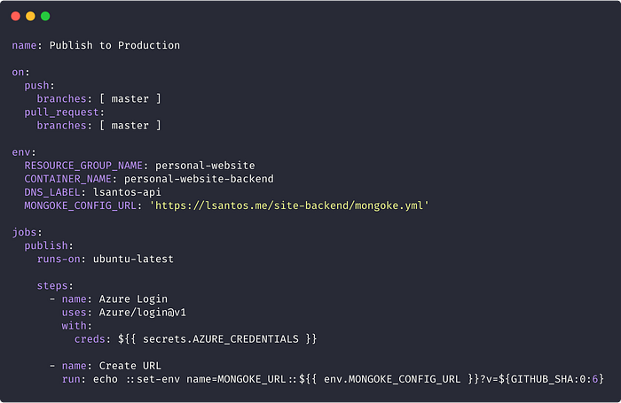

Now let's move to the last step, where we run our command with one small change: instead of using the `MONGOKE_CONFIG_URL` variable, we'll swap it for our new `MONGOKE_URL` variable:

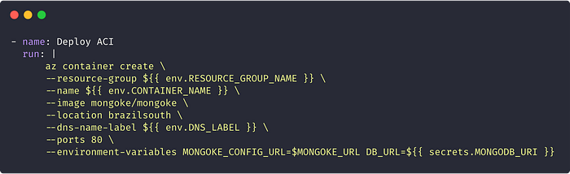

Our final file looks like this:

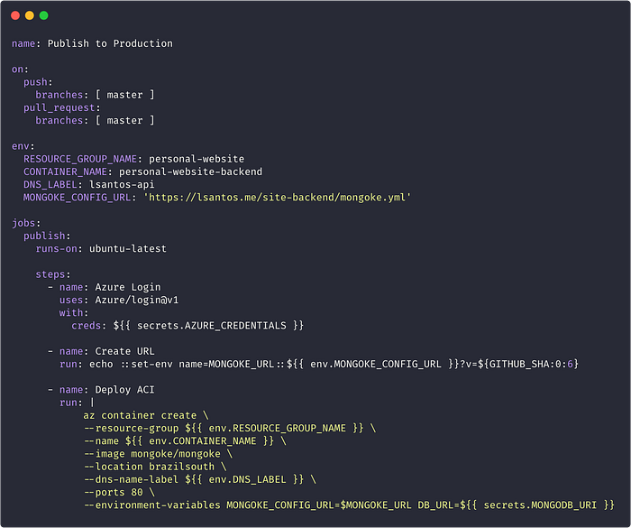

Now we can click the `Start Commit` button and wait for our action to run:

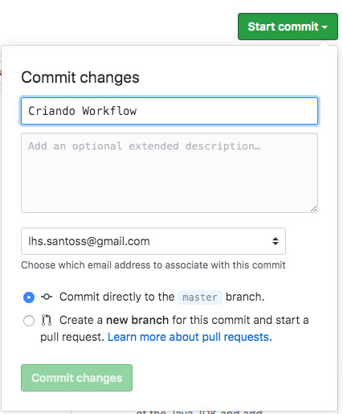

## Following the workflow

We can follow our workflow on the `Actions` tab:

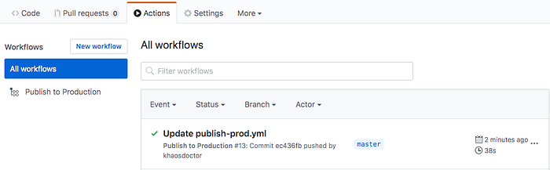

Keep in mind that **workflows that have never run won't show up in the list**. Just click the workflow's name to see what happened:

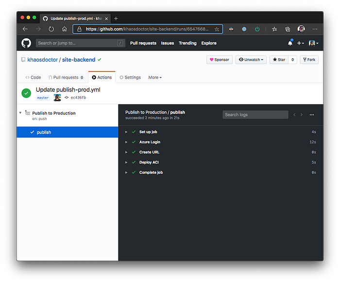

Now we can check the Azure portal and see that our container got updated:

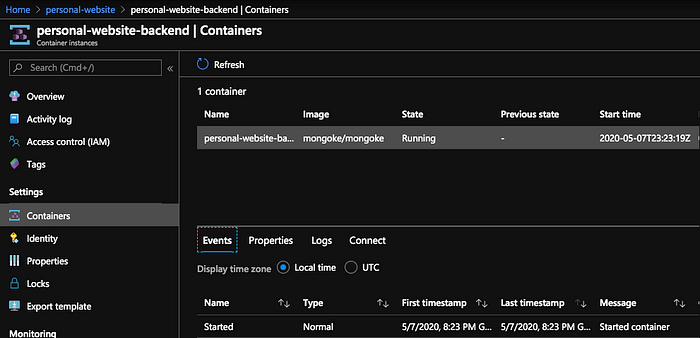

And that our URLs are correct too:

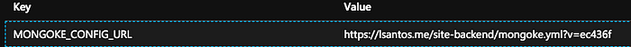

## Conclusion

In 7 minutes we automated the entire deploy process for our application to Azure, and without even noticing, we saved a ton of time with one simple, quick action that takes just a few minutes to set up!

In other articles we'll dig even deeper into GitHub Actions for other tools and distributed application models!

Keep following along for more of my content on my blog, and subscribe to the newsletter for weekly updates!

[^n1]: See how many possible triggers we have? For more detail, check [the official documentation](https://help.github.com/en/actions/reference/events-that-trigger-workflows#webhook-events).
