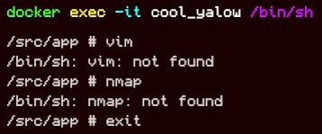
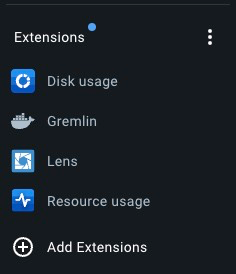
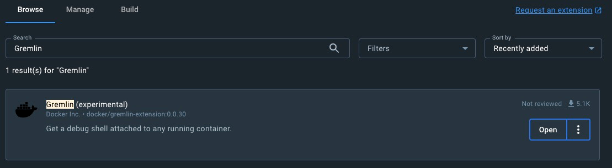
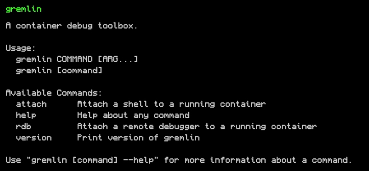
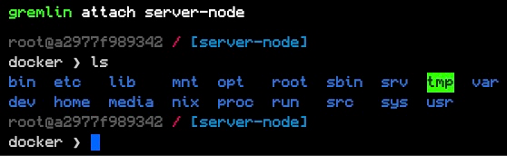
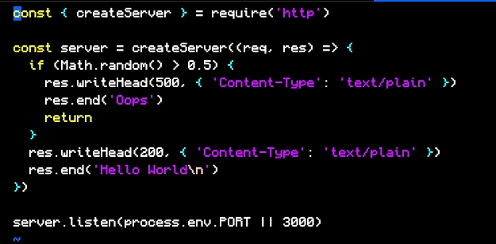
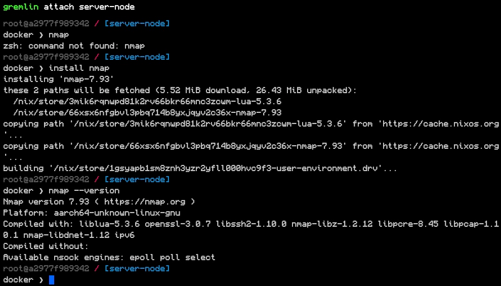
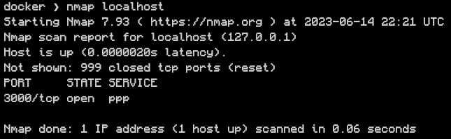
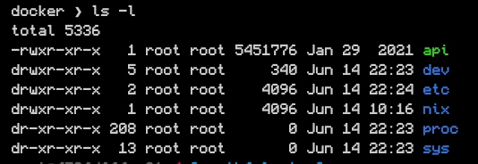

Já faz um tempo que eu não falo sobre Docker aqui, mas dessa vez recebi uma novidade sensacional, o **Docker Gremlin**. Uma extensão que permite mudar bastante a forma como você faz debug dos seus containers.

## O problema

A grande pergunta aqui é: Como você faz para debugar containers Docker? Vamos criar uma situação aqui. Imagina que você tenha o seguinte container:

```dockerfile
FROM node:alpine

COPY index.js package.json /src/app/
WORKDIR /src/app

ENTRYPOINT node index.js
```

Para deixar mais simples, vamos criar um código que é um servidor e, em 50% dos casos, apresenta um erro para o usuário, e imagine que não sabemos por que esse erro está acontecendo. Um código assim:

```js
const { createServer } = require('http')

const server = createServer((req, res) => {
  if (Math.random() > 0.5) {
    res.writeHead(500, { 'Content-Type': 'text/plain' })
    res.end('Oops')
    return
  }
  res.writeHead(200, { 'Content-Type': 'text/plain' })
  res.end('Hello World\n')
})

server.listen(process.env.PORT || 3000)
```

Quando construímos a nossa imagem com o comando `docker build -t server-node .` através do nosso `Dockerfile` e executamos com `docker run -p 3000:3000 server-node`, vamos ter um servidor rodando na porta 3000 que vai nos responder `Hello World` em 50% dos casos.

Mas, se quisermos saber por que esse container não está executando com sucesso, mesmo ele estando funcional na nossa máquina, vamos ter que debugar o que está lá dentro.

Eu, pessoalmente, gosto de uma ferramenta chamada [Dive](https://github.com/wagoodman/dive), que permite que a gente explore as camadas que criamos dentro do nosso container, isso é legal para podermos construir a imagem de como o sistema está funcionando, mas não adianta muito quando temos que ler os arquivos que estão lá, já que o Dive não permite que você faça isso.

Uma técnica que muitas pessoas utilizam é simplesmente entrar no container com `docker exec -it <nome> /bin/sh` e executar os seus comandos lá dentro, podemos fazer isso para o nosso container, mas assim que tentamos, por exemplo, alterar o arquivo `index.js` que colocamos na nossa pasta com o `vim`, vamos ter um erro clássico, o pacote do vim não está instalado:



Se tentarmos qualquer outra ferramenta, vamos ver que elas também não existem. E isso é verdade na maioria, se não em todos, os containers de produção. Ainda mais em containers onde podemos ter imagens montadas [from scratch](/um-mergulho-em-imagens-de-containers-parte-1/#imagens-scratch), que são imagens que não possuem nenhum sistema operacional de base, elas são basicamente um binário e nada mais, portanto, nem isso vamos conseguir fazer.

Essa saída é ok na maioria dos casos quando vamos substituir o container, mas é mais uma forma de "sujar" o nosso ambiente. E é ai que o gremlin entra.

## Docker Gremlin

O [Gremlin](https://hub.docker.com/extensions/docker/gremlin-extension) é uma extensão para o [Docker Desktop](https://www.docker.com/products/docker-desktop/) que permite que você entre dentro das camadas dos containers através de uma shell própria para debug, com todas as ferramentas que você precisa, e se você não achar alguma, ele pode instalar para você nesse mesmo ambiente, sem sujar o container, e ficando disponível para os próximos ambientes também!

Para instalar o Gremlin você precisa ter o Docker Desktop instalado, de lá, é só ir no canto esquerdo inferior e clicar em "Add Extensions":



De lá, procure na aba de busca por `gremlin` e clique no botão de instalação da extensão que **foi desenvolvida pela Docker**, quando ela for instalada, você vai ter o Gremlin listado como na imagem acima e o botão se transformará em **Open**, como abaixo:



> Existe uma ferramenta famosa para Chaos Engineering em DevOps chamada Gremlin, não é ela que estamos procurando.

A partir de agora você já vai ter um comando no seu terminal chamado `gremlin`:



Atualmente ele só tem um único comando, o `attach`. Este é o comando que você vai usar para abrir uma nova shell em um container já em execução. Vamos executar nosso container localmente com o comando:

```sh
docker run -d --name server-node -p 3000:3000 server-node
```

Agora você pode executar `gremlin attach server-node` e ver a mágica acontecer:



Veja que estamos dentro de um shell à parte do Docker, você pode executar todos os comandos que já conhecemos, mas a verdadeira mágica acontece quando precisamos usar ferramentas externas, vamos tentar ler o nosso arquivo com o vim usando o comando `vim /src/app/index.js`, lembre-se que não tivemos sucesso antes porque o Vim não estava instalado.



No Gremlin o Vim já vem instalado por padrão e podemos usá-lo para ler qualquer arquivo.

## Instalando novos pacotes

Vamos supor que queremos saber quais são as portas que estamos abrindo dentro do container. Podemos fazer isso de várias formas, mas quero demonstrar que podemos instalar pacotes como o `nmap` para escanear as portas de rede através do comando `install <pacote>`.



Veja que antes de instalarmos, tivemos um erro ao executar, mas depois conseguimos fazer o nmap funcionar. Agora é só executar `nmap localhost`:



Quando quisermos desinstalar, basta rodar `uninstall <pacote>`. E, para sair do console do Gremlin é só digitar `exit`.

## Scratch images

O Gremlin também funciona em imagens scratch. Por exemplo, [eu tenho uma imagem em Go](https://hub.docker.com/r/khaosdoctor/go-vote-api) que foi criada para ser um exemplo de imagem from scratch. Podemos executar `docker run -d --name vote-api -p 80:8080 khaosdoctor/go-vote-api` e depois `gremlin attach vote-api` e você verá a mesma shell:



## Conclusão

O Gremlin é uma ferramenta interessante e super importante que você pode utilizar para debugar seus containers de forma mais prática do que ficar manualmente entrando neles e sujando o conteúdo.

Esse foi um artigo curto falando um pouco sobre ele, tenha em mente que ele é **experimental** e pode mudar a qualquer momento, assim que mudanças acontecerem é só voltar aqui que vou postar sobre elas!
