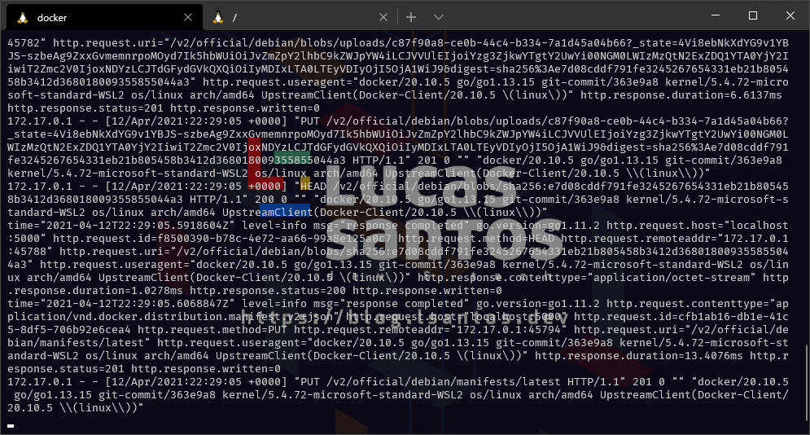

Uma das coisas mais legais do Docker é que você já tem "de fábrica" um repositório gigantesco de imagens que é o Docker Hub para poder baixar a hospedar suas imagens de forma pública (e até mesmo de forma privada, mediante a um pagamento).

Porém muitas vezes o Hub simplesmente não é uma das opções para você, isso pode acontecer quando você não quer tirar as imagens de dentro da sua rede local, do seu firewall ou até mesmo quando você precisa realizar um teste rápido.

Por este motivo o _registry,_ que é a plataforma que utilizamos para armazenar as nossas imagens, possui uma vantagem grande que muitos não sabem, que é ser construido como uma imagem Docker ele mesmo.

Vamos aprender a criar o nosso próprio Docker Registry e armazenar nossas imagens localmente!

## Hospedando o nosso próprio registry

Além das soluções como o [Azure Container Registry](https://azure.microsoft.com/services/container-registry/?WT.mc_id=containers-00000-ludossan), temos a possibilidade de subir a nossa própria instância do Docker registry para continuar a usufruir de uma experiência igual a que já temos com o Docker atualmente.

Primeiramente o que precisamos fazer é executar uma instância local do registry usando [a imagem oficial](https://hub.docker.com/_/registry). Podemos fazer isso com o seguinte comando:

```bash
docker run -d -p 5000:5000 --name docker-registry registry:2.7
```

> Lembrando que o comando anterior vai somente executar o registry com um armazenamento efêmero interno, ou seja, você vai perder suas imagens se pausar o container.  
>   
> Para executar um registry persistente podemos utilizar o mesmo comando, porém com a opção `-v seu/caminho:/var/lib/registry` setada antes do nome da imagem.

A partir de agora podemos mandar qualquer imagem para nosso registro local.

## Trabalhando com imagens

Naturalmente, quando criamos um registry que só é acessível via localhost, como estamos fazendo aqui, não temos por que definir uma senha. Porém, a melhor prática é que, se você for criar um container que seja acessível por mais pessoas fora da sua máquina local, sempre utilize uma senha e autenticação com o seu registry.

Vamos aprender a fazer essa autenticação em outro artigo, porém agora vamos focar em como podemos enviar nossas imagens. Para este exemplo, escolha qualquer imagem do hub e baixe-a em sua máquina com o comando `docker pull <imagem>`, vou utilizar a imagem do Debian.

Toda a imagem Docker deve ser identificada pelo seu nome, de forma que o Docker saiba a qual registry ela se refere, isso pode ser feito na forma de um FQDN: `url.do.registry:porta/repositorio/imagem:tag`.

No nosso caso o registry está rodando localmente na porta 5000, o repositório seria como se fosse um grupo, então vamos criar um grupo chamado `official` e, por fim, a imagem é a do Debian. Logo, nossa imagem terá o nome:

```
localhost:5000/official/debian:latest
```

Vamos taggear a nossa imagem com o comando `docker tag` para poder alterar o nome dela:

```
docker tag debian localhost:5000/official/debian:latest
```

O comando não vai dar nenhuma saída, mas poderemos ver a imagem em `docker image ls`, bem como agora podemos enviar a imagem para o registry com `docker push localhost:5000/official/debian:latest`.

Se buscarmos os logs do container com `docker logs registry` veremos que o nosso registry recebeu a imagem:



Se removermos nossa imagem local com `docker rmi localhost:5000/official/debian:latest`, vamos poder utilizar o comando `docker pull` para poder buscar a imagem do nosso registry local e baixá-la novamente:

```
docker pull localhost:5000/official/debian
```

## Conclusão

O uso do registry é bastante simples, nos próximos artigos vamos explorar como podemos amplificar o uso e deixar nosso registry ainda mais seguro!

Este foi um artigo curto porém que demonstra uma funcionalidade que poucas pessoas sabem sobre o funcionamento do Docker.

Não esqueça de assinar a newsletter e me seguir nas redes sociais para mais conteúdo 😍
