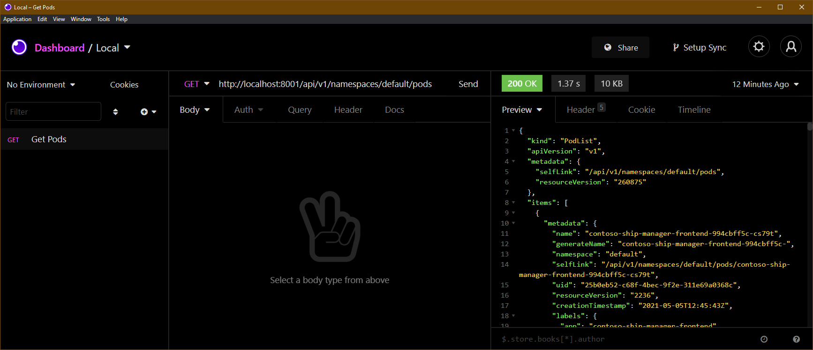
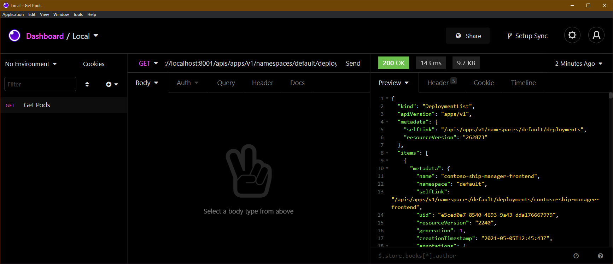
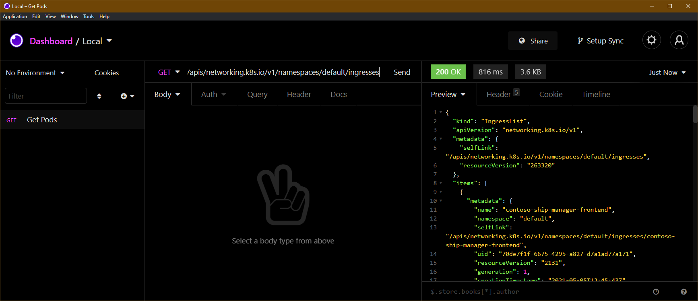

> **NEW!**  
> This is the first post of a new kind of content I'm calling [_drop_](/tags/drop/)_. Drops are small pieces (up to 5 minutes of reading) that show interesting aspects of a subject. Most of the time they'll be small tutorials or interesting tips._  
>   
> The point of these drops is so I can create content more often, instead of putting out a long piece every week, which was getting pretty heavy on me as the blog's only writer and editor._  
>   
> Hope you enjoy it :)

---

One thing almost every dev agrees on is that Kubernetes is pretty complicated. Especially for people who are learning it and just getting into the world of distributed applications and containers.

Even though there are [excellent books](https://amzn.to/3tksp5H) on the subject, the content is still complex and requires people to think a bit outside of what we're used to seeing in a traditional deployment environment. Part of this comes from the fact that we need to configure a lot of extensions, and Kubernetes is [absurdly extensible](https://amzn.to/3b9EELZ), so we end up thinking Kubernetes is one single giant system, when in fact it's made up of several small APIs that manipulate files.

## The big idea

The big idea behind Kubernetes is that everything is a small file, just like unix has shown us before. That's an excellent idea for when we work with extensible configurations.

Simplifying the flow A LOT: when we create a Deployment, a Pod, a Service, what we're actually doing is adding an item to a database (etcd) which is, in turn, watched by a series of _control loops_ that we call _controllers_. And it's these controllers that actually do the work of syncing the desired and existing states of this cluster.

The coolest part of all this is that Kubernetes has a really good API for us to get these resources.

## Understanding the API

The whole Kubernetes API follows the idea of ReST to the letter. So we'll always have a resource that starts like this:

```http
http://<control plane dns>/api/<version>/namespaces/<namespace>/<resource>/[name][?options]
```

First we need to get the address of our control plane. That's super simple, we can just run the command `kubectl cluster-info --context <context name>`.

> The context can be omitted if you want the info for the cluster in the current context.

That will give us an output like this:[^n1]

```output
Kubernetes control plane is running at https://algundns.subdominio.tld:443
CoreDNS is running at https://algundns.subdominio.tld:443/api/v1/namespaces/kube-system/services/kube-dns:dns/proxy
Metrics-server is running at https://algundns.subdominio.tld:443/api/v1/namespaces/kube-system/services/https:metrics-server:/proxy
```

### Security

The Kubernetes API is a simple ReST server, but the security features used to keep your cluster safe, since this API has full control inside the control plane, are pretty elaborate.

Digital certificates tied to [user](/criando-e-gerenciando-usuarios-no-kubernetes/) objects and system [RBAC](/dando-permissoes-a-usuarios-com-kubernetes/) (or even more advanced techniques [like AD](/azure-ad-aks/)) are used to protect the information.

Since we're just putting together a demo, we can use `kubectl` itself to manage this access for us, since it already has all the access data for every cluster. Just run `kubectl proxy &` to start a background process that will port forward the Kubernetes API to a local port, so we can access the API's data without having to worry about permission settings.

```bash
$ kubectl proxy &
[1] 5705
Starting to serve on 127.0.0.1:8001
```

## Working with the API

Now that we have the cluster running locally, you can use whatever request manager you prefer, like cURL, wget, [postman](https://www.postman.com/). I'm using [insomnia](https://insomnia.rest/).

Let's get the list of pods from my cluster using the API with the request `GET http://localhost:8001/api/v1/namespaces/default/pods`:



Some resources, like deployments, aren't part of what we call the Kubernetes "core API". The core API is when we don't need to specify anything in the resource's `apiVersion` field, like with Pods, where it's `apiVersion: v1`, meaning we can access it with `/api/v1`.

Deployments are part of `apps/v1`, so for that we have a new base resource called `apis`, and we can get the list of deployments with `http://localhost:8001/apis/apps/v1/namespaces/default/deployments`:



The same goes for ingresses, which live under `networking.k8s.io/v1beta1` (or `v1`, depending on your cluster's version). So the address is `http://localhost:8001/apis/networking.k8s.io/v1/namespaces/default/ingresses`



> When we're dealing with the `default` namespace, which is the default one, we can drop the `/namespaces/default` part entirely, leaving just `http://localhost:8001/api/v1/pods`.

## Want to know more?

Take a look at the [Kubernetes API documentation](https://kubernetes.io/docs/reference/generated/kubernetes-api/v1.20/), or pass the `-v6` flag to any `kubectl` command to see the path it's calling (if you pass `-v8` you'll also see the response body):

```bash
 $ kubectl get pods -v6
I0506 15:28:38.203647    6011 loader.go:379] Config loaded from file:  /home/khaosdoctor/.kube/config
I0506 15:28:38.796623    6011 round_trippers.go:445] GET https://dominio.subdominio.tld:443/api/v1/namespaces/default/pods?limit=500 200 OK in 580 milliseconds
```

And here's a list of amazing books on Kubernetes you can use to learn more!

https://www.amazon.com.br/gp/product/B07X2MQL1Q/ref=as_li_qf_asin_il_tl?ie=UTF8&tag=lsantosdev0e-20&creative=9325&linkCode=as2&creativeASIN=B07X2MQL1Q&linkId=c7a24400879d4b0f6d8a253d384c82f3

https://www.amazon.com.br/gp/product/B08455LHMY/ref=as_li_qf_asin_il_tl?ie=UTF8&tag=lsantosdev0e-20&creative=9325&linkCode=as2&creativeASIN=B08455LHMY&linkId=d14f51aed9a0a71eb8c2e832a51b5f71

https://www.amazon.com.br/gp/product/8575227785/ref=as_li_qf_asin_il_tl?ie=UTF8&tag=lsantosdev0e-20&creative=9325&linkCode=as2&creativeASIN=8575227785&linkId=b39929203ebd04959db95912ff457c26

https://www.amazon.com.br/gp/product/B088Q38BCR/ref=as_li_qf_asin_il_tl?ie=UTF8&tag=lsantosdev0e-20&creative=9325&linkCode=as2&creativeASIN=B088Q38BCR&linkId=2d0a398b3f5b0c6a290ab240b8af0736

https://www.amazon.com.br/gp/product/B08T21NW4Z/ref=as_li_qf_asin_il_tl?ie=UTF8&tag=lsantosdev0e-20&creative=9325&linkCode=as2&creativeASIN=B08T21NW4Z&linkId=80120ba132817865bb9b7c36e81033b3

[^n1]: This output can vary depending on where you're hosting your cluster.
