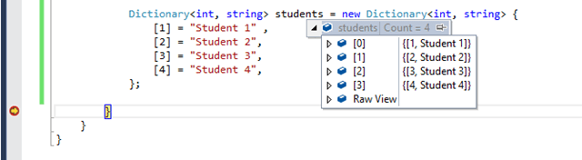

Desde o início da humanidade a gente tenta relacionar coisas em pares de chave e valor, por exemplo, uma lista de convidados de uma festa, listas de chamada de uma turma, contar praticamente qualquer coisa e por aí vai.


La Pascaline, a primeira calculadora mecânica do mundo

Quando as primeiras [máquinas programáveis](https://pt.wikipedia.org/wiki/Pascalina) apareceram lá atrás, junto com as calculadoras mecânicas, surgiu um novo problema: como a gente transforma listas de chaves e valores em uma estrutura computacional que seja fácil de manipular e, ao mesmo tempo, segura?

E foi assim que surgiram os *Hash Maps*.

## E então vieram os maps

Se você já trabalhou com Java, provavelmente já ouviu falar ou até já usou um hash map. Eles são as implementações mais comuns de objetos iteráveis que contêm chaves e valores ou, como também são chamados, *dicionários* (o pessoal de C# surta com esse nome).



Em linguagens fortemente tipadas (como Java e C#), a gente precisa especificar os tipos tanto da chave quanto do valor que vamos guardar (tipo `<int, string>`), mas como fazemos isso em JavaScript? Uma linguagem tão dinâmica que até os próprios programadores têm dificuldade de lidar com ela?

Bom, a resposta pra isso é bem simples: a gente não faz. Como o JavaScript já tem objetos de chave e valor de forma natural (assim como Python e PHP), a gente não precisa fazer nenhum tratamento especial, e isso já cria uma estrutura facilmente iterável. Mas e a segurança?

Um uso bem comum dos maps em JavaScript é quando mapeamos chaves do tipo *string* para um valor arbitrário, como no exemplo abaixo:

```js
let canil = {}

function adicionar (nome, meta) {
  canil[nome] = meta
}

function pegar (nome) {
  return canil[nome]
}

adicionar('Heckle', { cor: 'Preto', raca: 'Dobermann' })
adicionar('Jeckle', { cor: 'Branco', raca: 'Pitbull' })
```

A gente vai criar uma lista de cachorros, óbvio, mas temos um probleminha nesse design de projeto:

- **Segurança**: imagine que uma das chaves se chame `__proto__` ou `toString` ou qualquer outra coisa dentro de `Object.prototype`, aí sim a gente vai ter um problema grande, como eu já falei no meu [artigo sobre protótipos](https://medium.com/trainingcenter/heran%C3%A7a-e-prot%C3%B3tipos-no-javascript-2c1e60e005a2), nunca é uma boa ideia mexer diretamente neles. Além disso, a gente está criando um comportamento praticamente imprevisível no nosso código.
- As iterações sobre esses itens vão ficar bem verbosas com `Object.keys(canil).forEach`, a não ser que você implemente um [iterator](https://medium.com/trainingcenter/iterators-em-javascript-880adef14495), que também é um pouco verboso.
- As chaves ficam limitadas a *strings* simples, então fica complicado criar chaves de outros tipos que não sejam *strings* ou apenas referências.

### A primeira solução

Pra resolver o problema de segurança, a gente simplesmente adiciona um prefixo no começo da chave, o que já faz ela ser diferente de qualquer coisa nativa:

```js
let canil = {}
function adicionar (nome, meta) {
  canil[`map:${nome}`] = meta
}
function pegar (nome) {
  return canil[`map:${nome}`]
}

adicionar('Heckle', { cor: 'Preto', raca: 'Dobermann' })
adicionar('Jeckle', { cor: 'Branco', raca: 'Pitbull' })
```

Mas, por sorte, o ES6 chegou pra resolver os problemas que a gente tinha no ES5.

## Maps no ES6

Com a chegada do ES6 a gente ganhou uma estrutura específica pra lidar com maps. Ela se chama, olha que surpresa, `Map`. Vamos ver como ficaria se convertêssemos o código anterior pra essa nova estrutura:

```js
let map = new Map()
map.set('Heckle', { cor: 'Preto', raca: 'Dobermann' })
map.set('Jeckle', { cor: 'Branco', raca: 'Pitbull' })
```

Bem mais simples, né?

A principal diferença aqui é que a gente pode usar **qualquer coisa** como chave. Não estamos mais limitados a tipos primitivos, dá pra usar funções, objetos, datas, qualquer coisa.

```js
let map = new Map()
map.set(new Date(), function foo () {})
map.set(() => 'chave', { foo: 'bar' })
map.set(Symbol('items'), [1, 2])
```

Óbvio que boa parte dessas coisas não faz muito sentido na prática, mas são modelos possíveis de usar.

A outra mudança significativa é que `Map` é [iterável](https://medium.com/trainingcenter/iterators-em-javascript-880adef14495) e produz uma coleção de valores mais ou menos do tipo `[ ['chave', 'valor'], ['chave', 'valor'] ]`.

```js
let map = new Map([
  [new Date(), function foo () {}],
  [() => 'chave', { foo: 'bar' }],
  [Symbol('items'), [1, 2]]
])
```

Essa é outra forma de inicializar um Map

O código acima é a mesma coisa que usar `map.set` pra cada valor que a gente insere. É meio bobo ficar adicionando os itens um por um quando podemos simplesmente incluir um **iterável inteiro** direto no nosso `map`. O que nos dá o *spread operator* de brinde:

```js
let map = new Map()
map.set('f', 'o')
map.set('o', 'b')
map.set('a', 'r')

console.log([...map]) // [ ['f', 'o'], ['o', 'b'], ['a', 'r'] ]
```

E já que temos o poder do iterator em mãos, dá pra misturar tudo: destructuring, `for ... of`, template literals e por aí vai:

```js
let map = new Map()
map.set('f', 'o')
map.set('o', 'b')
map.set('a', 'r')

for (let [chave, valor] of map) {
  console.log(`${chave}: ${valor}`)
  // 'f: o'
  // 'o: b'
  // 'a: r'
}
```

E agora que a gente já sabe um pouco sobre hash maps, vale falar de uma coisa que talvez não tenha ficado clara de início. Apesar de ter uma API de adição implementada, todas as chaves são únicas, ou seja, se você continuar escrevendo numa mesma chave, ela só vai sobrescrever seu próprio valor:

```
let map = new Map()
map.set('a', 'a')
map.set('a', 'b')
map.set('a', 'c')
console.log([...map]) // [ ['a', 'c'] ]
```

### O caso do NaN

Esse caso é importante de destacar. Acho que todo mundo já sabe que `NaN` é um monstro bem estranho do JavaScript que se comporta de formas bem... exóticas...

"Naturalmente", uma expressão como `NaN !== NaN` vai retornar `true`, ou seja, `NaN` não é igual a `NaN`, e isso normalmente causa essa reação nos programadores:


Mas! No nosso Map, se a gente definir uma chave como sendo `NaN`, o valor dela vai ser `NaN`, ou seja, ele se resolve sozinho:

```js
console.log(NaN === NaN) // false
let map = new Map()
map.set(NaN, 'foo')
map.set(NaN, 'bar')
console.log([...map]) // [[NaN, 'bar']]
```

E essa é a apresentação de um *corner case* bizarro que acontece quando usamos Maps.

## Maps e o DOM

No ES5 a gente tinha um baita problema quando precisava associar um elemento do DOM a uma API. A abordagem padrão era criar um código extenso como o de baixo, que simplesmente retorna um objeto de API com vários métodos que manipulam elementos do DOM, permitindo incluir ou remover eles do cache e pegar o objeto de API do elemento, se ele existir:

```js
let cache = []
function guardar(el, api) {
  cache.push({ el: el, api: api })
}

function encontrar(el) {
  for (i = 0; i < cache.length; i++) {
    if (cache[i].el === el) {
      return cache[i].api
    }
  }
}

function destruir(el) {
  for (i = 0; i < cache.length; i++) {
    if (cache[i].el === el) {
      cache.splice(i, 1)
      return
    }
  }
}

function coisa(el) {
  let api = encontrar(el)
  if (api) {
    return api
  }

  api = {
    metodo: metodo,
    metodo2: metodo2,
    metodo3: metodo3,
    destruir: destruir.bind(null, el)
  }
  guardar(el, api)
  return api
}
```

No ES6, temos a grande vantagem de poder indexar elementos do DOM como chave, então a gente pode simplesmente adicionar o método relacionado a ele num valor, como uma função.

```js
let cache = new Map()

function guardar(el, api) {
  cache.set(el, api)
}

function encontrar(el) {
  return cache.get(el)
}

function destruir(el) {
  cache.delete(el)
}

function coisa(el) {
  let api = encontrar(el)
  if (api) {
    return api
  }

  api = {
    metodo: metodo,
    metodo2: metodo2,
    metodo3: metodo3,
    destruir: destruir.bind(null, el)
  }

  guardar(el, api)
  return api
}
```

O ganho aqui não é só na leitura, mas também em performance. Repare que todos os métodos (ou a maioria deles) agora têm só uma linha de código, o que significa que dá pra deixar eles *inline* sem problema nenhum, economizando espaço de request numa aplicação front-end.

## Outras coisas com Maps

### Symbols

`Maps` são coleções de dados, as famosas *collections* que assombram todo estudante de algoritmo na faculdade. Isso significa que é fácil buscar dentro deles se uma chave existe ou não. Temos o caso exótico do `NaN` que mencionei acima, mas fora isso todos os objetos `Symbol` são tratados de forma diferente, então você vai precisar usá-los por valor:

```js
let map = new Map([[NaN, 1], [Symbol(), 2], ['foo', 'bar']])

console.log(map.has(NaN)) // true
console.log(map.has(Symbol())) // false
console.log(map.has('foo')) // true
console.log(map.has('bar')) // false
```

Viu o que aconteceu? `Symbol` é sempre um objeto único que retorna uma referência, então, contanto que você guarde a referência que o `Symbol` te deu, está tudo certo.

```js
let sym = Symbol()
let map = new Map([[NaN, 1], [sym, 2], ['foo', 'bar']])

console.log(map.has(sym)) // true
```

### Key-Cast

Diferente do nosso modelo inicial, onde só tínhamos chaves do tipo *string*, os *maps* permitem qualquer tipo de informação e não fazem nenhuma conversão desses tipos. A gente pode estar acostumado a transformar tudo em *string*, mas lembre-se que isso não é mais necessário.

```js
let map = new Map([[1, 'a']])

console.log(map.has(1)) // true
console.log(map.has('1')) // false
```

### Clear

A gente pode limpar um `Map` sem perder a referência pra ele, porque é uma coleção, como já mencionado.

```js
let map = new Map([[1, 2], [3, 4], [5, 6]])
map.clear()
console.log(map.has(1)) // false
console.log([...map]) // []
```

### Entries e Iterators

Se você leu [meu artigo sobre iterators](https://medium.com/trainingcenter/iterators-em-javascript-880adef14495), você já deve ter reconhecido `Map` como um modelo de implementação desse protocolo.

Isso quer dizer que você pode iterar pelo `.entries()` dele, mas se estivermos usando `Map` como um *iterable*, isso já vai acontecer de qualquer jeito, então você nem precisa iterar explicitamente, veja que `map[Symbol.iterator] === map.entries` retorna `true`.

Assim como `.entries()`, `Map` tem outros dois métodos que você pode aproveitar, `.keys()` e `.values()`. Basicamente eles se explicam sozinhos...

```js
let map = new Map([[1, 2], [3, 4], [5, 6]])

console.log([...map.keys()]) // [1, 3, 5]
console.log([...map.values()]) // [2, 4, 6]
```

### Size

`Map` também já vem com uma propriedade somente leitura chamada `.size`, que te dá, a qualquer momento, o número de pares do hash map. Funciona basicamente igual ao `Array.prototype.length`.

```js
let map = new Map([[1, 2], [3, 4], [5, 6]])

console.log(map.size) // 3

map.delete(3)
console.log(map.size) // 2

map.clear()
console.log(map.size) // 0
```

### Ordenação

Uma penúltima coisa que vale mencionar é que os pares de um `Map` são iterados na **ordem de inserção**, e não numa ordem aleatória como acontecia com `Object.keys`.

É tanto que a gente usava `for ... in` pra iterar sobre as propriedades de um objeto de uma forma completamente arbitrária.

### Loop

Por fim, temos o já conhecido método `forEach()`, que basicamente faz a mesma coisa que o método análogo do `Array`.

Lembre-se que aqui a gente não tem as chaves como strings.

```js
let map = new Map([[NaN, 1], [Symbol(), 2], ['foo', 'bar']])
map.forEach((valor, chave) => console.log(chave, valor))
// NaN 1
// Symbol() 2
// 'foo' 'bar'
```

# Conclusão

Os Maps vieram mesmo pra salvar a nossa pele quando o assunto é coleções de chave e valor ou dicionários de dados que a gente tinha que manipular de um jeito bem complicado no ES5. Mas a gente precisa ter cuidado e, acima de tudo, conhecer bem a estrutura com a qual está trabalhando, pra não acabar com um objeto de chaves que a gente não entende.

Não esquece de acompanhar mais conteúdo meu no [blog](https://blog.lsantos.dev)!

Espero que tenham gostado, dá uma olhada [nesse artigo aqui](https://ponyfoo.com/articles/es6-maps-in-depth) pra saber mais, eu tirei bastante conteúdo dele e vários exemplos também :)
