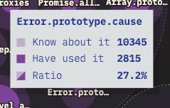

Erros são provavelmente o principal construto de qualquer linguagem de programação. Eles existem em todas elas, a gente tem vários nomes para eles: bugs, erros, exceções, etc.

A ideia do tratamento de erros não é nova, inclusive existem vários guias tanto novos quanto antigos que mostram muito bem como podemos tratar a maioria do que a gente chama de exceções. A ideia desse artigo veio de um [comentário](https://www.linkedin.com/feed/update/urn:li:activity:7018656849465892864?commentUrn=urn%3Ali%3Acomment%3A%28activity%3A7018656849465892864%2C7018885043116765184%29) em um [post no meu LinkedIn](https://www.linkedin.com/posts/lsantosdev_javascript-typescript-js-activity-7018656849465892864-6cmM?utm_source=share&utm_medium=member_desktop):


Isso só se tornou ainda mais real quando vi os resultados da [State of JS 2022](https://2022.stateofjs.com/en-US/features/) que mostrava que, de todas as pessoas que sabiam da funcionalidade do `error.cause`, somente 27% delas usaram em algum momento.



Ou seja, está na hora de a gente aprender muito mais não só sobre o `error.cause`, mas sobre **erros no geral.** Então sem perder mais tempo, bora pra um **guia rápido e prático do que são erros no JavaScript** e como você pode melhorar as suas aplicações fazendo um bom uso deles!

## O que REALMENTE são erros

Quando começamos a programar, os nossos maiores medos estão voltados aos famosos _bugs_! Erros inesperados no sistema. Esses erros são chamados de **exceções** em desenvolvimento, porque são uma parte do código que não estava _programada_, portanto, é uma exceção à programação original.

O ideal seria que todo o código fosse testado de forma que não houvessem erros, mas infelizmente isso não é possível. Não só porque somos humanos e não temos a capacidade de entender totalmente o cenário de algum tipo de problema, mas também porque, com a chegada de computadores mais modernos, a velocidade e a modularidade das aplicações ultrapassou a capacidade inclusive do computador de prever erros que podem acontecer. Mas é importante entender que existe uma diferença entre **erro** e **exceção**.

Uma exceção é um erro que foi levantado pelo programa em execução através de instruções como `throw`, ou seja, o erro em si é o objeto que descreve o que aconteceu, a exceção é o modo de transporte que vamos entregar esse erro. Em outras palavras, o erro contém algo muito importante: o **contexto**, enquanto a exceção é uma descrição geral que pode ou não conter esse contexto.

Já que não podemos nos livrar dos erros, o melhor que podemos fazer é **conviver com eles**, mas não basta aturarmos os erros, o mais importante é a gente saber fazer um bom uso do que é chamado de _exception handling_, ou **tratamento de erros**.

O JavaScript é notório pela sua forma mediana de tratamento de erros, como uma linguagem dinâmica que pode aceitar virtualmente qualquer tipo de valor em suas variáveis, é bastante complicado fixar um tipo de erro, e isso só fica pior quando adicionamos a Web por cima, por exemplo:

```js
const obterValor = async (id) => {
    try {
        const result = await fetch(`https://url.com/${id}`)
        return result.json()
    } catch (error) {
        // ...
    }
}

obterValor(1).then(console.log).catch(console.error)
```

Esse é um exemplo simples, mas a variável `error` ali pode receber vários tipos de erros, um deles pode ser um erro de conexão com o site, outro pode ser que o recurso não existe (portanto seria um erro HTTP), podemos ter um erro ao obter o conteúdo e transformá-lo em JSON (o que seria um erro de parsing), e por ai vai.

Mas isso já existe há anos, como fazemos para lidar com a maioria desses erros?

### Lidando com múltiplos erros

Existem diversas formas de lidarmos com esses erros, uma das mais comuns – tão comum que está nos [exemplos da MDN](https://developer.mozilla.org/en-US/docs/Web/JavaScript/Reference/Global_Objects/Error#differentiate_between_similar_errors) – é tratar a mensagem do erro com um `switch`, como esse aqui:

```js
function doWork() {
  try {
    doFailSomeWay();
  } catch (err) {
    throw new Error("Failed in some way");
  }
  try {
    doFailAnotherWay();
  } catch (err) {
    throw new Error("Failed in another way");
  }
}

try {
  doWork();
} catch (err) {
  switch (err.message) {
    case "Failed in some way":
      handleFailSomeWay(err);
      break;
    case "Failed in another way":
      handleFailAnotherWay(err);
      break;
  }
}
```

Essa é provavelmente a **pior** forma possível de lidar com erros distintos. Isto porque uma única vírgula errada ou algum tipo de erro de escrita vai alterar o seu código drasticamente, mas infelizmente o campo de mensagem é um dos poucos campos que temos que pode dizer alguma coisa ou diferenciar um erro do outro, ou será que não?

Existe uma outra forma de lidarmos com erros que é um pouco mais elegante (e muito menos dependente do que você escreve na mensagem de erro), que é estender a classe `Error` do JavaScript e adicionar os seus próprios campos. Este é meu modelo pessoalmente preferido.

Vamos voltar ao nosso exemplo anterior, imagine que nossa API pode retornar um erro de usuário, podemos descrever esse erro dessa forma:

```js
class UserNotFoundError extends Error {
    constructor (userId) {
        super(`The user was not found`)
        this.id = userId
        this.status = 404
        this.statusMessage = 'Not Found'
    }
}

throw new UserNotFoundError(45)
```

E ai podemos verificar esse erro dessa forma:

```js
const obterValor = async (id) => {
    try {
        const result = await fetch(`https://url.com/${id}`)
        return result.json()
    } catch (error) {
        if (error instanceof UserNotFoundError) {
            // retornar a resposta do erro com 404
        }
        // se não, retornamos o erro normalmente
    }
}

obterValor(1).then(console.log).catch(console.error)
```

Mas esse é um erro de chamada HTTP, ou seja, podemos ter muito mais erros como essesPodemos ir ainda mais a fundo e criar uma classe base para todos os erros que são relacionados à HTTP. Isso faria sentido porque todos os erros HTTP vão ter as mesmas propriedades como `status` e `statusMessage`, por que não fazemos assim:

```js
class HTTPError extends Error {
    constructor(message, status, statusMessage, context) {
        super(message)
        this.status = status
        this.statusMessage = statusMessage
        this.context = context
    }
}

class UserNotFoundError extends HTTPError {
    constructor (userId) {
        super(`The user was not found`, 404, 'Not Found', {userId})
    }
}

throw new UserNotFoundError(45)
```

Dessa forma podemos criar um tratamento automático para qualquer erro HTTP desse jeito:

```js
const obterValor = async (id) => {
    try {
        const result = await fetch(`https://url.com/${id}`)
        return result.json()
    } catch (error) {
        if (error instanceof HTTPError) {
            res.status = error.status
            res.json({ message: error.message, context: error.context })
            return
        }
        // se não, retornamos o erro normalmente
    }
}

obterValor(1).then(console.log).catch(console.error)
```

Podemos extrapolar esse modelo para criar o que chamamos de `errorMappers`, que são essencialmente grandes `switch` que vão nos dar a resposta do usuário de acordo com um erro de entrada, um exemplo é [esse arquivo que eu fiz para o gerador de capas aqui do blog](https://github.com/khaosdoctor/article-cover-creator/blob/main/src/presentation/api/utils/errorMapper.ts).

Quando estamos lidando com um erro de cada vez, está tudo certo, o problema é quando temos que encadear esses erros, e agora?

## Contexto e encadeamento

Uma palavra que eu trouxe no início do artigo foi **contexto**, mas a gente não chegou a falar muito sobre ele ainda, e agora é o momento de dizer que **a parte mais importante em um erro é o seu contexto**.

É extremamente difícil de debugar algum tipo de erro quando não se tem contexto do que está acontecendo. Quase todo dev já teve que lidar com alguém dizendo "Está dando um erro aqui", e ai a primeira pergunta é "Qual erro? O que é isso?", isto porque a maioria (se não todos) os erros estão intimamente ligados com algum tipo de contexto próprio que facilita a sua resolução em 90%.

Idealmente, as mensagens de erros devem ser strings fixas, não devendo conter nenhum tipo de informação dinâmica, como fizemos nos erros acima, se você perceber, nosso `HTTPError` e o nosso `UserNotFoundError` ambos possuem um campo de mensagem, no caso da classe filha `UserNotFoundError` a mensagem não é nem editável.

Também temos campos extras como `statusCode`, `statusMessage` e `id` onde setamos as informações relativas ao contexto daquele erro, mas como fazemos para passar isso para frente? É ai que entra o `error.cause`

### Error.cause

O `error.cause` é uma proposta [relativamente recente do TC39](https://github.com/tc39/proposal-error-cause) que propõe a padronização da classe `Error` adicionando um campo extra opcional chamado `cause`, esse campo pode ser uma outra instância de `Error` ou qualquer tipo de objeto estruturado. Agora, a classe erro teria a seguinte assinatura:

```ts
interface ErrorOptions {
	cause?: Record<string, any> | Error
}

class Error {
    constructor (
    	public readonly message: string,
        public readonly options: ErrorOptions
    ) {}
    
    get cause () {
    	return this.options.cause
    }
}
```

Para entender o motivo de termos um novo campo `cause` nas classes de erro, é mais fácil dar um exemplo. Vamos começar simples, imagine que temos uma API que pode nos dar 3 tipos de erros: o erro da própria API, um erro específico de um tipo de recurso e outro erro que é específico de outro tipo de recurso. O jeito tradicional seria fazer algo assim:

```js
const apiFetch = async (objectName) => {
  await fetch(url + "/" + objectName);
};

const main = async () => {
  try {
    await apiFetch(foo);
  } catch (error) {
    throw new Error("An error has occured while trying to fetch foo");
  }

  try {
    await apiFetch(bar);
  } catch (error) {
    throw new Error("An error has occured while trying to fetch bar");
  }
};
```

Dessa forma teríamos uma mensagem para cada tipo de erro, mas vamos perder o contexto de ambos, então como adicionamos o objeto de contexto sem mudar a mensagem? Com o `error.cause`:

```js
const apiFetch = async (objectName) => {
  await fetch(url + "/" + objectName);
};

const main = async () => {
  try {
    await apiFetch(foo);
  } catch (error) {
    throw new Error("An error has occured while trying to fetch foo", { cause: error });
  }

  try {
    await apiFetch(bar);
  } catch (error) {
    throw new Error("An error has occured while trying to fetch bar", { cause: error });
  }
};
```

Agora temos, junto ao erro, um motivo pelo qual esse erro aconteceu, que pode conter um `stackTrace` e outros dados estruturados que podemos passar. Nossa saída vai passar de algo assim:

```
Error: An error has occured while trying to fetch foo
```

Para algo assim:

```
 Error: An error has occured while trying to fetch foo
   [cause]: Error: 401 - Unauthorized - Token Expired
```

Viu como fica muito mais fácil de entender o que está acontecendo? Nessa caso estamos passando a própria instancia do erro no `cause`, mas podemos passar qualquer tipo de objeto estruturado, como você pode ver [aqui](https://developer.mozilla.org/en-US/docs/Web/JavaScript/Reference/Global_Objects/Error/cause#providing_structured_data_as_the_error_cause).

\<as se tivermos os dois erros ao mesmo tempo, vamos ter que executar a API duas vezes para descobrir, já que vamos dar `throw` em um erro de cada vez, a ideia aqui seria encadear os erros. E ai mais uma vez o `cause` pode ser útil, mas vamos ter que fazer uma modificação no nosso código:

```js
const apiFetch = async (objectName) => {
  await fetch(url + "/" + objectName)
}

const main = async () => {
  try {
    let errors = []
    try {
      await apiFetch(foo)
    } catch (error) {
      errors.push(new Error("An error has occured while trying to fetch foo", { cause: error }))
    }
  
    try {
      await apiFetch(bar)
    } catch (error) {
      errors.push(new Error("An error has occured while trying to fetch bar", { cause: error }))
    }

    if (errors.length > 0) throw new Error("Error when fetching the API", { cause: errors })
  } catch (err) {
    errors.push(err)
    throw new Error("Error when fetching the API", { cause: errors })
  }
}
```

Ou até mesmo, mais simplificado:

```js
const apiFetch = async (objectName) => {
  await fetch(url + '/' + objectName)
}

const main = async () => {
  let errors = []
  try {
    await apiFetch(foo)
  } catch (error) {
    errors.push(new Error('An error has occured while trying to fetch foo', { cause: error }))
  }

  try {
    await apiFetch(bar)
  } catch (error) {
    errors.push(new Error('An error has occured while trying to fetch bar', { cause: error }))
  }

  if (errors.length > 0) throw new Error('Error when fetching the API', { cause: errors })
}
```

Agora, quando printarmos a nossa mensagem da seguinte forma:

```js
main()
.catch(e => console.log(e, { 
  cause: e.cause.map(e => ({ message: e.message, cause: e.cause})) 
}))
```

Vamos ter a seguinte saída, caso tenhamos um erro nas nossas APIs:

```
[Error: Error when fetching the API] { 
  cause: [ 
     { message: 'An error has occured while trying to fetch foo',
       cause: [ReferenceError: foo is not defined] },
     { message: 'An error has occured while trying to fetch bar',
       cause: [ReferenceError: bar is not defined] } 
   ] 
}
```

Veja que temos muito mais contexto e muito mais ideia do que aconteceu em todas as partes do erro, e não só o que está acontecendo nos últimos erros. Isso é particularmente útil quando estamos usando **microsserviços**, já que podemos ter um erro em qualquer parte de uma cadeia de chamadas, cada um desses erros deveria retornar uma causa, de forma que podemos encadear todos os erros que aconteceram e entender exatamente aonde o erro aconteceu.

## Conclusão

Tratamento de erros em qualquer linguagem não é algo simples, e o mais difícil é conseguir a **consistência** necessária para fazer com que todos os erros retornem da mesma forma, por isso que bibliotecas padronizadas de erros como o [Boom](https://github.com/hapijs/boom) são tão importantes.

Espero que, com esse artigo, eu tenha conseguido clarear um pouco mais as ideias sobre os usos do `error.cause` e também dos tratamentos de erros usando JavaScript! Até mais!
