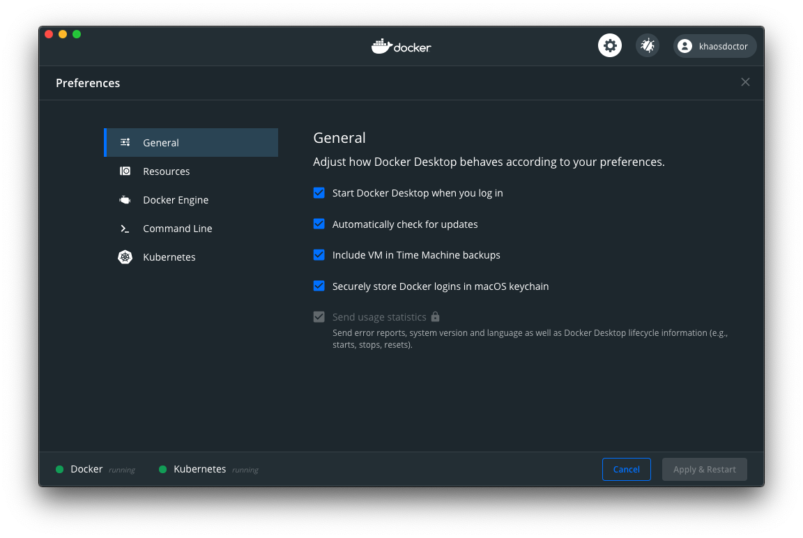
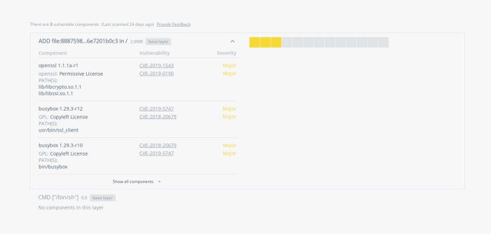

Se você já utiliza Docker então, provavelmente, já executou um container em sua máquina. Porém, já imaginou como seria se você pudesse executar diretamente um container em uma infraestrutura cloud sem precisar fazer nada novo?

No mês passado o time do Docker [anunciou](https://www.docker.com/blog/running-a-container-in-aci-with-docker-desktop-edge/) que as novas versões do Docker para desktop (chamadas de versões _Edge_) estariam ganhando o suporte **nativo** aos **[Azure Container Instances](https://azure.microsoft.com/services/container-instances/?WT.mc_id=personal-blog-ludossan)**, ou seja, poderíamos rodar containers da nossa máquina diretamente para um ambiente cloud sem precisar baixar nenhuma imagem localmente!

## Azure Container Instances

Os [Azure Container Instances](https://azure.microsoft.com/services/container-instances/?WT.mc_id=personal-blog-ludossan) (ACI) é um dos produtos oferecidos pela [Azure](https://docs.microsoft.com/azure/container-instances/?WT.mc_id=personal-blog-ludossan) que permitem que você faça o deploy de uma aplicação em um container sem se preocupar com máquinas virtuais ou qualquer outro tipo de infraestrutura.

Já cheguei a utilizar o [ACI](https://docs.microsoft.com/azure/container-instances/?WT.mc_id=personal-blog-ludossan) quando realizamos uma talk para o #CodeInQuarentena. No vídeo abaixo você pode ver o vídeo onde criamos uma API completa utilizando Mongoke e [ACI](https://docs.microsoft.com/azure/container-instances/?WT.mc_id=personal-blog-ludossan)


Essencialmente, o [ACI](https://docs.microsoft.com/azure/container-instances/?WT.mc_id=personal-blog-ludossan) é uma forma de você rodar sua aplicação como um container online. Dessa forma a única coisa que você precisa ter é uma [conta na Azure](https://azure.microsoft.com/free/search?WT.mc_id=personal-blog-ludossan) e uma aplicação que já esteja dentro de um container. O melhor é que isso é tudo cobrado pelo **segundo** de uso, então você realmente não para por computação ociosa. O que é excelente para aplicações que precisam ser criadas e destruídas rapidamente.

Mas como o [ACI](https://docs.microsoft.com/azure/container-instances/?WT.mc_id=personal-blog-ludossan) pode ser integrado com o Docker?

## Integrando o ACI com o Docker

Vamos realizar a nossa integração entre o Docker e o [ACI](https://docs.microsoft.com/azure/container-instances/?WT.mc_id=personal-blog-ludossan). Assumindo que você já possua uma [conta na Azure](https://azure.microsoft.com/free/search?WT.mc_id=personal-blog-ludossan) e já conheça um pouco sobre Docker, o que você precisa fazer é **baixar o Docker Edge**.

### Docker Edge

O Docker Edge é uma versão experimental do Docker que recebe todas as atualizações que ainda não foram disponibilizadas na versão de disponibilidade geral. Para que a integração com o [ACI](https://docs.microsoft.com/azure/container-instances/?WT.mc_id=personal-blog-ludossan) aconteça, como ela ainda é uma flag experimental, temos que baixar a versão Edge do Docker, [este repositório](https://github.com/docker/aci-integration-beta#macos-and-windows-installation) tem todos os links necessários para instalação em várias plataformas.

> Se você **já** tem o Docker instalado na sua máquina, você precisará remover a versão CE oficial e instalar o Docker Edge. Não é possível ter ambas as versões instaladas na mesma máquina.

Uma vez que o Docker estiver instalado, você deverá ver esta tela:



Veja na aba `Command Line` se você possui a opção `Enable Cloud Experience` ativada:


Com isto você já tem a integração ativa, agora o que precisamos fazer é criar um contexto!

### Docker Context

Os [contextos do Docker](https://docs.docker.com/engine/context/working-with-contexts/) não são uma funcionalidade nova. O objetivo dos contextos é permitir que você possa alterar o local de onde você está trabalhando. Isto é muito interessante depois do advento do [Kubernetes para Docker](https://docs.docker.com/docker-for-windows/kubernetes/), pois com os contextos você pode alterar entre o uso do Docker engine, do Kubernetes dentro do Docker ou até mesmo de um contexto do Docker Swarm.

Com o [ACI](https://docs.microsoft.com/azure/container-instances/?WT.mc_id=personal-blog-ludossan) não é diferente, temos que criar um contexto para a integração com a cloud! Isso é bastante simples, primeiro temos que logar na Azure através do seguinte comando:

```bash
$ docker login azure
```

Após isto, você será levado ao site da Azure para realizar o login, uma vez que ele for completado, você poderá voltar para o CLI e executar o seguinte comando:

```bash
$ docker context create aci nome-do-contexto
```

Em seguida você terá de escolher a sua subscription e depois o resource group que será utilizado para subir as imagens. Uma vez terminado, você poderá rodar o comando `docker context ls` para ver todos os contextos existentes e a sua integração está completa!

## Criando um container

Para podermos executar este exemplo, vamos usar uma imagem pública que tenho no Docker Hub, chamada [Simple Node API](https://hub.docker.com/repository/docker/khaosdoctor/simple-node-api).

Vamos começar trocando o nosso contexto para o novo contexto criado através do comando `docker context use <nome-do-contexto>`.

Para fazermos o deploy, podemos rodar o comando que estamos acostumados, o `docker run`:

```bash
$ docker run -d -p 80:80 --name node-api -e PORT=80 khaosdoctor/simple-node-api
```

Veja o output que vamos ter:

Para conseguirmos buscar o caminho que devemos acessar para vermos a nossa API online, vamos executar um `docker ps` e buscar os conteúdos de `PORTS`.

Veja que tenho que acessar o IP `13.86.141.148` para poder ver o resultado da API no browser, vamos lá!


Veja que, se acessarmos o portal da Azure, vamos ter o nosso recurso criado como se tivéssemos criado manualmente!


Para removermos, basta executar o comando `docker rm <nome>`, veja que não é possível executar o comando `docker stop` porque este tipo de integração não permite que paremos o container remotamente. Se digitarmos `docker rm node-api` vamos ter o nosso ACI removido da azure e o nosso container parado!

## Outras aplicações

Podemos utilizar também o ACI para criar aplicações multi-container usando o Docker Compose. Para isto, vamos utilizar o próprio exemplo que a Docker nos dá do site da DockerCon! Temos o seguinte arquivo YAML:

```yaml
# docker-conpose.yaml
version: '3.3'

services:
  db:
    image: bengotch/acidemodb
  
  words:
    image: bengotch/acidemowords
  
  web:
    image: bengotch/acidemoweb
    ports:
      - "80:80"
```

Fazemos o mesmo processo. Porém, ao invés de rodar o comando `docker run` vamos rodar o comando `docker compose up -d`.

> Note que não temos um `-` entre o `docker` e o `compose` como era de se esperar quando estamos rodando o comando localmente. Porque o `compose` é um comando da integração em si!

Depois podemos utilizar o comando `docker ps` normalmente para pegar o IP público e ver o site no ar:



### Limitações

-   O ACI não suporta mapeamento de portas, portanto você precisa ter certeza de que seu container está rodando na mesma porta no host e no container através da flag `-p porta:porta` (veja [esta issue](https://github.com/docker/aci-integration-beta/issues/5))
-   Nem todos os comandos presentes no docker estão presentes na integração (veja [esta outra issue](https://github.com/docker/aci-integration-beta/issues/4) para mais detalhes)

## Conclusão

Com a integração do ACI podemos integrar muito mais rápido com a Azure e isso facilita muito o desenvolvimento de aplicações voltadas para a cloud! Experimente você também!

Não se esqueça de se inscrever na newsletter aqui embaixo para mais conteúdo exclusivo e notícias semanais! Curta e compartilhe seus feedbacks nos comentários logo após o post!

Até mais.
