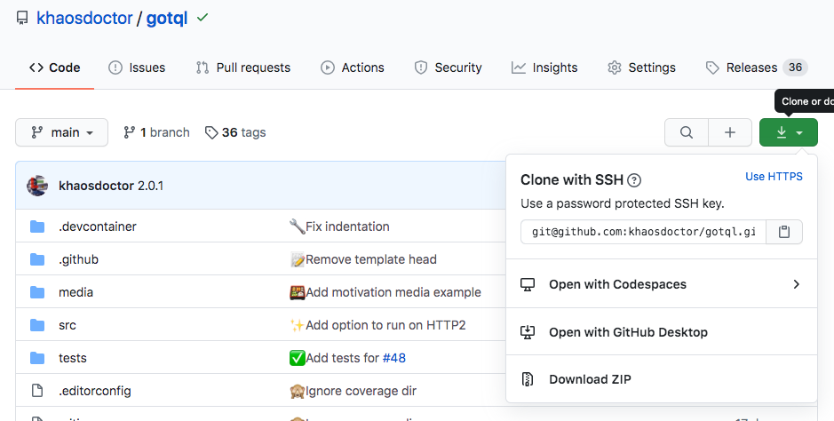

O sonho de qualquer pessoa que trabalha com tecnologia é estar sempre com o seu melhor amigo, o seu computador. Existem diversas soluções que transformam pequenos dispositivos como [Raspberry Pis](https://www.raspberrypi.org/) em computadores completos, outras soluções criam pequenos computadores de bolso que podem ser acessados a todo o momento.

Existem vários motivos para alguém precisar – ou apenas gostar – de estar com um computador ao seu lado o tempo todo. Muitas vezes a pessoa prefere ter uma ferramenta super poderosa sempre a mão para eventuais problemas ou até mesmo desenvolver aquela ideia que teve no meio da rua. Em outros casos mais especiais, a pessoa pode ser uma das mantenedoras de projetos críticos e precisa estar sempre disposta a resolver eventuais problemas, isto tira a liberdade de locomoção, possuir um dispositivo destes faz com que a pessoa possa ganhar sua mobilidade de volta.

Podemos ter as melhores máquinas portáteis, porém nenhum computador se iguala ao nosso próprio, com nossos ambientes e com nossas configurações.

## Codespaces

<Figure src="./faca-codigo-em-qualquer-lugar-com-os-codespaces/image.png" alt="" caption="Tela de abertura do site do GitHub Codespaces" wide />

Recentemente o GitHub em seu evento [Satellite 2020](https://github.blog/2020-05-06-new-from-satellite-2020-github-codespaces-github-discussions-securing-code-in-private-repositories-and-more/#codespaces) o lançamento de uma nova funcionalidade na plataforma, os [Codespaces](https://github.com/features/codespaces). No momento, ela está disponível somente mediante a requisição de acesso antecipado pelo site. Porém, você pode ser um dos que recebeu acesso recentemente e poderá acessar essa incrível facilidade!

> Por enquanto o Codespaces do GitHub está em beta e você pode não ter a funcionalidade habilitada. Então você não conseguirá ver o que mostrarei a seguir, porém você poderá se cadastrar diretamente no site para receber um acesso antecipado.

Os codespaces são uma implementação online do [Visual Studio Code](https://code.visualstudio.com/?WT.mc_id=personal-blog-ludossan). Por ser um editor baseado em tecnologias web, o VSCode tem a incrível facilidade de ser um dos poucos projetos que podem ser portados entre plataformas de forma extremamente fácil.

Isso já havia sido feito antes com o [Code Server](https://github.com/cdr/code-server) – nós até chegamos a utilizar uma implementação interessante criada pelo [Alejandro Oviedo](https://dev.to/a0viedo/how-to-bootstrap-your-nodeschool-event-3cin), nosso colega da Argentina, no [Nodeschool SP](https://nodeschool.io/saopaulo/) – porém um dos grandes problemas do Code Server eram que a loja de extensões não suportava todas as extensões existentes para o VSCode e também que o editor se confundia quando utilizávamos teclados com layouts diferentes.

A grande vantagem que o GitHub Codespaces (GH Codespaces ou GHC) trouxe é que ele é integrado diretamente ao GitHub, ou seja, você pode abrir **qualquer** repositório que você tenha permissão de escrita em um editor pronto na web! Veja um exemplo do meu repositório [GotQL](https://github.com/khaosdoctor/gotql):

<Figure src="./faca-codigo-em-qualquer-lugar-com-os-codespaces/image-1.png" alt="" caption="Tela de clonagem de um repositório do GitHub mostrando o botão &quot;Open with Codespaces&quot;" />

E tudo isso é **grátis**, tanto para repositórios pagos quanto para privados.

### Como funciona

Os Codespaces são construídos em cima de uma outra solução já existente da Microsoft chamada [Visual Studio Codespaces](https://online.visualstudio.com/?WT.mc_id=personal-blog-ludossan) (VSC), que é uma excelente alternativa paga ao GH Codespaces quando você está procurando algo mais aberto, isto porque os VS Codespaces criam uma [máquina virtual na Azure](https://azure.microsoft.com/services/virtual-machines/?WT.mc_id=personal-blog-ludossan) e conectam-se a ela através da funcionalidade nativa do VSCode chamada [**Remote Development**](https://code.visualstudio.com/docs/remote/remote-overview)**.**

O Remote Development se conecta a um outro computador rodando um pequeno servidor do outro lado. Ou seja, você consegue separar o processamento do editor, da interface. Dessa forma você consegue praticamente rodar o VSCode em qualquer lugar, porque todo o browser que suporte JavaScript mais recente consegue executar a interface do editor.

E então unimos outra tecnologia sensacional que são os **containers**. Como você já deve ter visto [aqui mesmo no blog](/executando-containers-no-azure-container-instancies-com-docker/?utm_source=blog&utm_medium=post&utm_campaign=codespaces), os containers são uma tecnologia incrível que permite que você rode praticamente todas as aplicações de forma auto contida sem dependender de bibliotecas externas. Os Codespaces tiram muitas vantagens disso principalmente para que eles possam construir as imagens das máquinas que vão executar.

Dessa forma podemos ter um container que contém todas as ferramentas necessárias para o nosso projeto rodar, porque ele é **completamente customizável**.

## Visual Studio Codespaces

<Figure src="./faca-codigo-em-qualquer-lugar-com-os-codespaces/image-2.png" alt="" caption="Tela de abertura do Visual Studio Codespaces" wide />

Antes de mergulharmos no GitHub Codespaces, vou mostrar como podemos utilizar os [VS Codespaces](https://online.visualstudio.com/?WT.mc_id=personal-blog-ludossan) para criar um ambiente de desenvolvimento remoto, para que possamos entender com o que estamos lidando

Depois de fazer o login e criar sua instância do VSC, vamos criar um novo codespace:

<Figure src="./faca-codigo-em-qualquer-lugar-com-os-codespaces/image-3.png" alt="" caption="Botão de criação para um Visual Studio Codespace" />

E, após clicarmos no botão "Create Codespace", as coisas começam a ficar interessantes, pois começamos a ter uma série de opções sensacionais que podem ser ativadas:

<Figure src="./faca-codigo-em-qualquer-lugar-com-os-codespaces/image-4.png" alt="" caption="Tela de opções do Visual Studio Codespaces" />

A primeira opção é bem simples, temos que dar um nome para nosso codespace, será o nome que vamos identificar essa máquina, então precisa ser um nome bem descritivo.

Depois, temos a opção mais interessante, o próprio VSC já permite que começemos um Codespace a partir de outro repositório do GitHub, ou seja, o próprio GH Codespaces é uma interface diferente para os VSCs.

A partir daí temos a configuração das nossas VMs, então podemos escolher o quão forte a nossa máquina remota vai ser e também quanto tempo de ociosidade ela pode ter antes de se suspender para não gastar.

E então entramos na parte mais legal! Podemos definir o que são chamados de _dotfiles_, que são os arquivos de configuração do nosso shell. Dessa forma, nós podemos ter um repositório separado de dotfiles – como [eu tenho](https://github.com/khaosdoctor/.dotfiles) – e um script para instalar estes dotfiles na nossa máquina online, ou seja, podemos replicar exatamente o que temos no nosso computador local em uma interface web!

<Figure src="./faca-codigo-em-qualquer-lugar-com-os-codespaces/image-5.png" alt="" caption="Visual Studio Codespace online" />

## GitHub Codespaces

Com o GHC é exatamente a mesma coisa! A única ação diferente que você terá de fazer será entrar em um repositório – como o [GotQL](https://github.com/khaosdoctor/gotql) – clicar no botão verde que seria o "clonar". Então clicar em "open with codespace":

<Figure src="./faca-codigo-em-qualquer-lugar-com-os-codespaces/image-6.png" alt="" caption="Abrindo um novo repositório com codespace" />

Todos os usuários beta tem direito a 2 codespaces gratuitos. Ou seja, você pode manter até 2 máquinas de desenvolvimento sem pagar absolutamente nada. Depois, você precisará remover as antigas para criar novas. No exemplo do GotQL, temos a opção de abrir com o Codespaces, esta ação já vai criar um ambiente **pronto** para desenvolvimento, com todas as dependências instaladas



Mas como fazemos isso?

## Personalização

Uma das funcionalidades mais legais dos codespaces é o fato de que eles são **completamente personalizáveis**.

No caso dos dotfiles, você pode configurar tanto o seu VSCode local (o editor instalado na sua máquina) para buscar uma série de arquivos conforme [esta documentação](https://docs.microsoft.com/visualstudio/codespaces/reference/personalizing?WT.mc_id=personal-blog-ludossan) explica ou, no caso do GitHub, você pode ter diretamente um repositório chamado `dotfiles`, como a [documentação](https://docs.github.com/en/github/developing-online-with-codespaces/personalizing-codespaces-for-your-account) do GitHub explica.

Porém você pode fazer mais do que isso com uma pasta chamada `.devcontainer`. O que esta pasta faz é agrupas as configurações possíveis para um codespace. Nela podemos ter um arquivo **Dockerfile**, um arquivo chamado `devcontainer.json` e um arquivo `sh` que seria a configuração da shell do nosso ambiente. Quando criarmos um codespace a partir de um repositório, o GitHub irá buscar esta pasta no repositório e irá criar o codespace de acordo com ela.

Vamos ver o exemplo do `.devcontainer` do [GotQL](https://github.com/khaosdoctor/gotql/tree/main/.devcontainer). Nós temos um Dockerfile, ele é o responsável por dizer qual tipo de container, ou qual tipo de ambiente vamos ter, será nele que vamos instalar pacotes, criar usuários e etc. Bem como escolher a imagem do nosso sistema operacional base.

```Dockerfile
FROM mcr.microsoft.com/vscode/devcontainers/javascript-node:14

# The javascript-node image includes a non-root node user with sudo access. Use 
# the "remoteUser" property in devcontainer.json to use it. On Linux, the container 
# user's GID/UIDs will be updated to match your local UID/GID when using the image
# or dockerFile property. Update USER_UID/USER_GID below if you are using the
# dockerComposeFile property or want the image itself to start with different ID
# values. See https://aka.ms/vscode-remote/containers/non-root-user for details.
ARG USERNAME=node
ARG USER_UID=1000
ARG USER_GID=$USER_UID

# Alter node user as needed, install tslint, typescript. eslint is installed by javascript image
RUN if [ "$USER_GID" != "1000" ] || [ "$USER_UID" != "1000" ]; then \
        groupmod --gid $USER_GID $USERNAME \
        && usermod --uid $USER_UID --gid $USER_GID $USERNAME \
        && chmod -R $USER_UID:$USER_GID /home/$USERNAME \
        && chmod -R $USER_UID:root /usr/local/share/nvm /usr/local/share/npm-global; \
    fi \
    #
    # Install tslint, typescript. eslint is installed by javascript image
    && sudo -u ${USERNAME} npm install -g tslint typescript gitmoji-cli
```

Então, quando um codespace do GotQL for criado, será esse o ambiente que vamos ter, um ambiente com um usuário não root com acesso ao sudo e o tslint e TypeScript já instalados. Também adicionei o `gitmoji-cli` que é o padrão de commits que uso neste projeto.

Depois, temos o arquivo `devcontainer.json`, que é o responsável não só por setar as configurações do nosso editor mas também por dar as direções para o construtor do codespace. Nele definimos o nome do codespace, as extensões que nosso VSCode online terá logo que for iniciado, qual é o Dockerfile que ele precisará usar para construir a base do sistema e também podemos sobrescrever as configurações do próprio VSCode.

```jsonc
{
  "name": "TypeScript website codespace",
  "extensions": [
    "emmanuelbeziat.vscode-great-icons",
    "dbaeumer.vscode-eslint",
    "oderwat.indent-rainbow",
    "vtrois.gitmoji-vscode",
    "dracula-theme.theme-dracula",
    "2gua.rainbow-brackets",
    "ms-vscode.vscode-typescript-tslint-plugin"
  ],
  "dockerFile": "Dockerfile",
  // Set *default* container specific settings.json values on container create.
  "settings": { 
    "terminal.integrated.shell.linux": "/bin/bash",
    "window.autoDetectColorScheme": true,
    "workbench.preferredDarkColorTheme": "Dracula",
    "editor.renderWhitespace": "boundary",
    "workbench.colorTheme": "Dracula",
    "workbench.iconTheme": "vscode-great-icons"
  },
  // Use 'postCreateCommand' to run commands after the container is created.
  "postCreateCommand": "npm install"
}
```

Além disso temos a adição de um `postCreateCommand`, que é extremamente útil para rodar comandos **depois** que o codespace foi criado, neste caso estamos rodando o comando `npm install`, pois assim já teremos todos os pacotes instalados quando abrirmos.

Também temos um excelente [repositório de exemplos](https://github.com/codespaces-examples) de codespaces que podem servir de base para que você possa criar os seus. Vamos buscar o arquivo `setup.sh` do [exemplo de codespace para Node](https://github.com/codespaces-examples/node/tree/main/.devcontainer)

```sh
## update and install some things we should probably have
apt-get update
apt-get install -y \
  curl \
  git \
  gnupg2 \
  jq \
  sudo \
  zsh

## set-up and install yarn
curl -sS https://dl.yarnpkg.com/debian/pubkey.gpg | apt-key add -
echo "deb https://dl.yarnpkg.com/debian/ stable main" | tee /etc/apt/sources.list.d/yarn.list
apt-get update && apt-get install yarn -y

## install nvm
curl -o- https://raw.githubusercontent.com/nvm-sh/nvm/v0.35.3/install.sh | bash

## setup and install oh-my-zsh
sh -c "$(curl -fsSL https://raw.githubusercontent.com/robbyrussell/oh-my-zsh/master/tools/install.sh)"
cp -R /root/.oh-my-zsh /home/$USERNAME
cp /root/.zshrc /home/$USERNAME
sed -i -e "s/\/root\/.oh-my-zsh/\/home\/$USERNAME\/.oh-my-zsh/g" /home/$USERNAME/.zshrc
chown -R $USER_UID:$USER_GID /home/$USERNAME/.oh-my-zsh /home/$USERNAME/.zshrc
```

Este arquivo é referenciado dentro do Dockerfile, sendo executado assim que é iniciado.

## Conclusão

Os codespaces podem se tornar uma das principais tecnologias que temos atualmente, principalmente pelo fato de que eles permitem uma edição ou então até mesmo um desenvolvimento mais complexo utilizando aparelhos móveis como o celular.

Muitos programadores já utilizavam soluções baseadas no Docker para [programar no ipad](https://arslan.io/2019/01/07/using-the-ipad-pro-as-my-development-machine/), porém estas soluções acabavam sempre sendo mais como "gambiarras" do que soluções propriamente ditas.

Com o surgimento de tecnologias e funcionalidades como estas, temos a capacidade de levar nosso ambiente de trabalho para qualquer lugar. Fiquem ligados nos próximos artigos onde vou explicar como montei meu ambiente de trabalho remoto usando o GHC!

Até mais!
