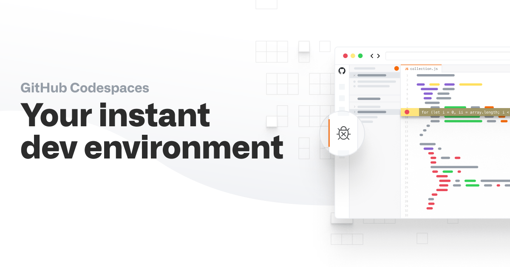
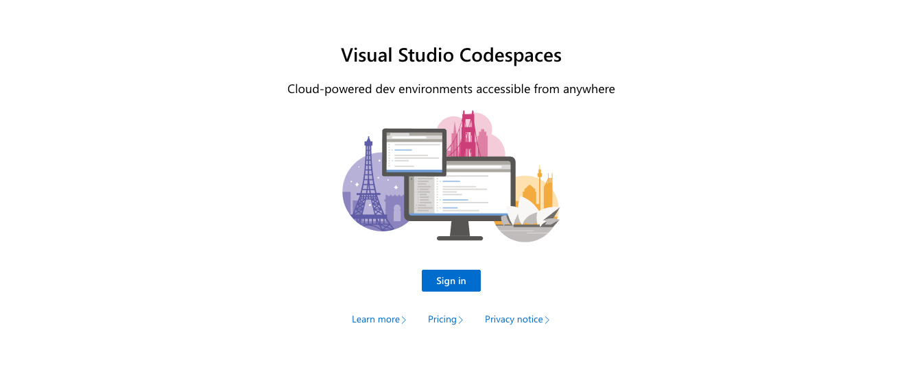
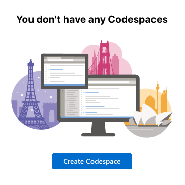
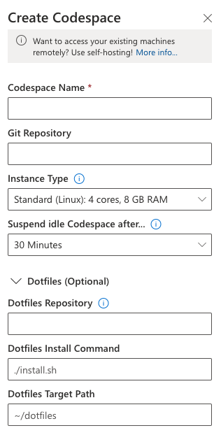
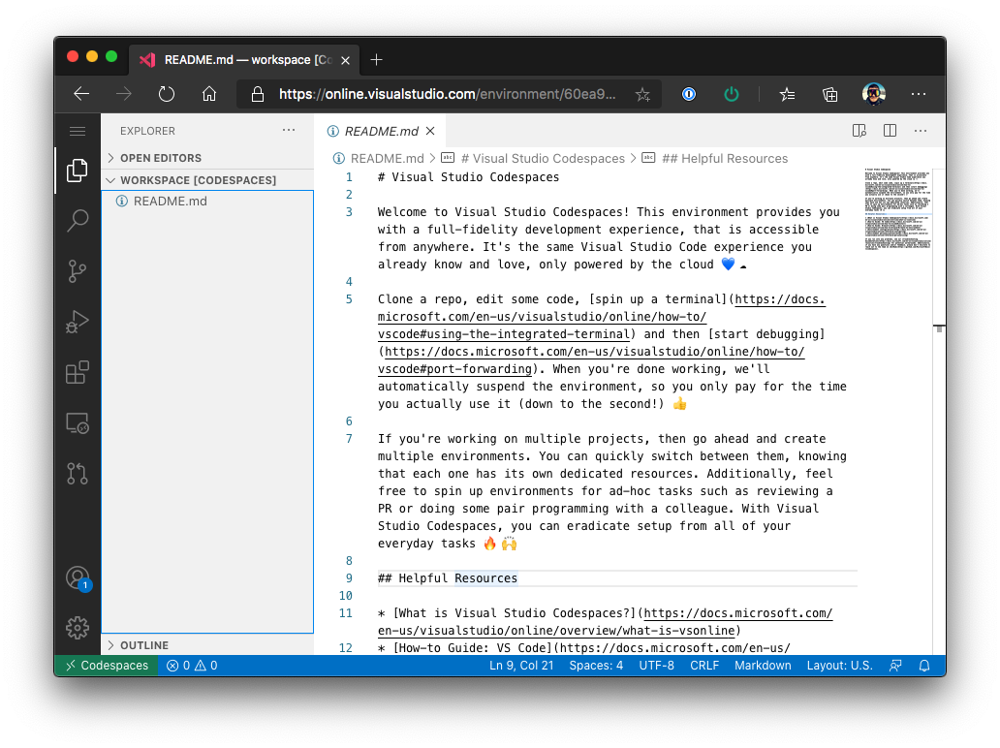
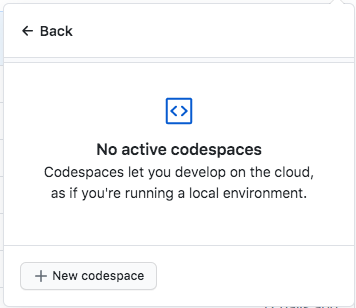

The dream of anyone who works with technology is to always be with their best friend, their computer. There are plenty of solutions out there that turn small devices like [Raspberry Pis](https://www.raspberrypi.org/) into full computers, and others that build tiny pocket computers you can access at any moment.

There are several reasons someone might need, or simply enjoy, having a computer by their side at all times. A lot of the time, people just want a super powerful tool within reach for whatever comes up, or even to build out that idea they had in the middle of the street. In other, more special cases, the person might be a maintainer of critical projects and needs to always be ready to fix whatever breaks, which takes away their freedom to move around. Having a device like this gives that person their mobility back.

We can have the best portable machines in the world, but no computer matches our own, with our environments and our own settings.

## Codespaces



Recently, at its [Satellite 2020](https://github.blog/2020-05-06-new-from-satellite-2020-github-codespaces-github-discussions-securing-code-in-private-repositories-and-more/#codespaces) event, GitHub launched a new feature on the platform: [Codespaces](https://github.com/features/codespaces). Right now, it's only available if you request early access through the website. But you might already be one of the people who recently got access and can enjoy this incredible feature!

> For now, GitHub Codespaces is in beta and you might not have the feature enabled. So you won't be able to see what I'll show next, but you can sign up directly on the site for early access.

Codespaces are an online implementation of [Visual Studio Code](https://code.visualstudio.com/?WT.mc_id=personal-blog-ludossan). Since it's an editor built on web technologies, VSCode has the incredible advantage of being one of the few projects that can be ported across platforms extremely easily.

This had already been done before with [Code Server](https://github.com/cdr/code-server), we even used an interesting implementation built by [Alejandro Oviedo](https://dev.to/a0viedo/how-to-bootstrap-your-nodeschool-event-3cin), our colleague from Argentina, at [Nodeschool SP](https://nodeschool.io/saopaulo/), but one of the big problems with Code Server was that its extension store didn't support every existing VSCode extension, and the editor also got confused when using keyboards with different layouts.

The big advantage GitHub Codespaces (GH Codespaces, or GHC) brought is that it's integrated directly into GitHub, meaning you can open **any** repository you have write access to in a ready-to-go web editor! Here's an example from my [GotQL](https://github.com/khaosdoctor/gotql) repository:


And all of this is **free**, for both paid and private repositories.

### How it works

Codespaces are built on top of another existing Microsoft solution called [Visual Studio Codespaces](https://online.visualstudio.com/?WT.mc_id=personal-blog-ludossan) (VSC), which is an excellent paid alternative to GH Codespaces if you're looking for something more open, because VS Codespaces spin up a [virtual machine on Azure](https://azure.microsoft.com/services/virtual-machines/?WT.mc_id=personal-blog-ludossan) and connect to it through VSCode's native feature called [**Remote Development**](https://code.visualstudio.com/docs/remote/remote-overview).

Remote Development connects to another computer running a small server on the other end. In other words, you can split the editor's processing from its interface. This way you can run VSCode pretty much anywhere, because any browser that supports modern JavaScript can run the editor's interface.

And then we combine another amazing piece of technology: **containers**. As you may have already seen [right here on the blog](/executando-containers-no-azure-container-instancies-com-docker/?utm_source=blog&utm_medium=post&utm_campaign=codespaces), containers are an incredible technology that lets you run pretty much any application in a self-contained way, without depending on external libraries. Codespaces take a lot of advantage of this, mainly so they can build the images for the machines that will run them.

This way, we can have a container holding every tool our project needs to run, because it's **fully customizable**.

## Visual Studio Codespaces



Before we dive into GitHub Codespaces, let me show you how we can use [VS Codespaces](https://online.visualstudio.com/?WT.mc_id=personal-blog-ludossan) to create a remote development environment, so we can understand what we're dealing with.

After logging in and creating your VSC instance, let's create a new codespace:



And, after clicking the "Create Codespace" button, things start getting interesting, because we get a series of great options we can turn on:



The first option is pretty simple, we have to give our codespace a name, the name we'll use to identify that machine, so it needs to be pretty descriptive.

Next, we get the more interesting option: VSC itself already lets us start a codespace from another GitHub repository, meaning GH Codespaces itself is just a different interface for VSCs.

From there we get to configure our VMs, so we can choose how powerful our remote machine will be and also how much idle time it can have before it suspends itself to save costs.

And then we get to the coolest part! We can set what's called _dotfiles_, the configuration files for our shell. This way, we can have a separate dotfiles repository, [like I do](https://github.com/khaosdoctor/.dotfiles), plus a script that installs those dotfiles on our online machine. In other words, we can replicate exactly what we have on our local computer inside a web interface!



## GitHub Codespaces

With GHC it's exactly the same thing! The only different action you'll need to take is going into a repository, like [GotQL](https://github.com/khaosdoctor/gotql), clicking the green "clone" button, then clicking "open with codespace":



Every beta user gets 2 free codespaces. That means you can keep up to 2 development machines without paying a single cent. After that, you'll need to remove the old ones to create new ones. In the GotQL example, we have the option to open with Codespaces, and this action alone will already create an environment that's **ready** for development, with every dependency installed.


But how do we actually do this?

## Customization

One of the coolest features of codespaces is that they're **fully customizable**.

For dotfiles, you can either configure your local VSCode (the editor installed on your machine) to pull a set of files as [this documentation](https://docs.microsoft.com/visualstudio/codespaces/reference/personalizing?WT.mc_id=personal-blog-ludossan) explains, or, in GitHub's case, you can have a repository directly named `dotfiles`, as GitHub's [documentation](https://docs.github.com/en/github/developing-online-with-codespaces/personalizing-codespaces-for-your-account) explains.

But you can do even more than that with a folder called `.devcontainer`. What this folder does is group together the possible configurations for a codespace. Inside it we can have a **Dockerfile**, a file called `devcontainer.json`, and an `sh` file that sets up our environment's shell. When we create a codespace from a repository, GitHub will look for this folder in the repository and build the codespace based on it.

Let's look at the `.devcontainer` example from [GotQL](https://github.com/khaosdoctor/gotql/tree/main/.devcontainer). We have a Dockerfile, which is responsible for saying what kind of container, or what kind of environment we're going to have, it's where we'll install packages, create users, and so on, as well as choosing our base operating system image.

```Dockerfile
FROM mcr.microsoft.com/vscode/devcontainers/javascript-node:14

# The javascript-node image includes a non-root node user with sudo access. Use 
# the "remoteUser" property in devcontainer.json to use it. On Linux, the container 
# user's GID/UIDs will be updated to match your local UID/GID when using the image
# or dockerFile property. Update USER_UID/USER_GID below if you are using the
# dockerComposeFile property or want the image itself to start with different ID
# values. See https://aka.ms/vscode-remote/containers/non-root-user for details.
ARG USERNAME=node
ARG USER_UID=1000
ARG USER_GID=$USER_UID

# Alter node user as needed, install tslint, typescript. eslint is installed by javascript image
RUN if [ "$USER_GID" != "1000" ] || [ "$USER_UID" != "1000" ]; then \
        groupmod --gid $USER_GID $USERNAME \
        && usermod --uid $USER_UID --gid $USER_GID $USERNAME \
        && chmod -R $USER_UID:$USER_GID /home/$USERNAME \
        && chmod -R $USER_UID:root /usr/local/share/nvm /usr/local/share/npm-global; \
    fi \
    #
    # Install tslint, typescript. eslint is installed by javascript image
    && sudo -u ${USERNAME} npm install -g tslint typescript gitmoji-cli
```

So, when a GotQL codespace gets created, this is the environment we'll have: an environment with a non-root user with sudo access, and tslint and TypeScript already installed. I also added `gitmoji-cli`, which is the commit convention I use in this project.

Then we have the `devcontainer.json` file, which is responsible not only for setting our editor's configuration, but also for giving instructions to the codespace builder. In it, we define the codespace's name, the extensions our online VSCode will have as soon as it starts, which Dockerfile it needs to use to build the system's base, and we can also override VSCode's own settings.

```jsonc
{
  "name": "TypeScript website codespace",
  "extensions": [
    "emmanuelbeziat.vscode-great-icons",
    "dbaeumer.vscode-eslint",
    "oderwat.indent-rainbow",
    "vtrois.gitmoji-vscode",
    "dracula-theme.theme-dracula",
    "2gua.rainbow-brackets",
    "ms-vscode.vscode-typescript-tslint-plugin"
  ],
  "dockerFile": "Dockerfile",
  // Set *default* container specific settings.json values on container create.
  "settings": { 
    "terminal.integrated.shell.linux": "/bin/bash",
    "window.autoDetectColorScheme": true,
    "workbench.preferredDarkColorTheme": "Dracula",
    "editor.renderWhitespace": "boundary",
    "workbench.colorTheme": "Dracula",
    "workbench.iconTheme": "vscode-great-icons"
  },
  // Use 'postCreateCommand' to run commands after the container is created.
  "postCreateCommand": "npm install"
}
```

On top of that, we've added a `postCreateCommand`, which is extremely useful for running commands **after** the codespace has been created. In this case, we're running `npm install`, so we already have every package installed by the time we open it.

We also have a great [repository of examples](https://github.com/codespaces-examples) of codespaces that can serve as a base for building your own. Let's look at the `setup.sh` file from the [Node codespace example](https://github.com/codespaces-examples/node/tree/main/.devcontainer).

```sh
## update and install some things we should probably have
apt-get update
apt-get install -y \
  curl \
  git \
  gnupg2 \
  jq \
  sudo \
  zsh

## set-up and install yarn
curl -sS https://dl.yarnpkg.com/debian/pubkey.gpg | apt-key add -
echo "deb https://dl.yarnpkg.com/debian/ stable main" | tee /etc/apt/sources.list.d/yarn.list
apt-get update && apt-get install yarn -y

## install nvm
curl -o- https://raw.githubusercontent.com/nvm-sh/nvm/v0.35.3/install.sh | bash

## setup and install oh-my-zsh
sh -c "$(curl -fsSL https://raw.githubusercontent.com/robbyrussell/oh-my-zsh/master/tools/install.sh)"
cp -R /root/.oh-my-zsh /home/$USERNAME
cp /root/.zshrc /home/$USERNAME
sed -i -e "s/\/root\/.oh-my-zsh/\/home\/$USERNAME\/.oh-my-zsh/g" /home/$USERNAME/.zshrc
chown -R $USER_UID:$USER_GID /home/$USERNAME/.oh-my-zsh /home/$USERNAME/.zshrc
```

This file is referenced inside the Dockerfile and runs as soon as it starts.

## Conclusion

Codespaces could become one of the leading technologies we have today, mainly because they allow for editing, or even more complex development work, using mobile devices like a phone.

Plenty of developers were already using Docker-based solutions to [code on an iPad](https://arslan.io/2019/01/07/using-the-ipad-pro-as-my-development-machine/), but those solutions always ended up feeling more like duct tape than a proper solution.

With technologies and features like these emerging, we now have the ability to bring our work environment anywhere. Stay tuned for the next posts, where I'll explain how I set up my remote work environment using GHC!

See you around!
