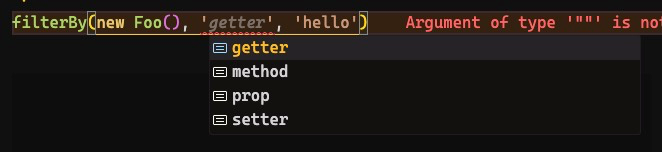

This is a quick one. I want to show you a problem we always run into when dealing with TypeScript: **how do we list all the properties of a class**?

Let's say you want to build a filter function that takes a class and lets you filter by all its properties. A type that could solve this is:

```ts
function filterBy<T, V extends keyof T>(origin: T, key: V, value: T[V]) {
  //
}
```

But when we call this function we'll hit a problem:



See, this type gives us every possible option because we're grabbing all keys of `Foo`, including the methods.

If we want only the properties—meaning `prop`, `getter`, and `setter`—we can create a mapped type, let's call it `OnlyProps`:

```ts
type OnlyProps<ClassType> = Pick<ClassType, {
    [Key in keyof ClassType]: ClassType[Key] extends Function 
                              ? never 
                              : Key
}[keyof ClassType]>;
```

Let's break this type down, from the inside out:

```ts
{
    [Key in keyof ClassType]: ClassType[Key] extends Function 
                              ? never 
                              : Key
}
```

Here we're creating a mapped object where:

1.  `Key` is every key in `ClassType`, which is our original class. This means we're returning another object (this will matter later).
2.  For each key `Key`, we check if that property `ClassType[Key]` is a function. If it is, we return `never`, which means we skip it.
    1.  If it isn't, we return the key name.

In the end, this mapped type would create a type like this if we used it with `Foo`:

```ts
{
  prop: 'prop',
  method: never,
  readonly getter: 'getter',
  setter: 'setter'
}
```

> Let's call this type the `MapObject`, just so we have a reference for the next steps.

Now we take the map object (which is an object, remember that), and turn it into a union of keys:

```ts
type MapObject = {
  prop: 'prop',
  method: never,
  readonly getter: 'getter',
  setter: 'setter'
}

type UnionMap<T> = MapObject[keyof T] // "prop" | "getter" | "setter"
```

Basically, what this step does is transform everything into a union so `Pick` can work with it. Notice we're removing everything that's `never`, that's the trick.

Now we're simply doing:

```ts
type OnlyProps<T> = Pick<T, "prop" | "getter" | "setter">
```

Which picks only those keys from the object. In the end we can update our function to use this type:

```ts
function filterBy<T, V extends keyof OnlyProps<T>>(origin: T, key: V, value: T[V]) {
  //
}
```

See the `keyof OnlyProps<T>`? We need the union of keys again. Actually, we could've done this instead, and it's simpler:

```ts
type OnlyProps<T> = {
  [K in keyof T]: T[K] extends Function ? never : K
}[keyof T];

function filterBy<T, V extends OnlyProps<T>>(origin: T, key: V, value: T[V]) {
  //
}
```

We ditched the `Pick` part, but keeping `Pick` makes the type more versatile because we can use it as an object too.
