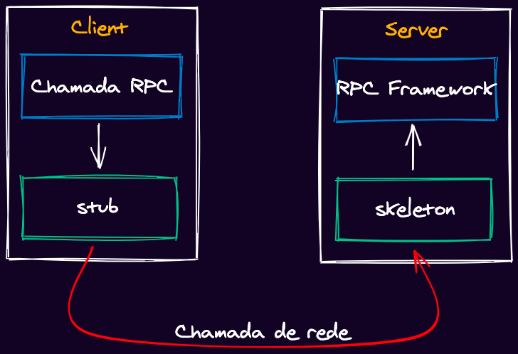
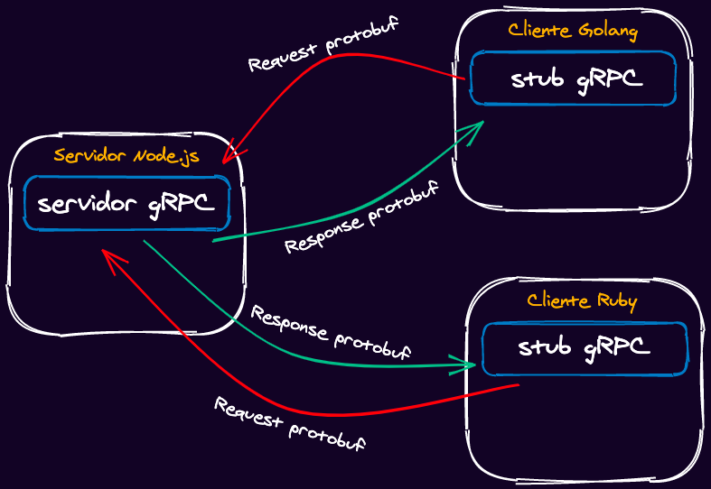
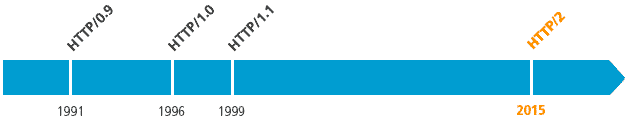
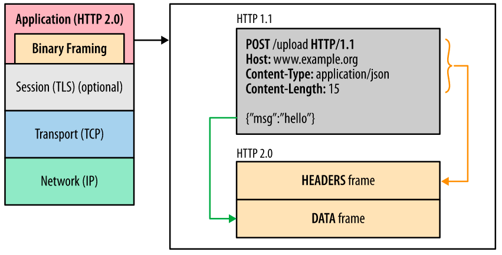
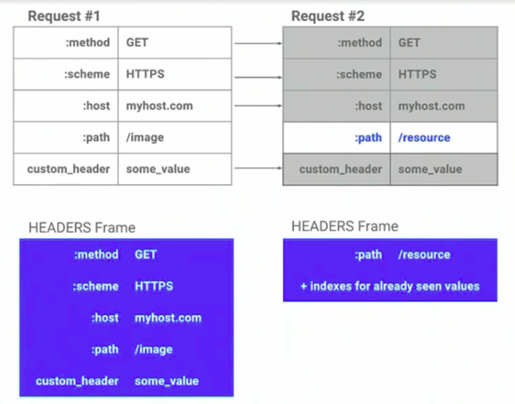
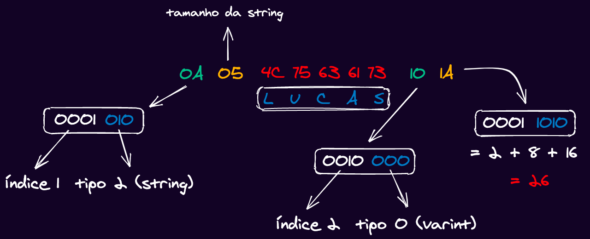

If you've been following me for a while you know I'm a big fan of talking about new technologies – even the ones that aren't that new anymore – and, above all, I'm a huge fan of gRPC!

I've already given a few talks on the subject, as you can see in the video below (make sure to check out the [slides](https://speakerdeck.com/khaosdoctor/grpc-with-node-dot-js) on [my SpeakerDeck](https://speakerdeck.com/khaosdoctor)), and this is a fairly recurring topic for me because, at least here in Brazil, most people **don't know what it is or have never used gRPC in any project**.


However, gRPC isn't a very new technology, it's been around for a while and has already been used at large scale in very big projects like Docker and Kubernetes, so I decided to put together this series of articles to explain once and for all what gRPC is and how you can build your JavaScript and TypeScript applications with it in a simple and easy way!

## Roadmap

Before we get into the information itself, let's understand what we're going to cover throughout this journey. I split this guide into three parts. In this first part we'll go through the history of gRPC, understand the ideas behind building this technology, its problems, advantages and much more.

In the second part, we'll get our hands dirtier and build our application using gRPC while understanding the whole ecosystem and the tools that make up the application. All of this using JavaScript.

Finally, in the third part we'll modify the application and improve it to use TypeScript instead of JavaScript. This way we'll get native type inference for our API and see how we can communicate correctly across all the layers.

## History

gRPC was created by Google as an open source project in 2015 as an improvement over a communication architecture called RPC (Remote Procedure Call).

RPC is a communication model that dates back to the mid-70s, when Bruce Jay Nelson, in 1981, who worked at Xerox PARC, used this term to describe communication between two processes within the same operating system – this is still used today – however, the RPC model is more commonly used for low level communication, until Java implemented an API called JRMI (Java Remote Method Invocation), which works basically the same way gRPC works today, but in a way more geared towards methods and classes rather than communication between processes.

We'll talk a bit more about the architecture of a gRPC call in the next few paragraphs.

The "g" in gRPC doesn't mean Google. Actually, it doesn't have a single meaning, it changes with every release of the gRPC engine. There's even a [document](https://github.com/grpc/grpc/blob/master/doc/g_stands_for.md) showing all the names the "g" has had throughout the versions.

The core idea of gRPC was to be much more performant than its ReST counterpart by being based on HTTP/2 and using an Interface Definition Language (IDL) known as Protocol Buffers (protobuf). This set of tools makes it possible for gRPC to be used across several languages at the same time with very low overhead while still being faster and more efficient than other network call architectures.

Beyond that, calling a remote method is, essentially, a regular call to a local method, which is intercepted by a local model of the remote object and turned into a network call. In other words, you're calling a local method as if it were a remote one. Let's look at an example.

## Example of how it works

Let's show an example of a gRPC server written in Node.js to manage books. As we mentioned, gRPC uses protobuf, which we'll look at in more detail in the next few paragraphs. This is our protobuf file that generated our service:

```protobuf

syntax = "proto3";
message Void {}

service NoteService {
  rpc List (Void) returns (NoteList);
  rpc Find (NoteId) returns (Note);
}

message NoteId {
  string id = 1;
}

message Note {
  string id = 1;
  string title = 2;
  string description = 3;
}

message NoteList {
  repeated Note notes = 1;
}
```

Here we're defining our whole gRPC API in a simple, fast, and, best of all, versionable way. Now we can load our server with this code:

```js
const grpc = require('grpc')
const NotesDefinition = grpc.load(require('path').resolve('../proto/notes.proto'))

const notes = [
  { id: '1', title: 'Note 1', description: 'Content 1' },
  { id: '2', title: 'Note 2', description: 'Content 2' }
]

function List (_, callback) {
  return callback(null, notes)
}

function Find ({ request: { id } }, callback) {
  return callback(null, notes.find((note) => note.id === id))
}

const server = new grpc.Server()
server.addService(NotesDefinition.NoteService.service, { List, Find })

server.bind('0.0.0.0:50051', grpc.ServerCredentials.createInsecure())
server.start()
```

And look how simple our client ends up being when making calls:

```js
  
const grpc = require('grpc')
const NotesDefinition = grpc.load(require('path').resolve('../proto/notes.proto'))

const client = new NotesDefinition.NoteService('localhost:50051', grpc.credentials.createInsecure())

client.list({}, (err, notes) => {
  if (err) throw err
  console.log(notes)
})

client.find(Math.floor(Math.random() * 2 + 1).toString(), (err, note) => {
  if (err) throw err
  if (!note.id) return console.log('Note not found')
  return console.log(note)
})
```

Notice that, basically, our calls look like we're calling a method on a local `client` object, and this method gets converted into a network call and sent to the server, which receives the call, converts it back into a local object and returns the response.

## Architecture

RPC architectures are very similar to each other. The core idea is that we always have a server and a client. On the server side we have a layer called the **skeleton**, which is essentially a decoder that turns a network call into a function call, and it's the one responsible for calling the function on the server side.

Meanwhile, on the client side, we have a network call made by a **stub**, which is like a "fake" object representing the object on the server side. This object has all the methods with their signatures.

> These names vary from implementation to implementation. In JRMI we had _skeleton and stub, but gRPC's implementation names both sides stubs._

Here's the diagram of how a regular RPC call works.



gRPC works in a very similar way to the diagram we just saw, the difference is that we have an extra layer, which is the gRPC framework interpreting the calls encoded with the protobuf IDL:



As you can see, it works basically the same way: we have a client that converts calls made locally into binary network calls with protobuf and sends them over the network to the gRPC server, which decodes them and responds to the client.

## HTTP/2

HTTP/2 has been around for a while and has been becoming the main form of communication on the web since 2015.



Among the many advantages of HTTP/2 (which was also created by Google) is the fact that it's much faster than HTTP/1.1 due to several factors that we'll cover.

## Request and response multiplexing

Traditionally, HTTP can't send more than one request at a time to a server, nor receive more than one response on the same connection, which makes HTTP/1.1 slower, since it needs to create a new connection for every request.

In HTTP/2 we have what's called multiplexing, which consists precisely of being able to receive several responses and send several calls over the same connection. This is only possible because of a new frame created in the HTTP packet called **Binary Framing**. This frame essentially splits the two parts (headers and payload) of the message into two separate frames, though contained within the same message using a specific encoding.



## Header compression

Another factor that makes HTTP/2 a faster protocol is header compression. In some cases the headers of an HTTP call can be larger than its payload, which is why HTTP/2 has a technique called HPack that does something pretty interesting.

Initially everything in the call is compressed, including the headers, which helps performance because we can send binary data instead of text. On top of that, HTTP/2 maps the headers going back and forth on each side of the call, so it's possible to know whether the headers changed or whether they're the same as the last call.

If the headers changed, only the changed headers are sent, and the ones that didn't change get an index pointing to the header's previous value, avoiding sending the same headers repeatedly.



As you can see, only the `path` of this request changed, so only that one gets sent.

## Protocol Buffers

Protocol buffers (or just **protobuf**) are a data serialization and deserialization method that works through an Interface Definition Language (IDL).

It was created by Google in 2008 to make communication between different microservices easier. The big advantage of protobuf is that it's platform agnostic, so you can write the specification in a neutral language (the `proto` language itself) and compile that contract for several other services. This way Google managed to unify the development of several microservices using a single contract language between its services.

Protobuf by itself doesn't contain any functionality, it's just a description of a service. A service in gRPC is a set of methods, think of it as a class. So we can describe each service with its parameters, inputs and outputs.

Each method (or RPC) of a service can only receive a single input parameter and a single output, which is why it's important to be able to compose messages so they form a single component.

Also, every message serialized with protobuf is sent in binary format, so its transmission speed to its receiver is much higher than plain text, since binary takes up less bandwidth and, since the data is compressed by HTTP/2, CPU usage is also much lower.

Another big advantage that contributes to protobuf's speed is the **separation of context and content**. When we use formats like JSON, the context comes along with the message, for example:

```json
{
  "name": "Lucas",
  "age": 26
}
```

When we convert this into a protobuf format message, we get the following file:

```proto
syntax = "proto3";

message Name {
  string name = 1;
  int32 age = 2;
}
```

Notice that we don't have the message's header alongside the message, just an index telling us which position that field should be in.

## Encoding

When we use the protobuf compiler (called [protoc](https://grpc.io/docs/protoc-installation/)), we can run the following command using our previous example: `echo 'name: "Lucas";age: 26' | protoc --encode=Name name.proto > name.bin`.

This creates a binary file called `name.bin`. If we open the binary file in a hex viewer (like [VSCode](https://marketplace.visualstudio.com/items?itemName=ms-vscode.hexeditor)'s), we get the following bit chain:

```hex
0A 05 4C 75 63 61 73 10 1A
```

We have 9 bytes represented here, against JSON's 24, and that's enough to understand the message. For example, here's what we have:



-   The first byte `0A` tells us the index and type of the message. `0A` in decimal is 10, that is, `0000 1010` in binary. According to [the protobuf encoding specification](https://developers.google.com/protocol-buffers/docs/encoding), the last three bits are reserved for the type and the MSB (leftmost bit) can be discarded, so regrouping the bits we get `0001 010`, so our type is `010`, which is 2 in binary, [the number that represents a](https://developers.google.com/protocol-buffers/docs/encoding#strings) **[string](https://developers.google.com/protocol-buffers/docs/encoding#strings)** [in protobuf](https://developers.google.com/protocol-buffers/docs/encoding#strings). In the first byte's `0001` we have the field index, which is 1, as we defined in our message.
-   The next byte `05` tells us the size of this string, which is 5 bytes because "Lucas" has 5 letters.
-   The next 5 bytes, `4C 75 63 61 73`, are the string "Lucas" converted to hexadecimal and back to UTF-8.
-   The second to last byte `10` relates to the second field. If we convert the number `10` to binary we get `0001 0000`. As we did with the first field, we group the rightmost 3 bits, carrying the leftmost zero (4th bit from right to left) into the next group and remove the MSB, leaving `0010 000`, that is, we have type `0`, which is **varint**, from the last 3 bits, and the first group gives us `0010`, or 2 in binary, which is the index of the second field.
-   The last bit is the value of this varint. The value `0x1A` in binary is `0001 1010`, so we can just convert it to a regular decimal by adding up the powers of 2: `2 + 8 + 16 = 26`, which is the value we put in the second field.

So essentially, our message is `125Lucas2026`. Notice that we have 12 bytes here, but in the encoding we only have 9. That's because two bytes represent 2 values at the same time, and we only use 1 byte for the number `26` while we use 2 for the string `"26"`.

## Can you use protobuf without gRPC?

Yes, one of the coolest things about gRPC is that it's a set of tools that work really well together. So gRPC is a combination of HTTP/2 with protobuf and a very fast remote call system.

This means we can use the protobuf compiler to generate an encoding SDK, which lets you encode and decode your messages using protobuf.

For example, let's create a simple file:

```proto
syntax = "proto3";
message Pessoa {
  uint64 id = 1;
  string email = 2;
}
```

Now we can run the following line in our terminal to generate a `.js` file that will contain a `Pessoa` class with its setters and getters configured, as well as encoders and decoders:

```bash
mkdir -p dist && protoc --js_out=import_style=commonjs,binary:dist ./pessoa.proto
```

The compiler will create a `pessoa_pb.js` file in the `dist` folder using the CommonJS import model (this is mandatory if you're running it with Node.js), and then we can write an `index.js` file:

```js
const {Pessoa} = require('./pessoa_pb')

const p = new Pessoa()
p.setId(1)
p.setEmail('hello@lsantos.dev')

const serialized = p.serializeBinary()
console.log(serialized)

const deserialized = Pessoa.deserializeBinary(serialized)
console.table(deserialized.toObject())
console.log(deserialized)
```

Then we'll need to install protobuf with `npm install google-protobuf` and run the code:

```output
Uint8Array(21) [
    8,   1,  18,  17, 104, 101,
  108, 108, 111,  64, 108, 115,
   97, 110, 116, 111, 115,  46,
  100, 101, 118
]
┌─────────┬─────────────────────┐
│ (index) │       Values        │
├─────────┼─────────────────────┤
│   id    │          1          │
│  email  │ 'hello@lsantos.dev' │
└─────────┴─────────────────────┘
{
  wrappers_: null,
  messageId_: undefined,
  arrayIndexOffset_: -1,
  array: [ 1, 'hello@lsantos.dev' ],
  pivot_: 1.7976931348623157e+308,
  convertedPrimitiveFields_: {}
}
```

Notice that we get the same encoding we analyzed before, a table of the values as an object, and the whole class.

Using protobuf as a contract layer is very useful, for example, to standardize the messages sent between messaging services and between microservices. Since these services can receive any kind of input, protobuf ends up creating a way to guarantee that every input is valid.

## Advantages of gRPC

As we've seen, gRPC has several advantages over the traditional ReST model:

1.  Lighter and faster because it uses binary encoding and HTTP/2
2.  Cross platform with the same contract interface
3.  Works on many platforms with little to no overhead
4.  The code is self documented
5.  Relatively easy to implement after the initial setup
6.  Excellent for work between teams that will never meet, especially for defining contracts for open source projects.

## Problems

Like any technology, gRPC isn't a silver bullet and doesn't solve every problem, it has some flaws:

1.  Protobuf doesn't have a package manager to manage dependencies between interface files
2.  It requires a bit of a paradigm shift compared to the ReST model
3.  The initial learning curve is more complex
4.  It's not a spec that many people know
5.  Because it's not very well known, documentation is sparse
6.  The architecture of a system using gRPC can become a bit more complex

## Use cases

Regardless of the problems and everything the technology has to offer, there's a series of well known use cases in the open source world that use gRPC as a means of communication.

## Kubernetes

Kubernetes itself uses gRPC as the means of communication between the Kubelet and the CRIs that make up the container runtime platform (as we've already talked about in several articles, like [this one](/oci-cri-docker-ecossistema-de-containers/), [this one](/entendendo-runtimes-de-containers/) and [this one](/dockersp-entendendo-o-ecossistema-de-containers-alem-do-docker/)).

The ease of implementing an interface using protobuf makes communication between teams easier, especially for a team like Kubernetes' that has to support a huge number of providers that aren't even well known.

## KEDA

The [KEDA](https://keda.sh) project, also for Kubernetes, uses as one of its main features the ability to create external scalers using a gRPC interface to communicate with the main operator.

One of the CNCF projects I'm a contributor to, the [HTTP add-on for KEDA](https://github.com/kedacore/http-add-on), uses this mechanism to create an external scaler that communicates with KEDA to increase the number of pods in a cluster based on the amount of HTTP requests, as you can see [here](https://github.com/kedacore/http-add-on/blob/main/scaler/main.go#L17).

## containerd

The main container runtime today, containerd is the project that powers Docker and Kubernetes nowadays. It also has a gRPC interface for communicating with external services.

## Conclusion

In this first part we dove a bit into how gRPC works and what it is, along with its components. In the next parts of this guide we'll build some applications and show the ecosystem of tools that exists for this awesome technology.
