## Sumário

-   [Sumário](#sum%C3%A1rio)
-   [HarperDB](#harperdb)
-   [Kubernetes e Databases](#kubernetes-e-databases)
-   [Criando containers com o HarperDB](#criando-containers-com-o-harperdb)
    -   [Migrando para o Kubernetes](#migrando-para-o-kubernetes)
        -   [Criando o cluster Kubernetes](#criando-o-cluster-kubernetes)
    -   [Criando os manifestos](#criando-os-manifestos)
    -   [Acessando o HarperDB](#acessando-o-harperdb)
-   [Conclusão](#conclus%C3%A3o)

Ao trabalhar com qualquer tipo de aplicativo, um dos maiores desafios é torná-lo reutilizável e sustentável. É por isso que costumamos escolher os containers como ferramenta para contornar esse problema.

Os contêineres são simples de construir e fáceis de manter, um tempo atrás eu [escrevi este artigo no FreeCodeCamp](https://www.freecodecamp.org/news/what-is-docker-used-for-a-docker-container-tutorial-for-beginners/) que explica muito sobre o que são containers e por que devemos usá-los.

Agora, enquanto estava codando um aplicativo recentemente, eu tive um outro problema: **Como posso executar meu banco de dados, usando HarperDB, em um contêiner? E como posso instalar esse banco no Kubernetes?**

Depois de algum brainstorming, encontrei uma solução, e aqui é onde eu vou compartilhar isso com você!

Mas, antes de mais nada, o que é o [HarperDB](https://harperdb.io/)?

## HarperDB

[HarperDB](https://harperdb.io/) é um banco de dados multiparadigma, de uso geral, projetado para ser rápido e fácil de usar. Ele encapsula as funcionalidades SQL e NoSQL, agregação de dados como CSV e várias ferramentas auxiliares como Math.js para trabalhar com matemática, suporte GeoJSON para trabalhar com dados geográficos e o moment.js para trabalhar com datas.

Ok, mas qual é a novidade? Outros bancos de dados já fazem isso. O problema é que o HarperDB armazena isso como uma estrutura de dados unificada e serve isso através de um algoritmo de armazenamento próprio que é **realmente** rápido para todos os diferentes tipos de dados.

Além disso, o HarperDB também foi projetado para ser uma solução completa para construir não apenas o banco de dados sozinho, mas também uma API completa que interage com isso através do uso de [Custom Functions](https://harperdb.io/docs/custom-functions/) (que vão aparecer em outro artigo), websockets e a cereja do bolo é que não requer um driver específico para trabalhar. Ele expõe uma API REST padrão que pode ser usada por qualquer linguagem, para que você possa consultar dados e realizar operações usando chamadas HTTP simples.

Aqui está um diagrama rápido de como o HarperDB funciona, tirado diretamente do [site do HarperDB](https://harperdb.io/product):


Resumindo, eu queria experimentar e não me decepcionei! Agora, como a gente instalaa esse banco de dados em um ambiente Kubernetes?

## Kubernetes e Databases

Normalmente, quando estamos lidando com bancos de dados, tendemos a instalar eles em um computador ou VM separado e conectar nosso aplicativo a ele. Embora essa seja uma boa opção para facilitar o gerenciamento, não é a melhor opção para fazer o banco mais rápido, nem distribuível, altamente disponível ou confiável.

Para isso, a gente tem que distribuir o banco de dados em várias máquinas usando uma abordagem de cluster, o que significa que temos um plano de controle principal (chamado de **control plane**) – que é o principal ponto de conexão de um banco de dados – e várias outras instâncias do mesmo banco de dados em que o control plane vai distribuir a carga. Essas instâncias são chamadas de **nós**.

Alguns nós podem ser somente leitura, outros somente escrita, alguns podem ser ambos. Isso permite garantir que temos as permissões corretas para cada nó e também podemos garantir que não haja perda ou corrupção de dados. Quando quaisquer dados são inseridos, excluídos ou alterados no banco de dados, esses nós publicam uma mensagem para outros nós fazerem a mesma alteração para que os dados sejam sempre consistentes. Porém demora um pouco para que esses dados sejam replicados quando temos uma grande infraestrutura, isso é o que chamamos de [consistência eventual (apesar de "eventual" não ser a melhor palavra)](https://en.wikipedia.org/wiki/Eventual_consistency).

Neste artigo, eu vou criar uma única instância do HarperDB no Kubernetes, mas pretendo mostrar como criar um cluster de instâncias do HarperDB em artigos futuros.

## Criando containers do HarperDB

A maioria dos bancos de dados já possui uma abordagem pronta para containers, e o Harper não é diferente. Você pode encontrar a versão em contêiner do HarperDB [na página do Docker Hub deles](https://hub.docker.com/r/harperdb/harperdb), é muito simples de instalar e executar. Antes de colocar o banco de dados no Kubernetes, vamos ter certeza de que podemos executá-lo localmente usando o Docker.

> Se você não tiver o Docker instalado, você pode ir no [site da Docker](https://www.docker.com/get-started/) e baixar.

O comando mais simples para rodar é:

```bash
docker run -d \
  -e HDB_ADMIN_USERNAME=user \
  -e HDB_ADMIN_PASSWORD=password \
  -p 9925:9925 \
  harperdb/harperdb
```

O HarperDB precisa que a porta 9925 seja aberta para que possamos conectá-lo ao [HarperDB Studio](https://studio.harperdb.io/), para que gerenciar o banco diretamente do navegador.

Além disso, precisamos lembrar que os containers são _efêmeros_, o que significa que eles **não** persistem dados depois que você para eles. É por isso que precisamos de um volume para persistir os dados, para isso podemos adicionar oa flag `-v` em nosso comando Docker, apontando para o diretório `/opt/harperdb/hdb` dentro do contêiner:

```bash
docker run -d \
  -e HDB_ADMIN_USERNAME=user \
  -e HDB_ADMIN_PASSWORD=password \
  -p 9925:9925 \
  -v $PWD/.hdb:/opt/harperdb/hdb \
  harperdb/harperdb
```

Neste comando estamos dizendo ao Docker para montar o diretório `/opt/harperdb/hdb` em uma pasta local chamada `/.hdb`, para que possamos persistir os dados. Depois que o comando é executado, podemos dar um `ls -la` no diretório `/.hdb` para ver se ele está realmente montado:

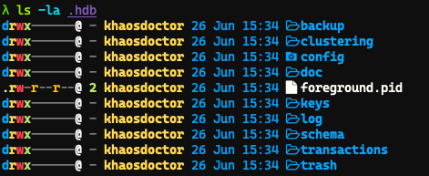

Agora, vamos para o [HarperDB Studio](https://studio.harperdb.io/) fazer o login. Se você ainda não tem uma conta, acesse [a página de inscrição](https://studio.harperdb.io/sign-up) e crie uma, é grátis. Em seguida, crie uma organização para você e você deve chegar a esta página:

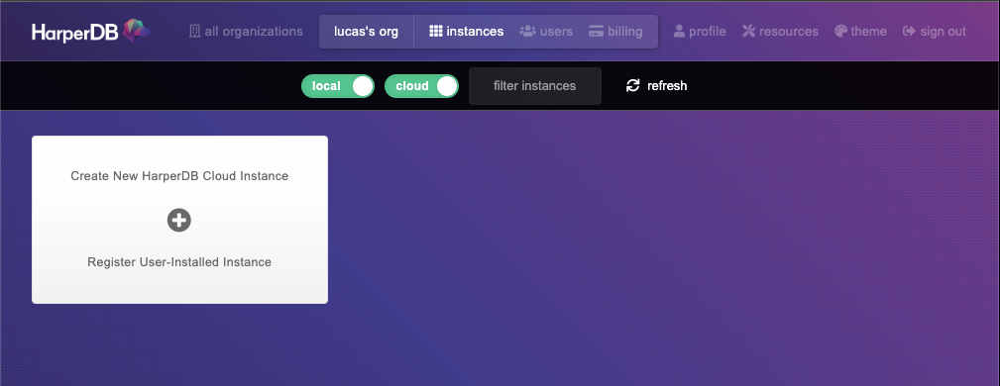

Vamos criar uma instância local clicando no botão **Register User-installed Instance**:

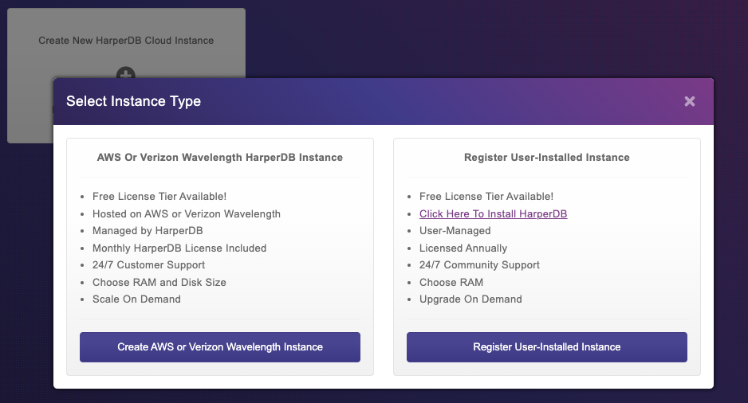

Vamos preencher os detalhes da instância e, em seguida, clicar no botão **instance details**:

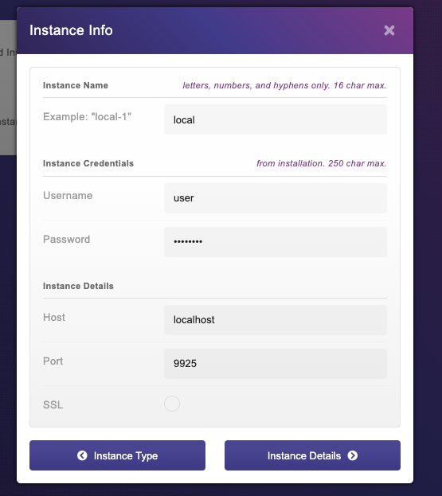

Em seguida, selecionamos o nível gratuito e clicamos em Avançar:

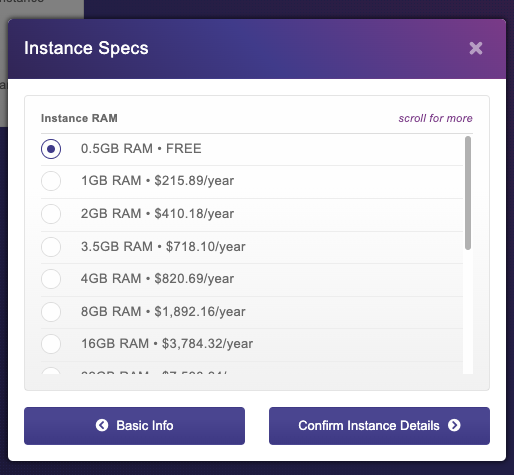

Confirme os termos de serviço e **Add Instance**. Você deve terminar com uma instância local do banco de dados:

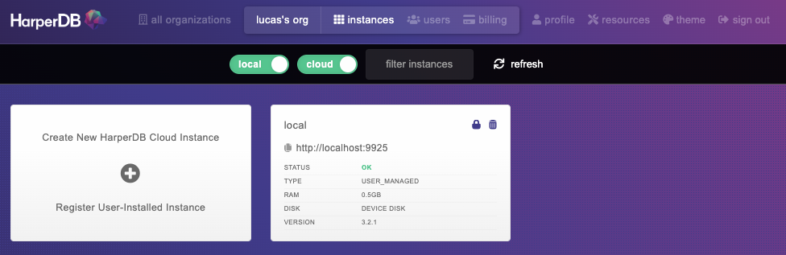

Se você clicar nele, deverá ter acesso a todos os seus schemas e tabelas. Então é isso que precisamos fazer.

### Migrando para o Kubernetes

Primeiro, vamos definir um plano do que precisamos fazer:

1.  Criar um cluster Kubernetes
2.  Criar um namespace chamado `database` para que possamos organizar nossos recursos
3.  Criar um `deployment` para o HarperDB para que possamos instalar o banco no cluster
4.  Criar um volume persistente para o diretório `/opt/harperdb/hdb`
5.  Criar um serviço para HarperDB para que possamos fazer um _port-forwarding_ direto para nosso navegador

Como não estaremos expondo o banco de dados à Internet, não criaremos uma regra de Ingress para ele, vamos usar o port-forwarding para se conectar com ele de dentro do cluster.

#### Criando o cluster Kubernetes

Há várias maneiras de criar um novo cluster Kubernetes, mas a maneira mais fácil e rápida é usar um cluster gerenciado. Neste tutorial, usaremos o AKS do Azure, mas você pode usar qualquer outro provedor.

A primeira coisa é fazer login na sua conta do Azure no [Portal do Azure](https://portal.azure.com/), se você não tiver uma conta, basta criar uma no [site](https://azure.microsoft.com).

Existem duas maneiras de criar um cluster AKS gerenciado, uma delas é por meio da [Azure CLI](https://docs.microsoft.com/en-us/cli/azure/install-azure-cli), a outra é através do próprio portal, que é a forma que eu vou usar neste tutorial.

Procure por "Kubernetes" no Portal do Azure e clique no resultado **Kubernetes Services**:

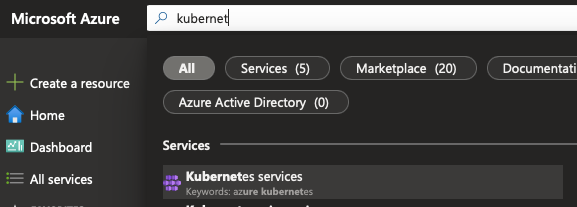

Em seguida, clique no menu suspenso **create** e crie um novo cluster:

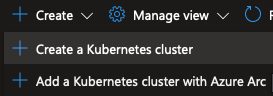

Vamos criar um novo grupo de recursos chamado `harperdb-aks`, vamos alterar a predefinição para desenvolvimento para economizar dinheiro, já que a gente não vai usar ele para produção, então nomeie o cluster como `harperdb` depois escolha a região mais próxima:

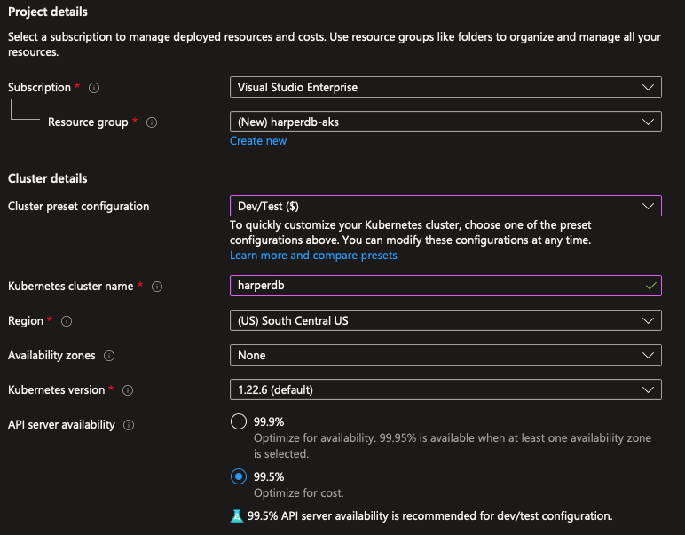

Vamos selecionar a instância **B2s** no seletor de instâncias e remover o _cluster autoscaling_, porque vamos usar um cluster de tamanho fixo com um número fixo de instâncias, no caso 1 nó:

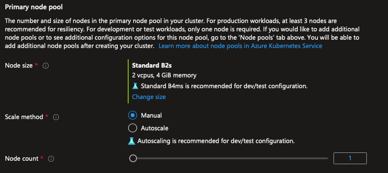

Clique no botão azul **Review+Create** para criar o cluster:

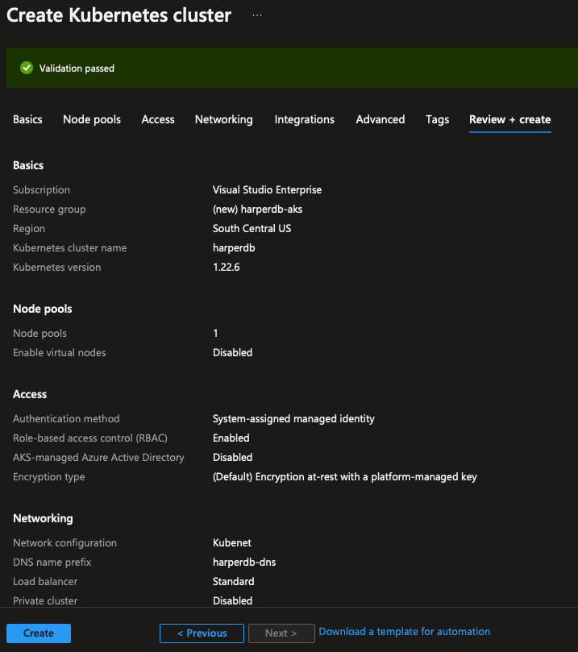

O processo levará um tempo para ser concluído, então vamos esperar até que seja concluído.

> Enquanto a gente espera, aproveita esse tempo para instalar e fazer login na [Azure CLI](https://docs.microsoft.com/en-us/cli/azure/install-azure-cli) se ainda não fez, porque a gente vai precisar dele para conectar ao cluster.

Após a conclusão do processo, vá para o seu terminal, inicie seu `az cli` e instale a ferramenta `kubectl` com `az aks install-cli`. Depois disso, faremos o download das credenciais para nosso arquivo `kubeconfig`, para que possamos nos conectar ao cluster usando `az aks get-credentials -n harperdb -g harperdb-aks --admin`.

Se tudo deu certo, você vai poder se conectar ao cluster com `kubectl get nodes` e obter uma resposta com um único nó como essa:

```bash
NAME                                STATUS   ROLES   AGE    VERSION
aks-agentpool-17395436-vmss000000   Ready    agent   2m6s   v1.22.6
```

Vamos criar nosso namespace com `kubectl create namespace database`, e agora podemos criar nossos manifestos.

### Criando os manifestos

Para começar, vamos criar um deployment para o HarperDB, para que possamos instalar o banco no cluster. Vamos criar um novo arquivo chamado `manifests.yaml` onde eu vou escrever todos as declarações necessárias. Nesse arquivo, a gente começa com a declaração do deployment:

```yaml
# Deployment para o HarperDB
apiVersion: apps/v1
kind: Deployment
metadata:
  name: harperdb
  namespace: database # Namespace que a gente criou antes
spec:
  selector:
    matchLabels:
      app: harperdb # juntamos todos os pods com o mesmo label
  template:
    metadata:
      labels:
        app: harperdb # criamos os pods com a label que a gente quer agrupar
    spec:
      containers:
      - name: harperdb-container
        image: harperdb/harperdb # mesma imagem do dockerhub
        env:
          - name: HDB_ADMIN_USERNAME
            value: harperdb # fixando username e password, em produção isso seria um secret
          - name: HDB_ADMIN_PASSWORD
            value: harperdb
        resources:
          limits:
            memory: "512Mi" # limitando o uso de memória
            cpu: "128m" # limitando o uso de cpu
        ports:
        - containerPort: 9925 # expondo a porta 9925 para o cluster
          name: hdb-api # nomeando a porta
        volumeMounts: # criando o ponto de mount do volume
          - mountPath: "/opt/harperdb" # escolhendo o local pra montar o volume
            name: hdb-data # referenciando o volume
        livenessProbe: # criando um ping para detectar o o status de ativação
          tcpSocket: # vamos pingar a porta 9925
            port: 9925
          initialDelaySeconds: 30 # vai começar depois de 30s do início do pod
          periodSeconds: 10 # depois vai ser checado a cada 10s
        readinessProbe: # ping para testar se o pod está pronto
          tcpSocket:
            port: 9925
          initialDelaySeconds: 10
          periodSeconds: 5
      volumes:
        - name:  hdb-data # esse é o volume que vamos montar
          persistentVolumeClaim: # referencia a um claim
            claimName: harperdb-data # esse é o nome do claim
```

Antes de continuar, vou precisar falar um pouco sobre os volumes. Como estamos lidando com volumes gerenciados no Azure, não precisamos (e não podemos) criar um volume dentro do host nem dentro do pod porque eles serão excluídos quando excluirmos os recursos. O que queremos fazer é delegar o processo de criação ao Azure por meio de `StorageClasses` e `PersistentVolumeClaims`.

> O processo normal seria criar um `PersistentVolume` e um `PersistentVolumeClaim` para esse volume

A ideia é declararmos que queremos pegar uma determinada quantidade de espaço do Azure para o volume e, em seguida, montamos no caminho que a gente quer. O Azure receberá essa solicitação por meio de um operador do Kubernetes que gerencia o plug-in CSI (**C**ontainer **S**torage **I**nterface) e cria o volume em nossa conta do Azure.

Por padrão, o Azure tem dois tipos de armazenamentos: Azure File e Azure Disk. Usaremos o armazenamento do Azure File porque é mais fácil ver os arquivos no Portal do Azure, além disso, a clusterização só tem suporte no armazenamento no Azure File.

Veja também que estamos montando o volume não em `/opt/harperdb/hdb` mas em `/opt/harperdb`. Isso porque, se montarmos o volume no diretório mais interno, teremos problemas de permissão, porque o diretório mais externo pertence ao usuário que executa o contêiner e o diretório mais interno é criado pelo Azure.

A outra informação importante é que o HDB demora um pouco para iniciar, então estamos configurando um `livenessProbe` e um `readinessProbe` para verificar se o pod está pronto, esses probes irão verificar a conexão na porta TCP 9925, quando esta porta estiver aberta, o serviço vai estar online.

Em seguida, adicionaremos a declaração de volume:

```yaml
apiVersion: v1
kind: PersistentVolumeClaim
metadata:
  name: harperdb-data
  namespace: database
spec:
  resources:
    requests:
      storage: 2Gi # Vamos solicitar 2GB de espaço
  accessModes:
    - ReadWriteOnce
  storageClassName: azurefile-csi # Vamos usar o armazenamento do Azure File
```

E para finalizar o arquivo de manifesto, adicionaremos um serviço:

```yml
apiVersion: v1
kind: Service
metadata:
  name: harperdb
  namespace: database
spec:
  selector:
    app: harperdb
  ports:
  - port: 9925
    name: api
    targetPort: hdb-api
```

O arquivo final ficará assim:

```yml
# manifests.yml
apiVersion: v1
kind: PersistentVolumeClaim
metadata:
  name: harperdb-data
  namespace: database
spec:
  resources:
    requests:
      storage: 2Gi
  accessModes:
    - ReadWriteOnce
  storageClassName: azurefile-csi
---
apiVersion: apps/v1
kind: Deployment
metadata:
  name: harperdb
  namespace: database
spec:
  selector:
    matchLabels:
      app: harperdb
  template:
    metadata:
      labels:
        app: harperdb
    spec:
      containers:
      - name: harperdb-container
        image: harperdb/harperdb
        env:
          - name: HDB_ADMIN_USERNAME
            value: harperdb
          - name: HDB_ADMIN_PASSWORD
            value: harperdb
        resources:
          limits:
            memory: "512Mi"
            cpu: "128m"
        ports:
        - containerPort: 9925
          name: hdb-api
        volumeMounts:
          - mountPath: "/opt/harperdb"
            name: hdb-data
        livenessProbe:
          tcpSocket:
            port: 9925
          initialDelaySeconds: 30
          periodSeconds: 10
        readinessProbe:
          tcpSocket:
            port: 9925
          initialDelaySeconds: 10
          periodSeconds: 5
      volumes:
        - name:  hdb-data
          persistentVolumeClaim:
            claimName: harperdb-data
---
apiVersion: v1
kind: Service
metadata:
  name: harperdb
  namespace: database
spec:
  selector:
    app: harperdb
  ports:
  - port: 9925
    name: api
    targetPort: hdb-api
```

A última coisa é aplicar os manifestos no cluster usando `kubectl apply -f ./manifests.yml`. Você receberá uma mensagem como esta:

```bash
persistentvolumeclaim/harperdb-data created
deployment.apps/harperdb created
service/harperdb created
```

Podemos verificar se está tudo bem executando `kubectl get deploy harperdb -n database`:

```bash
NAME       READY   UP-TO-DATE   AVAILABLE   AGE
harperdb   1/1     1            1           20m
```

Então podemos dar uma olhada no nosso Portal do Azure e ver se o volume está lá. Primeiro, selecione **Resource Groups** no portal, você pode fazer isso procurando por ele ou clicando na página inicial.

Encontre um grupo de recursos que tem o nome `MC_harperdb-aks_harperdb_<local>`, clique nele, você deverá ver um monte de recursos.

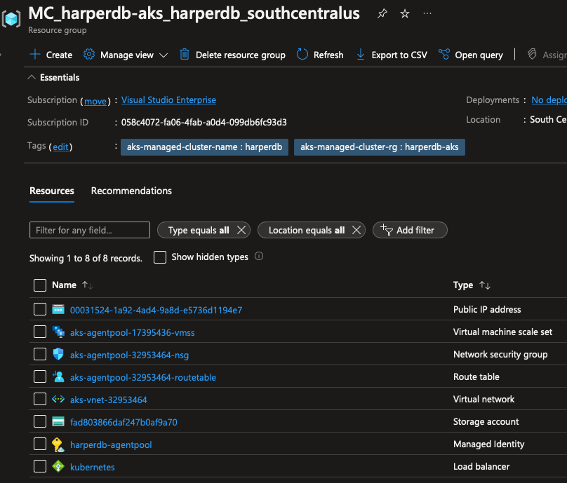

Um desses recursos é nossa Storage Account, clique nela. Em seguida, no painel esquerdo, vá para **File Shares**, você deverá ver um volume do Azure File começando com `pvc-`, clique nele.

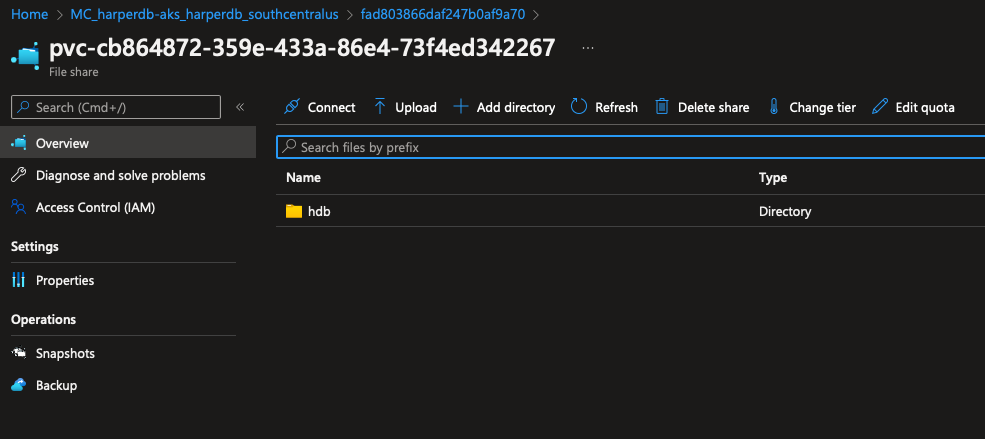

Aqui está nosso volume montado com todos os arquivos do HDB. Agora vamos acessar nossa instância HDB e verificar se tudo está funcionando.

### Acessando o HarperDB

Para acessar o banco de dados do mundo externo, já que não expusemos ele como uma boa prática, vamos redirecionar nossa própria conexão para o nosso serviço usando o seguinte comando:

```bash
kubectl port-forward svc/harperdb 9925:9925 -n database
```

Você deverá ver as seguintes mensagens:

```bash
Forwarding from 127.0.0.1:9925 -> 9925
Forwarding from [::1]:9925 -> 9925
Handling connection for 9925
Handling connection for 9925
Handling connection for 9925
...
```

Então, vamos ao nosso estúdio no navegador e criemos uma nova instância com as credenciais que incluímos em nosso manifesto de implantação, o nome de usuário e a senha são `harperdb`.

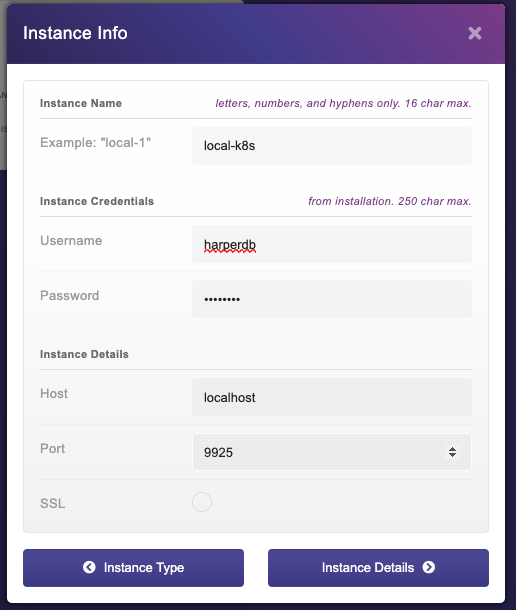

Depois disso, você pode seguir as mesmas etapas para criar um novo banco de dados, criar um novo usuário e conceder permissões ao usuário.

## Conclusão

Chegamos ao final deste tutorial e espero que tenham gostado! Agora você pode criar sua própria instância HDB em um cluster Kubernetes.

Para saber mais e encontrar mais informações sobre como o HDB funciona, confira [a documentação](https://harperdb.io/docs/overview/).
