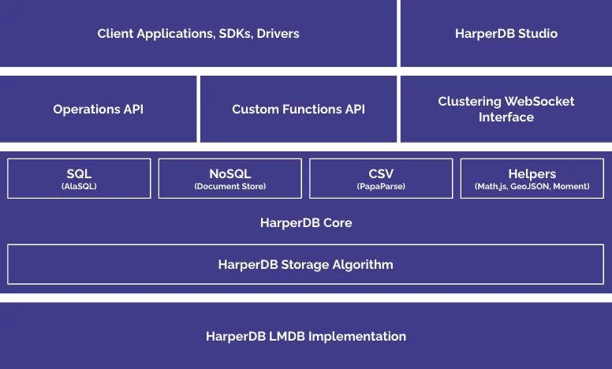

## Table of contents

- [Table of contents](#table-of-contents)
- [HarperDB](#harperdb)
- [Kubernetes and Databases](#kubernetes-and-databases)
- [Containerizing HarperDB](#containerizing-harperdb)
  - [Migrating to Kubernetes](#migrating-to-kubernetes)
    - [Create a Kubernetes cluster](#create-a-kubernetes-cluster)
  - [Create manifests](#create-manifests)
  - [Accessing HarperDB](#accessing-harperdb)
- [Conclusion](#conclusion)

When working with any sort of application, one of the biggest challenges is to make it reusable and maintainable. This is why we usually choose containers as the tool to get around this problem.

Containers are simple to build and easy to maintain, a while ago I [wrote this article on FreeCodeCamp](https://www.freecodecamp.org/news/what-is-docker-used-for-a-docker-container-tutorial-for-beginners/) that explains a lot about what are containers and why should we use them.

Now, while building an application recently, I ran into another problem: __How can I run my database, using HarperDB, in a container? And then how can I install it using Kubernetes?__

After some brainstorming I came up with a solution, and now it's the time to share that with you!

But, first things first, what is [HarperDB](https://harperdb.io/)?

## HarperDB

[HarperDB](https://harperdb.io/) is a multi-paradigm, general-purpose database that is designed to be fast and easy to use. It encapsulates SQL and NoSQL functionality, CSV data aggregation and a whole lot of helpers like Math.js for working with math, GeoJSON support for working with geographical data, and moment for working with dates.

Ok, but what's the big catch? Other databases already do this. The catch is that HarperDB stores this as a unified data structure and serves it through a unique storage algorithm that makes it really fast for all the different types of data.

On top of that, HarperDB is also projected to be a full fledged solution to build not only your database alone, but also a complete API that interacts with that through the use of [Custom Functions](https://harperdb.io/docs/custom-functions/) (which I'll talk about in another article), websockets, and the cherry on top is that it doesn't require a specific driver to work with. It exposes a standard REST API that can be used by any language, so you can both query data and perform operations using simple HTTP calls.

Here's a quick diagram of how HarperDB works, taken straight from the [HarperDB website](https://harperdb.io/product):



In short, I wanted to try it out and wasn't disappointed! Now, how can we install this database in a Kubernetes environment?

## Kubernetes and Databases

Usually, when dealing with databases, we tend to install it on a separate computer or VM, and connect our application to that. While this is a good option to make it easier to manage, it's not the best option to make it faster, nor distributable, highly available, or reliable.

To do that, we need to distribute the database into several machines using a cluster approach, which means we have a main control plane, which is the main connection point for a database, and several other instances of the same database on which the control plane will distribute the load. These instances are called nodes.

Some nodes can be read only, some can be write only, some can be both. This allows us to make sure we have the correct permissions for each node, and we can also make sure that we don't have any data loss or corruption. When any data is inserted, deleted, or changed in the database, these nodes publish a message to other nodes to make that change too, so that the data is always consistent. However it takes a while for this data to be replicated when we have a large infrastructure, this is what we call [eventual consistency](https://en.wikipedia.org/wiki/Eventual_consistency).

In this article I'll be creating a single HarperDB instance on Kubernetes, however, I plan to show you how to create a cluster of HarperDB instances in future articles.

## Containerizing HarperDB

Most databases already have a container-ready approach, and Harper is not different. You can find the containerized version of HarperDB in [their Docker Hub page](https://hub.docker.com/r/harperdb/harperdb), it's very straight-forward to install and run. Before putting the database in Kubernetes, let's make sure we can run it locally using Docker.

> If you don't have Docker installed, you can install it from the [Docker website](https://www.docker.com/get-started/).

The simple and easy command to run is:

```bash
docker run -d \
  -e HDB_ADMIN_USERNAME=user \
  -e HDB_ADMIN_PASSWORD=password \
  -p 9925:9925 \
  harperdb/harperdb
```

HarperDB needs port 9925 to be opened so we can connect it to the [HarperDB Studio](https://studio.harperdb.io/) application, so we can manage it straight from the browser.

Aside from that, we need to remember that containers are _ephemeral_, which means they __do not__ persist after they are stopped. This is why we need a volume to persist the data, for that we can add the `-v` flag in our Docker command, pointing to the `/opt/harperdb/hdb` directory inside the container:

```bash
docker run -d \
  -e HDB_ADMIN_USERNAME=user \
  -e HDB_ADMIN_PASSWORD=password \
  -p 9925:9925 \
  -v $PWD/.hdb:/opt/harperdb/hdb \
  harperdb/harperdb
```

In this command we're telling Docker to mount the `/opt/harperdb/hdb` directory in a local folder called `/.hdb`, so that we can persist the data. After the command is run, we can `ls -la` the `/.hdb` directory to see that it's actually mounted:


Now, we go to the [HarperDB Studio](https://studio.harperdb.io/) application and login. If you don't have an account yet, go to [the sign-up page](https://studio.harperdb.io/sign-up) and create one, it's free. Then create an organization for you and you should land on this page:


Let's create a local instance by clicking the __Register User-installed Instance__ button:


Let's fill up the details of the instance, and then click the __instance details__ button:


Then we select the free tier and click next:


Confirm the terms of service and __Add Instance__. You should end up with a local registered instance of the database:


If you click it, you should have access to all your schemas and tables. So that's what we need to do.

## Migrating to Kubernetes

First, let's set up a plan of what we need to do:

1. Create a Kubernetes cluster
2. Create a namespace called `database` so we can organize our resources
3. Create a deployment for HarperDB so we can deploy it to the cluster
4. Create a persistent volume claim for the `/opt/harperdb/hdb` directory
5. Create a service for HarperDB so we can port-forward it locally and connect to it from the browser

Since we'll not be exposing the database to the internet, we won't create an Ingress rule for it, instead, we'll only connect to it from inside the cluster.

### Create a Kubernetes cluster

There are a ton of ways to create a new Kubernetes cluster, but the easiest and fastest way is to use a managed cluster. In this tutorial we'll be using Azure's AKS, but you can use any other provider.

The first thing is to log in to your Azure account on [the Azure Portal](https://portal.azure.com/), if you don't have an Azure account, just create one in [the Azure website](https://azure.microsoft.com). There are two ways to create a managed AKS cluster, one of them is through the [Azure CLI](https://docs.microsoft.com/en-us/cli/azure/install-azure-cli), the other is through the portal itself, which is the way we'll be doing this tutorial.

Search for "Kubernetes" in the Azure Portal, and click on the __Kubernetes Services__ result:


Then click on __create__ dropdown and create a new cluster:


Let's create a new resource group called `harperdb-aks`, let's change the preset to development to save some money since we'll not be using the cluster for production, then name the cluster `harperdb`, choose your preferred region:


Let's select the __B2s__ instance in the instance picker and remove the autoscale method, since we'll be using a fixed size cluster of 1 single node:


Click the blue __Review+Create__ button to create the cluster:


The process will take a while to complete, so let's wait until it's done.

> While you wait, take your time to install and login to the [Azure CLI](https://docs.microsoft.com/en-us/cli/azure/install-azure-cli) if you haven't done so yet, because we'll need it to connect to the cluster.

After the process is complete, jump to your terminal, start your `az cli` and install the `kubectl` tool with `az aks install-cli`. After that we'll download the credentials to our `kubeconfig` file, so we can connect to the cluster using `az aks get-credentials -n harperdb -g harperdb-aks --admin`.

If everything went well, you should be able to connect to the cluster with `kubectl get nodes` and get a response with a single node like this:

```bash
NAME                                STATUS   ROLES   AGE    VERSION
aks-agentpool-17395436-vmss000000   Ready    agent   2m6s   v1.22.6
```

Let's create our namespace with `kubectl create namespace database`, and now we're able to create our manifests.

## Create manifests

To start the manifest creation, we'll need to create a deployment for HarperDB, so we can deploy it to the cluster. Let's create a new file called `manifests.yaml` where we'll add all the manifests we'll need. In this file, we'll start with the deployment:

```yaml
# Deployment for HarperDB
apiVersion: apps/v1
kind: Deployment
metadata:
  name: harperdb
  namespace: database # note the namespace we created earlier
spec:
  selector:
    matchLabels:
      app: harperdb # group all the pods under the same label
  template:
    metadata:
      labels:
        app: harperdb # create pods with the label we want to group them under
    spec:
      containers:
      - name: harperdb-container
        image: harperdb/harperdb # same hdb image from dockerhub
        env:
          - name: HDB_ADMIN_USERNAME
            value: harperdb # fixing username, in production this should be a secret
          - name: HDB_ADMIN_PASSWORD
            value: harperdb # fixing password, in production this should be a secret
        resources:
          limits:
            memory: "512Mi" # limiting the usage of memory
            cpu: "128m" # limiting the usage of CPU to 128 millicores
        ports:
        - containerPort: 9925 # exposing the port 9925 to the outside world
          name: hdb-api # naming the port
        volumeMounts: # creating a persistent volume to store the data
          - mountPath: "/opt/harperdb" # mounting the volume to the path we want
            name: hdb-data # referencing the volume we want to mount
        livenessProbe: # creating a liveness probe to check if the container is running
          tcpSocket: # we'll ping hdb's port 9925
            port: 9925
          initialDelaySeconds: 30 # wait 30 seconds before starting the probe
          periodSeconds: 10 # then check the probe every 10 seconds
        readinessProbe: # creating a readiness probe to check if the container is ready to accept connections
          tcpSocket:
            port: 9925
          initialDelaySeconds: 10 # wait 10 seconds before starting the probe
          periodSeconds: 5 # then check the probe every 5 seconds
      volumes:
        - name:  hdb-data # this is the volume we'll mount
          persistentVolumeClaim: # it references another persistent volume claim
            claimName: harperdb-data # this is the name of the persistent volume claim
```

Before we go further, some explanation on volumes is necessary. Since we're dealing with managed volumes on Azure, we don't need (and can't) create a volume inside the host nor inside the pod because they'll be deleted when we delete the resources. What we want to do is to delegate the creation process to Azure through `StorageClasses` and `PersistentVolumeClaims`.

> The usual process is to create a `PersistentVolume` and then claim it with a `PersistentVolumeClaim`

The idea is that we declare that we want to claim a determined amount of space from the Azure pool for the volume, and then we'll mount it to the path we want. Azure will receive this request through a Kubernetes operator that manages the CSI (Container Storage Interface) plugin and create the volume in our Azure account.

By default, Azure has two types of storages: Azure File and Azure Disk. We'll be using the Azure File storage because it's easier to see the files in the Azure Portal, also, clusterization is only supported in Azure File storage.

Also note that we're mounting the volume not on `/opt/harperdb/hdb` but on `/opt/harperdb`. This is because if we mount the volume in the innermost directory, we'll have permission problems since the outermost directory is owned by the user that runs the container, and the innermost directory is created by Azure.

The other important information is that HDB takes a small while to start, so we're setting a `livenessProbe` and `readinessProbe` to check if the pod is ready, these probes will check the connection on TCP port 9925, when this port is open, the service is online.

Next, we'll add the persistent volume claim:

```yaml
apiVersion: v1
kind: PersistentVolumeClaim
metadata:
  name: harperdb-data
  namespace: database
spec:
  resources:
    requests:
      storage: 2Gi # We'll request 2GB of storage
  accessModes:
    - ReadWriteOnce
  storageClassName: azurefile-csi # We'll use the Azure File storage
```

And to finish the manifest file, we'll add a service:

```yml
apiVersion: v1
kind: Service
metadata:
  name: harperdb
  namespace: database
spec:
  selector:
    app: harperdb
  ports:
  - port: 9925
    name: api
    targetPort: hdb-api
```

The final file will look like this:

```yml
# manifests.yml
apiVersion: v1
kind: PersistentVolumeClaim
metadata:
  name: harperdb-data
  namespace: database
spec:
  resources:
    requests:
      storage: 2Gi
  accessModes:
    - ReadWriteOnce
  storageClassName: azurefile-csi
---
apiVersion: apps/v1
kind: Deployment
metadata:
  name: harperdb
  namespace: database
spec:
  selector:
    matchLabels:
      app: harperdb
  template:
    metadata:
      labels:
        app: harperdb
    spec:
      containers:
      - name: harperdb-container
        image: harperdb/harperdb
        env:
          - name: HDB_ADMIN_USERNAME
            value: harperdb
          - name: HDB_ADMIN_PASSWORD
            value: harperdb
        resources:
          limits:
            memory: "512Mi"
            cpu: "128m"
        ports:
        - containerPort: 9925
          name: hdb-api
        volumeMounts:
          - mountPath: "/opt/harperdb"
            name: hdb-data
        livenessProbe:
          tcpSocket:
            port: 9925
          initialDelaySeconds: 30
          periodSeconds: 10
        readinessProbe:
          tcpSocket:
            port: 9925
          initialDelaySeconds: 10
          periodSeconds: 5
      volumes:
        - name:  hdb-data
          persistentVolumeClaim:
            claimName: harperdb-data
---
apiVersion: v1
kind: Service
metadata:
  name: harperdb
  namespace: database
spec:
  selector:
    app: harperdb
  ports:
  - port: 9925
    name: api
    targetPort: hdb-api
```

The last thing is to apply the manifests to the cluster using `kubectl apply -f ./manifests.yml`. You'll receive a message like this:

```bash
persistentvolumeclaim/harperdb-data created
deployment.apps/harperdb created
service/harperdb created
```

We can check if everything is fine by running `kubectl get deploy harperdb -n database`:

```bash
NAME       READY   UP-TO-DATE   AVAILABLE   AGE
harperdb   1/1     1            1           20m
```

Then we can take a look on our Azure Portal and see if the volume is there. First, select __Resource Groups__ in the portal, you can do this by searching for it or clicking in the home page.

Find a resource group that matches `MC_harperdb-aks_harperdb_<location>`, click it, you should see a bunch of resources.


One of these resources is our Storage Account, click it. Then, in the left panel, go to __File Shares__, you should see a Azure File volume starting with `pvc-`, click it.


Here's our mounted volume with all HDB's files. Now let's access our HDB instance and check if everything is working.

## Accessing HarperDB

To access the database from the outside world, since we didn't expose it as a good practice, let's port forward our own connection to our service connection using the following command:

```bash
kubectl port-forward svc/harperdb 9925:9925 -n database
```

You should see the following messages:

```bash
Forwarding from 127.0.0.1:9925 -> 9925
Forwarding from [::1]:9925 -> 9925
Handling connection for 9925
Handling connection for 9925
Handling connection for 9925
...
```

Then, let's go to our studio in the browser and create a new instance with the credentials that we included in our deployment manifest, the username and the password are `harperdb`.


After that, you can follow the same steps to create a new database, create a new user, and then grant permissions to the user.

## Conclusion

We made it to the end of this tutorial and I hope you enjoyed it! Now you're able to create your own HDB instance in a Kubernetes cluster.

For more information on how HDB works, check out [their documentation](https://harperdb.io/docs/overview/).
