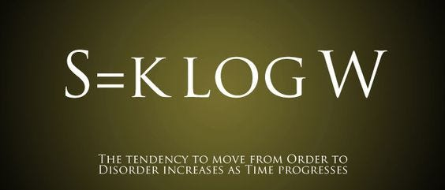

import figureImage1 from './ilusao-de-controle/image-1.png'
import figureImage2 from './ilusao-de-controle/image-2.png'

Dessa vez eu não vou falar de tecnologia por aqui. Na verdade, eu nem vou falar de nada determinístico, meu objetivo real com esse post é mostrar como podemos persistir por muito tempo em algo que achamos que está correto, mas que ao mesmo tempo não está nos fazendo bem.

Essa é uma história pessoal, que aconteceu ao longo de vários e vários meses. E também uma história que eu considero de evolução, não só pessoal, mas também profissional. Não existe script para esse post, eu nem sei sobre o que eu vou escrever, estou apenas sentado aqui digitando o que vem na minha cabeça e vendo como vai ficar.

Então me acompanha nessa jornada e, no final, se você achar que aprendeu algo, ou esse texto te fez pensar em algo de alguma forma, por favor me marca lá [no meu Twitter (X?)](https://twitter.lsantos.dev) e eu vou adorar conversar sobre isso!

## Eu estava errado

Em 2020, eu publiquei uma [série de artigos no dev.to](https://dev.to/_staticvoid/series/5962) sobre organização pessoal. Naquela época eu achava que tinha encontrado o nirvana da organização pessoal, dominado tudo que tinha para dominar sobre planejamento pessoal e produtividade.

> Até que eu percebi que **eu estava errado**, e como eu estava errado...

Não quer dizer que tudo que eu escrevi nessa série de artigos seja completamente irreal e não seja verdade, na verdade o princípio que eu apresento neles é totalmente válido, eu só achei que se eu aplicasse o mesmo princípio **em todo o lugar** eu teria cada vez mais sucesso, seria cada vez mais produtivo.

O ápice do meu "vício por produtividade" chegou quando eu organizava tudo, planejava tudo, nada ficava no meu cérebro por mais de 10 minutos sem parar em um todo-list ou alguma coisa do tipo, todos os meus dias eram scriptados, do início ao fim, eu tinha horas para acordar, higiene, almoço, trabalho, side projects, dormir e até mesmo para jogar alguma coisa ou algum lazer.

3 anos depois eu percebi que eu estava vivendo no piloto automático, era como se eu não tivesse um livre arbítrio mais, e eu mesmo criei a prisão que eu me tranquei, e eu nem percebi.

> Eu percebi que estava vivendo no piloto automático

O pior de tudo é que, naquela época, eu pregava esse tipo de produtividade para outras pessoas como se eu fosse algum tipo de evangelizador, ou seja, eu estava tentando ensinar outras pessoas a ficarem presas na mesma prisão que eu. E hoje eu estou aqui para dizer que **não importa o que você faça, você nunca vai ter controle de nada**.

## Controle é uma ilusão

Por mais que eu planejasse meu tempo o máximo possível, tivesse todo o meu calendário colorido, por que eu tinha a sensação de eu não estava saindo do lugar?

Demorou muito tempo até eu perceber que eu mesmo tinha me fechado em um tipo de planejamento tão estrito que eu passava mais tempo planejando meu dia do que, de fato, fazendo algo útil. O que a gente chama de [**paralisia de planejamento**](https://en.wikipedia.org/wiki/Analysis_paralysis), ou paralisia de análise. Que é quando você passa mais tempo pensando demais e analisando tudo para ficar perfeito antes de começar a fazer qualquer coisa.

Eu achava que eu precisava dominar 100% de qualquer coisa antes de poder começar sequer a tentar treinar ou fazer algo. Eu nunca começava nenhum projeto pessoal, muitas vezes sobre alguma coisa importante, porque eu precisava ter certeza de todos os passos até que eu notei que **você realmente não precisa saber de tudo**.

> Você não precisa saber de tudo para começar

Isso ficou muito mais evidente depois que comecei [meu próprio treinamento de TypeScript](https://formacaots.com.br), poucos sabem, mas eu fiz pelo menos umas 6 versões anteriores desse mesmo curso ou de outros cursos antes de sequer começar a fazer alguma coisa. Até que eu comecei a conversar com amigos e outras pessoas próximas e todo mundo me falava: "Você pensa demais, precisa começar parar de pensar e começar a fazer".

Isso me pegou muito fundo, porque eu sempre ouvi isso durante minha vida, que eu planejava as coisas demais, que eu era o tipo "thinker" (idealista) e não um "doer" (fazedor), e que "de ideias o mundo estava cheio", e o que eu estava fazendo sobre isso?

## Não é sobre acertar de primeira

No mundo do desenvolvimento de software, a paralisia de escolha é extremamente comum – tão comum que eu basicamente eduquei meu próprio cérebro a achar que eu estava sempre vivendo em um planejamento de projeto.

Eu acreditava nisso, eu achava que você só podia passar para a próxima etapa de qualquer coisa uma vez que você tivesse terminado a etapa anterior completamente. E isso me afetou em diversas áreas, tanto em relacionamentos pessoais como em carreira.

No início da carreira ter esse tipo de mentalidade até te ajuda, porque você tem mais certeza que acertou tudo antes de passar para o próximo passo e você só foca em uma coisa de cada vez. Mas ainda sim, no início da carreira, devs só focam em um único projeto. Conforme você vai progredindo, você deixa de ser uma pessoa que está cuidando de um único projeto, passa a cuidar de múltiplos, depois de pessoas, depois de times. E agora eu te pergunto:

> Você acha que vai acertar de primeira?

Se você acha que sim, eu tenho uma péssima notícia... Você precisa gerenciar as suas expectativas. Porque você não vai. Você pode até acertar uma vez, mas você nunca vai constantemente acertar de primeira, e isso é bom, na verdade é ótimo.

Não acertar de primeira, mas iterar sobre algo que está "bom o suficiente" é melhor do que fazer uma única vez e nunca mais voltar para melhorar o que foi feito.

Eu trabalhei anos em uma empresa onde o CTO tinha uma frase que, na época, eu odiava, mas eu acho que muitas pessoas já ouviram:

> Feito é melhor que perfeito

Toda vez que ele falava isso para mim eu ficava muito bravo internamente. "_Como assim ele quer que eu faça algo mal feito e mande pra galera usar?"_, esse era meu pensamento. Só que, quanto mais tempo passava, mais eu comecei a achar que ele estava cada vez mais certo.

## Ninguém se importa, sério...

Vou trazer o desenvolvimento de software como exemplo, porque é o que eu sei fazer, mas você como dev vai sempre achar que tem que escrever o melhor código, o mais performático, o mais bonito para poder fazer alguma coisa, criar uma funcionalidade.

Enquanto criar um código bom, que seja fácil de manter a longo prazo e bem documentado seja sim não só necessário, mas obrigatório (pelo menos na minha opinião). Os seus usuários finais realmente não se importam se você escreveu aquele if ou não.

> Se tiver medo, vá com medo mesmo

Eu demorei 5 ou 6 anos para começar a entender o que ele queria dizer naquela época. Mas quando eu entendi que **nunca foi sobre má qualidade de código**, mas sim sobre a mesma coisa que todas as pessoas falavam para mim desde que eu era pequeno: **só faz, depois você vê o que dá**.

Não é sobre lançar um código ou produto conhecidamente ruim, mas sim **lançar alguma coisa**, fazer alguma coisa, **ter algo para mostrar**. Não importa se ainda está meio áspero, se não tem 100% de cobertura de testes, o importante é que essa coisa deixou de ser um conceito e se tornou realidade.

Foi difícil para mim principalmente, sendo uma pessoa neurodivergente (um assunto para outro post), conseguir aceitar essa ideia de que você precisa começar, mesmo que seja imperfeito. Eu sempre fui uma pessoa extremamente detalhista, como eu mencionei antes, eu só conseguia passar para a próxima parte quando a parte anterior estava completamente pronta, perfeita. Mas essa também foi uma lição importante.

> Nada nunca está pronto. Só está bom o suficiente.

## Você nunca vai terminar nada

Algo que foi ainda mais difícil para eu conseguir entender – e eu até hoje não me sinto confortável nem com essa ideia e nem com a ideia de que eu preciso "só fazer" – foi o conceito de "bom o suficiente".

Um amigo uma vez me disse que tinha visto (ou lido, não lembro) uma frase interessante em um livro de desenvolvimento de software dizendo que: **não existem projetos finalizados, existem apenas projetos que foram abandonados por serem "bons o suficiente".**

E ai, pesquisando um pouco mais para esse post (desabafo, talvez?) eu descobri que a frase original é, ou pelo menos acreditamos que é, de **Leonardo Da Vinci**, e tem a ver, claro, com arte.

> Arte nunca está finalizada, somente abandonada

Então a gente pegou a frase e fez um paralelo com desenvolvimento de software, apesar de eu achar um pouco presunçoso da nossa parte, eu ainda acho que é verdade que nenhum tipo de projeto está, de verdade, terminado. E isso se deve ao fato de que **nós não sabemos do futuro**.

Hoje mesmo eu li um [artigo super legal](https://medium.com/vanguards-of-code/youre-not-a-senior-software-engineer-9056ef9ffb96) que dizia que ninguém era um engenheiro senior logo de cara, a análise desse artigo fica pra outro dia, mas, no final, ele diz algo que é muito importante:

> Nós estamos sempre errados. Nunca vamos acertar, porque produtos mudam, pessoas mudam, tudo muda.

E, da mesma forma que pessoas mudam, nós também mudamos, projetos que antes eram importantes para nós, ou que eram até úteis, acabam se tornando coisas que não vemos com os mesmos olhos, que abandonamos, mas não porque são ruins, simplesmente porque eram bons o suficiente, e agora não são mais.

Uma outra coisa interessante que eu percebi é que, ter uma constância é melhor do que ter grandes picos de desenvolvimento ou crescimento. É melhor crescer aos poucos do que crescer de uma vez. O [Addy Osmani](https://www.linkedin.com/in/addyosmani/recent-activity/all/) é uma das pessoas que constantemente está postando sobre isso em pequenas imagens no LinkedIn que eu acho super legais e motivacionais e seguem o que é conhecido como [mente estóica](https://www.linkedin.com/posts/addyosmani_motivation-productivity-growth-activity-7097821706542612480-BcMp?utm_source=share&utm_medium=member_desktop), uma variação do [Estoicismo](https://pt.wikipedia.org/wiki/Estoicismo). Com imagens como essa.

<Figure src={figureImage1} priority alt="" caption="É melhor ir devagar para o lugar certo, do que ir rápido para o lugar errado" />

> **Aviso**. As mensagens são meio _"coachy"_, então tente abstrair o motivacional e focar na mensagem.

## Abrace a mudança

A única constante que temos na nossa vida é a mudança, isso pode parecer um inferno, especialmente para quem tem algum tipo de síndrome de controle, ou até mesmo pessoas como eu, que existem somente em ambientes que estejam em ordem, e não tem outro objetivo a não ser colocar ordem a algum tipo de caos.

Uma péssima notícia pra gente, a ordem nunca chega.

> A ordem nunca existiu, nem nunca vai existir

Eu aprendi isso até que bastante cedo, entendendo que eu nunca iria conseguir controlar tudo, como eu falei, controle é apenas uma ilusão que a gente conta a si mesmo para acalmar nossos medos. Eu gosto bastante de tatuagens, até agora tenho 18 (e contando), a primeira tatuagem que eu fiz foi uma equação matemática bem discreta no pulso esquerdo, mas ela se tornou a coisa mais importante pra mim.

Em 1877 um físico austríaco chamado [Ludwig Boltzmann](https://en.wikipedia.org/wiki/Ludwig_Boltzmann) propôs uma equação que seria usada até hoje para definir a "medida da desordem" em um sistema. Existem as explicações pragmáticas e corretas dessa equação, bem como as variações filosóficas dela. Uma das que eu mais gosto é:

> A desordem é muito mais provável do que a ordem. Porque simplesmente existem muito mais estados desordenados do que ordenados

E isso tudo é descrito na equação `S=KlogW`, que é a minha tatuagem, mas por que eu te contei essa história?

Algumas pessoas tem itens especiais, outras tem pensamentos específicos, cada um tem sua própria âncora ou farol que procura em momentos de incerteza, seja família, sejam amigos, sejam vícios, livros, jogos e etc. A minha é a mudança.

Eu acho que, independente de tudo que acontecer, a mudança é a única constante que resta, a desordem é a única coisa que sobra no final, e ela mesma está em constante mudança. Sendo assim, qualquer situação, por mais complicada que seja, é somente um dos milhares de estados de desordem possíveis, que vão eventualmente passar e sumir.

Existe uma certa beleza na mudança, uma beleza que eu mesmo relutei em aceitar até pouco tempo atrás, mesmo tendo a mudança literalmente tatuada na minha pele. Eu achava que cada problema era o último, que eu precisava acertar sempre, e isso não é verdade. O importante é o caminho, não o final, até porque não existe um final.

## A lição

Eu poderia escrever por dias sobre isso aqui, mas eu acho que já está na hora de finalizar esse post. E, se eu puder escolher uma lição pra que você leve daqui, que seja a de que **você nunca vai ter o controle, mas isso é bom, porque assim você pode mudar e melhorar cada vez mais.**

<Figure src={figureImage2} alt="" caption="A zona de conforto é um lugar lindo, mas nada cresce aqui" />

Eu não sei se esse vai ser um post bacana, que vai ajudar outras pessoas ou não, mas se você gostou, comenta aqui e me chama [nas minhas redes](https://lsantos.dev) eu estou realmente curioso para saber se alguém vai sequer ler ou ter algum tipo de _insight_ com o que eu estou postando aqui.

Independente disso, espero que você tenha tirado algo proveitoso dessa leitura, e espero escrever outros artigos como esse no futuro. E lembre-se:

> Antes feito do que perfeito

Lucas.
