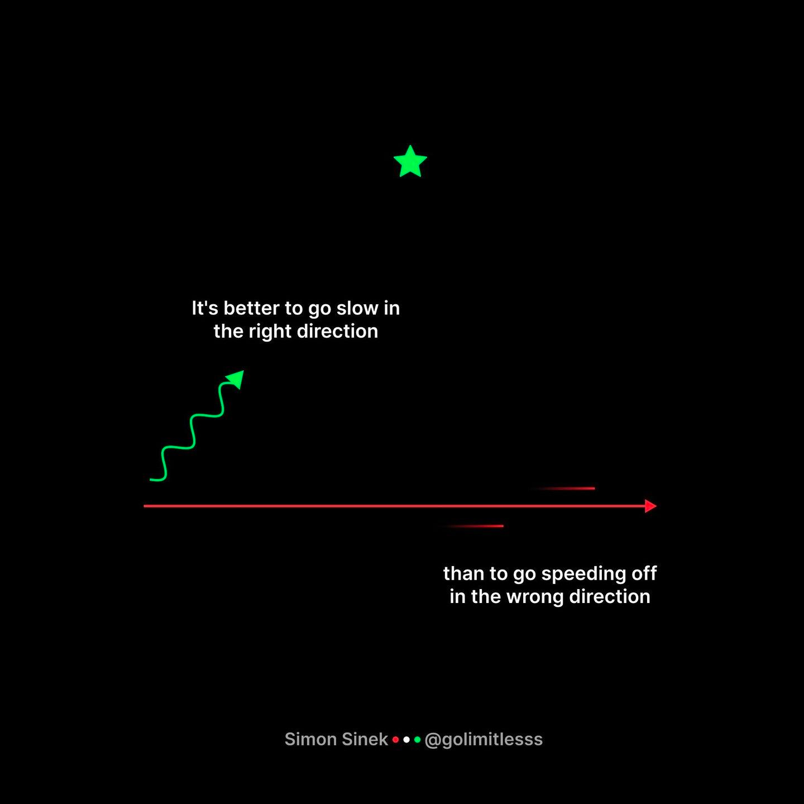
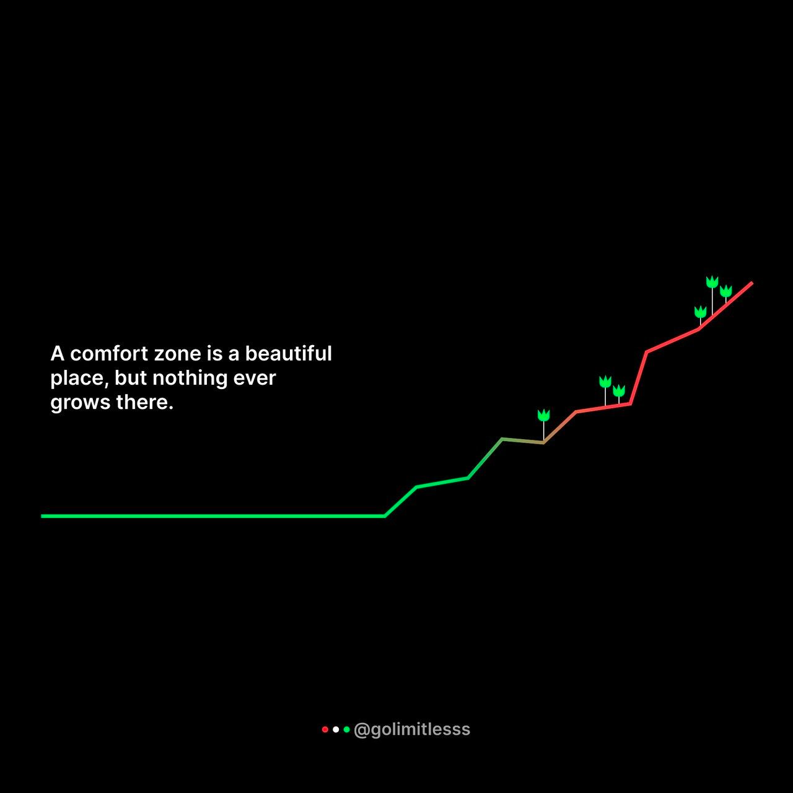

This time I'm not going to talk about tech here. Actually, I'm not even going to talk about anything deterministic. My real goal with this post is to show how we can persist for a long time in something we think is right, while at the same time it's not doing us any good.

This is a personal story, one that played out over many, many months. It's also a story I consider one of growth, not just personal but professional. There's no script for this post, I don't even know what I'm going to write about, I'm just sitting here typing whatever comes to my head and seeing how it turns out.

So come along on this journey and, at the end, if you feel like you learned something, or this text made you think about something in some way, please tag me [on my Twitter (X?)](https://twitter.lsantos.dev) and I'd love to talk about it!

## I was wrong

In 2020, I published a [series of articles on dev.to](https://dev.to/_staticvoid/series/5962) about personal organization. Back then I thought I'd found the nirvana of personal organization, that I'd mastered everything there was to master about personal planning and productivity.

> Until I realized **I was wrong**, and how wrong I was...

That doesn't mean everything I wrote in that series of articles is completely unreal or untrue. Actually, the principle I present in them is entirely valid, I just thought that if I applied the same principle **everywhere** I'd get more and more successful, more and more productive.

The peak of my "productivity addiction" arrived when I organized everything, planned everything, nothing stayed in my brain for more than 10 minutes without landing in a to-do list or something like that. All my days were scripted, from start to finish, I had set hours to wake up, hygiene, lunch, work, side projects, sleep, and even for playing something or unwinding.

3 years later I realized I was living on autopilot, like I no longer had free will, and I'd built the very prison I locked myself into, and I hadn't even noticed.

> I realized I was living on autopilot

The worst part of it all is that, back then, I preached this kind of productivity to other people like I was some sort of evangelist, meaning I was trying to teach other people to get trapped in the same prison as me. And today I'm here to tell you that **no matter what you do, you're never going to have control over anything**.

## Control is an illusion

No matter how much I planned my time, no matter how colorful my calendar was, why did I feel like I wasn't going anywhere?

It took a long time for me to realize I'd boxed myself into such a strict kind of planning that I spent more time planning my day than actually doing anything useful. What we call [**planning paralysis**](https://en.wikipedia.org/wiki/Analysis_paralysis), or analysis paralysis. That's when you spend more time overthinking and analyzing everything to make it perfect before you even start doing anything.

I used to think I had to master 100% of anything before I could even try to train or do something. I never started any personal project, often about something important, because I needed to be sure of every step, until I noticed that **you really don't need to know everything**.

> You don't need to know everything to start

That became a lot more obvious after I started [my own TypeScript course](https://formacaots.com.br). Few people know this, but I made at least 6 previous versions of that same course, or of other courses, before I even started doing anything. Until I started talking to friends and other close people and everyone kept telling me: "You overthink, you need to stop thinking and start doing."

That hit me really deep, because I'd heard it my whole life, that I over-planned things, that I was the "thinker" type and not a "doer", and that "the world is full of ideas", so what was I doing about it?

## It's not about getting it right the first time

In the world of software development, choice paralysis is extremely common, so common that I basically trained my own brain to think I was always living inside a project plan.

I believed you could only move on to the next step of anything once you'd completely finished the previous one. And that affected me in several areas, both in personal relationships and in my career.

Early in a career, this kind of mindset can even help you, because you're more sure you got everything right before moving to the next step, and you only focus on one thing at a time. But even so, early in a career devs only focus on a single project. As you progress, you stop being someone taking care of a single project, you start taking care of multiple, then people, then teams. And now I ask you:

> Do you think you're going to get it right the first time?

If you think you will, I've got bad news for you... you need to manage your expectations. Because you won't. You might get it right once, but you're never going to consistently get it right the first time, and that's good, actually it's great.

Not getting it right the first time, but iterating on something that's "good enough", is better than doing it once and never coming back to improve what was made.

I worked for years at a company where the CTO had a phrase that, at the time, I hated, but I think a lot of people have heard it too:

> Done is better than perfect

Every time he said that to me I got furious inside. "_What do you mean he wants me to do a half-assed job and ship it to everyone?_", that was my thinking. Except, the more time passed, the more I started to think he was more and more right.

## Nobody cares, seriously...

I'll bring up software development as an example, because it's what I know how to do, but as a dev you're always going to think you have to write the best code, the most performant, the most beautiful, just to ship a feature.

While writing good code, code that's easy to maintain long term and well documented, is not only necessary but mandatory (at least in my opinion), your end users really don't care whether you wrote that if statement or not.

> If you're scared, go in scared anyway

It took me 5 or 6 years to start understanding what he meant back then. But when I understood it was never about writing bad quality code, but rather the same thing everyone had been telling me since I was a kid: **just do it, then see what comes of it**.

It's not about shipping code or a product you know is bad, but about **shipping something**, doing something, **having something to show**. It doesn't matter if it's still a bit rough, if it doesn't have 100% test coverage, what matters is that this thing stopped being a concept and became reality.

That was especially hard for me, being a neurodivergent person (a topic for another post), to accept the idea that you need to start, even if it's imperfect. I've always been an extremely detail-oriented person, as I mentioned before, I could only move to the next part once the previous part was completely done, perfect. But that was an important lesson too.

> Nothing is ever finished. It's just good enough.

## You Will Never Finish Anything

Something that was even harder for me to understand, and to this day I'm still not entirely comfortable with this idea or with the idea that I need to "just do it", was the concept of "good enough".

A friend once told me he'd seen (or read, I don't remember) an interesting line in a software development book that said: **there are no finished projects, there are only projects that got abandoned for being "good enough".**

And then, digging a bit more for this post (a vent, maybe?) I found out that the original line is, or at least we believe it is, from **Leonardo Da Vinci**, and it's about art, of course.

> Art is never finished, only abandoned

So we took the line and drew a parallel with software development. Even though I think it's a bit presumptuous of us, I still think it's true that no kind of project is ever really finished. And that's because **we don't know the future**.

Just today I read a [really cool article](https://medium.com/vanguards-of-code/youre-not-a-senior-software-engineer-9056ef9ffb96) that said nobody is a senior software engineer right out of the gate. I'll leave the analysis of that article for another day, but, in the end, it says something that's really important:

> We're always wrong. We're never going to get it right, because products change, people change, everything changes.

And, the same way people change, we change too. Projects that used to matter to us, or that used to be useful, end up becoming things we no longer see the same way, that we abandon, not because they're bad, simply because they were good enough, and now they aren't anymore.

Another interesting thing I noticed is that consistency beats big spikes of growth or development. It's better to grow little by little than to grow all at once. [Addy Osmani](https://www.linkedin.com/in/addyosmani/recent-activity/all/) is one of the people who constantly posts about this in little images on LinkedIn that I find really cool and motivational, and that follow what's known as a [stoic mindset](https://www.linkedin.com/posts/addyosmani_motivation-productivity-growth-activity-7097821706542612480-BcMp?utm_source=share&utm_medium=member_desktop), a variation of [Stoicism](https://pt.wikipedia.org/wiki/Estoicismo). With images like this one.

> **Warning**. The messages are kind of "coachy", so try to look past the motivational tone and focus on the message.

## Embrace change

The only constant we have in life is change, and that can feel like hell, especially for someone with any kind of control complex, or even for people like me, who only really function in environments that are in order, and have no other goal than putting some kind of chaos into order.

Bad news for us: order never arrives.

> Order never existed, and never will

I learned that pretty early, understanding that I was never going to manage to control everything. Like I said, control is just an illusion we tell ourselves to calm our own fears. I really like tattoos, I've got 18 so far (and counting), and the first tattoo I ever got was a fairly discreet math equation on my left wrist, but it became the most important thing to me.

In 1877 an Austrian physicist named [Ludwig Boltzmann](https://en.wikipedia.org/wiki/Ludwig_Boltzmann) proposed an equation that's still used today to define the "measure of disorder" in a system. There are pragmatic, correct explanations of that equation, as well as philosophical variations of it. One of my favorites is:

> Disorder is far more likely than order. Because there are simply a lot more disordered states than ordered ones

And all of that is described in the equation `S=KlogW`, which is my tattoo, but why did I tell you this story?

Some people have special items, others have specific thoughts, everyone has their own anchor or lighthouse they look for in moments of uncertainty, whether it's family, friends, vices, books, games, and so on. Mine is change.

I think that, no matter what happens, change is the only constant that remains, disorder is the only thing left standing at the end, and it's itself in constant change. So any situation, no matter how complicated, is just one of thousands of possible states of disorder, which will eventually pass and vanish.

There's a certain beauty in change, a beauty I myself resisted accepting until not long ago, even with change literally tattooed on my skin. I used to think every problem was the last one, that I always had to get it right, and that's not true. What matters is the path, not the ending, especially since there is no ending.

## The lesson

I could write for days about this, but I think it's time to wrap up this post. And, if I could pick one lesson for you to take away from here, let it be that **you're never going to have control, but that's a good thing, because it means you can keep changing and improving.**

I don't know if this is going to be a post people find worthwhile, one that helps other people or not, but if you liked it, comment here and hit me up [on my socials](https://lsantos.dev), I'm genuinely curious to know if anyone's even going to read this or get some kind of _insight_ out of what I'm posting here.

Either way, I hope you got something useful out of this read, and I hope to write more articles like this one in the future. And remember:

> Done before perfect

Lucas.
