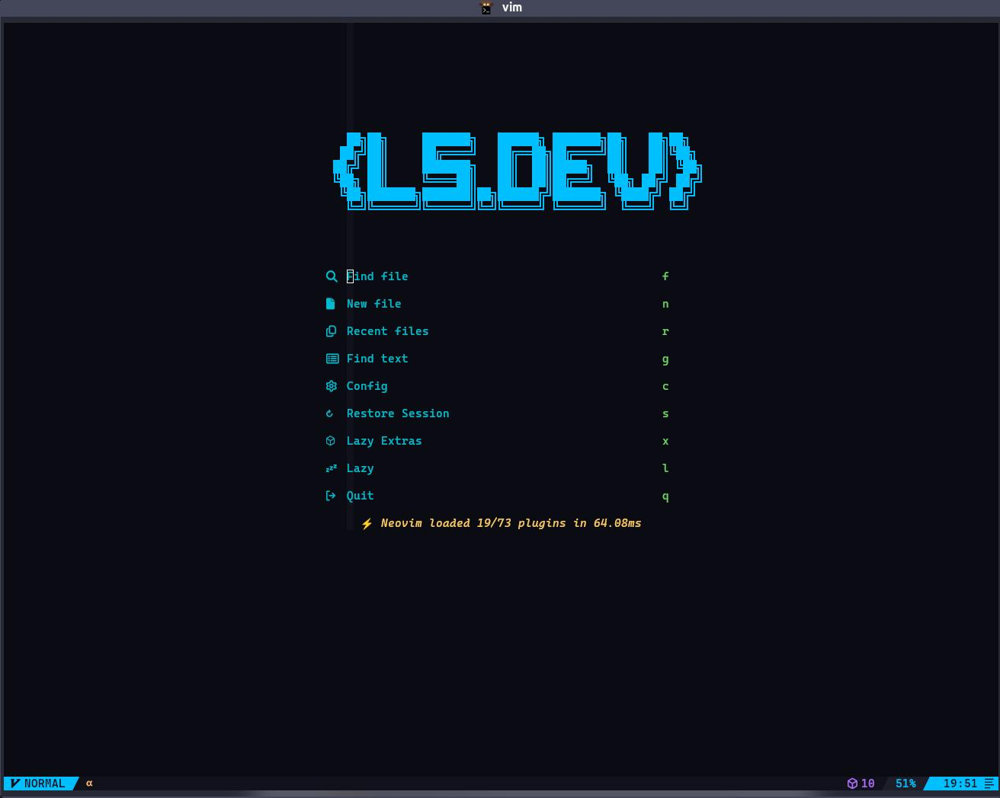
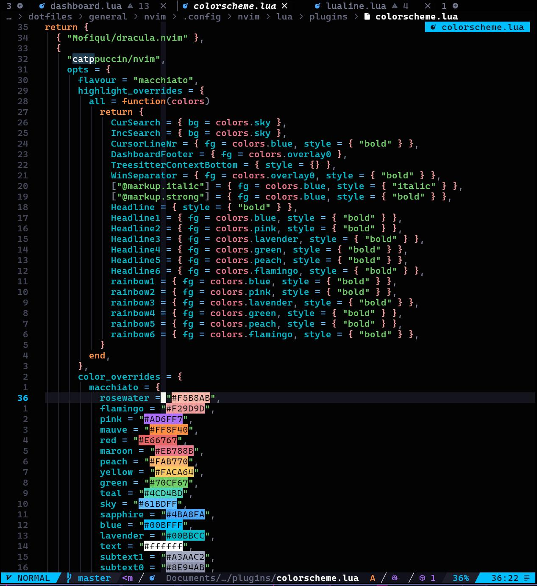
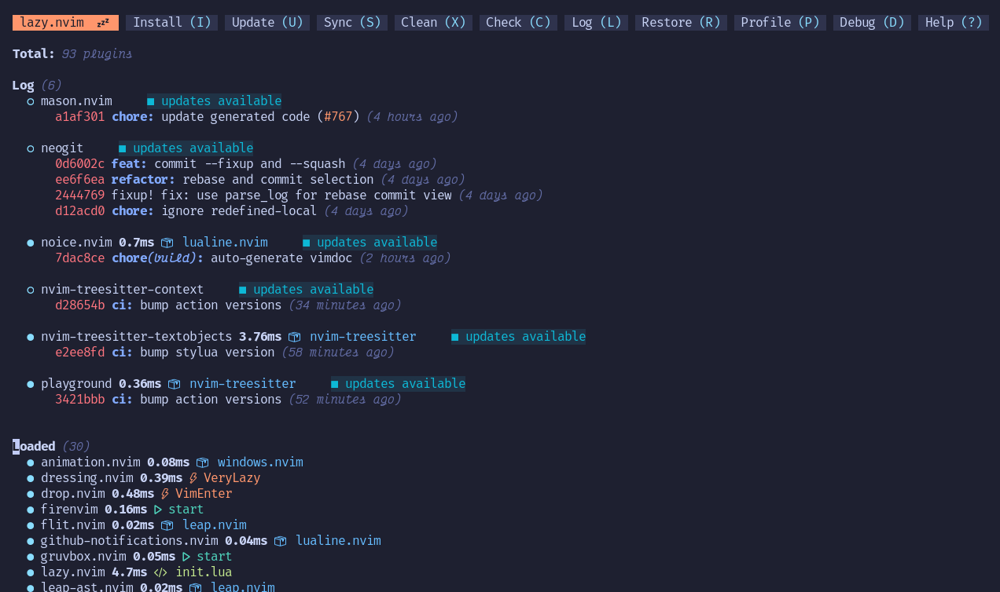
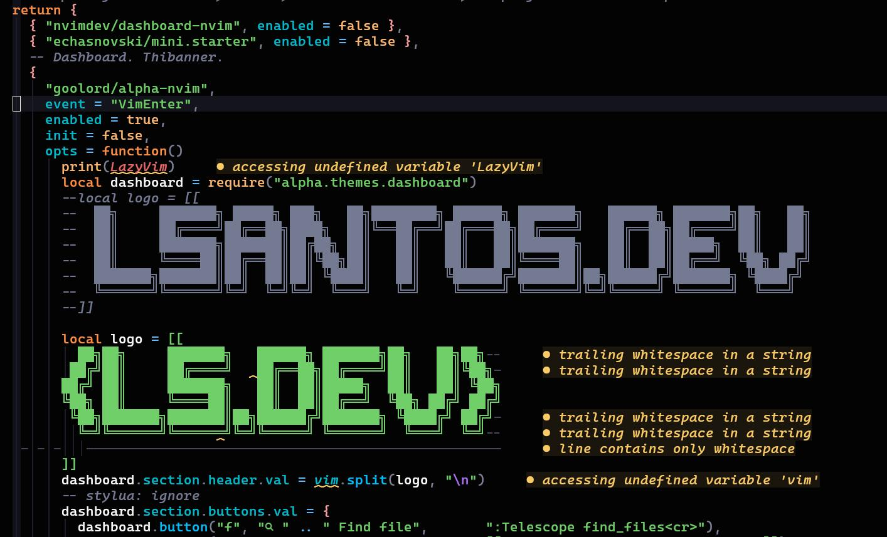
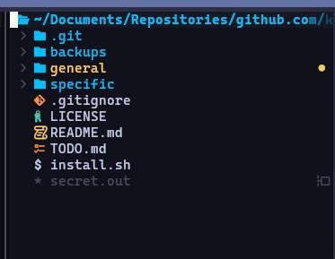
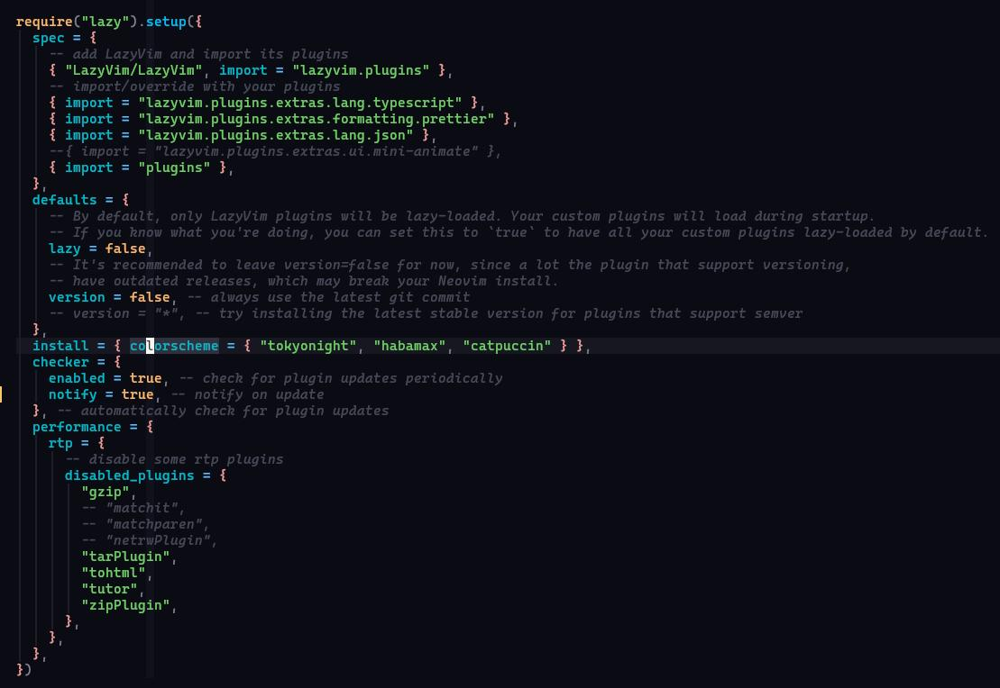
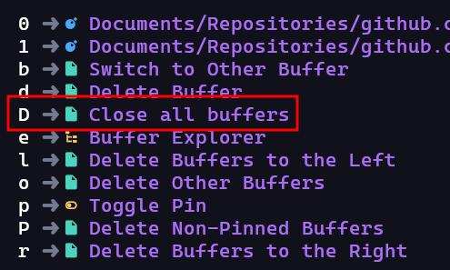
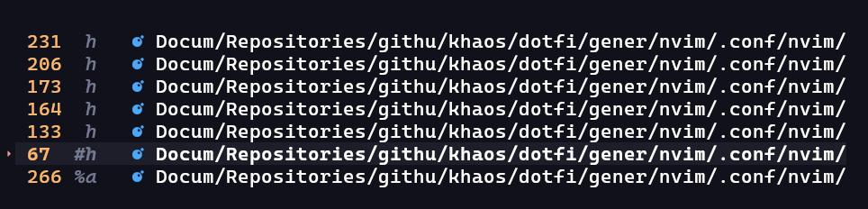

Eu sempre gostei do Vim, mas esse editor é mundialmente conhecido por ser uma das peças de software mais complexas de aprender já criadas, até ganhando a fama de ser o lugar que você entra e nunca mais sai.


Porém existe a promessa da "produtividade super-humana" uma vez que você consegue se sentir confortavel o suficiente com ele.

Recentemente eu resolvi deixar de usar o VSCode 100% e começar a usar apenas o Neovim, e eu vou te mostrar como eu fiz pra deixar ele exatamente desse jeito:



Se você já conhece o editor, pode pular direto para a parte de instalação. Ou, se você quiser saber mais sobre a história do Vim, Vi e Neovim, deixa eu te contar.

### Um pouco sobre Vim

Se você não sabe o que é o [Vim](https://en.wikipedia.org/wiki/Vi_\(text_editor\)), em poucas palavras, é um dos editores de texto mais antigos que ainda estão em uso. Ele foi criado por um cara chamado [Bram Molenaar](https://en.wikipedia.org/wiki/Bram_Moolenaar) em 1991 como uma melhoria ao editor original _Vi_, criado por [Bill Joy](https://en.wikipedia.org/wiki/Bill_Joy) em 1976 como um modo _vi_sual para um outro editor chamado `ed`. Por isso que Vim é o acrônimo de "Vi improved".

O Vi, assim como o Vim, introduziu uma mudança drástica na forma de editar textos, a movimentação quase cirúrgica do cursor, e também a movimentação usando as teclas HJKL, como eu expliquei nessa thread:

> 🤓 História da computação pt 2: POR QUE O VIM USA H, J, K e L COMO SETAS???? Já que vocês curtiram minha última thread sobre TTY eu vou falar uma outra parte da história da computação aqui e por que a tecnologia de hoje é basicamente a mesma de 60 anos atrás. Só mais colorida [pic.twitter.com/qw4QU18OXt](https://t.co/qw4QU18OXt) — Lucas Santos 🇧🇷🇸🇪 • formacaots.com.br 💎 (@\_StaticVoid) [July 23, 2024](https://twitter.com/_StaticVoid/status/1815722344142279159?ref_src=twsrc%5Etfw)
>
> — [via Twitter](https://twitter.com/_StaticVoid/status/1815722344142279159?ref_src=twsrc%5Etfw)

Desde então muita gente adora usar o Vim porque ele é extremamente leve, fácil de configurar e tem basicamente uma linguagem própria de programação (VimL) que permite que você faça macros e muitas outras coisas de forma absurdamente poderosa.

O único problema é que ele tem uma das maiores curvas de aprendizado da história porque os comandos são definidos como sequências de teclas individuais e combinação de letras, mas quem consegue dominar o Vim tem um aumento estrondoso de produtividade simplesmente pelo fato de que o editor é extremamente responsivo.

> [!NOTE] 💡
> Não vou focar em como usar o Vim aqui, até porque eu mesmo não sou um mestre do uso dele, mas existem vários sites legais como o [Vim Adventures](https://vim-adventures.com) e extensões do [VSCode](https://marketplace.visualstudio.com/items?itemName=vintharas.learn-vim) que você pode pesquisar.

Infelizmente o Vim sozinho, do jeito que ele vem "de fábrica", apesar de totalmente usável, não é o que eu chamaria de um bom editor de código, ele poderia ter sido lá em 1991, mas com o avanço das tecnologias, a integração cada vez mais próxima das linguagens com os editores e o movimento saindo dos grandes e complexos IDEs para editores menores com suporte a plugins deixou o Vim um pouco defasado, mesmo que ele tenha ganhado suporte a plugins.

#### Entra o Neovim

Neovim é um fork do Vim original feito por um Brasileiro chamado [Thiago Arruda](https://github.com/tarruda) depois que ele [não conseguiu apoio](https://groups.google.com/g/vim_dev/c/65jjGqS1_VQ?pli=1) para implementar uma mudança no Vim original que permitiria que o editor tivesse múltiplas threads e pudesse ser controlado por processos externos. O primeiro commit do Neovim aconteceu em [31 de janeiro de 2014](https://github.com/neovim/neovim/commit/72cf89bce8e4230dbc161dc5606f48ef9884ba70).

Dentre as muitas novidades do Neovim, o suporte nativo a [Lua](https://en.wikipedia.org/wiki/Lua_\(programming_language\)) é uma das principais, o que significa que você pode escrever plugins e ferramentas de forma muito mais simples do que usando C ou VimL que, apesar de boas, são complicadas. Além de ter processamento assíncrono e ter o suporte nativo a [LSP](https://en.wikipedia.org/wiki/Language_Server_Protocol)s (Language Server Protocol) que permitem a comunicação em tempo real do que você está escrevendo e um servidor em background que vai analisar o seu código (assim que a gente consegue auto completions, intellisense e análise de erros).

A partir daí o NVim ganhou cada vez mais suporte da comunidade e um aporte de algumas empresas através do OpenCollective e agora é um projeto open source completamente auto sustentável e mantido por alguns devs em tempo integral. E vai ser ele que vamos modificar hoje.

<CourseCTA />

### Pré requisitos

Antes de a gente começar eu vou falar alguns pré-requisitos que você precisa ter para poder seguir esse tutorial de um jeito que você consiga aproveitar

#### 1 - Tenha algum tipo de Linux

Embora seja sim possível [instalar o Neovim em Windows com o Powershell](https://dev.to/hoo12f/setting-up-neovim-with-windows-powershell-2208), eu vou fazer a mesma coisa com um sistema Linux. Você pode estar usando Mac, alguma distribuição Linux, ou até mesmo o WSL no Windows com a distro que você preferir.

Eu estou escrevendo esse artigo em um Arch Linux, mas tudo que eu falar aqui pode ser transposto para o Mac (Darwin) sem problemas, os arquivos ficam no mesmo lugar.

#### 2 - Tenha uma shell pronta

Eu estou usando um ZSH com o Zinit e vários plugins (você pode ver meus dotfiles [aqui](github.lsantos.dev/dotfiles/blob/master/general/base/.zshrc)), a shell em si não importa, você pode usar bash, sh, Fish, ou o que for, o importante é que você tenha ela totalmente configurada para evitar problemas com variáveis de ambiente.

#### 3 - Instale o Neovim

Você pode instalar o Neovim seguindo diretamente as instruções do [site oficial](https://github.com/neovim/neovim/blob/master/INSTALL.md), no geral, para Mac você já deve ter ele instalado por padrão, caso contrário é só usar o [Homebrew](https://brew.sh) com `brew install neovim`.

No caso do Arch eu usei o [YaY](https://github.com/Jguer/yay) com `yay -S neovim`, provavelmente sua distribuição tem alguma coisa do mesmo tipo.

Depois de instalado, quando você executar o neovim pela primeira vez digitando `nvim`, sem nenhuma configuração, ele vai parecer com isso aqui:



> É possível sim sair do Neovim apertando `esc` e depois `:q!<enter>`

#### 4 - NerdFonts

Uma parte importantíssima desse setup são as [NerdFonts](https://www.nerdfonts.com). Uma NerdFont é uma fonte comum, porém empacotada com **todos os ícones e glifos imaginados**. Basicamente é como se sua fonte Arial tivesse um monte de desenhos junto, incluindo ícones do Font Awesome e um monte de outros glifos transformados em fontes que a gente vê por ai.

Você pode instalar a fonte que você preferir, mas uma fonte obrigatória é a MesloLG. Você pode instalar essas fontes de várias formas, a mais simples é ir até a página de [downloads](https://www.nerdfonts.com/font-downloads) achar a fonte e incluir na sua biblioteca de fontes.

> [!IMPORTANT] 💡
> Como regra geral, prefira sempre instalar as variações NerdFont da sua fonte preferida se elas existirem, a chance de você ter problemas com textos não sendo exibidos vai ser muito menor.

Outra forma que eu prefiro é instalar usando o seu gerenciador de pacotes, no caso do brew você pode procurar por fontes usando `brew search font-<nome>` e baixar a que estiver com o nome `nerd-font` no final, por exemplo:

```bash
$ brew install --cask font-meslo-lg-nerd-font
```

No caso do Arch é a mesma coisa só que com o yay:

```sh
$ yay -S ttf-meslo-nerd
```

Se você quiser instalar outras fontes, eu também recomendo a _CaskaydiaCove Nerd Font_ (minha atual fonte)_, Fira Code Nerd Font_, e a _Hack_ que são fontes bem interessantes e fáceis de ver.

#### 5 - Lazygit

Instale o LazyGit, que é um cliente de git direto pelo terminal. Você pode instalar ele diretamente pelo brew com o `brew install lazygit` ou `yay lazygit` no caso do Arch.

### Lazy e LazyVim

Eu não vou entrar em detalhes das bases do Vim, ou do Neovim, mas eu quero ir direto ao ponto e mostrar como você pode começar o mais rápido possível de um jeito bem simples com ele.

Existe um projeto de um plugin manager chamado [lazy.nvim](https://lazy.folke.io).



A ideia de um gerenciador de plugins, assim como um gerenciador de pacotes tipo NPM, RubyGems ou qualquer outra coisa é literalmente tornar fácil o carregamento de funcionalidades externas através de plugins no Neovim, pense nele como se fossem as extensões do VSCode.

Pois bem, o mesmo criador do lazy.nvim deu um passo a mais e criou um "kit iniciante" para quem quer começar com neovim já com vários bons setups iniciais, uma série de plugins e uma série de configurações prontas. E esse é o [LazyVim](https://www.lazyvim.org)


O LazyVim é extremamente parecido com o VSCode, o que torna todo o processo bem simples e fácil de transitar, além de ter uma série de comandos que já estão prontos e uma busca de keybindings pra você não se perder. Fora que ele também suporta mouse, então caso você queira clicar em alguma coisa é bem simples.

#### Instalando

A instalação do LazyVim é bem direta, primeiro você faz um backup das suas configurações:

```sh
mv ~/.config/nvim{,.bak}
mv ~/.local/share/nvim{,.bak}
mv ~/.local/state/nvim{,.bak}
mv ~/.cache/nvim{,.bak}
```

Lembrando que nem todas as pastas vão existir, ainda mais se você criou a instalação do Neovim agora.

> Por padrão todas as configurações vão ficar salvas em `$HOME/.config/nvim` mas o LazyVim vai ser instalado em `$HOME/.local/share/nvim/lazy`, incluindo todas as configurações e plugins que ele já tem. Lembrando que você **NÃO** deve mexer nesse diretório.

Depois é só clonar o repositório com o Git:

```sh
git clone https://github.com/LazyVim/starter ~/.config/nvim
```

E ai remover a pasta `.git` de dentro desse repositório pra que você possa modificar sem ter o histórico.

Agora é rodar o comando `nvim`, você já deve ver algumas mudanças na sua configuração e deve estar vendo a tela padrão do Lazy


Digite `:LazyHealth` e aperte enter, para garantir que tudo está rodando legal.

#### A tecla \<leader>

O Lazy, assim como muitos outros, tem uma tecla base para as demais combinações, essa tecla é a `<leader>` que é mapeada para a barra de espaço por padrão, aperte `<leader>` e você vai ver um guia de keybindings aparecendo na parte de baixo da tela, esse é um plugin chamado _WhichKey_ (que também foi criado pelo [Folke](https://github.com/folke), o criador do Lazy):



Basta apertar a próxima tecla da sequência para executar a ação ou para ir para a próxima página (no caso das bindings que tem um `+` na frente, como `+g` que abre o git), tente `<leader>l`, e veja a tela "home" do Lazy se abrir:


Você pode navegar por essa janela usando as letras no cabeçalho, por exemplo `I` mostra todos os plugins instalados, `U` vai atualizar todos eles, `S` vai sincronizar com o repositório e assim vai.

> Lembre-se que `U` e `u` são diferentes na perspectiva do Vim. Então se você ver uma sequência como `<leader>bD`, digite exatamente como é: `<espaço>b<shift>d`

Aperte `q` para sair do painel. Agora chegou o momento de fazer um tour pelas funcionalidades básicas

### Tour básico

Vamos começar com as funcionalidades mais simples e mais úteis.

#### Explorer (Neotree)

O Lazy vem com um plugin chamado `neotree`, que é um plugin para mostrar uma barra de navegação de arquivos como o explorer do VSCode. Você pode acessar essa funcionalidade com `<leader>e`.

> Você não precisa esperar até o WhichKey aparecer, é só apertar o mais rápido que conseguir, lembre-se que é a velocidade aqui.



Você pode navegar por ela com HJKL, J e K vão descer e subir, H e L navegam para dentro e fora de pastas. Para abrir um arquivo aperte Enter, aqui estão alguns atalhos úteis:

-   `a`: Cria um novo arquivo
-   `r`: Renomear o arquivo
-   `d`: Deleta o arquivo
-   `C`: Fecha a pasta atual e sobe um nível
-   `/`: Inicia a busca
-   `?`: Mostra a lista de atalhos

#### Movimentação

Abra o vim na pasta `~/.config/nvim`, vamos começar dali. Selecione o arquivo `lua/config/lazy.lua`. Esse é o principal arquivo de configuração do lazy, mas a gente quase nunca vai mexer nele.

<Figure src="./instalando-e-configurando-o-neovim/image-7.png" alt="" wide />

Aperte `<C-l>` ou `<Ctrl>+l` para voltar ao Neotree, agora abra o arquivo `options.lua`, veja que temos duas abas no topo, esses são os buffers, cada buffer é um arquivo em memória, e é importante dizer que não são abas!

> No Vim o conceito de abas e buffers é diferente, abas são como se fossem espaços completamente separados que podem ter uma configuração de janelas completamente a parte, buffers são os arquivos abertos dentro de uma aba e eles podem ser reorganizados em janelas nessa aba. Na maioria das vezes você só vai ter uma aba aberta.

Para se mover entre um arquivo e outro use `L` e `H` , ou `gn` e `gp`. Você também pode tirar proveito de um outro plugin, o Telescope.

Feche esse buffer com `<leader>bd`.

> [!IMPORTANT] 💡
> O Vim tem o conceito de buffers e janelas. Um buffer é um arquivo ou fonte de texto que você está editando, ele pode ou não ser um arquivo físico no computador, mas ele sempre será um arquivo em memória, quando você escreve no buffer, você está primeiro escrevendo na memória e, ao salvar, passando a escrita para o arquivo.
>
> Uma janela é como se fosse uma outra instância da sua janela do Vim, é como se fosse uma outra aba de um browser, um ambiente diferente e isolado de qualquer outro buffer

#### Telescope

O Telescope é outro plugin feito para buscar arquivos. Vamos abrir outro arquivo com ele, aperte `<leader>ff` para abrir a janela do Telescope:

<Figure src="./instalando-e-configurando-o-neovim/image-8.png" alt="" wide />

Aqui você pode digitar direto para buscar o arquivo, navegar com as setas ou com `<C-n>` e `<C-p>`, você também pode abrir a lista de atalhos com `<C-?>`. Abra outro arquivo com ele.

> Você também pode acessar o telescope para arquivos com `<leader><leader>`

Existem infinitas opções do Telescope. Por exemplo, você pode buscar dentre todos os arquivos abertos (buffers) com `<leader>fb`, na verdade, a maioria das coisas que você pode fazer com o Telescope vai estar dentro de `<leader>f`, ou então de `<leader>s`, que são os comandos de busca globais.

### Configuração

Agora que a gente sabe o básico, vamos começar a configurar o nosso editor. O Lazy vai inicialmente ler todos os arquivos dentro da pasta `lua/config` como configurações iniciais, começando com o `lazy.lua`, depois ele vai ler todos os plugins dentro da pasta plugins.

Então para poder adicionar novas funcionalidades a gente só precisa mudar esses arquivos:

-   `lua/config/options.lua`: Opções gerais e configurações do tipo on/off
-   `lua/config/keymaps.lua`: Mapeamento de teclas, aqui que vamos modificar os atalhos
-   `lua/config/autocmds.lua`: Se você tiver algum auto command do vim, aqui é o lugar de colocar
-   `lua/plugins`: Qualquer arquivo lua aqui dentro será lido e adicionado nos plugins, então você pode separar por categoria (ui, search, code, etc) ou pelo nome do plugin, que é o que eu fiz.

#### Lazy.lua

Vamos começar pelo arquivo que a gente tem que modificar menos, o arquivo `lazy.lua`, aqui vamos habilitar somente o que são chamados de `LazyExtras`, configurações de fábrica que o Lazy já traz prontas e permite que você estenda ou modifique depois na pasta `plugins`.



Vamos focar nessa seção apenas, descomente as três linhas que estão acima de `{ import = "plugins" }`, a primeira vai habilitar o suporte nativo a TypeScript (que vamos configurar depois nos LSPs), a formatação com Prettier e a extensão para JSON.

Além disso, já vamos adicionar um tema, eu estou usando o tema `catpuccin` modificado, mas não vamos instalar ele agora.

> Lembrando que você pode instalar qualquer tema que você quiser e o próprio Lazy já tem alguns pré instalados que você pode testar com `<leader>uC`

Outro detalhe é que, depois de algumas atualizações do Lazy, a integração do TypeScript acabou começando a usar um outro LSP (vamos falar dele já já) então eu acabei desabilitando essa configuração.

### options.lua

O arquivo options é o arquivo que vai ter as opções principais, como tamanho dos espaços, colunas e etc, geralmente é um arquivo bem pequeno e bem pessoal, no meu caso eu coloquei apenas as configurações mais simples:

```lua
-- Options are automatically loaded before lazy.nvim startup
-- Default options that are always set: https://github.com/LazyVim/LazyVim/blob/main/lua/lazyvim/config/options.lua
-- Add any additional options here
--
-- -- Enable the option to require a Prettier config file
-- If no prettier config file is found, the formatter will not be used
vim.g.lazyvim_prettier_needs_config = true
-- Auto wrap
vim.opt.wrap = true
-- Attempt to fix indent
vim.opt.tabstop = 4
vim.opt.shiftwidth = 4
vim.opt.expandtab = true
vim.opt.autoindent = true
vim.opt.smarttab = true

-- Highlights for cursor column
vim.cmd.set("cursorcolumn")
vim.cmd("highlight CursorColumn ctermbg=Blue")
vim.cmd("highlight CursorColumn ctermfg=Black")

-- Vim does not recognize the alt key in Mac
-- https://stackoverflow.com/questions/7501092/can-i-map-alt-key-in-vim
-- So we have to use the response from stty -icanon; cat (press alt + key)
-- to get the correct key code, then we can map it to something else
-- NOTE: ^[ is the escape character \e in vim
vim.cmd("set <M-BS>=\\e?") -- in this example alt+backspace is ESC+? which is mapped to <M-BS>
```

De cima para baixo, as configurações são as seguintes:

-   Desabilita o prettier se não houver um arquivo de configuração `.prettierrc` na pasta, porque eu não gosto de habilitar o prettier globalmente (na verdade eu não gosto de habilitar nada globalmente)
-   Ativo o Auto Wrap, para poder quebrar as linhas automaticamente quando chegam no fim da tela
-   As próximas opções desde `tabstop` até `smarttab` são relacionadas à configuraçòes de tabs e espaços, aqui eu estou definindo que cada tab será 4 espaços e, por padrão, os projetos vão usar 4 espaços de indentação. Isso não é algo que eu gosto muito, mas infelizmente a maioria dos projetos que estou usando ultimamente estão usando essa configuração.
-   Seto uma linha mais clara onde meu cursor estiver, tanto na horizontal quanto na vertical, isso ajuda a achar mais facilmente ele na tela
-   A última opção é uma alteração para que o Vim reconheça a tecla Alt no Mac, que é mapeada para o command, veja o link no comentário para entender melhor como funciona

### autocmds.lua

Outra coisa interessantíssima do vim é que é possível executar comandos automaticamente de acordo com hooks de execução, por exemplo, sempre que entrar em um buffer que tenha um determinado nome, ou sempre que sair de algum buffer, e assim vai.

Eu tenho algumas funções específicas para arquivos markdown - que eu acabo usando bastante - como: setar o tipo do arquivo para markdown, definir uma linha a 80 chars para limitar o texto, etc

```lua
-- Autocmds are automatically loaded on the VeryLazy event
-- Default autocmds that are always set: <https://github.com/LazyVim/LazyVim/blob/main/lua/lazyvim/config/autocmds.lua>
-- Add any additional autocmds here
local function augroup(name)
  return vim.api.nvim_create_augroup("custom_" .. name, { clear = true })
end

-- auto set markdown filetype
vim.api.nvim_create_autocmd({ "BufNewFile", "BufFilePre", "BufRead" }, {
  pattern = { "*.md" },
  callback = function()
    vim.cmd("set filetype=markdown")
  end,
})

-- Auto set markdown to break at 80 chars and highlight the 80th column
vim.api.nvim_create_autocmd({ "BufWinEnter" }, {
  pattern = { "*.md" },
  callback = function()
    vim.opt.colorcolumn = "80"
    vim.opt.textwidth = 80
  end,
})

-- On leaving markdown files, reset the colorcolumn and textwidth
vim.api.nvim_create_autocmd({ "BufWinLeave" }, {
  pattern = { "*.md" },
  callback = function()
    vim.opt.colorcolumn = "120"
    -- disabled textwidth
    vim.opt.textwidth = 0
  end,
})

-- auto set i3config filetype
vim.api.nvim_create_autocmd({ "BufNewFile", "BufFilePre", "BufRead" }, {
  pattern = { "*.i3config" },
  callback = function()
    vim.cmd("set filetype=i3config")
  end,
})
```

Esse arquivo não é obrigatório, e muitas vezes vai estar vazio, a não ser que você tenha algum tipo de comando que queira sempre rodar de acordo com algum tipo de buffer, por exemplo, sempre executar um ESLint quando tiver em um arquivo JS ou algo assim.

### keymaps.lua

O último dos arquivos na pasta `config` é o arquivo `keymaps.lua`, como você deve imaginar, ele tem os atalhos de teclado que você quer customizar. Nesse ponto eu vou colocar o meu arquivo inteiro aqui, que é bastante grande, mas você não precisa seguir exatamente o que existe aqui, fique a vontade para poder adicionar os que você quiser.

Vou tentar deixar comentários onde for pertinente

```lua
-- Keym automatically loaded on the VeryLazy event
-- Default keymaps that are always set: https://github.com/LazyVim/LazyVim/blob/main/lua/lazyvim/config/keymaps.lua
-- Add any additional keymaps here

-- Habilita voltar onde paramos em qualquer busca do telescope
vim.keymap.set(
  "n",
  "<leader>sx",
  require("telescope.builtin").resume,
  { noremap = true, silent = true, desc = "Resume telescope search" }
)

-- Move blocos de texto no Linux
vim.keymap.set("v", "<A-j>", "<cmd>m '>+1<cr>gv=gv", { noremap = true, silent = true, desc = "Move line down" })
vim.keymap.set("v", "<A-k>", "<cmd>m '<-2<cr>gv=gv", { noremap = true, silent = true, desc = "Move line up" })
vim.keymap.set("n", "<A-j>", ":m '.+1<CR>==", { noremap = true, silent = true, desc = "Move line down" })
vim.keymap.set("n", "<A-k>", ":m '.-2<CR>==", { noremap = true, silent = true, desc = "Move line up" })

-- Move blocos de texto (mac)
-- https://stackoverflow.com/questions/7501092/can-i-map-alt-key-in-vim)
vim.keymap.set("v", "˚", ":m '<-2<CR>gv=gv", { noremap = true, silent = true, desc = "Move line up" })
vim.keymap.set("v", "∆", ":m '>+1<CR>gv=gv", { noremap = true, silent = true, desc = "Move line down" })
vim.keymap.set("n", "∆", ":m '.+1<CR>==", { noremap = true, silent = true, desc = "Move line down" })
vim.keymap.set("n", "˚", ":m '.-2<CR>==", { noremap = true, silent = true, desc = "Move line up" })

-- Muda de janelas em modo de edição usando tabs
vim.keymap.set("n", "<F8>", "gt", { noremap = true, silent = true, desc = "Switch to next tab" })
vim.keymap.set("n", "<F7>", "gT", { noremap = true, silent = true, desc = "Switch to previous tab" })

-- duplica a linha atual para baixo
vim.keymap.set("n", "<C-S-d>", "yyp", { noremap = true, silent = true, desc = "Duplicate line down" })

-- Comandos relativos a navegação em buffers

-- Próximo buffer da lista
vim.keymap.set("n", "gn", "<cmd>bn<cr>", { noremap = true, silent = true, desc = "Next buffer" })
vim.keymap.set("n", "<tab><tab>", "<cmd>bn<cr>", { noremap = true, silent = true, desc = "Next buffer" })
vim.keymap.set("n", "<tab>n", "<cmd>bn<cr>", { noremap = true, silent = true, desc = "Next buffer" })

-- Buffer anterior
vim.keymap.set("n", "<S-tab>", "<cmd>bp<cr>", { noremap = true, silent = true, desc = "Previous buffer" })
vim.keymap.set("n", "gp", "<cmd>bN<cr>", { noremap = true, silent = true, desc = "Previous buffer" })
vim.keymap.set("n", "<tab>p", "<cmd>bp<cr>", { noremap = true, silent = true, desc = "Previous buffer" })

-- deletar/fechar buffer
vim.keymap.set("n", "<tab>d", "<cmd>bd<cr>", { noremap = true, silent = true, desc = "Delete buffer" })
vim.keymap.set("n", "<tab>q", "<cmd>bd<cr>", { noremap = true, silent = true, desc = "Delete buffer" })
vim.keymap.set("n", "<tab>w", "<cmd>bd<cr>", { noremap = true, silent = true, desc = "Delete buffer" })

-- busca no telescope para buffers
vim.keymap.set("n", "<tab>f", "<cmd>Telescope buffers<cr>", { noremap = true, silent = true, desc = "Find buffer" })

-- Deleta a palavra atual com Alt+BS
-- mac (see options.lua)
vim.keymap.set("n", "<M-BS>", "hdiw", { noremap = true, silent = true, desc = "Delete word" })
-- linux
vim.keymap.set("n", "<A-BS>", "hdiw", { noremap = true, silent = true, desc = "Delete word" })

-- cmd P para encontrar arquivos
vim.keymap.set("n", "<C-p>", "<cmd>Telescope find_files<cr>", { noremap = true, silent = true, desc = "Find files" })

-- cria um terminal novo
local wk = require("which-key")
wk.add({
  { "<leader>t", group = "Terminals" },
  {
    "<leader>tt",
    function()
      TermNumber = (TermNumber or 0) + 1
      local term = require("toggleterm")
      term.toggle(TermNumber)
    end,
    desc = "New toggle terminal",
  },
  { "<leader>ts", "<cmd>:TermSelect<cr>", desc = "Find open terminals" },
  { "<leader>tf", "<cmd>:TermSelect<cr>", desc = "Find open terminals" },
  { "<leader>tr", "<cmd>exe v:count1 . 'ToggleTermSetName'<cr>", desc = "Rename open terminals" },
  {
    "<leader>th",
    "<cmd>exe v:count1 . 'ToggleTerm'<cr>",
    desc = "Toggle docked terminal (prefix number before command)",
  },
  { "<C-.>", "<cmd>:ToggleTerm<cr>", group = "Terminals", desc = "Toggle docked terminal", mode = { "n", "t" } },
})

-- controle de banco de dados com o plugin DadBod
wk.add({
  { "<leader>D", group = "Database" },
  { "<leader>DD", "<cmd>DBUI<cr>", desc = "Toggle DBUI" },
  { "<leader>Dx", "<cmd>call <SNR>79_method('execute_query')<cr>", desc = "Run Query" },
})

-- deleta uma marca do vim usando delmark
wk.add({
  { "<leader>dm", "<cmd>exe 'delmark ' . nr2char(getchar())<cr>", desc = "Delete a mark <markname>" },
})

-- Move uma linha para baixo sem entrar em modo de edição 
wk.add({
  { "<leader>o", "o<esc>", desc = "New line below in normal mode" },
  { "<leader>O", "O<esc>", desc = "New line above in normal mode" },
})

-- Fecha todos os buffers
wk.add({
  { "<leader>bD", "<cmd>BufferLineCloseOthers<cr><cmd>bd<cr>", desc = "Close all buffers" },
})
```

A estrutura básica é `vim.keymap.set("modo", "atalho", "comando")`, seguido das opções para descrição do comando, se deve ou não remapear e etc. Mais abaixo você tem um `wk.add` que é o WhichKey, isso permite a gente adicionar os atalhos que aparecem na barra de atalhos do WhichKey quando você aperta `<leader>` (espaço no meu caso), por exemplo, eu tenho um atalho que é `<leader>bD` para fechar todos os buffers, se eu apertar `<leader>b` você vai ver que esse atalho aparece na lista também:



## Plugins

Agora que acabamos todas as partes de configuração, podemos começar a falar de plugins, o grande poder do Neovim com o Lazy.

Todos os plugins são carregados usando o `lazy.nvim` que é, como você deve imaginar, do mesmo criador do LazyVim. A ideia do `lazy.nvim` é que ele tem um diretório chamado `plugins` na pasta `lua`, dentro dele você pode criar qualquer arquivo `.lua` que retorne um dicionário (ou table) nesse modelo:

```lua
return {
  "nome/do/plugin",
  event = "evento para carregar se possível",
  keys = {
    {
      "atalho", 
      "comando",
      desc = "descrição do atalho"
    }
  },
  config = function() 
    -- alguma coisa aqui
  end
}
```

O nome do plugin pode ser um repositório do GitHub, por exemplo, `"b0o/incline.nvim"`, ou então uma URL completa de um repositório Git (é importante que seja um Git porque o lazy vai baixar todos os seus plugins usando Git).

Você pode ou não definir um evento onde esse plugin é carregado, por exemplo, um plugin para markdown não faz sentido ser carregado em um arquivo JS e assim vai, mas não é obrigatório. Se omitido vai ser carregado sempre na inicialização.

Também, opcionalmente, você pode definir os atalhos relacionados àquele plugin direto na configuração dele usando a chave `keys`, a estrutura é a mesma do `keymaps.lua`.

No final temos a parte mais importante que são as opções e configurações do plugin, essa parte pode ser uma função que deve retornar uma table. No geral, alguns plugins vão pedir que seja uma função que chame o método `setup` do plugin, mas se for omitida o lazy vai chamar o método `setup` sem nenhum parâmetro.

Outra opção que você pode passar também, ao invés de config, uma propriedade `opts` que será uma table, ou uma função que retorna uma table, e essa table de opções será passada para o método `setup` do plugin. Vamos a dois exemplos, o primeiro é com a propriedade `config`:

```lua
return {
  "iamcco/markdown-preview.nvim",
  cmd = { "MarkdownPreviewToggle", "MarkdownPreview", "MarkdownPreviewStop" },
  ft = { "markdown" },
  build = "cd ~/.local/share/nvim/lazy/markdown-preview.nvim/app && npm i",
  lazy = true,
  config = function()
    vim.g.mkdp_browser = "vivaldi-stable"
  end,
}
```

Veja que eu não tenho uma propriedade `opts`, mas estou usando a config para poder setar automaticamente a opção global de qual browser o markdown preview vai usar. Eu poderia ter setado isso no `options.lua`, mas como isso é relativo diretamente a esse plugin e sem ele essa configuração não faz sentido, eu preferi setar por aqui mesmo.

Outro exemplo é a configuração do meu Telescope:

```lua
return {
  "nvim-telescope/telescope.nvim",
  opts = {
    defaults = {
      path_display = { shorten = {
        len = 5,
        exclude = { 2, -1 },
      } },
    },
  },
}
```

Estou passando as opções como uma table que está dizendo para o telescope reduzir o tamanho do caminho para 5 letras e excluir tanto a segunda parte do caminho quanto a última parte dele, isso faz com que as buscas fiquem assim:



O que é ótimo para telas pequenas, já que eu não preciso saber o nome completo do local, apenas as primeiras letras.

### Meus plugins

Eu não vou listar todos os meus plugins aqui, porque seriam muitos, mas vou deixar os meus dotfiles diretamente na pasta do meu Lazy para que você possa ver o que está acontecendo, eu optei por deixar os plugins divididos por tipo e por função, e não por grupo como parece ser o jeito que a comunidade gosta de fazer. Eu acho muito mais fácil dar manutenção quando eu sei o que o plugin faz ao invés de ter um arquivo com vários plugins dentro agrupado por funcionalidade.

<Bookmark url="https://github.com/khaosdoctor/dotfiles/tree/ba88235f73d88a5a3e0db981e2efbc433c5fee4c/general/nvim/.config/nvim" title="dotfiles/general/nvim/.config/nvim at ba88235f73d88a5a3e0db981e2efbc433c5fee4c · khaosdoctor/dotfiles" description="My dotFiles. Contribute to khaosdoctor/dotfiles development by creating an account on GitHub." publisher="khaosdoctor" />

Para que a gente possa ter a funcionalidade que eu prometi, deixando o seu nvim igual o meu (pelo menos na aparência), vamos precisar de alguns plugins, o primeiro deles é o meu esquema de cores.

#### Catpuccin e colorschemes

No geral, instalar temas para o Nvim é bem simples e você pode trocar de temas no LazyVim usando `<leader>UC`. Para instalar um colorscheme, é como se fossemos instalar um plugin comum, mas no final do arquivo temos que setar uma propriedade que diz ao LazyVim qual é o plugin que vamos escolher como o colorscheme principal. Eu tenho alguns temas instalados:

```lua
return {
  { "Mofiqul/dracula.nvim" },
  {
    "catppuccin/nvim",
    opts = {
      flavour = "macchiato",
      highlight_overrides = {
        all = function(colors)
          return {
            CurSearch = { bg = colors.sky },
            IncSearch = { bg = colors.sky },
            CursorLineNr = { fg = colors.blue, style = { "bold" } },
            DashboardFooter = { fg = colors.overlay0 },
            TreesitterContextBottom = { style = {} },
            WinSeparator = { fg = colors.overlay0, style = { "bold" } },
            ["@markup.italic"] = { fg = colors.blue, style = { "italic" } },
            ["@markup.strong"] = { fg = colors.blue, style = { "bold" } },
            Headline = { style = { "bold" } },
            Headline1 = { fg = colors.blue, style = { "bold" } },
            Headline2 = { fg = colors.pink, style = { "bold" } },
            Headline3 = { fg = colors.lavender, style = { "bold" } },
            Headline4 = { fg = colors.green, style = { "bold" } },
            Headline5 = { fg = colors.peach, style = { "bold" } },
            Headline6 = { fg = colors.flamingo, style = { "bold" } },
            rainbow1 = { fg = colors.blue, style = { "bold" } },
            rainbow2 = { fg = colors.pink, style = { "bold" } },
            rainbow3 = { fg = colors.lavender, style = { "bold" } },
            rainbow4 = { fg = colors.green, style = { "bold" } },
            rainbow5 = { fg = colors.peach, style = { "bold" } },
            rainbow6 = { fg = colors.flamingo, style = { "bold" } },
          }
        end,
      },
      color_overrides = {
        macchiato = {
          rosewater = "#F5B8AB",
          flamingo = "#F29D9D",
          pink = "#AD6FF7",
          mauve = "#FF8F40",
          red = "#E66767",
          maroon = "#EB788B",
          peach = "#FAB770",
          yellow = "#FACA64",
          green = "#70CF67",
          teal = "#4CD4BD",
          sky = "#61BDFF",
          sapphire = "#4BA8FA",
          blue = "#00BFFF",
          lavender = "#00BBCC",
          text = "#ffffff",
          subtext1 = "#A3AAC2",
          subtext0 = "#8E94AB",
          overlay2 = "#7D8296",
          overlay1 = "#676B80",
          -- overlay0 = "#464957", -- comments
          overlay0 = "#757a92",
          surface2 = "#3A3D4A",
          -- surface1 = "#2F313D", -- line numbers, hovers, highlights
          surface1 = "#46495b",
          surface0 = "#1D1E29",
          base = "#030303",
          mantle = "#11111a",
          crust = "#191926",
        },
      },
      integrations = {
        telescope = {
          enabled = true,
          style = "nvchad",
        },
      },
    },
    name = "catppuccin",
    priority = 1000,
  },
  { "eldritch-theme/eldritch.nvim", lazy = false, priority = 1000, opts = {} },
  {
    "maxmx03/fluoromachine.nvim",
    lazy = false,
    priority = 1000,
    opts = { glow = false, theme = "fluoromachine", transparent = false },
  },
  {
    "shatur/neovim-ayu",
    lazy = false,
    priority = 1000,
    config = function()
      require("ayu").setup({
        mirage = true,
        terminal = true,
      })
    end,
  },
  {
    "LazyVim/LazyVim",
    opts = {
      colorscheme = "catppuccin",
    },
  },
}
```

Como você pode ver, eu sou um grande fã de temas escuros, **bem escuros**. Para mim, o ideal são temas que tem um alto contraste entre o fundo e a fonte. Um exemplo, muita gente usa o tema Dracula (do nosso conterrâneo Zeno Rocha) porque é um ótimo tema, mas para mim, o Dracula original não me agradava por causa da escolha de fundo. Eu sempre usei o Dracula, porém eu sempre modificava a cor do fundo do editor para que ela fosse quase preta (`#131313` para ser mais exato).

No Lazy eu descobri um outro tema que chegava mais perto do que eu gostava, o [Catppuccin](https://github.com/catppuccin/nvim), uma das grandes vantagens desse tema para mim é que ele tem as cores muito parecidas com as do Dracula, que eu acho muito legais, porém ele também é mais escuro, mas ainda sim eu deixei ele AINDA MAIS ESCURO


No caso do Catppuccin, você pode alterar as cores de cada parte do tema usando `color_overrides`, além disso você também pode setar o "flavour" ou o "sabor" do tema, eu gosto mais do "macchiato" que é o mais escuro, além de que você pode trocar qual cor vai em que e como ela é definida. Eu fortemente recomendo esse tema.

Acima de tudo é sua escolha, então não é algo que você precise pensar demais, recomendo que você instale a vários temas e teste cada um deles para ver qual você gosta mais! O importante é que, no final de tudo você tenha essa chamada:

```vim
  {
    "LazyVim/LazyVim",
    opts = {
      colorscheme = "seu tema",
    },
  }
```

#### Dashboard

Para ter o dashboard customizado com um logo diferente, e até mesmo opções diferentes, o Lazy usa um projeto chamado Alpha.nvim, que é um gerador de dashboards, essencialmente o que eu fiz foi copiar a configuração original do do LazyVim que está nesse repositório:

<Bookmark url="https://github.com/LazyVim/LazyVim/blob/main/lua/lazyvim/plugins/extras/ui/alpha.lua" title="LazyVim/lua/lazyvim/plugins/extras/ui/alpha.lua at main · LazyVim/LazyVim" description="Neovim config for the lazy. Contribute to LazyVim/LazyVim development by creating an account on GitHub." publisher="LazyVim" />

E modificar o logo. Todo o resto eu deixei igual porque eu acho que as opções são bem pertinentes e me ajudam bastante, para gerar o logo eu procurei um gerador de ASCII art, este [aqui](https://patorjk.com/software/taag/#p=display&f=ANSI%20Regular&t=lsantos.dev) foi exatamente o que eu usei. Ele tem várias opções de fontes e letras e ai é uma questão de você ser criativo. Para substituir o logo basta remover o logo do Lazy e colar o seu próprio logo, lembrando que seu terminal deve suportar os caracteres ANSI se você escolheu essa fonte:


#### LuaLine

O Lualine é um plugin muito legal que adiciona várias coisas interessantes na parte de baixo do seu editor, como o branch do git, a pasta que você está, número de erros e avisos, caminho, último comando, e outras coisas. Além disso é totalmente customizável e você pode adicionar o que você quiser nela. No meu caso essa é a configuração:

<Figure src="./instalando-e-configurando-o-neovim/image-5.png" alt="" wide />

Para não adicionar um arquivo super longo por aqui, vou deixar o link para o repositório na revisão atual:

<Bookmark url="https://github.com/khaosdoctor/dotfiles/blob/4532db19eca517ccc6205fa22826aa8854d88d20/general/nvim/.config/nvim/lua/plugins/lualine.lua" title="dotfiles/general/nvim/.config/nvim/lua/plugins/lualine.lua at 4532db19eca517ccc6205fa22826aa8854d88d20 · khaosdoctor/dotfiles" description="My dotFiles. Contribute to khaosdoctor/dotfiles development by creating an account on GitHub." publisher="khaosdoctor" />

## Conclusão

Foi um artigo longo mas agora você consegue instalar e configurar o seu Neovim para começar a usar o poder que ele tem. Estamos longe de estar prontos e de acabar toda essa configuração, mas o importante é que você sinta que esse editor é o seu editor e você se sinta em casa com ele.

Eu ainda quero mostrar muito mais coisas por aqui relacionadas ao Neovim e como eu pessoalmente uso esse editor, além de mostrar tudo que eu aprendi ao longo do tempo (e continuo aprendendo) usando Vim, mas isso vai ficar para uma outra hora!

Se você curtiu esse artigo me dá um oi lá nas minhas [redes sociais](https://lsantos.dev) e me fala o que você quer ver mais aqui no blog!
