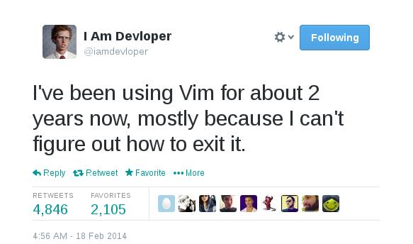
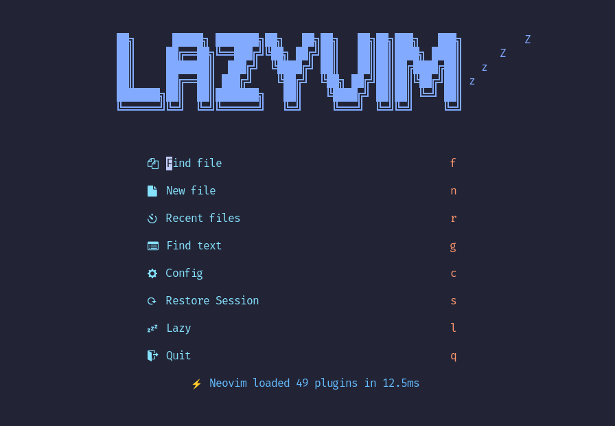
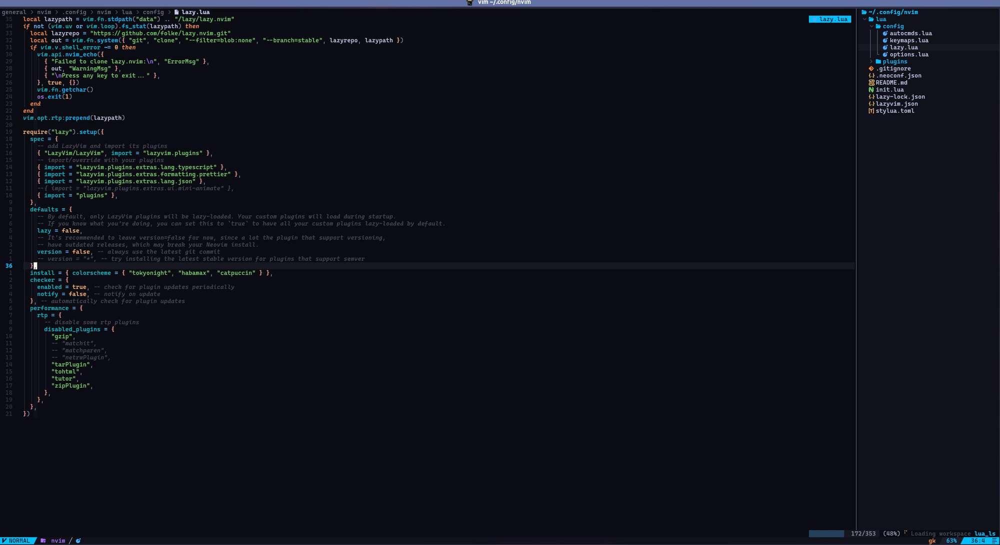
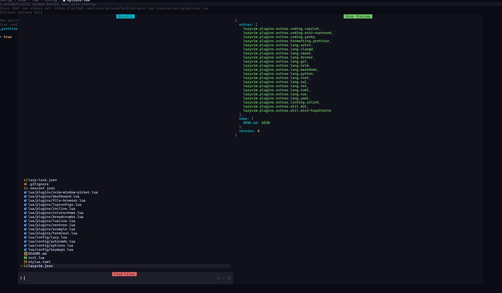

I've always liked Vim, but this editor is famous worldwide for being one of the most complex pieces of software ever created to learn, to the point of earning a reputation as the place you enter and never leave.



But there's the promise of "superhuman productivity" once you manage to feel comfortable enough with it.

Recently I decided to stop using VSCode 100% of the time and start using only Neovim, and I'm going to show you how I set it up to look exactly like this:


If you already know the editor, you can skip straight to the installation part. Or, if you want to know more about the history of Vim, Vi and Neovim, let me tell you.

## A bit about Vim

If you don't know what [Vim](https://en.wikipedia.org/wiki/Vi_\(text_editor\)) is, in a few words, it's one of the oldest text editors still in use. It was created by a guy named [Bram Molenaar](https://en.wikipedia.org/wiki/Bram_Moolenaar) in 1991 as an improvement on the original _Vi_ editor, created by [Bill Joy](https://en.wikipedia.org/wiki/Bill_Joy) in 1976 as a _vi_sual mode for another editor called `ed`. That's why Vim is the acronym for "Vi improved".

Vi, just like Vim, introduced a drastic change in the way we edit text: near-surgical cursor movement, and also movement using the HJKL keys, as I explained in this thread:

> 🤓 História da computação pt 2: POR QUE O VIM USA H, J, K e L COMO SETAS???? Já que vocês curtiram minha última thread sobre TTY eu vou falar uma outra parte da história da computação aqui e por que a tecnologia de hoje é basicamente a mesma de 60 anos atrás. Só mais colorida [pic.twitter.com/qw4QU18OXt](https://t.co/qw4QU18OXt) — Lucas Santos 🇧🇷🇸🇪 • formacaots.com.br 💎 (@\_StaticVoid) [July 23, 2024](https://twitter.com/_StaticVoid/status/1815722344142279159?ref_src=twsrc%5Etfw)
>
> — 

Ever since then a lot of people have loved using Vim because it's extremely lightweight, easy to configure, and has basically its own programming language (VimL) that lets you build macros and do a ton of other things in an absurdly powerful way.

The only problem is that it has one of the steepest learning curves in history, because commands are defined as sequences of individual keystrokes and letter combinations, but whoever manages to master Vim gets a huge productivity boost simply from how responsive the editor is.

> [!NOTE] 💡
> I'm not going to focus on how to use Vim here, especially since I'm not a master of it myself, but there are several great sites like [Vim Adventures](https://vim-adventures.com) and [VSCode](https://marketplace.visualstudio.com/items?itemName=vintharas.learn-vim) extensions that you can look into.

Unfortunately Vim alone, the way it comes "out of the box", while fully usable, isn't what I'd call a good code editor. It could have been back in 1991, but with the advance of technology, the increasingly tight integration between languages and editors, and the shift away from big, complex IDEs toward smaller editors with plugin support, left Vim a bit behind, even though it did gain plugin support.

### Enter Neovim

Neovim is a fork of the original Vim made by a Brazilian named [Thiago Arruda](https://github.com/tarruda) after he [couldn't get support](https://groups.google.com/g/vim_dev/c/65jjGqS1_VQ?pli=1) to implement a change to the original Vim that would let the editor run multiple threads and be controlled by external processes. Neovim's first commit happened on [January 31st, 2014](https://github.com/neovim/neovim/commit/72cf89bce8e4230dbc161dc5606f48ef9884ba70).

Among Neovim's many new features, native support for [Lua](https://en.wikipedia.org/wiki/Lua_\(programming_language\)) is one of the main ones, which means you can write plugins and tools in a much simpler way than using C or VimL, which, while good, are complicated. On top of that, it has asynchronous processing and native support for [LSP](https://en.wikipedia.org/wiki/Language_Server_Protocol)s (Language Server Protocol), which let you get real-time communication about what you're writing and a background server that analyzes your code (that's how we get auto completions, intellisense, and error analysis).

From there, NVim kept gaining more and more community support and funding from some companies through OpenCollective, and now it's a fully self-sustaining open source project maintained by a few full-time devs. And that's what we're going to customize today.

## Prerequisites

Before we start, I'm going to go over a few prerequisites you need to have in order to follow this tutorial and actually get something out of it.

### 1 - Have some kind of Linux

While it's definitely possible to [install Neovim on Windows with Powershell](https://dev.to/hoo12f/setting-up-neovim-with-windows-powershell-2208), I'm going to do the same thing on a Linux system. You could be using a Mac, some Linux distro, or even WSL on Windows with whatever distro you prefer.

I'm writing this article on Arch Linux, but everything I say here carries over to Mac (Darwin) without any issues, the files live in the same place.

### 2 - Have a shell ready

I'm using ZSH with Zinit and a bunch of plugins (you can check out my dotfiles [here](https://github.lsantos.dev/dotfiles/blob/master/general/base/.zshrc)), the shell itself doesn't matter, you can use bash, sh, Fish, or whatever, what matters is that you have it fully configured to avoid problems with environment variables.

### 3 - Install Neovim

You can install Neovim by following the instructions on the [official site](https://github.com/neovim/neovim/blob/master/INSTALL.md) directly, in general, on Mac you should already have it installed by default, otherwise just use [Homebrew](https://brew.sh) with `brew install neovim`.

On Arch I used [YaY](https://github.com/Jguer/yay) with `yay -S neovim`, your distro probably has something similar.

Once it's installed, when you run neovim for the first time by typing `nvim`, with no configuration at all, it'll look like this:


> Yes, it's actually possible to exit Neovim by pressing `esc` and then `:q!<enter>`

### 4 - NerdFonts

A really important part of this setup is [NerdFonts](https://www.nerdfonts.com). A NerdFont is a regular font, but packaged with **every icon and glyph you can imagine**. Basically it's as if your Arial font came bundled with a ton of icons, including Font Awesome icons and a bunch of other glyphs turned into fonts that you see around.

You can install whichever font you prefer, but one font is mandatory: MesloLG. You can install these fonts in several ways, the simplest is to go to the [downloads](https://www.nerdfonts.com/font-downloads) page, find the font, and add it to your font library.

> [!IMPORTANT] 💡
> As a general rule, always prefer installing the NerdFont variations of your preferred font if they exist, you'll have a much smaller chance of running into text that doesn't display correctly.

Another way I prefer is installing through your package manager, in the case of brew you can search for fonts using `brew search font-<name>` and grab the one ending in `nerd-font`, for example:

```bash
$ brew install --cask font-meslo-lg-nerd-font
```

On Arch it's the same thing, just with yay:

```sh
$ yay -S ttf-meslo-nerd
```

If you want to install other fonts, I also recommend _CaskaydiaCove Nerd Font_ (my current font)_, Fira Code Nerd Font_, and _Hack_, which are pretty nice fonts and easy on the eyes.

### 5 - Lazygit

Install LazyGit, which is a git client right in the terminal. You can install it directly with brew using `brew install lazygit` or `yay lazygit` on Arch.

## Lazy and LazyVim

I'm not going to get into the basics of Vim or Neovim, but I want to get straight to the point and show you how you can get started as fast as possible, in a pretty simple way.

There's a plugin manager project called [lazy.nvim](https://lazy.folke.io).


The idea of a plugin manager, just like a package manager such as NPM, RubyGems, or anything else, is literally to make it easy to load external functionality into Neovim through plugins, think of it like VSCode extensions.

Well, the same creator of lazy.nvim took it a step further and built a "starter kit" for anyone who wants to get started with Neovim already loaded with a bunch of good initial setups, a set of plugins, and a bunch of ready-made configurations. And that's [LazyVim](https://www.lazyvim.org)


LazyVim is extremely similar to VSCode, which makes the whole process pretty simple and easy to navigate, on top of having a bunch of commands already ready to go and a keybinding search so you don't get lost. It also supports the mouse, so if you want to click on something, that's easy too.

### Installing

Installing LazyVim is pretty straightforward, first you back up your configuration:

```sh
mv ~/.config/nvim{,.bak}
mv ~/.local/share/nvim{,.bak}
mv ~/.local/state/nvim{,.bak}
mv ~/.cache/nvim{,.bak}
```

Keep in mind not all these folders will exist, especially if you just installed Neovim now.

> By default all your configuration will live in `$HOME/.config/nvim`, but LazyVim itself gets installed in `$HOME/.local/share/nvim/lazy`, including all the configurations and plugins it already ships with. Keep in mind you **should NOT** touch that directory.

After that, just clone the repository with Git:

```sh
git clone https://github.com/LazyVim/starter ~/.config/nvim
```

And then remove the `.git` folder from inside that repository so you can modify it without carrying its history.

Now run the `nvim` command, you should already see some changes in your setup and you should be looking at Lazy's default screen



Type `:LazyHealth` and hit enter, to make sure everything's running fine.

### The \<leader> key

Lazy, like many others, has a base key for all the other combinations, that key is `<leader>`, which is mapped to the space bar by default, press `<leader>` and you'll see a keybinding guide show up at the bottom of the screen, that's a plugin called _WhichKey_ (also created by [Folke](https://github.com/folke), the creator of Lazy):


Just press the next key in the sequence to run the action or go to the next page (for bindings that have a `+` in front, like `+g` which opens git), try `<leader>l`, and watch Lazy's "home" screen open up:


You can navigate this window using the letters in the header, for example `I` shows all installed plugins, `U` updates all of them, `S` syncs with the repository, and so on.

> Remember that `U` and `u` are different from Vim's perspective. So if you see a sequence like `<leader>bD`, type it exactly as written: `<space>b<shift>d`

Press `q` to exit the panel. Now it's time for a tour of the basic features

## Basic tour

Let's start with the simplest and most useful features.

### Explorer (Neotree)

Lazy comes with a plugin called `neotree`, which is a plugin that shows a file navigation sidebar like VSCode's explorer. You can access this feature with `<leader>e`.

> You don't need to wait for WhichKey to show up, just press it as fast as you can, remember, speed is the whole point here.


You can navigate it with HJKL, J and K go down and up, H and L navigate in and out of folders. To open a file press Enter, here are some useful shortcuts:

-   `a`: Creates a new file
-   `r`: Renames the file
-   `d`: Deletes the file
-   `C`: Closes the current folder and goes up one level
-   `/`: Starts search
-   `?`: Shows the shortcut list

### Movement

Open vim in the `~/.config/nvim` folder, let's start there. Select the `lua/config/lazy.lua` file. This is Lazy's main configuration file, but we're almost never going to touch it.



Press `<C-l>` or `<Ctrl>+l` to go back to Neotree, now open the `options.lua` file, notice we have two tabs at the top, those are buffers, each buffer is a file in memory, and it's important to say they're not tabs!

> In Vim, tabs and buffers are different concepts, tabs are like completely separate spaces that can have a completely independent window setup, buffers are the files open inside a tab and they can be rearranged into windows within that tab. Most of the time you'll only have one tab open.

To move between one file and another use `L` and `H`, or `gn` and `gp`. You can also take advantage of another plugin, Telescope.

Close that buffer with `<leader>bd`.

> [!IMPORTANT] 💡
> Vim has the concept of buffers and windows. A buffer is a file or text source you're editing, it may or may not be a physical file on the computer, but it will always be a file in memory, when you write to the buffer you're writing to memory first, and when you save, you pass that write on to the file.
>
> A window is like another instance of your Vim window, like another tab in a browser, a different environment isolated from any other buffer

### Telescope

Telescope is another plugin built for searching files. Let's open another file with it, press `<leader>ff` to open the Telescope window:



Here you can type directly to search for the file, navigate with the arrow keys or with `<C-n>` and `<C-p>`, you can also open the shortcut list with `<C-?>`. Open another file with it.

> You can also access Telescope for files with `<leader><leader>`

There are endless Telescope options. For example, you can search across all open files (buffers) with `<leader>fb`, in fact, most of what you can do with Telescope lives under `<leader>f`, or under `<leader>s`, which are the global search commands.

## Configuration

Now that we know the basics, let's start configuring our editor. Lazy will initially read every file inside the `lua/config` folder as initial configuration, starting with `lazy.lua`, then it'll read all the plugins inside the plugins folder.

So to add new functionality we just need to change these files:

-   `lua/config/options.lua`: General options and on/off type settings
-   `lua/config/keymaps.lua`: Key mapping, this is where we'll change the shortcuts
-   `lua/config/autocmds.lua`: If you have any vim auto commands, this is the place to put them
-   `lua/plugins`: Any lua file in here gets read and added to the plugins, so you can split it up by category (ui, search, code, etc) or by plugin name, which is what I did.

### Lazy.lua

Let's start with the file we have to modify the least, `lazy.lua`, here we're only going to enable what are called `LazyExtras`, factory settings that Lazy already ships ready-made, and that you can extend or modify later in the `plugins` folder.


Let's focus on this section only, uncomment the three lines above `{ import = "plugins" }`, the first one enables native TypeScript support (which we'll configure later in the LSPs), Prettier formatting, and the JSON extension.

On top of that, let's already add a theme, I'm using a modified `catppuccin` theme, but we're not going to install it now.

> Keep in mind you can install whatever theme you want and Lazy itself already ships with a few preinstalled ones you can try out with `<leader>uC`

Another detail is that, after a few Lazy updates, TypeScript integration ended up switching to a different LSP (we'll talk about it soon), so I ended up disabling that setting.

## options.lua

The options file is the one that holds the main settings, like space size, columns, and so on, it's usually a pretty small and pretty personal file, in my case I only put in the simplest settings:

```lua
-- Options are automatically loaded before lazy.nvim startup
-- Default options that are always set: https://github.com/LazyVim/LazyVim/blob/main/lua/lazyvim/config/options.lua
-- Add any additional options here
--
-- -- Enable the option to require a Prettier config file
-- If no prettier config file is found, the formatter will not be used
vim.g.lazyvim_prettier_needs_config = true
-- Auto wrap
vim.opt.wrap = true
-- Attempt to fix indent
vim.opt.tabstop = 4
vim.opt.shiftwidth = 4
vim.opt.expandtab = true
vim.opt.autoindent = true
vim.opt.smarttab = true

-- Highlights for cursor column
vim.cmd.set("cursorcolumn")
vim.cmd("highlight CursorColumn ctermbg=Blue")
vim.cmd("highlight CursorColumn ctermfg=Black")

-- Vim does not recognize the alt key in Mac
-- https://stackoverflow.com/questions/7501092/can-i-map-alt-key-in-vim
-- So we have to use the response from stty -icanon; cat (press alt + key)
-- to get the correct key code, then we can map it to something else
-- NOTE: ^[ is the escape character \e in vim
vim.cmd("set <M-BS>=\\e?") -- in this example alt+backspace is ESC+? which is mapped to <M-BS>
```

From top to bottom, the settings are as follows:

-   Disables prettier if there's no `.prettierrc` config file in the folder, because I don't like enabling prettier globally (actually, I don't like enabling anything globally)
-   Turns on Auto Wrap, so lines break automatically when they reach the end of the screen
-   The next settings from `tabstop` to `smarttab` are related to tab and space settings, here I'm setting each tab to 4 spaces and, by default, projects will use 4 spaces of indentation. This isn't something I like much, but unfortunately most of the projects I've been using lately use this setting.
-   I set a lighter line wherever my cursor is, both horizontally and vertically, this makes it easier to find on screen
-   The last option is a change so Vim recognizes the Alt key on Mac, which is mapped to command, check the link in the comment to understand how it works better

## autocmds.lua

Another really interesting thing about vim is that you can run commands automatically based on execution hooks, for example, whenever you enter a buffer with a certain name, or whenever you leave some buffer, and so on.

I have a few specific functions for markdown files, which I end up using a lot, like: setting the file type to markdown, setting an 80-char line to limit the text, etc.

```lua
-- Autocmds are automatically loaded on the VeryLazy event
-- Default autocmds that are always set: <https://github.com/LazyVim/LazyVim/blob/main/lua/lazyvim/config/autocmds.lua>
-- Add any additional autocmds here
local function augroup(name)
  return vim.api.nvim_create_augroup("custom_" .. name, { clear = true })
end

-- auto set markdown filetype
vim.api.nvim_create_autocmd({ "BufNewFile", "BufFilePre", "BufRead" }, {
  pattern = { "*.md" },
  callback = function()
    vim.cmd("set filetype=markdown")
  end,
})

-- Auto set markdown to break at 80 chars and highlight the 80th column
vim.api.nvim_create_autocmd({ "BufWinEnter" }, {
  pattern = { "*.md" },
  callback = function()
    vim.opt.colorcolumn = "80"
    vim.opt.textwidth = 80
  end,
})

-- On leaving markdown files, reset the colorcolumn and textwidth
vim.api.nvim_create_autocmd({ "BufWinLeave" }, {
  pattern = { "*.md" },
  callback = function()
    vim.opt.colorcolumn = "120"
    -- disabled textwidth
    vim.opt.textwidth = 0
  end,
})

-- auto set i3config filetype
vim.api.nvim_create_autocmd({ "BufNewFile", "BufFilePre", "BufRead" }, {
  pattern = { "*.i3config" },
  callback = function()
    vim.cmd("set filetype=i3config")
  end,
})
```

This file isn't required, and it'll often be empty, unless you have some kind of command you always want to run based on some buffer type, for example, always running ESLint whenever you're in a JS file or something like that.

## keymaps.lua

The last of the files in the `config` folder is `keymaps.lua`, as you'd guess, it holds the keyboard shortcuts you want to customize. At this point I'm going to drop my whole file here, which is pretty big, but you don't need to follow exactly what's in here, feel free to add whatever you want.

I'll try to leave comments wherever it's relevant

```lua
-- Keym automatically loaded on the VeryLazy event
-- Default keymaps that are always set: https://github.com/LazyVim/LazyVim/blob/main/lua/lazyvim/config/keymaps.lua
-- Add any additional keymaps here

-- Enable resuming where we left off in any telescope search
vim.keymap.set(
  "n",
  "<leader>sx",
  require("telescope.builtin").resume,
  { noremap = true, silent = true, desc = "Resume telescope search" }
)

-- Move blocks of text on Linux
vim.keymap.set("v", "<A-j>", "<cmd>m '>+1<cr>gv=gv", { noremap = true, silent = true, desc = "Move line down" })
vim.keymap.set("v", "<A-k>", "<cmd>m '<-2<cr>gv=gv", { noremap = true, silent = true, desc = "Move line up" })
vim.keymap.set("n", "<A-j>", ":m '.+1<CR>==", { noremap = true, silent = true, desc = "Move line down" })
vim.keymap.set("n", "<A-k>", ":m '.-2<CR>==", { noremap = true, silent = true, desc = "Move line up" })

-- Move blocks of text (mac)
-- https://stackoverflow.com/questions/7501092/can-i-map-alt-key-in-vim)
vim.keymap.set("v", "˚", ":m '<-2<CR>gv=gv", { noremap = true, silent = true, desc = "Move line up" })
vim.keymap.set("v", "∆", ":m '>+1<CR>gv=gv", { noremap = true, silent = true, desc = "Move line down" })
vim.keymap.set("n", "∆", ":m '.+1<CR>==", { noremap = true, silent = true, desc = "Move line down" })
vim.keymap.set("n", "˚", ":m '.-2<CR>==", { noremap = true, silent = true, desc = "Move line up" })

-- Switch windows in edit mode using tabs
vim.keymap.set("n", "<F8>", "gt", { noremap = true, silent = true, desc = "Switch to next tab" })
vim.keymap.set("n", "<F7>", "gT", { noremap = true, silent = true, desc = "Switch to previous tab" })

-- duplicates the current line downward
vim.keymap.set("n", "<C-S-d>", "yyp", { noremap = true, silent = true, desc = "Duplicate line down" })

-- Commands related to buffer navigation

-- Next buffer in the list
vim.keymap.set("n", "gn", "<cmd>bn<cr>", { noremap = true, silent = true, desc = "Next buffer" })
vim.keymap.set("n", "<tab><tab>", "<cmd>bn<cr>", { noremap = true, silent = true, desc = "Next buffer" })
vim.keymap.set("n", "<tab>n", "<cmd>bn<cr>", { noremap = true, silent = true, desc = "Next buffer" })

-- Previous buffer
vim.keymap.set("n", "<S-tab>", "<cmd>bp<cr>", { noremap = true, silent = true, desc = "Previous buffer" })
vim.keymap.set("n", "gp", "<cmd>bN<cr>", { noremap = true, silent = true, desc = "Previous buffer" })
vim.keymap.set("n", "<tab>p", "<cmd>bp<cr>", { noremap = true, silent = true, desc = "Previous buffer" })

-- delete/close buffer
vim.keymap.set("n", "<tab>d", "<cmd>bd<cr>", { noremap = true, silent = true, desc = "Delete buffer" })
vim.keymap.set("n", "<tab>q", "<cmd>bd<cr>", { noremap = true, silent = true, desc = "Delete buffer" })
vim.keymap.set("n", "<tab>w", "<cmd>bd<cr>", { noremap = true, silent = true, desc = "Delete buffer" })

-- telescope search for buffers
vim.keymap.set("n", "<tab>f", "<cmd>Telescope buffers<cr>", { noremap = true, silent = true, desc = "Find buffer" })

-- Deletes the current word with Alt+BS
-- mac (see options.lua)
vim.keymap.set("n", "<M-BS>", "hdiw", { noremap = true, silent = true, desc = "Delete word" })
-- linux
vim.keymap.set("n", "<A-BS>", "hdiw", { noremap = true, silent = true, desc = "Delete word" })

-- cmd P to find files
vim.keymap.set("n", "<C-p>", "<cmd>Telescope find_files<cr>", { noremap = true, silent = true, desc = "Find files" })

-- creates a new terminal
local wk = require("which-key")
wk.add({
  { "<leader>t", group = "Terminals" },
  {
    "<leader>tt",
    function()
      TermNumber = (TermNumber or 0) + 1
      local term = require("toggleterm")
      term.toggle(TermNumber)
    end,
    desc = "New toggle terminal",
  },
  { "<leader>ts", "<cmd>:TermSelect<cr>", desc = "Find open terminals" },
  { "<leader>tf", "<cmd>:TermSelect<cr>", desc = "Find open terminals" },
  { "<leader>tr", "<cmd>exe v:count1 . 'ToggleTermSetName'<cr>", desc = "Rename open terminals" },
  {
    "<leader>th",
    "<cmd>exe v:count1 . 'ToggleTerm'<cr>",
    desc = "Toggle docked terminal (prefix number before command)",
  },
  { "<C-.>", "<cmd>:ToggleTerm<cr>", group = "Terminals", desc = "Toggle docked terminal", mode = { "n", "t" } },
})

-- database control with the DadBod plugin
wk.add({
  { "<leader>D", group = "Database" },
  { "<leader>DD", "<cmd>DBUI<cr>", desc = "Toggle DBUI" },
  { "<leader>Dx", "<cmd>call <SNR>79_method('execute_query')<cr>", desc = "Run Query" },
})

-- deletes a vim mark using delmark
wk.add({
  { "<leader>dm", "<cmd>exe 'delmark ' . nr2char(getchar())<cr>", desc = "Delete a mark <markname>" },
})

-- Moves a line down without entering edit mode 
wk.add({
  { "<leader>o", "o<esc>", desc = "New line below in normal mode" },
  { "<leader>O", "O<esc>", desc = "New line above in normal mode" },
})

-- Closes all buffers
wk.add({
  { "<leader>bD", "<cmd>BufferLineCloseOthers<cr><cmd>bd<cr>", desc = "Close all buffers" },
})
```

The basic structure is `vim.keymap.set("mode", "shortcut", "command")`, followed by options for the command description, whether it should remap or not, etc. Further down you have a `wk.add`, which is WhichKey, this lets us add the shortcuts that show up in WhichKey's shortcut bar when you press `<leader>` (space bar, in my case), for example, I have a shortcut, `<leader>bD`, to close all buffers, if I press `<leader>b` you'll see that shortcut show up in the list too:


## Plugins

Now that we're done with all the configuration parts, we can start talking about plugins, the real power of Neovim with Lazy.

All plugins are loaded using `lazy.nvim`, which, as you'd guess, comes from the same creator as LazyVim. The idea behind `lazy.nvim` is that it has a directory called `plugins` inside the `lua` folder, inside it you can create any `.lua` file that returns a dictionary (or table) following this model:

```lua
return {
  "plugin/name/here",
  event = "event to load on, if any",
  keys = {
    {
      "shortcut", 
      "command",
      desc = "shortcut description"
    }
  },
  config = function() 
    -- something here
  end
}
```

The plugin name can be a GitHub repository, for example, `"b0o/incline.nvim"`, or a full URL to a Git repository (it's important that it's a Git repo because Lazy downloads all your plugins using Git).

You can optionally define an event for when that plugin gets loaded, for example, a markdown plugin doesn't make sense loaded on a JS file and so on, but it's not mandatory. If omitted, it'll always load on startup.

Also, optionally, you can define the shortcuts related to that plugin directly in its configuration using the `keys` key, the structure is the same as `keymaps.lua`.

At the end we have the most important part, the plugin's options and settings, this part can be a function that returns a table. In general, some plugins will want it to be a function that calls the plugin's `setup` method, but if omitted, Lazy will call `setup` with no parameters at all.

Another option you can pass, instead of config, is an `opts` property, which will be a table, or a function that returns a table, and that options table gets passed to the plugin's `setup` method. Let's look at two examples, the first one uses the `config` property:

```lua
return {
  "iamcco/markdown-preview.nvim",
  cmd = { "MarkdownPreviewToggle", "MarkdownPreview", "MarkdownPreviewStop" },
  ft = { "markdown" },
  build = "cd ~/.local/share/nvim/lazy/markdown-preview.nvim/app && npm i",
  lazy = true,
  config = function()
    vim.g.mkdp_browser = "vivaldi-stable"
  end,
}
```

Notice I don't have an `opts` property, but I'm using config to automatically set the global option for which browser the markdown preview will use. I could've set this in `options.lua`, but since it's directly tied to this plugin and this setting doesn't make sense without it, I preferred to set it right here.

Another example is my Telescope configuration:

```lua
return {
  "nvim-telescope/telescope.nvim",
  opts = {
    defaults = {
      path_display = { shorten = {
        len = 5,
        exclude = { 2, -1 },
      } },
    },
  },
}
```

I'm passing the options as a table telling Telescope to shorten the path length to 5 letters and exclude both the second part of the path and the last part of it, this makes searches look like this:


Which is great for small screens, since I don't need to know the full name of the location, just the first letters.

## My plugins

I'm not going to list all my plugins here, because there'd be way too many, but I'll link my dotfiles directly to my Lazy folder so you can see what's going on, I chose to split my plugins by type and by function, instead of by group, which seems to be the way the community likes to do it. I find it a lot easier to maintain when I know what a plugin does instead of having one file with a bunch of plugins grouped by feature.

https://github.com/khaosdoctor/dotfiles/tree/ba88235f73d88a5a3e0db981e2efbc433c5fee4c/general/nvim/.config/nvim

So we can get the functionality I promised, making your nvim look just like mine (at least in appearance), we're going to need a few plugins, the first one is my color scheme.

### Catppuccin and colorschemes

In general, installing themes for Nvim is pretty simple and you can switch themes in LazyVim using `<leader>UC`. To install a colorscheme, it's just like installing any regular plugin, but at the end of the file we have to set a property that tells LazyVim which plugin we're picking as the main colorscheme. I have a few themes installed:

```lua
return {
  { "Mofiqul/dracula.nvim" },
  {
    "catppuccin/nvim",
    opts = {
      flavour = "macchiato",
      highlight_overrides = {
        all = function(colors)
          return {
            CurSearch = { bg = colors.sky },
            IncSearch = { bg = colors.sky },
            CursorLineNr = { fg = colors.blue, style = { "bold" } },
            DashboardFooter = { fg = colors.overlay0 },
            TreesitterContextBottom = { style = {} },
            WinSeparator = { fg = colors.overlay0, style = { "bold" } },
            ["@markup.italic"] = { fg = colors.blue, style = { "italic" } },
            ["@markup.strong"] = { fg = colors.blue, style = { "bold" } },
            Headline = { style = { "bold" } },
            Headline1 = { fg = colors.blue, style = { "bold" } },
            Headline2 = { fg = colors.pink, style = { "bold" } },
            Headline3 = { fg = colors.lavender, style = { "bold" } },
            Headline4 = { fg = colors.green, style = { "bold" } },
            Headline5 = { fg = colors.peach, style = { "bold" } },
            Headline6 = { fg = colors.flamingo, style = { "bold" } },
            rainbow1 = { fg = colors.blue, style = { "bold" } },
            rainbow2 = { fg = colors.pink, style = { "bold" } },
            rainbow3 = { fg = colors.lavender, style = { "bold" } },
            rainbow4 = { fg = colors.green, style = { "bold" } },
            rainbow5 = { fg = colors.peach, style = { "bold" } },
            rainbow6 = { fg = colors.flamingo, style = { "bold" } },
          }
        end,
      },
      color_overrides = {
        macchiato = {
          rosewater = "#F5B8AB",
          flamingo = "#F29D9D",
          pink = "#AD6FF7",
          mauve = "#FF8F40",
          red = "#E66767",
          maroon = "#EB788B",
          peach = "#FAB770",
          yellow = "#FACA64",
          green = "#70CF67",
          teal = "#4CD4BD",
          sky = "#61BDFF",
          sapphire = "#4BA8FA",
          blue = "#00BFFF",
          lavender = "#00BBCC",
          text = "#ffffff",
          subtext1 = "#A3AAC2",
          subtext0 = "#8E94AB",
          overlay2 = "#7D8296",
          overlay1 = "#676B80",
          -- overlay0 = "#464957", -- comments
          overlay0 = "#757a92",
          surface2 = "#3A3D4A",
          -- surface1 = "#2F313D", -- line numbers, hovers, highlights
          surface1 = "#46495b",
          surface0 = "#1D1E29",
          base = "#030303",
          mantle = "#11111a",
          crust = "#191926",
        },
      },
      integrations = {
        telescope = {
          enabled = true,
          style = "nvchad",
        },
      },
    },
    name = "catppuccin",
    priority = 1000,
  },
  { "eldritch-theme/eldritch.nvim", lazy = false, priority = 1000, opts = {} },
  {
    "maxmx03/fluoromachine.nvim",
    lazy = false,
    priority = 1000,
    opts = { glow = false, theme = "fluoromachine", transparent = false },
  },
  {
    "shatur/neovim-ayu",
    lazy = false,
    priority = 1000,
    config = function()
      require("ayu").setup({
        mirage = true,
        terminal = true,
      })
    end,
  },
  {
    "LazyVim/LazyVim",
    opts = {
      colorscheme = "catppuccin",
    },
  },
}
```

As you can see, I'm a big fan of dark themes, **really dark**. For me, the ideal theme has high contrast between background and font. As an example, a lot of people use the Dracula theme (made by our fellow Brazilian Zeno Rocha) because it's a great theme, but for me, the original Dracula never quite did it for me because of the background choice. I always used Dracula, but I always tweaked the editor's background color to make it almost black (`#131313` to be exact).

In Lazy I found another theme that got closer to what I liked, [Catppuccin](https://github.com/catppuccin/nvim), one of the big advantages of this theme for me is that its colors are really similar to Dracula's, which I think are great, and it's also darker, but I still made it EVEN DARKER


With Catppuccin, you can change the colors of every part of the theme using `color_overrides`, on top of that you can also set the theme's "flavour", I like "macchiato" best since it's the darkest, and you can also swap which color goes where and how it's defined. I strongly recommend this theme.

Above all, it's your choice, so it's not something you need to overthink, I recommend installing a bunch of themes and testing each one to see which you like best! What matters is that, at the end of it all, you have this call:

```vim
  {
    "LazyVim/LazyVim",
    opts = {
      colorscheme = "your theme",
    },
  }
```

### Dashboard

To get a customized dashboard with a different logo, and even different options, Lazy uses a project called Alpha.nvim, which is a dashboard generator, essentially what I did was copy LazyVim's original configuration, which is in this repository:

https://github.com/LazyVim/LazyVim/blob/main/lua/lazyvim/plugins/extras/ui/alpha.lua

And modify the logo. I left everything else the same because I think the options are pretty relevant and help me a lot, to generate the logo I looked for an ASCII art generator, this [one here](https://patorjk.com/software/taag/#p=display&f=ANSI%20Regular&t=lsantos.dev) was exactly what I used. It has a bunch of font and letter options and from there it's just a matter of being creative. To swap the logo, just remove Lazy's logo and paste in your own, keep in mind your terminal needs to support ANSI characters if you picked that font:


### LuaLine

Lualine is a really cool plugin that adds a bunch of interesting things to the bottom of your editor, like the git branch, the folder you're in, the number of errors and warnings, the path, the last command, and other stuff. On top of that it's fully customizable and you can add whatever you want to it. In my case, here's the configuration:


To avoid dropping a super long file in here, I'll leave the link to the repository at its current revision:

https://github.com/khaosdoctor/dotfiles/blob/4532db19eca517ccc6205fa22826aa8854d88d20/general/nvim/.config/nvim/lua/plugins/lualine.lua

## Conclusion

That was a long article, but now you can install and configure your Neovim to start using all the power it has. We're far from done setting all this up, but what matters is that you feel like this editor is your editor, and that you feel at home with it.

I still want to show a lot more here related to Neovim and how I personally use this editor, on top of showing everything I've learned over time (and keep learning) using Vim, but that's going to be for another time!

If you liked this article, say hi over on my [social media](https://lsantos.dev) and tell me what you want to see more of here on the blog!
