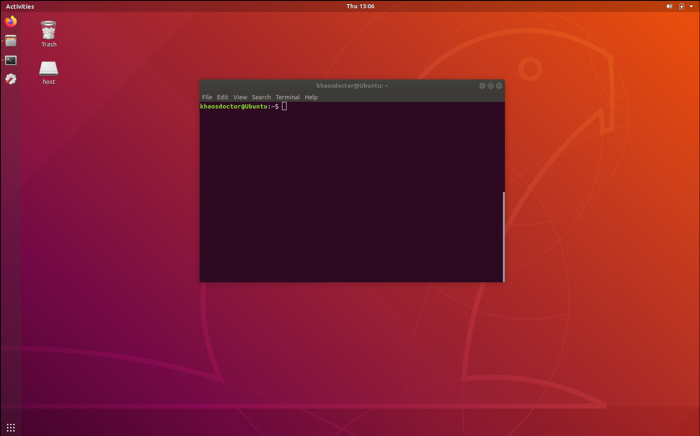
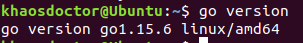
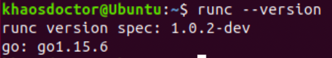
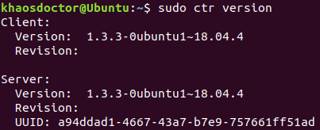
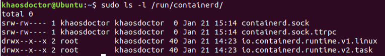
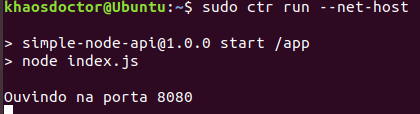
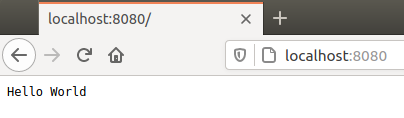
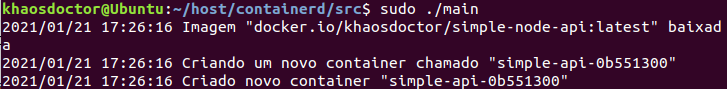
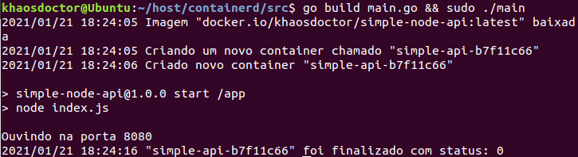
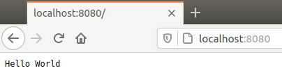

Como já falamos no [artigo anterior](/oci-cri-docker-ecossistema-de-containers/), o Kubernetes recentemente marcou o Docker como depreciado, ou seja, não poderemos mais usar a integração com o Docker diretamente de dentro de um Pod a não ser que instalemos ele manualmente.

Neste mesmo artigo falei sobre o que isso significa para o ecossistema e apresentei a [Open Container Initiative (OCI)](https://opencontainers.org/), que é a responsável por criar o padrão que seguimos para que os runtimes de containers possam executar o mesmo tipo de imagem. Todas as imagens compatíveis com o OCI poderão ser executadas por qualquer runtime também compatível, isso abre portas para a criação de diferentes runtimes.

Agora, vamos entender como podemos utilizar o [ContainerD](https://containerd.io/) para integrar com as nossas aplicações e executar containers sem a necessidade do Docker ou de qualquer comunicação com ele.

## ContainerD

Assim como o CRI-O, Docker Engine e o RKT, o ContainerD é um runtime de containers, ou seja, ele é a ferramenta que gerencia todo o ciclo de vida de um container, desde o download de imagem até a criação das interfaces de rede, supervisão e armazenamento.

")

Isso significa que podemos pegar qualquer imagem que seja compatível com a especificação da OCI e rodar usando o ContainerD. Então se é tudo compatível, por que não usamos o Docker direto?

Pelo mesmo motivo que o Kubernetes depreciou o suporte ao Docker. Por mais que possamos querer uma aplicação como o Docker, ele ainda é totalmente voltado aos usuários e a interação dos usuários com a ferramenta, ou seja, o Docker é uma ferramenta feita para ser usada por pessoas, não por máquinas.

Com o ContainerD podemos integrar a manipulação de containers no código, porque ele não possui uma interface de usuário. E é exatamente o que vamos fazer aqui.

## Preparativos

Antes de podermos executar a nossa imagem usando o ContainerD, vamos ter que preparar uma máquina para executar a ferramenta. O `ctr` (CLI do ContainerD) só executa em ambientes que possuam a implementação [`runc`](https://github.com/opencontainers/runc/releases) da OCI instalada e, infelizmente, essa implementação só existe para Linux.

### Criando uma VM

No meu caso, estou usando um Mac, se você estiver em qualquer outro ambiente que não seja Linux (como o Windows), você precisará de uma máquina virtual – ou você pode usar o [WSL2](https://www.omgubuntu.co.uk/how-to-install-wsl2-on-windows-10) no Windows. Eu decidi ir pela primeira opção e criei uma máquina virtual usando o [VirtualBox](https://www.virtualbox.org/) e a [imagem netboot do Ubuntu 18.4](http://cdimage.ubuntu.com/netboot/bionic/) (só porque ela é mais leve e mais rápida de baixar).



> **Nota:** Se você quiser instalar o Ubuntu usando a mesma imagem que eu utilizei, selecione sua arquitetura de sistema (x86, amd64, arm, etc.) no link acima e baixe o arquivo chamado `mini.iso`. A partir daí, execute a imagem no VirtualBox.

Se você estiver utilizando o Linux ou uma de suas distribuições então esse passo não é necessário, você pode pular diretamente para a instalação do `runc`.

> **Nota 2:** Não vou entrar em detalhes de como fazer a instalação da máquina virtual nem como executar o Ubuntu neste artigo, existem vários artigos e tutoriais incríveis na Internet sobre o mesmo tópico, eles são bem simples de se encontrar.

Depois de criada a máquina virtual, vamos instalar o a linguagem Go na máquina.

### Instalando o Go

Neste exemplo vamos integrar a nossa aplicação em Go com o ContainerD e já vamos aproveitar para compilar o `runc` (outra dependência necessária) direto da fonte.

Estou usando a distribuição do Linux Ubuntu 18.4, então a instalação pode ser feita usando o Snap ou o arquivo Tar. Você pode achar todas as opções [na documentação](https://golang.org/doc/install). No meu caso, instalei usando o Snap com o seguinte comando:

```bash
sudo snap install go --classic
```

Para este tutorial estou usando a versão 1.15.6:



Vamos criar uma pasta em qualquer local – eu escolhi `~/gopath` – para criar o nosso `$GOPATH`, depois, vamos abrir o nosso arquivo `.bashrc` e adicionar a seguinte linha:

```bash
export GOPATH=~/gopath
export PATH=$PATH:$GOPATH/bin
```

Depois salvaremos e iremos rodar o comando `source .bashrc` para poder carregar as alterações. Então vamos criar os diretórios corretos usando o comando a seguir:

```bash
mkdir -p $GOPATH/src/github.com
```

**_Mas eu preciso saber Go?_**

Não obrigatoriamente, o ContainerD possui um CLI que você pode utilizar para fazer a comunicação via linha de comando.

Além disso, o ContainerD também possui [uma API em gRPC](https://github.com/containerd/containerd/tree/master/api) que permite que você se comunique diretamente com o Socket do serviço e chame os RPC's necessários, como Mark Kose fez [aqui com o browser](https://medium.com/@Mark.io/how-to-get-a-browser-communicate-with-containerd-using-grpc-fd44f7cf7512) (mas ele usou o Envoy para se comunicar com o socket) e por [aqui](https://medium.com/@Mark.io/how-to-communicate-with-containerd-using-java-f37d349b9ead) usando Java com o gRPC.

Então, extrapolando um pouco o conceito (mas nem tanto assim), é possível utilizar qualquer linguagem suportada pelo gRPC para poder se conectar com o socket do ContainerD no arquivo `containerd.sock`. Muito semelhante ao que a gente faz com a integração usando o `docker.sock`. Porém, infelizmente, não há um client nativo exceto o escrito em Go.

### Instalando o `runc`

O `runc` é um projeto open source feito pela OCI, você pode achar o repositório oficial [aqui](https://github.com/opencontainers/runc). Podemos fazer a instalação de algumas formas:

1.  Baixando uma release da [lista de releases](https://github.com/opencontainers/runc/releases) e colocando em uma pasta que esteja na sua variável `$PATH`
2.  Clonando o repositório e executando `make`, como descrito no README.
3.  Utilizando o `go get`

O meio mais fácil sem dúvida é utilizar a opção 3, pois a 1 exige que saibamos algumas informações sobre nosso sistema e a 2 pode dar alguns problemas dependendo da arquitetura. Já que temos o Go instalado, vamos somente instalar o `runc` como um novo pacote.

Execute o comando a seguir para baixar e instalar o `runc`:

```bash
go get github.com/opencontainers/runc
```

Após um tempo, verifique se há um binário chamado `runc` na pasta `$GOPATH/bin`. Tente executar o comando `runc --version` para ter uma saída parecida com esta:



Caso contrário, gere o binário você mesmo indo até a pasta de download com `cd $GOPATH/src/github.com/opencontainers/runc` e executando o comando `make && sudo make install`.

## Instalando o ContainerD

Para instalarmos o `ctr`, o CLI do ContainerD, na nossa máquina virtual. No caso do ubuntu é simplesmente executar o comando `sudo apt install containerd -y`, para outros sistemas veja a [página de downloads](https://containerd.io/downloads/).

Se tudo correu bem, você poderá executar o comando `ctr version` para mostrar o número da versão do CLI.



> Se você estiver tendo problemas em executar o comando `ctr version` com uma mensagem de "Permission Denied" ao ler o arquivo `containerd.sock` em `/run/containerd`, execute o comando como `sudo`.

Além disso, o ContainerD também pode ser usado com o Systemd como um serviço Daemon, para verificar se está tudo correto, utilize o comando `sudo systemctl status containerd`, você deve obter uma saída informando que o daemon do ContainerD está instalado e executando.

Se você quiser ter mais certeza, execute o comando `ps -fC containerd` e veja os processos aparecendo na lista de processos do sistema:

```
UID        PID  PPID  C STIME TTY          TIME CMD
root     23133     1  0 14:23 ?        00:00:02 /usr/bin/containerd
root     23666 23643  0 14:42 ?        00:00:00 containerd
```

### Usando sem precisar de `sudo`

Para remover a necessidade do uso de `sudo` para a execução do `ctr`, podemos alterar o arquivo de configuração do daemon que fica localizado em `/etc/containerd/config.toml`, por padrão o arquivo não é gerado, então temos que gerar um arquivo base. Para isso vamos criar o diretório e executar o comando nativo do `containerd` para gerar um arquivo base.

```bash
sudo mkdir -p /etc/containerd
sudo containerd config default > /etc/containerd/config.toml
```

Este comando irá gerar um arquivo próximo a este em `/etc/containerd`:

```toml
version = 2
root = "/var/lib/containerd"
state = "/run/containerd"
plugin_dir = ""
disabled_plugins = []
required_plugins = []
oom_score = 0

[grpc]
  address = "/run/containerd/containerd.sock"
  tcp_address = ""
  tcp_tls_cert = ""
  tcp_tls_key = ""
  uid = 0
  gid = 0
  max_recv_message_size = 16777216
  max_send_message_size = 16777216

[ttrpc]
  address = ""
  uid = 0
  gid = 0

[debug]
  address = ""
  uid = 0
  gid = 0
  level = "debug"

[metrics]
  address = ""
  grpc_histogram = false

[cgroup]
  path = ""

[timeouts]
  "io.containerd.timeout.shim.cleanup" = "5s"
  "io.containerd.timeout.shim.load" = "5s"
  "io.containerd.timeout.shim.shutdown" = "3s"
  "io.containerd.timeout.task.state" = "2s"

[plugins]
  # Omitido
```

Vamos buscar o ID do nosso usuário e do nosso grupo, para isso digite o comando `id` na linha de comando e copie os IDs `uid` e `gid`, no meu caso, ambos são 1000:

```
uid=1000(khaosdoctor) gid=1000(khaosdoctor) groups=1000(khaosdoctor),4(adm),24(cdrom),27(sudo),30(dip),46(plugdev),117(lpadmin),124(sambashare),999(vboxsf)
```

Agora abra o arquivo e vamos editar as seções `[grpc]`, `[ttrpc]` e `[debug]` do arquivo TOML. Substitua as propriedades `uid` e `gid` de 0 para o número do seu usuário e grupo, ficando assim (lembrando que os meus eram 1000):

```toml
[grpc]
  address = "/run/containerd/containerd.sock"
  tcp_address = ""
  tcp_tls_cert = ""
  tcp_tls_key = ""
  uid = 1000
  gid = 1000
  max_recv_message_size = 16777216
  max_send_message_size = 16777216

[ttrpc]
  address = ""
  uid = 1000
  gid = 1000

[debug]
  address = ""
  uid = 1000
  gid = 1000
  level = "debug"
```

Salve o arquivo e feche o editor. Agora execute `sudo systemctl restart containerd` e depois `sudo ls -l /run/containerd` e verifique se o arquivo `containerd.sock` está sob o seu nome de usuário e grupo.



## Usando o `ctr`

O primeiro passo para utilizar o ContainerD é entender o `ctr`, da mesma forma como o Docker trabalha com linhas de comando, temos a capacidade de criar e gerenciar containers de uma forma mais controlada com o `ctr`.

Primeiramente, temos que criar um `namespace`. Namespaces são separações lógicas no sistema que permitem que usuários diferentes no mesmo sistema possam trabalhar sem conflitar. Para isso vamos executar o comando `ctr namespaces create`:

```bash
ctr namespaces create lsantos # Estou criando um namespace chamado "lsantos"
```

Podemos ver os namespaces criados com o comando `ctr namespaces ls`:

```
NAME    LABELS 
lsantos 
```

Finalmente, podemos baixar nossa primeira imagem, como teste, vou baixar uma [imagem própria](https://hub.docker.com/repository/docker/khaosdoctor/simple-node-api) que contém uma pequena API em Node.js que responde um "Hello World" para todo mundo que acessar uma determinada porta. Vamos executar o comando abaixo para poder baixar a imagem:

```bash
ctr images pull docker.io/khaosdoctor/simple-node-api:latest
```

E ai podemos listar as imagens com `ctr images ls`:

```
REF                                          TYPE                                                 DIGEST                                                                  SIZE      PLATFORMS   LABELS 
docker.io/khaosdoctor/simple-node-api:latest application/vnd.docker.distribution.manifest.v2+json sha256:587747676c8aa6e26e2c7f3adf8c76c5653e63e96af6510fbf12357be4fcd0f3 254.1 MiB linux/amd64 -  
```

Agora que temos nossa imagem baixada, vamos executá-la. Os comandos do `ctr` são bem parecidos com os próprios comandos do Docker. Vamos executar a o seguinte comando:

```bash
sudo ctr run \
  --net-host \
  --rm \
  --env PORT=8080 \
  docker.io/khaosdoctor/simple-node-api:latest \
  simple-api
```

E temos um container em execução:



Vamos passar parte por parte do comando:

-   `sudo ctr run`: É o comando que diz para o ContainerD criar um container a partir de um FS ou uma imagem
-   `--net-host`: Permite que acessemos a rede do container através do host (assim podemos acessar nossa API)
-   `--rm`: Assim como no Docker, remove o container após executar
-   `--env PORT=8080`: Criamos uma variável de ambiente dentro do container chamada `PORT` com o valor `8080`, como a documentação da imagem diz
-   `docker.io/khaosdoctor/...`: Falamos qual é a imagem que queremos executar
-   `simple-api`: Damos um nome ao container, este nome pode ser qualquer coisa

Agora podemos entrar no browser no endereço `localhost:8080` e ver a mágica acontecer!



Parabéns! Você acabou de criar o seu primeiro container sem precisar do Docker!

## Integrando com a API do ContainerD

Agora, vamos para a segunda parte, onde fazemos tudo isso só que sem nenhum tipo de linha de comando ou CLI para ajudar. Vamos escrever uma aplicação em Go para podermos integrar diretamente com o `containerd.sock` e dar os comandos através da interface gRPC dele.

A grande vantagem de se utilizar o Go para este tipo de ação é que temos o client nativo direto da fonte, pois o ContainerD é escrito em Go. Então tudo fica muito mais fácil!

O exemplo que vamos fazer aqui é muito parecido com o [exemplo do site da lib](https://containerd.io/docs/getting-started/), porém vamos simplificar um pouco mais para podermos executar o que fizemos antes através do `ctr`.

Primeiramente, vou criar um diretório em qualquer local da minha VM (se você estiver usando o VirtualBox, dê uma olhada na opção "Shared Folders"), resolvi chamar meu diretório de `containerd`, dentro dele criei uma outra pasta chamada `src`.

### Criando um client

Vamos iniciar um novo módulo executando `go mod init containerd` e depois baixar o pacote do client do ContainerD com `go get github.com/containerd/containerd`, isso vai criar uma nova pasta `pkg` com os arquivos necessários dentro.<MarginNote>O código que você verá abaixo pode ser encontrado [neste repositório em meu GitHub](https://github.com/khaosdoctor/containerd-integration-example)</MarginNote>

Dentro da pasta `src` vou criar um novo arquivo chamado `main.go` e vou criar o client do ContainerD:

```go
package main

import (
	"log"

	"github.com/containerd/containerd"
)

func main() {
	if err := createAPI(); err != nil {
		log.Fatal(err)
	}
}

func createAPI () error {
	client, err := containerd.New("/run/containerd/containerd.sock")
	defer client.Close()

	if err != nil {
		return err
	}

	return nil
}
```

Aqui o que estamos fazendo é basicamente criar o client do ContainerD passando o caminho do arquivo `.sock` que vamos nos comunicar.

### Criando um contexto

Já que estamos usando o socket para nos comunicar via gRPC, vamos ter que criar um contexto para as chamadas. Para isso, vamos importar o pacote `github.com/containerd/containerd/namespaces` no topo do nosso arquivo e criar um novo contexto e um novo namespace, muito parecido com o que já fizemos antes com o `crt`.

Nossos `imports` ficarão assim:

```go
import (
	"context"
	"log"

	"github.com/containerd/containerd"
	"github.com/containerd/containerd/namespaces"
)
```

Depois adicionaremos uma outra linha dentro da função `createAPI`:

```go
func createAPI () error {
	client, err := containerd.New("/run/containerd/containerd.sock")
	defer client.Close()
	if err != nil {
		return err
	}

	ctx := namespaces.WithNamespace(context.Background(), "lsantos")

	return nil
}
```

Aqui estamos criando um novo namespace chamado `lsantos` e vamos passar um contexto vazio.

### Baixando uma imagem

Vamos dar o `pull` para a nossa imagem da mesma forma que fizemos com o comando `ctr image pull`. Nossa função final ficará assim:

```go
func createAPI () error {
	client, err := containerd.New("/run/containerd/containerd.sock")
	defer client.Close()
	if err != nil {
		return err
	}

	ctx := namespaces.WithNamespace(context.Background(), "lsantos")

	image, err := client.Pull(ctx, "docker.io/khaosdoctor/simple-node-api:latest", containerd.WithPullUnpack)
	if err != nil {
		return err
	}
	log.Printf("Imagem %q baixada", image.Name())

	return nil
}
```

Na sua VM execute o comando `go build ./src/main.go` e depois `./main`, você deverá ver uma saída dizendo que a imagem foi baixada.

### Criando um container

Para podermos executar um container através da interface programática, temos que criar um runtime OCI válido. Este runtime pode ter várias configurações, mas o ContainerD já tem um runtime padrão muito bom e muito útil, então vamos utilizá-lo.

Para isso vamos criar uma nova função chamada `createContainer`, ela vai ter a seguinte assinatura:

```go
func createContainer (
	ctx context.Context,
	client *containerd.Client,
	image containerd.Image,
) (containerd.Container, error) { }
```

Para iniciarmos o container sem problemas de nomenclatura, vamos criar automaticamente um hash único baseado no horário para cada container. Vamos importar as bibliotecas `crypto/sha256`, `encoding/hex` e `time` e fazer o seguinte código:

```go
func createContainer (
	ctx context.Context,
	client *containerd.Client,
	image containerd.Image,
) (containerd.Container, error) {
	
	hasher := sha256.New()
	hasher.Write([]byte(time.Now().String()))
	salt := hex.EncodeToString(hasher.Sum(nil))[0:8]
    
	containerName := "simple-api-" + salt
	log.Printf("Criando um novo container chamado %q", containerName)
```

Agora podemos criar o nosso spec do OCI, para isso vamos importar o módulo OCI do ContainerD, nossos imports ficarão assim:

```go
import (
	"context"
	"crypto/sha256"
	"encoding/hex"
	"log"
	"time"

	"github.com/containerd/containerd"
	"github.com/containerd/containerd/namespaces"
	"github.com/containerd/containerd/oci"
)
```

E agora criamos o spec em uma variável a parte:

```go
func createContainer (
	ctx context.Context,
	client *containerd.Client,
	image containerd.Image,
) (containerd.Container, error) {

	hasher := sha256.New()
	hasher.Write([]byte(time.Now().String()))
	salt := hex.EncodeToString(hasher.Sum(nil))[0:8]

	containerName := "simple-api-" + salt
	log.Printf("Criando um novo container chamado %q", containerName)

	imageSpecs := containerd.WithNewSpec(
    	oci.WithImageConfig(image),
        oci.WithEnv([]string{"PORT=8080"}),
        oci.WithHostNamespace(specs.NetworkNamespace),
        oci.WithHostHostsFile,
        oci.withHostResolvconf,
    	)
```

Perceba que os specs são, na verdade, as configurações da imagem que estamos querendo executar, por isso estamos passando uma nova configuração chamada `oci.WithEnv`, onde passamos a string da variável de ambiente.

Além disso temos `WithHostNamespace` que seta o namespace do container para ser o mesmo que o nosso, também temos `WithHostHostsFile` e `WithHostResolvconf` que monta o nosso arquivo `/etc/hosts` e `/etc/resolv.conf` no container para que possamos acessar o container de fora, como fizemos com o `--net-host`.

> Inclusive, o [código fonte do](https://github.com/containerd/containerd/blob/1e7a6906bf61943bce1ae1ecb773c9e293219005/cmd/ctr/commands/run/run_unix.go#L193) [`crt`](https://github.com/containerd/containerd/blob/1e7a6906bf61943bce1ae1ecb773c9e293219005/cmd/ctr/commands/run/run_unix.go#L193) faz a mesma coisa que estamos fazendo agora quando um container é inicializado com a flag `--net-host`

Após isto, vamos finalizar a função criando o container. A função final ficaria assim:

```go
func createContainer (
	ctx context.Context,
	client *containerd.Client,
	image containerd.Image,
) (containerd.Container, error) {

	hasher := sha256.New()
	hasher.Write([]byte(time.Now().String()))
	salt := hex.EncodeToString(hasher.Sum(nil))[0:8]

	containerName := "simple-api-" + salt
	log.Printf("Criando um novo container chamado %q", containerName)

	imageSpecs := containerd.WithNewSpec(
    	oci.WithImageConfig(image),
        oci.WithEnv([]string{"PORT=8080"}),
        oci.WithHostNamespace(specs.NetworkNamespace),
        oci.WithHostHostsFile,
        oci.withHostResolvconf,
        )

	container, err := client.NewContainer(
		ctx,
		containerName,
		containerd.WithNewSnapshot(containerName + "-snapshot", image),
		imageSpecs,
	)
	if err != nil {
		return nil, err
	}
    
	log.Printf("Criado novo container %q", containerName)
	return container, nil
}
```

Então chamamos a função na nossa função principal, logo após baixar a imagem:

```go
container, err := createContainer(ctx, client, image)
if err != nil {
	return err
}
defer container.Delete(ctx, containerd.WithSnapshotCleanup)
```

Estamos realizando a remoção do container logo após a sua execução, similar ao `--rm` que utilizamos, a função completa fica assim:

```go
func createAPI () error {
	client, err := containerd.New("/run/containerd/containerd.sock")
	defer client.Close()
	if err != nil {
		return err
	}

	ctx := namespaces.WithNamespace(context.Background(), "lsantos")

	image, err := client.Pull(ctx, "docker.io/khaosdoctor/simple-node-api:latest", containerd.WithPullUnpack)
	if err != nil {
		return err
	}
	log.Printf("Imagem %q baixada", image.Name())

	container, err := createContainer(ctx, client, image)
	if err != nil {
		return err
	}
	defer container.Delete(ctx, containerd.WithSnapshotCleanup)

	return nil
}
```

Você pode ver tudo em ação através dos mesmos comandos `go build ./main.go` e `sudo ./main`:



### Tasks e containers

Uma segregação importante que é feita no ContainerD é entre os containers e as tasks.

Enquanto um container é um objeto com vários metadados e recursos alocados, uma task é um processo real que está rodando no sistema. Toda a taks **deve ser removida após sua execução**, mas containers podem ser reutilizados e atualizados múltiplas vezes.

Vamos criar uma nova função `createTask` para que possamos buscar todo o IO do container e exibí-lo no nosso terminal:

```go
func createIOTask (ctx context.Context, container containerd.Container) (containerd.Task, error) {
	task, err := container.NewTask(ctx, cio.NewCreator(cio.WithStdio))
	if err != nil {
		return nil, err
	}
	return task, nil
}
```

O que estamos fazendo aqui é importando a biblioteca `github.com/containerd/containerd/cio` para criar um link que permitirá que toda a saída de informações do nosso container vá para nosso arquivo `main.go`, vamos chamá-la na nossa função principal logo abaixo da criação do container:

```go
task, err := createIOTask(ctx, container)
if err != nil {
	return err
}
defer task.Delete(ctx)
```

No momento, a nossa task está no status `created`, ou seja, está criada mas não iniciada. Vamos inicia-la, mas temos que tomar cuidado para sempre esperar ela finalizar antes de podermos matar a mesma. Vamos adicionar essas linhas na nossa função principal, abaixo de onde chamamos `defer task.Delete`:

```go
	exitStatus, err := task.Wait(ctx)
	if err != nil {
		log.Println(err)
	}

	if err := task.Start(ctx); err != nil {
		return err
	}
```

Isso vai garantir que vamos esperar a task finalizar antes de podermos removê-la.

### Matando o processo

Como estamos executando um processo que executa sem final (_long-running process_) vamos dar um tempo para ele executar e mostrar seus logs, assim como o tempo necessário para podermos entrar na nossa API e verificar tudo.

Até agora a nossa função está assim:

```go
func createAPI () error {
	client, err := containerd.New("/run/containerd/containerd.sock")
	defer client.Close()
	if err != nil {
		return err
	}

	ctx := namespaces.WithNamespace(context.Background(), "lsantos")

	image, err := client.Pull(ctx, "docker.io/khaosdoctor/simple-node-api:latest", containerd.WithPullUnpack)
	if err != nil {
		return err
	}
	log.Printf("Imagem %q baixada", image.Name())

	container, err := createContainer(ctx, client, image)
	if err != nil {
		return err
	}
	defer container.Delete(ctx, containerd.WithSnapshotCleanup)

	task, err := createIOTask(ctx, container)
	if err != nil {
		return err
	}
	defer task.Delete(ctx)

	exitStatus, err := task.Wait(ctx)
	if err != nil {
		log.Println(err)
	}

	if err := task.Start(ctx); err != nil {
		return err
	}

	return nil
}
```

Vamos adicionar as seguintes linhas antes do `return nil`:

```go
time.Sleep(10 * time.Second)

if err := task.Kill(ctx, syscall.SIGTERM); err != nil {
	return err
}

status := <-exitStatus
exitCode, _, err := status.Result()
if err != nil {
	return err
}

log.Printf("%q foi finalizado com status: %d\n", container.ID(), exitCode)
```

Estamos esperando 10 segundos (pode aumentar este tempo se for necessário) para poder enviar um comando `task.Kill`, depois estamos esperando o status da chamada ser retornado através de um Channel para podermos pegar o resultado e exibir na tela.

## Concluindo

Podemos agora executar nosso container normalmente, primeiro podemos usar o `go build ./main.go` e depois `sudo ./main.go` para poder executar o comando e rodar os containers:



Se tentarmos acessar a API pelo browser dentro dos 10 segundos vamos obter o mesmo resultado que tivemos anteriormente:



E é assim que podemos manipular containers usando o `runc` e o `containerd` de forma programática e ainda entender um pouco mais sobre como o ecossistema de containers funciona!

Nosso arquivo final ficou assim:

```go
package main

import (
	"context"
	"crypto/sha256"
	"encoding/hex"
	"log"
	"syscall"
	"time"

	"github.com/containerd/containerd"
	"github.com/containerd/containerd/cio"
	"github.com/containerd/containerd/namespaces"
	"github.com/containerd/containerd/oci"
	"github.com/opencontainers/runtime-spec/specs-go"
)

func main() {
	if err := createAPI(); err != nil {
		log.Fatal(err)
	}
}

func createAPI () error {
	client, err := containerd.New("/run/containerd/containerd.sock")
	defer client.Close()
	if err != nil {
		return err
	}

	ctx := namespaces.WithNamespace(context.Background(), "lsantos")

	image, err := client.Pull(ctx, "docker.io/khaosdoctor/simple-node-api:latest", containerd.WithPullUnpack)
	if err != nil {
		return err
	}
	log.Printf("Imagem %q baixada", image.Name())

	container, err := createContainer(ctx, client, image)
	if err != nil {
		return err
	}
	defer container.Delete(ctx, containerd.WithSnapshotCleanup)

	task, err := createIOTask(ctx, container)
	if err != nil {
		return err
	}
	defer task.Delete(ctx)

	exitStatus, err := task.Wait(ctx)
	if err != nil {
		log.Println(err)
	}

	if err := task.Start(ctx); err != nil {
		return err
	}

	time.Sleep(10 * time.Second)

	if err := task.Kill(ctx, syscall.SIGTERM); err != nil {
		return err
	}

	status := <-exitStatus
	exitCode, _, err := status.Result()
	if err != nil {
		return err
	}
	log.Printf("%q foi finalizado com status: %d\n", container.ID(), exitCode)

	return nil
}

func createContainer (
	ctx context.Context,
	client *containerd.Client,
	image containerd.Image,
) (containerd.Container, error) {

	hasher := sha256.New()
	hasher.Write([]byte(time.Now().String()))
	salt := hex.EncodeToString(hasher.Sum(nil))[0:8]

	containerName := "simple-api-" + salt
	log.Printf("Criando um novo container chamado %q", containerName)

	imageSpecs := containerd.WithNewSpec(
																			oci.WithDefaultSpec(),
																			oci.WithImageConfig(image),
																			oci.WithEnv([]string{"PORT=8080"}),
																			oci.WithHostNamespace(specs.NetworkNamespace),
																			oci.WithHostHostsFile,
																			oci.WithHostResolvconf,
																			)

	container, err := client.NewContainer(
		ctx,
		containerName,
		containerd.WithNewSnapshot(containerName + "-snapshot", image),
		imageSpecs,
	)
	if err != nil {
		return nil, err
	}

	log.Printf("Criado novo container %q", containerName)
	return container, nil
}

func createIOTask (ctx context.Context, container containerd.Container) (containerd.Task, error) {
	task, err := container.NewTask(ctx, cio.NewCreator(cio.WithStdio))
	if err != nil {
		return nil, err
	}
	return task, nil
}
```
