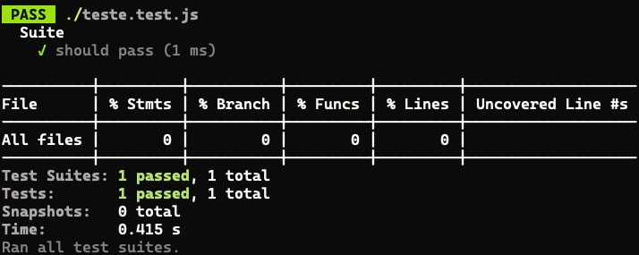
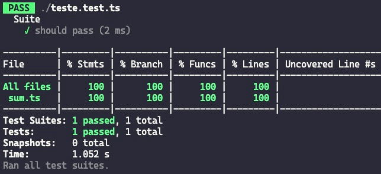

No outro [artigo aqui do blog](/comecando-com-o-node-js-test-runner/) eu comentei como a gente começa com o Node.js Test Runner pra escrever os nossos testes. Muita gente me mandou mensagem perguntando qual é a diferença do Node Test Runner e do [Jest](https://jestjs.io), e como a gente pode começar com o Jest e TypeScript.

Como esse é um tópico que eu tenho que constantemente procurar também, porque as formas de se fazer isso mudam a cada dia, eu vou criar esse artigo com o que **eu acho** que é a forma mais comum de se fazer isso e com a menor quantidade de passos possível.

> [!IMPORTANT] 💡
> Se você quiser dar uma olhada em um repositório pronto com Jest e TypeScript eu sugiro que você olhe o [nosso projeto 3](https://github.com/Formacao-Typescript/projeto-3/tree/jest) da [Formação TS](https://formacaots.com.br).

## Setup

Primeiro de tudo, a principal diferença entre o Node Test Runner e o Jest inicialmente é o fato de que o Jest precisa de muito mais configurações do que o nativo do Node. Isso principalmente porque ele é muito mais antigo, de uma época que tínhamos muito menos coisas no Node do que temos hoje e o TypeScript ainda estava engatinhando.

> O jest foi "oficialmente" lançado em 2016, mas ele já existia desde alguns anos antes internamente dentro do Facebook. Ele foi originalmente criado como uma forma de testar aplicações React sem precisar de muitas configurações, o que é irônico, porque atualmente as configurações do Jest são o maior problema da lib.

Primeiro de tudo, vou assumir que você tem uma pasta em algum lugar da sua máquina, a minha será chamada de `jest`, dentro dela eu só rodei um `npm init -y` para inicializar um projeto Node.js.

Vamos instalar o TypeScript com `npm i -D typescript @types/node` e rodar `npx tsc --init` para inicializar o TypeScript também.

Agora vamos instalar o Jest com `npm i -D jest @types/jest`. Esse é o meu `package.json` até agora:

```json
{
  "name": "jest",
  "version": "0.0.1",
  "main": "index.js",
  "scripts": {
    "test": "echo \"Error: no test specified\" && exit 1"
  },
  "keywords": [],
  "author": "Lucas Santos <hello@lsantos.dev> (https://lsantos.dev/)",
  "license": "GPL-3.0",
  "description": "",
  "devDependencies": {
    "@types/jest": "^29.5.12",
    "@types/node": "^20.14.2",
    "jest": "^29.7.0",
    "typescript": "^5.4.5"
  }
}
```

> Preste atenção nas **versões dos pacotes**, como o Jest é um pacote ativo com muitas atualizações (e, infelizmente, algumas delas não compatíveis com as anteriores) é altamente provável que versões futuras não funcionem da mesma forma como nesse artigo.

<CourseCTA />

Agora, vamos rodar o comando de inicialização do Jest com `npm init jest@latest` (ou `jest@suaversao`). Esse script vai perguntar uma série de coisas:

-   _Quer que o Jest altere o seu arquivo package para adicionar o comando de teste:_ **Y**
-   _Quer usar TS no arquivo de configuração:_ **Y**
-   _Qual é o ambiente de testes:_ **Node**
-   _Quer code coverage:_ **Y**
-   _Qual o provedor de code coverage:_ Aqui vamos usar o **v8** mas você pode usar o babel, não vai fazer muita diferença
-   _Limpar todos os mocks depois de cada teste:_ **N**

Isso vai criar um arquivo chamado `jest.config.ts` na sua raiz, o arquivo todo é bem maior porque tem todas as opções comentadas, eu só vou colocar as opções que estão ativas aqui:

```ts
/**
 * For a detailed explanation regarding each configuration property, visit:
 * https://jestjs.io/docs/configuration
 */

import type {Config} from 'jest';

const config: Config = {
  collectCoverage: true,
  coverageDirectory: "coverage",
  coverageProvider: "v8",
};

export default config;
```

Com isso a gente já deve ter um comando `jest` disponível. Mas se tentarmos usar esse comando em qualquer arquivo de teste, tipo esse aqui:

```js
describe('Suite', () => {
  it('should pass', () => {
    expect(1).toBe(1)
  })
})
```

Ele não vai funcionar, porque o nosso arquivo de configuração é um TypeScript e o Jest não sabe ler TypeScript. E vai nos dar esse erro;

```output
Error: Jest: Failed to parse the TypeScript config file /jest/jest.config.ts
  Error: Jest: 'ts-node' is required for the TypeScript configuration files. Make sure it is installed
Error: Cannot find package 'ts-node' imported from /jest/node_modules/jest-config/build/readConfigFileAndSetRootDir.js
```

## Aplicando o TypeScript

Para podermos aplicar o TypeScript no Jest, vamos fazer o que o erro que a gente recebeu ali em cima disse para nós: instalar o `ts-node`. Podemos fazer isso com `npm i -D ts-node`. Agora podemos usar o Jest para rodar o nosso teste em JavaScript usando `npm test`:



E se a gente mudar esse teste para TS? Então se mantivermos o teste como está e só modificar a extensão para `teste.test.ts` tudo deveria funcionar normalmente, claro, o conteúdo ainda é JavaScript, o que acontece quando a gente usa TypeScript ali dentro? Vamos mudar um pouco o teste:

```ts
import { randomUUID } from 'node:crypto'

describe('Suite', () => {
  it('should pass', () => {
    expect(randomUUID()).toEqual(expect.any(String))
  })
})
```

Sem mexer em mais nada, vamos rodar com `npm test`, e vamos ter um monte de erros. Isso porque o Jest não está usando o TS-Node para parsear o arquivo de testes, só o [babel diretamente](https://jestjs.io/docs/next/getting-started#using-typescript), então temos que configurar o babel para poder fazer isso pra gente. Mas adicionar todas as configurações do babel manualmente é bem chato.

Além de que toda a configuração do Babel é puramente transpilação, não vamos ter type checking, e nem source maps. Vamos usar um pacote chamado `ts-jest` que faz exatamente isso.

Primeiro vamos instalar `npm i -D ts-jest`, a versão que tenho aqui é a `29.1.5`. E agora adicionar as configurações que queremos no nosso arquivo `jest.config.ts`, que são basicamente:

-   Modificar o tipo da configuração para o tipo estendido que o `ts-jest` adiciona
-   Adicionar o preset que queremos

Nosso `jest.config.ts` fica assim:

```ts
import type {JestConfigWithTsJest} from 'ts-jest';

const config: JestConfigWithTsJest = {
    preset: 'ts-jest',
    collectCoverage: true,
    coverageDirectory: "coverage",
    coverageProvider: "v8",
};

export default config;
```

Agora, se rodarmos o nosso teste, ele vai funcionar normalmente. Mas e se a gente fizer uma pequena alteração, e quisermos utilizar [ESM](/os-ecmascript-modules-estao-aqui/)?

## Usando ESModules

Eu sempre recomendo que usemos os ECMAScript Modules em todas as aplicações que a gente desenvolve, se você não está usando essa funcionalidade, então essa seção do tutorial não vai fazer diferença para você, o que você já fez antes é mais do que suficiente pra manter uma aplicação TypeScript com Jest.

Mas se você quer aprender a utilizar o que vai eventualmente ser o único meio de escrever TypeScript, eu recomendo que você use ESM desde já!

Pra começar, vamos trocar o nosso `package.json` e adicionar um `type: "module"`:

```json
{
  "name": "jest",
  "version": "0.0.1",
  "main": "index.js",
  "type": "module", // << Aqui
  "scripts": {
    "test": "jest"
  },
  "keywords": [],
  "author": "Lucas Santos <hello@lsantos.dev> (https://lsantos.dev/)",
  "license": "GPL-3.0",
  "description": "",
  "devDependencies": {
    "@types/jest": "^29.5.12",
    "@types/node": "^20.14.2",
    "jest": "^29.7.0",
    "ts-jest": "^29.1.5",
    "ts-node": "^10.9.2",
    "typescript": "^5.4.5"
  }
}
```

Agora vamos lá no nosso arquivo `tsconfig.json` e vamos modificar duas opções, `module` e `moduleResolution`, ambas serão `NodeNext`, e vamos modificar o `target` para `ESNext`, Essas configurações vão ficar assim:

```json
{
  "compilerOptions": {
    "module": "NodeNext",
    "moduleResolution": "NodeNext",
    "target": "ESNext'
  }
}
```

Se você rodar `npx tsc` esse comando deve criar dois arquivos, um `jest.config.js` e um `teste.test.js` inalterado. Isso significa que tudo funcionou. Agora e os testes? Se rodarmos eles vão passar normalmente, mas e se eu te falar que isso é errado?

Uma coisa interessante do Jest com ESM é que ele consegue resolver todos os pacotes internos do node normalmente, porque esses pacotes não tem nenhuma extensão, por exemplo, quando importamos um `randomUUID` vamos importar de `node:crypto`, mas se a gente importar de outro arquivo, esse arquivo obrigatoriamente tem que ter a extensão `.js`, só que isso não vai acontecer, porque no nosso arquivo fonte, vamos ter apenas o arquivo `.ts`, por exemplo, vamos criar um novo arquivo `sum.ts` na raiz, com o seguinte conteúdo:

```ts
export const sum = (a: number, b: number): number => a + b
```

Se modificarmos o nosso teste para importar e testar essa função, vamos ter um erro:

```ts
import { sum } from './sum.js'

describe('Suite', () => {
  it('should pass', () => {
    expect(sum(1,1)).toBe(2)
  })
})
```

O erro vai dizer que o arquivo não pode ser encontrado, mesmo se modificarmos para `sum.ts`.

### ESM com TypeScript e Jest

Para podermos configurar o Jest corretamente, vamos ter que adicionar algumas outras configurações no nosso arquivo de configuração:

```ts
import type { JestConfigWithTsJest } from 'ts-jest'
const config: JestConfigWithTsJest = {
  collectCoverage: true,
  coverageDirectory: 'coverage',
  coverageProvider: 'v8',
  preset: 'ts-jest/presets/default-esm',
  testPathIgnorePatterns: ['/node_modules/'],
  transform: {},
  moduleNameMapper: {
    '^(\\.{1,2}/.*)\\.js$': '$1'
  },
  testEnvironment: 'node'
}

export default config
```

As configurações mais importantes aqui são `preset` que está agora setado para o `default-esm` que é a configuração padrão do ts-jest para ler ESM. O `transform` que **precisa** ser um objeto vazio, para desligarmos qualquer transformação de TS nativa do Jest.

E o que vai fazer com que o Jest encontre os arquivos `.js`, que é o [`moduleNameMapper`](https://kulshekhar.github.io/ts-jest/docs/getting-started/paths-mapping), que aqui estamos definindo uma RegExp para pegar qualquer caminho que definimos e modificar para `.js`. Vale dizer que essa opção é somente para quando você está usando a opção de paths ou `baseUrl` no `tsconfig`, mas eu gosto de adicionar ela mesmo assim porque já deixamos configurado para outras opções futuras.

Agora, se rodarmos o nosso teste, tudo estará funcionando perfeitamente:


