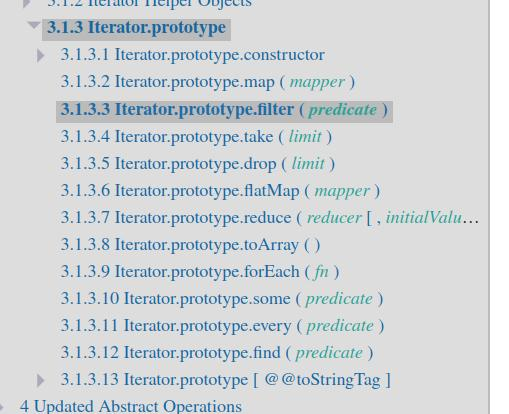

Não muito tempo atrás eu fiz uma série de [previsões para o JS em 2025](/js-2025/), e eu não estava tão longe assim da realidade! O TC39 se reuniu essa semana em Tokyo para poder discutir as propostas que seriam passadas para frente nas próximas versões do JS, essa foi a 104a reunião do comitê desde a sua criação.

Como sempre acontece, o Rob Palmer, que é um dos membros do TC39, posta no seu [Twitter](https://x.com/robpalmer2/status/1843448233340875143?ref_src=twsrc%5Etfw%7Ctwcamp%5Etweetembed%7Ctwterm%5E1843448233340875143%7Ctwgr%5E%7Ctwcon%5Es1_c10&ref_url=https%3A%2F%2Fsocket.dev%2Fblog%2Ftc39-advances-10-ecmascript-proposals-key-features-to-watch) tudo que será discutido durante as reuniões. Este ano as pautas eram:

-   Array.zip
-   Atomics.pause
-   Error.isError
-   Extractors
-   Immutable ArrayBuffer
-   Iterator helpers
-   Math.sumPrecise
-   Promise.try
-   RegExp modifiers
-   Structs

E algumas delas realmente foram passadas para os próximos estágios, nem todas as que eu previ, mas pelo menos 50% delas! Essa foi minha maior taxa de acerto desde sempre! Vamos ver tudo que foi discutido:

## [Iterator helpers](https://github.com/tc39/proposal-iterator-helpers)

Uma proposta que, na verdade, são várias. Aqui estamos falando não só dos helpers (que passaram para o estágio 4 e vão ser implementadas), mas também de outra proposta que eu comentei que poderiam ter avanços.



Essa proposta adiciona uma série de métodos de ajuda em iteradores (como Map, Set e generators), como o `map`, `filter`, `reduce` e muitos outros para transformar o uso de iteradores em algo mais próximo de um array.

Algo que hoje não é muito fácil de entender hoje em dia, porque, por exemplo:

```js
const arr = [1,2,3]
arr.map((v) => v) // ok

const set = new Set([1,2,3])
set.map((v) => v) // erro, não temos map em sets
```

Veja que o Array, que é um iterable, tem `map`, mas o Set não tem, porque, por mais que a principal forma de usar um Set seja através de iterações, ele não é um Iterable.

Além dessa proposta, outra que eu também comentei (que estava em estágio 2) passou para o 2.7, [Iterator Sequencing](https://github.com/tc39/proposal-iterator-sequencing?ref=blog.lsantos.dev). Que permite que a gente crie iterators concatenando outros iterators com `Iterator.concat` assim como fazemos com `Array.concat`.

## [Import attributes](https://github.com/tc39/proposal-import-attributes) & [JSON Modules](http://github.com/tc39/proposal-json-modules)

Agora vamos, finalmente, poder usar o que a gente já estava usando há meses. As duas propostas que modificam a forma que importamos JSON e outros módulos passaram para o estágio 4 e serão implementadas!

Agora poderemos fazer isso:

```js
import json from './arquivo.json' with { type: 'json' }
```

Originalmente as duas propostas eram uma só, mas elas foram separadas. O motivo é que, para os import attributes (o `with`) isso pode abrir oportunidades para que possamos importar outros tipos de arquivos nativamente que não sejam apenas JSON, por exemplo, XML ou CSV.

E então, cada módulo que será importado terá uma nova proposta como os JSON modules tiveram. Isso garante que os engines não tenham implementações específicas para cada coisa, por exemplo, imagina que droga que seria se cada browser lesse JSON de forma diferente...

Ambas as propostas foram passadas e agora teremos uma forma nativa de ler arquivos JSON diretamente do JS, algo que o Node já implementava, mas não era parte da especificação.

## [RegExp Modifiers](https://github.com/tc39/proposal-regexp-modifiers)

Mais uma que passou para o estágio 4. Agora vamos poder usar os modificadores como `/i`, `/m` e outros diretamente nas RegExps do JS. Essa foi uma que eu não sabia que estava sendo votada, eu admito, achei que essa funcionalidade já estivesse presente no engine atual, mas aparentemente não era algo que foi implementado (diferente de todas as linguagens anteriores que implementaram logo de cara... Vai saber)

## [Structs](https://github.com/tc39/proposal-structs)

Essa é uma proposta que eu realmente pensei que não fosse avançar tão rápido. Structs adicionam quatro objetos lógicos no JS:

-   Structs: Objetos com layout fixo que se comportam como classes, mas com algumas restrições que deixam elas mais rápidas e mais fáceis de serem analizadas estaticamente por um compilador
-   Shared Structs: Structs um pouco mais restritas que podem ser acessadas por múltiplas threads em paralelo. Essa estrutura sozinha é responsável por permitir paralelismo de verdade no JS
-   Mutex e Condition: Abstrações para sincronizar acessos à structs compartilhadas
-   Unsafe Blocks: Objetos que dizem onde uma memória não segura pode ser inicializada e trabalhada

A grande ideia dessa proposta começou com Structs, que seriam objetos fixos, que não podem ter mais ou menos campos, o que é incrível porque a maioria dos objetos que usamos são dessa forma. Assim o compilador não precisa otimizar todos os objetos para serem dinâmicos por padrão.

As SharedStructs vão permitir que possamos utilizar objetos que compartilham memória entre arquivos, sem precisar usar Realms ou outras estruturas. Essa proposta acabou de passar para o estágio 2 e agora será o design que vai ser trabalhado!

## [Extractors](https://github.com/tc39/proposal-extractors)

Extractors avançaram para o estágio 2. Eles nada mais são do que uma função que pode ser aplicada quando estamos fazendo um destructuring de um objeto. Isso permite que a gente faça tanto validação quando normalização dos valores, por exemplo, podemos deixar todas as chaves minúsculas:

```js
const LowercaseExtractor = {
  [Symbol.customMatcher](valor) {
    if (typeof valor === 'string') {
      return valor.toLowerCase()
    }
  }
}

const LowercaseExtractor({ nome, rua }) = { nome: 'LUCAS', rua: 'RUA' }
console.log({ nome, rua }) // { nome: 'lucas', rua: 'rua' }
```

## [Promise.try](https://github.com/tc39/proposal-promise-try)

Depois de [8 anos](https://x.com/ljharb/status/1843884468647682382), o Promise.try finalmente entrou em estágio 4 e será implementado na linguagem! Essa aqui eu tinha previsto no outro artigo também!

A grande ideia aqui é algo bem simples, na verdade, quando temos um valor que não sabemos se é ou não uma promise, geralmente enrolamos ele em uma Promise e seguimos a nossa vida:

```js
// Não sabemos se o retorno de F é uma promise ou não
const p = new Promise(resolve => resolve(F()))
// mas p sempre vai ser uma promise
```

Com essa proposta vamos poder mudar esse código para algo como:

```js
await Promise.try(F) // retorna F como promise
```

Isso não é uma forma de rodar funções em paralelo ou de forma assíncrona, ele simplesmente chama função, que antes seria síncrona, de uma forma unificada como uma promise.

## [Error.isError](https://github.com/tc39/proposal-is-error)

Mais uma das que eu tinha previsto que poderiam sair do estágio atual, o `Error.isError` foi para o estágio 2.7 e está aguardando testes e validações. A ideia aqui é bem simples e eu realmente não sei porque não temos isso desde sempre, mas essa proposta permite que façamos algo parecido com o `Array.isArray`, só que com erros:

```js
if (Error.isError(err)) {
  // err é um erro
}}
```

O que vai limitar o uso de `instanceof Error`, já que o `instanceof` pode ser modificado externamente.

# Conclusão

Existem outras propostas que também avançaram, mas sinceramente, não são algumas que vão fazer muita diferença na vida de todo mundo, duas mais interessantes foram o [Array.zip](https://github.com/tc39/proposal-array-zip) e os [Immutable ArrayBuffers](https://github.com/Agoric/tc39-proposal-immutable-arraybuffer) que podem ser modificadas nos próximos dias.

Outras propostas podem ser cotadas para discussão também como:

-   AsyncContext
-   Dataview Clamped Methods
-   Decimal
-   Discard Bindings
-   ESM Phase Imports
-   Explicit Compile Hints
-   Intl.DurationFormat
-   JSSugar
-   Math.emplace
-   Measure Object
-   Observables
-   Porffor
-   Smart Units
-   Temporal

Pelo que eu vi recentemente, o Temporal está em alta e pode realmente ser que ele seja cotado para sair no ano que vem, então vamos observar.
