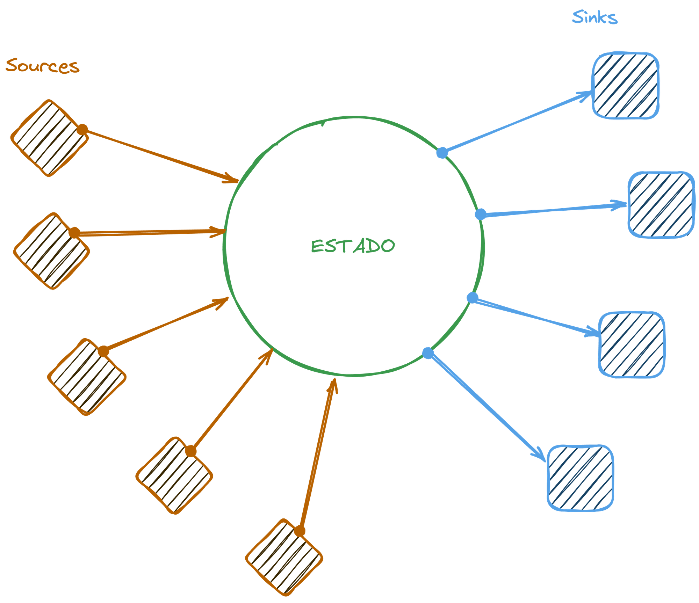
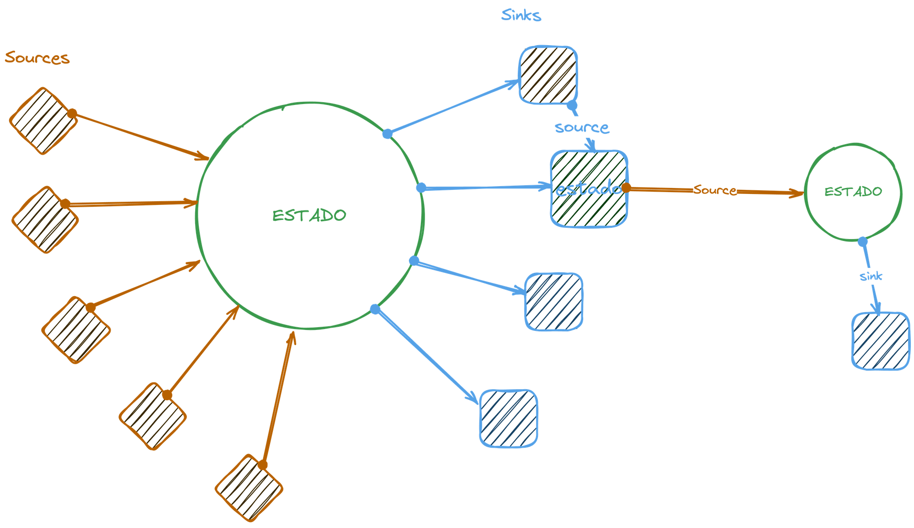
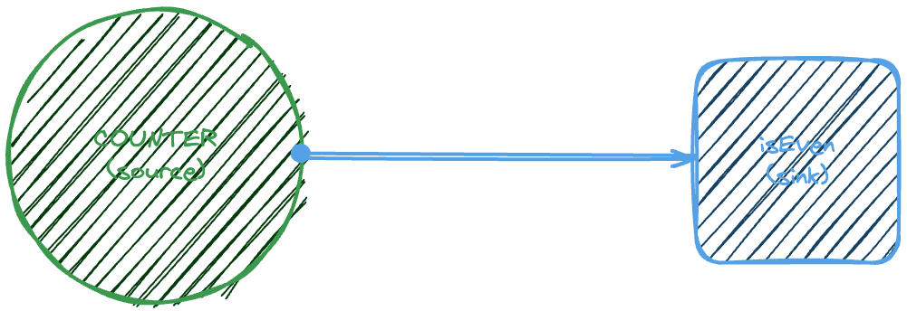
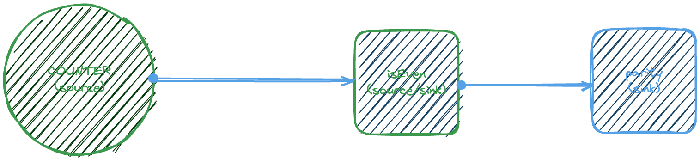
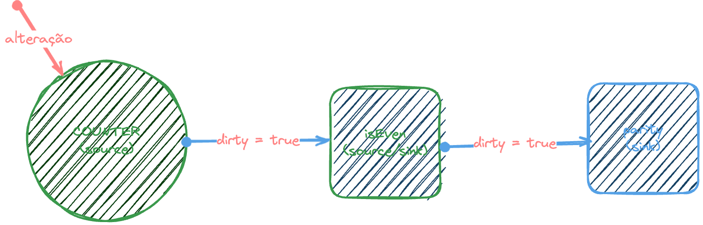

Em 2023 um membro do TC39 chamado [Rob Eisenberg](https://github.com/EisenbergEffect) comentou que ele queria criar um padrão comum para os _signals_ e isso realmente se transformou em uma [proposta](https://github.com/tc39/proposal-signals) lá no TC39!

Mas antes de tudo, o que são signals? O que eles fazem? Qual é a ideia principal? Vamos entender tudo aqui agora!

## O que são signals

Signals são uma espécie de máquina de estado. Quem já fez algum código React deve estar bem acostumado com algo assim:

```js
const [state, setState] = useState()
```

A ideia de um estado é que a gente possa ter um local onde ele é setado originalmente. Muitos lugares onde esse setup é chamado, ou seja, muitos lugares que contribuem para que o valor final desse estado aconteça (que são as chamadas _sources_), e esse valor contribui para o estado de múltiplos subcomponentes (chamados de _sinks_).



Uma sink também pode ser uma source para outro estado ou até mesmo para outra sink, então no geral isso acaba sendo um grafo acíclico que direciona o fluxo de dados em uma única direção:



Se a gente converter isso em código, é como se tivéssemos um estado inicial que pudesse ser alterado por várias fontes, e que também pudesse alterar várias fontes. Por exemplo, na própria sintaxe proposta teríamos isso:

```js
const counter = new Signal.State(0) // useState(0)
```

O counter seria o nosso estado. Diferente do que o react faz com um array de opções, uma com a variável e a função de modificação, o `counter` tem um método `get()` para buscar o valor atual e um `set()` para atualizar:

```js
counter.get() // 0
counter.set(1)
counter.get() // 1
```

Além desse tipo de estado, podemos ter um _sink_, ou seja, um valor que depende desse estado original, portanto o `counter` está agindo como _source_. Um exemplo clássico é termos estados computados, para saber se o valor dentro do counter é par, por exemplo.

No React teríamos que criar algum tipo de memoização:

```js
const [counter, setCounter] = useState(0)
const isEven = useMemo(() => counter % 2 === 0, [counter])
```

No caso dos signals poderíamos usar a propriedade `computed`:

```js
const counter = new Signal.State(0)
const isEven = new Signal.Computed(() => counter.get() % 2 === 0)

counter.get() // 0
isEven.get() // true
counter.set(1) // 1
isEven.get() // false
```

Aqui nosso fluxo de dados vai para um lado só:



Se quisermos adicionar um outro contador para printar o resultado, podemos fazer assim:

```js
const counter = new Signal.State(0)
const isEven = new Signal.Computed(() => counter.get() % 2 === 0)
const parity = new Signal.Computed(() => isEven.get() ? "even" : "odd")

counter.get() // 0
isEven.get() // true
counter.set(1) // 1
isEven.get() // false
```

Agora o `isEven` é ao mesmo tempo uma source e uma sink.



Isso significa que se mudarmos a source original, o `counter`, vamos automaticamente mudar as duas sinks. Basicamente essa é toda a ideia de signals.

## Clean/Dirty states

É bem comum em aplicações que usam formulários, por exemplo, ter um estado chamado de _clean_ e outro estado _dirty_. Clean significa que o formulário não foi alterado, dirty significa que o usuário já fez alguma modificação naquele formulário.

> O Angular.js tinha um outro conceito também chamado de _**pristine** que era a definição quando o componente tinha acabado de ser criado. Uma vez que o usuário modificou ele se tornava dirty, mas se o campo fosse apagado, ele se tornava **clean**, ou seja, **pristine** só poderia ser alcançado no primeiro load._

Por mais que a gente possa fazer tudo que fizemos antes com composição de funções (e não ter esse grafo), a gente teria que recalcular todos os estados a todo o momento, por exemplo, quando eu modifiquei o contador de `0` para `1`, nós automaticamente recalcularíamos todo o estado.

Com esse modelo de grafos, o que podemos fazer é que enviamos um sinal para os _sinks_ dizendo "meu valor foi alterado", e o sink marca que sua source foi alterada, mandando um sinal igual para seus sinks e assim vai.



Se tivermos outros estados com outras sinks, não precisamos recalculá-los porque eles não sofreriam alterações. E também não precisamos ficar constantemente verificando por alterações pelas sinks até as sources. O que acontece é que, uma vez que o valor de, por exemplo, `isEven` for chamado com `isEven.get()`, vamos ver se ele está _dirty_ e executar a função computada e retornar o valor, caso contrário, não vamos precisar recalcular nada.

Esse é um possível código para o que queremos fazer:

```js
let dirty = true
let val

function Computed(fn) {
  if (dirty) {
    val = fn()
    dirty = false
  }
  return val
}
    
```

## Outros usos de signals

Além de utilizá-los com as APIs básicas como essas, o Rob também propõe alguns casos de uso no seu artigo sobre [Signals](https://eisenbergeffect.medium.com/a-tc39-proposal-for-signals-f0bedd37a335), o primeiro deles é usar Signals para criar uma classe auto atualizável:

```js
export class Counter {
  #value = new Signal.State(0);

  get value() {
    return this.#value.get();
  }

  increment() {
    this.#value.set(this.#value.get() + 1);
  }

  decrement() {
    if (this.#value.get() > 0) {
      this.#value.set(this.#value.get() - 1);
    }
  }
}

const c = new Counter();
c.increment();
console.log(c.value);
```

Nesse caso eu vejo pouco valor, porque a gente poderia simplesmente escrever da mesma forma usando:

```js
export class Counter {
  #value = 0

  get value() {
    return this.#value
  }

  increment() {
    this.#value = this.#value + 1;
  }

  decrement() {
    if (this.#value > 0) {
      this.#value = this.#value - 1;
    }
  }
}

const c = new Counter();
c.increment();
console.log(c.value);
```

A gente teria exatamente o mesmo resultado. Mas, claro, esse é um exemplo simples. Quando temos computações complexas dentro de uma classe, faria sentido não ter que executá-las sempre.

Ele também propõe o uso em [decorators](/javascript-decorators/), criando um decorator chamado `signal`:

```js
export function signal(target) {
  const { get } = target;

  return {
    get() {
      return get.call(this).get();
    },

    set(value) {
      get.call(this).set(value);
    },
    
    init(value) {
      return new Signal.State(value);
    },
  };
}
```

E ai utilizando na propriedade da classe:

```js
export class Counter {
  @signal accessor #value = 0;

  get value() {
    return this.#value;
  }

  increment() {
    this.#value++;
  }

  decrement() {
    if (this.#value > 0) {
      this.#value--;
    }
  }
}
```

## Conclusão

Enquanto a proposta ainda está em estágio 1, eu acho que ela pode ter algum avanço até o fim do ano que vem (como eu falei nas minhas [previsões](/js-2025/)), se isso acontecer, todo o modelo de estados do React pode ficar obsoleto, assim como os modelos de estado de todos os frameworks frontend, porque o JS implementaria isso nativamente.

Eu estou particularmente animado com essa possibilidade. E você? Me conta lá nas minhas redes!
